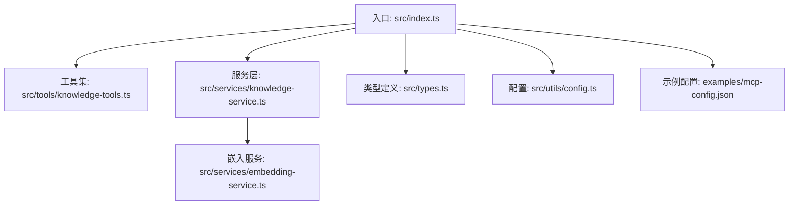
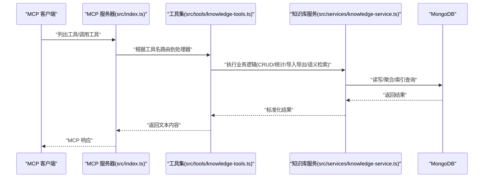
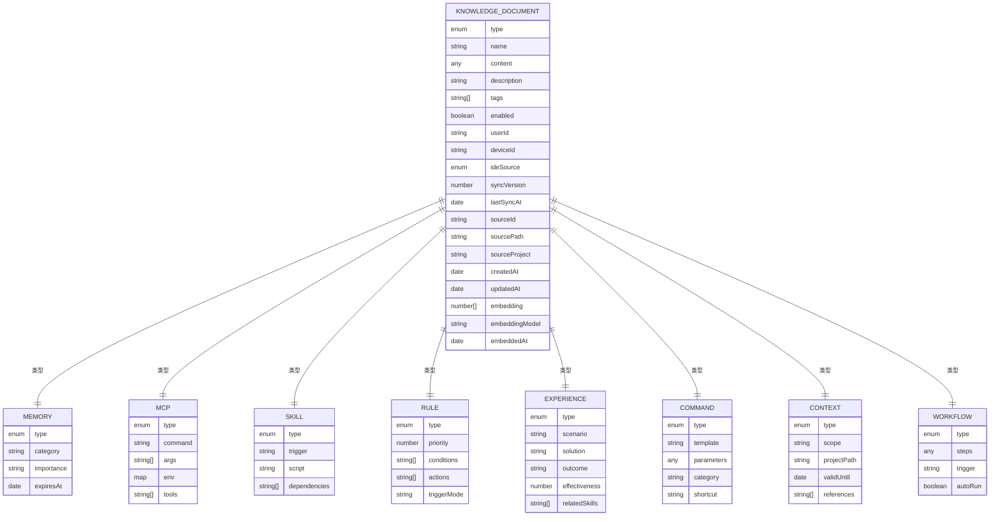
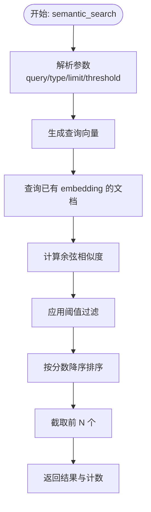
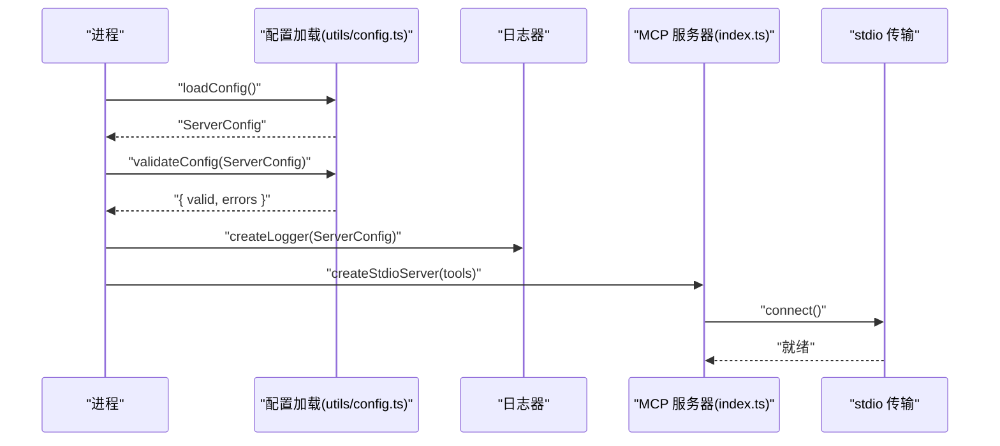
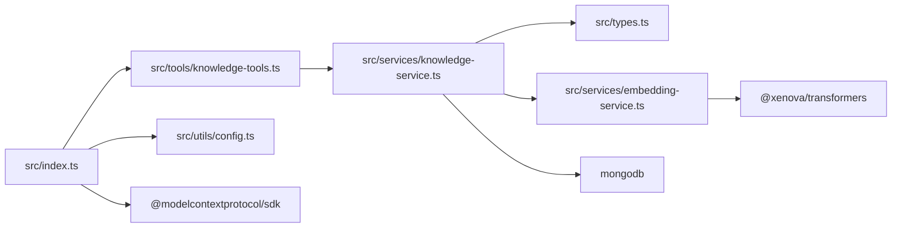

# API 参考

<cite>
**本文引用的文件**
- [package.json](file://package.json)
- [src/index.ts](file://src/index.ts)
- [src/types.ts](file://src/types.ts)
- [src/tools/knowledge-tools.ts](file://src/tools/knowledge-tools.ts)
- [src/services/knowledge-service.ts](file://src/services/knowledge-service.ts)
- [src/services/embedding-service.ts](file://src/services/embedding-service.ts)
- [src/utils/config.ts](file://src/utils/config.ts)
- [examples/mcp-config.json](file://examples/mcp-config.json)
</cite>

## 目录
1. [简介](#简介)
2. [项目结构](#项目结构)
3. [核心组件](#核心组件)
4. [架构总览](#架构总览)
5. [详细组件分析](#详细组件分析)
6. [依赖关系分析](#依赖关系分析)
7. [性能考量](#性能考量)
8. [故障排查指南](#故障排查指南)
9. [结论](#结论)
10. [附录](#附录)

## 简介
本文件为 mongo-mcp 的完整 API 参考，面向 MCP（Model Context Protocol）工具接口与内部服务层，覆盖以下内容：
- MCP 工具接口规范：请求格式、参数定义、响应结构、错误码与使用示例
- 服务器运行模式：基于 @modelcontextprotocol/sdk 的 stdio 模式
- 数据模型与数据库操作：知识库文档类型、字段定义、查询与索引策略
- 嵌入与语义检索：向量嵌入生成、相似度计算与检索流程
- 配置与部署：环境变量、IDE 集成示例与日志策略
- 版本管理与兼容性：包版本、MCP 版本与弃用策略建议
- 客户端 SDK 使用与最佳实践：MCP 客户端集成要点
- 测试与调试：常见问题定位与排障方法

## 项目结构
该仓库采用分层组织方式：
- 入口与服务器：src/index.ts 创建 MCP 服务器，注册工具处理器
- 工具集：src/tools/knowledge-tools.ts 定义所有 MCP 工具及其输入/输出 Schema
- 服务层：src/services/knowledge-service.ts 实现知识库 CRUD、统计、批量导入导出、语义检索与嵌入生成
- 嵌入服务：src/services/embedding-service.ts 使用 @xenova/transformers 生成向量
- 类型定义：src/types.ts 定义知识库文档类型与查询选项
- 配置与日志：src/utils/config.ts 解析环境变量、校验配置与创建日志器
- 示例配置：examples/mcp-config.json 展示不同 IDE 的 MCP 服务器配置

**图表来源**
- [src/index.ts](file://src/index.ts#L1-L148)
- [src/tools/knowledge-tools.ts](file://src/tools/knowledge-tools.ts#L1-L1093)
- [src/services/knowledge-service.ts](file://src/services/knowledge-service.ts#L1-L404)
- [src/services/embedding-service.ts](file://src/services/embedding-service.ts#L1-L148)
- [src/types.ts](file://src/types.ts#L1-L269)
- [src/utils/config.ts](file://src/utils/config.ts#L1-L147)
- [examples/mcp-config.json](file://examples/mcp-config.json#L1-L94)

**章节来源**
- [src/index.ts](file://src/index.ts#L1-L148)
- [package.json](file://package.json#L1-L48)

## 核心组件
- MCP 服务器与传输
  - 使用 @modelcontextprotocol/sdk 的 stdio 传输模式，通过 Server 与 RequestHandler 注册工具
  - 工具列表与调用均基于标准 MCP 请求/响应结构
- 工具集合
  - 通用 CRUD 工具：knowledge_create、knowledge_read、knowledge_update、knowledge_delete、knowledge_list、knowledge_stats、knowledge_upsert
  - 快捷工具：memory_add、memory_search、experience_add、command_add、context_set、mcp_sync、rule_sync、skill_sync、workflow_create
  - 导出工具：knowledge_export
  - 嵌入与语义工具（按需启用）：semantic_search、generate_embeddings
  - 辅助工具：get_user_info
- 服务层
  - KnowledgeService：封装 MongoDB 连接、索引、CRUD、统计、批量导入导出、语义检索与嵌入生成
  - EmbeddingService：基于 Transformers.js 的文本向量提取、余弦相似度计算与批量嵌入
- 类型与配置
  - 知识库文档类型与字段、查询选项、ListOptions、SemanticSearchOptions
  - ServerConfig：从环境变量解析配置、校验与日志器创建

**章节来源**
- [src/index.ts](file://src/index.ts#L16-L82)
- [src/tools/knowledge-tools.ts](file://src/tools/knowledge-tools.ts#L29-L1093)
- [src/services/knowledge-service.ts](file://src/services/knowledge-service.ts#L20-L404)
- [src/services/embedding-service.ts](file://src/services/embedding-service.ts#L11-L148)
- [src/types.ts](file://src/types.ts#L1-L269)
- [src/utils/config.ts](file://src/utils/config.ts#L76-L147)

## 架构总览
mongo-mcp 以 MCP 工具形式暴露知识库能力，运行于 MCP 客户端（如 Claude、Cursor、VS Code 等），通过 stdio 与宿主通信。

**图表来源**
- [src/index.ts](file://src/index.ts#L29-L79)
- [src/tools/knowledge-tools.ts](file://src/tools/knowledge-tools.ts#L72-L106)
- [src/services/knowledge-service.ts](file://src/services/knowledge-service.ts#L111-L127)

## 详细组件分析

### MCP 工具接口规范
- 通用约定
  - 工具名称：以 knowledge_ 前缀的统一命名空间
  - 输入 Schema：严格定义 type、properties、required 字段
  - 输出结构：统一返回 { success: boolean, data?, error?, message? }
  - 错误处理：未知工具、未知错误、重复键（如唯一索引冲突）等
- 工具清单与职责
  - knowledge_create：创建任意类型知识文档
  - knowledge_read：按 type+name 读取文档
  - knowledge_update：更新文档字段
  - knowledge_delete：按 type+name 删除
  - knowledge_list：分页与筛选列表查询
  - knowledge_stats：按类型统计数量
  - knowledge_upsert：存在则更新，否则创建
  - memory_add/memory_search：记忆增删查
  - experience_add：经验（场景、方案、结果、评分）
  - command_add：命令模板与分类
  - context_set：上下文范围与项目路径
  - mcp_sync/rule_sync/skill_sync/workflow_create：同步各类知识到数据库
  - knowledge_export：批量导出
  - get_user_info：获取当前用户/设备/IDE 上下文
  - semantic_search/generate_embeddings（可选）：语义检索与嵌入生成

- 请求与响应示例（路径参考）
  - 创建知识文档
    - 请求路径参考：[createKnowledgeTools 输入 Schema](file://src/tools/knowledge-tools.ts#L40-L71)
    - 成功响应示例：[create 处理器返回](file://src/tools/knowledge-tools.ts#L94-L98)
    - 失败示例（重复名）：[重复名处理](file://src/tools/knowledge-tools.ts#L101-L104)
  - 读取知识文档
    - 请求路径参考：[read 输入 Schema](file://src/tools/knowledge-tools.ts#L113-L127)
    - 成功响应示例：[read 返回数据](file://src/tools/knowledge-tools.ts#L136-L153)
  - 更新知识文档
    - 请求路径参考：[update 输入 Schema](file://src/tools/knowledge-tools.ts#L161-L192)
    - 成功响应示例：[update 返回](file://src/tools/knowledge-tools.ts#L209-L213)
  - 删除知识文档
    - 请求路径参考：[delete 输入 Schema](file://src/tools/knowledge-tools.ts#L221-L235)
    - 成功响应示例：[delete 返回](file://src/tools/knowledge-tools.ts#L240-L243)
  - 列出知识文档
    - 请求路径参考：[list 输入 Schema](file://src/tools/knowledge-tools.ts#L251-L281)
    - 成功响应示例：[list 返回](file://src/tools/knowledge-tools.ts#L294-L307)
  - 统计知识文档
    - 请求路径参考：[stats 输入 Schema](file://src/tools/knowledge-tools.ts#L315-L324)
    - 成功响应示例：[stats 返回](file://src/tools/knowledge-tools.ts#L329-L332)
  - 创建或更新
    - 请求路径参考：[upsert 输入 Schema](file://src/tools/knowledge-tools.ts#L340-L371)
    - 成功响应示例：[upsert 返回](file://src/tools/knowledge-tools.ts#L390-L394)
  - 快捷工具
    - 记忆添加/搜索：[memory_add/memroy_search](file://src/tools/knowledge-tools.ts#L407-L505)
    - 经验添加：[experience_add](file://src/tools/knowledge-tools.ts#L512-L571)
    - 命令添加：[command_add](file://src/tools/knowledge-tools.ts#L577-L635)
    - 上下文设置：[context_set](file://src/tools/knowledge-tools.ts#L641-L694)
    - MCP/规则/技能同步与工作流创建：[mcp_sync/rule_sync/skill_sync/workflow_create](file://src/tools/knowledge-tools.ts#L699-L953)
  - 导出与用户信息
    - 导出：[knowledge_export](file://src/tools/knowledge-tools.ts#L976-L995)
    - 用户信息：[get_user_info](file://src/tools/knowledge-tools.ts#L959-L969)
  - 嵌入与语义检索（可选）
    - 语义检索：[semantic_search](file://src/tools/knowledge-tools.ts#L1006-L1056)
    - 生成嵌入：[generate_embeddings](file://src/tools/knowledge-tools.ts#L1062-L1087)

- 错误码与语义
  - 通用错误：success=false，error 包含错误消息
  - 业务错误：如重复键（唯一索引冲突）时返回对应提示
  - 未知工具：返回 Unknown tool: <name>
  - 服务器异常：捕获错误并返回 { success: false, error }

**章节来源**
- [src/tools/knowledge-tools.ts](file://src/tools/knowledge-tools.ts#L36-L1093)

### 数据模型与数据库操作
- 知识库文档类型
  - 8 种类型：Memories、Skills、Rules、MCPs、Experiences、Commands、Contexts、Workflows
  - 基础字段：type、name、content、description、tags、enabled、userId、deviceId、ideSource、syncVersion、lastSyncAt、sourceId/sourcePath/sourceProject、时间戳、embedding/embeddingModel/embeddedAt
  - 各类型特有字段：如 Memory 的 category/importance/expiresAt、MCP 的 command/args/env/tools、Skill 的 trigger/script/dependencies、Experience 的 scenario/solution/outcome/effectiveness/relatedSkills、Command 的 template/parameters/category/shortcut、Context 的 scope/projectPath/references、Workflow 的 steps/trigger/autoRun
- 查询与索引
  - 用户级唯一索引：(userId, type, name) 唯一
  - 用户+类型/设备/标签/时间索引，支持高效查询与排序
- 服务层能力
  - CRUD：create/get/getById/update/delete
  - 列表与统计：list/count，支持 type/tags/search/limit/offset
  - 批量：bulkImport/bulkExport
  - 语义检索：semanticSearch，基于余弦相似度与阈值
  - 嵌入：generateEmbedding/generateEmbeddings，extractTextForEmbedding
  - upsert：存在则更新，否则创建
  - 用户上下文：getUserContext

**图表来源**
- [src/types.ts](file://src/types.ts#L24-L224)

**章节来源**
- [src/types.ts](file://src/types.ts#L1-L269)
- [src/services/knowledge-service.ts](file://src/services/knowledge-service.ts#L71-L87)
- [src/services/knowledge-service.ts](file://src/services/knowledge-service.ts#L111-L190)
- [src/services/knowledge-service.ts](file://src/services/knowledge-service.ts#L272-L341)

### 嵌入与语义检索
- 嵌入服务
  - 模型懒加载：pipeline('feature-extraction')
  - 文本提取：extractTextForEmbedding，拼接 name/description/content/tags 并截断
  - 批量嵌入：embedBatch，逐条生成
  - 相似度：cosineSimilarity
- 语义检索流程
  - 生成查询向量 -> 过滤已有 embedding 的文档 -> 计算相似度 -> 应用阈值与 limit -> 排序返回

**图表来源**
- [src/tools/knowledge-tools.ts](file://src/tools/knowledge-tools.ts#L1029-L1055)
- [src/services/knowledge-service.ts](file://src/services/knowledge-service.ts#L272-L299)
- [src/services/embedding-service.ts](file://src/services/embedding-service.ts#L56-L104)

**章节来源**
- [src/services/embedding-service.ts](file://src/services/embedding-service.ts#L11-L148)
- [src/services/knowledge-service.ts](file://src/services/knowledge-service.ts#L272-L341)

### 配置与运行
- 环境变量与默认值
  - MONGO_URI、MONGO_DATABASE、MONGO_COLLECTION、USER_ID、DEVICE_ID、IDE_SOURCE、ENABLE_EMBEDDING、LOG_LEVEL
  - DEVICE_ID 默认由主机名与 IDE 源组合生成
- 配置验证
  - 校验 MONGO_URI、DATABASE、COLLECTION 是否为空
- 日志级别
  - debug/info/warn/error，按配置输出
- 运行模式
  - stdio 模式：通过 @modelcontextprotocol/sdk 的 StdioServerTransport 启动
- IDE 集成示例
  - Qoder/Cursor/VS Code/本地开发/云共享等配置样例

**图表来源**
- [src/utils/config.ts](file://src/utils/config.ts#L76-L115)
- [src/index.ts](file://src/index.ts#L87-L129)

**章节来源**
- [src/utils/config.ts](file://src/utils/config.ts#L76-L147)
- [examples/mcp-config.json](file://examples/mcp-config.json#L1-L94)
- [src/index.ts](file://src/index.ts#L16-L82)

## 依赖关系分析
- 外部依赖
  - @modelcontextprotocol/sdk：MCP 协议与传输
  - @xenova/transformers：文本向量提取
  - mongodb：MongoDB 客户端
  - zod：类型校验（在当前代码未直接使用）
- 内部模块耦合
  - index.ts 依赖 tools 与 services，tools 依赖 services，services 依赖 types 与 embedding-service
- 可能的循环依赖
  - 当前结构清晰，无循环依赖迹象

**图表来源**
- [src/index.ts](file://src/index.ts#L1-L12)
- [src/tools/knowledge-tools.ts](file://src/tools/knowledge-tools.ts#L1-L2)
- [src/services/knowledge-service.ts](file://src/services/knowledge-service.ts#L1-L4)
- [src/services/embedding-service.ts](file://src/services/embedding-service.ts#L1-L1)
- [src/types.ts](file://src/types.ts#L1-L1)
- [src/utils/config.ts](file://src/utils/config.ts#L1-L1)

**章节来源**
- [package.json](file://package.json#L30-L43)
- [src/index.ts](file://src/index.ts#L1-L12)

## 性能考量
- 嵌入生成
  - 模型懒加载，首次初始化耗时较高；建议在启动阶段预热或按需生成
  - 批量生成时逐条 embed，可考虑并发优化与缓存策略
- 语义检索
  - 仅对存在 embedding 的文档进行相似度计算，建议定期批量生成嵌入
  - 阈值与 limit 控制结果规模，避免高复杂度扫描
- 数据库
  - 用户级索引设计良好，注意避免全表扫描
  - 大量写入时建议批量导入/导出，减少事务开销

[本节为通用指导，无需特定文件引用]

## 故障排查指南
- 启动失败
  - 检查配置校验错误：MONGO_URI/MONGO_DATABASE/MONGO_COLLECTION 是否缺失
  - 查看日志器输出（按 LOG_LEVEL 过滤）
- 工具调用失败
  - 未知工具：确认工具名是否正确
  - 业务异常：如重复键（唯一索引冲突），检查 type+name 组合
  - 服务器异常：捕获错误并返回 error 字段
- 嵌入与语义检索
  - 未生成嵌入：先执行 generate_embeddings，再进行 semantic_search
  - 结果为空：调整阈值或增加 limit，或检查文档是否包含 embedding 字段
- 连接问题
  - 确认 MongoDB 连接字符串与网络可达性
  - 检查用户上下文（userId/deviceId/ideSource）是否一致

**章节来源**
- [src/utils/config.ts](file://src/utils/config.ts#L96-L115)
- [src/index.ts](file://src/index.ts#L45-L78)
- [src/tools/knowledge-tools.ts](file://src/tools/knowledge-tools.ts#L99-L105)
- [src/services/knowledge-service.ts](file://src/services/knowledge-service.ts#L272-L299)

## 结论
mongo-mcp 提供了完整的 MCP 工具集，覆盖知识库的全生命周期管理，并支持可选的语义检索能力。其架构清晰、模块职责明确，便于在不同 IDE 与环境中部署与扩展。建议在生产环境中启用嵌入与索引策略，结合合理的阈值与限流策略，确保性能与稳定性。

[本节为总结性内容，无需特定文件引用]

## 附录

### API 版本管理与兼容性
- 包版本：参见 package.json 的 version 字段
- MCP 版本：服务器声明的 name/version 与 capabilities
- 兼容性建议
  - 向后兼容：新增字段建议保持可选，避免破坏既有调用
  - 弃用策略：新增字段时保留旧字段一段时间，并在响应中给出提示
  - 版本升级：在 major 版本变更时，提供迁移脚本与配置示例

**章节来源**
- [package.json](file://package.json#L2-L4)
- [src/index.ts](file://src/index.ts#L18-L26)

### 客户端 SDK 使用指南与最佳实践
- MCP 客户端集成要点
  - 使用 examples/mcp-config.json 中的示例配置作为起点，按需修改环境变量
  - 在 IDE 中注册 MCP 服务器，确保命令与 args 正确指向 mongo-mcp
  - 通过 list tools 获取可用工具，按需调用
- 最佳实践
  - 明确用户上下文（USER_ID/DEVICE_ID/IDE_SOURCE），保证跨设备同步一致性
  - 启用 ENABLE_EMBEDDING 时，定期生成嵌入并设置合理阈值
  - 使用 knowledge_export 导出备份，防止意外丢失

**章节来源**
- [examples/mcp-config.json](file://examples/mcp-config.json#L1-L94)
- [src/utils/config.ts](file://src/utils/config.ts#L76-L91)

### API 测试工具与调试方法
- 测试工具
  - 使用 MCP 客户端自带的工具面板列出与调用工具
  - 编写最小化测试用例：创建/读取/更新/删除/列表/统计
- 调试方法
  - 提升 LOG_LEVEL 至 debug，观察详细日志
  - 使用 get_user_info 校验用户上下文
  - 逐步验证嵌入流程：generate_embeddings -> semantic_search

**章节来源**
- [src/tools/knowledge-tools.ts](file://src/tools/knowledge-tools.ts#L959-L969)
- [src/utils/config.ts](file://src/utils/config.ts#L120-L146)