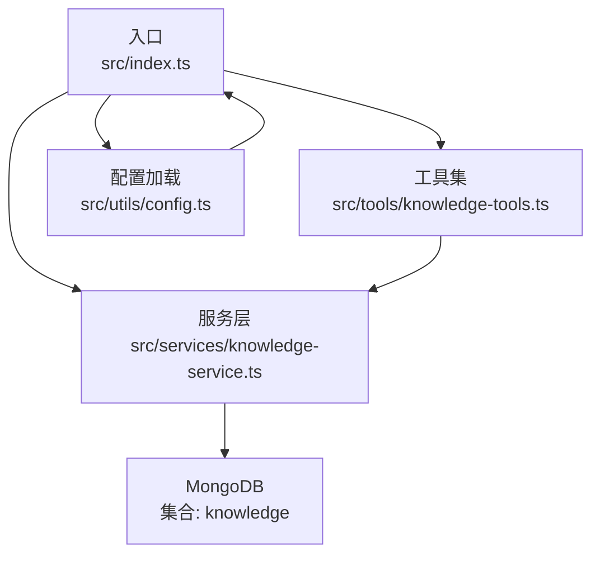
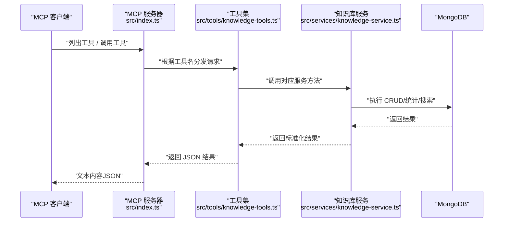
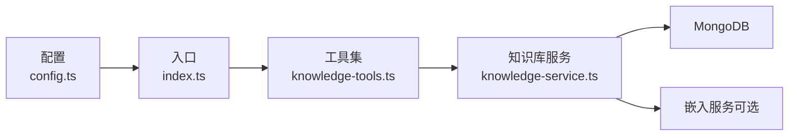

# CRUD 工具集

<cite>
**本文引用的文件**
- [src/tools/knowledge-tools.ts](file://src/tools/knowledge-tools.ts)
- [src/services/knowledge-service.ts](file://src/services/knowledge-service.ts)
- [src/types.ts](file://src/types.ts)
- [src/index.ts](file://src/index.ts)
- [src/utils/config.ts](file://src/utils/config.ts)
- [package.json](file://package.json)
- [examples/mcp-config.json](file://examples/mcp-config.json)
</cite>

## 目录
1. [简介](#简介)
2. [项目结构](#项目结构)
3. [核心组件](#核心组件)
4. [架构总览](#架构总览)
5. [详细组件分析](#详细组件分析)
6. [依赖分析](#依赖分析)
7. [性能考虑](#性能考虑)
8. [故障排查指南](#故障排查指南)
9. [结论](#结论)
10. [附录](#附录)

## 简介
本文件为“CRUD 工具集”的完整 API 文档，聚焦于知识库管理的核心 CRUD 操作工具：knowledge_create、knowledge_read、knowledge_update、knowledge_delete、knowledge_list、knowledge_stats 和 knowledge_upsert。文档覆盖每个工具的请求格式、必需参数、可选参数、响应结构、参数定义、数据类型、验证规则、使用示例、错误处理与最佳实践，并解释工具间的关系与组合使用方式，以及批量操作与高级查询指导。

该工具集基于 Model Context Protocol（MCP）协议，通过标准输入输出（stdio）模式运行，连接 MongoDB 存储层，支持用户隔离与跨终端同步，具备可选的向量嵌入能力以支持语义检索。

## 项目结构
- 入口与服务器：src/index.ts 作为 MCP 服务器入口，负责加载配置、初始化 KnowledgeService 并注册工具。
- 工具定义：src/tools/knowledge-tools.ts 定义了所有 MCP 工具，包括通用 CRUD 工具与快捷工具。
- 服务层：src/services/knowledge-service.ts 实现知识库的增删改查、统计、批量导入导出、语义搜索与嵌入生成。
- 类型定义：src/types.ts 定义了知识库文档类型、字段与查询选项。
- 配置与日志：src/utils/config.ts 提供配置加载、校验与日志工具。
- 示例配置：examples/mcp-config.json 展示了在不同 IDE 中的 MCP 服务器配置方法。
- 依赖与脚本：package.json 定义了运行时依赖、开发依赖与构建脚本。

图表来源
- [src/index.ts](file://src/index.ts#L100-L125)
- [src/tools/knowledge-tools.ts](file://src/tools/knowledge-tools.ts#L29-L32)
- [src/services/knowledge-service.ts](file://src/services/knowledge-service.ts#L20-L40)
- [src/utils/config.ts](file://src/utils/config.ts#L76-L91)

章节来源
- [src/index.ts](file://src/index.ts#L1-L148)
- [src/tools/knowledge-tools.ts](file://src/tools/knowledge-tools.ts#L1-L1093)
- [src/services/knowledge-service.ts](file://src/services/knowledge-service.ts#L1-L404)
- [src/types.ts](file://src/types.ts#L1-L269)
- [src/utils/config.ts](file://src/utils/config.ts#L1-L147)
- [package.json](file://package.json#L1-L48)
- [examples/mcp-config.json](file://examples/mcp-config.json#L1-L94)

## 核心组件
- 知识库服务（KnowledgeService）
  - 负责连接 MongoDB、维护索引、执行 CRUD、统计、批量操作、语义搜索与嵌入生成。
  - 支持用户上下文注入，确保用户隔离与跨设备同步。
- 工具集（MCP 工具）
  - 提供通用 CRUD 工具与快捷工具，统一的输入/输出 Schema 与错误处理。
- 类型系统（Types）
  - 定义知识库文档类型（8 种）、字段、查询选项与派生文档类型。
- 配置系统（Config）
  - 从环境变量加载配置，支持 IDE 来源、日志级别、嵌入开关等。

章节来源
- [src/services/knowledge-service.ts](file://src/services/knowledge-service.ts#L20-L404)
- [src/tools/knowledge-tools.ts](file://src/tools/knowledge-tools.ts#L29-L32)
- [src/types.ts](file://src/types.ts#L6-L74)
- [src/utils/config.ts](file://src/utils/config.ts#L76-L115)

## 架构总览
MCP 服务器启动后，加载配置并连接 MongoDB；随后创建工具集并注册到 MCP 协议中。工具调用最终委托给 KnowledgeService，后者对 MongoDB 执行具体操作，并根据配置决定是否启用嵌入功能。

图表来源
- [src/index.ts](file://src/index.ts#L30-L79)
- [src/tools/knowledge-tools.ts](file://src/tools/knowledge-tools.ts#L72-L106)
- [src/services/knowledge-service.ts](file://src/services/knowledge-service.ts#L111-L127)

## 详细组件分析

### 通用 CRUD 工具

#### knowledge_create
- 工具描述：创建知识文档（支持 8 种类型：Memories、Skills、Rules、MCPs、Experiences、Commands、Contexts、Workflows）。
- 输入 Schema
  - type: 字符串，枚举值来自 ALL_KNOWLEDGE_TYPES
  - name: 字符串，文档名称（同类型下唯一）
  - content: 字符串或对象，文档内容
  - description: 字符串（可选）
  - tags: 字符串数组（可选）
  - enabled: 布尔值，默认 true（可选）
- 必需参数：type、name、content
- 响应结构
  - success: 布尔值
  - data: 包含 id、type、name
  - message: 成功消息
  - 错误：当重复键冲突（11000）时返回特定错误消息
- 使用示例
  - 创建一条规则：type=Rules，name=“安全策略”，content=“禁止在生产环境直接修改数据库”
  - 创建一条命令：type=Commands，name=“部署脚本”，content={ template: “npm run deploy” }
- 最佳实践
  - 为每个 type 的 name 建立唯一性约束，避免重复创建
  - content 建议使用结构化对象以便后续解析
  - 合理使用 tags 与 description 提升检索效率
- 错误处理
  - 重复键冲突：返回“已存在”提示
  - 其他异常：返回错误消息

章节来源
- [src/tools/knowledge-tools.ts](file://src/tools/knowledge-tools.ts#L37-L107)
- [src/services/knowledge-service.ts](file://src/services/knowledge-service.ts#L111-L127)

#### knowledge_read
- 工具描述：按 type 与 name 读取知识文档。
- 输入 Schema
  - type: 字符串，枚举值来自 ALL_KNOWLEDGE_TYPES
  - name: 字符串，文档名称
- 必需参数：type、name
- 响应结构
  - success: 布尔值
  - data: 包含 id、type、name、content、description、tags、enabled、userId、deviceId、ideSource、syncVersion、createdAt、updatedAt
  - 错误：当文档不存在时返回“不存在”提示
- 使用示例
  - 读取 type=Skills 且 name=“自动化测试”的文档
- 最佳实践
  - 在调用前确认文档存在，或在上层逻辑中处理不存在的情况
  - 注意返回字段较多，建议仅在需要时进行二次筛选

章节来源
- [src/tools/knowledge-tools.ts](file://src/tools/knowledge-tools.ts#L109-L155)
- [src/services/knowledge-service.ts](file://src/services/knowledge-service.ts#L132-L139)

#### knowledge_update
- 工具描述：按 type 与 name 更新知识文档的部分字段。
- 输入 Schema
  - type: 字符串，枚举值来自 ALL_KNOWLEDGE_TYPES
  - name: 字符串，文档名称
  - content: 字符串或对象（可选）
  - description: 字符串（可选）
  - tags: 字符串数组（可选）
  - enabled: 布尔值（可选）
- 必需参数：type、name
- 响应结构
  - success: 布尔值
  - data: 包含 id、type、name、syncVersion
  - message: 成功消息
  - 错误：当文档不存在时返回“不存在”提示
- 使用示例
  - 将 type=Rules 且 name=“安全策略”的 enabled 设为 false
- 最佳实践
  - 更新时仅传递需要变更的字段，减少写放大
  - 更新后注意 syncVersion 的变化，用于跨设备同步

章节来源
- [src/tools/knowledge-tools.ts](file://src/tools/knowledge-tools.ts#L157-L215)
- [src/services/knowledge-service.ts](file://src/services/knowledge-service.ts#L155-L177)

#### knowledge_delete
- 工具描述：按 type 与 name 删除知识文档。
- 输入 Schema
  - type: 字符串，枚举值来自 ALL_KNOWLEDGE_TYPES
  - name: 字符串，文档名称
- 必需参数：type、name
- 响应结构
  - success: 布尔值（删除成功为 true）
  - message: 成功或失败消息
- 使用示例
  - 删除 type=Commands 且 name=“部署脚本”的文档
- 最佳实践
  - 删除前进行二次确认，避免误删
  - 对关键文档建议先备份再删除

章节来源
- [src/tools/knowledge-tools.ts](file://src/tools/knowledge-tools.ts#L217-L245)
- [src/services/knowledge-service.ts](file://src/services/knowledge-service.ts#L182-L189)

#### knowledge_list
- 工具描述：列出知识文档，支持按类型、标签、启用状态、关键词搜索、分页。
- 输入 Schema
  - type: 字符串，枚举值来自 ALL_KNOWLEDGE_TYPES（可选）
  - search: 字符串，关键词（可选）
  - tags: 字符串数组（可选）
  - enabled: 布尔值（可选）
  - limit: 数字（可选）
  - offset: 数字（可选）
- 响应结构
  - success: 布尔值
  - data: 文档列表（每项包含 id、type、name、description、tags、enabled、syncVersion、updatedAt）
  - count: 返回条数
- 使用示例
  - 列出所有 enabled=true 的 Commands
  - 搜索包含“部署”的 Memories
- 最佳实践
  - 大量数据时配合 limit 与 offset 实现分页
  - 使用 tags 与 enabled 过滤缩小结果集

章节来源
- [src/tools/knowledge-tools.ts](file://src/tools/knowledge-tools.ts#L247-L309)
- [src/services/knowledge-service.ts](file://src/services/knowledge-service.ts#L195-L216)

#### knowledge_stats
- 工具描述：统计知识文档数量，可按类型统计或全量统计。
- 输入 Schema
  - type: 字符串，枚举值来自 ALL_KNOWLEDGE_TYPES（可选）
- 响应结构
  - success: 布尔值
  - data: 若指定 type，则返回该类型的数量；否则返回各类型的数量映射
- 使用示例
  - 统计所有类型总数
  - 统计 Rules 的数量
- 最佳实践
  - 用于监控与报表生成
  - 与 knowledge_list 结合，评估数据增长趋势

章节来源
- [src/tools/knowledge-tools.ts](file://src/tools/knowledge-tools.ts#L311-L334)
- [src/services/knowledge-service.ts](file://src/services/knowledge-service.ts#L221-L239)

#### knowledge_upsert
- 工具描述：存在则更新，不存在则创建（按 type 与 name 唯一）。
- 输入 Schema
  - type: 字符串，枚举值来自 ALL_KNOWLEDGE_TYPES
  - name: 字符串，文档名称
  - content: 字符串或对象，文档内容
  - description: 字符串（可选）
  - tags: 字符串数组（可选）
  - enabled: 布尔值，默认 true（可选）
- 必需参数：type、name、content
- 响应结构
  - success: 布尔值
  - data: 包含 id、type、name、syncVersion
  - message: 成功消息
- 使用示例
  - 保存一条新的经验：type=Experiences，name=“首次部署”，content={ scenario: "...", solution: "...", effectiveness: 5 }
- 最佳实践
  - 适合幂等写入场景
  - content 建议结构化，便于后续解析与检索

章节来源
- [src/tools/knowledge-tools.ts](file://src/tools/knowledge-tools.ts#L336-L399)
- [src/services/knowledge-service.ts](file://src/services/knowledge-service.ts#L384-L402)

### 快捷工具与高级功能

#### 批量与高级查询
- 批量导出（knowledge_export）
  - 输入：type（可选）
  - 输出：data 为文档数组，count 为数量
- 语义搜索（semantic_search）
  - 依赖：需先生成嵌入（见下）
  - 输入：query（必需）、type（可选）、limit（可选，默认 10）、threshold（可选，默认 0.3）
  - 输出：data 为匹配文档列表（含 score），count 为数量
- 生成嵌入（generate_embeddings）
  - 输入：type（可选）
  - 输出：message 与 data.count

章节来源
- [src/tools/knowledge-tools.ts](file://src/tools/knowledge-tools.ts#L972-L1089)
- [src/services/knowledge-service.ts](file://src/services/knowledge-service.ts#L265-L341)

## 依赖分析
- 工具到服务的依赖
  - 所有工具均通过 KnowledgeService 执行数据库操作，耦合度低，职责清晰。
- 服务到数据库的依赖
  - KnowledgeService 依赖 MongoDB 驱动，维护用户级唯一索引与常用查询索引。
- 配置到运行时的依赖
  - 配置通过环境变量加载，支持 IDE 来源、日志级别、嵌入开关等。
- 外部依赖
  - MCP SDK、MongoDB、向量化模型（可选）

图表来源
- [src/tools/knowledge-tools.ts](file://src/tools/knowledge-tools.ts#L29-L32)
- [src/services/knowledge-service.ts](file://src/services/knowledge-service.ts#L20-L40)
- [src/utils/config.ts](file://src/utils/config.ts#L76-L91)
- [src/index.ts](file://src/index.ts#L104-L122)

章节来源
- [src/tools/knowledge-tools.ts](file://src/tools/knowledge-tools.ts#L1-L1093)
- [src/services/knowledge-service.ts](file://src/services/knowledge-service.ts#L1-L404)
- [src/utils/config.ts](file://src/utils/config.ts#L1-L147)
- [src/index.ts](file://src/index.ts#L1-L148)
- [package.json](file://package.json#L30-L43)

## 性能考虑
- 索引设计
  - 用户级唯一索引（type + name 唯一）：避免重复创建
  - 用户 + 类型、用户 + 设备、标签、时间排序索引：提升查询与排序性能
- 查询优化
  - 使用 tags、enabled、search 等过滤条件缩小结果集
  - 分页使用 limit 与 offset，避免一次性返回大量数据
- 写入优化
  - knowledge_upsert 与 knowledge_update 仅更新必要字段，减少写放大
  - 批量导入/导出用于大规模迁移与备份
- 嵌入性能
  - 语义搜索依赖嵌入，建议按类型批量生成嵌入，避免逐条计算
  - 控制阈值与 limit，平衡召回率与性能

章节来源
- [src/services/knowledge-service.ts](file://src/services/knowledge-service.ts#L71-L87)
- [src/services/knowledge-service.ts](file://src/services/knowledge-service.ts#L195-L216)
- [src/services/knowledge-service.ts](file://src/services/knowledge-service.ts#L244-L267)
- [src/services/knowledge-service.ts](file://src/services/knowledge-service.ts#L272-L299)
- [src/services/knowledge-service.ts](file://src/services/knowledge-service.ts#L313-L341)

## 故障排查指南
- 连接问题
  - 确认 MONGO_URI、DATABASE、COLLECTION 配置正确
  - 检查网络连通性与认证信息
- 工具调用错误
  - 检查必需参数是否缺失
  - 查看返回的 error 字段，定位具体原因
- 唯一性冲突
  - knowledge_create 与 knowledge_upsert 在重复 name 时会报错
  - 建议使用 knowledge_upsert 或先检查是否存在
- 嵌入功能未生效
  - 确认 ENABLE_EMBEDDING 为 true
  - 先执行 generate_embeddings，再进行 semantic_search

章节来源
- [src/utils/config.ts](file://src/utils/config.ts#L96-L115)
- [src/tools/knowledge-tools.ts](file://src/tools/knowledge-tools.ts#L99-L105)
- [src/tools/knowledge-tools.ts](file://src/tools/knowledge-tools.ts#L395-L397)
- [src/tools/knowledge-tools.ts](file://src/tools/knowledge-tools.ts#L1000-L1089)

## 结论
本 CRUD 工具集提供了统一、规范的知识库管理能力，覆盖基础 CRUD、统计、批量与高级查询。通过明确的输入/输出 Schema、完善的错误处理与最佳实践建议，能够满足从个人到团队的多样化需求。结合嵌入能力与跨设备同步机制，进一步提升了知识库的智能化与可移植性。

## 附录

### 参数定义与数据类型
- 知识类型（KnowledgeType）
  - 枚举值：Memories、Skills、Rules、MCPs、Experiences、Commands、Contexts、Workflows
- 文档字段（部分）
  - _id: ObjectId（可选）
  - type: KnowledgeType
  - name: 字符串
  - content: 字符串或对象
  - description: 字符串（可选）
  - tags: 字符串数组（可选）
  - enabled: 布尔值（默认 true）
  - userId/deviceId/ideSource: 字符串（用户与设备标识）
  - syncVersion: 数字（同步版本）
  - createdAt/updatedAt: 日期
  - embedding/embeddingModel/embeddedAt: 数组/字符串/日期（嵌入相关，可选）

章节来源
- [src/types.ts](file://src/types.ts#L6-L74)

### 使用示例与最佳实践
- 创建与更新
  - 使用 knowledge_create 或 knowledge_upsert 保存内容
  - 使用 knowledge_update 仅更新必要字段
- 查询与统计
  - 使用 knowledge_list 配合 tags、enabled、search、limit、offset
  - 使用 knowledge_stats 监控数据规模
- 批量与高级
  - 使用 knowledge_export 导出数据
  - 使用 semantic_search 与 generate_embeddings 实现语义检索

章节来源
- [src/tools/knowledge-tools.ts](file://src/tools/knowledge-tools.ts#L37-L399)
- [src/tools/knowledge-tools.ts](file://src/tools/knowledge-tools.ts#L972-L1089)

### 配置参考
- 环境变量
  - MONGO_URI、MONGO_DATABASE、MONGO_COLLECTION、USER_ID、DEVICE_ID、IDE_SOURCE、ENABLE_EMBEDDING、LOG_LEVEL
- IDE 配置示例
  - Qoder、Cursor、VS Code、本地开发、云数据库共享等

章节来源
- [src/utils/config.ts](file://src/utils/config.ts#L76-L91)
- [examples/mcp-config.json](file://examples/mcp-config.json#L1-L94)