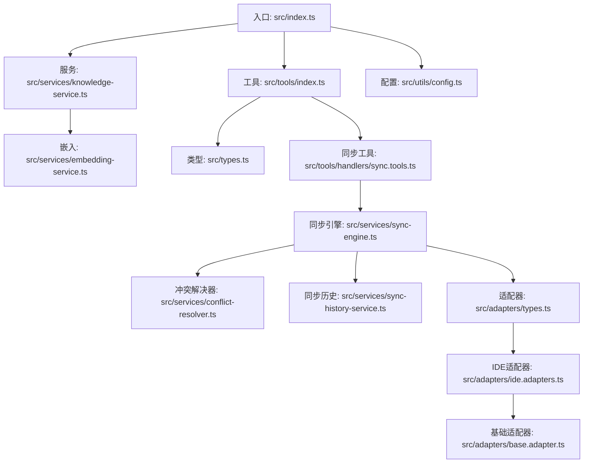
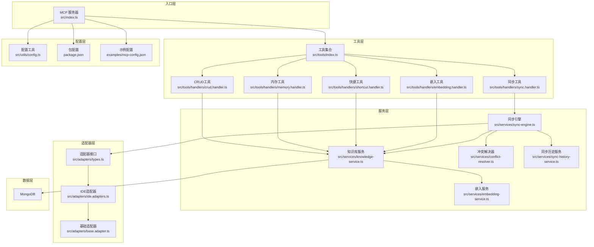
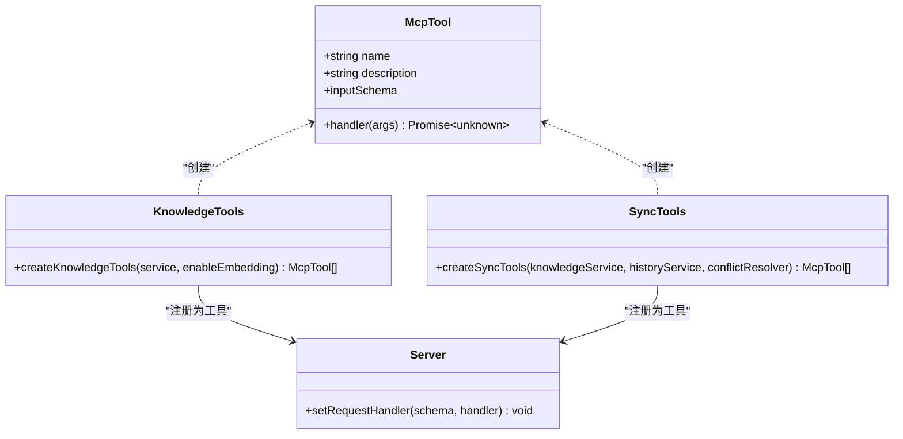
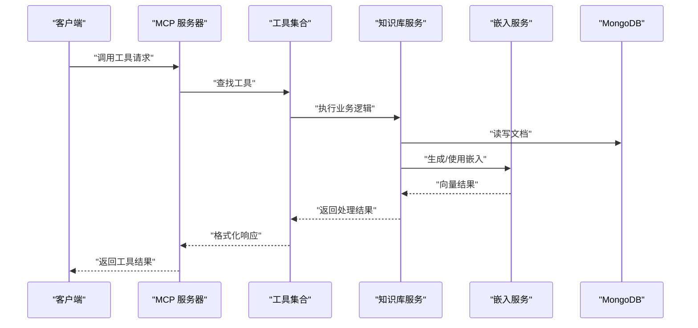
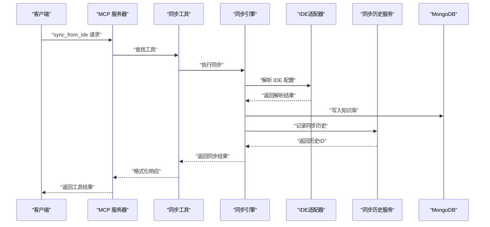
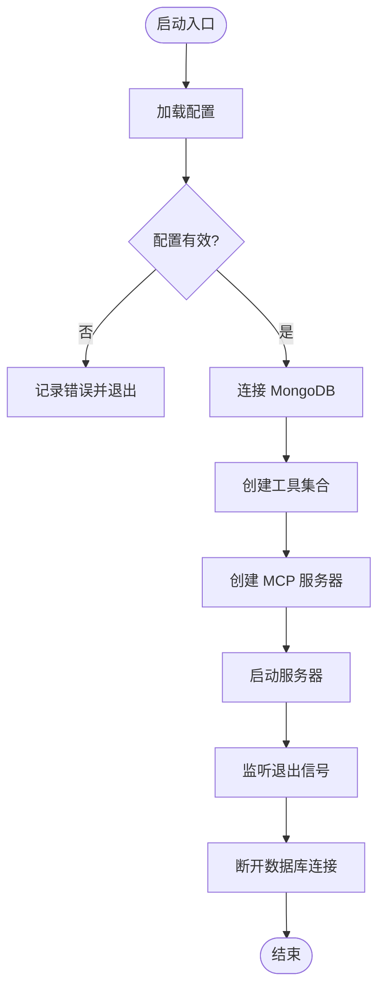
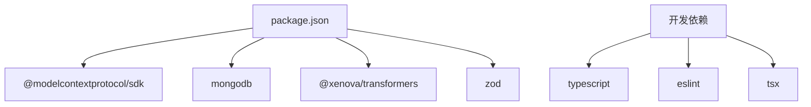

# MCP 工具概览

<cite>
**本文档引用的文件**
- [src/index.ts](file://src/index.ts)
- [src/tools/index.ts](file://src/tools/index.ts)
- [src/tools/handlers/sync.handler.ts](file://src/tools/handlers/sync.handler.ts)
- [src/tools/handlers/sync.tools.ts](file://src/tools/handlers/sync.tools.ts)
- [src/services/sync-engine.ts](file://src/services/sync-engine.ts)
- [src/services/conflict-resolver.ts](file://src/services/conflict-resolver.ts)
- [src/services/sync-history-service.ts](file://src/services/sync-history-service.ts)
- [src/adapters/types.ts](file://src/adapters/types.ts)
- [src/adapters/ide.adapters.ts](file://src/adapters/ide.adapters.ts)
- [src/adapters/base.adapter.ts](file://src/adapters/base.adapter.ts)
- [src/types/sync.types.ts](file://src/types/sync.types.ts)
- [src/services/knowledge-service.ts](file://src/services/knowledge-service.ts)
- [src/services/embedding-service.ts](file://src/services/embedding-service.ts)
- [src/utils/config.ts](file://src/utils/config.ts)
- [src/types.ts](file://src/types.ts)
- [package.json](file://package.json)
- [examples/mcp-config.json](file://examples/mcp-config.json)
- [temp-skills/README.md](file://temp-skills/README.md)
- [temp-skills/skills/algorithmic-art/README.md](file://temp-skills/skills/algorithmic-art/README.md)
- [temp-skills/skills/brand-guidelines/README.md](file://temp-skills/skills/brand-guidelines/README.md)
- [temp-skills/skills/canvas-design/README.md](file://temp-skills/skills/canvas-design/README.md)
</cite>

## 目录
1. [简介](#简介)
2. [项目结构](#项目结构)
3. [核心组件](#核心组件)
4. [架构总览](#架构总览)
5. [详细组件分析](#详细组件分析)
6. [依赖关系分析](#依赖关系分析)
7. [性能考虑](#性能考虑)
8. [故障排除指南](#故障排除指南)
9. [结论](#结论)
10. [附录](#附录)

## 简介
本文件为 MCP（Model Context Protocol）工具系统的概览文档，面向开发者与使用者，系统介绍工具集合的分类、功能、使用场景与扩展方式。该系统基于 MongoDB 构建知识库，提供统一的 MCP 工具接口，支持记忆、技能、规则、MCP 配置、经验、命令、上下文、工作流等八类知识文档的增删改查与快捷操作，并内置向量嵌入能力以支持语义检索与智能推荐。**新增的同步工具集**支持跨 IDE 的配置同步，包括从 IDE 同步到知识库、从知识库同步到 IDE、双向同步以及冲突解决等功能。

## 项目结构
项目采用分层组织方式：
- 入口与协议适配：入口文件负责创建 MCP 服务器、注册工具、处理请求。
- 工具层：定义标准工具接口与具体工具实现，涵盖通用 CRUD、快捷工具和**新增的同步工具**。
- 服务层：知识库服务封装 MongoDB 访问、索引管理、批量导入导出、语义搜索与嵌入生成，**新增同步引擎、冲突解决器和同步历史服务**。
- 嵌入服务：基于 Transformers.js 的轻量化嵌入生成与相似度计算。
- 适配器层：**新增 IDE 适配器系统**，支持 VSCode、Cursor、Windsurf、Trae 等 IDE 的配置解析与生成。
- 工具类型：定义八类知识文档的数据模型与查询选项。
- 配置工具：从环境变量加载与校验运行配置，提供日志工具。
- 示例与技能：提供 IDE 配置示例与 Agent Skills 相关资源参考。



**图表来源**
- [src/index.ts](file://src/index.ts#L1-L148)
- [src/tools/index.ts](file://src/tools/index.ts#L1-L57)
- [src/tools/handlers/sync.tools.ts](file://src/tools/handlers/sync.tools.ts#L1-L359)
- [src/services/sync-engine.ts](file://src/services/sync-engine.ts#L1-L451)
- [src/services/conflict-resolver.ts](file://src/services/conflict-resolver.ts#L1-L351)
- [src/services/sync-history-service.ts](file://src/services/sync-history-service.ts#L1-L254)
- [src/adapters/types.ts](file://src/adapters/types.ts#L1-L133)
- [src/adapters/ide.adapters.ts](file://src/adapters/ide.adapters.ts#L1-L304)
- [src/adapters/base.adapter.ts](file://src/adapters/base.adapter.ts#L1-L255)

**章节来源**
- [src/index.ts](file://src/index.ts#L1-L148)
- [src/tools/index.ts](file://src/tools/index.ts#L1-L57)
- [package.json](file://package.json#L1-L48)

## 核心组件
- MCP 工具接口：标准化工具名称、描述、输入模式与处理器函数，确保工具注册与调用的一致性。
- 知识库服务：提供连接、索引、CRUD、统计、批量导入导出、语义搜索与嵌入生成等能力。
- 嵌入服务：基于 Transformers.js 的特征提取与余弦相似度计算，支持懒加载与批量处理。
- **同步引擎**：协调知识库与 IDE 配置之间的双向同步，支持冲突检测与解决。
- **冲突解决器**：处理跨设备/IDE 同步时的内容冲突，支持多种解决策略。
- **同步历史服务**：记录和查询同步操作历史，提供统计分析功能。
- **IDE 适配器系统**：支持多种 IDE 的配置解析与生成，包括 VSCode、Cursor、Windsurf、Trae 等。
- 配置与日志：从环境变量加载配置，进行基础校验，并按日志级别输出。
- 工具集合：包含通用 CRUD 工具、快捷工具和**新增的同步工具**三大类，覆盖知识库管理的高频场景。

**章节来源**
- [src/tools/handlers/sync.tools.ts](file://src/tools/handlers/sync.tools.ts#L1-L359)
- [src/services/sync-engine.ts](file://src/services/sync-engine.ts#L1-L451)
- [src/services/conflict-resolver.ts](file://src/services/conflict-resolver.ts#L1-L351)
- [src/services/sync-history-service.ts](file://src/services/sync-history-service.ts#L1-L254)
- [src/adapters/types.ts](file://src/adapters/types.ts#L1-L133)
- [src/types.ts](file://src/types.ts#L1-L269)

## 架构总览
系统采用"入口服务器 + 工具集 + 服务层"的分层架构。入口文件创建 MCP 服务器，注册工具列表与调用处理器；工具通过知识库服务访问 MongoDB；嵌入服务按需初始化并参与语义搜索与嵌入生成。**新增的同步工具通过同步引擎协调知识库与 IDE 配置的交互，适配器系统负责不同 IDE 的配置格式转换。**



**图表来源**
- [src/index.ts](file://src/index.ts#L1-L148)
- [src/tools/index.ts](file://src/tools/index.ts#L1-L57)
- [src/tools/handlers/sync.tools.ts](file://src/tools/handlers/sync.tools.ts#L1-L359)
- [src/services/sync-engine.ts](file://src/services/sync-engine.ts#L1-L451)
- [src/services/conflict-resolver.ts](file://src/services/conflict-resolver.ts#L1-L351)
- [src/services/sync-history-service.ts](file://src/services/sync-history-service.ts#L1-L254)
- [src/adapters/types.ts](file://src/adapters/types.ts#L1-L133)
- [src/adapters/ide.adapters.ts](file://src/adapters/ide.adapters.ts#L1-L304)
- [src/adapters/base.adapter.ts](file://src/adapters/base.adapter.ts#L1-L255)

## 详细组件分析

### 工具接口与注册机制
- 工具接口定义：包含名称、描述、输入模式（JSON Schema）、处理器函数四要素，确保工具的可发现性与可调用性。
- 注册机制：入口文件创建 MCP 服务器并注册工具列表与调用处理器；工具列表由工具集合函数返回，调用处理器根据名称路由到对应工具的处理器。
- **模块化改进**：工具现在分为多个专门的处理器文件，每个处理器负责一类工具，便于维护和扩展。
- 动态管理：当前实现通过工厂函数一次性创建工具数组；若需动态添加，可在工厂函数中扩展或引入外部配置注入。



**图表来源**
- [src/tools/index.ts](file://src/tools/index.ts#L23-L47)
- [src/tools/handlers/sync.tools.ts](file://src/tools/handlers/sync.tools.ts#L12-L17)
- [src/index.ts](file://src/index.ts#L16-L82)

**章节来源**
- [src/tools/index.ts](file://src/tools/index.ts#L1-L57)
- [src/tools/handlers/sync.tools.ts](file://src/tools/handlers/sync.tools.ts#L1-L359)
- [src/index.ts](file://src/index.ts#L16-L82)

### 工具分类与功能概述

#### 通用 CRUD 工具
- knowledge_create：创建知识文档，支持八类知识类型，自动注入用户上下文与时间戳。
- knowledge_read：按类型与名称读取文档，返回完整元数据。
- knowledge_update：按类型与名称更新文档，支持增量更新与同步版本递增。
- knowledge_delete：按类型与名称删除文档。
- knowledge_list：按类型、标签、启用状态、关键词搜索与分页列出文档。
- knowledge_stats：统计各类知识文档数量。
- knowledge_upsert：存在则更新，不存在则创建，简化业务逻辑。

适用场景
- 知识库初始化与维护
- 多终端同步与版本控制
- 结构化知识的批量导入导出

**章节来源**
- [src/tools/index.ts](file://src/tools/index.ts#L29-L39)
- [src/services/knowledge-service.ts](file://src/services/knowledge-service.ts#L111-L402)

#### 快捷工具
- memory_add：快速添加记忆，自动推断分类标签。
- memory_search：按关键词与分类搜索记忆，默认返回前 10 条。
- experience_add：添加经验（含场景、方案、结果、评分），便于最佳实践沉淀。
- command_add：添加快捷命令模板，支持分类与快捷别名。
- context_set：设置上下文（项目/领域/全局），支持项目路径与标签。
- mcp_sync：同步 MCP 配置到数据库，便于跨 IDE 管理。
- rule_sync：同步规则到数据库，支持优先级与触发方式。

适用场景
- 开发者日常知识沉淀与检索
- 团队知识共享与上下文传递
- 规则驱动的工作流与自动化

**章节来源**
- [src/tools/handlers/sync.handler.ts](file://src/tools/handlers/sync.handler.ts#L9-L194)
- [src/services/knowledge-service.ts](file://src/services/knowledge-service.ts#L384-L402)

#### **新增的同步工具集**
- sync_from_ide：从指定 IDE 同步配置到知识库（Pull），支持 qoder、cursor、vscode、windsurf、trae。
- sync_to_ide：从知识库同步配置到指定 IDE（Push），支持类型过滤与配置路径指定。
- sync_bidirectional：与指定 IDE 进行双向同步（先 Pull 后 Push）。
- sync_status：获取当前同步状态摘要，包括待同步、冲突、已同步数量。
- detect_ides：检测当前系统中可用的 IDE 配置及其配置路径。
- list_conflicts：列出所有未解决的同步冲突。
- resolve_conflict：解决同步冲突，支持 keep_local、keep_remote、merge 等策略。
- sync_history：查看同步历史记录，支持按状态和数量限制查询。

适用场景
- 跨 IDE 配置同步与管理
- 多设备间知识库同步
- 冲突检测与解决
- 同步历史追踪与分析

**更新** 新增的同步工具集提供了完整的 IDE 配置同步解决方案

**章节来源**
- [src/tools/handlers/sync.tools.ts](file://src/tools/handlers/sync.tools.ts#L19-L357)
- [src/services/sync-engine.ts](file://src/services/sync-engine.ts#L65-L270)

### 数据模型与类型系统
系统定义了八类知识文档的统一接口与专用接口，确保数据一致性与扩展性。**新增了同步相关的数据模型**，包括同步状态、冲突记录、历史记录等。

```mermaid
classDiagram
class KnowledgeDocument {
+ObjectId _id
+KnowledgeType type
+string name
+string|object content
+string description
+string[] tags
+boolean enabled
+string userId
+string deviceId
+SourceType ideSource
+number syncVersion
+Date lastSyncAt
+string sourcePath
+string sourceProject
+Date createdAt
+Date updatedAt
+string createdBy
+string updatedBy
+number[] embedding
+string embeddingModel
+Date embeddedAt
}
class SyncStatus {
<<enumeration>>
"synced"|"pending"|"conflict"|"local_only"
}
class SyncHistory {
+ObjectId _id
+string userId
+string deviceId
+SourceType ideSource
+SyncDirection direction
+SyncOperation operation
+ObjectId documentId
+KnowledgeType documentType
+string documentName
+number fromVersion
+number toVersion
+string changeSummary
+"success"|"failed"|"partial"
+string errorMessage
+Date startedAt
+Date completedAt
+number durationMs
}
class SyncConflict {
+ObjectId _id
+string userId
+ObjectId documentId
+KnowledgeType documentType
+string documentName
+localSnapshot
+remoteSnapshot
+"unresolved"|"resolved"|"ignored"
+string resolution
+string resolvedContent
+string resolvedBy
+Date resolvedAt
+Date detectedAt
}
KnowledgeDocument <|-- SyncHistory
KnowledgeDocument <|-- SyncConflict
```

**图表来源**
- [src/types.ts](file://src/types.ts#L24-L224)
- [src/types/sync.types.ts](file://src/types/sync.types.ts#L7-L184)

**章节来源**
- [src/types.ts](file://src/types.ts#L1-L269)
- [src/types/sync.types.ts](file://src/types/sync.types.ts#L1-L218)

### 服务层：知识库服务
- 连接与索引：建立 MongoDB 连接并创建用户级唯一索引、类型查询索引、标签索引与时间排序索引。
- 用户上下文：统一注入 userId、deviceId、ideSource，实现跨终端同步。
- CRUD 与统计：提供 create、get、update、delete、list、count、exists、upsert 等方法。
- 批量操作：支持批量导入与导出。
- 语义搜索：基于嵌入向量的余弦相似度检索，支持阈值与数量限制。
- 嵌入生成：按需生成文档嵌入，支持单个与批量生成。



**图表来源**
- [src/index.ts](file://src/index.ts#L41-L79)
- [src/tools/index.ts](file://src/tools/index.ts#L29-L39)
- [src/services/knowledge-service.ts](file://src/services/knowledge-service.ts#L111-L402)
- [src/services/embedding-service.ts](file://src/services/embedding-service.ts#L56-L104)

**章节来源**
- [src/services/knowledge-service.ts](file://src/services/knowledge-service.ts#L1-L404)
- [src/services/embedding-service.ts](file://src/services/embedding-service.ts#L1-L148)

### **新增的服务层：同步服务**
- **同步引擎**：协调知识库与 IDE 配置之间的双向同步，支持冲突检测与解决，提供同步状态统计。
- **冲突解决器**：处理跨设备/IDE 同步时的内容冲突，支持多种解决策略（keep_local、keep_remote、merge、manual）。
- **同步历史服务**：记录和查询同步操作历史，提供统计分析功能，支持 TTL 自动清理。
- **IDE 适配器系统**：支持多种 IDE 的配置解析与生成，包括 VSCode、Cursor、Windsurf、Trae 等。



**图表来源**
- [src/tools/handlers/sync.tools.ts](file://src/tools/handlers/sync.tools.ts#L39-L57)
- [src/services/sync-engine.ts](file://src/services/sync-engine.ts#L65-L172)
- [src/services/sync-history-service.ts](file://src/services/sync-history-service.ts#L79-L122)
- [src/adapters/ide.adapters.ts](file://src/adapters/ide.adapters.ts#L38-L71)

**章节来源**
- [src/services/sync-engine.ts](file://src/services/sync-engine.ts#L1-L451)
- [src/services/conflict-resolver.ts](file://src/services/conflict-resolver.ts#L1-L351)
- [src/services/sync-history-service.ts](file://src/services/sync-history-service.ts#L1-L254)
- [src/adapters/types.ts](file://src/adapters/types.ts#L1-L133)

### 配置与启动流程
- 配置加载：从环境变量解析 MongoDB 连接串、数据库与集合名、用户与设备标识、IDE 来源、嵌入开关与日志级别。
- 配置校验：验证必要字段，失败时记录错误并退出。
- 服务器启动：创建 MCP 服务器，注册工具列表与调用处理器，连接传输层，监听信号优雅退出。
- 知识库初始化：创建知识库服务实例，连接数据库，创建工具集合，启动服务器。



**图表来源**
- [src/index.ts](file://src/index.ts#L87-L145)
- [src/utils/config.ts](file://src/utils/config.ts#L76-L115)

**章节来源**
- [src/index.ts](file://src/index.ts#L87-L145)
- [src/utils/config.ts](file://src/utils/config.ts#L1-L147)

### 扩展性与工具注册
- 工具扩展点：在工具工厂函数中新增工具对象，遵循 McpTool 接口规范，即可被服务器自动发现与调用。
- **模块化改进**：工具现在分为多个专门的处理器文件，便于维护和扩展。
- 输入模式：通过 JSON Schema 定义输入参数，支持枚举、必填与复杂嵌套结构。
- 处理器函数：异步处理业务逻辑，返回结构化结果，便于 MCP 客户端消费。
- 动态注册：当前实现为静态工厂；若需动态注册，可引入配置文件或远程配置中心，按需注入工具集合。

**更新** 工具处理器的模块化改进提高了代码的可维护性和扩展性

**章节来源**
- [src/tools/index.ts](file://src/tools/index.ts#L1-L57)
- [src/index.ts](file://src/index.ts#L29-L79)

## 依赖关系分析
- 运行时依赖：@modelcontextprotocol/sdk（MCP 协议实现）、mongodb（数据库驱动）、@xenova/transformers（嵌入模型）、zod（类型校验）。
- 开发依赖：TypeScript、ESLint、TSX（开发与热重载）。
- Node 版本要求：>= 18.0.0。



**图表来源**
- [package.json](file://package.json#L30-L47)

**章节来源**
- [package.json](file://package.json#L1-L48)

## 性能考虑
- 嵌入模型懒加载：首次使用时加载模型，避免启动时长；模型加载完成后复用实例。
- 批量嵌入：提供批量生成接口，减少多次往返开销。
- 查询优化：针对用户维度建立复合索引，支持类型、标签、时间排序与全文检索。
- 语义搜索阈值：通过阈值过滤低相关度结果，提升响应质量与速度。
- **同步性能优化**：同步引擎支持批量处理、冲突策略配置、自动备份等，提升同步效率。
- **历史记录清理**：同步历史服务支持 TTL 自动清理，避免历史数据无限增长。
- 日志级别：按配置输出不同级别的日志，避免生产环境过度打印。

**更新** 新增了同步相关的性能考虑

**章节来源**
- [src/services/embedding-service.ts](file://src/services/embedding-service.ts#L24-L51)
- [src/services/sync-engine.ts](file://src/services/sync-engine.ts#L22-L27)
- [src/services/sync-history-service.ts](file://src/services/sync-history-service.ts#L69-L73)
- [src/utils/config.ts](file://src/utils/config.ts#L120-L146)

## 故障排除指南
- 配置无效：检查必要字段（MONGO_URI、MONGO_DATABASE、MONGO_COLLECTION）是否正确设置。
- 数据库连接失败：确认 MongoDB 地址可达、认证配置正确、网络策略允许访问。
- 工具调用异常：查看工具处理器返回的错误信息，确认输入参数符合 JSON Schema。
- 嵌入服务初始化慢：首次加载模型需要时间，后续请求将受益于缓存；可预热或调整模型。
- 服务器无法启动：检查端口占用、权限与 Node 版本，查看日志输出定位问题。
- **同步冲突**：使用 `list_conflicts` 和 `resolve_conflict` 工具解决冲突，选择合适的解决策略。
- **IDE 适配器问题**：使用 `detect_ides` 工具检测可用的 IDE 配置，确认配置文件路径正确。
- **同步历史查询**：使用 `sync_history` 工具查看同步历史，按状态和数量限制查询。

**更新** 新增了同步相关的故障排除指南

**章节来源**
- [src/utils/config.ts](file://src/utils/config.ts#L96-L115)
- [src/index.ts](file://src/index.ts#L141-L144)
- [src/services/embedding-service.ts](file://src/services/embedding-service.ts#L42-L51)
- [src/tools/handlers/sync.tools.ts](file://src/tools/handlers/sync.tools.ts#L217-L357)

## 结论
本 MCP 工具系统以 MongoDB 为核心，提供统一的工具接口与丰富的知识管理能力。**通过新增的同步工具集和模块化的工具处理器**，系统现在支持完整的跨 IDE 配置同步解决方案，包括冲突检测与解决、同步历史追踪等功能。通过清晰的分层架构、完善的类型系统与可扩展的工具注册机制，开发者可以快速构建与扩展知识库工具集。结合嵌入服务与语义搜索，系统能够支持更智能的知识检索与推荐场景。

## 附录

### 工具清单与适用场景速览
- 通用 CRUD：知识库初始化、维护与同步
- 快捷工具：记忆、经验、命令、上下文与规则的快速录入与检索
- **新增同步工具**：跨 IDE 配置同步、冲突解决、历史追踪
- 语义搜索：基于嵌入的相似度检索，提升知识发现效率

**更新** 新增了同步工具的适用场景说明

**章节来源**
- [src/tools/index.ts](file://src/tools/index.ts#L29-L39)
- [src/tools/handlers/sync.tools.ts](file://src/tools/handlers/sync.tools.ts#L19-L357)
- [src/services/knowledge-service.ts](file://src/services/knowledge-service.ts#L272-L299)

### IDE 配置示例
- Qoder、Cursor、VS Code 与本地开发的 MCP 服务器配置示例，展示如何通过环境变量传递用户、设备与数据库信息。

**章节来源**
- [examples/mcp-config.json](file://examples/mcp-config.json#L1-L94)

### Agent Skills 相关资源
- 仓库 README 与技能示例，展示 Agent Skills 的能力边界与最佳实践，便于理解工具系统的生态与扩展方向。

**章节来源**
- [temp-skills/README.md](file://temp-skills/README.md#L1-L95)
- [temp-skills/skills/algorithmic-art/README.md](file://temp-skills/skills/algorithmic-art/README.md#L1-L405)
- [temp-skills/skills/brand-guidelines/README.md](file://temp-skills/skills/brand-guidelines/README.md#L1-L74)
- [temp-skills/skills/canvas-design/README.md](file://temp-skills/skills/canvas-design/README.md#L1-L130)

### **新增的同步工具详细说明**
- **sync_from_ide**：从指定 IDE 同步配置到知识库，支持多种 IDE 格式解析，自动检测冲突并应用冲突策略。
- **sync_to_ide**：从知识库同步配置到指定 IDE，支持类型过滤与配置路径指定，自动备份现有配置。
- **sync_bidirectional**：双向同步，先从 IDE 拉取配置，再推送到 IDE，适合需要保持两端完全一致的场景。
- **sync_status**：获取当前同步状态摘要，包括待同步、冲突、已同步数量，便于监控同步健康状况。
- **detect_ides**：检测系统中可用的 IDE 配置，返回检测到的 IDE 列表及其配置路径。
- **list_conflicts**：列出所有未解决的同步冲突，支持按类型过滤，便于批量处理。
- **resolve_conflict**：解决同步冲突，支持多种解决策略，包括保留本地、保留远程、合并等。
- **sync_history**：查看同步历史记录，支持按状态和数量限制查询，便于审计和问题排查。

**更新** 新增了同步工具的详细功能说明

**章节来源**
- [src/tools/handlers/sync.tools.ts](file://src/tools/handlers/sync.tools.ts#L19-L357)
- [src/services/sync-engine.ts](file://src/services/sync-engine.ts#L65-L319)
- [src/services/conflict-resolver.ts](file://src/services/conflict-resolver.ts#L147-L217)
- [src/services/sync-history-service.ts](file://src/services/sync-history-service.ts#L127-L178)