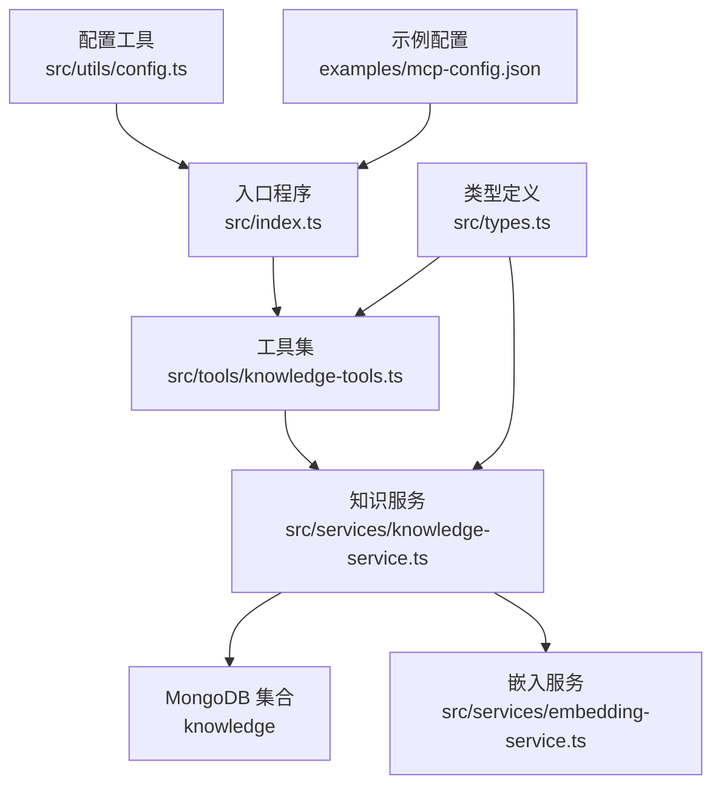
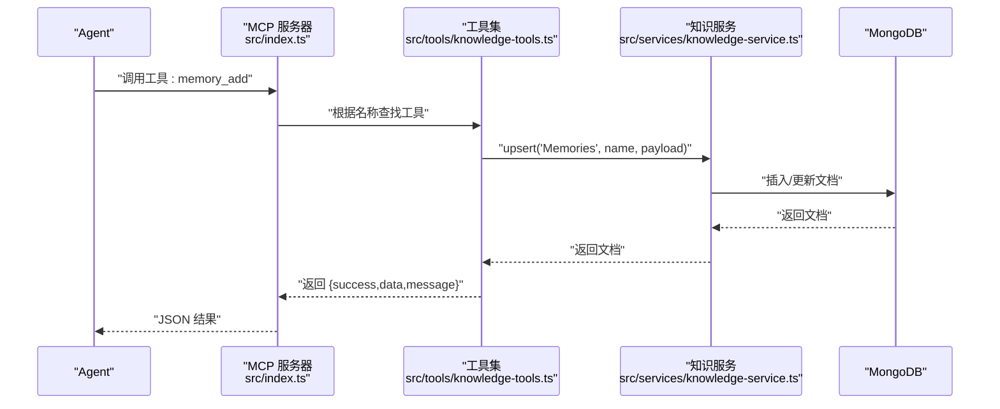
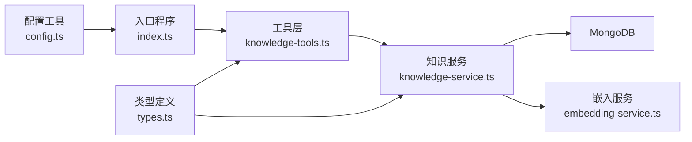

# 快捷工具集

<cite>
**本文引用的文件**
- [src/tools/knowledge-tools.ts](file://src/tools/knowledge-tools.ts)
- [src/services/knowledge-service.ts](file://src/services/knowledge-service.ts)
- [src/services/embedding-service.ts](file://src/services/embedding-service.ts)
- [src/types.ts](file://src/types.ts)
- [src/index.ts](file://src/index.ts)
- [src/utils/config.ts](file://src/utils/config.ts)
- [examples/mcp-config.json](file://examples/mcp-config.json)
- [package.json](file://package.json)
</cite>

## 目录
1. [简介](#简介)
2. [项目结构](#项目结构)
3. [核心组件](#核心组件)
4. [架构总览](#架构总览)
5. [详细组件分析](#详细组件分析)
6. [依赖关系分析](#依赖关系分析)
7. [性能考量](#性能考量)
8. [故障排查指南](#故障排查指南)
9. [结论](#结论)
10. [附录](#附录)

## 简介
本文件面向“快捷工具集”的使用者与维护者，系统化梳理并规范以下快捷工具的 API 规范与使用方法：memory_add、memory_search、experience_add、command_add、context_set、mcp_sync 与 rule_sync。文档同时阐述这些快捷工具与通用 CRUD 工具的关系与差异，给出输入校验规则、错误处理机制、组合使用模式与工作流程，并提供实际使用案例与最佳实践建议。

## 项目结构
该仓库采用分层架构：入口程序负责启动 MCP 服务器并注册工具；工具层封装了快捷工具与通用 CRUD 工具；服务层提供知识库的持久化与检索能力；类型层定义了知识库文档结构与字段约束；嵌入服务层提供语义搜索所需的向量能力。

图表来源
- [src/index.ts](file://src/index.ts#L1-L148)
- [src/tools/knowledge-tools.ts](file://src/tools/knowledge-tools.ts#L1-L1093)
- [src/services/knowledge-service.ts](file://src/services/knowledge-service.ts#L1-L404)
- [src/services/embedding-service.ts](file://src/services/embedding-service.ts#L1-L148)
- [src/types.ts](file://src/types.ts#L1-L269)
- [src/utils/config.ts](file://src/utils/config.ts#L1-L147)
- [examples/mcp-config.json](file://examples/mcp-config.json#L1-L94)

章节来源
- [src/index.ts](file://src/index.ts#L1-L148)
- [src/tools/knowledge-tools.ts](file://src/tools/knowledge-tools.ts#L1-L1093)
- [src/services/knowledge-service.ts](file://src/services/knowledge-service.ts#L1-L404)
- [src/services/embedding-service.ts](file://src/services/embedding-service.ts#L1-L148)
- [src/types.ts](file://src/types.ts#L1-L269)
- [src/utils/config.ts](file://src/utils/config.ts#L1-L147)
- [examples/mcp-config.json](file://examples/mcp-config.json#L1-L94)

## 核心组件
- 快捷工具集：围绕“记忆、经验、命令、上下文、MCP、规则”等知识类型的常用操作进行封装，简化调用与参数组织。
- 通用 CRUD 工具集：提供统一的 create、read、update、delete、list、stats、upsert 等能力，覆盖所有八种知识类型。
- 知识服务：封装 MongoDB 的连接、索引、CRUD、统计、批量导入导出、语义搜索与嵌入生成等能力。
- 嵌入服务：基于 Transformers.js 的特征提取，提供文本向量生成与相似度计算。
- 类型系统：定义八种知识类型及其文档结构，确保字段约束与扩展性。
- 配置与入口：从环境变量加载配置，启动 MCP 服务器并注册工具。

章节来源
- [src/tools/knowledge-tools.ts](file://src/tools/knowledge-tools.ts#L1-L1093)
- [src/services/knowledge-service.ts](file://src/services/knowledge-service.ts#L1-L404)
- [src/services/embedding-service.ts](file://src/services/embedding-service.ts#L1-L148)
- [src/types.ts](file://src/types.ts#L1-L269)
- [src/utils/config.ts](file://src/utils/config.ts#L1-L147)
- [src/index.ts](file://src/index.ts#L1-L148)

## 架构总览
快捷工具集在工具层对知识服务进行二次封装，将通用 CRUD 与具体业务字段进行映射，形成更贴近使用场景的 API。当启用嵌入时，还会动态注入语义搜索与嵌入生成功能。

图表来源
- [src/index.ts](file://src/index.ts#L40-L79)
- [src/tools/knowledge-tools.ts](file://src/tools/knowledge-tools.ts#L403-L460)
- [src/services/knowledge-service.ts](file://src/services/knowledge-service.ts#L384-L402)

章节来源
- [src/index.ts](file://src/index.ts#L1-L148)
- [src/tools/knowledge-tools.ts](file://src/tools/knowledge-tools.ts#L1-L1093)
- [src/services/knowledge-service.ts](file://src/services/knowledge-service.ts#L1-L404)

## 详细组件分析

### 快捷工具概览与关系
- 快捷工具：memory_add、memory_search、experience_add、command_add、context_set、mcp_sync、rule_sync。
- 通用 CRUD 工具：knowledge_create、knowledge_read、knowledge_update、knowledge_delete、knowledge_list、knowledge_stats、knowledge_upsert。
- 关系与差异：
  - 快捷工具是对通用 CRUD 的“领域化封装”，内部通常调用 upsert 并将业务字段映射到标准文档结构。
  - 通用 CRUD 工具提供“类型 + 名称 + 内容”的通用接口，适合批量迁移、统一管理与跨类型操作。
  - 快捷工具提供更少的参数、更强的业务语义，便于 Agent 快速调用。

章节来源
- [src/tools/knowledge-tools.ts](file://src/tools/knowledge-tools.ts#L36-L334)
- [src/tools/knowledge-tools.ts](file://src/tools/knowledge-tools.ts#L401-L822)

### memory_add（添加记忆）
- 功能：快速添加一条记忆，支持分类、重要程度与标签。
- 输入参数
  - name: 字符串，必填
  - content: 字符串，必填
  - category: 字符串，可选（作为 description 与标签来源）
  - importance: 枚举 "low"|"medium"|"high"，可选
  - tags: 字符串数组，可选
- 业务逻辑
  - 将 category 映射为 description；若未提供 tags 且存在 category，则自动生成标签。
  - 内部调用 upsert('Memories', name, ...)。
- 输出
  - 成功：返回 { success: true, data: { id, name }, message }
  - 失败：返回 { success: false, error }
- 错误处理
  - 数据库异常（如重复键）会捕获并返回错误消息。
- 使用场景
  - 存储对话历史、用户偏好、事实信息等。
- 最佳实践
  - 为相同主题的记忆使用一致的 category，便于后续按类别检索。
  - importance 仅用于辅助排序与筛选，不改变存储结构。

章节来源
- [src/tools/knowledge-tools.ts](file://src/tools/knowledge-tools.ts#L403-L460)
- [src/services/knowledge-service.ts](file://src/services/knowledge-service.ts#L384-L402)
- [src/types.ts](file://src/types.ts#L77-L88)

### memory_search（搜索记忆）
- 功能：按关键词搜索记忆，支持按分类过滤与数量限制。
- 输入参数
  - keyword: 字符串，必填
  - category: 字符串，可选
  - limit: 数字，默认 10，可选
- 业务逻辑
  - 若提供 category，转换为标签过滤；内部调用 list('Memories', search, tags, limit)。
- 输出
  - 成功：返回 { success: true, data: [...], count }
  - 失败：返回 { success: false, error }
- 错误处理
  - 查询异常返回错误消息。
- 使用场景
  - 在对话中快速召回相关记忆片段。
- 最佳实践
  - 为记忆打上语义明确的标签，提升检索效果。

章节来源
- [src/tools/knowledge-tools.ts](file://src/tools/knowledge-tools.ts#L462-L506)
- [src/services/knowledge-service.ts](file://src/services/knowledge-service.ts#L195-L216)

### experience_add（添加经验）
- 功能：添加一条经验（场景、方案、结果、有效性评分），用于最佳实践沉淀。
- 输入参数
  - name: 字符串，必填
  - scenario: 字符串，必填
  - solution: 字符串，必填
  - outcome: 字符串，可选
  - effectiveness: 数字枚举 1|2|3|4|5，可选
  - tags: 字符串数组，可选
- 业务逻辑
  - 将 scenario 作为 description；content 为 { scenario, solution, outcome, effectiveness }。
  - 内部调用 upsert('Experiences', name, ...)。
- 输出
  - 成功：返回 { success: true, data: { id, name }, message }
  - 失败：返回 { success: false, error }
- 使用场景
  - 团队知识库沉淀成功案例与复用策略。
- 最佳实践
  - 为经验打上领域标签，便于跨项目复用。

章节来源
- [src/tools/knowledge-tools.ts](file://src/tools/knowledge-tools.ts#L508-L571)
- [src/types.ts](file://src/types.ts#L137-L152)

### command_add（添加命令）
- 功能：添加一个快捷命令或模板，支持描述、快捷别名、分类与标签。
- 输入参数
  - name: 字符串，必填
  - template: 字符串，必填
  - description: 字符串，可选
  - shortcut: 字符串，可选
  - category: 字符串，可选
  - tags: 字符串数组，可选
- 业务逻辑
  - content 为 { template, shortcut, category }；若未提供 tags 且存在 category，则自动生成标签。
  - 内部调用 upsert('Commands', name, ...)。
- 输出
  - 成功：返回 { success: true, data: { id, name }, message }
  - 失败：返回 { success: false, error }
- 使用场景
  - 快速生成重复性任务的模板与别名。
- 最佳实践
  - 为常用命令设置 shortcut，便于 Agent 快速调用。

章节来源
- [src/tools/knowledge-tools.ts](file://src/tools/knowledge-tools.ts#L573-L635)
- [src/types.ts](file://src/types.ts#L155-L174)

### context_set（设置上下文）
- 功能：设置上下文信息，支持范围（项目/领域/全局）、项目路径与标签。
- 输入参数
  - name: 字符串，必填
  - content: 字符串，必填
  - scope: 枚举 "project"|"domain"|"global"，默认 "global"
  - projectPath: 字符串，可选
  - tags: 字符串数组，可选
- 业务逻辑
  - content 为 { text, scope, projectPath }；description 为 "scope context"；tags 默认为 [scope]。
  - 内部调用 upsert('Contexts', name, ...)。
- 输出
  - 成功：返回 { success: true, data: { id, name }, message }
  - 失败：返回 { success: false, error }
- 使用场景
  - 为不同项目或领域设定上下文，提升 Agent 的理解与输出质量。
- 最佳实践
  - 为全局上下文设置 scope="global"，为项目上下文设置 projectPath。

章节来源
- [src/tools/knowledge-tools.ts](file://src/tools/knowledge-tools.ts#L637-L694)
- [src/types.ts](file://src/types.ts#L177-L190)

### mcp_sync（同步 MCP 配置）
- 功能：将 MCP 配置同步到数据库，便于 Agent 发现与调用。
- 输入参数
  - name: 字符串，必填
  - command: 字符串，必填
  - args: 字符串数组，可选
  - env: 对象，可选
  - description: 字符串，可选
  - tools: 字符串数组，可选
- 业务逻辑
  - content 为 { command, args, env, tools }；内部调用 upsert('MCPs', name, ...)。
- 输出
  - 成功：返回 { success: true, data: { id, name }, message }
  - 失败：返回 { success: false, error }
- 使用场景
  - 将外部 MCP 服务注册到知识库，供 Agent 调用。
- 最佳实践
  - 为 MCP 配置提供清晰的 description 与 tools 列表，便于 Agent 选择。

章节来源
- [src/tools/knowledge-tools.ts](file://src/tools/knowledge-tools.ts#L696-L758)
- [src/types.ts](file://src/types.ts#L91-L104)

### rule_sync（同步规则）
- 功能：将规则同步到数据库，支持优先级与触发方式。
- 输入参数
  - name: 字符串，必填
  - content: 字符串，必填
  - description: 字符串，可选
  - priority: 数字，可选（数字越小优先级越高）
  - triggerMode: 枚举 "always_on"|"auto_attached"|"agent_requested"|"manual"，可选
  - tags: 字符串数组，可选
- 业务逻辑
  - content 为 { text, priority, triggerMode }；内部调用 upsert('Rules', name, ...)。
- 输出
  - 成功：返回 { success: true, data: { id, name }, message }
  - 失败：返回 { success: false, error }
- 使用场景
  - 将行为约束与触发策略固化到知识库，供 Agent 执行时参考。
- 最佳实践
  - 为规则设置合理的 priority 与 triggerMode，避免冲突。

章节来源
- [src/tools/knowledge-tools.ts](file://src/tools/knowledge-tools.ts#L760-L822)
- [src/types.ts](file://src/types.ts#L121-L134)

### 与通用 CRUD 工具的关系与区别
- 关系
  - 快捷工具内部普遍使用 upsert，统一走知识服务的 create/update 流程。
  - 通用 CRUD 工具提供更底层的接口，适合批量迁移、跨类型查询与统计。
- 区别
  - 快捷工具参数更少、语义更强；通用 CRUD 工具参数更全、适用面更广。
  - 快捷工具对业务字段做了标准化映射，减少调用方心智负担。

章节来源
- [src/tools/knowledge-tools.ts](file://src/tools/knowledge-tools.ts#L36-L334)
- [src/tools/knowledge-tools.ts](file://src/tools/knowledge-tools.ts#L401-L822)
- [src/services/knowledge-service.ts](file://src/services/knowledge-service.ts#L111-L177)

### 输入验证规则与错误处理
- 输入验证
  - 快捷工具均声明 required 字段；部分字段限定枚举值（如 importance、effectiveness、scope、triggerMode）。
  - 通用 CRUD 工具对 type、name、content 等进行必填校验。
- 错误处理
  - 工具层捕获异常并返回 { success: false, error }。
  - 对于重复键（如 name/type 组合重复）返回明确提示。
  - 服务器层对未知工具名返回错误消息。

章节来源
- [src/tools/knowledge-tools.ts](file://src/tools/knowledge-tools.ts#L40-L106)
- [src/tools/knowledge-tools.ts](file://src/tools/knowledge-tools.ts#L113-L154)
- [src/tools/knowledge-tools.ts](file://src/tools/knowledge-tools.ts#L161-L214)
- [src/tools/knowledge-tools.ts](file://src/tools/knowledge-tools.ts#L222-L244)
- [src/tools/knowledge-tools.ts](file://src/tools/knowledge-tools.ts#L251-L308)
- [src/tools/knowledge-tools.ts](file://src/tools/knowledge-tools.ts#L315-L333)
- [src/tools/knowledge-tools.ts](file://src/tools/knowledge-tools.ts#L340-L398)
- [src/index.ts](file://src/index.ts#L45-L54)

### 组合使用模式与工作流程
- 典型流程
  - 新建项目：context_set 设置项目上下文 → command_add 添加常用命令 → experience_add 归档最佳实践。
  - 日常维护：memory_add 记录对话要点 → memory_search 检索 → rule_sync 设置触发规则 → mcp_sync 注册外部 MCP。
- 组合模式
  - “上下文 + 命令 + 经验”：为新项目快速搭建知识基座。
  - “记忆 + 规则 + MCP”：在执行前注入上下文与规则，再调用外部 MCP 扩展能力。

章节来源
- [src/tools/knowledge-tools.ts](file://src/tools/knowledge-tools.ts#L403-L694)
- [src/tools/knowledge-tools.ts](file://src/tools/knowledge-tools.ts#L696-L822)

### 实际使用案例与最佳实践
- 案例 1：为新项目建立上下文
  - 使用 context_set 设置 scope 为 project，并提供 projectPath。
  - 使用 command_add 添加“生成 README”模板，设置 shortcut 与 category。
- 案例 2：沉淀最佳实践
  - 使用 experience_add 记录“自动化部署”场景与方案，设置 effectiveness 与 tags。
- 案例 3：集成外部 MCP
  - 使用 mcp_sync 注册外部工具链，提供 tools 列表以便 Agent 选择。
- 最佳实践
  - 保持 name 的唯一性与语义化，便于 upsert 与检索。
  - 为高频使用的工具设置 shortcut 与 tags，提升 Agent 的发现效率。
  - 定期清理过期记忆与无效规则，维持知识库健康。

章节来源
- [src/tools/knowledge-tools.ts](file://src/tools/knowledge-tools.ts#L403-L822)

## 依赖关系分析
- 工具层依赖知识服务层进行数据持久化与检索。
- 知识服务层依赖 MongoDB 与嵌入服务（可选）。
- 嵌入服务依赖 Transformers.js 进行特征提取。
- 入口程序负责加载配置、创建服务与注册工具。

图表来源
- [src/tools/knowledge-tools.ts](file://src/tools/knowledge-tools.ts#L1-L1093)
- [src/services/knowledge-service.ts](file://src/services/knowledge-service.ts#L1-L404)
- [src/services/embedding-service.ts](file://src/services/embedding-service.ts#L1-L148)
- [src/index.ts](file://src/index.ts#L1-L148)
- [src/utils/config.ts](file://src/utils/config.ts#L1-L147)
- [src/types.ts](file://src/types.ts#L1-L269)

章节来源
- [src/tools/knowledge-tools.ts](file://src/tools/knowledge-tools.ts#L1-L1093)
- [src/services/knowledge-service.ts](file://src/services/knowledge-service.ts#L1-L404)
- [src/services/embedding-service.ts](file://src/services/embedding-service.ts#L1-L148)
- [src/index.ts](file://src/index.ts#L1-L148)
- [src/utils/config.ts](file://src/utils/config.ts#L1-L147)
- [src/types.ts](file://src/types.ts#L1-L269)

## 性能考量
- 索引设计
  - 用户级唯一索引（type + name）保证 upsert 的原子性与幂等性。
  - 用户 + 类型、用户 + 设备、标签、时间等索引优化查询与排序。
- 嵌入性能
  - 模型懒加载，首次初始化耗时较长但后续复用。
  - 批量生成嵌入时逐条更新，注意大文档集合的写入压力。
- 语义搜索
  - 仅对存在 embedding 的文档参与相似度计算，避免无意义扫描。
  - 可通过 threshold 与 limit 控制结果规模与质量。

章节来源
- [src/services/knowledge-service.ts](file://src/services/knowledge-service.ts#L71-L87)
- [src/services/knowledge-service.ts](file://src/services/knowledge-service.ts#L272-L299)
- [src/services/embedding-service.ts](file://src/services/embedding-service.ts#L24-L51)

## 故障排查指南
- 工具调用失败
  - 检查工具名称是否正确；服务器会返回 Unknown tool 错误。
  - 查看日志级别与配置，确认环境变量是否正确。
- 重复键错误
  - 当 name 与 type 组合已存在时，返回“已存在”提示。
- MongoDB 连接问题
  - 确认 MONGO_URI、DATABASE、COLLECTION 等配置有效。
  - 检查网络连通性与认证信息。
- 嵌入相关问题
  - 首次加载模型可能较慢，等待初始化完成。
  - 确认 ENABLE_EMBEDDING 开关与阈值设置合理。

章节来源
- [src/index.ts](file://src/index.ts#L45-L79)
- [src/utils/config.ts](file://src/utils/config.ts#L96-L115)
- [src/services/knowledge-service.ts](file://src/services/knowledge-service.ts#L44-L54)
- [src/services/embedding-service.ts](file://src/services/embedding-service.ts#L24-L51)

## 结论
快捷工具集以“少即是多”的理念，将复杂的知识管理抽象为易用的领域化 API，显著降低了 Agent 的调用门槛。配合通用 CRUD 工具与完善的类型系统，既能满足日常高频操作，也能支撑复杂场景下的统一治理。建议在团队内推广统一的命名规范与标签体系，持续沉淀经验与上下文，最大化工具集的价值。

## 附录
- 示例配置文件展示了在不同 IDE 中如何配置 mongo-mcp 的运行参数与环境变量。
- 包配置文件列出了运行依赖与开发工具，便于本地构建与调试。

章节来源
- [examples/mcp-config.json](file://examples/mcp-config.json#L1-L94)
- [package.json](file://package.json#L1-L48)