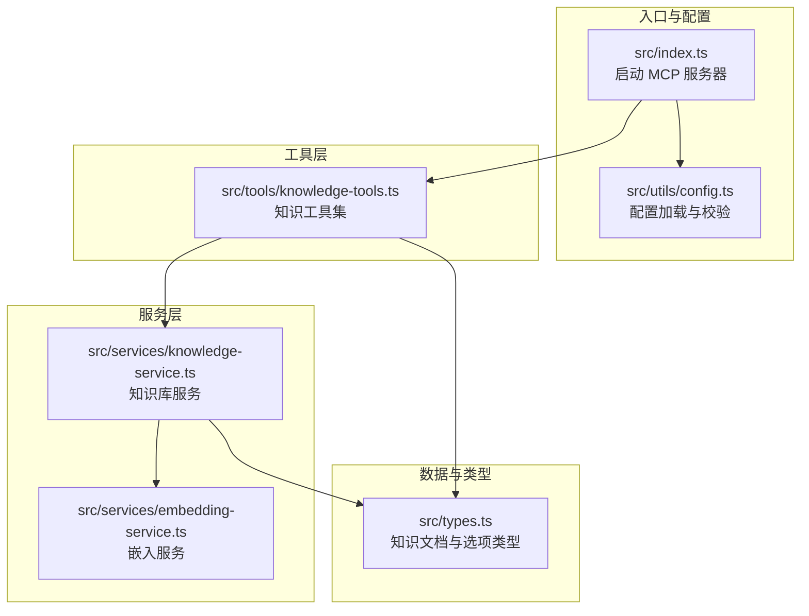
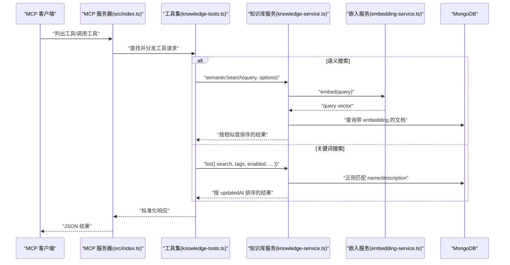
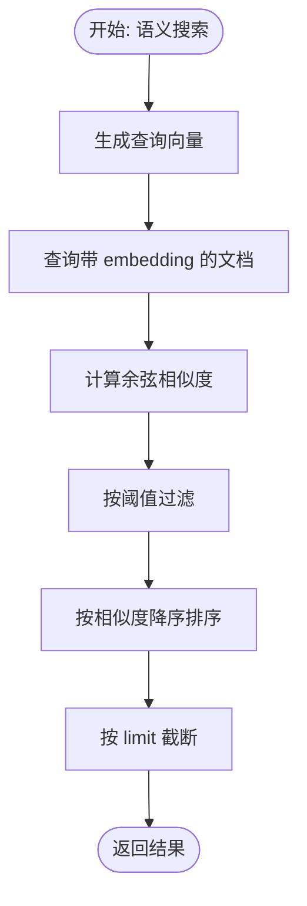
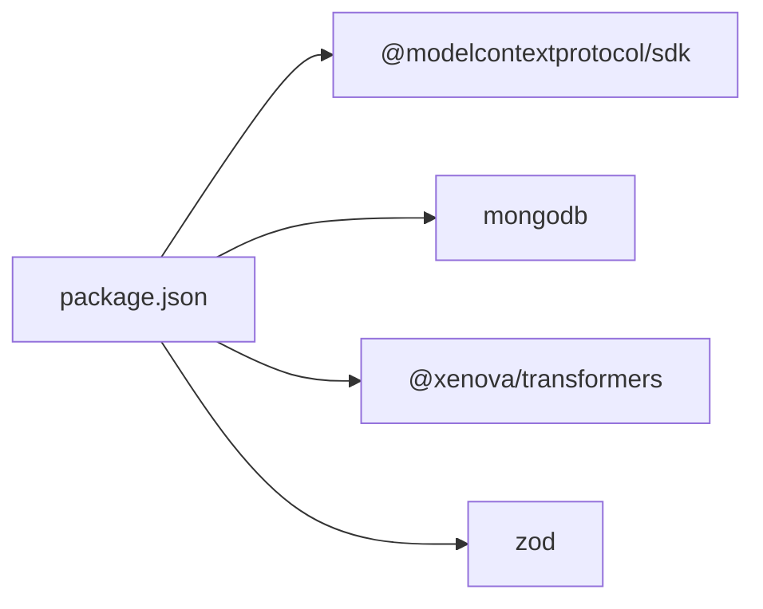

# 搜索工具集

<cite>
**本文引用的文件**
- [src/index.ts](file://src/index.ts)
- [src/tools/knowledge-tools.ts](file://src/tools/knowledge-tools.ts)
- [src/services/knowledge-service.ts](file://src/services/knowledge-service.ts)
- [src/services/embedding-service.ts](file://src/services/embedding-service.ts)
- [src/types.ts](file://src/types.ts)
- [src/utils/config.ts](file://src/utils/config.ts)
- [examples/mcp-config.json](file://examples/mcp-config.json)
- [package.json](file://package.json)
</cite>

## 目录
1. [简介](#简介)
2. [项目结构](#项目结构)
3. [核心组件](#核心组件)
4. [架构总览](#架构总览)
5. [详细组件分析](#详细组件分析)
6. [依赖关系分析](#依赖关系分析)
7. [性能考量](#性能考量)
8. [故障排查指南](#故障排查指南)
9. [结论](#结论)
10. [附录](#附录)

## 简介
本文件面向“搜索工具集”的使用者与维护者，系统化梳理知识库搜索相关的工具与能力，覆盖关键词搜索与语义搜索两大范式，明确输入参数、过滤选项、排序机制、结果格式与字段说明；深入解析嵌入式搜索的实现原理与性能权衡；总结搜索算法选择与优化策略；并提供最佳实践、性能调优与缓存策略，以及工具组合与高级搜索技巧。

## 项目结构
该仓库采用分层架构：入口模块负责启动 MCP 服务器并装配工具；工具层封装知识库 CRUD 与搜索工具；服务层对接 MongoDB 并提供语义搜索能力；嵌入服务层使用 Transformers.js 在浏览器/Node 环境中生成向量；类型定义统一知识文档结构；配置工具负责从环境变量加载与校验运行参数。

图表来源
- [src/index.ts](file://src/index.ts#L1-L148)
- [src/utils/config.ts](file://src/utils/config.ts#L1-L147)
- [src/tools/knowledge-tools.ts](file://src/tools/knowledge-tools.ts#L1-L1093)
- [src/services/knowledge-service.ts](file://src/services/knowledge-service.ts#L1-L404)
- [src/services/embedding-service.ts](file://src/services/embedding-service.ts#L1-L148)
- [src/types.ts](file://src/types.ts#L1-L269)

章节来源
- [src/index.ts](file://src/index.ts#L1-L148)
- [src/utils/config.ts](file://src/utils/config.ts#L1-L147)

## 核心组件
- MCP 工具集：提供通用 CRUD、统计、批量导出、快捷工具（记忆/经验/命令/上下文/规则/技能/工作流）、以及可选的语义搜索与嵌入生成功能。
- 知识库服务：封装 MongoDB 访问、索引、用户上下文注入、关键词搜索、语义搜索、嵌入生成与批量处理。
- 嵌入服务：基于 Transformers.js 的特征抽取与余弦相似度计算，支持懒加载与批量嵌入。
- 类型系统：统一定义知识文档结构、各子类型字段、查询选项与语义搜索参数。
- 配置系统：从环境变量加载数据库连接、用户/设备/IDE 上下文、嵌入开关与日志级别。

章节来源
- [src/tools/knowledge-tools.ts](file://src/tools/knowledge-tools.ts#L1-L1093)
- [src/services/knowledge-service.ts](file://src/services/knowledge-service.ts#L1-L404)
- [src/services/embedding-service.ts](file://src/services/embedding-service.ts#L1-L148)
- [src/types.ts](file://src/types.ts#L1-L269)
- [src/utils/config.ts](file://src/utils/config.ts#L1-L147)

## 架构总览
MCP 服务器启动后，根据配置决定是否启用嵌入功能；工具集按需注册语义搜索与嵌入生成功能；知识库服务负责数据持久化与检索；嵌入服务负责向量化与相似度计算。

图表来源
- [src/index.ts](file://src/index.ts#L16-L82)
- [src/tools/knowledge-tools.ts](file://src/tools/knowledge-tools.ts#L1002-L1087)
- [src/services/knowledge-service.ts](file://src/services/knowledge-service.ts#L272-L399)
- [src/services/embedding-service.ts](file://src/services/embedding-service.ts#L56-L104)

## 详细组件分析

### 1) 工具集 API 总览
- 通用 CRUD 与管理
  - knowledge_create：创建知识文档（含 type/name/content/description/tags/enabled 等）
  - knowledge_read：按 type+name 读取
  - knowledge_update：按 type+name 更新部分字段
  - knowledge_delete：按 type+name 删除
  - knowledge_list：支持 type/search/tags/enabled/limit/offset 过滤与排序
  - knowledge_stats：统计各类型数量
  - knowledge_upsert：存在则更新，否则创建
  - knowledge_export：批量导出
- 快捷工具（预设字段与业务语义）
  - memory_add/memory_search：记忆增删与搜索
  - experience_add：经验（场景/方案/结果/评分）
  - command_add：命令模板与分类
  - context_set：上下文（scope/projectPath/tags）
  - mcp_sync/rule_sync/skill_sync/workflow_create：同步/创建特定类型
- 可选嵌入工具（当 enableEmbedding=true）
  - semantic_search：语义搜索（query/type/limit/threshold）
  - generate_embeddings：批量生成嵌入

章节来源
- [src/tools/knowledge-tools.ts](file://src/tools/knowledge-tools.ts#L29-L1093)

### 2) 输入参数与过滤选项
- knowledge_list
  - type：可选，限定类型
  - search：可选，关键词（大小写不敏感）
  - tags：可选，标签集合（满足任一即命中）
  - enabled：可选，启用状态
  - limit/offset：可选，分页控制
- semantic_search
  - query：必填，查询文本
  - type：可选，类型过滤
  - limit：可选，返回条数（默认10）
  - threshold：可选，相似度阈值（默认0.3）
- 其他工具
  - memory_search：keyword/category/limit
  - context_set：name/content/scope/projectPath/tags
  - command_add/experience_add/mcp_sync/rule_sync/skill_sync/workflow_create：按各自类型字段

章节来源
- [src/tools/knowledge-tools.ts](file://src/tools/knowledge-tools.ts#L251-L281)
- [src/tools/knowledge-tools.ts](file://src/tools/knowledge-tools.ts#L1006-L1028)
- [src/tools/knowledge-tools.ts](file://src/tools/knowledge-tools.ts#L466-L483)
- [src/tools/knowledge-tools.ts](file://src/tools/knowledge-tools.ts#L638-L694)
- [src/tools/knowledge-tools.ts](file://src/tools/knowledge-tools.ts#L574-L635)
- [src/tools/knowledge-tools.ts](file://src/tools/knowledge-tools.ts#L508-L571)
- [src/tools/knowledge-tools.ts](file://src/tools/knowledge-tools.ts#L696-L758)
- [src/tools/knowledge-tools.ts](file://src/tools/knowledge-tools.ts#L760-L822)
- [src/tools/knowledge-tools.ts](file://src/tools/knowledge-tools.ts#L824-L880)
- [src/tools/knowledge-tools.ts](file://src/tools/knowledge-tools.ts#L882-L953)

### 3) 排序机制
- 默认按 updatedAt 降序排列（最新修改优先）
- 语义搜索按相似度 score 降序排列
- 列表支持 offset/limit 实现分页

章节来源
- [src/services/knowledge-service.ts](file://src/services/knowledge-service.ts#L210-L216)
- [src/services/knowledge-service.ts](file://src/services/knowledge-service.ts#L294-L296)

### 4) 搜索结果格式与字段说明
- 通用响应结构
  - success：布尔，操作是否成功
  - data：对象或数组，承载具体数据
  - message/error/count：可选字段，用于反馈信息或统计
- 列表/统计/读取
  - 返回字段包含：id/type/name/description/tags/enabled/syncVersion/updatedAt（以及 userId/deviceId/ideSource 等元信息）
- 语义搜索
  - 返回字段包含：id/type/name/description/score/tags（score 四舍五入保留两位）
- 快捷工具
  - memory_search：返回 name/content/category/tags/updatedAt
  - context_set/command_add/experience_add/mcp_sync/rule_sync/skill_sync/workflow_create：返回 id/name/message

章节来源
- [src/tools/knowledge-tools.ts](file://src/tools/knowledge-tools.ts#L94-L106)
- [src/tools/knowledge-tools.ts](file://src/tools/knowledge-tools.ts#L136-L154)
- [src/tools/knowledge-tools.ts](file://src/tools/knowledge-tools.ts#L294-L308)
- [src/tools/knowledge-tools.ts](file://src/tools/knowledge-tools.ts#L1040-L1055)
- [src/tools/knowledge-tools.ts](file://src/tools/knowledge-tools.ts#L494-L505)
- [src/tools/knowledge-tools.ts](file://src/tools/knowledge-tools.ts#L685-L693)
- [src/tools/knowledge-tools.ts](file://src/tools/knowledge-tools.ts#L626-L634)
- [src/tools/knowledge-tools.ts](file://src/tools/knowledge-tools.ts#L660-L669)
- [src/tools/knowledge-tools.ts](file://src/tools/knowledge-tools.ts#L813-L821)
- [src/tools/knowledge-tools.ts](file://src/tools/knowledge-tools.ts#L871-L879)
- [src/tools/knowledge-tools.ts](file://src/tools/knowledge-tools.ts#L944-L952)

### 5) 嵌入式搜索实现原理与性能考虑
- 实现原理
  - 语义搜索：对查询文本生成向量，遍历集合中带有 embedding 的文档，计算余弦相似度，按阈值过滤与 limit 截断，最终按相似度降序返回。
  - 嵌入生成：从文档中抽取文本片段（name/description/content/tags），截断长度避免过长，生成向量并写回文档，同时记录模型名与生成时间。
- 性能考量
  - 模型加载：首次使用时懒加载，耗时约数百毫秒至数秒，建议在启动阶段预热或在后台生成嵌入。
  - 相似度计算：O(N) 遍历与逐文档点积/归一化，N 为带 embedding 的文档数；可通过类型过滤缩小候选集。
  - 存储与索引：集合具备用户级唯一索引与常用查询索引，但语义搜索依赖 embedding 字段存在性，建议批量生成嵌入后再启用语义搜索。
  - 批量处理：提供批量生成嵌入接口，适合离线预处理大量文档。

图表来源
- [src/services/knowledge-service.ts](file://src/services/knowledge-service.ts#L272-L299)
- [src/services/embedding-service.ts](file://src/services/embedding-service.ts#L85-L104)

章节来源
- [src/services/knowledge-service.ts](file://src/services/knowledge-service.ts#L272-L399)
- [src/services/embedding-service.ts](file://src/services/embedding-service.ts#L1-L148)

### 6) 搜索算法选择与优化策略
- 关键词搜索（文本匹配）
  - 使用正则匹配 name 与 description，大小写不敏感；适合精确标题/描述检索。
  - 优化：合理使用 tags 与 enabled 过滤；结合 limit/offset 实现分页。
- 语义搜索（向量相似度）
  - 使用 mean pooling + 归一化生成向量，余弦相似度衡量语义接近度。
  - 优化：开启类型过滤减少候选集；提高阈值提升相关性；适当降低 limit；提前批量生成嵌入。
- 组合策略
  - 先关键词搜索定位候选，再对候选做语义重排，可兼顾召回与精度。
  - 多轮迭代：先粗筛（tags/enabled），再细搜（search），最后语义精排（semantic_search）。

章节来源
- [src/services/knowledge-service.ts](file://src/services/knowledge-service.ts#L203-L208)
- [src/services/knowledge-service.ts](file://src/services/knowledge-service.ts#L294-L296)

### 7) 最佳实践、性能调优与缓存策略
- 最佳实践
  - 文档设计：为每个文档提供清晰的 name/description/tags，便于关键词与语义双重检索。
  - 标签体系：建立稳定的标签体系，配合 tags 过滤提升检索效率。
  - 内容截断：嵌入文本建议截断，避免超长内容影响性能与质量。
- 性能调优
  - 预生成嵌入：在导入/更新文档后批量生成嵌入，避免首次查询时的冷启动延迟。
  - 降低阈值与 limit：在高召回需求下适度放宽阈值与增加 limit，再通过人工筛选。
  - 类型过滤：优先使用 type 过滤缩小搜索空间。
- 缓存策略
  - 查询结果缓存：对热点查询结果进行短期缓存（注意与嵌入更新的失效策略）。
  - 嵌入缓存：模型加载后常驻内存，无需重复加载；但需关注模型切换与版本管理。

章节来源
- [src/services/knowledge-service.ts](file://src/services/knowledge-service.ts#L313-L341)
- [src/services/embedding-service.ts](file://src/services/embedding-service.ts#L24-L51)

### 8) 工具组合与高级搜索技巧
- 组合使用
  - 先用 knowledge_list + tags/enabled 进行粗筛，再对结果集执行 semantic_search 进行精排。
  - 使用 memory_search + category/tags 快速定位记忆片段，再结合 context_set 的全局/项目上下文增强语义理解。
- 高级技巧
  - 多轮检索：关键词 + 语义混合，先关键词召回，再语义重排。
  - 结果二次加工：对 semantic_search 的结果补充来源信息（如 sourceId/sourcePath）以辅助溯源。
  - 批量处理：使用 knowledge_export 导出全量数据，再在外部进行批处理与可视化分析。

章节来源
- [src/tools/knowledge-tools.ts](file://src/tools/knowledge-tools.ts#L247-L334)
- [src/tools/knowledge-tools.ts](file://src/tools/knowledge-tools.ts#L462-L506)
- [src/tools/knowledge-tools.ts](file://src/tools/knowledge-tools.ts#L972-L996)

## 依赖关系分析
- 运行时依赖
  - @modelcontextprotocol/sdk：MCP 协议与服务器框架
  - mongodb：MongoDB 客户端与集合操作
  - @xenova/transformers：Transformers.js，用于特征抽取与向量生成
  - zod：类型验证（在工具层 schema 中使用）
- 开发依赖
  - typescript、eslint、tsx 等，用于编译、检查与开发调试

图表来源
- [package.json](file://package.json#L30-L43)

章节来源
- [package.json](file://package.json#L1-L48)

## 性能考量
- 模型加载与初始化
  - 首次调用会异步加载模型，建议在启动阶段预热或离线生成嵌入，避免交互时延。
- 相似度计算复杂度
  - O(N) 遍历与逐文档相似度计算，N 为带 embedding 的文档数；可通过类型过滤与 limit 有效控制。
- 数据库访问
  - 索引覆盖：用户级唯一索引、用户+类型、用户+设备、标签、时间排序索引，有助于提升查询与排序性能。
- 嵌入生成
  - 批量生成嵌入可显著降低单次生成的开销；建议在导入/更新后异步批量处理。

章节来源
- [src/services/embedding-service.ts](file://src/services/embedding-service.ts#L24-L51)
- [src/services/knowledge-service.ts](file://src/services/knowledge-service.ts#L71-L87)
- [src/services/knowledge-service.ts](file://src/services/knowledge-service.ts#L313-L341)

## 故障排查指南
- 连接失败
  - 检查 MONGO_URI、数据库与集合名称是否正确；确认 MongoDB 可达且认证通过。
- 工具不可用
  - 确认 ENABLE_EMBEDDING 配置与工具注册逻辑一致；若未启用嵌入，semantic_search/generate_embeddings 将不会出现。
- 语义搜索无结果
  - 确认文档已生成嵌入；检查 embedding 字段是否存在；调整阈值与 limit；尝试先执行 generate_embeddings。
- 权限与上下文
  - 确认 USER_ID/DEVICE_ID/IDE_SOURCE 配置正确，确保用户隔离与跨设备同步符合预期。
- 日志级别
  - 通过 LOG_LEVEL 调整日志输出，便于定位问题。

章节来源
- [src/utils/config.ts](file://src/utils/config.ts#L76-L91)
- [src/utils/config.ts](file://src/utils/config.ts#L96-L115)
- [src/services/knowledge-service.ts](file://src/services/knowledge-service.ts#L272-L299)

## 结论
本搜索工具集提供了从关键词到语义的双通道检索能力，结合 MongoDB 的高效索引与 Transformers.js 的向量能力，既保证了易用性也兼顾了扩展性。通过合理的标签体系、嵌入预生成与阈值/limit 调优，可在不同规模与场景下获得稳定、可预测的检索体验。建议在生产环境中配合批量嵌入与结果缓存策略，持续监控性能指标并迭代优化。

## 附录

### A. 环境变量与配置
- MONGO_URI：MongoDB 连接字符串
- MONGO_DATABASE：数据库名称
- MONGO_COLLECTION：集合名称
- USER_ID/DEVICE_ID/IDE_SOURCE：用户/设备/IDE 上下文
- ENABLE_EMBEDDING：是否启用嵌入与语义搜索
- LOG_LEVEL：日志级别

章节来源
- [src/utils/config.ts](file://src/utils/config.ts#L76-L91)
- [examples/mcp-config.json](file://examples/mcp-config.json#L1-L94)

### B. 知识文档类型与字段
- 基础字段：type/name/content/description/tags/enabled
- 用户与设备：userId/deviceId/ideSource
- 同步与来源：syncVersion/lastSyncAt/sourceId/sourcePath/sourceProject
- 时间戳：createdAt/updatedAt
- 向量嵌入：embedding/embeddingModel/embeddedAt

章节来源
- [src/types.ts](file://src/types.ts#L24-L74)