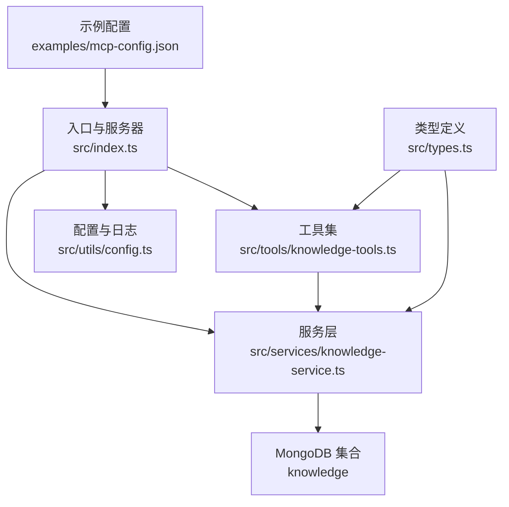
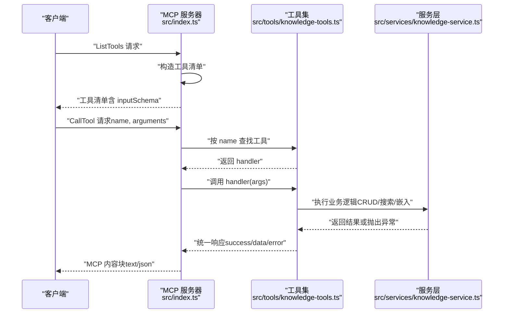
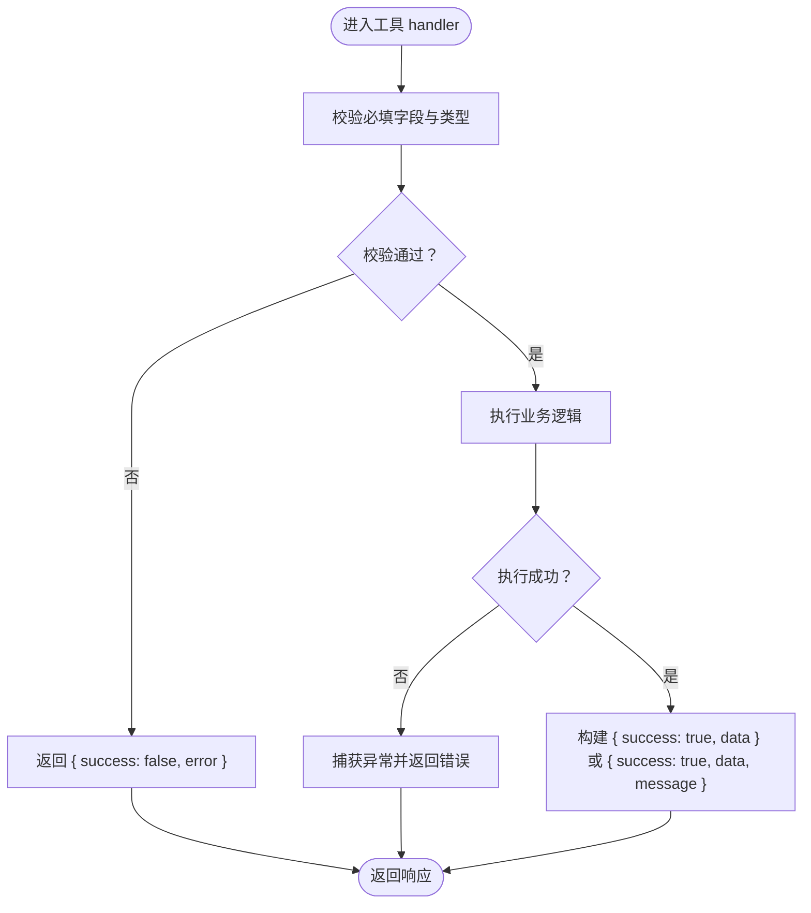

# 请求响应格式

<cite>
**本文引用的文件**
- [src/index.ts](file://src/index.ts)
- [src/tools/knowledge-tools.ts](file://src/tools/knowledge-tools.ts)
- [src/services/knowledge-service.ts](file://src/services/knowledge-service.ts)
- [src/utils/config.ts](file://src/utils/config.ts)
- [src/types.ts](file://src/types.ts)
- [examples/mcp-config.json](file://examples/mcp-config.json)
- [package.json](file://package.json)
</cite>

## 目录
1. [简介](#简介)
2. [项目结构](#项目结构)
3. [核心组件](#核心组件)
4. [架构总览](#架构总览)
5. [详细组件分析](#详细组件分析)
6. [依赖关系分析](#依赖关系分析)
7. [性能考量](#性能考量)
8. [故障排查指南](#故障排查指南)
9. [结论](#结论)
10. [附录](#附录)

## 简介
本文件面向 MCP（Model Context Protocol）工具的请求与响应格式，系统性地定义标准请求格式、响应结构、错误处理机制，并给出输入参数的验证规则、数据类型转换与默认值处理策略。文档同时覆盖请求头、认证信息与会话管理的规范建议，以及 JSON Schema 定义与数据验证示例，帮助开发者在不同 IDE（如 VS Code、Cursor、Qoder 等）中稳定集成 mongo-mcp 的 MCP 服务器。

## 项目结构
mongo-mcp 是一个基于 MCP SDK 的 Node.js 服务器，通过 STDIO 与 MCP 客户端交互，提供知识库管理工具集（Memories、Skills、Rules、MCPs、Experiences、Commands、Contexts、Workflows）。其核心由以下模块组成：
- 入口与服务器：负责初始化 MCP 服务器、注册工具处理器、处理 ListTools 与 CallTool 请求。
- 工具集：定义统一的工具接口与输入 Schema，封装业务逻辑。
- 服务层：封装 MongoDB 访问、索引、用户上下文注入、嵌入生成与语义搜索。
- 配置与日志：从环境变量加载配置、校验与日志输出。
- 类型定义：统一的知识文档类型、字段与查询选项。

图表来源
- [src/index.ts](file://src/index.ts#L1-L148)
- [src/tools/knowledge-tools.ts](file://src/tools/knowledge-tools.ts#L1-L1093)
- [src/services/knowledge-service.ts](file://src/services/knowledge-service.ts#L1-L404)
- [src/utils/config.ts](file://src/utils/config.ts#L1-L147)
- [src/types.ts](file://src/types.ts#L1-L269)
- [examples/mcp-config.json](file://examples/mcp-config.json#L1-L94)

章节来源
- [src/index.ts](file://src/index.ts#L1-L148)
- [src/tools/knowledge-tools.ts](file://src/tools/knowledge-tools.ts#L1-L1093)
- [src/services/knowledge-service.ts](file://src/services/knowledge-service.ts#L1-L404)
- [src/utils/config.ts](file://src/utils/config.ts#L1-L147)
- [src/types.ts](file://src/types.ts#L1-L269)
- [examples/mcp-config.json](file://examples/mcp-config.json#L1-L94)

## 核心组件
- MCP 服务器与请求处理器
  - 服务器能力声明包含 tools。
  - 注册 ListTools 请求处理器：返回工具清单（含名称、描述与 inputSchema）。
  - 注册 CallTool 请求处理器：根据工具名分发到对应 handler；未知工具返回错误；异常捕获统一包装为错误响应。
- 工具接口与输入 Schema
  - 工具接口包含 name、description、inputSchema、handler。
  - inputSchema 采用 JSON Schema，定义必填字段、枚举、数组元素类型等。
  - handler 返回统一的结构化响应（success 标志、data 数据块、error 错误信息）。
- 服务层与数据模型
  - KnowledgeService 封装 CRUD、聚合查询、统计、批量导入导出、嵌入生成与语义搜索。
  - 用户上下文注入：userId、deviceId、ideSource，确保跨设备与跨 IDE 的数据隔离与同步。
- 配置与日志
  - 从环境变量加载配置，支持 IDE_SOURCE、MONGO_URI、MONGO_DATABASE、MONGO_COLLECTION、USER_ID、DEVICE_ID、ENABLE_EMBEDDING、LOG_LEVEL。
  - 配置校验与日志级别控制。

章节来源
- [src/index.ts](file://src/index.ts#L16-L82)
- [src/tools/knowledge-tools.ts](file://src/tools/knowledge-tools.ts#L7-L16)
- [src/services/knowledge-service.ts](file://src/services/knowledge-service.ts#L20-L404)
- [src/utils/config.ts](file://src/utils/config.ts#L76-L115)

## 架构总览
MCP 工具调用的典型时序如下：
- 客户端发送 ListTools 请求，服务器返回工具清单。
- 客户端发送 CallTool 请求，携带工具名与参数；服务器查找工具并调用 handler。
- handler 执行业务逻辑，返回统一响应结构；服务器将响应序列化为 MCP 内容块。

图表来源
- [src/index.ts](file://src/index.ts#L29-L79)
- [src/tools/knowledge-tools.ts](file://src/tools/knowledge-tools.ts#L36-L106)
- [src/services/knowledge-service.ts](file://src/services/knowledge-service.ts#L111-L177)

章节来源
- [src/index.ts](file://src/index.ts#L29-L79)
- [src/tools/knowledge-tools.ts](file://src/tools/knowledge-tools.ts#L36-L106)
- [src/services/knowledge-service.ts](file://src/services/knowledge-service.ts#L111-L177)

## 详细组件分析

### 请求格式规范
- MCP 协议请求
  - ListTools：无参数，返回 tools 数组，每项包含 name、description、inputSchema。
  - CallTool：params 包含 name（工具名）与 arguments（对象，遵循工具的 inputSchema）。
- 输入参数验证
  - 由工具的 inputSchema 定义字段类型、必填、枚举与数组元素类型。
  - 处理器内部对必填字段进行检查；未满足要求时返回错误响应。
- 数据类型转换与默认值
  - 字符串、数值、布尔值、数组、对象等类型由 JSON Schema 明确。
  - 默认值策略：布尔型默认 true（如 enabled），数值默认 10（如 semantic_search.limit），阈值默认 0.3。
- 请求头与认证
  - 本项目通过 STDIO 与 MCP 客户端通信，不涉及 HTTP 请求头。
  - 认证与会话管理通过环境变量注入用户上下文（userId、deviceId、ideSource），并在每次写操作时注入集合。
- 会话管理
  - 服务器启动时建立 MongoDB 连接，工具调用期间复用连接；优雅退出时断开连接。

章节来源
- [src/index.ts](file://src/index.ts#L29-L79)
- [src/tools/knowledge-tools.ts](file://src/tools/knowledge-tools.ts#L36-L106)
- [src/utils/config.ts](file://src/utils/config.ts#L76-L91)

### 响应格式规范
- 统一响应结构
  - 成功响应：包含 success: true 与 data 数据块。
  - 失败响应：包含 success: false 与 error 字段（字符串）。
  - 特殊工具可能包含 message 字段用于提示信息。
- MCP 内容块
  - 服务器将响应序列化为 text/json 内容块，供 MCP 客户端消费。
- 错误处理机制
  - 未知工具：返回错误内容块，提示 Unknown tool。
  - 异常捕获：捕获异常并返回 { success: false, error }。
  - MongoDB 冲突（重复键）：返回具体错误信息（如“已存在”）。

图表来源
- [src/tools/knowledge-tools.ts](file://src/tools/knowledge-tools.ts#L72-L106)
- [src/index.ts](file://src/index.ts#L41-L79)

章节来源
- [src/index.ts](file://src/index.ts#L41-L79)
- [src/tools/knowledge-tools.ts](file://src/tools/knowledge-tools.ts#L72-L106)

### 错误码与错误处理最佳实践
- 错误码定义
  - MongoDB 重复键冲突：返回特定错误信息（如“已存在”）。
  - 未知工具：返回错误内容块。
  - 运行时异常：捕获并返回 { success: false, error }。
- 最佳实践
  - 在工具层统一返回结构，避免直接抛出未捕获异常。
  - 对必填字段与类型进行显式校验，提前失败。
  - 对外部依赖（如 MongoDB）的错误进行分类与映射，提供可读错误消息。
  - 对于嵌入相关的工具，明确前置条件（需先生成嵌入）并给出提示。

章节来源
- [src/tools/knowledge-tools.ts](file://src/tools/knowledge-tools.ts#L99-L105)
- [src/index.ts](file://src/index.ts#L66-L78)

### JSON Schema 定义与数据验证示例
- 通用 CRUD 工具的 inputSchema
  - knowledge_create：必填 type、name、content；可选 description、tags、enabled（默认 true）。
  - knowledge_read：必填 type、name。
  - knowledge_update：必填 type、name；其余字段可选。
  - knowledge_delete：必填 type、name。
  - knowledge_list：可选 type、search、tags、enabled、limit、offset。
  - knowledge_stats：可选 type。
  - knowledge_upsert：必填 type、name、content；可选 description、tags、enabled（默认 true）。
- 快捷工具的 inputSchema
  - memory_add：必填 name、content；可选 category、importance、tags。
  - memory_search：必填 keyword；可选 category、limit（默认 10）。
  - experience_add：必填 name、scenario、solution；可选 outcome、effectiveness、tags。
  - command_add：必填 name、template；可选 description、shortcut、category、tags。
  - context_set：必填 name、content；可选 scope（默认 global）、projectPath、tags。
  - mcp_sync：必填 name、command；可选 args、env、description、tools。
  - rule_sync：必填 name、content；可选 description、priority、triggerMode、tags。
  - skill_sync：必填 name、content；可选 description、trigger、tags。
  - workflow_create：必填 name、steps；可选 description、trigger、autoRun、tags。
  - get_user_info：无参数。
  - knowledge_export：可选 type。
- 语义搜索与嵌入工具（仅在启用嵌入时）
  - semantic_search：必填 query；可选 type、limit（默认 10）、threshold（默认 0.3）。
  - generate_embeddings：可选 type。
- 数据验证示例
  - 必填字段缺失：返回错误响应。
  - 枚举值不在允许集合：由 JSON Schema 校验失败，工具层返回错误。
  - 数组元素类型不符：由 JSON Schema 校验失败，工具层返回错误。

章节来源
- [src/tools/knowledge-tools.ts](file://src/tools/knowledge-tools.ts#L36-L1093)

### 数据模型与字段说明
- 知识文档基础字段
  - type、name、content、description、tags、enabled（默认 true）、userId、deviceId、ideSource、syncVersion、lastSyncAt、sourceId、sourcePath、sourceProject、createdAt、updatedAt、createdBy、updatedBy、embedding、embeddingModel、embeddedAt。
- 文档类型扩展
  - Memories：新增 category、importance、expiresAt。
  - MCPs：新增 command、args、env、tools。
  - Skills：新增 trigger、script、dependencies。
  - Rules：新增 priority、conditions、actions、triggerMode。
  - Experiences：新增 scenario、solution、outcome、effectiveness、relatedSkills。
  - Commands：新增 template、parameters、category、shortcut。
  - Contexts：新增 scope、projectPath、validUntil、references。
  - Workflows：新增 steps（含 order、action、toolCall、condition、onError）、trigger、autoRun。
- 查询与统计
  - ListOptions：type、tags、enabled、search、limit、offset。
  - SemanticSearchOptions：type、limit、threshold。

章节来源
- [src/types.ts](file://src/types.ts#L24-L269)

## 依赖关系分析
- 外部依赖
  - @modelcontextprotocol/sdk：MCP 协议实现与服务器框架。
  - mongodb：MongoDB 客户端与集合操作。
  - @xenova/transformers：嵌入模型与相似度计算。
  - zod：类型校验（项目内未直接使用，但可作为 Schema 校验补充）。
- 内部模块耦合
  - 入口模块依赖工具集与服务层；工具集依赖服务层；服务层依赖类型定义与嵌入服务。
  - 配置模块被入口与服务层共同使用，确保一致的用户上下文与日志级别。

```mermaid
graph LR
Pkg["package.json 依赖"] --> SDK["@modelcontextprotocol/sdk"]
Pkg --> Mongo["mongodb"]
Pkg --> Transformers["@xenova/transformers"]
Pkg --> Zod["zod"]
Entry["src/index.ts"] --> Tools["src/tools/knowledge-tools.ts"]
Entry --> Service["src/services/knowledge-service.ts"]
Entry --> Config["src/utils/config.ts"]
Tools --> Types["src/types.ts"]
Service --> Types
Service --> Embed["src/services/embedding-service.ts"]
```

图表来源
- [package.json](file://package.json#L30-L43)
- [src/index.ts](file://src/index.ts#L3-L11)
- [src/tools/knowledge-tools.ts](file://src/tools/knowledge-tools.ts#L1-L3)
- [src/services/knowledge-service.ts](file://src/services/knowledge-service.ts#L1-L4)
- [src/utils/config.ts](file://src/utils/config.ts#L1-L1)

章节来源
- [package.json](file://package.json#L30-L43)
- [src/index.ts](file://src/index.ts#L3-L11)
- [src/tools/knowledge-tools.ts](file://src/tools/knowledge-tools.ts#L1-L3)
- [src/services/knowledge-service.ts](file://src/services/knowledge-service.ts#L1-L4)
- [src/utils/config.ts](file://src/utils/config.ts#L1-L1)

## 性能考量
- 索引设计
  - 用户级唯一索引（userId + type + name）保证同用户下文档名唯一。
  - 用户 + 类型、用户 + 设备、标签、时间排序等索引提升查询效率。
- 查询优化
  - 列表查询支持分页（limit/offset）与过滤（type/tags/enabled/search）。
  - 语义搜索基于向量相似度，需预先生成嵌入；可设置阈值与返回数量上限。
- 嵌入生成
  - 批量生成嵌入时逐条更新，注意网络与存储开销；可按类型分批处理。
- 并发与连接
  - 服务器启动时建立连接，工具调用期间复用；优雅退出时断开连接，避免资源泄漏。

章节来源
- [src/services/knowledge-service.ts](file://src/services/knowledge-service.ts#L71-L87)
- [src/services/knowledge-service.ts](file://src/services/knowledge-service.ts#L194-L216)
- [src/services/knowledge-service.ts](file://src/services/knowledge-service.ts#L272-L299)
- [src/services/knowledge-service.ts](file://src/services/knowledge-service.ts#L313-L341)

## 故障排查指南
- 配置问题
  - MONGO_URI、MONGO_DATABASE、MONGO_COLLECTION 缺失会导致启动失败；请检查环境变量与配置文件。
  - LOG_LEVEL 控制日志输出级别，便于定位问题。
- 工具调用失败
  - 未知工具名：确认工具清单与名称拼写。
  - 参数类型不符：检查 inputSchema 与传参类型。
  - MongoDB 冲突：重复键导致“已存在”错误，需调整 name 或删除旧文档。
- 嵌入相关
  - 语义搜索报错：确认 ENABLE_EMBEDDING 已开启且已生成嵌入。
  - 相似度过低：调整阈值或增加嵌入维度。
- 连接问题
  - 启动时报连接错误：检查 MongoDB 地址、认证与网络连通性。

章节来源
- [src/utils/config.ts](file://src/utils/config.ts#L96-L115)
- [src/index.ts](file://src/index.ts#L93-L98)
- [src/tools/knowledge-tools.ts](file://src/tools/knowledge-tools.ts#L99-L105)
- [src/services/knowledge-service.ts](file://src/services/knowledge-service.ts#L272-L299)

## 结论
本规范明确了 mongo-mcp 的 MCP 工具请求与响应格式、输入参数验证规则、数据类型转换与默认值处理策略，并提供了统一的错误处理机制与最佳实践。通过 JSON Schema 定义与严格的参数校验，结合用户上下文注入与嵌入能力，mongo-mcp 能够在多 IDE 环境中稳定提供知识库管理能力。建议在生产环境中启用嵌入与日志级别控制，并对工具参数进行严格校验与错误映射。

## 附录

### 请求与响应格式对照表
- ListTools
  - 请求：无参数
  - 响应：tools 数组，每项包含 name、description、inputSchema
- CallTool
  - 请求：params.name（工具名）、params.arguments（对象，遵循 inputSchema）
  - 响应：统一结构 { success, data?, error?, message? }，MCP 内容块为 text/json

章节来源
- [src/index.ts](file://src/index.ts#L29-L79)
- [src/tools/knowledge-tools.ts](file://src/tools/knowledge-tools.ts#L7-L16)

### 配置与会话管理
- 环境变量
  - MONGO_URI、MONGO_DATABASE、MONGO_COLLECTION、USER_ID、DEVICE_ID、IDE_SOURCE、ENABLE_EMBEDDING、LOG_LEVEL
- 会话管理
  - 服务器启动时注入用户上下文（userId、deviceId、ideSource），写操作时自动更新设备与 IDE 信息

章节来源
- [src/utils/config.ts](file://src/utils/config.ts#L76-L91)
- [src/services/knowledge-service.ts](file://src/services/knowledge-service.ts#L92-L106)

### 示例配置参考
- 多 IDE 配置示例（VS Code、Cursor、Qoder、本地开发、云共享）
- MCP 服务器命令与参数、环境变量设置

章节来源
- [examples/mcp-config.json](file://examples/mcp-config.json#L1-L94)