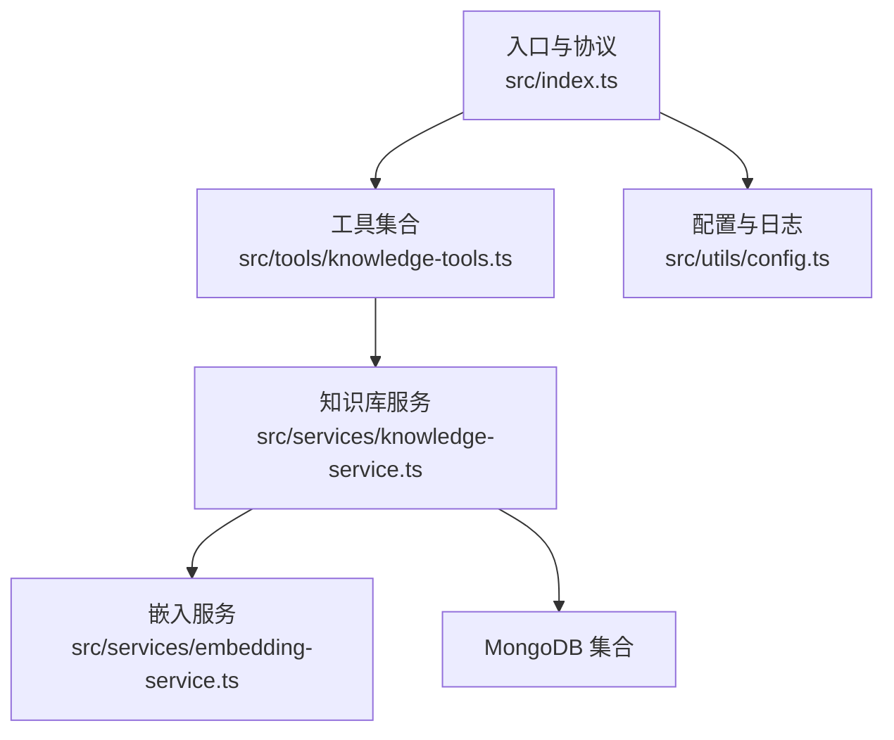
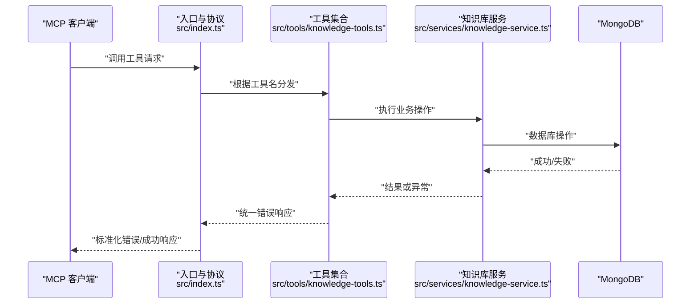
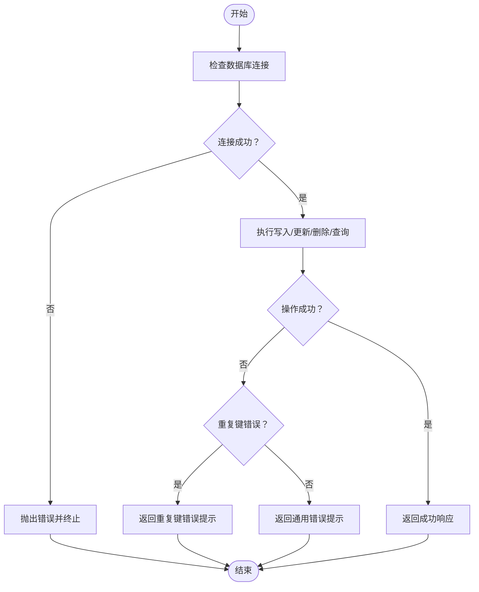
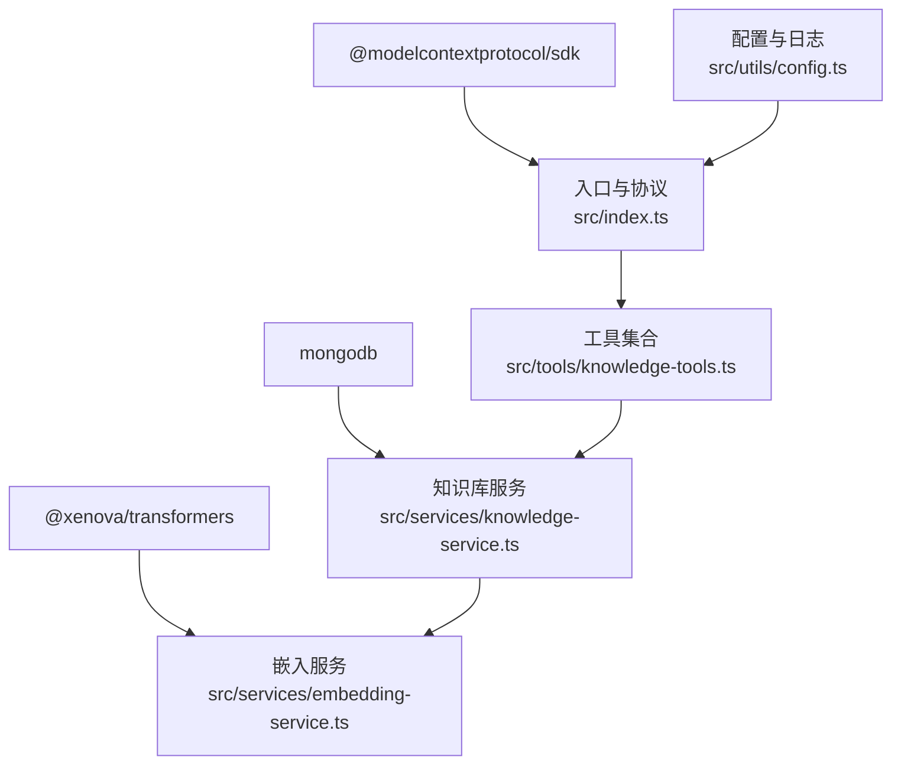

# 错误处理规范

<cite>
**本文引用的文件**
- [src/index.ts](file://src/index.ts)
- [src/types.ts](file://src/types.ts)
- [src/tools/knowledge-tools.ts](file://src/tools/knowledge-tools.ts)
- [src/services/knowledge-service.ts](file://src/services/knowledge-service.ts)
- [src/services/embedding-service.ts](file://src/services/embedding-service.ts)
- [src/utils/config.ts](file://src/utils/config.ts)
- [package.json](file://package.json)
- [examples/mcp-config.json](file://examples/mcp-config.json)
</cite>

## 目录
1. [简介](#简介)
2. [项目结构](#项目结构)
3. [核心组件](#核心组件)
4. [架构总览](#架构总览)
5. [详细组件分析](#详细组件分析)
6. [依赖关系分析](#依赖关系分析)
7. [性能考量](#性能考量)
8. [故障排查指南](#故障排查指南)
9. [结论](#结论)
10. [附录](#附录)

## 简介
本规范面向 MCP 工具系统，系统性地定义错误分类、错误码、错误处理策略与响应格式，覆盖数据库错误、验证错误、业务逻辑错误与系统错误，并提供标准化的错误响应结构、错误消息规范、重试与降级策略、监控与日志最佳实践，以及客户端错误处理与用户体验优化建议。目标是帮助开发者在不同层级统一错误处理行为，提升系统的稳定性与可观测性。

## 项目结构
MCP 工具系统采用分层架构：
- 入口与协议层：负责 MCP 协议交互、工具注册与调用分发
- 服务层：封装知识库操作、嵌入生成与语义搜索
- 工具层：定义工具输入模式与处理器，统一错误返回格式
- 配置与日志：集中化配置解析、校验与日志输出
- 类型定义：统一知识库文档类型与查询参数

图表来源
- [src/index.ts](file://src/index.ts#L1-L148)
- [src/tools/knowledge-tools.ts](file://src/tools/knowledge-tools.ts#L1-L1093)
- [src/services/knowledge-service.ts](file://src/services/knowledge-service.ts#L1-L404)
- [src/services/embedding-service.ts](file://src/services/embedding-service.ts#L1-L148)
- [src/utils/config.ts](file://src/utils/config.ts#L1-L147)

章节来源
- [src/index.ts](file://src/index.ts#L1-L148)
- [src/tools/knowledge-tools.ts](file://src/tools/knowledge-tools.ts#L1-L1093)
- [src/services/knowledge-service.ts](file://src/services/knowledge-service.ts#L1-L404)
- [src/services/embedding-service.ts](file://src/services/embedding-service.ts#L1-L148)
- [src/utils/config.ts](file://src/utils/config.ts#L1-L147)

## 核心组件
- 错误响应统一格式：所有工具处理器返回统一的结构，包含 success 字段、可选 data 与 error 字段；当 success 为 false 时，error 字段承载错误消息。
- 错误捕获与传播：入口层对工具调用进行 try/catch 包裹，将异常转换为标准错误响应；工具层在业务逻辑中捕获异常并返回结构化错误。
- 数据库错误处理：知识库服务在连接、写入、更新、删除等操作中抛出错误；工具层识别特定错误码（如重复键）并给出明确提示。
- 嵌入服务错误处理：嵌入服务初始化与推理过程可能失败，工具层在调用时捕获并返回错误。
- 配置与日志：配置加载与校验失败时终止进程；日志按级别输出，便于定位问题。

章节来源
- [src/index.ts](file://src/index.ts#L40-L79)
- [src/tools/knowledge-tools.ts](file://src/tools/knowledge-tools.ts#L94-L106)
- [src/services/knowledge-service.ts](file://src/services/knowledge-service.ts#L111-L127)
- [src/services/embedding-service.ts](file://src/services/embedding-service.ts#L41-L51)
- [src/utils/config.ts](file://src/utils/config.ts#L96-L115)

## 架构总览
MCP 工具系统错误处理遵循“分层捕获、统一返回”的原则。入口层负责协议错误与未知工具处理；工具层负责业务错误与数据库错误；服务层负责底层异常；配置层负责启动前校验与日志。

图表来源
- [src/index.ts](file://src/index.ts#L40-L79)
- [src/tools/knowledge-tools.ts](file://src/tools/knowledge-tools.ts#L72-L106)
- [src/services/knowledge-service.ts](file://src/services/knowledge-service.ts#L111-L127)

## 详细组件分析

### 错误分类与错误码定义
- 数据库错误
  - 连接失败：知识库服务在未连接状态下执行操作会抛出错误；工具层捕获并返回错误。
  - 写入冲突：当存在重复键（如 type+name 的唯一索引）时，数据库返回特定错误码；工具层识别该错误码并返回明确提示。
  - 查询失败：索引缺失或权限不足可能导致查询异常；服务层抛出错误，工具层捕获并返回。
- 验证错误
  - 工具输入校验：工具定义了严格的输入模式（Zod 兼容），若参数缺失或类型不符，SDK 层会返回错误消息；入口层将其转换为标准错误响应。
  - 配置校验：配置加载后进行有效性检查，若缺少必要字段，终止进程并输出错误日志。
- 业务逻辑错误
  - 文档不存在：读取、更新、删除时若目标不存在，工具层返回“不存在”提示。
  - 嵌入服务初始化失败：模型加载超时或资源不足导致初始化失败；工具层捕获并返回错误。
- 系统错误
  - 进程退出：启动阶段或运行阶段出现致命错误时，系统记录错误并退出进程。
  - 信号处理：优雅关闭时断开数据库连接并退出。

章节来源
- [src/services/knowledge-service.ts](file://src/services/knowledge-service.ts#L111-L127)
- [src/tools/knowledge-tools.ts](file://src/tools/knowledge-tools.ts#L99-L106)
- [src/utils/config.ts](file://src/utils/config.ts#L96-L115)
- [src/index.ts](file://src/index.ts#L141-L144)

### 错误响应格式与消息规范
- 成功响应
  - 结构：包含 success: true 与 data 或 message 字段。
  - 示例：创建、更新、读取、统计、导出等工具返回成功响应。
- 失败响应
  - 结构：包含 success: false 与 error 字段；部分工具返回 message 字段用于补充说明。
  - 错误消息：优先使用 Error.message；对于未知错误，使用通用提示。
- 标准化流程
  - 工具层：try/catch 捕获异常，识别特定错误码（如重复键），返回结构化错误。
  - 入口层：对未知工具与异常进行统一包装，确保返回标准错误响应。

章节来源
- [src/index.ts](file://src/index.ts#L40-L79)
- [src/tools/knowledge-tools.ts](file://src/tools/knowledge-tools.ts#L94-L106)
- [src/tools/knowledge-tools.ts](file://src/tools/knowledge-tools.ts#L128-L135)

### 数据库错误处理策略
- 连接与索引
  - 连接：首次操作前确保连接建立并创建必要索引；未连接状态下的操作直接抛错。
  - 索引：为用户级唯一性、类型过滤、标签查询、时间排序等建立索引，降低查询失败概率。
- 写入与更新
  - 写入：插入前注入用户上下文，设置时间戳与同步版本；异常时返回错误。
  - 更新：原子性更新并递增同步版本；不存在时返回空结果，工具层提示“不存在”。
- 删除与查询
  - 删除：按用户上下文过滤，返回删除计数；不存在时返回 false。
  - 查询：支持正则搜索、标签过滤、分页与排序；异常时返回错误。
- 重复键处理
  - 工具层识别数据库重复键错误码，返回明确提示，避免歧义。

图表来源
- [src/services/knowledge-service.ts](file://src/services/knowledge-service.ts#L111-L127)
- [src/tools/knowledge-tools.ts](file://src/tools/knowledge-tools.ts#L99-L106)

章节来源
- [src/services/knowledge-service.ts](file://src/services/knowledge-service.ts#L44-L87)
- [src/tools/knowledge-tools.ts](file://src/tools/knowledge-tools.ts#L99-L106)

### 验证错误处理策略
- 输入模式校验
  - 工具定义了严格的输入模式（属性、类型、必填项），SDK 层在解析阶段即可能返回错误。
- 配置校验
  - 配置加载后进行有效性检查，缺失关键字段时记录错误并终止进程。
- 建议
  - 在工具层增加更细粒度的参数校验与自定义错误消息，提升可读性。

章节来源
- [src/tools/knowledge-tools.ts](file://src/tools/knowledge-tools.ts#L36-L71)
- [src/utils/config.ts](file://src/utils/config.ts#L96-L115)

### 业务逻辑错误处理策略
- 文档存在性检查
  - 读取、更新、删除前检查文档是否存在；不存在时返回明确提示。
- 嵌入生成与语义搜索
  - 嵌入服务初始化失败或推理异常时，工具层捕获并返回错误。
- 用户上下文
  - 工具层通过服务层获取用户上下文，确保操作在正确的用户维度内执行。

章节来源
- [src/tools/knowledge-tools.ts](file://src/tools/knowledge-tools.ts#L128-L135)
- [src/tools/knowledge-tools.ts](file://src/tools/knowledge-tools.ts#L1037-L1055)
- [src/services/knowledge-service.ts](file://src/services/knowledge-service.ts#L364-L366)

### 系统错误处理策略
- 启动阶段
  - 配置校验失败：记录错误并退出进程。
  - 数据库连接失败：记录错误并退出进程。
- 运行阶段
  - 工具调用异常：统一包装为标准错误响应。
  - 未知工具：返回“未知工具”提示。
- 优雅关闭
  - 监听 SIGINT/SIGTERM，断开数据库连接并退出。

章节来源
- [src/index.ts](file://src/index.ts#L93-L98)
- [src/index.ts](file://src/index.ts#L116-L144)
- [src/index.ts](file://src/index.ts#L133-L140)

### 错误重试机制与降级策略
- 重试机制
  - 建议在工具层对瞬时性错误（如网络抖动、数据库锁等待）引入指数退避重试。
  - 对于不可重试错误（如参数无效、权限不足）直接返回错误。
- 降级策略
  - 嵌入功能降级：当嵌入服务初始化失败时，禁用语义搜索与嵌入生成功能，仅保留基础 CRUD 工具。
  - 降级提示：在工具返回中加入降级说明，引导用户修复环境。

章节来源
- [src/tools/knowledge-tools.ts](file://src/tools/knowledge-tools.ts#L999-L1089)
- [src/services/embedding-service.ts](file://src/services/embedding-service.ts#L41-L51)

### 错误监控与日志记录最佳实践
- 日志级别
  - 支持 debug/info/warn/error 四级日志，按配置动态输出。
- 关键事件日志
  - 启动、连接、工具调用、错误发生、优雅关闭等关键节点记录日志。
- 错误上下文
  - 记录用户 ID、设备 ID、IDE 来源、工具名、参数摘要等，便于追踪。
- 建议
  - 引入结构化日志（JSON）与错误追踪（如 Sentry），结合日志聚合平台进行集中监控。

章节来源
- [src/utils/config.ts](file://src/utils/config.ts#L120-L146)
- [src/index.ts](file://src/index.ts#L100-L102)
- [src/index.ts](file://src/index.ts#L133-L140)

### 客户端错误处理与用户体验优化
- 标准化错误响应
  - 客户端统一解析 success 字段与 error/message 字段，避免分支过多。
- 友好提示
  - 工具层返回的消息应简洁明确，避免技术术语；必要时提供解决建议。
- 重试与反馈
  - 对可恢复错误提供重试按钮与进度反馈；对永久性错误提供清晰的修复指引。
- 配置示例
  - 提供 IDE 配置示例，确保客户端正确传递环境变量与日志级别。

章节来源
- [examples/mcp-config.json](file://examples/mcp-config.json#L1-L94)
- [src/tools/knowledge-tools.ts](file://src/tools/knowledge-tools.ts#L94-L106)

## 依赖关系分析
- 外部依赖
  - MCP SDK：负责协议交互与输入校验。
  - MongoDB：提供知识库持久化能力。
  - Transformers.js：提供嵌入模型推理能力。
- 内部依赖
  - 工具层依赖服务层；服务层依赖嵌入服务与 MongoDB；入口层依赖工具层与配置层。

图表来源
- [package.json](file://package.json#L30-L34)
- [src/index.ts](file://src/index.ts#L1-L12)
- [src/services/knowledge-service.ts](file://src/services/knowledge-service.ts#L1-L4)
- [src/services/embedding-service.ts](file://src/services/embedding-service.ts#L1-L1)
- [src/tools/knowledge-tools.ts](file://src/tools/knowledge-tools.ts#L1-L2)
- [src/utils/config.ts](file://src/utils/config.ts#L1-L1)

章节来源
- [package.json](file://package.json#L30-L34)
- [src/index.ts](file://src/index.ts#L1-L12)
- [src/tools/knowledge-tools.ts](file://src/tools/knowledge-tools.ts#L1-L2)
- [src/services/knowledge-service.ts](file://src/services/knowledge-service.ts#L1-L4)
- [src/services/embedding-service.ts](file://src/services/embedding-service.ts#L1-L1)
- [src/utils/config.ts](file://src/utils/config.ts#L1-L1)

## 性能考量
- 嵌入服务初始化
  - 模型懒加载，首次使用时加载，避免启动时阻塞；建议在后台线程或异步初始化。
- 批量操作
  - 批量导入与批量导出减少网络往返；注意内存占用与超时控制。
- 查询优化
  - 合理使用索引与分页；对高并发场景考虑连接池与读副本。
- 错误处理成本
  - 将错误处理逻辑集中在入口与工具层，避免重复 try/catch；对可预测错误提前校验。

章节来源
- [src/services/embedding-service.ts](file://src/services/embedding-service.ts#L24-L51)
- [src/services/knowledge-service.ts](file://src/services/knowledge-service.ts#L244-L260)
- [src/services/knowledge-service.ts](file://src/services/knowledge-service.ts#L195-L216)

## 故障排查指南
- 启动失败
  - 检查配置文件与环境变量；确认 MONGO_URI、DATABASE、COLLECTION 等关键字段。
  - 查看日志级别与输出，定位具体错误。
- 工具调用失败
  - 确认工具名是否正确；检查输入参数是否符合模式定义。
  - 若返回“未知工具”，检查工具注册与传输层连接。
- 数据库错误
  - 检查连接字符串与网络连通性；确认集合存在与索引完整。
  - 对重复键错误，检查 type+name 组合是否唯一。
- 嵌入功能异常
  - 检查 ENABLE_EMBEDDING 配置；确认模型加载日志与内存资源。
  - 如初始化失败，禁用语义搜索工具并观察其他工具是否正常。

章节来源
- [src/utils/config.ts](file://src/utils/config.ts#L96-L115)
- [src/index.ts](file://src/index.ts#L40-L79)
- [src/tools/knowledge-tools.ts](file://src/tools/knowledge-tools.ts#L99-L106)
- [src/services/knowledge-service.ts](file://src/services/knowledge-service.ts#L44-L54)
- [src/services/embedding-service.ts](file://src/services/embedding-service.ts#L41-L51)

## 结论
本规范建立了 MCP 工具系统在数据库、验证、业务逻辑与系统层面的统一错误处理框架，明确了错误响应格式、错误消息规范与重试/降级策略，并提供了监控与日志的最佳实践。建议在现有基础上进一步完善参数校验、结构化日志与错误追踪，持续提升系统的稳定性与可观测性。

## 附录
- 错误响应示例
  - 成功：包含 success: true 与 data 或 message。
  - 失败：包含 success: false 与 error；部分工具包含 message。
- 配置参考
  - IDE 配置示例展示了如何在不同 IDE 中配置 MONGO_URI、USER_ID、DEVICE_ID、IDE_SOURCE、ENABLE_EMBEDDING、LOG_LEVEL 等关键参数。

章节来源
- [src/tools/knowledge-tools.ts](file://src/tools/knowledge-tools.ts#L94-L106)
- [examples/mcp-config.json](file://examples/mcp-config.json#L1-L94)