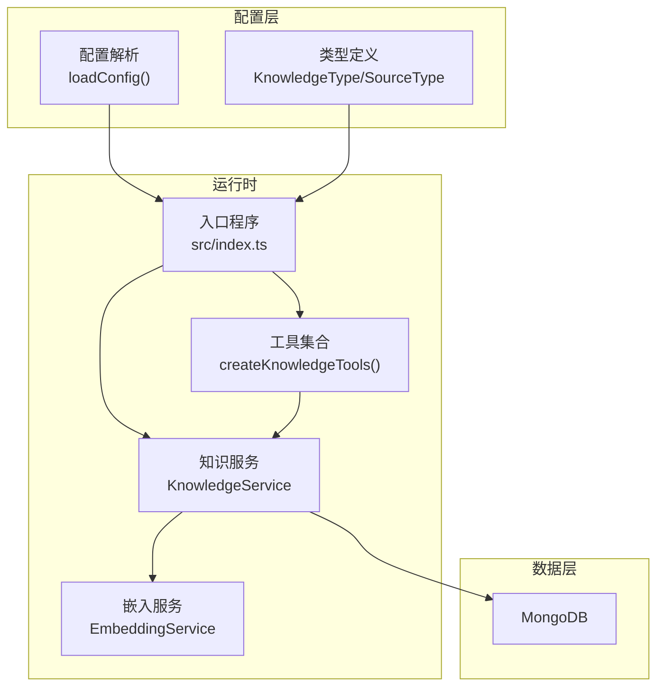
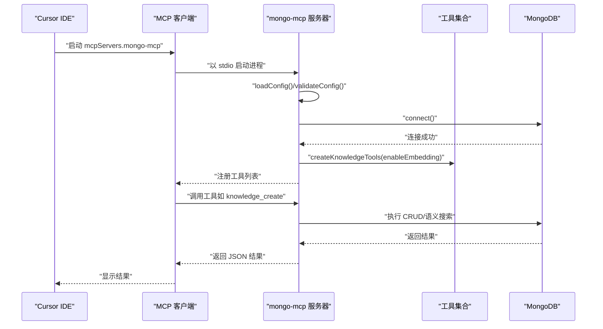
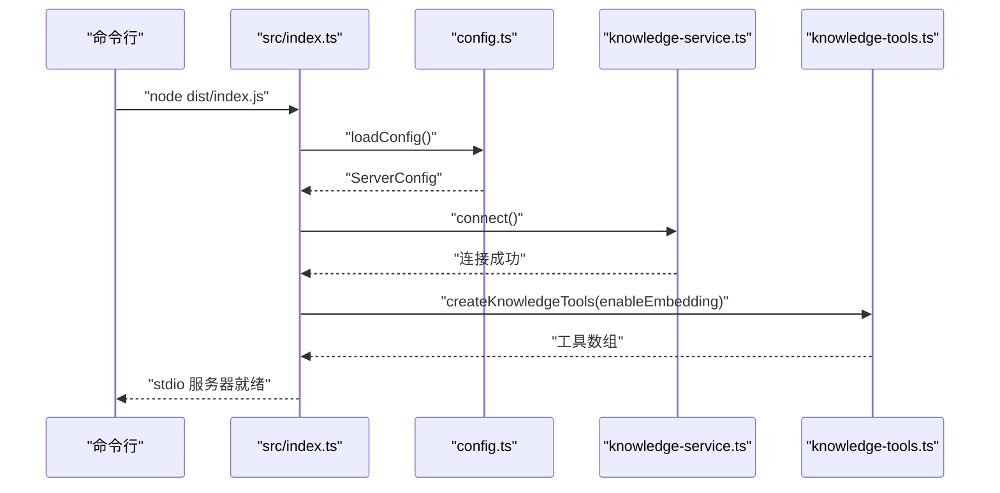
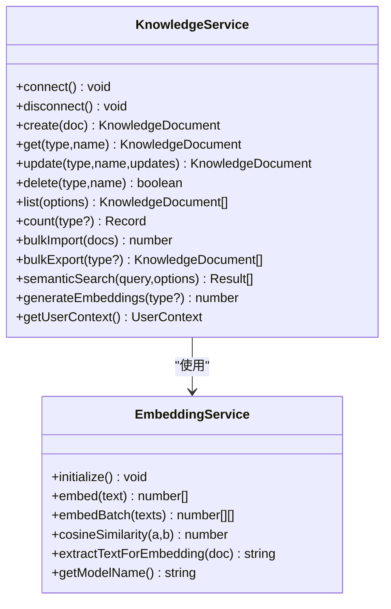
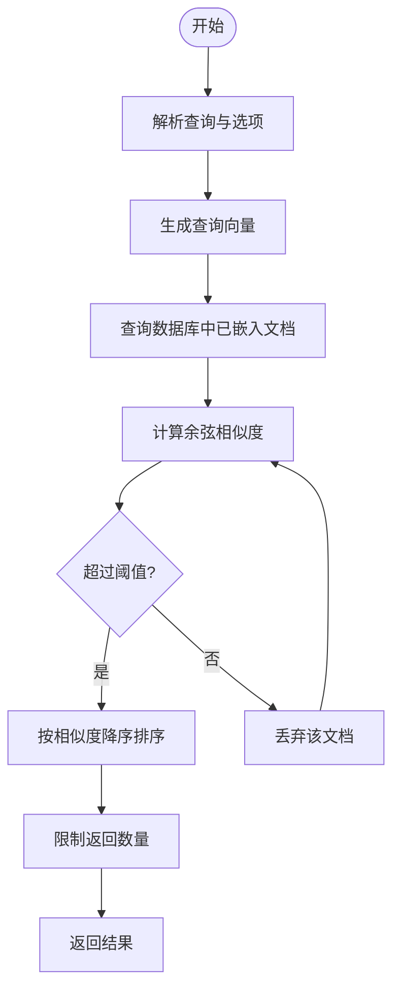
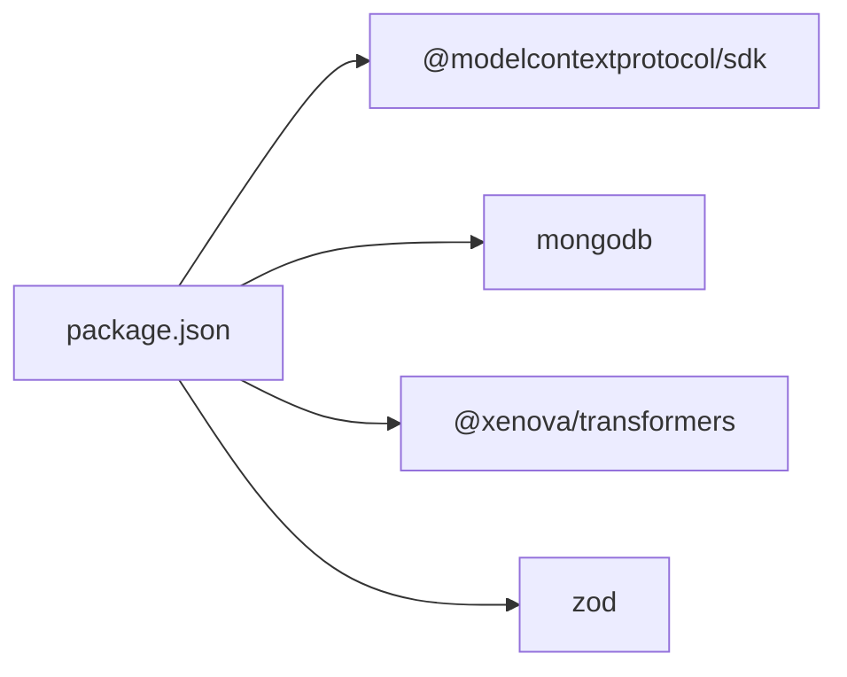

# Cursor IDE 集成

<cite>
**本文引用的文件**
- [examples/mcp-config.json](file://examples/mcp-config.json)
- [src/utils/config.ts](file://src/utils/config.ts)
- [src/index.ts](file://src/index.ts)
- [src/services/knowledge-service.ts](file://src/services/knowledge-service.ts)
- [src/tools/knowledge-tools.ts](file://src/tools/knowledge-tools.ts)
- [src/types.ts](file://src/types.ts)
- [src/services/embedding-service.ts](file://src/services/embedding-service.ts)
- [package.json](file://package.json)
</cite>

## 目录
1. [简介](#简介)
2. [项目结构](#项目结构)
3. [核心组件](#核心组件)
4. [架构总览](#架构总览)
5. [详细组件分析](#详细组件分析)
6. [依赖关系分析](#依赖关系分析)
7. [性能考虑](#性能考虑)
8. [故障排除指南](#故障排除指南)
9. [结论](#结论)
10. [附录](#附录)

## 简介
本指南面向 Cursor IDE 用户，提供 mongo-mcp 在 Cursor 中的完整集成方法。重点涵盖：
- Cursor IDE 的 MCP 配置文件格式与位置（~/.cursor/mcp.json）
- 配置文件中的 mcpServers 结构与 mongo-mcp 服务器定义
- 环境变量设置最佳实践（数据库连接串、用户标识、设备标识等）
- 连接测试与常见问题排查
- 多用户与多设备环境下的配置示例

## 项目结构
该项目是一个基于 Node.js 的 MCP 服务器，通过标准输入输出（stdio）模式与 IDE 通信，使用 MongoDB 存储知识库数据，并提供多种知识类型的 CRUD 与语义检索能力。

图表来源
- [src/index.ts](file://src/index.ts#L87-L148)
- [src/utils/config.ts](file://src/utils/config.ts#L76-L91)
- [src/services/knowledge-service.ts](file://src/services/knowledge-service.ts#L20-L40)
- [src/services/embedding-service.ts](file://src/services/embedding-service.ts#L11-L19)

章节来源
- [src/index.ts](file://src/index.ts#L1-L148)
- [src/utils/config.ts](file://src/utils/config.ts#L1-L147)
- [src/services/knowledge-service.ts](file://src/services/knowledge-service.ts#L1-L404)
- [src/services/embedding-service.ts](file://src/services/embedding-service.ts#L1-L148)
- [src/tools/knowledge-tools.ts](file://src/tools/knowledge-tools.ts#L1-L1093)
- [src/types.ts](file://src/types.ts#L1-L269)

## 核心组件
- 配置加载与验证：从环境变量加载配置，提供默认值与校验逻辑
- MCP 服务器：以 stdio 模式启动，注册工具列表与调用处理器
- 知识服务：封装 MongoDB 连接、索引、CRUD、批量操作、语义搜索与嵌入生成
- 嵌入服务：基于 Transformers.js 的本地文本向量化
- 工具集合：提供通用 CRUD、快捷工具、MCP/规则/技能/工作流同步、语义搜索与嵌入生成等

章节来源
- [src/utils/config.ts](file://src/utils/config.ts#L76-L147)
- [src/index.ts](file://src/index.ts#L87-L148)
- [src/services/knowledge-service.ts](file://src/services/knowledge-service.ts#L20-L404)
- [src/services/embedding-service.ts](file://src/services/embedding-service.ts#L11-L148)
- [src/tools/knowledge-tools.ts](file://src/tools/knowledge-tools.ts#L29-L1093)
- [src/types.ts](file://src/types.ts#L1-L269)

## 架构总览
以下序列图展示了 Cursor IDE 启动 mongo-mcp 的典型交互流程。

图表来源
- [src/index.ts](file://src/index.ts#L87-L148)
- [src/utils/config.ts](file://src/utils/config.ts#L76-L115)
- [src/tools/knowledge-tools.ts](file://src/tools/knowledge-tools.ts#L29-L1093)
- [src/services/knowledge-service.ts](file://src/services/knowledge-service.ts#L44-L54)

## 详细组件分析

### 配置文件格式与位置（~/.cursor/mcp.json）
- 文件位置：Cursor IDE 的 MCP 配置位于用户主目录下的 ~/.cursor/mcp.json
- 结构要点：
  - mcpServers：定义 MCP 服务器列表
  - mongo-mcp：服务器名称，对应本项目
  - command：启动命令（例如 npx）
  - args：命令参数（例如 -y mongo-mcp）
  - env：环境变量字典，包含数据库连接串、数据库名、用户标识、设备标识、IDE 来源等

章节来源
- [examples/mcp-config.json](file://examples/mcp-config.json#L24-L39)

### mcpServers 结构与 mongo-mcp 服务器定义
- mcpServers.mongo-mcp 的字段：
  - command：启动命令（如 npx）
  - args：命令参数数组（如 -y mongo-mcp）
  - env：环境变量对象，包含：
    - MONGO_URI：MongoDB 连接串
    - MONGO_DATABASE：数据库名
    - USER_ID：用户标识符
    - DEVICE_ID：设备标识符
    - IDE_SOURCE：IDE 来源（cursor）
    - ENABLE_EMBEDDING：是否启用向量嵌入（可选）
    - LOG_LEVEL：日志级别（可选）

章节来源
- [examples/mcp-config.json](file://examples/mcp-config.json#L26-L36)
- [src/utils/config.ts](file://src/utils/config.ts#L76-L91)

### 环境变量设置最佳实践
- 必填项
  - MONGO_URI：MongoDB 连接串（推荐使用带认证的连接串）
  - MONGO_DATABASE：数据库名（建议区分不同 IDE 或团队）
- 推荐项
  - USER_ID：用户邮箱或唯一标识，确保跨设备同步一致性
  - DEVICE_ID：设备标识，建议包含 IDE 来源与主机名
  - IDE_SOURCE：IDE 来源（cursor、vscode、qoder 等）
  - ENABLE_EMBEDDING：生产环境建议开启，便于语义搜索
  - LOG_LEVEL：调试阶段设为 debug，生产环境设为 info
- 默认值与覆盖顺序
  - 配置加载优先级：MCP 客户端传入 env > 系统环境变量 > 内置默认值
  - 默认数据库名：mongo_mcp
  - 默认集合名：knowledge
  - 默认用户标识：default
  - 默认设备标识：由 IDE 来源 + 主机名生成
  - 默认日志级别：info

章节来源
- [src/utils/config.ts](file://src/utils/config.ts#L76-L91)
- [src/utils/config.ts](file://src/utils/config.ts#L33-L36)
- [src/utils/config.ts](file://src/utils/config.ts#L60-L66)

### MCP 启动与工具注册流程
- 入口程序负责：
  - 加载配置并校验
  - 连接 MongoDB 并创建索引
  - 初始化知识服务与工具集合
  - 以 stdio 模式启动 MCP 服务器
- 工具注册：
  - 列出工具清单
  - 处理工具调用请求
  - 返回 JSON 格式结果

图表来源
- [src/index.ts](file://src/index.ts#L87-L148)
- [src/utils/config.ts](file://src/utils/config.ts#L76-L91)
- [src/services/knowledge-service.ts](file://src/services/knowledge-service.ts#L44-L54)
- [src/tools/knowledge-tools.ts](file://src/tools/knowledge-tools.ts#L29-L1093)

### 知识服务与数据模型
- 知识类型（8 种）：Memories、Skills、Rules、MCPs、Experiences、Commands、Contexts、Workflows
- 用户上下文：userId、deviceId、ideSource，用于跨设备与跨 IDE 同步
- 索引策略：按 userId + type + name 唯一；按 userId + type、userId + deviceId、userId + tags、userId + updatedAt 排序
- 支持的操作：创建、读取、更新、删除、列表、统计、批量导入/导出、upsert、存在性检查、语义搜索、嵌入生成

图表来源
- [src/services/knowledge-service.ts](file://src/services/knowledge-service.ts#L20-L404)
- [src/services/embedding-service.ts](file://src/services/embedding-service.ts#L11-L148)

章节来源
- [src/services/knowledge-service.ts](file://src/services/knowledge-service.ts#L20-L404)
- [src/types.ts](file://src/types.ts#L6-L74)
- [src/services/embedding-service.ts](file://src/services/embedding-service.ts#L11-L148)

### 工具集合与语义搜索
- 工具集合包含：
  - 通用 CRUD：knowledge_create、knowledge_read、knowledge_update、knowledge_delete、knowledge_list、knowledge_stats、knowledge_upsert
  - 快捷工具：memory_add、memory_search、experience_add、command_add、context_set、mcp_sync、rule_sync、skill_sync、workflow_create
  - 导出工具：knowledge_export
  - 语义工具（可选）：semantic_search、generate_embeddings（当 ENABLE_EMBEDDING=true 时）
- 语义搜索流程：
  - 输入查询文本
  - 生成向量嵌入
  - 计算与已有文档的余弦相似度
  - 过滤阈值并排序返回

图表来源
- [src/tools/knowledge-tools.ts](file://src/tools/knowledge-tools.ts#L1002-L1056)
- [src/services/knowledge-service.ts](file://src/services/knowledge-service.ts#L272-L299)
- [src/services/embedding-service.ts](file://src/services/embedding-service.ts#L85-L104)

章节来源
- [src/tools/knowledge-tools.ts](file://src/tools/knowledge-tools.ts#L29-L1093)
- [src/services/knowledge-service.ts](file://src/services/knowledge-service.ts#L272-L341)
- [src/services/embedding-service.ts](file://src/services/embedding-service.ts#L56-L104)

## 依赖关系分析
- 运行时依赖
  - @modelcontextprotocol/sdk：实现 MCP 协议
  - mongodb：MongoDB 官方驱动
  - @xenova/transformers：本地文本向量化
  - zod：类型校验（在本项目中未直接使用）
- 开发依赖
  - typescript、eslint、tsx 等

图表来源
- [package.json](file://package.json#L30-L43)

章节来源
- [package.json](file://package.json#L1-L48)

## 性能考虑
- 嵌入模型初始化：首次使用会加载模型，建议在空闲时段预热或在 CI 中提前构建
- 语义搜索：对大量文档进行相似度计算，建议合理设置阈值与返回数量
- 索引优化：确保按 userId + type + name 唯一索引与常用查询字段索引存在
- 日志级别：生产环境避免使用 debug，减少 I/O 压力

## 故障排除指南
- 连接失败
  - 检查 MONGO_URI 是否正确（含认证信息）
  - 确认 MongoDB 实例可达且防火墙放行
  - 验证 MONGO_DATABASE 是否存在或具备写权限
- 工具调用错误
  - 查看日志输出（LOG_LEVEL 控制）
  - 确认工具名称拼写正确
  - 检查必填参数是否缺失
- 语义搜索无结果
  - 确认 ENABLE_EMBEDDING=true
  - 先执行 generate_embeddings 为文档生成嵌入
  - 调整阈值与返回数量
- 跨设备同步异常
  - 确保 USER_ID 一致
  - 确保 DEVICE_ID 区分不同设备
  - 确保 IDE_SOURCE 一致

章节来源
- [src/utils/config.ts](file://src/utils/config.ts#L96-L115)
- [src/index.ts](file://src/index.ts#L93-L98)
- [src/tools/knowledge-tools.ts](file://src/tools/knowledge-tools.ts#L1002-L1056)

## 结论
通过在 Cursor IDE 中配置 mcpServers.mongo-mcp，并正确设置环境变量，即可将 mongo-mcp 作为 MCP 服务器接入 Cursor。项目提供了完善的配置加载、工具注册、知识管理与语义搜索能力，适合在多用户、多设备环境下使用。建议结合实际需求调整日志级别、嵌入策略与索引策略，以获得更佳的性能与体验。

## 附录

### Cursor IDE 配置示例（~/.cursor/mcp.json）
- 示例位置：examples/mcp-config.json 中的 cursor 节点
- 关键字段：mcpServers.mongo-mcp.command、args、env
- env 建议包含：MONGO_URI、MONGO_DATABASE、USER_ID、DEVICE_ID、IDE_SOURCE

章节来源
- [examples/mcp-config.json](file://examples/mcp-config.json#L24-L39)

### 多用户与多设备配置示例
- 本地开发示例：examples/mcp-config.json 中的 local_development 节点
- 云数据库共享示例：examples/mcp-config.json 中的 shared_cloud 节点
- 建议做法：
  - 为每个用户设置独立的 USER_ID
  - 为每台设备设置唯一的 DEVICE_ID
  - 使用相同的 MONGO_URI 与 MONGO_DATABASE 实现跨设备同步

章节来源
- [examples/mcp-config.json](file://examples/mcp-config.json#L57-L92)