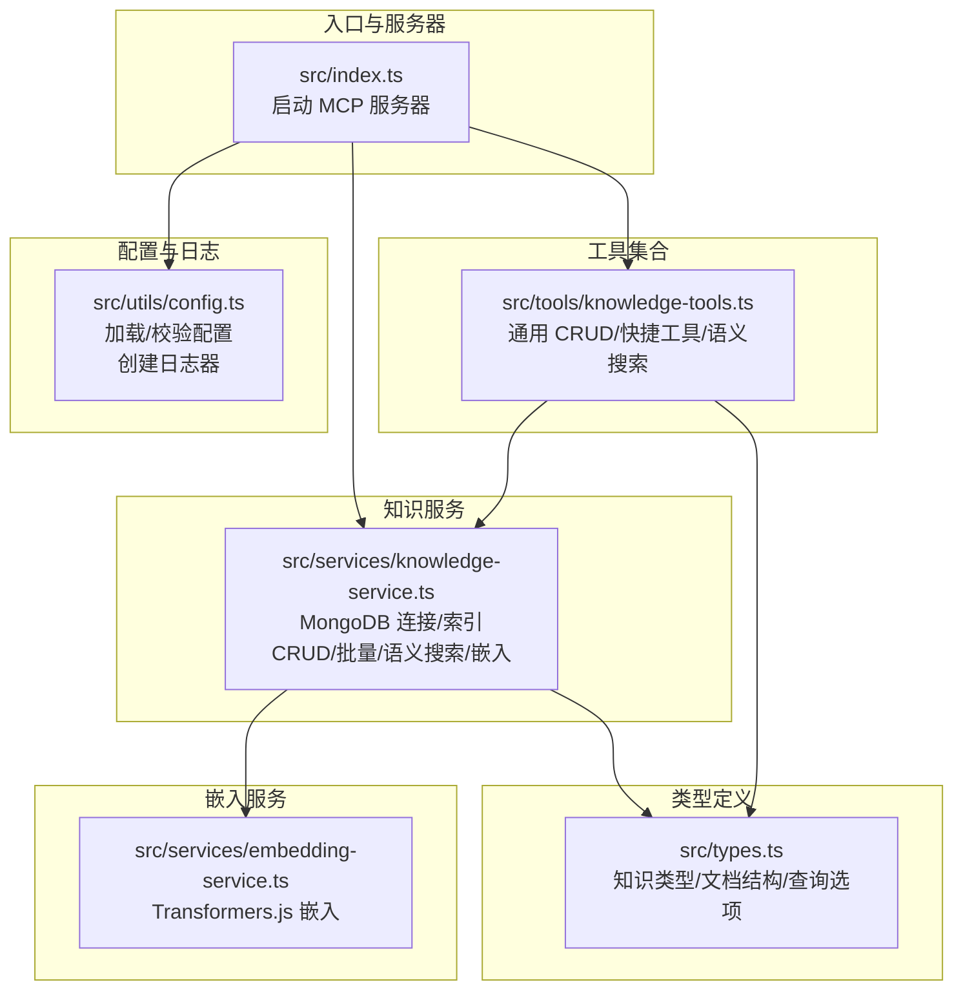
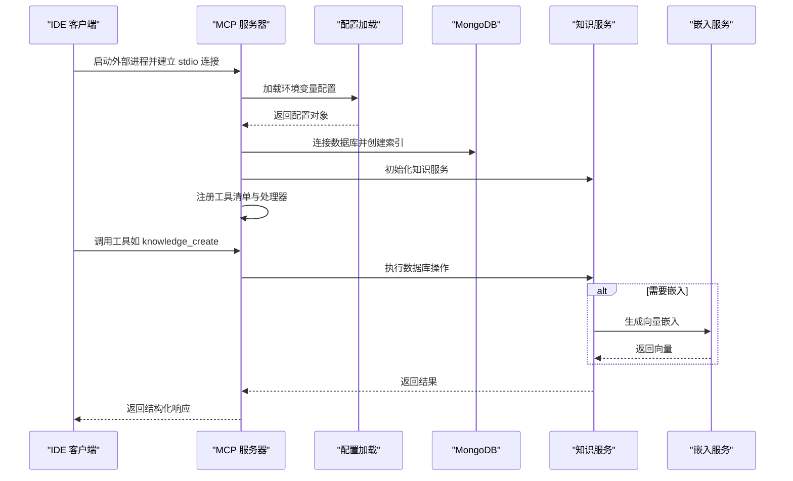
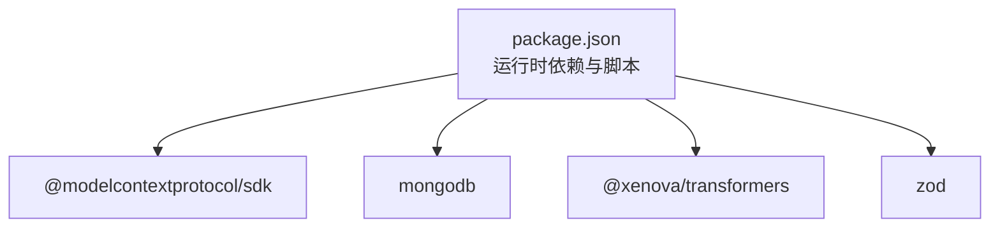

# IDE 集成

<cite>
**本文引用的文件**
- [examples/mcp-config.json](file://examples/mcp-config.json)
- [src/index.ts](file://src/index.ts)
- [src/utils/config.ts](file://src/utils/config.ts)
- [src/services/knowledge-service.ts](file://src/services/knowledge-service.ts)
- [src/tools/knowledge-tools.ts](file://src/tools/knowledge-tools.ts)
- [src/services/embedding-service.ts](file://src/services/embedding-service.ts)
- [src/types.ts](file://src/types.ts)
- [package.json](file://package.json)
</cite>

## 目录
1. [简介](#简介)
2. [项目结构](#项目结构)
3. [核心组件](#核心组件)
4. [架构总览](#架构总览)
5. [详细组件分析](#详细组件分析)
6. [依赖关系分析](#依赖关系分析)
7. [性能考虑](#性能考虑)
8. [故障排查指南](#故障排查指南)
9. [结论](#结论)
10. [附录](#附录)

## 简介
本指南面向希望在多种 IDE（Qoder、Cursor、VS Code、Trae 等）中集成 mongo-mcp 的开发者与团队。mongo-mcp 是一个基于 Model Context Protocol（MCP）的服务器，通过标准工具接口与 IDE 交互，实现知识库的统一管理与跨 IDE 同步。该服务器以 MongoDB 作为持久化存储，支持多种知识类型（记忆、技能、规则、MCP 配置、经验、命令、上下文、工作流），并提供可选的向量嵌入能力，用于语义搜索与智能检索。

本指南将：
- 说明如何在不同 IDE 中配置 mongo-mcp 服务器
- 提供 MCP 配置文件格式、参数含义与最佳实践
- 给出环境变量设置与连接验证方法
- 解释常见集成问题的诊断与解决
- 提供自定义 IDE 配置的方法与示例
- 文档化 IDE 特定的功能支持与限制
- 给出开发工作流优化建议与团队协作配置

## 项目结构
mongo-mcp 采用模块化设计，核心由以下部分组成：
- 入口与服务器：负责启动 MCP 服务器、注册工具、处理请求
- 配置与日志：解析环境变量、校验配置、输出日志
- 知识服务：封装 MongoDB 连接、索引、CRUD、批量操作、语义搜索与嵌入
- 工具集合：提供统一的知识库管理工具与快捷工具
- 嵌入服务：基于 Transformers.js 的文本向量生成与相似度计算
- 类型定义：统一的知识类型、文档结构与查询选项

图表来源
- [src/index.ts](file://src/index.ts#L1-L148)
- [src/utils/config.ts](file://src/utils/config.ts#L1-L147)
- [src/services/knowledge-service.ts](file://src/services/knowledge-service.ts#L1-L404)
- [src/tools/knowledge-tools.ts](file://src/tools/knowledge-tools.ts#L1-L1093)
- [src/services/embedding-service.ts](file://src/services/embedding-service.ts#L1-L148)
- [src/types.ts](file://src/types.ts#L1-L269)

章节来源
- [src/index.ts](file://src/index.ts#L1-L148)
- [src/utils/config.ts](file://src/utils/config.ts#L1-L147)
- [src/services/knowledge-service.ts](file://src/services/knowledge-service.ts#L1-L404)
- [src/tools/knowledge-tools.ts](file://src/tools/knowledge-tools.ts#L1-L1093)
- [src/services/embedding-service.ts](file://src/services/embedding-service.ts#L1-L148)
- [src/types.ts](file://src/types.ts#L1-L269)

## 核心组件
- MCP 服务器与传输：通过 stdio 传输模式启动，注册工具清单与调用处理器
- 配置加载与校验：从环境变量加载配置，支持 IDE 来源、数据库、集合、用户与设备标识、嵌入开关与日志级别
- 知识服务：提供统一的 CRUD、批量导入导出、统计、语义搜索与嵌入生成功能
- 工具集合：覆盖通用 CRUD、快捷工具（记忆、经验、命令、上下文、MCP/规则/技能/工作流同步）、语义搜索与嵌入生成
- 嵌入服务：Transformers.js 模型懒加载、向量生成、余弦相似度计算
- 类型定义：统一的知识类型枚举、文档结构、查询选项与工具输入输出结构

章节来源
- [src/index.ts](file://src/index.ts#L1-L148)
- [src/utils/config.ts](file://src/utils/config.ts#L1-L147)
- [src/services/knowledge-service.ts](file://src/services/knowledge-service.ts#L1-L404)
- [src/tools/knowledge-tools.ts](file://src/tools/knowledge-tools.ts#L1-L1093)
- [src/services/embedding-service.ts](file://src/services/embedding-service.ts#L1-L148)
- [src/types.ts](file://src/types.ts#L1-L269)

## 架构总览
mongo-mcp 的运行时架构如下：
- IDE 通过 MCP 客户端启动外部进程（例如 npx mongo-mcp 或 node dist/index.js）
- 服务器启动后连接 MongoDB，创建必要的索引，并注册工具
- IDE 请求工具调用，服务器根据工具名分发到对应处理器
- 处理器调用知识服务执行数据库操作，必要时调用嵌入服务进行向量化
- 服务器返回结构化响应给 IDE

图表来源
- [src/index.ts](file://src/index.ts#L87-L145)
- [src/utils/config.ts](file://src/utils/config.ts#L76-L91)
- [src/services/knowledge-service.ts](file://src/services/knowledge-service.ts#L44-L87)
- [src/tools/knowledge-tools.ts](file://src/tools/knowledge-tools.ts#L36-L107)
- [src/services/embedding-service.ts](file://src/services/embedding-service.ts#L24-L51)

## 详细组件分析

### 配置与环境变量
- 配置来源优先级：MCP 客户端传入 env > 系统环境变量 > 默认值
- 关键环境变量
  - MONGO_URI：MongoDB 连接字符串（必填）
  - MONGO_DATABASE：数据库名称（默认 mongo_mcp）
  - MONGO_COLLECTION：集合名称（默认 knowledge）
  - USER_ID：用户标识（默认 default）
  - DEVICE_ID：设备标识（默认由 IDE 来源与主机名组合）
  - IDE_SOURCE：IDE 来源（qoder、trae、cursor、windsurf、vscode、manual、other）
  - ENABLE_EMBEDDING：是否启用向量嵌入（默认 false）
  - LOG_LEVEL：日志级别（debug、info、warn、error，默认 info）

- 配置校验：确保 MONGO_URI、MONGO_DATABASE、MONGO_COLLECTION 存在
- 日志器：按配置的日志级别输出调试、信息、警告、错误信息

章节来源
- [src/utils/config.ts](file://src/utils/config.ts#L76-L115)
- [src/utils/config.ts](file://src/utils/config.ts#L120-L146)
- [examples/mcp-config.json](file://examples/mcp-config.json#L1-L94)

### 知识服务（KnowledgeService）
- 数据库连接与索引：连接 MongoDB，创建用户级唯一索引、类型过滤索引、标签索引、时间排序索引等
- 用户上下文：注入 userId、deviceId、ideSource，支持跨设备同步
- 核心能力
  - CRUD：create、get、getById、update、delete、upsert
  - 列表与统计：list、count、exists
  - 批量：bulkImport、bulkExport
  - 语义搜索：semanticSearch、generateEmbeddings、generateEmbedding
  - 工具集成：配合工具集合提供知识库管理与快捷工具

章节来源
- [src/services/knowledge-service.ts](file://src/services/knowledge-service.ts#L44-L87)
- [src/services/knowledge-service.ts](file://src/services/knowledge-service.ts#L111-L190)
- [src/services/knowledge-service.ts](file://src/services/knowledge-service.ts#L195-L267)
- [src/services/knowledge-service.ts](file://src/services/knowledge-service.ts#L272-L341)
- [src/services/knowledge-service.ts](file://src/services/knowledge-service.ts#L346-L402)

### 工具集合（Knowledge Tools）
- 通用 CRUD 工具：knowledge_create、knowledge_read、knowledge_update、knowledge_delete、knowledge_list、knowledge_stats、knowledge_upsert
- 快捷工具：memory_add、memory_search、experience_add、command_add、context_set、mcp_sync、rule_sync、skill_sync、workflow_create
- 语义工具：semantic_search、generate_embeddings（仅在启用嵌入时）
- 工具输入/输出：使用统一的工具接口与类型定义，确保结构化响应

章节来源
- [src/tools/knowledge-tools.ts](file://src/tools/knowledge-tools.ts#L36-L107)
- [src/tools/knowledge-tools.ts](file://src/tools/knowledge-tools.ts#L110-L215)
- [src/tools/knowledge-tools.ts](file://src/tools/knowledge-tools.ts#L248-L334)
- [src/tools/knowledge-tools.ts](file://src/tools/knowledge-tools.ts#L337-L399)
- [src/tools/knowledge-tools.ts](file://src/tools/knowledge-tools.ts#L404-L506)
- [src/tools/knowledge-tools.ts](file://src/tools/knowledge-tools.ts#L509-L635)
- [src/tools/knowledge-tools.ts](file://src/tools/knowledge-tools.ts#L638-L694)
- [src/tools/knowledge-tools.ts](file://src/tools/knowledge-tools.ts#L697-L758)
- [src/tools/knowledge-tools.ts](file://src/tools/knowledge-tools.ts#L761-L822)
- [src/tools/knowledge-tools.ts](file://src/tools/knowledge-tools.ts#L825-L880)
- [src/tools/knowledge-tools.ts](file://src/tools/knowledge-tools.ts#L883-L953)
- [src/tools/knowledge-tools.ts](file://src/tools/knowledge-tools.ts#L956-L970)
- [src/tools/knowledge-tools.ts](file://src/tools/knowledge-tools.ts#L973-L996)
- [src/tools/knowledge-tools.ts](file://src/tools/knowledge-tools.ts#L1000-L1092)

### 嵌入服务（EmbeddingService）
- 模型懒加载：首次使用时初始化 Transformers.js 的特征提取管道
- 向量生成：对文本进行 mean 池化与归一化，返回数值向量
- 批量生成：支持批量文本向量化
- 相似度计算：余弦相似度，用于语义搜索
- 文本提取：从文档中抽取 name、description、content、tags 等字段拼接文本

章节来源
- [src/services/embedding-service.ts](file://src/services/embedding-service.ts#L24-L51)
- [src/services/embedding-service.ts](file://src/services/embedding-service.ts#L56-L80)
- [src/services/embedding-service.ts](file://src/services/embedding-service.ts#L85-L104)
- [src/services/embedding-service.ts](file://src/services/embedding-service.ts#L109-L129)
- [src/services/embedding-service.ts](file://src/services/embedding-service.ts#L142-L147)

### 类型定义（Types）
- 知识类型：Memories、Skills、Rules、MCPs、Experiences、Commands、Contexts、Workflows
- 文档结构：统一字段（type、name、content、description、tags、enabled、userId、deviceId、ideSource、syncVersion、createdAt、updatedAt 等）
- 查询选项：ListOptions、SemanticSearchOptions
- 工具输入输出：McpTool 接口与各类型文档的专用接口

章节来源
- [src/types.ts](file://src/types.ts#L6-L14)
- [src/types.ts](file://src/types.ts#L24-L74)
- [src/types.ts](file://src/types.ts#L252-L269)

## 依赖关系分析
- 运行时依赖
  - @modelcontextprotocol/sdk：MCP 服务器 SDK，提供 stdio 传输与请求/响应处理
  - mongodb：MongoDB 官方驱动，提供连接、集合操作与索引管理
  - @xenova/transformers：Transformers.js，提供特征提取与向量生成
  - zod：类型校验（在工具输入/输出中使用）
- 开发依赖
  - typescript、eslint、tsx 等，用于编译、类型检查与开发热重载

图表来源
- [package.json](file://package.json#L30-L43)

章节来源
- [package.json](file://package.json#L1-L48)

## 性能考虑
- 嵌入模型懒加载：首次使用时加载模型，避免启动时阻塞；可通过预热策略减少首次延迟
- 索引优化：用户级唯一索引、类型过滤索引、标签索引、时间排序索引，提升查询与排序性能
- 语义搜索：阈值与限制参数控制返回数量，避免高成本的全量相似度计算
- 批量操作：批量导入导出与批量嵌入生成，减少网络往返与事务开销
- 日志级别：生产环境建议使用 info 或更高，避免 debug 的高频输出影响性能

[本节为通用性能讨论，无需特定文件引用]

## 故障排查指南
- 配置校验失败
  - 现象：启动时报错并退出
  - 排查：确认 MONGO_URI、MONGO_DATABASE、MONGO_COLLECTION 是否设置
  - 参考：配置校验逻辑与错误输出
- 数据库连接失败
  - 现象：连接 MongoDB 超时或认证失败
  - 排查：检查 MONGO_URI 格式、网络连通性、凭据与防火墙设置
  - 参考：连接与索引创建流程
- 工具调用异常
  - 现象：工具返回错误消息
  - 排查：查看工具处理器的错误捕获与返回结构，确认输入参数与权限
  - 参考：工具处理器与知识服务调用链
- 嵌入功能不可用
  - 现象：semantic_search 无法使用或报错
  - 排查：确认 ENABLE_EMBEDDING 为 true，且已生成嵌入；检查模型加载日志
  - 参考：嵌入服务初始化与向量生成
- 日志定位
  - 使用 LOG_LEVEL 控制输出级别，结合服务器启动日志定位问题

章节来源
- [src/utils/config.ts](file://src/utils/config.ts#L96-L115)
- [src/index.ts](file://src/index.ts#L93-L98)
- [src/index.ts](file://src/index.ts#L117-L120)
- [src/tools/knowledge-tools.ts](file://src/tools/knowledge-tools.ts#L56-L78)
- [src/services/embedding-service.ts](file://src/services/embedding-service.ts#L42-L51)

## 结论
mongo-mcp 提供了跨 IDE 的统一知识库管理能力，通过标准 MCP 工具接口与 MongoDB 持久化，支持多种知识类型与可选的语义搜索。通过合理的配置与环境变量设置，可在 Qoder、Cursor、VS Code、Trae 等 IDE 中稳定集成。建议在团队内统一配置模板与命名规范，结合嵌入功能提升检索质量，并通过批量导入导出与工作流工具优化开发效率。

[本节为总结，无需特定文件引用]

## 附录

### IDE 集成配置步骤与最佳实践

- Qoder
  - 配置位置：IDE 内部的 MCP 服务器配置
  - 关键参数
    - command：npx
    - args：["-y", "mongo-mcp"]
    - env：MONGO_URI、MONGO_DATABASE、USER_ID、DEVICE_ID、IDE_SOURCE、ENABLE_EMBEDDING、LOG_LEVEL
  - 最佳实践
    - 为每个用户/设备设置独立的 DEVICE_ID，便于跨设备同步
    - 在团队内统一 MONGO_DATABASE 与 COLLECTION，避免冲突
    - 启用 ENABLE_EMBEDDING 以获得语义搜索能力
  - 参考配置示例
    - [examples/mcp-config.json](file://examples/mcp-config.json#L5-L22)

- Cursor
  - 配置位置：~/.cursor/mcp.json
  - 关键参数
    - command：npx
    - args：["-y", "mongo-mcp"]
    - env：MONGO_URI、MONGO_DATABASE、USER_ID、DEVICE_ID、IDE_SOURCE
  - 最佳实践
    - 使用稳定的 MONGO_URI（本地或云数据库）
    - 为 Cursor 设备设置明确的 DEVICE_ID
  - 参考配置示例
    - [examples/mcp-config.json](file://examples/mcp-config.json#L24-L39)

- VS Code
  - 配置位置：.vscode/settings.json
  - 关键参数
    - mcp.servers：mongo-mcp
    - command：npx
    - args：["-y", "mongo-mcp"]
    - env：MONGO_URI、MONGO_DATABASE、USER_ID、IDE_SOURCE
  - 最佳实践
    - 将配置放入项目根目录的 .vscode/settings.json，便于团队共享
    - 使用相对稳定的数据库连接与用户标识
  - 参考配置示例
    - [examples/mcp-config.json](file://examples/mcp-config.json#L41-L55)

- Trae（未在示例中直接出现，但支持 IDE_SOURCE）
  - 配置要点
    - IDE_SOURCE 设置为 trae
    - 其他参数与上述 IDE 类似
  - 参考类型定义
    - [src/utils/config.ts](file://src/utils/config.ts#L6)
    - [src/types.ts](file://src/types.ts#L19)

- 本地开发
  - 配置位置：手动启动或 IDE 配置
  - 关键参数
    - command：node
    - args：["/path/to/mongo-mcp/dist/index.js"]
    - env：MONGO_URI、MONGO_DATABASE、USER_ID、DEVICE_ID、IDE_SOURCE、ENABLE_EMBEDDING、LOG_LEVEL
  - 最佳实践
    - 使用本地构建产物，便于调试与热重载
    - 启用 debug 日志级别以便定位问题
  - 参考配置示例
    - [examples/mcp-config.json](file://examples/mcp-config.json#L57-L74)

- 云数据库共享
  - 配置要点
    - 使用云数据库连接串（如 mongodb+srv）
    - 团队共享 USER_ID 与 DEVICE_ID，确保跨设备同步
    - 启用 ENABLE_EMBEDDING 以提升检索质量
  - 参考配置示例
    - [examples/mcp-config.json](file://examples/mcp-config.json#L76-L92)

### MCP 配置文件格式与参数说明
- 文件结构
  - 顶层键：IDE 名称（如 qoder、cursor、vscode、local_development、shared_cloud）
  - 子键：mcpServers 或 mcp.servers（取决于 IDE）
  - 子项：mongo-mcp
    - command：外部进程命令（如 npx 或 node）
    - args：命令参数数组
    - env：环境变量对象
- 参数含义
  - MONGO_URI：MongoDB 连接字符串
  - MONGO_DATABASE：数据库名称
  - MONGO_COLLECTION：集合名称
  - USER_ID：用户标识
  - DEVICE_ID：设备标识
  - IDE_SOURCE：IDE 来源
  - ENABLE_EMBEDDING：是否启用嵌入
  - LOG_LEVEL：日志级别
- 最佳实践
  - 为每个 IDE/用户/设备设置唯一的 DEVICE_ID
  - 在团队内统一 DATABASE 与 COLLECTION 命名规范
  - 使用云数据库时，确保连接串安全与网络可达

章节来源
- [examples/mcp-config.json](file://examples/mcp-config.json#L1-L94)
- [src/utils/config.ts](file://src/utils/config.ts#L76-L91)

### 连接验证方法
- 启动日志
  - 观察服务器启动日志，确认数据库连接、工具加载与 stdio 启动
  - 参考：服务器主流程与日志输出
- 工具清单
  - 请求工具清单，确认工具列表正确加载
  - 参考：工具注册与处理器
- 基本 CRUD
  - 使用 knowledge_create、knowledge_read、knowledge_update、knowledge_delete 验证基本功能
  - 参考：通用 CRUD 工具
- 语义搜索（可选）
  - 在启用嵌入后，使用 semantic_search 验证语义检索
  - 参考：嵌入服务与语义工具

章节来源
- [src/index.ts](file://src/index.ts#L100-L131)
- [src/index.ts](file://src/index.ts#L29-L82)
- [src/tools/knowledge-tools.ts](file://src/tools/knowledge-tools.ts#L36-L107)
- [src/tools/knowledge-tools.ts](file://src/tools/knowledge-tools.ts#L1000-L1092)

### 自定义 IDE 配置方法与示例
- 新增 IDE 配置
  - 在 MCP 配置文件中新增一个顶层键（如 myide）
  - 设置 mcpServers 或 mcp.servers 下的 mongo-mcp 项
  - 指定 command、args、env
- 示例参考
  - 可参照现有示例（qoder、cursor、vscode、local_development、shared_cloud）
- 注意事项
  - 确保 IDE_SOURCE 与 IDE 名称一致
  - 为新 IDE 设置合适的 DEVICE_ID 与 DATABASE/COLLECTION

章节来源
- [examples/mcp-config.json](file://examples/mcp-config.json#L1-L94)
- [src/utils/config.ts](file://src/utils/config.ts#L49-L55)

### IDE 特定功能支持与限制
- 功能支持
  - 通用 CRUD：所有 IDE 均可使用
  - 快捷工具：记忆、经验、命令、上下文、MCP/规则/技能/工作流同步
  - 语义搜索：需启用嵌入功能
- 限制
  - 嵌入功能依赖 Transformers.js 模型加载，首次可能有延迟
  - 不同 IDE 的 MCP 客户端实现可能存在差异，工具可见性与交互略有不同
- 建议
  - 在团队内统一 IDE 与客户端版本
  - 对于需要语义搜索的场景，提前生成嵌入并定期更新

[本节为通用说明，无需特定文件引用]

### 开发工作流优化与团队协作配置
- 工作流优化
  - 使用批量导入导出工具快速迁移知识库
  - 通过工作流工具定义自动化流程，减少重复劳动
  - 启用嵌入功能，结合语义搜索提升检索效率
- 团队协作
  - 统一 MCP 配置模板，确保各 IDE 与环境一致
  - 使用云数据库共享知识库，支持跨设备同步
  - 为不同角色（开发者、测试、运维）设置不同的 USER_ID 与 DEVICE_ID，便于审计与追踪
- 安全与合规
  - 保护 MONGO_URI 凭据，避免泄露
  - 定期审查工具权限与访问控制

[本节为通用建议，无需特定文件引用]