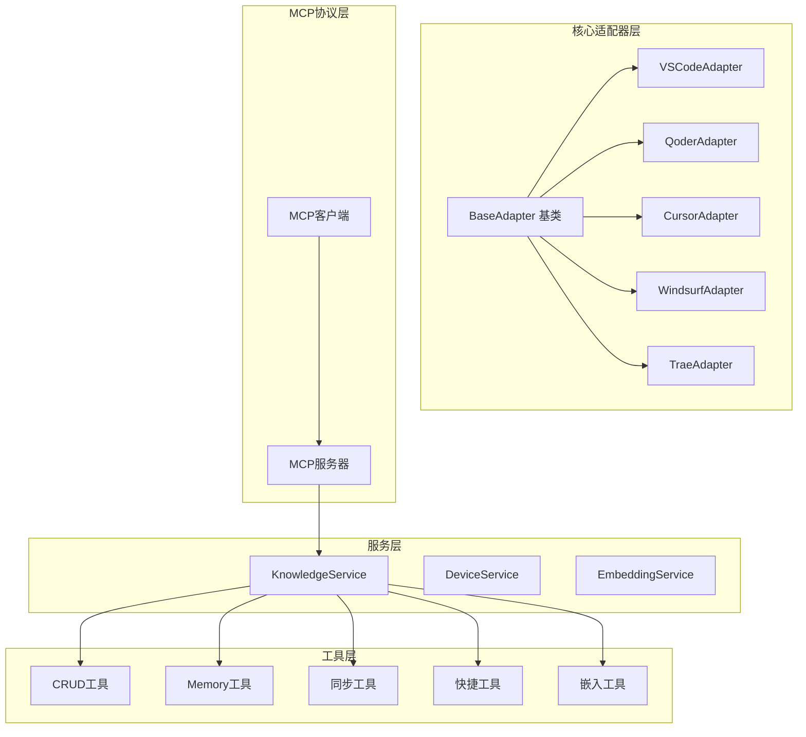
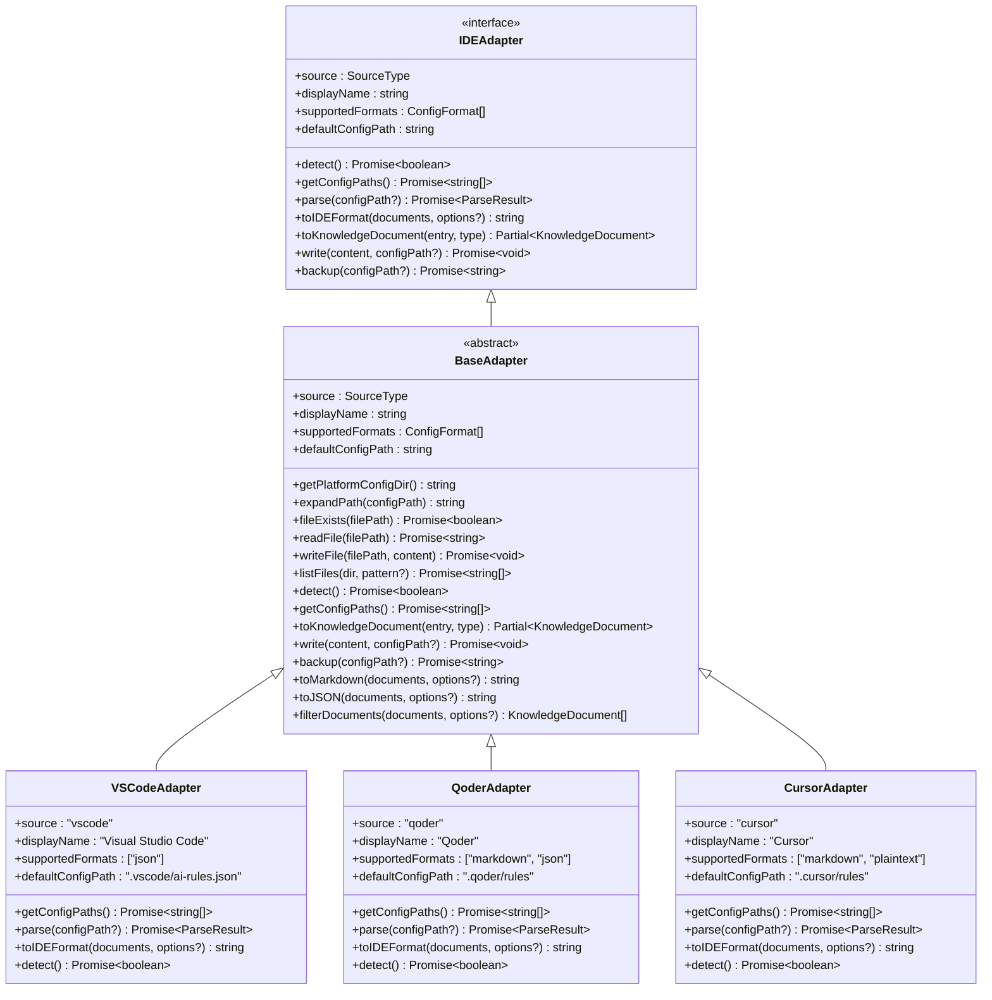
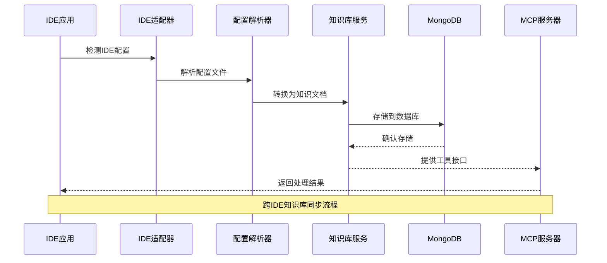
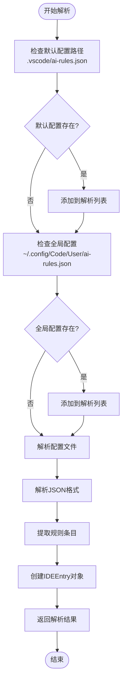
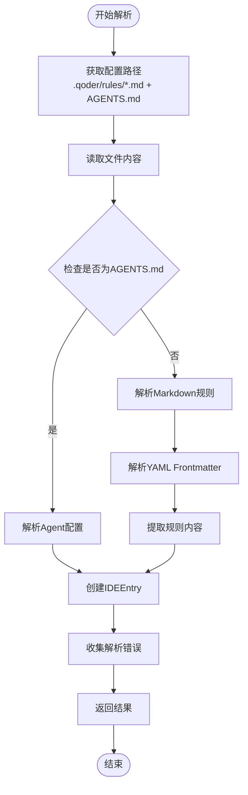
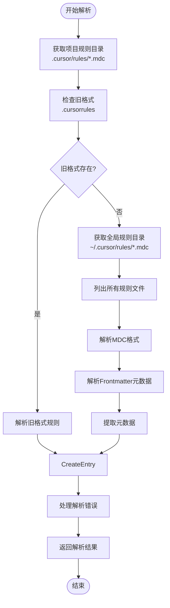
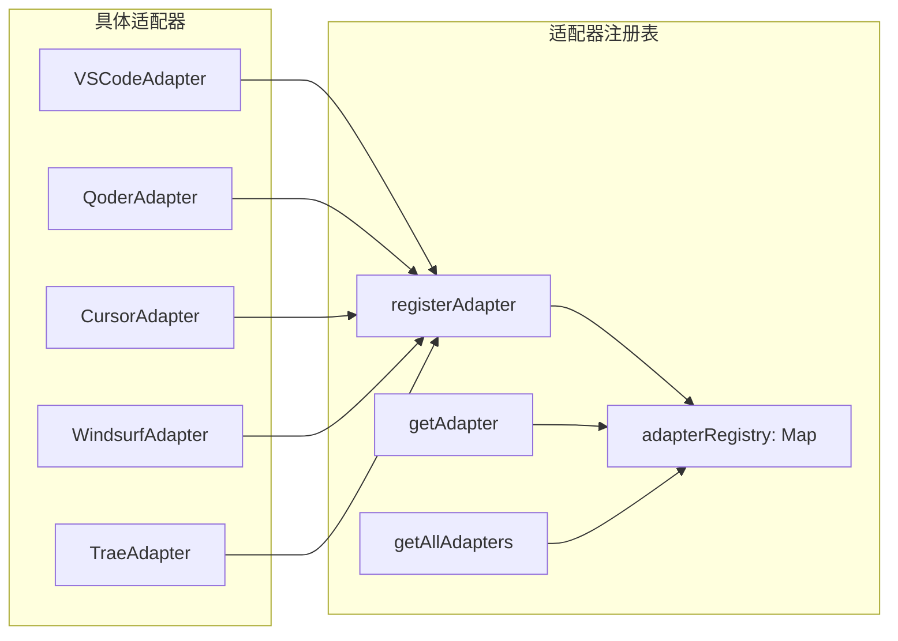

# IDE适配器架构

<cite>
**本文档引用的文件**
- [src/adapters/index.ts](file://src/adapters/index.ts)
- [src/adapters/ide.adapters.ts](file://src/adapters/ide.adapters.ts)
- [src/adapters/base.adapter.ts](file://src/adapters/base.adapter.ts)
- [src/adapters/types.ts](file://src/adapters/types.ts)
- [src/adapters/qoder.adapter.ts](file://src/adapters/qoder.adapter.ts)
- [src/adapters/cursor.adapter.ts](file://src/adapters/cursor.adapter.ts)
- [src/index.ts](file://src/index.ts)
- [src/types.ts](file://src/types.ts)
- [src/tools/index.ts](file://src/tools/index.ts)
- [src/services/knowledge-service.ts](file://src/services/knowledge-service.ts)
- [package.json](file://package.json)
- [examples/mcp-config.json](file://examples/mcp-config.json)
</cite>

## 目录
1. [简介](#简介)
2. [项目结构](#项目结构)
3. [核心组件](#核心组件)
4. [架构概览](#架构概览)
5. [详细组件分析](#详细组件分析)
6. [依赖关系分析](#依赖关系分析)
7. [性能考虑](#性能考虑)
8. [故障排除指南](#故障排除指南)
9. [结论](#结论)

## 简介

IDE适配器架构是一个基于MCP（Model Context Protocol）协议的跨IDE知识库管理系统。该系统支持多种IDE（VSCode、Qoder、Cursor、Windsurf、Trae），通过统一的适配器模式实现不同IDE配置格式的解析和转换。

该架构的核心目标是：
- 提供统一的知识库管理接口
- 支持多种IDE配置格式的无缝转换
- 实现跨IDE的知识库同步和共享
- 通过MCP协议与AI助手进行交互

## 项目结构

项目采用模块化设计，主要分为以下几个核心部分：



**图表来源**
- [src/adapters/base.adapter.ts](file://src/adapters/base.adapter.ts#L11-L255)
- [src/services/knowledge-service.ts](file://src/services/knowledge-service.ts#L20-L437)
- [src/tools/index.ts](file://src/tools/index.ts#L23-L47)

**章节来源**
- [src/adapters/index.ts](file://src/adapters/index.ts#L1-L15)
- [src/index.ts](file://src/index.ts#L1-L148)

## 核心组件

### 适配器接口体系

IDE适配器架构采用统一的接口设计，所有适配器都继承自BaseAdapter基类：



**图表来源**
- [src/adapters/types.ts](file://src/adapters/types.ts#L61-L106)
- [src/adapters/base.adapter.ts](file://src/adapters/base.adapter.ts#L11-L255)
- [src/adapters/ide.adapters.ts](file://src/adapters/ide.adapters.ts#L15-L96)
- [src/adapters/qoder.adapter.ts](file://src/adapters/qoder.adapter.ts#L15-L181)
- [src/adapters/cursor.adapter.ts](file://src/adapters/cursor.adapter.ts#L15-L191)

### 知识文档类型系统

系统支持8种不同类型的知识文档，每种都有特定的用途和结构：

| 类型 | 描述 | 主要用途 |
|------|------|----------|
| Memories | 记忆 | 对话历史、用户偏好、个人知识 |
| Skills | 技能 | 可执行脚本、自动化工作流 |
| Rules | 规则 | 行为约束、触发条件、安全策略 |
| MCPs | MCP配置 | 外部工具和服务配置 |
| Experiences | 经验 | 成功案例、最佳实践 |
| Commands | 命令 | 快捷命令、模板、批处理 |
| Contexts | 上下文 | 项目背景、领域知识、环境信息 |
| Workflows | 工作流 | 多步骤流程、复杂任务编排 |

**章节来源**
- [src/types.ts](file://src/types.ts#L6-L14)
- [src/types.ts](file://src/types.ts#L24-L76)
- [src/types.ts](file://src/types.ts#L82-L212)

## 架构概览

IDE适配器架构采用分层设计，从底层的文件系统操作到上层的MCP协议通信：



**图表来源**
- [src/adapters/base.adapter.ts](file://src/adapters/base.adapter.ts#L108-L122)
- [src/services/knowledge-service.ts](file://src/services/knowledge-service.ts#L143-L200)
- [src/index.ts](file://src/index.ts#L16-L82)

## 详细组件分析

### VSCode适配器

VSCode适配器专门处理VSCode的AI规则配置：



**图表来源**
- [src/adapters/ide.adapters.ts](file://src/adapters/ide.adapters.ts#L21-L71)

VSCode适配器的特点：
- 支持项目级和全局级配置
- 使用JSON格式存储AI规则
- 自动检测VSCode配置目录
- 支持多文件合并解析

**章节来源**
- [src/adapters/ide.adapters.ts](file://src/adapters/ide.adapters.ts#L15-L96)

### Qoder适配器

Qoder适配器处理Qoder IDE的Markdown规则文件：



**图表来源**
- [src/adapters/qoder.adapter.ts](file://src/adapters/qoder.adapter.ts#L44-L118)

Qoder适配器的Markdown解析机制：
- 支持YAML Frontmatter元数据
- 自动提取描述信息
- 处理触发条件和标签
- 支持JSON和Markdown两种导出格式

**章节来源**
- [src/adapters/qoder.adapter.ts](file://src/adapters/qoder.adapter.ts#L15-L181)

### Cursor适配器

Cursor适配器处理Cursor IDE的MDC（Markdown Config）格式：



**图表来源**
- [src/adapters/cursor.adapter.ts](file://src/adapters/cursor.adapter.ts#L24-L130)

Cursor适配器的MDC格式特性：
- 支持数组格式的元数据
- 灵活的启用状态控制
- 支持项目级和全局规则
- 兼容旧版配置格式

**章节来源**
- [src/adapters/cursor.adapter.ts](file://src/adapters/cursor.adapter.ts#L15-L191)

### 适配器注册机制

系统采用注册表模式管理所有适配器：



**图表来源**
- [src/adapters/types.ts](file://src/adapters/types.ts#L111-L132)
- [src/adapters/ide.adapters.ts](file://src/adapters/ide.adapters.ts#L297-L299)
- [src/adapters/qoder.adapter.ts](file://src/adapters/qoder.adapter.ts#L178)
- [src/adapters/cursor.adapter.ts](file://src/adapters/cursor.adapter.ts#L188)

**章节来源**
- [src/adapters/types.ts](file://src/adapters/types.ts#L109-L133)
- [src/adapters/ide.adapters.ts](file://src/adapters/ide.adapters.ts#L296-L304)
- [src/adapters/qoder.adapter.ts](file://src/adapters/qoder.adapter.ts#L177-L181)
- [src/adapters/cursor.adapter.ts](file://src/adapters/cursor.adapter.ts#L187-L191)

## 依赖关系分析

IDE适配器架构的依赖关系呈现清晰的层次结构：

```mermaid
graph TB
subgraph "外部依赖"
MCP_SDK[@modelcontextprotocol/sdk]
MongoDB[mongodb]
Transformers[@xenova/transformers]
Zod[zod]
end
subgraph "内部模块"
Adapters[adapters/]
Services[services/]
Tools[tools/]
Types[types/]
Utils[utils/]
end
subgraph "适配器模块"
BaseAdapter[base.adapter.ts]
IDEAdapters[ide.adapters.ts]
QoderAdapter[qoder.adapter.ts]
CursorAdapter[cursor.adapter.ts]
end
subgraph "服务模块"
KnowledgeService[knowledge-service.ts]
DeviceService[device-service.ts]
EmbeddingService[embedding-service.ts]
SyncEngine[sync-engine.ts]
end
subgraph "工具模块"
CRUDTools[crud.handler.ts]
MemoryTools[memory.handler.ts]
SyncTools[sync.handler.ts]
ShortcutTools[shortcut.handler.ts]
EmbeddingTools[embedding.handler.ts]
end
MCP_SDK --> Adapters
MCP_SDK --> Services
MCP_SDK --> Tools
MongoDB --> Services
Transformers --> Services
Adapters --> Services
Services --> Tools
Tools --> Adapters
BaseAdapter --> IDEAdapters
BaseAdapter --> QoderAdapter
BaseAdapter --> CursorAdapter
KnowledgeService --> CRUDTools
KnowledgeService --> MemoryTools
KnowledgeService --> SyncTools
KnowledgeService --> ShortcutTools
KnowledgeService --> EmbeddingTools
```

**图表来源**
- [package.json](file://package.json#L30-L43)
- [src/index.ts](file://src/index.ts#L3-L11)
- [src/adapters/base.adapter.ts](file://src/adapters/base.adapter.ts#L1-L6)

**章节来源**
- [package.json](file://package.json#L1-L48)
- [src/index.ts](file://src/index.ts#L1-L148)

## 性能考虑

### 文件系统操作优化

适配器基类提供了高效的文件系统操作方法：

- **路径展开优化**：支持环境变量和用户目录展开
- **异步I/O**：所有文件操作都是异步的，避免阻塞主线程
- **缓存策略**：合理使用文件系统缓存减少重复访问

### 数据库查询优化

知识库服务实现了多种复合索引以优化查询性能：

- **用户级唯一索引**：确保同用户下type+name的唯一性
- **复合查询索引**：优化常用查询模式如type+enabled+updatedAt
- **文本搜索索引**：支持name和description的全文搜索

### 内存管理

- **流式处理**：大文件解析时采用流式处理减少内存占用
- **批量操作**：支持批量插入和更新操作
- **连接池管理**：MongoDB连接池的合理配置

## 故障排除指南

### 常见问题及解决方案

#### 适配器无法注册

**问题症状**：适配器未被识别或无法使用

**可能原因**：
1. 适配器实例未正确导入
2. 注册函数调用顺序错误
3. 适配器源类型定义不匹配

**解决方法**：
```javascript
// 确保适配器正确导入和注册
import './adapters/qoder.adapter.js';
import './adapters/cursor.adapter.js';
import './adapters/ide.adapters.js';
```

#### 文件权限问题

**问题症状**：无法读取或写入配置文件

**解决方法**：
1. 检查文件权限设置
2. 确认用户对配置目录有读写权限
3. 在Windows上检查UAC权限

#### 数据库连接失败

**问题症状**：知识库操作异常

**解决方法**：
1. 验证MongoDB连接字符串
2. 检查网络连接和防火墙设置
3. 确认数据库服务正常运行

**章节来源**
- [src/adapters/types.ts](file://src/adapters/types.ts#L116-L118)
- [src/services/knowledge-service.ts](file://src/services/knowledge-service.ts#L44-L54)

## 结论

IDE适配器架构通过统一的接口设计和模块化组织，成功实现了跨IDE的知识库管理。该架构的主要优势包括：

1. **高度可扩展性**：新的IDE适配器可以轻松添加
2. **统一的数据模型**：所有IDE配置最终转换为统一的知识文档格式
3. **强大的MCP集成**：通过MCP协议实现与AI助手的无缝交互
4. **完善的错误处理**：健壮的错误处理和恢复机制
5. **性能优化**：针对文件系统和数据库操作的优化设计

该架构为开发者提供了一个灵活、可扩展的平台，可以支持更多IDE的集成和更多功能的扩展。通过持续的优化和改进，该系统能够满足复杂的企业级知识管理需求。