# Qoder IDE 集成

<cite>
**本文档引用的文件**
- [mcp-config.json](file://examples/mcp-config.json)
- [config.ts](file://src/utils/config.ts)
- [index.ts](file://src/index.ts)
- [knowledge-service.ts](file://src/services/knowledge-service.ts)
- [knowledge-tools.ts](file://src/tools/knowledge-tools.ts)
- [types.ts](file://src/types.ts)
- [package.json](file://package.json)
</cite>

## 目录
1. [简介](#简介)
2. [项目结构](#项目结构)
3. [核心组件](#核心组件)
4. [架构概览](#架构概览)
5. [详细组件分析](#详细组件分析)
6. [Qoder IDE 集成配置](#qoder-ide-集成配置)
7. [环境变量配置](#环境变量配置)
8. [配置验证](#配置验证)
9. [常见问题诊断](#常见问题诊断)
10. [生产环境配置示例](#生产环境配置示例)
11. [开发环境配置示例](#开发环境配置示例)
12. [性能考虑](#性能考虑)
13. [故障排除指南](#故障排除指南)
14. [结论](#结论)

## 简介

mongo-mcp 是一个基于 MongoDB 的 MCP（Model Context Protocol）服务器，专为 Qoder IDE 等开发环境设计。该项目提供了跨 IDE 的知识库管理功能，支持记忆、技能、规则、MCP、经验、命令、上下文、工作流等多种知识类型的存储和管理。

该服务器通过标准的 MCP 协议与 IDE 集成，允许开发者在不同的开发环境中共享和同步个人知识库。mongo-mcp 特别针对 Qoder IDE 进行了优化，提供了完整的配置支持和环境变量管理。

## 项目结构

mongo-mcp 项目采用模块化架构设计，主要包含以下核心目录和文件：

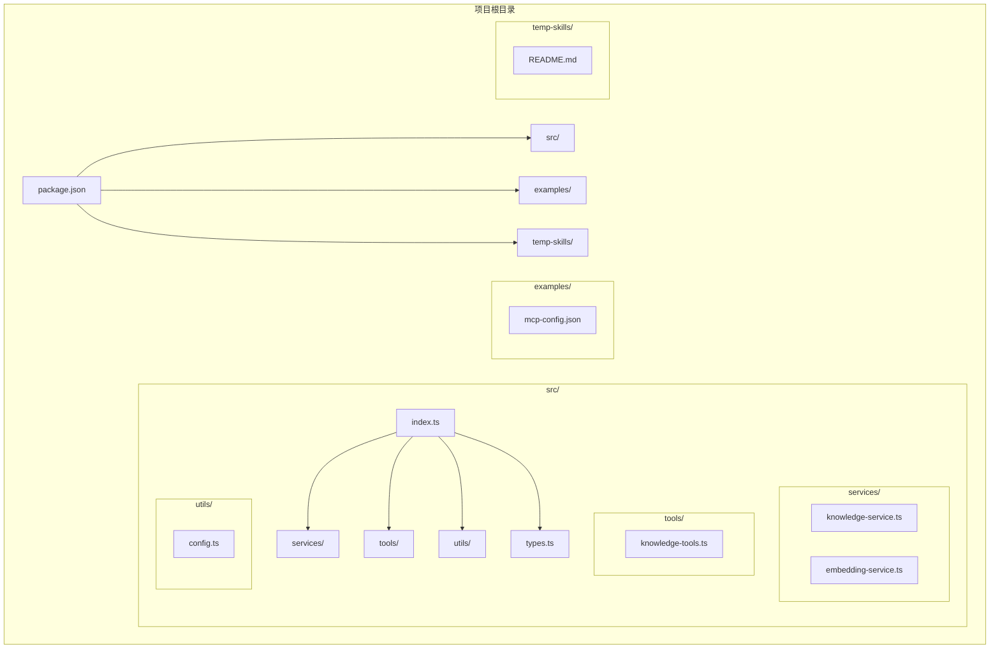

**图表来源**
- [package.json](file://package.json#L1-L48)
- [index.ts](file://src/index.ts#L1-L148)

**章节来源**
- [package.json](file://package.json#L1-L48)
- [index.ts](file://src/index.ts#L1-L148)

## 核心组件

mongo-mcp 由多个核心组件构成，每个组件都有特定的功能和职责：

### 服务器组件
- **主入口点**: `src/index.ts` - 应用程序的启动入口，负责初始化服务器和配置加载
- **配置管理**: `src/utils/config.ts` - 处理环境变量解析和配置验证
- **知识服务**: `src/services/knowledge-service.ts` - 核心业务逻辑，管理 MongoDB 连接和知识库操作

### 工具组件
- **知识工具**: `src/tools/knowledge-tools.ts` - 提供 MCP 工具集，包括 CRUD 操作和快捷工具
- **嵌入服务**: `src/services/embedding-service.ts` - 处理向量嵌入生成功能

### 类型定义
- **数据类型**: `src/types.ts` - 定义所有知识库文档的数据结构和类型

**章节来源**
- [index.ts](file://src/index.ts#L1-L148)
- [config.ts](file://src/utils/config.ts#L1-L147)
- [knowledge-service.ts](file://src/services/knowledge-service.ts#L1-L404)
- [knowledge-tools.ts](file://src/tools/knowledge-tools.ts#L1-L800)
- [types.ts](file://src/types.ts#L1-L269)

## 架构概览

mongo-mcp 采用分层架构设计，确保了良好的可维护性和扩展性：

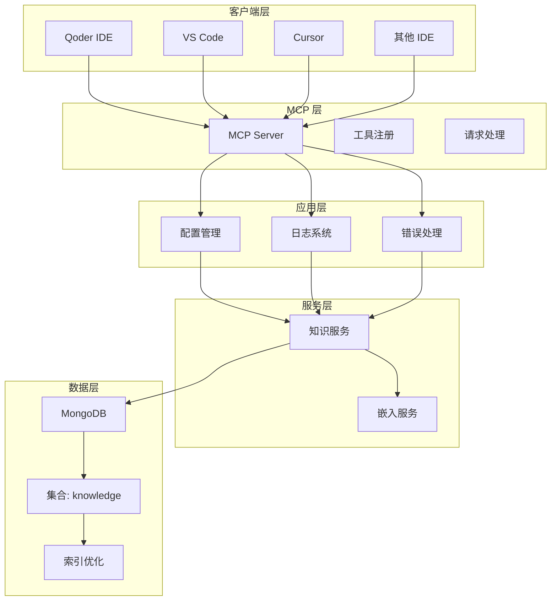

**图表来源**
- [index.ts](file://src/index.ts#L16-L82)
- [knowledge-service.ts](file://src/services/knowledge-service.ts#L20-L404)
- [config.ts](file://src/utils/config.ts#L76-L91)

## 详细组件分析

### 配置管理系统

配置管理系统是 mongo-mcp 的核心基础设施，负责处理环境变量、验证配置有效性和提供日志功能。

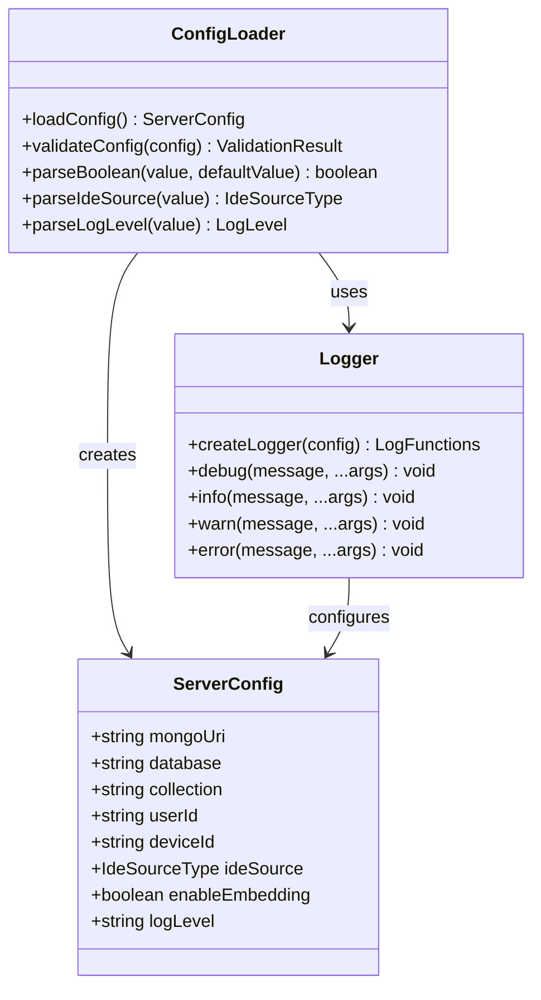

**图表来源**
- [config.ts](file://src/utils/config.ts#L11-L28)
- [config.ts](file://src/utils/config.ts#L76-L91)
- [config.ts](file://src/utils/config.ts#L120-L146)

### 知识服务架构

知识服务是 mongo-mcp 的核心业务逻辑，提供了完整的 CRUD 操作和高级功能。

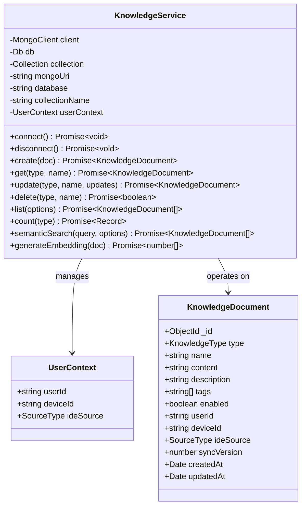

**图表来源**
- [knowledge-service.ts](file://src/services/knowledge-service.ts#L20-L404)
- [types.ts](file://src/types.ts#L24-L74)

### MCP 工具系统

MCP 工具系统提供了丰富的知识库管理功能，支持多种操作模式。

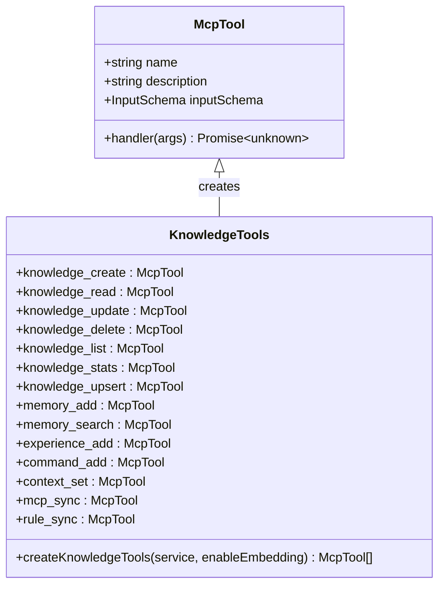

**图表来源**
- [knowledge-tools.ts](file://src/tools/knowledge-tools.ts#L7-L16)
- [knowledge-tools.ts](file://src/tools/knowledge-tools.ts#L29-L32)

**章节来源**
- [config.ts](file://src/utils/config.ts#L1-L147)
- [knowledge-service.ts](file://src/services/knowledge-service.ts#L1-L404)
- [knowledge-tools.ts](file://src/tools/knowledge-tools.ts#L1-L800)

## Qoder IDE 集成配置

### MCP 配置文件结构

Qoder IDE 的 mongo-mcp 集成主要通过 MCP 配置文件实现。以下是完整的配置结构：

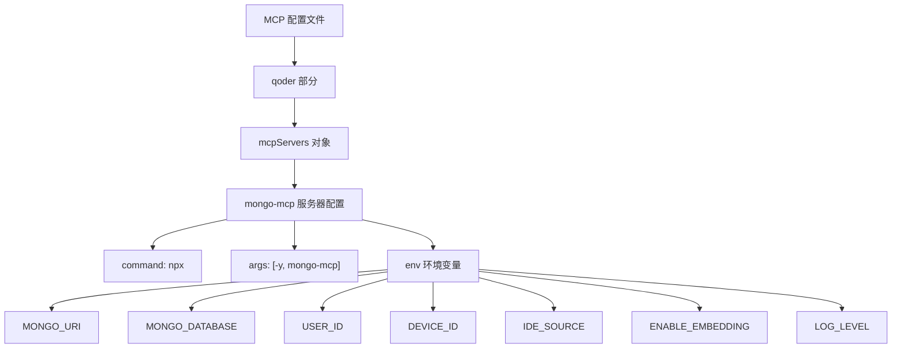

**图表来源**
- [mcp-config.json](file://examples/mcp-config.json#L5-L22)

### 配置参数详解

#### 基础连接参数
- **MONGO_URI**: MongoDB 连接字符串，支持本地和远程数据库
- **MONGO_DATABASE**: 数据库名称，默认为 `mongo_mcp`
- **MONGO_COLLECTION**: 集合名称，默认为 `knowledge`

#### 用户标识参数
- **USER_ID**: 用户唯一标识符，建议使用邮箱地址
- **DEVICE_ID**: 设备标识符，自动生成或手动设置
- **IDE_SOURCE**: IDE 来源类型，固定为 `qoder`

#### 功能控制参数
- **ENABLE_EMBEDDING**: 是否启用向量嵌入功能
- **LOG_LEVEL**: 日志级别，支持 `debug`、`info`、`warn`、`error`

**章节来源**
- [mcp-config.json](file://examples/mcp-config.json#L11-L19)
- [config.ts](file://src/utils/config.ts#L79-L88)

## 环境变量配置

### 环境变量优先级

mongo-mcp 采用多层配置优先级机制：

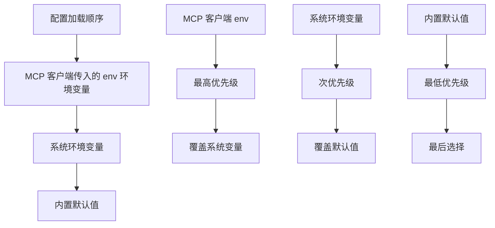

**图表来源**
- [config.ts](file://src/utils/config.ts#L76-L75)

### 关键环境变量说明

#### USER_ID（用户标识）
- **作用**: 唯一标识用户，支持跨设备同步
- **设置方法**: 建议使用邮箱地址或其他稳定标识符
- **默认值**: `default`

#### DEVICE_ID（设备标识）
- **作用**: 标识不同设备，支持跨设备知识同步
- **设置方法**: 可手动设置或自动生成
- **默认值**: 自动生成，格式为 `{ideSource}-{hostname}`

#### IDE_SOURCE（IDE 来源）
- **作用**: 标识 IDE 类型，影响日志和统计
- **设置方法**: 固定为 `qoder`
- **默认值**: `other`

#### ENABLE_EMBEDDING（嵌入功能）
- **作用**: 控制是否启用向量嵌入搜索
- **设置方法**: `true` 或 `false`
- **默认值**: `false`

#### LOG_LEVEL（日志级别）
- **作用**: 控制日志输出详细程度
- **设置方法**: `debug`、`info`、`warn`、`error`
- **默认值**: `info`

**章节来源**
- [config.ts](file://src/utils/config.ts#L33-L36)
- [config.ts](file://src/utils/config.ts#L41-L44)
- [config.ts](file://src/utils/config.ts#L49-L55)
- [config.ts](file://src/utils/config.ts#L60-L66)

## 配置验证

### 配置验证流程

mongo-mcp 在启动时会进行严格的配置验证：

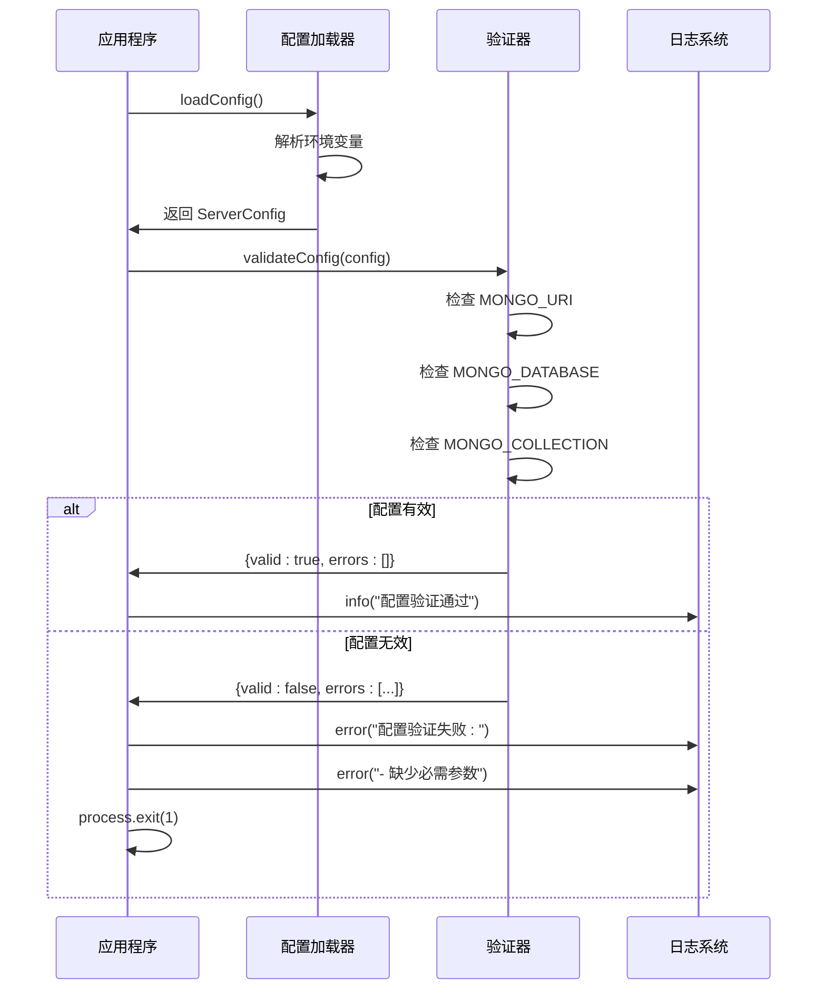

**图表来源**
- [index.ts](file://src/index.ts#L93-L98)
- [config.ts](file://src/utils/config.ts#L96-L115)

### 验证规则

配置验证器检查以下必需参数：

1. **MONGO_URI**: MongoDB 连接字符串必须存在
2. **MONGO_DATABASE**: 数据库名称必须存在
3. **MONGO_COLLECTION**: 集合名称必须存在

**章节来源**
- [config.ts](file://src/utils/config.ts#L96-L115)

## 常见问题诊断

### 连接问题

#### MongoDB 连接失败
**症状**: 启动时显示连接错误
**可能原因**:
- MONGO_URI 格式不正确
- 数据库凭据错误
- 网络连接问题

**解决方案**:
1. 验证 MongoDB 连接字符串格式
2. 检查数据库凭据和权限
3. 确认网络连通性

#### 数据库访问被拒绝
**症状**: 显示认证失败或权限不足
**解决方案**:
1. 验证用户名和密码
2. 检查数据库用户权限
3. 确认数据库角色配置

### 配置问题

#### 环境变量未生效
**症状**: 配置未按预期工作
**可能原因**:
- 环境变量优先级问题
- 变量名拼写错误
- 值格式不正确

**解决方案**:
1. 检查环境变量设置顺序
2. 验证变量名和值格式
3. 使用调试模式查看实际配置

#### 设备同步问题
**症状**: 不同设备间知识不同步
**可能原因**:
- USER_ID 不一致
- DEVICE_ID 配置错误
- 网络连接不稳定

**解决方案**:
1. 确保所有设备使用相同 USER_ID
2. 检查 DEVICE_ID 配置
3. 验证网络连接稳定性

**章节来源**
- [index.ts](file://src/index.ts#L141-L144)
- [config.ts](file://src/utils/config.ts#L96-L115)

## 生产环境配置示例

### 云端数据库配置

对于生产环境，推荐使用 MongoDB Atlas 或企业级 MongoDB 服务：

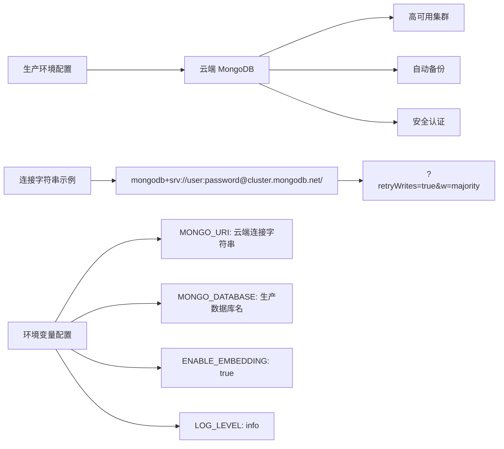

**图表来源**
- [mcp-config.json](file://examples/mcp-config.json#L78-L92)

### 多设备同步配置

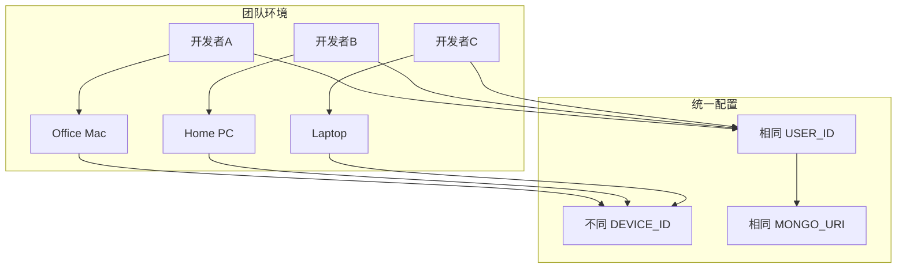

**图表来源**
- [mcp-config.json](file://examples/mcp-config.json#L82-L89)

**章节来源**
- [mcp-config.json](file://examples/mcp-config.json#L77-L92)

## 开发环境配置示例

### 本地开发配置

对于本地开发，可以使用 MongoDB 本地实例：

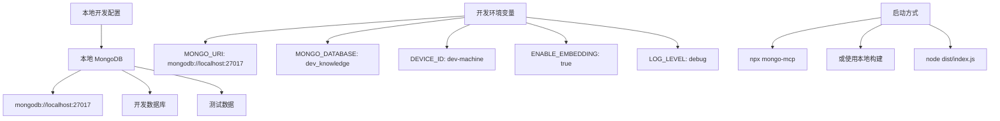

**图表来源**
- [mcp-config.json](file://examples/mcp-config.json#L57-L74)

### 开发工具集成

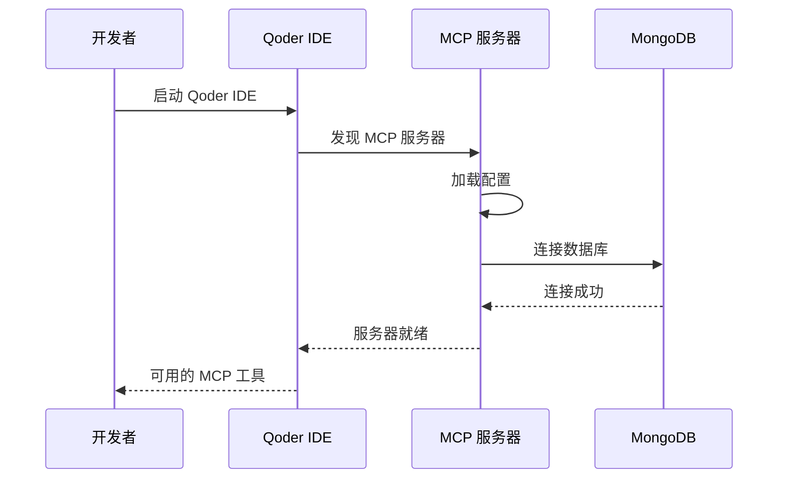

**图表来源**
- [index.ts](file://src/index.ts#L116-L129)

**章节来源**
- [mcp-config.json](file://examples/mcp-config.json#L57-L74)
- [index.ts](file://src/index.ts#L87-L145)

## 性能考虑

### 数据库性能优化

mongo-mcp 在知识服务中实现了多种性能优化策略：

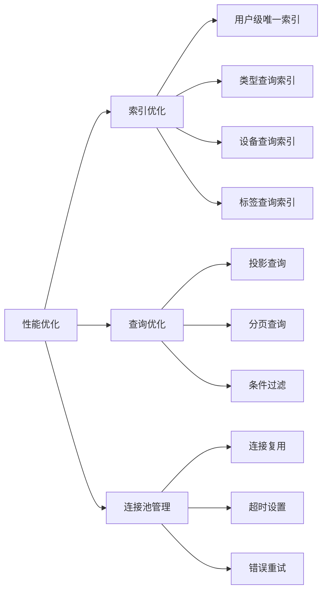

**图表来源**
- [knowledge-service.ts](file://src/services/knowledge-service.ts#L71-L87)

### 嵌入功能性能

向量嵌入功能需要额外的计算资源：

- **模型选择**: 使用轻量级嵌入模型
- **批量处理**: 支持批量生成嵌入
- **缓存机制**: 缓存已生成的嵌入向量
- **阈值控制**: 优化相似度计算

**章节来源**
- [knowledge-service.ts](file://src/services/knowledge-service.ts#L272-L299)
- [knowledge-service.ts](file://src/services/knowledge-service.ts#L313-L341)

## 故障排除指南

### 启动问题

#### 服务器无法启动
**诊断步骤**:
1. 检查 Node.js 版本要求
2. 验证依赖包安装
3. 查看启动日志

**解决方案**:
1. 确保 Node.js 版本满足要求
2. 运行 `npm install` 安装依赖
3. 检查防火墙设置

#### MCP 服务器不可发现
**诊断步骤**:
1. 检查 MCP 配置文件格式
2. 验证命令路径
3. 确认环境变量设置

**解决方案**:
1. 使用 JSON Schema 验证配置文件
2. 确保命令可执行
3. 检查环境变量权限

### 运行时问题

#### 工具调用失败
**诊断步骤**:
1. 检查工具输入参数
2. 验证数据库连接
3. 查看错误日志

**解决方案**:
1. 验证工具参数格式
2. 重新建立数据库连接
3. 检查权限设置

#### 数据库操作异常
**诊断步骤**:
1. 检查数据库状态
2. 验证用户权限
3. 查看连接池状态

**解决方案**:
1. 重启数据库服务
2. 更新用户权限
3. 调整连接池配置

**章节来源**
- [index.ts](file://src/index.ts#L141-L144)
- [config.ts](file://src/utils/config.ts#L120-L146)

## 结论

mongo-mcp 为 Qoder IDE 提供了强大而灵活的知识库管理解决方案。通过合理的配置和环境变量设置，开发者可以在不同的 IDE 环境中享受一致的知识管理体验。

### 主要优势

1. **跨平台兼容**: 支持多种 IDE 和操作系统
2. **配置灵活**: 多层配置优先级机制
3. **性能优化**: 针对大数据量的优化策略
4. **易于部署**: 简单的安装和配置过程
5. **扩展性强**: 模块化设计便于功能扩展

### 最佳实践

1. **生产环境**: 使用云端数据库和适当的监控
2. **开发环境**: 使用本地数据库进行快速迭代
3. **安全配置**: 严格控制数据库访问权限
4. **性能监控**: 定期检查数据库性能指标
5. **备份策略**: 建立定期数据备份机制

通过遵循本文档的指导，您应该能够成功地在 Qoder IDE 中集成和配置 mongo-mcp 服务器，享受高效的知识库管理体验。