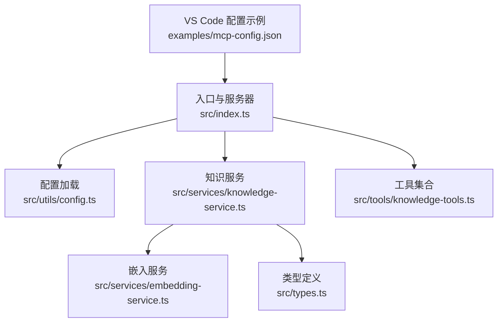
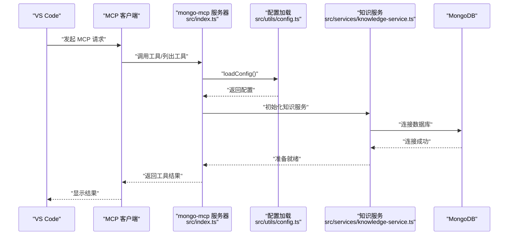
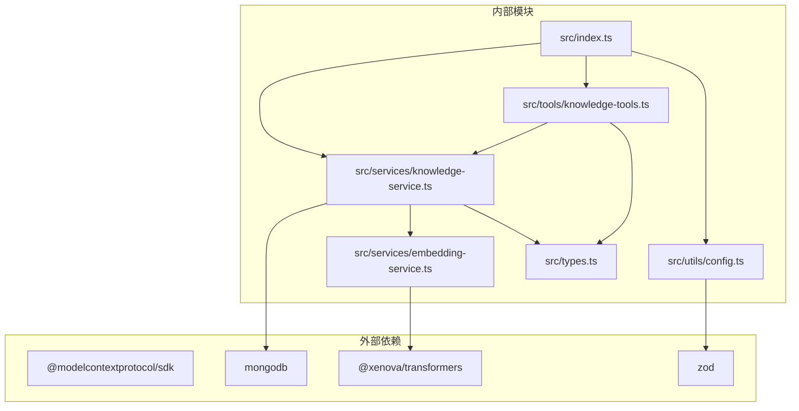

# VS Code 集成

<cite>
**本文引用的文件**
- [package.json](file://package.json)
- [examples/mcp-config.json](file://examples/mcp-config.json)
- [src/index.ts](file://src/index.ts)
- [src/utils/config.ts](file://src/utils/config.ts)
- [src/services/knowledge-service.ts](file://src/services/knowledge-service.ts)
- [src/tools/knowledge-tools.ts](file://src/tools/knowledge-tools.ts)
- [src/services/embedding-service.ts](file://src/services/embedding-service.ts)
- [src/types.ts](file://src/types.ts)
</cite>

## 目录
1. [简介](#简介)
2. [项目结构](#项目结构)
3. [核心组件](#核心组件)
4. [架构总览](#架构总览)
5. [详细组件分析](#详细组件分析)
6. [依赖关系分析](#依赖关系分析)
7. [性能考虑](#性能考虑)
8. [故障排查指南](#故障排查指南)
9. [结论](#结论)
10. [附录](#附录)

## 简介
本指南面向希望在 VS Code 中集成 mongo-mcp 的开发者，提供从配置到调试的完整操作手册。mongo-mcp 是一个基于 MCP 协议的跨 IDE 知识库管理工具，通过 VS Code 的 MCP 服务器配置，将本地或云端的 MongoDB 作为统一的知识存储，支持记忆、技能、规则、MCP、经验、命令、上下文、工作流等知识类型的统一管理与检索。

## 项目结构
mongo-mcp 采用模块化设计，核心由以下模块组成：
- 入口与服务器：负责启动 MCP 服务器、注册工具、建立 stdio 传输通道
- 配置加载：解析环境变量，生成运行时配置
- 知识服务：封装 MongoDB 连接、索引、CRUD、批量导入导出、语义搜索与嵌入生成
- 工具集合：提供 MCP 工具清单与具体实现（CRUD、快捷工具、同步工具、导出工具等）
- 嵌入服务：基于 Transformers.js 的文本向量化与相似度计算
- 类型定义：统一的知识文档类型、字段与查询选项

图表来源
- [src/index.ts](file://src/index.ts#L1-L148)
- [src/utils/config.ts](file://src/utils/config.ts#L1-L147)
- [src/services/knowledge-service.ts](file://src/services/knowledge-service.ts#L1-L404)
- [src/tools/knowledge-tools.ts](file://src/tools/knowledge-tools.ts#L1-L1093)
- [src/services/embedding-service.ts](file://src/services/embedding-service.ts#L1-L148)
- [src/types.ts](file://src/types.ts#L1-L269)
- [examples/mcp-config.json](file://examples/mcp-config.json#L1-L94)

章节来源
- [package.json](file://package.json#L1-L48)
- [examples/mcp-config.json](file://examples/mcp-config.json#L1-L94)

## 核心组件
- MCP 服务器与传输
  - 以 stdio 模式启动，注册工具列表与调用处理器
  - 通过标准输入输出与 VS Code 的 MCP 客户端通信
- 配置系统
  - 从环境变量加载配置，支持 IDE 来源、数据库、集合、用户与设备标识、日志级别、嵌入开关等
  - 提供配置校验与日志工具
- 知识服务
  - 封装 MongoDB 连接、索引、CRUD、批量导入导出、统计、语义搜索与嵌入生成
  - 支持用户隔离与跨设备同步
- 工具集合
  - 提供通用 CRUD 工具、快捷工具（记忆、经验、命令、上下文）、同步工具（MCP、规则、技能）、工作流创建、导出工具
  - 可按需启用语义搜索与嵌入生成功能
- 嵌入服务
  - 基于 Transformers.js 的特征提取与余弦相似度计算
  - 懒加载模型，支持批量嵌入

章节来源
- [src/index.ts](file://src/index.ts#L1-L148)
- [src/utils/config.ts](file://src/utils/config.ts#L1-L147)
- [src/services/knowledge-service.ts](file://src/services/knowledge-service.ts#L1-L404)
- [src/tools/knowledge-tools.ts](file://src/tools/knowledge-tools.ts#L1-L1093)
- [src/services/embedding-service.ts](file://src/services/embedding-service.ts#L1-L148)

## 架构总览
mongo-mcp 在 VS Code 中通过 MCP 服务器配置启动，VS Code 将 MCP 请求转发给 mongo-mcp，后者根据配置连接 MongoDB 并执行知识库操作。

图表来源
- [src/index.ts](file://src/index.ts#L87-L145)
- [src/utils/config.ts](file://src/utils/config.ts#L76-L91)
- [src/services/knowledge-service.ts](file://src/services/knowledge-service.ts#L44-L54)

## 详细组件分析

### VS Code 集成配置
- 配置位置
  - VS Code 项目根目录下的 .vscode/settings.json
- 配置键
  - mcp.servers.<serverId>: 定义 MCP 服务器
    - command: 启动命令（如 npx 或 node）
    - args: 命令参数数组
    - env: 环境变量对象
- 示例参考
  - examples/mcp-config.json 展示了 VS Code 的配置结构与环境变量示例

章节来源
- [examples/mcp-config.json](file://examples/mcp-config.json#L41-L55)

### 配置参数详解
- 环境变量
  - MONGO_URI: MongoDB 连接字符串（必填）
  - MONGO_DATABASE: 数据库名称（默认 mongo_mcp）
  - MONGO_COLLECTION: 集合名称（默认 knowledge）
  - USER_ID: 用户标识（默认 default）
  - DEVICE_ID: 设备标识（默认由 IDE 来源与主机名组合）
  - IDE_SOURCE: IDE 来源（支持 qoder/trae/cursor/windsurf/vscode/manual/other）
  - ENABLE_EMBEDDING: 是否启用向量嵌入（默认 false）
  - LOG_LEVEL: 日志级别（debug/info/warn/error，默认 info）
- 命令执行方式
  - 本地开发：使用 node 直接运行 dist/index.js
  - 一键安装：使用 npx 执行 mongo-mcp
- 环境变量设置建议
  - 本地开发：开启 ENABLE_EMBEDDING=true 与 LOG_LEVEL=debug
  - 多设备同步：确保 USER_ID 与 DEVICE_ID 区分不同用户/设备
  - 云数据库：使用 mongodb+srv 连接串并设置合适的超时与重试参数

章节来源
- [src/utils/config.ts](file://src/utils/config.ts#L76-L91)
- [src/utils/config.ts](file://src/utils/config.ts#L96-L115)
- [examples/mcp-config.json](file://examples/mcp-config.json#L48-L52)

### MCP 工具与工作流
- 工具清单
  - 通用 CRUD：knowledge_create、knowledge_read、knowledge_update、knowledge_delete、knowledge_list、knowledge_stats、knowledge_upsert
  - 快捷工具：memory_add、memory_search、experience_add、command_add、context_set
  - 同步工具：mcp_sync、rule_sync、skill_sync
  - 导出工具：knowledge_export
  - 语义工具（可选）：semantic_search、generate_embeddings（当 ENABLE_EMBEDDING=true 时）
- 工作流
  - 在 VS Code 中通过 MCP 工具调用 mongo-mcp，实现知识的增删改查、批量导出与语义检索
  - 建议在 VS Code 的任务或快捷键中绑定常用工具调用

章节来源
- [src/tools/knowledge-tools.ts](file://src/tools/knowledge-tools.ts#L29-L33)
- [src/tools/knowledge-tools.ts](file://src/tools/knowledge-tools.ts#L1093-L1093)
- [src/utils/config.ts](file://src/utils/config.ts#L24-L27)

### VS Code 扩展与插件推荐
- MCP 相关扩展
  - VS Code MCP 客户端扩展（用于发现与管理 MCP 服务器）
- 开发辅助扩展
  - MongoDB 扩展：查看数据库与集合
  - JSON/YAML 扩展：编辑 .vscode/settings.json
  - Task Runner：为常用工具调用创建任务
- 插件配置建议
  - 在 VS Code 的 settings.json 中设置 mcp.servers，确保 command 与 args 正确指向 mongo-mcp
  - 使用环境变量文件（如 .env）集中管理 MONGO_URI 等敏感信息

章节来源
- [examples/mcp-config.json](file://examples/mcp-config.json#L41-L55)

### 开发工作流优化与调试技巧
- 启动与调试
  - 本地开发：使用 npm 脚本 dev（tsx watch）进行热重载
  - 生产启动：使用 npm 脚本 start（node dist/index.js）
- 日志与排错
  - 通过 LOG_LEVEL 控制日志级别，定位连接、工具调用与嵌入生成问题
  - 使用 knowledge_stats 与 knowledge_list 排查数据一致性
- 性能优化
  - 合理设置 LIMIT/OFFSET，避免一次性查询过多数据
  - 仅在需要时启用 ENABLE_EMBEDDING，减少模型加载与嵌入计算开销
  - 使用索引策略（按 userId/type/name 唯一索引、按 userId/type 查询索引等）

章节来源
- [package.json](file://package.json#L10-L16)
- [src/index.ts](file://src/index.ts#L100-L130)
- [src/services/knowledge-service.ts](file://src/services/knowledge-service.ts#L71-L87)

## 依赖关系分析
mongo-mcp 的主要外部依赖与内部模块关系如下：

图表来源
- [package.json](file://package.json#L30-L42)
- [src/index.ts](file://src/index.ts#L3-L11)
- [src/utils/config.ts](file://src/utils/config.ts#L1-L147)
- [src/services/knowledge-service.ts](file://src/services/knowledge-service.ts#L1-L404)
- [src/tools/knowledge-tools.ts](file://src/tools/knowledge-tools.ts#L1-L1093)
- [src/services/embedding-service.ts](file://src/services/embedding-service.ts#L1-L148)
- [src/types.ts](file://src/types.ts#L1-L269)

章节来源
- [package.json](file://package.json#L30-L42)

## 性能考虑
- 数据库连接
  - 使用连接池与索引优化查询性能；避免全表扫描
- 嵌入计算
  - 模型懒加载，首次加载耗时较长；建议在后台预热或延迟触发
  - 批量嵌入时注意内存占用与并发控制
- 工具调用
  - 对大文档内容进行截断（如嵌入文本长度限制），避免超长内容影响性能
  - 合理使用 LIMIT 与 OFFSET，避免一次性返回大量数据

## 故障排查指南
- 连接失败
  - 检查 MONGO_URI 是否正确，网络连通性与认证配置
  - 确认数据库与集合存在且具备写权限
- 工具调用错误
  - 查看 LOG_LEVEL 输出，确认工具参数是否符合 inputSchema
  - 使用 knowledge_list 与 knowledge_read 核对数据状态
- 嵌入功能异常
  - 确认 ENABLE_EMBEDDING=true 且网络可访问模型仓库
  - 检查模型加载日志，必要时清理缓存后重试
- VS Code 无法发现 MCP 服务器
  - 确认 .vscode/settings.json 中 mcp.servers 配置正确
  - 检查 command 与 args 是否指向正确的可执行文件

章节来源
- [src/index.ts](file://src/index.ts#L93-L98)
- [src/utils/config.ts](file://src/utils/config.ts#L120-L146)
- [src/services/embedding-service.ts](file://src/services/embedding-service.ts#L42-L51)

## 结论
通过 VS Code 的 MCP 服务器配置，mongo-mcp 能够无缝集成到开发工作流中，提供统一的知识库管理能力。建议在本地开发阶段启用嵌入与详细日志，在生产环境中谨慎开启嵌入功能并优化查询与索引策略。配合 VS Code 的任务与快捷键，可进一步提升知识库的使用效率。

## 附录
- VS Code 配置示例参考
  - 参见 examples/mcp-config.json 中的 "vscode" 部分
- 常用命令
  - 构建：npm run build
  - 启动：npm run start
  - 开发：npm run dev
  - 类型检查：npm run typecheck
  - ESLint：npm run lint

章节来源
- [examples/mcp-config.json](file://examples/mcp-config.json#L41-L55)
- [package.json](file://package.json#L10-L16)