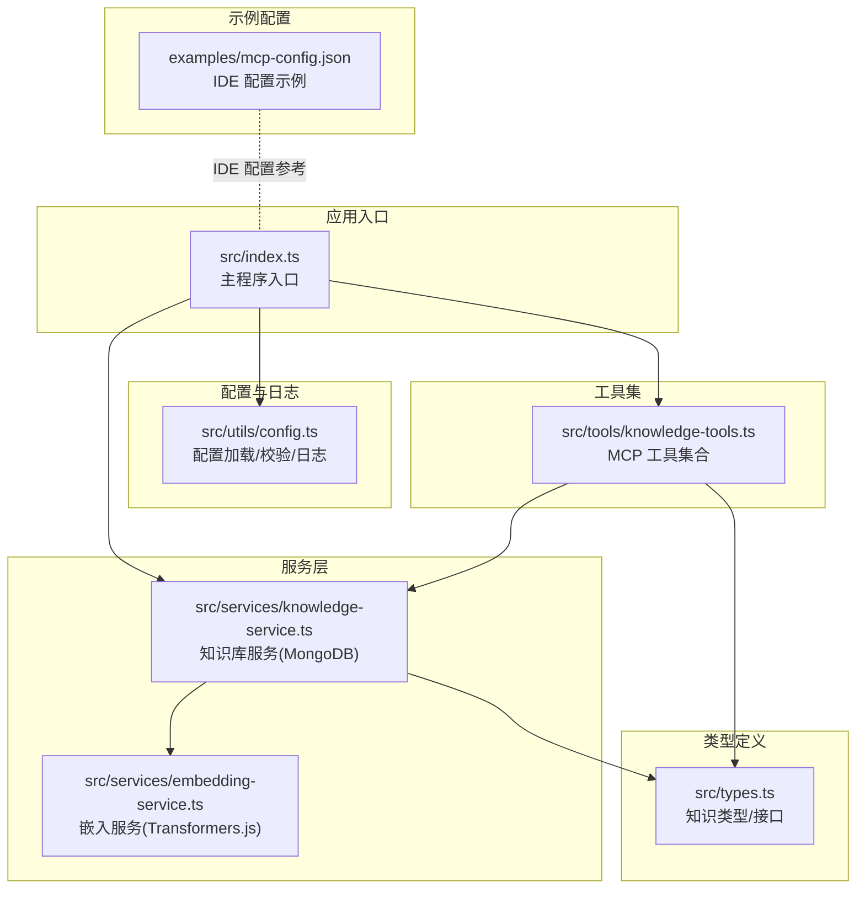
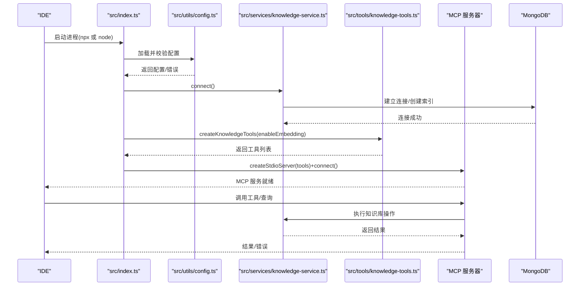
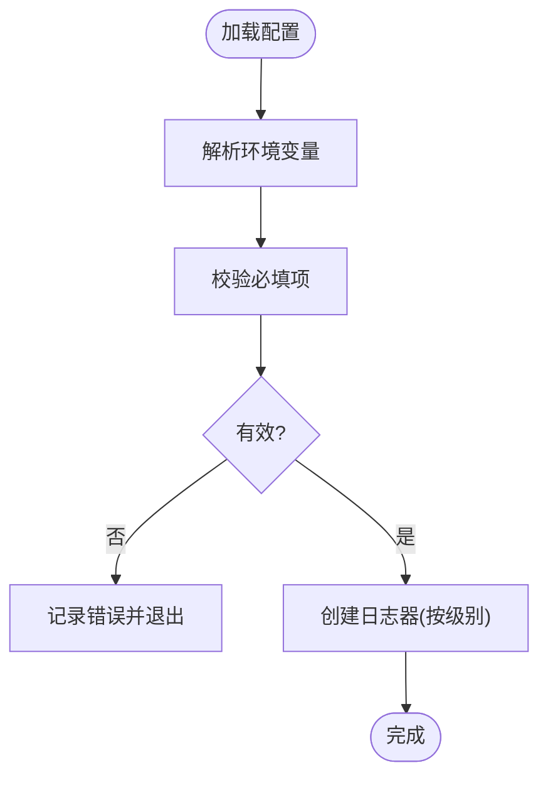
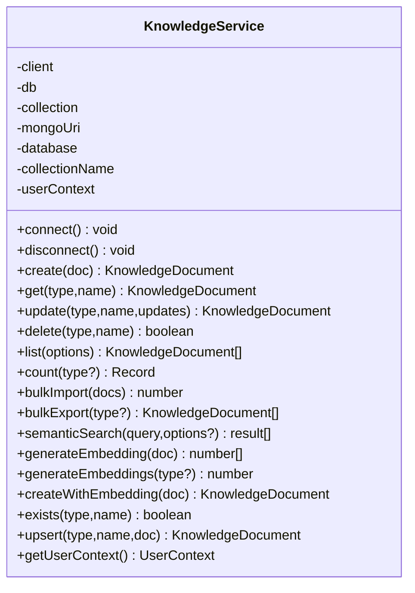
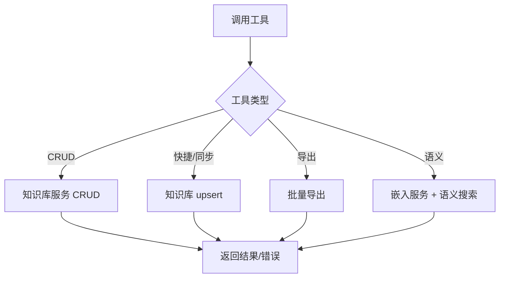
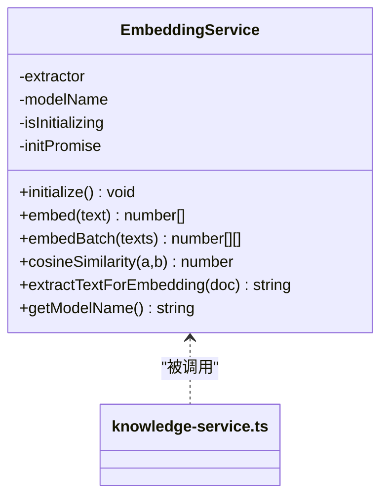
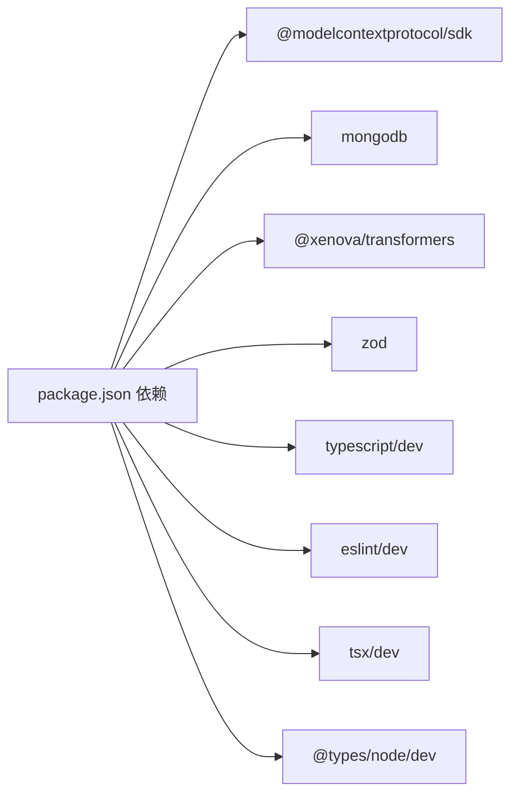

# 故障排除

<cite>
**本文引用的文件**   
- [package.json](file://package.json)
- [src/index.ts](file://src/index.ts)
- [src/utils/config.ts](file://src/utils/config.ts)
- [src/services/knowledge-service.ts](file://src/services/knowledge-service.ts)
- [src/tools/knowledge-tools.ts](file://src/tools/knowledge-tools.ts)
- [src/services/embedding-service.ts](file://src/services/embedding-service.ts)
- [src/types.ts](file://src/types.ts)
- [examples/mcp-config.json](file://examples/mcp-config.json)
</cite>

## 目录
1. [简介](#简介)
2. [项目结构](#项目结构)
3. [核心组件](#核心组件)
4. [架构总览](#架构总览)
5. [详细组件分析](#详细组件分析)
6. [依赖关系分析](#依赖关系分析)
7. [性能考虑](#性能考虑)
8. [故障排除指南](#故障排除指南)
9. [结论](#结论)
10. [附录](#附录)

## 简介
本指南面向使用 mongo-mcp 的开发者与集成者，聚焦于 IDE 集成过程中的常见问题与系统化排障流程。内容覆盖连接问题、认证失败、权限错误、网络与数据库异常、嵌入与语义搜索性能问题、日志分析与调试技巧，并提供针对不同 IDE 的错误信息解读与处理建议，以及社区支持与问题反馈渠道。

## 项目结构
mongo-mcp 是一个基于 Node.js 的 MCP 服务器，通过标准输入输出（stdio）模式与 IDE 通信，使用 MongoDB 存储知识库数据，支持多种知识类型（记忆、技能、规则、MCP、经验、命令、上下文、工作流），并可选启用向量嵌入以支持语义搜索。

图表来源
- [src/index.ts](file://src/index.ts#L1-L148)
- [src/utils/config.ts](file://src/utils/config.ts#L1-L147)
- [src/services/knowledge-service.ts](file://src/services/knowledge-service.ts#L1-L404)
- [src/tools/knowledge-tools.ts](file://src/tools/knowledge-tools.ts#L1-L1093)
- [src/services/embedding-service.ts](file://src/services/embedding-service.ts#L1-L148)
- [src/types.ts](file://src/types.ts#L1-L269)
- [examples/mcp-config.json](file://examples/mcp-config.json#L1-L94)

章节来源
- [package.json](file://package.json#L1-L48)
- [src/index.ts](file://src/index.ts#L1-L148)
- [src/utils/config.ts](file://src/utils/config.ts#L1-L147)
- [src/services/knowledge-service.ts](file://src/services/knowledge-service.ts#L1-L404)
- [src/tools/knowledge-tools.ts](file://src/tools/knowledge-tools.ts#L1-L1093)
- [src/services/embedding-service.ts](file://src/services/embedding-service.ts#L1-L148)
- [src/types.ts](file://src/types.ts#L1-L269)
- [examples/mcp-config.json](file://examples/mcp-config.json#L1-L94)

## 核心组件
- 主程序入口：负责加载配置、校验配置、连接数据库、创建工具集、启动 MCP 服务器并处理优雅退出。
- 配置模块：解析环境变量，生成默认设备 ID，校验必填项，按日志级别输出日志。
- 知识库服务：封装 MongoDB 连接、索引、CRUD、批量操作、统计、语义搜索与嵌入生成。
- 工具集：提供 MCP 工具（通用 CRUD、快捷工具、同步工具、导出工具、语义搜索与嵌入生成）。
- 嵌入服务：基于 Transformers.js 的文本向量提取与相似度计算，支持懒加载与单例。
- 类型定义：统一的知识类型、文档结构、查询与搜索选项。

章节来源
- [src/index.ts](file://src/index.ts#L87-L148)
- [src/utils/config.ts](file://src/utils/config.ts#L76-L147)
- [src/services/knowledge-service.ts](file://src/services/knowledge-service.ts#L20-L404)
- [src/tools/knowledge-tools.ts](file://src/tools/knowledge-tools.ts#L29-L1093)
- [src/services/embedding-service.ts](file://src/services/embedding-service.ts#L11-L148)
- [src/types.ts](file://src/types.ts#L3-L269)

## 架构总览
MCP 服务器启动流程与关键交互如下：

图表来源
- [src/index.ts](file://src/index.ts#L87-L148)
- [src/utils/config.ts](file://src/utils/config.ts#L76-L115)
- [src/services/knowledge-service.ts](file://src/services/knowledge-service.ts#L44-L87)
- [src/tools/knowledge-tools.ts](file://src/tools/knowledge-tools.ts#L29-L32)
- [src/types.ts](file://src/types.ts#L3-L14)

## 详细组件分析

### 组件 A：配置与日志（config.ts）
- 配置来源优先级：MCP 客户端传入 env > 系统环境变量 > 默认值
- 必填项校验：MONGO_URI、MONGO_DATABASE、MONGO_COLLECTION
- 日志级别：debug/info/warn/error，按级别输出
- 设备 ID 生成：基于主机名与 IDE 来源

图表来源
- [src/utils/config.ts](file://src/utils/config.ts#L76-L115)
- [src/utils/config.ts](file://src/utils/config.ts#L120-L146)

章节来源
- [src/utils/config.ts](file://src/utils/config.ts#L76-L115)
- [src/utils/config.ts](file://src/utils/config.ts#L120-L146)

### 组件 B：知识库服务（knowledge-service.ts）
- 连接与断开：MongoClient 生命周期管理，确保索引存在
- 用户上下文：userId/deviceId/ideSource 注入与过滤
- 索引策略：唯一索引（type+name）、常用查询索引、标签与时间排序
- 操作能力：CRUD、批量导入/导出、统计、语义搜索、嵌入生成
- 错误处理：未连接抛错、重复键错误捕获

图表来源
- [src/services/knowledge-service.ts](file://src/services/knowledge-service.ts#L20-L404)

章节来源
- [src/services/knowledge-service.ts](file://src/services/knowledge-service.ts#L44-L87)
- [src/services/knowledge-service.ts](file://src/services/knowledge-service.ts#L111-L190)
- [src/services/knowledge-service.ts](file://src/services/knowledge-service.ts#L244-L267)
- [src/services/knowledge-service.ts](file://src/services/knowledge-service.ts#L272-L341)

### 组件 C：工具集（knowledge-tools.ts）
- 通用工具：knowledge_create/read/update/delete/list/stats/upsert
- 快捷工具：memory_add/search、experience_add、command_add、context_set
- 同步工具：mcp_sync、rule_sync、skill_sync、workflow_create
- 导出工具：knowledge_export
- 语义工具：semantic_search、generate_embeddings（需启用嵌入）

图表来源
- [src/tools/knowledge-tools.ts](file://src/tools/knowledge-tools.ts#L36-L107)
- [src/tools/knowledge-tools.ts](file://src/tools/knowledge-tools.ts#L109-L245)
- [src/tools/knowledge-tools.ts](file://src/tools/knowledge-tools.ts#L247-L334)
- [src/tools/knowledge-tools.ts](file://src/tools/knowledge-tools.ts#L336-L399)
- [src/tools/knowledge-tools.ts](file://src/tools/knowledge-tools.ts#L403-L506)
- [src/tools/knowledge-tools.ts](file://src/tools/knowledge-tools.ts#L508-L635)
- [src/tools/knowledge-tools.ts](file://src/tools/knowledge-tools.ts#L637-L694)
- [src/tools/knowledge-tools.ts](file://src/tools/knowledge-tools.ts#L696-L758)
- [src/tools/knowledge-tools.ts](file://src/tools/knowledge-tools.ts#L760-L822)
- [src/tools/knowledge-tools.ts](file://src/tools/knowledge-tools.ts#L824-L880)
- [src/tools/knowledge-tools.ts](file://src/tools/knowledge-tools.ts#L882-L953)
- [src/tools/knowledge-tools.ts](file://src/tools/knowledge-tools.ts#L972-L996)
- [src/tools/knowledge-tools.ts](file://src/tools/knowledge-tools.ts#L1002-L1088)

章节来源
- [src/tools/knowledge-tools.ts](file://src/tools/knowledge-tools.ts#L29-L1093)

### 组件 D：嵌入服务（embedding-service.ts）
- 懒加载模型：首次使用时初始化 Transformers.js 特征提取器
- 批量嵌入：逐条生成向量，支持余弦相似度计算
- 文本抽取：从文档中提取 name/description/content/tags 组合文本

图表来源
- [src/services/embedding-service.ts](file://src/services/embedding-service.ts#L11-L148)
- [src/services/knowledge-service.ts](file://src/services/knowledge-service.ts#L272-L341)

章节来源
- [src/services/embedding-service.ts](file://src/services/embedding-service.ts#L24-L51)
- [src/services/embedding-service.ts](file://src/services/embedding-service.ts#L56-L80)
- [src/services/embedding-service.ts](file://src/services/embedding-service.ts#L109-L129)

## 依赖关系分析
- 运行时依赖：@modelcontextprotocol/sdk（MCP 协议）、mongodb（数据库驱动）、@xenova/transformers（嵌入模型）、zod（类型校验）
- 开发依赖：typescript、eslint、tsx、@types/node
- Node 版本要求：>= 18.0.0

图表来源
- [package.json](file://package.json#L30-L46)

章节来源
- [package.json](file://package.json#L30-L46)

## 性能考虑
- 嵌入模型懒加载：首次使用时下载与初始化，可能带来冷启动延迟；可通过预热或在启动阶段提前触发初始化减少影响。
- 语义搜索：对大量文档进行相似度计算，建议合理设置 limit 与 threshold，避免高负载。
- 索引优化：确保用户级唯一索引与常用查询字段建立索引，提升查询与写入性能。
- 批量操作：批量导入/导出与批量嵌入生成适合离线任务，避免阻塞实时交互。
- 日志级别：生产环境建议使用 info 或更高，避免 debug 大量输出带来的 I/O 压力。

## 故障排除指南

### 一、连接问题排查
- 现象
  - 启动即报“Failed to start”或无法连接数据库
  - IDE 侧显示 MCP 服务器启动失败
- 诊断步骤
  - 检查 MONGO_URI 是否正确（本地/云数据库、认证信息、端口）
  - 使用最小配置验证：仅设置 MONGO_URI、MONGO_DATABASE、MONGO_COLLECTION
  - 在命令行直接运行服务器进程，观察日志输出
  - 确认 MongoDB 可达性（防火墙、网络策略、容器网络）
- 常见原因
  - URI 缺少认证凭据或认证库名不匹配
  - 云数据库未放行访问 IP 或未开启公网
  - 本地 MongoDB 未启动或监听地址不正确
- 处理建议
  - 使用官方驱动工具验证连接字符串
  - 临时使用本地 MongoDB 验证流程
  - 在 IDE 配置中显式设置 env，避免 IDE 自动注入冲突

章节来源
- [src/index.ts](file://src/index.ts#L116-L144)
- [src/utils/config.ts](file://src/utils/config.ts#L76-L91)
- [src/services/knowledge-service.ts](file://src/services/knowledge-service.ts#L44-L54)

### 二、认证失败与权限错误
- 现象
  - 连接超时或认证失败
  - 写入/查询时报权限不足
- 诊断步骤
  - 校验 MONGO_URI 中用户名/密码/认证库
  - 确认数据库用户具备目标集合读写权限
  - 若使用云数据库，确认连接串包含必要参数（如 retryWrites、w=majority）
- 处理建议
  - 使用只读账号测试连接，再切换为读写账号
  - 为不同 IDE 使用独立 USER_ID/DEVICE_ID，避免并发写入冲突
  - 在 IDE 配置中显式设置 USER_ID 与 DEVICE_ID

章节来源
- [examples/mcp-config.json](file://examples/mcp-config.json#L11-L19)
- [examples/mcp-config.json](file://examples/mcp-config.json#L30-L36)
- [examples/mcp-config.json](file://examples/mcp-config.json#L47-L52)
- [src/utils/config.ts](file://src/utils/config.ts#L79-L88)

### 三、网络与数据库异常
- 现象
  - 语义搜索耗时过长
  - 批量导入/导出卡顿
- 诊断步骤
  - 检查网络延迟与带宽
  - 评估集合规模与索引使用情况
  - 分析嵌入模型初始化耗时
- 处理建议
  - 合理设置 semantic_search 的 limit/threshold
  - 将批量任务安排在低峰时段
  - 预热嵌入模型，避免首次请求延迟

章节来源
- [src/services/knowledge-service.ts](file://src/services/knowledge-service.ts#L272-L299)
- [src/services/knowledge-service.ts](file://src/services/knowledge-service.ts#L313-L341)
- [src/services/embedding-service.ts](file://src/services/embedding-service.ts#L42-L51)

### 四、IDE 集成错误解读与处理
- VS Code
  - 配置键位：mcp.servers
  - 常见错误：找不到命令、参数缺失、环境变量未生效
  - 处理：核对命令与参数，确保 env 正确传递
- Cursor
  - 配置键位：mcpServers
  - 常见错误：JSON 格式错误、路径不正确
  - 处理：使用示例文件作为模板，逐步比对
- Qoder/Cursor/其他 IDE
  - 常见错误：IDE_SOURCE 识别为 other、设备 ID 冲突
  - 处理：显式设置 IDE_SOURCE 与 DEVICE_ID，区分不同设备

章节来源
- [examples/mcp-config.json](file://examples/mcp-config.json#L41-L55)
- [examples/mcp-config.json](file://examples/mcp-config.json#L24-L39)
- [examples/mcp-config.json](file://examples/mcp-config.json#L5-L22)
- [src/utils/config.ts](file://src/utils/config.ts#L49-L55)
- [src/utils/config.ts](file://src/utils/config.ts#L33-L36)

### 五、日志分析与调试技巧
- 日志级别
  - debug：最详细，包含内部流程与中间状态
  - info：常规运行信息（推荐生产）
  - warn/error：警告与错误
- 关键日志点
  - 配置校验失败：检查具体缺失项
  - 连接 MongoDB 成功/失败
  - 工具调用返回的 success/error 字段
- 调试建议
  - 临时提升 LOG_LEVEL 至 debug
  - 使用最小化配置复现问题
  - 分离嵌入功能开关，定位是否由模型加载引起

章节来源
- [src/utils/config.ts](file://src/utils/config.ts#L120-L146)
- [src/index.ts](file://src/index.ts#L95-L98)
- [src/index.ts](file://src/index.ts#L117-L120)
- [src/tools/knowledge-tools.ts](file://src/tools/knowledge-tools.ts#L99-L106)

### 六、性能问题诊断与优化
- 语义搜索性能
  - 控制返回数量与相似度阈值
  - 仅在必要时启用嵌入功能
- 嵌入生成
  - 分批生成，避免一次性处理过多文档
  - 预热模型，减少首次请求延迟
- 索引与查询
  - 确保常用过滤字段建立索引
  - 避免全表扫描的大范围正则匹配

章节来源
- [src/services/knowledge-service.ts](file://src/services/knowledge-service.ts#L272-L299)
- [src/services/knowledge-service.ts](file://src/services/knowledge-service.ts#L313-L341)
- [src/services/embedding-service.ts](file://src/services/embedding-service.ts#L42-L51)

### 七、社区支持与问题报告
- 问题报告建议包含
  - IDE 类型与版本
  - MCP 配置片段（脱敏敏感信息）
  - 关键日志（至少包含启动与失败节点）
  - 复现步骤与期望结果
- 社区渠道
  - 仓库 Issues 页面提交问题
  - 提供最小可复现配置与命令行输出

章节来源
- [examples/mcp-config.json](file://examples/mcp-config.json#L1-L94)

## 结论
通过系统化的配置校验、日志分析与分层排查，大多数 IDE 集成问题可在本地快速定位与修复。建议在生产环境中使用严格的日志级别与索引策略，并结合嵌入功能的预热与限流策略，保障稳定与性能。

## 附录

### A. 常见错误码与含义
- 11000：重复键（type+name 唯一索引冲突）
- 其他 MongoDB 错误：根据工具返回的 error 字段判断

章节来源
- [src/tools/knowledge-tools.ts](file://src/tools/knowledge-tools.ts#L99-L105)

### B. 配置项速查
- MONGO_URI：数据库连接串
- MONGO_DATABASE：数据库名
- MONGO_COLLECTION：集合名
- USER_ID：用户标识
- DEVICE_ID：设备标识
- IDE_SOURCE：IDE 来源（qoder/trae/cursor/windsurf/vscode/manual/other）
- ENABLE_EMBEDDING：是否启用嵌入
- LOG_LEVEL：日志级别

章节来源
- [src/utils/config.ts](file://src/utils/config.ts#L11-L28)
- [src/utils/config.ts](file://src/utils/config.ts#L76-L91)