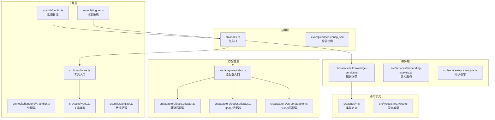
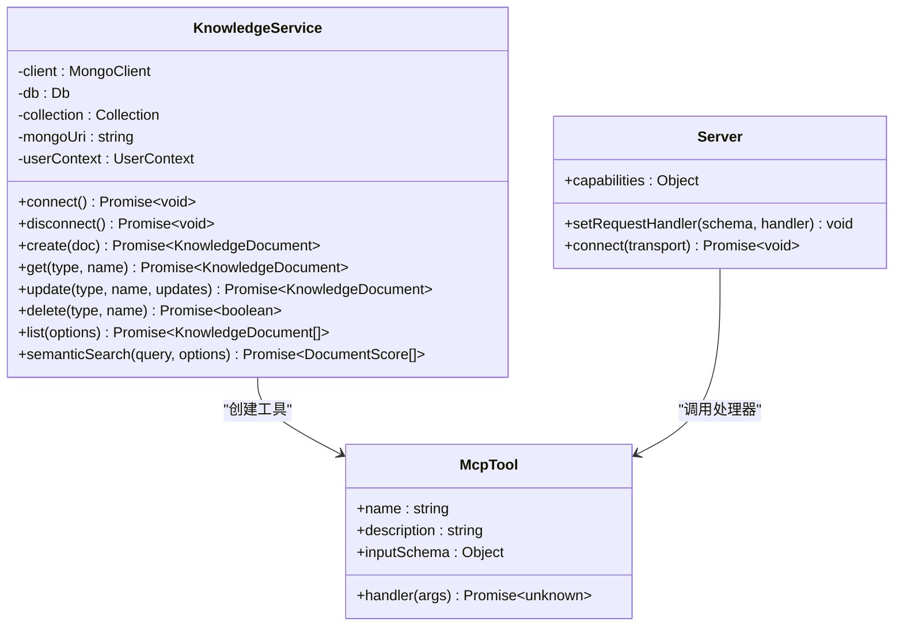
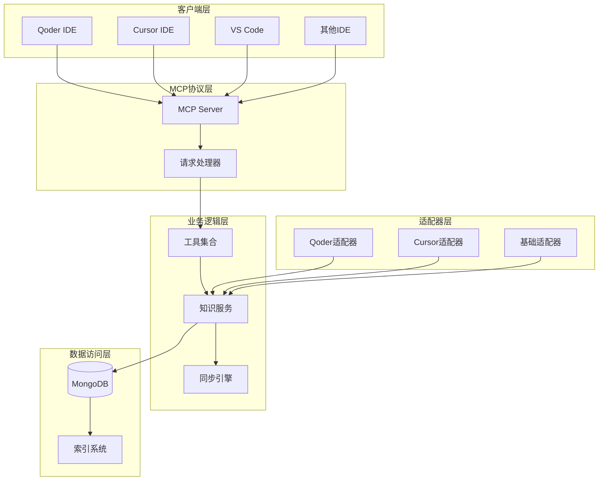
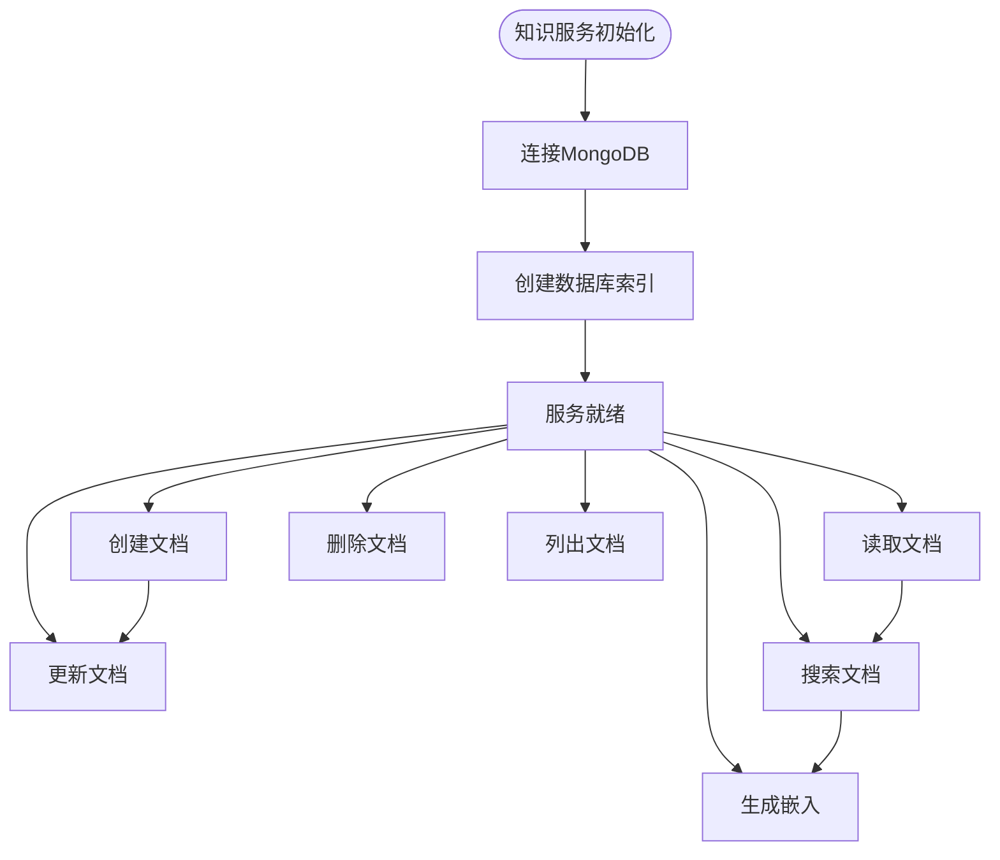
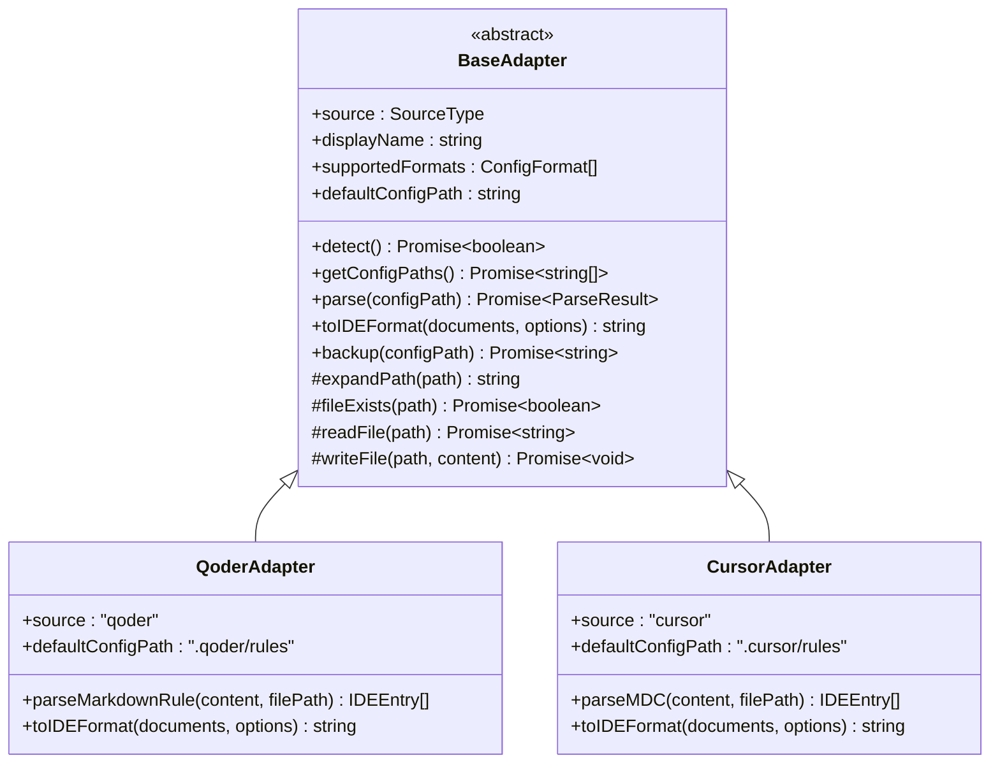
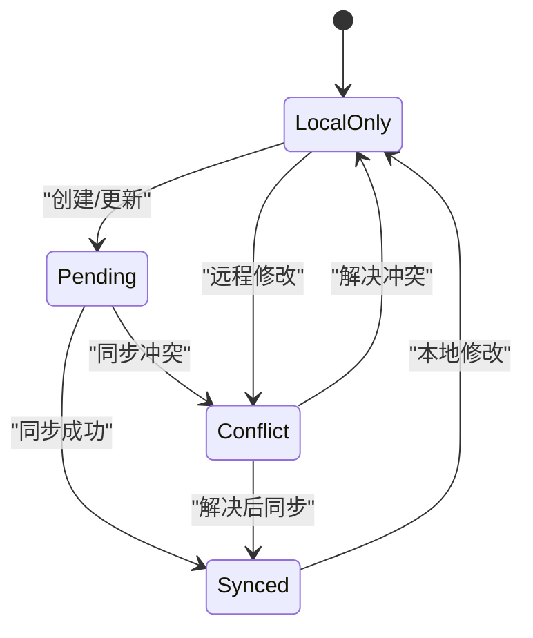
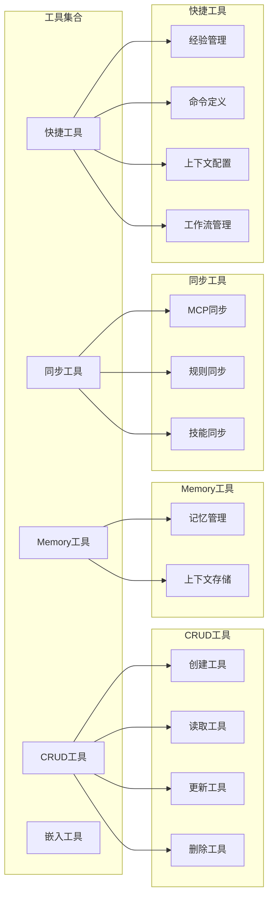

# 跨IDE同步系统

<cite>
**本文档引用的文件**
- [src/index.ts](file://src/index.ts)
- [package.json](file://package.json)
- [examples/mcp-config.json](file://examples/mcp-config.json)
- [src/adapters/index.ts](file://src/adapters/index.ts)
- [src/tools/index.ts](file://src/tools/index.ts)
- [src/schemas/index.ts](file://src/schemas/index.ts)
- [src/services/knowledge-service.ts](file://src/services/knowledge-service.ts)
- [src/adapters/base.adapter.ts](file://src/adapters/base.adapter.ts)
- [src/adapters/qoder.adapter.ts](file://src/adapters/qoder.adapter.ts)
- [src/adapters/cursor.adapter.ts](file://src/adapters/cursor.adapter.ts)
- [src/tools/types.ts](file://src/tools/types.ts)
- [src/types/sync.types.ts](file://src/types/sync.types.ts)
- [src/utils/config.ts](file://src/utils/config.ts)
- [src/utils/logger.ts](file://src/utils/logger.ts)
</cite>

## 目录
1. [简介](#简介)
2. [项目结构](#项目结构)
3. [核心组件](#核心组件)
4. [架构概览](#架构概览)
5. [详细组件分析](#详细组件分析)
6. [依赖关系分析](#依赖关系分析)
7. [性能考虑](#性能考虑)
8. [故障排除指南](#故障排除指南)
9. [结论](#结论)

## 简介

跨IDE同步系统是一个基于MCP（Model Context Protocol）协议的智能知识管理系统，专为开发者在不同IDE之间无缝同步知识库而设计。该系统支持多种IDE适配器，包括Qoder、Cursor、VS Code等，提供统一的知识存储、检索和同步能力。

系统的核心特性包括：
- **多IDE支持**：支持Qoder、Cursor、VS Code等多种主流IDE
- **知识类型丰富**：涵盖Memories、Skills、Rules、MCPs、Experiences、Commands、Contexts、Workflows八种知识类型
- **智能同步**：提供双向同步、冲突解决和版本控制
- **向量化搜索**：集成嵌入式向量搜索功能
- **灵活配置**：支持环境变量配置和IDE特定配置

## 项目结构

该项目采用模块化的架构设计，主要分为以下几个核心层次：



**图表来源**
- [src/index.ts](file://src/index.ts#L1-L148)
- [src/adapters/index.ts](file://src/adapters/index.ts#L1-L15)
- [src/services/knowledge-service.ts](file://src/services/knowledge-service.ts#L1-L437)

**章节来源**
- [src/index.ts](file://src/index.ts#L1-L148)
- [package.json](file://package.json#L1-L48)

## 核心组件

### MCP服务器核心

系统的核心是基于MCP协议的服务器实现，负责处理IDE客户端的请求和响应。



**图表来源**
- [src/services/knowledge-service.ts](file://src/services/knowledge-service.ts#L20-L437)
- [src/tools/types.ts](file://src/tools/types.ts#L6-L15)
- [src/index.ts](file://src/index.ts#L16-L82)

### 知识类型系统

系统支持八种不同的知识类型，每种类型都有其特定的用途和结构：

| 知识类型 | 描述 | 主要用途 |
|---------|------|----------|
| Memories | 记忆片段 | 存储个人经验和学习内容 |
| Skills | 技能模板 | 定义可复用的技能和工作流程 |
| Rules | 规则文件 | 编写IDE特定的规则和约束 |
| MCPs | MCP配置 | Model Context Protocol配置 |
| Experiences | 经验总结 | 项目经验和最佳实践 |
| Commands | 命令定义 | 自定义命令和快捷操作 |
| Contexts | 上下文信息 | 开发环境和项目上下文 |
| Workflows | 工作流程 | 复杂任务的工作流程定义 |

**章节来源**
- [src/tools/types.ts](file://src/tools/types.ts#L20-L23)
- [src/types/sync.types.ts](file://src/types/sync.types.ts#L1-L218)

## 架构概览

系统采用分层架构设计，确保了良好的可扩展性和维护性：



**图表来源**
- [src/index.ts](file://src/index.ts#L16-L82)
- [src/services/knowledge-service.ts](file://src/services/knowledge-service.ts#L44-L54)
- [src/adapters/base.adapter.ts](file://src/adapters/base.adapter.ts#L11-L11)

## 详细组件分析

### 知识服务组件

知识服务是系统的核心组件，负责管理所有知识类型的CRUD操作和高级功能。

#### 核心功能特性



**图表来源**
- [src/services/knowledge-service.ts](file://src/services/knowledge-service.ts#L44-L54)
- [src/services/knowledge-service.ts](file://src/services/knowledge-service.ts#L143-L160)

#### 数据库索引策略

系统为优化查询性能建立了多层索引结构：

| 索引类型 | 字段组合 | 用途 | 索引名称 |
|---------|----------|------|----------|
| 唯一索引 | userId + type + name | 用户级唯一约束 | unique_user_type_name |
| 查询索引 | userId + type | 类型查询 | user_type |
| 查询索引 | userId + deviceId | 跨设备同步 | user_device |
| 查询索引 | userId + tags | 标签查询 | user_tags |
| 排序索引 | userId + updatedAt | 时间排序 | user_updated |
| 复合索引 | userId + type + enabled + updatedAt | 常用列表查询 | user_type_enabled_updated |
| 复合索引 | userId + tags + enabled | 标签筛选 | user_tags_enabled |
| 复合索引 | userId + syncVersion + updatedAt | 同步状态查询 | user_sync_updated |
| 复合索引 | userId + ideSource + type | IDE来源查询 | user_ide_type |
| 文本索引 | name(text) + description(text) | 全文搜索 | text_search |

**章节来源**
- [src/services/knowledge-service.ts](file://src/services/knowledge-service.ts#L71-L119)

### IDE适配器系统

系统实现了可扩展的IDE适配器架构，支持多种IDE的配置文件格式。

#### 适配器架构设计



**图表来源**
- [src/adapters/base.adapter.ts](file://src/adapters/base.adapter.ts#L11-L127)
- [src/adapters/qoder.adapter.ts](file://src/adapters/qoder.adapter.ts#L15-L64)
- [src/adapters/cursor.adapter.ts](file://src/adapters/cursor.adapter.ts#L15-L82)

#### Qoder适配器实现

Qoder适配器专门处理Qoder IDE的配置文件格式：

- **配置文件位置**：`.qoder/rules/`目录下的Markdown文件
- **文件格式**：支持标准Markdown和带YAML frontmatter的格式
- **元数据提取**：从frontmatter中提取标签、触发器等元数据
- **内容解析**：自动提取描述和正文内容

**章节来源**
- [src/adapters/qoder.adapter.ts](file://src/adapters/qoder.adapter.ts#L1-L181)

#### Cursor适配器实现

Cursor适配器支持Cursor IDE的MDC（Markdown Config）格式：

- **配置文件位置**：`.cursor/rules/`目录下的`.mdc`文件
- **兼容格式**：支持旧版`.cursorrules`文件和新版MDC格式
- **全局配置**：支持用户级别的全局规则配置
- **元数据语法**：支持数组格式的标签和复杂元数据

**章节来源**
- [src/adapters/cursor.adapter.ts](file://src/adapters/cursor.adapter.ts#L1-L191)

### 同步引擎组件

同步引擎负责处理跨IDE的数据同步和冲突解决：

#### 同步状态管理



**图表来源**
- [src/types/sync.types.ts](file://src/types/sync.types.ts#L7-L17)

#### 冲突解决策略

系统提供了三种主要的冲突解决策略：

| 策略类型 | 描述 | 适用场景 |
|---------|------|----------|
| last_write_wins | 最后写入获胜 | 自动化同步，无需人工干预 |
| ask_user | 用户手动选择 | 重要配置，需要人工确认 |
| keep_both | 保留双方修改 | 可合并的内容，如注释 |

**章节来源**
- [src/types/sync.types.ts](file://src/types/sync.types.ts#L150-L158)

### 工具系统架构

工具系统提供了统一的MCP工具接口，支持动态加载和执行：

#### 工具分类体系



**图表来源**
- [src/tools/index.ts](file://src/tools/index.ts#L23-L47)

**章节来源**
- [src/tools/index.ts](file://src/tools/index.ts#L1-L57)

## 依赖关系分析

系统采用模块化设计，各组件之间的依赖关系清晰明确：

```mermaid
graph TB
subgraph "外部依赖"
A[@modelcontextprotocol/sdk<br/>MCP协议实现]
B[mongodb<br/>数据库驱动]
C[@xenova/transformers<br/>AI模型]
D[zod<br/>数据验证]
end
subgraph "内部模块"
E[src/index.ts<br/>主入口]
F[src/services/*<br/>服务层]
G[src/adapters/*<br/>适配器层]
H[src/tools/*<br/>工具层]
I[src/utils/*<br/>工具层]
end
A --> E
B --> F
C --> F
D --> F
E --> F
E --> G
E --> H
E --> I
F --> G
F --> H
F --> I
G --> I
H --> I
```

**图表来源**
- [package.json](file://package.json#L30-L43)
- [src/index.ts](file://src/index.ts#L3-L11)

### 核心依赖特性

| 依赖包 | 版本要求 | 用途 | 关键特性 |
|--------|----------|------|----------|
| @modelcontextprotocol/sdk | ^1.0.0 | MCP协议实现 | 标准化协议支持 |
| mongodb | ^6.3.0 | 数据库驱动 | 异步操作、连接池 |
| @xenova/transformers | ^2.17.2 | AI模型 | 本地推理、轻量级 |
| zod | ^3.22.4 | 数据验证 | 编译时类型检查 |

**章节来源**
- [package.json](file://package.json#L30-L43)

## 性能考虑

系统在设计时充分考虑了性能优化，特别是在高并发和大数据量场景下的表现。

### 数据库性能优化

#### 索引策略优化

系统采用了多层次的索引策略来优化查询性能：

1. **复合索引优化**：针对常用查询模式创建复合索引
2. **文本搜索优化**：为name和description字段建立权重不同的文本索引
3. **查询性能监控**：定期分析查询计划和索引使用情况

#### 连接池管理

- **连接复用**：MongoDB连接池自动管理连接生命周期
- **超时配置**：合理的连接超时和操作超时设置
- **错误重试**：网络异常时的自动重试机制

### 内存管理优化

#### 对象生命周期管理

- **及时释放**：大型对象使用后及时释放内存
- **批量操作**：大量数据操作时使用批量处理
- **流式处理**：大文件处理时采用流式读取

#### 嵌入向量优化

- **内存缓存**：频繁使用的嵌入向量进行内存缓存
- **批量计算**：多个嵌入同时计算以提高效率
- **精度控制**：根据需求调整向量精度以平衡性能

## 故障排除指南

### 常见问题诊断

#### 连接问题

**问题症状**：启动时无法连接MongoDB
**可能原因**：
- MongoDB连接字符串配置错误
- 网络连接问题
- 认证失败

**解决方案**：
1. 验证MONGO_URI配置
2. 检查网络连通性
3. 确认认证凭据正确性

#### 同步冲突

**问题症状**：多个IDE间出现同步冲突
**可能原因**：
- 同一文档在多端同时修改
- 网络延迟导致的竞态条件
- 冲突解决策略配置不当

**解决方案**：
1. 检查冲突解决策略设置
2. 分析冲突日志
3. 手动解决严重冲突

#### 性能问题

**问题症状**：查询响应缓慢
**可能原因**：
- 缺少必要的数据库索引
- 查询条件过于复杂
- 数据库负载过高

**解决方案**：
1. 分析查询执行计划
2. 添加缺失的索引
3. 优化查询条件

### 调试工具和技巧

#### 日志分析

系统提供了详细的日志记录功能，包括：

- **结构化日志**：JSON格式的日志便于机器解析
- **模块化日志**：按功能模块分类的日志
- **审计日志**：记录关键操作的审计信息

#### 性能监控

- **慢查询检测**：自动识别执行时间过长的查询
- **内存使用监控**：跟踪内存使用情况
- **连接池状态**：监控数据库连接使用情况

**章节来源**
- [src/utils/logger.ts](file://src/utils/logger.ts#L1-L204)
- [src/utils/config.ts](file://src/utils/config.ts#L96-L115)

## 结论

跨IDE同步系统是一个设计精良的现代化知识管理解决方案，具有以下显著优势：

### 技术优势

1. **标准化协议**：基于MCP协议，确保与其他工具的良好兼容性
2. **模块化架构**：清晰的分层设计便于维护和扩展
3. **多平台支持**：支持多种主流IDE，满足不同用户需求
4. **智能同步**：完善的冲突解决机制保证数据一致性

### 功能特色

1. **丰富的知识类型**：涵盖开发者工作流程的各个方面
2. **向量化搜索**：集成AI能力提供智能搜索体验
3. **灵活配置**：支持多种配置方式适应不同使用场景
4. **性能优化**：针对大数据量和高并发场景进行专门优化

### 发展前景

该系统为开发者提供了一个统一的知识管理平台，有助于提高开发效率和知识传承。随着AI技术的发展，系统还有很大的扩展空间，可以进一步集成更多智能化功能。

通过持续的优化和功能扩展，跨IDE同步系统有望成为开发者工具生态系统中的重要组成部分，为构建更好的开发体验做出贡献。