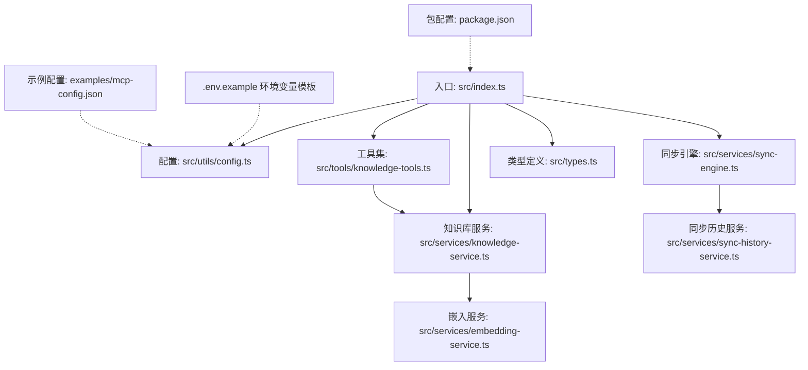
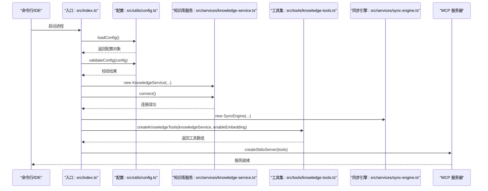
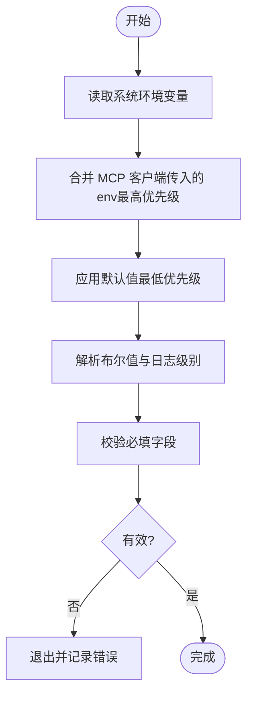
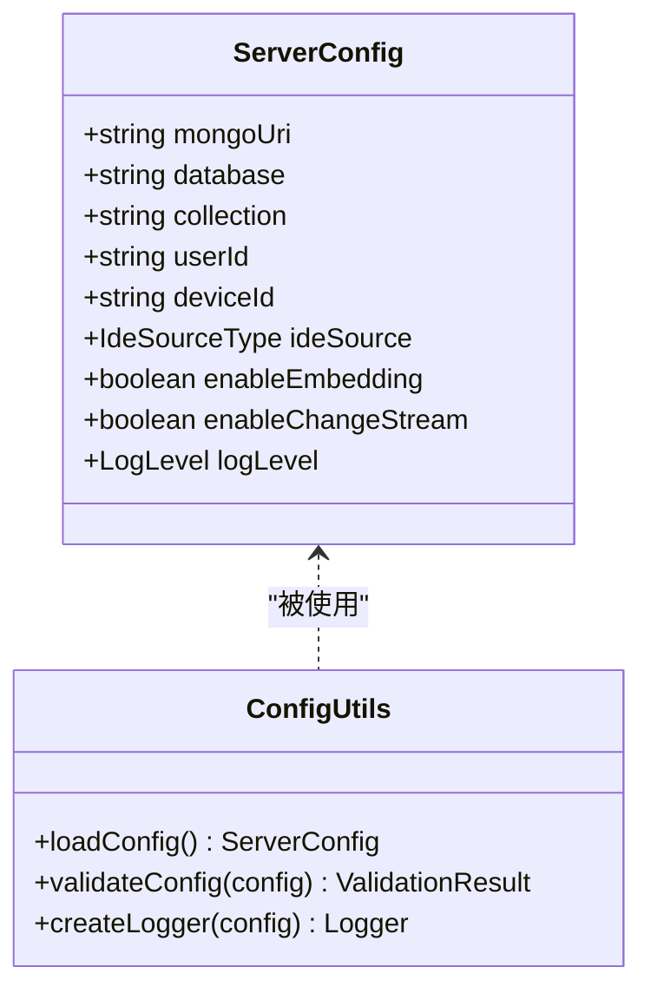
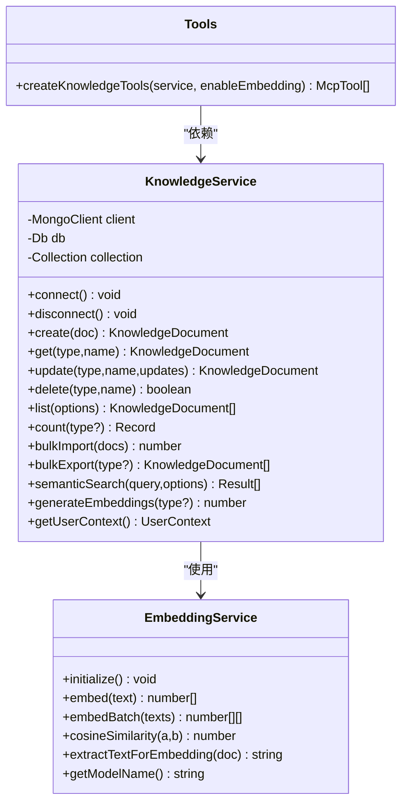
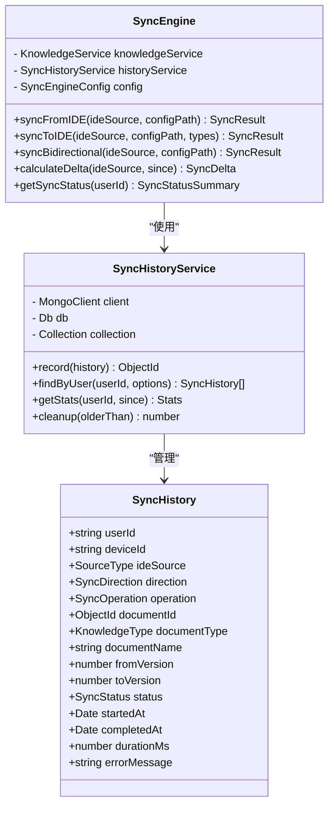
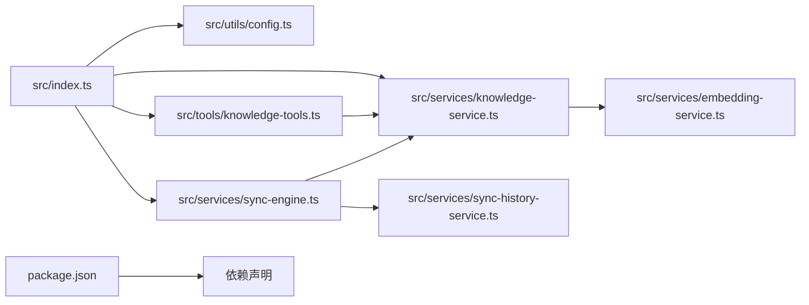

# 配置管理

<cite>
**本文引用的文件**
- [.env.example](file://.env.example)
- [examples/mcp-config.json](file://examples/mcp-config.json)
- [src/utils/config.ts](file://src/utils/config.ts)
- [src/index.ts](file://src/index.ts)
- [src/services/knowledge-service.ts](file://src/services/knowledge-service.ts)
- [src/tools/knowledge-tools.ts](file://src/tools/knowledge-tools.ts)
- [src/services/embedding-service.ts](file://src/services/embedding-service.ts)
- [src/services/sync-engine.ts](file://src/services/sync-engine.ts)
- [src/services/sync-history-service.ts](file://src/services/sync-history-service.ts)
- [src/types.ts](file://src/types.ts)
- [sync-data.mjs](file://sync-data.mjs)
- [package.json](file://package.json)
</cite>

## 目录
1. [简介](#简介)
2. [项目结构](#项目结构)
3. [核心组件](#核心组件)
4. [架构总览](#架构总览)
5. [详细组件分析](#详细组件分析)
6. [依赖关系分析](#依赖关系分析)
7. [性能考量](#性能考量)
8. [故障排查指南](#故障排查指南)
9. [结论](#结论)
10. [附录](#附录)

## 简介
本指南围绕 MCP 配置管理展开，重点解释 mcp-config.json 的结构与各配置块的作用；说明环境变量的优先级与覆盖机制；提供配置验证与测试方法；给出配置模板与最佳实践；解释不同环境（开发、测试、生产）的配置策略；并讨论配置热重载与动态更新的可行方案及安全注意事项。目标是帮助开发者在不同 IDE 和环境中稳定、安全地运行 mongo-mcp。

**更新** 新增了 .env.example 环境变量配置模板，包含完整的环境变量配置说明和同步相关的配置项。

## 项目结构
该项目采用"按职责分层"的组织方式：
- 入口与服务编排：入口文件负责启动 MCP 服务、加载配置、创建工具与服务器。
- 配置加载与校验：统一从环境变量解析配置，提供默认值与严格校验。
- 知识库服务：封装 MongoDB 连接、索引、CRUD、统计、语义搜索与嵌入生成。
- 工具集：提供通用知识库操作与快捷工具，并根据配置动态启用语义搜索能力。
- 嵌入服务：基于 Transformers.js 的文本向量生成与相似度计算。
- 同步引擎：支持双向同步、冲突解决和同步历史记录管理。
- 类型定义：统一的知识库文档类型与查询选项。

**图表来源**
- [src/index.ts](file://src/index.ts#L1-L148)
- [src/utils/config.ts](file://src/utils/config.ts#L1-L147)
- [src/services/knowledge-service.ts](file://src/services/knowledge-service.ts#L1-L404)
- [src/tools/knowledge-tools.ts](file://src/tools/knowledge-tools.ts#L1-L1093)
- [src/services/embedding-service.ts](file://src/services/embedding-service.ts#L1-L148)
- [src/services/sync-engine.ts](file://src/services/sync-engine.ts#L1-L451)
- [src/services/sync-history-service.ts](file://src/services/sync-history-service.ts#L1-L254)
- [src/types.ts](file://src/types.ts#L1-L269)
- [.env.example](file://.env.example#L1-L27)
- [examples/mcp-config.json](file://examples/mcp-config.json#L1-L94)
- [package.json](file://package.json#L1-L48)

**章节来源**
- [src/index.ts](file://src/index.ts#L1-L148)
- [src/utils/config.ts](file://src/utils/config.ts#L1-L147)
- [src/services/knowledge-service.ts](file://src/services/knowledge-service.ts#L1-L404)
- [src/tools/knowledge-tools.ts](file://src/tools/knowledge-tools.ts#L1-L1093)
- [src/services/embedding-service.ts](file://src/services/embedding-service.ts#L1-L148)
- [src/services/sync-engine.ts](file://src/services/sync-engine.ts#L1-L451)
- [src/services/sync-history-service.ts](file://src/services/sync-history-service.ts#L1-L254)
- [src/types.ts](file://src/types.ts#L1-L269)
- [.env.example](file://.env.example#L1-L27)
- [examples/mcp-config.json](file://examples/mcp-config.json#L1-L94)
- [package.json](file://package.json#L1-L48)

## 核心组件
- 配置加载与校验：从环境变量解析配置，提供默认值与严格校验，支持日志级别与 IDE 来源类型。
- 知识库服务：封装 MongoDB 连接、索引、CRUD、统计、批量导入导出、语义搜索与嵌入生成。
- 工具集：提供通用 CRUD、统计、批量导出、快捷工具以及可选的语义搜索与嵌入生成工具。
- 嵌入服务：基于 Transformers.js 的文本向量生成与相似度计算，支持懒加载与单例模式。
- 同步引擎：支持双向同步、冲突解决策略和同步历史记录管理。
- 同步历史服务：记录和查询同步操作历史，提供统计和清理功能。
- 类型定义：统一的知识库文档类型与查询选项，确保工具输入输出的一致性。

**章节来源**
- [src/utils/config.ts](file://src/utils/config.ts#L1-L147)
- [src/services/knowledge-service.ts](file://src/services/knowledge-service.ts#L1-L404)
- [src/tools/knowledge-tools.ts](file://src/tools/knowledge-tools.ts#L1-L1093)
- [src/services/embedding-service.ts](file://src/services/embedding-service.ts#L1-L148)
- [src/services/sync-engine.ts](file://src/services/sync-engine.ts#L1-L451)
- [src/services/sync-history-service.ts](file://src/services/sync-history-service.ts#L1-L254)
- [src/types.ts](file://src/types.ts#L1-L269)

## 架构总览
MCP 服务启动流程如下：入口文件加载配置并进行校验，连接 MongoDB，创建工具集（根据配置决定是否启用语义搜索），然后以 stdio 模式启动 MCP 服务器。

**图表来源**
- [src/index.ts](file://src/index.ts#L87-L145)
- [src/utils/config.ts](file://src/utils/config.ts#L76-L115)
- [src/services/knowledge-service.ts](file://src/services/knowledge-service.ts#L44-L54)
- [src/tools/knowledge-tools.ts](file://src/tools/knowledge-tools.ts#L29-L32)
- [src/services/sync-engine.ts](file://src/services/sync-engine.ts#L47-L60)

**章节来源**
- [src/index.ts](file://src/index.ts#L87-L145)

## 详细组件分析

### 环境变量配置模板与最佳实践
**更新** 新增了完整的 .env.example 环境变量配置模板，提供标准化的配置管理方案。

- .env.example 提供了完整的环境变量配置模板，包含以下关键配置组：
  - MongoDB 连接配置：MONGO_URI、MONGO_DATABASE、MONGO_COLLECTION
  - 用户标识：USER_ID、DEVICE_ID、IDE_SOURCE
  - 功能开关：ENABLE_EMBEDDING、ENABLE_CHANGE_STREAM
  - 日志配置：LOG_LEVEL

- 环境变量优先级顺序为：
  1) MCP 客户端传入的 env（最高优先级）
  2) 系统环境变量
  3) 内置默认值（最低优先级）

- 支持的关键环境变量包括：MONGO_URI、MONGO_DATABASE、MONGO_COLLECTION、USER_ID、DEVICE_ID、IDE_SOURCE、ENABLE_EMBEDDING、ENABLE_CHANGE_STREAM、LOG_LEVEL 等。

**图表来源**
- [src/utils/config.ts](file://src/utils/config.ts#L76-L115)
- [.env.example](file://.env.example#L1-L27)

**章节来源**
- [.env.example](file://.env.example#L1-L27)
- [src/utils/config.ts](file://src/utils/config.ts#L76-L115)

### 配置加载与校验逻辑
- 配置接口包含：MongoDB 连接串、数据库名、集合名、用户标识、设备标识、IDE 来源、是否启用嵌入、是否启用 Change Stream、日志级别等。
- 默认设备标识由 IDE 来源与主机名组合生成。
- 布尔值解析支持大小写与数值形式；日志级别限定在预设集合内。
- 校验要求 MONGO_URI、MONGO_DATABASE、MONGO_COLLECTION 三者非空。

**图表来源**
- [src/utils/config.ts](file://src/utils/config.ts#L11-L28)
- [src/utils/config.ts](file://src/utils/config.ts#L76-L146)

**章节来源**
- [src/utils/config.ts](file://src/utils/config.ts#L11-L28)
- [src/utils/config.ts](file://src/utils/config.ts#L76-L146)

### 知识库服务与工具集
- 知识库服务封装了 MongoDB 连接、索引创建、CRUD、统计、批量导入导出、语义搜索与嵌入生成。
- 工具集提供通用 CRUD、统计、批量导出、快捷工具（记忆、经验、命令、上下文、MCP 同步、规则、技能、工作流）以及可选的语义搜索与嵌入生成工具。
- 当配置开启嵌入时，工具集会动态注入语义搜索与嵌入生成工具。

**图表来源**
- [src/services/knowledge-service.ts](file://src/services/knowledge-service.ts#L20-L403)
- [src/services/embedding-service.ts](file://src/services/embedding-service.ts#L11-L147)
- [src/tools/knowledge-tools.ts](file://src/tools/knowledge-tools.ts#L29-L1092)

**章节来源**
- [src/services/knowledge-service.ts](file://src/services/knowledge-service.ts#L1-L404)
- [src/tools/knowledge-tools.ts](file://src/tools/knowledge-tools.ts#L1-L1093)
- [src/services/embedding-service.ts](file://src/services/embedding-service.ts#L1-L148)

### 同步引擎与历史管理
**更新** 新增了同步引擎和历史管理服务，提供完整的数据同步解决方案。

- 同步引擎支持双向同步、冲突解决策略和批量操作：
  - 冲突解决策略：last_write_wins、keep_local、keep_remote、manual
  - 需要同步的文档类型：Rules、Memories、Skills、MCPs
  - 自动备份功能和批量大小配置

- 同步历史服务提供完整的同步记录管理：
  - 用户+设备+时间索引优化查询性能
  - TTL 索引自动清理90天前的历史记录
  - 支持按用户、状态、操作类型查询
  - 提供同步统计和状态汇总功能

**图表来源**
- [src/services/sync-engine.ts](file://src/services/sync-engine.ts#L47-L451)
- [src/services/sync-history-service.ts](file://src/services/sync-history-service.ts#L9-L254)

**章节来源**
- [src/services/sync-engine.ts](file://src/services/sync-engine.ts#L1-L451)
- [src/services/sync-history-service.ts](file://src/services/sync-history-service.ts#L1-L254)

### 类型定义与工具输入输出
- 类型定义统一了知识库文档类型（8 种）、来源类型、文档结构、查询选项与语义搜索选项。
- 工具集的输入 Schema 明确了每个工具的参数、必填项与描述，便于 MCP 客户端进行参数校验与提示。

**章节来源**
- [src/types.ts](file://src/types.ts#L1-L269)
- [src/tools/knowledge-tools.ts](file://src/tools/knowledge-tools.ts#L1-L1093)

## 依赖关系分析
- 入口文件依赖配置模块、知识库服务与工具集。
- 工具集依赖知识库服务；知识库服务依赖嵌入服务（仅在启用嵌入时）。
- 同步引擎依赖知识库服务和同步历史服务。
- 包配置声明了运行时依赖（mongodb、@modelcontextprotocol/sdk、@xenova/transformers）与开发依赖（TypeScript、ESLint、tsx）。

**图表来源**
- [src/index.ts](file://src/index.ts#L1-L148)
- [src/utils/config.ts](file://src/utils/config.ts#L1-L147)
- [src/services/knowledge-service.ts](file://src/services/knowledge-service.ts#L1-L404)
- [src/tools/knowledge-tools.ts](file://src/tools/knowledge-tools.ts#L1-L1093)
- [src/services/embedding-service.ts](file://src/services/embedding-service.ts#L1-L148)
- [src/services/sync-engine.ts](file://src/services/sync-engine.ts#L1-L451)
- [src/services/sync-history-service.ts](file://src/services/sync-history-service.ts#L1-L254)
- [package.json](file://package.json#L30-L43)

**章节来源**
- [package.json](file://package.json#L30-L43)

## 性能考量
- 嵌入模型懒加载：首次使用时初始化，避免启动时的冷启动开销。
- 余弦相似度计算：逐文档计算，建议配合阈值与限制数量控制结果规模。
- 索引设计：针对用户维度与常用查询字段建立复合索引，提升查询与统计性能。
- 批量导入/导出：适合大规模数据迁移与备份，注意内存占用与网络带宽。
- 同步性能优化：批量大小配置、冲突解决策略选择、历史记录索引优化。

**章节来源**
- [src/services/embedding-service.ts](file://src/services/embedding-service.ts#L24-L51)
- [src/services/knowledge-service.ts](file://src/services/knowledge-service.ts#L71-L87)
- [src/services/sync-engine.ts](file://src/services/sync-engine.ts#L22-L27)
- [src/services/sync-history-service.ts](file://src/services/sync-history-service.ts#L50-L74)

## 故障排查指南
- 配置校验失败：检查 MONGO_URI、MONGO_DATABASE、MONGO_COLLECTION 是否正确设置；查看日志输出的具体错误项。
- 连接 MongoDB 失败：确认连接串格式、网络可达性与认证信息；检查数据库与集合权限。
- 工具调用异常：核对工具输入 Schema，确保必填参数齐全；查看工具处理器的错误返回。
- 嵌入功能不可用：确认 ENABLE_EMBEDDING 已启用；等待模型初始化完成；检查网络与缓存配置。
- 同步功能异常：检查 ENABLE_CHANGE_STREAM 配置；验证同步历史记录；查看冲突解决策略。
- 环境变量加载失败：确认 .env.example 文件存在且格式正确；检查环境变量优先级。

**章节来源**
- [src/index.ts](file://src/index.ts#L92-L98)
- [src/utils/config.ts](file://src/utils/config.ts#L96-L115)
- [src/services/knowledge-service.ts](file://src/services/knowledge-service.ts#L44-L54)
- [src/tools/knowledge-tools.ts](file://src/tools/knowledge-tools.ts#L1000-L1089)
- [src/services/sync-engine.ts](file://src/services/sync-engine.ts#L47-L60)
- [src/services/sync-history-service.ts](file://src/services/sync-history-service.ts#L24-L33)

## 结论
本项目通过清晰的配置加载与校验、完善的工具集与知识库服务、可选的嵌入能力以及完整的同步解决方案，提供了跨 IDE 的 MCP 服务运行框架。新增的 .env.example 环境变量模板和同步功能增强了配置管理的完整性和实用性。遵循本文档的配置策略与最佳实践，可在不同环境中稳定部署并安全地管理知识库数据。

## 附录

### mcp-config.json 结构与配置块说明
- 根层级包含多个配置块（如 qoder、cursor、vscode、local_development、shared_cloud），每个块定义 MCP 服务器的命令、参数与环境变量映射。
- 环境变量键值对用于驱动运行时行为（如数据库连接、用户与设备标识、IDE 来源、嵌入开关、日志级别等）。

**章节来源**
- [examples/mcp-config.json](file://examples/mcp-config.json#L1-L94)

### 环境变量优先级与覆盖机制
- 优先级顺序：MCP 客户端传入 env > 系统环境变量 > 内置默认值。
- 布尔值解析：支持大小写与数值形式；日志级别限定在预设集合内。
- 设备标识默认生成策略：由 IDE 来源与主机名组合而成。
- 新增的 ENABLE_CHANGE_STREAM 环境变量用于控制 MongoDB Change Stream 功能。

**章节来源**
- [src/utils/config.ts](file://src/utils/config.ts#L76-L91)
- [src/utils/config.ts](file://src/utils/config.ts#L33-L36)
- [.env.example](file://.env.example#L20-L22)

### 配置验证与测试方法
- 配置验证：确保 MONGO_URI、MONGO_DATABASE、MONGO_COLLECTION 非空；通过 validateConfig 输出具体错误列表。
- 测试建议：分别在本地开发、IDE 集成与云数据库场景下验证连接与工具可用性；使用最小化配置启动以定位问题。
- 同步功能测试：验证双向同步、冲突解决和历史记录功能。

**章节来源**
- [src/utils/config.ts](file://src/utils/config.ts#L96-L115)
- [src/index.ts](file://src/index.ts#L92-L98)
- [src/services/sync-engine.ts](file://src/services/sync-engine.ts#L250-L270)

### 配置模板与最佳实践
- 开发环境模板：使用本地构建与调试日志级别，启用嵌入以验证语义搜索。
- 生产环境模板：使用稳定的云数据库连接串与只读权限；禁用调试日志；明确用户与设备标识。
- 多设备同步模板：共享数据库与用户标识，区分设备标识以实现跨终端同步。
- 同步配置模板：合理配置批量大小、冲突解决策略和自动备份功能。

**章节来源**
- [examples/mcp-config.json](file://examples/mcp-config.json#L57-L92)
- [src/utils/config.ts](file://src/utils/config.ts#L33-L36)
- [src/services/sync-engine.ts](file://src/services/sync-engine.ts#L22-L27)

### 不同环境的配置策略
- 开发：本地 MongoDB 或 Docker；较低日志级别；启用嵌入；使用默认集合名。
- 测试：独立数据库与集合；启用嵌入；使用专用用户标识。
- 生产：使用云数据库连接串与只读权限；禁用调试日志；严格校验配置。
- 同步环境：根据数据量和性能需求调整批量大小和冲突解决策略。

**章节来源**
- [examples/mcp-config.json](file://examples/mcp-config.json#L57-L92)
- [src/utils/config.ts](file://src/utils/config.ts#L76-L91)
- [src/services/sync-engine.ts](file://src/services/sync-engine.ts#L11-L20)

### 配置热重载与动态更新
- 当前实现：启动时一次性加载配置并建立连接；无内置热重载机制。
- 实现建议：监听配置文件变更或外部配置中心推送；在优雅停机前断开连接，重新加载配置后重启服务；对嵌入模型采用懒加载策略以降低重启成本。
- 同步配置更新：支持动态调整批量大小和冲突解决策略。

**章节来源**
- [src/index.ts](file://src/index.ts#L133-L140)
- [src/services/embedding-service.ts](file://src/services/embedding-service.ts#L24-L51)
- [src/services/sync-engine.ts](file://src/services/sync-engine.ts#L52-L60)

### 配置安全性与敏感信息保护
- 敏感信息：数据库连接串、用户标识与设备标识应避免硬编码在公共仓库；优先通过环境变量或密钥管理服务注入。
- 日志级别：生产环境避免输出敏感信息；必要时对日志内容进行脱敏。
- 网络与缓存：合理配置 Transformers.js 的缓存与后端参数，避免不必要的本地模型下载。
- 同步安全：验证同步历史记录的完整性，防止数据篡改。

**章节来源**
- [src/utils/config.ts](file://src/utils/config.ts#L120-L146)
- [src/services/embedding-service.ts](file://src/services/embedding-service.ts#L3-L7)
- [src/services/sync-history-service.ts](file://src/services/sync-history-service.ts#L245-L252)

### 同步功能配置详解
**更新** 新增了同步功能的详细配置说明。

- 同步引擎配置：
  - 冲突解决策略：last_write_wins（默认）、keep_local、keep_remote、manual
  - 需要同步的文档类型：Rules、Memories、Skills、MCPs
  - 自动备份：默认启用，可防止同步过程中的数据丢失
  - 批量大小：默认50，可根据性能调整

- 同步历史记录：
  - 自动索引优化：用户+设备+时间、文档ID、用户+状态、用户+操作类型
  - TTL自动清理：90天后自动删除历史记录
  - 详细的状态跟踪：success、failed、partial

- 同步脚本配置：
  - 支持多环境配置切换
  - 环境变量覆盖机制
  - 批量数据导入导出

**章节来源**
- [src/services/sync-engine.ts](file://src/services/sync-engine.ts#L11-L27)
- [src/services/sync-history-service.ts](file://src/services/sync-history-service.ts#L50-L74)
- [sync-data.mjs](file://sync-data.mjs#L114-L121)