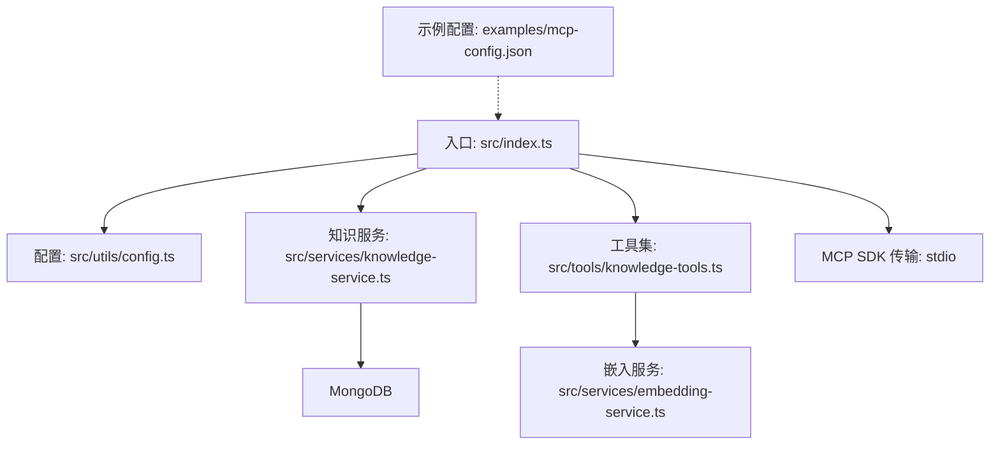
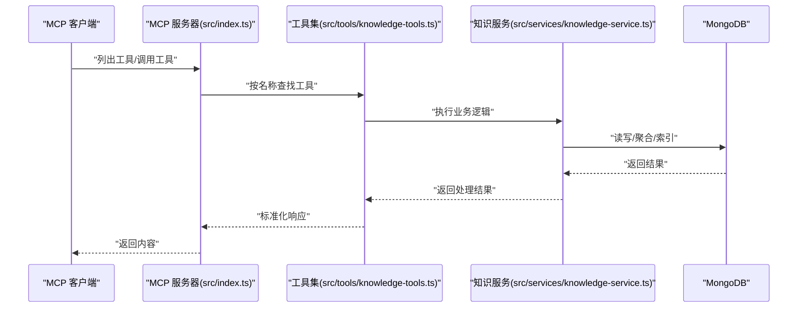
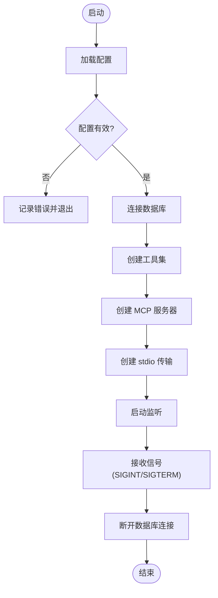
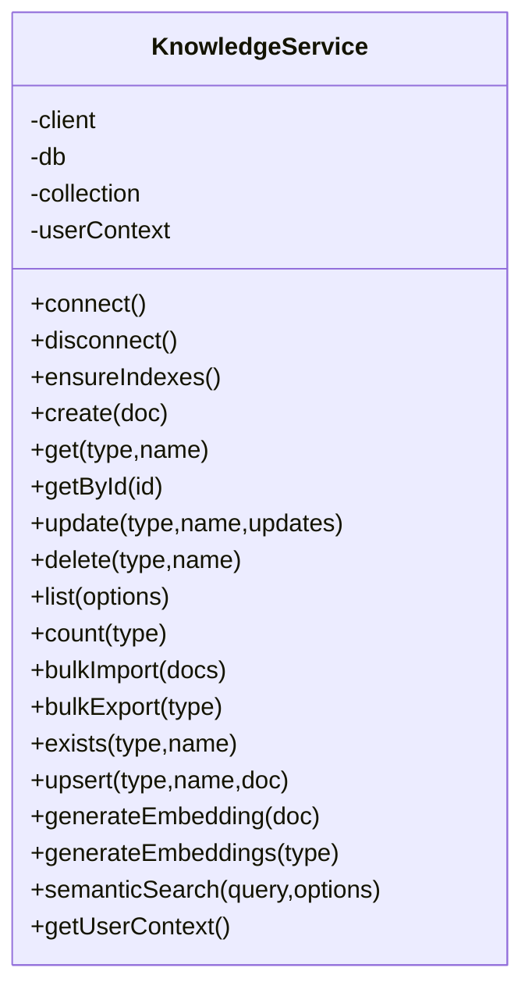
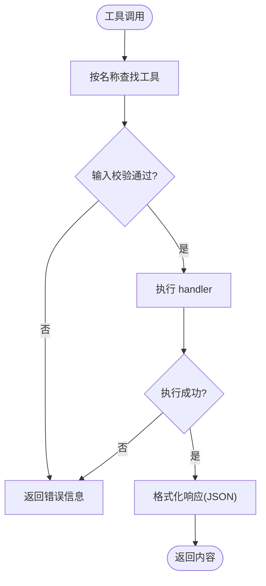
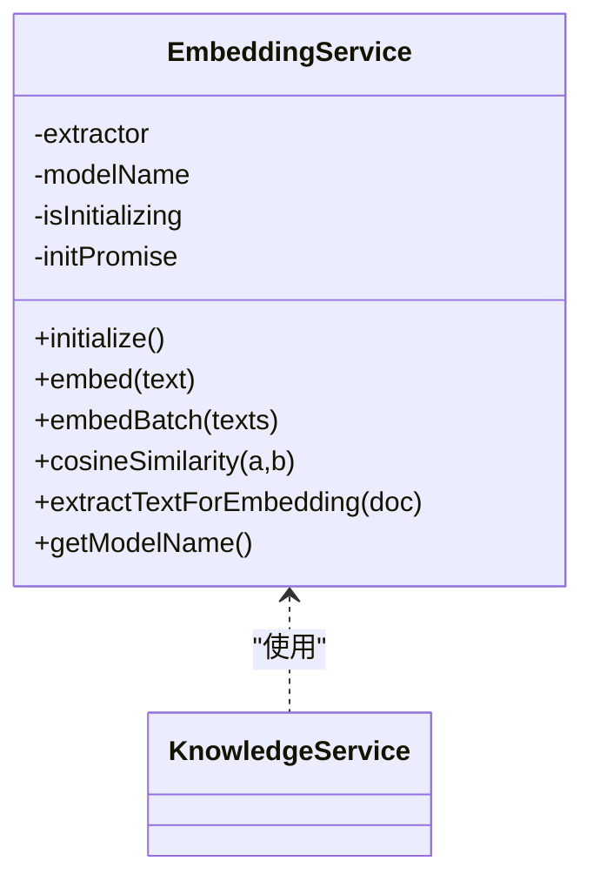
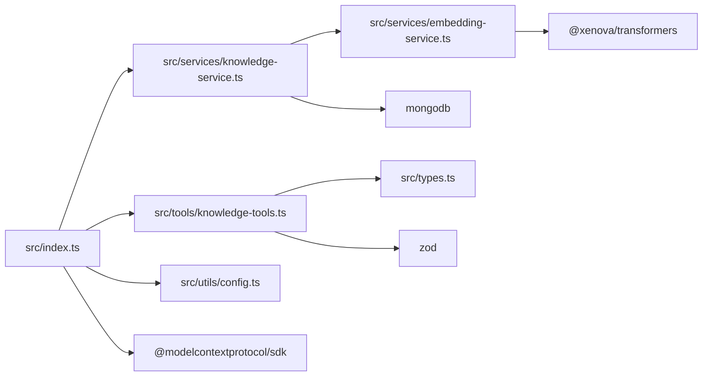

# MCP 协议实现

<cite>
**本文引用的文件**
- [package.json](file://package.json)
- [src/index.ts](file://src/index.ts)
- [src/types.ts](file://src/types.ts)
- [src/tools/knowledge-tools.ts](file://src/tools/knowledge-tools.ts)
- [src/services/knowledge-service.ts](file://src/services/knowledge-service.ts)
- [src/utils/config.ts](file://src/utils/config.ts)
- [src/services/embedding-service.ts](file://src/services/embedding-service.ts)
- [examples/mcp-config.json](file://examples/mcp-config.json)
- [tsconfig.json](file://tsconfig.json)
- [temp-skills/README.md](file://temp-skills/README.md)
- [temp-skills/skills/algorithmic-art/SKILL.md](file://temp-skills/skills/algorithmic-art/SKILL.md)
- [temp-skills/skills/mcp-builder/reference/node_mcp_server.md](file://temp-skills/skills/mcp-builder/reference/node_mcp_server.md)
</cite>

## 目录
1. [简介](#简介)
2. [项目结构](#项目结构)
3. [核心组件](#核心组件)
4. [架构总览](#架构总览)
5. [详细组件分析](#详细组件分析)
6. [依赖关系分析](#依赖关系分析)
7. [性能考量](#性能考量)
8. [故障排查指南](#故障排查指南)
9. [结论](#结论)
10. [附录](#附录)

## 简介
本项目实现了 Model Context Protocol（MCP）协议的服务器端能力，通过标准传输通道（stdio）与 MCP 客户端交互，提供一组围绕“知识库”的工具集合。这些工具覆盖知识的创建、读取、更新、删除、列举、统计、导入导出、以及面向特定领域的快捷操作（记忆、经验、命令、上下文、规则、技能、工作流），并可选地支持向量嵌入与语义搜索。

该实现以 MongoDB 作为持久化存储，结合用户上下文（用户ID、设备ID、IDE来源）实现跨终端同步与隔离；同时提供可插拔的嵌入服务，用于语义检索与相似度计算。

## 项目结构
- 入口与运行时
  - 入口文件负责初始化 MCP 服务器、加载配置、连接数据库、注册工具并启动传输层。
- 类型与接口
  - 定义了知识库文档的统一类型体系，涵盖多种知识类型（记忆、技能、规则、MCP、经验、命令、上下文、工作流）及其字段约束。
- 工具集
  - 将知识库操作封装为 MCP 工具，提供统一的输入校验与输出格式。
- 服务层
  - 知识库服务抽象数据库访问、索引管理、批量导入导出、嵌入生成与语义搜索。
- 嵌入服务
  - 基于 Transformers.js 的文本向量化与余弦相似度计算。
- 配置与日志
  - 从环境变量加载配置，进行基础校验与日志输出。
- 示例与参考
  - 提供 IDE 配置示例与 MCP 开发参考文档。

**图表来源**
- [src/index.ts](file://src/index.ts#L1-L148)
- [src/utils/config.ts](file://src/utils/config.ts#L1-L147)
- [src/services/knowledge-service.ts](file://src/services/knowledge-service.ts#L1-L404)
- [src/tools/knowledge-tools.ts](file://src/tools/knowledge-tools.ts#L1-L1093)
- [src/services/embedding-service.ts](file://src/services/embedding-service.ts#L1-L148)
- [examples/mcp-config.json](file://examples/mcp-config.json#L1-L94)

**章节来源**
- [src/index.ts](file://src/index.ts#L1-L148)
- [src/types.ts](file://src/types.ts#L1-L269)
- [src/utils/config.ts](file://src/utils/config.ts#L1-L147)
- [examples/mcp-config.json](file://examples/mcp-config.json#L1-L94)

## 核心组件
- MCP 服务器与传输
  - 使用 MCP SDK 的 Server 类与 stdio 传输，声明工具能力并注册请求处理器。
- 知识库服务
  - 提供 CRUD、列表、统计、批量导入导出、存在性检查、upsert、嵌入生成与语义搜索等能力。
- 工具集
  - 将知识库操作映射为 MCP 工具，统一输入 Schema 与输出结构。
- 嵌入服务
  - 文本向量化与相似度计算，支持批量生成嵌入。
- 配置与日志
  - 环境变量解析、验证与日志级别控制。

**章节来源**
- [src/index.ts](file://src/index.ts#L16-L82)
- [src/services/knowledge-service.ts](file://src/services/knowledge-service.ts#L20-L404)
- [src/tools/knowledge-tools.ts](file://src/tools/knowledge-tools.ts#L1-L1093)
- [src/services/embedding-service.ts](file://src/services/embedding-service.ts#L1-L148)
- [src/utils/config.ts](file://src/utils/config.ts#L76-L147)

## 架构总览
MCP 服务器采用“工具注册 + 请求分发”的模式：客户端发起工具调用请求，服务器根据工具名匹配处理器，执行对应业务逻辑并返回结构化内容。

**图表来源**
- [src/index.ts](file://src/index.ts#L29-L79)
- [src/tools/knowledge-tools.ts](file://src/tools/knowledge-tools.ts#L36-L106)
- [src/services/knowledge-service.ts](file://src/services/knowledge-service.ts#L111-L127)

## 详细组件分析

### MCP 服务器与请求处理流程
- 服务器初始化
  - 声明服务器元信息与能力（工具能力）。
- 工具列表
  - 返回已注册工具的名称、描述与输入 Schema。
- 工具调用
  - 根据请求中的工具名定位处理器，执行并返回文本内容（JSON 字符串）。
  - 异常时返回包含错误信息的文本内容。
- 优雅退出
  - 监听 SIGINT/SIGTERM，断开数据库连接并退出进程。

**图表来源**
- [src/index.ts](file://src/index.ts#L87-L145)
- [src/utils/config.ts](file://src/utils/config.ts#L96-L115)

**章节来源**
- [src/index.ts](file://src/index.ts#L16-L82)
- [src/index.ts](file://src/index.ts#L87-L145)

### 知识库服务（KnowledgeService）
- 连接与索引
  - 连接 MongoDB，确保用户级唯一索引、类型过滤索引、标签索引、时间排序索引等。
- 文档操作
  - create/get/getById/update/delete/list/count/bulkImport/bulkExport/exists/upsert。
- 嵌入与语义搜索
  - generateEmbedding/generateEmbeddings/semanticSearch，结合嵌入服务计算相似度。
- 用户上下文
  - 注入 userId/deviceId/ideSource，支持跨设备同步与用户隔离。

**图表来源**
- [src/services/knowledge-service.ts](file://src/services/knowledge-service.ts#L20-L404)

**章节来源**
- [src/services/knowledge-service.ts](file://src/services/knowledge-service.ts#L44-L87)
- [src/services/knowledge-service.ts](file://src/services/knowledge-service.ts#L111-L190)
- [src/services/knowledge-service.ts](file://src/services/knowledge-service.ts#L272-L299)
- [src/services/knowledge-service.ts](file://src/services/knowledge-service.ts#L346-L360)

### 工具集（MCP 工具）
- 工具接口
  - name/description/inputSchema/handler，统一工具签名。
- 工具清单
  - 通用 CRUD：knowledge_create/knowledge_read/knowledge_update/knowledge_delete/knowledge_list/knowledge_stats/knowledge_upsert。
  - 快捷工具：memory_add/memory_search/experience_add/command_add/context_set。
  - 同步工具：mcp_sync/rule_sync/skill_sync/workflow_create。
  - 用户信息：get_user_info。
  - 导入导出：knowledge_export。
  - 嵌入工具（可选）：semantic_search/generate_embeddings。
- 输入 Schema
  - 使用 JSON Schema（对象类型、属性、必填项）定义参数规范。
- 输出格式
  - 统一返回包含 success/data/message/error 的结构化对象，内容以文本形式返回给 MCP 客户端。

**图表来源**
- [src/tools/knowledge-tools.ts](file://src/tools/knowledge-tools.ts#L7-L16)
- [src/tools/knowledge-tools.ts](file://src/tools/knowledge-tools.ts#L36-L106)

**章节来源**
- [src/tools/knowledge-tools.ts](file://src/tools/knowledge-tools.ts#L29-L334)
- [src/tools/knowledge-tools.ts](file://src/tools/knowledge-tools.ts#L336-L399)
- [src/tools/knowledge-tools.ts](file://src/tools/knowledge-tools.ts#L401-L758)
- [src/tools/knowledge-tools.ts](file://src/tools/knowledge-tools.ts#L760-L970)
- [src/tools/knowledge-tools.ts](file://src/tools/knowledge-tools.ts#L972-L997)
- [src/tools/knowledge-tools.ts](file://src/tools/knowledge-tools.ts#L1000-L1093)

### 嵌入服务（EmbeddingService）
- 模型懒加载
  - 初始化时加载特征抽取模型，避免冷启动开销过大。
- 向量生成
  - 支持单条与批量向量生成，提供余弦相似度计算。
- 文本提取
  - 从文档中提取用于嵌入的文本片段（名称、描述、内容、标签）。

**图表来源**
- [src/services/embedding-service.ts](file://src/services/embedding-service.ts#L11-L148)
- [src/services/knowledge-service.ts](file://src/services/knowledge-service.ts#L272-L299)

**章节来源**
- [src/services/embedding-service.ts](file://src/services/embedding-service.ts#L24-L51)
- [src/services/embedding-service.ts](file://src/services/embedding-service.ts#L56-L80)
- [src/services/embedding-service.ts](file://src/services/embedding-service.ts#L85-L104)
- [src/services/embedding-service.ts](file://src/services/embedding-service.ts#L109-L129)

### 配置与日志
- 配置加载
  - 从环境变量读取 MongoDB 连接、数据库、集合、用户ID、设备ID、IDE来源、嵌入开关、日志级别等。
- 配置校验
  - 校验必要字段（URI、数据库、集合）。
- 日志
  - 按日志级别输出调试、信息、警告、错误信息。

**章节来源**
- [src/utils/config.ts](file://src/utils/config.ts#L76-L115)
- [src/utils/config.ts](file://src/utils/config.ts#L120-L147)

### 类型系统（知识库文档）
- 知识类型
  - Memories、Skills、Rules、MCPs、Experiences、Commands、Contexts、Workflows。
- 基础字段
  - 类型、名称、内容、描述、标签、启用状态、用户与设备标识、同步版本、来源信息、时间戳、向量嵌入等。
- 特定类型扩展
  - 记忆（分类、重要性、过期）、MCP（命令、参数、环境变量、工具列表）、技能（触发条件、脚本、依赖）、规则（优先级、条件、动作、触发方式）、经验（场景、解决方案、结果、评分、关联技能）、命令（模板、参数、分类、快捷别名）、上下文（范围、项目路径、有效期、参考资料）、工作流（步骤、触发条件、自动执行）。
- 查询与统计
  - CreateKnowledgeRequest/UpdateKnowledgeRequest/ListOptions/SemanticSearchOptions。

**章节来源**
- [src/types.ts](file://src/types.ts#L6-L74)
- [src/types.ts](file://src/types.ts#L80-L152)
- [src/types.ts](file://src/types.ts#L158-L210)
- [src/types.ts](file://src/types.ts#L228-L269)

## 依赖关系分析
- 外部依赖
  - @modelcontextprotocol/sdk：MCP 服务器与传输。
  - mongodb：MongoDB 客户端与集合操作。
  - @xenova/transformers：文本向量化。
  - zod：输入 Schema 校验（在工具集中体现）。
- 内部模块
  - index.ts 依赖工具集、知识服务、配置。
  - 知识服务依赖嵌入服务与 MongoDB。
  - 工具集依赖知识服务与类型定义。

**图表来源**
- [package.json](file://package.json#L30-L42)
- [src/index.ts](file://src/index.ts#L3-L11)
- [src/tools/knowledge-tools.ts](file://src/tools/knowledge-tools.ts#L1-L2)
- [src/services/knowledge-service.ts](file://src/services/knowledge-service.ts#L1-L4)
- [src/services/embedding-service.ts](file://src/services/embedding-service.ts#L1)

**章节来源**
- [package.json](file://package.json#L30-L42)
- [src/index.ts](file://src/index.ts#L3-L11)

## 性能考量
- 数据库索引
  - 用户级唯一索引、类型过滤索引、标签索引、时间排序索引，提升查询与排序效率。
- 嵌入生成
  - 批量生成嵌入，避免逐条 I/O；仅对存在 embedding 字段的文档参与语义搜索。
- 懒加载嵌入模型
  - 首次使用时加载模型，减少启动时间。
- 响应大小控制
  - 在工具实现中建议控制输出长度，避免超大响应影响客户端体验。
- 并发与资源
  - 使用连接池与事务（如需）；注意长耗时操作的超时与中断处理。

[本节为通用指导，无需具体文件分析]

## 故障排查指南
- 启动失败
  - 检查配置校验结果与日志输出，确认 MONGO_URI/MONGO_DATABASE/MONGO_COLLECTION 是否正确。
- 数据库连接问题
  - 确认 MongoDB 可达性、认证信息与网络策略。
- 工具调用异常
  - 查看工具处理器返回的错误信息；检查输入 Schema 是否满足要求。
- 嵌入功能不可用
  - 确认 ENABLE_EMBEDDING 开关与嵌入模型加载日志；检查文档是否具备可嵌入文本。
- 信号退出
  - 服务器监听 SIGINT/SIGTERM，优雅关闭数据库连接。

**章节来源**
- [src/index.ts](file://src/index.ts#L93-L98)
- [src/index.ts](file://src/index.ts#L133-L140)
- [src/utils/config.ts](file://src/utils/config.ts#L96-L115)
- [src/services/embedding-service.ts](file://src/services/embedding-service.ts#L42-L51)

## 结论
本实现基于 MCP 协议提供了完整的知识库工具集，具备良好的扩展性与可维护性。通过统一的工具接口、严格的输入校验与结构化输出，能够稳定地服务于多种 IDE 与客户端。结合 MongoDB 的灵活文档模型与可选嵌入能力，可在不同场景下平衡易用性与性能。

[本节为总结，无需具体文件分析]

## 附录

### MCP 工具接口规范
- 工具定义
  - name：工具名称（唯一标识）。
  - description：工具描述。
  - inputSchema：JSON Schema，定义参数类型、必填项与约束。
  - handler：异步处理器，接收参数并返回结构化结果。
- 输出格式
  - 成功：success=true，data 包含结果详情，message 提供人类可读信息。
  - 失败：success=false，error 包含错误信息。
- 建议
  - 使用 Zod 或类似工具进行运行时校验；为复杂工具提供示例与注释；控制输出长度与复杂度。

**章节来源**
- [src/tools/knowledge-tools.ts](file://src/tools/knowledge-tools.ts#L7-L16)
- [src/tools/knowledge-tools.ts](file://src/tools/knowledge-tools.ts#L36-L106)

### 自定义 MCP 工具实现示例（步骤指引）
- 定义工具接口与输入 Schema。
- 编写处理器，调用知识服务执行业务逻辑。
- 在工具集中注册工具，确保名称唯一且描述清晰。
- 在 IDE 配置中添加 MCP 服务器条目，设置环境变量与命令参数。
- 启动服务器并通过客户端测试工具调用。

**章节来源**
- [src/tools/knowledge-tools.ts](file://src/tools/knowledge-tools.ts#L29-L334)
- [examples/mcp-config.json](file://examples/mcp-config.json#L1-L94)

### 安全与合规
- 配置安全
  - 将敏感配置置于受控环境变量中，避免硬编码。
- 访问控制
  - 通过用户上下文（userId/deviceId/ideSource）实现用户隔离与跨设备同步。
- 数据保护
  - 对嵌入与内容进行最小化处理，遵循数据最小化原则。
- 错误信息
  - 不泄露内部错误细节，仅返回必要的错误提示。

**章节来源**
- [src/utils/config.ts](file://src/utils/config.ts#L76-L91)
- [src/services/knowledge-service.ts](file://src/services/knowledge-service.ts#L92-L106)

### 兼容性说明
- MCP SDK 版本
  - 依赖 @modelcontextprotocol/sdk，遵循其 API 与传输规范。
- Node.js 版本
  - 要求 Node.js >= 18。
- IDE 集成
  - 提供多 IDE 的配置示例（Qoder/Cursor/VS Code/本地开发/云共享）。
- 与其他实现的关系
  - 本实现遵循 MCP 协议规范，可与支持 MCP 的客户端互通；嵌入与语义搜索能力可与其他具备相同能力的实现协同使用。

**章节来源**
- [package.json](file://package.json#L44-L46)
- [examples/mcp-config.json](file://examples/mcp-config.json#L1-L94)
- [temp-skills/skills/mcp-builder/reference/node_mcp_server.md](file://temp-skills/skills/mcp-builder/reference/node_mcp_server.md#L50-L63)

### 参考与扩展
- 技能与示例
  - 仓库包含大量技能示例与参考文档，可用于理解 MCP 生态与最佳实践。
- MCP 开发参考
  - Node/TypeScript MCP 服务器实现指南，涵盖项目结构、工具注册、输入校验、错误处理与示例。

**章节来源**
- [temp-skills/README.md](file://temp-skills/README.md#L1-L95)
- [temp-skills/skills/algorithmic-art/SKILL.md](file://temp-skills/skills/algorithmic-art/SKILL.md#L1-L405)
- [temp-skills/skills/mcp-builder/reference/node_mcp_server.md](file://temp-skills/skills/mcp-builder/reference/node_mcp_server.md#L1-L800)