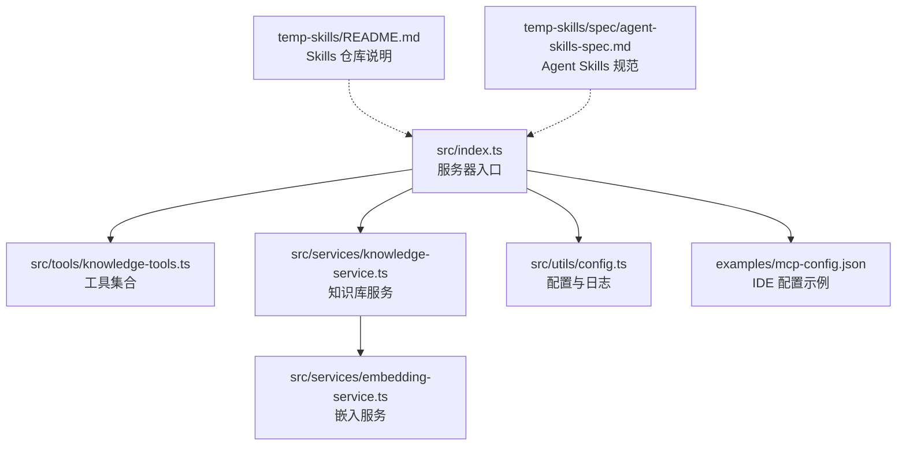
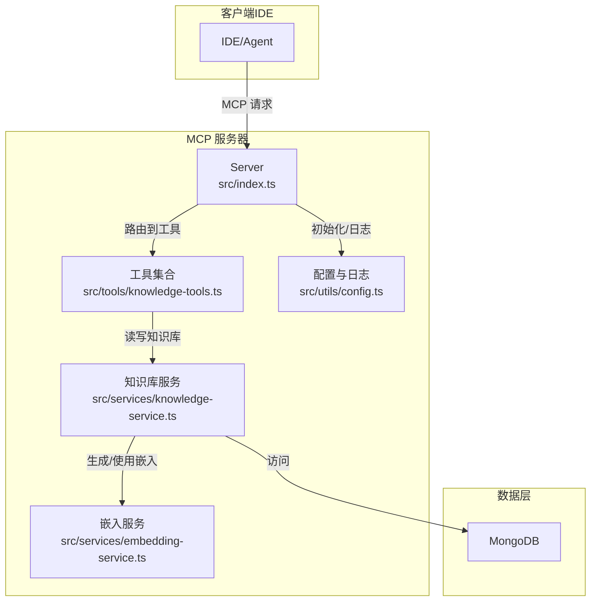
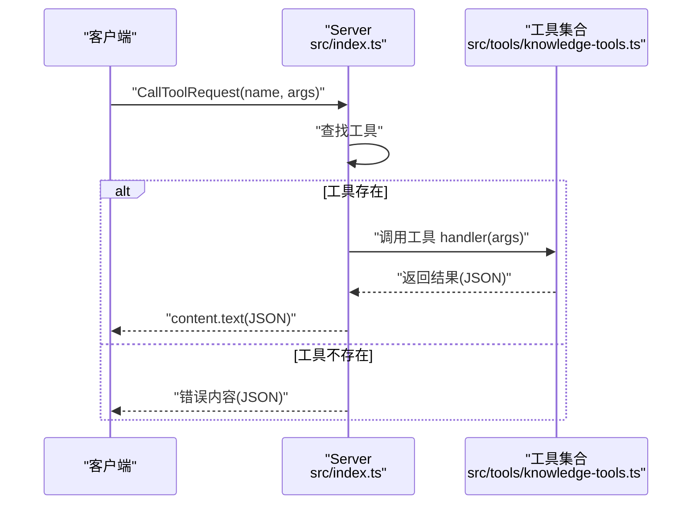
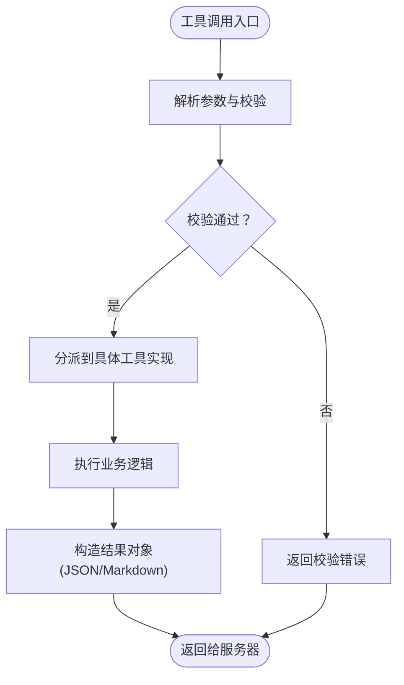
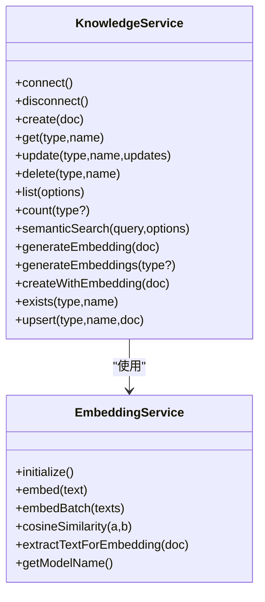
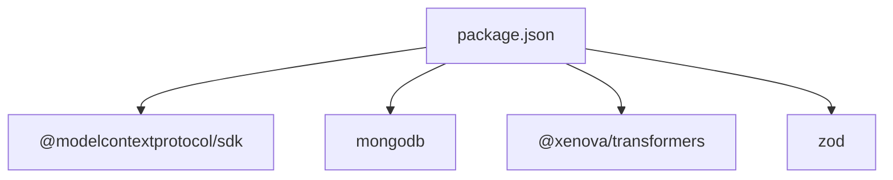

# MCP 协议概述

<cite>
**本文引用的文件**
- [package.json](file://package.json)
- [src/index.ts](file://src/index.ts)
- [src/types.ts](file://src/types.ts)
- [src/utils/config.ts](file://src/utils/config.ts)
- [src/services/knowledge-service.ts](file://src/services/knowledge-service.ts)
- [src/services/embedding-service.ts](file://src/services/embedding-service.ts)
- [src/tools/knowledge-tools.ts](file://src/tools/knowledge-tools.ts)
- [examples/mcp-config.json](file://examples/mcp-config.json)
- [temp-skills/README.md](file://temp-skills/README.md)
- [temp-skills/spec/agent-skills-spec.md](file://temp-skills/spec/agent-skills-spec.md)
- [temp-skills/skills/mcp-builder/reference/python_mcp_server.md](file://temp-skills/skills/mcp-builder/reference/python_mcp_server.md)
- [temp-skills/skills/mcp-builder/reference/node_mcp_server.md](file://temp-skills/skills/mcp-builder/reference/node_mcp_server.md)
- [temp-skills/skills/mcp-builder/reference/mcp_best_practices.md](file://temp-skills/skills/mcp-builder/reference/mcp_best_practices.md)
</cite>

## 目录
1. [简介](#简介)
2. [项目结构](#项目结构)
3. [核心组件](#核心组件)
4. [架构总览](#架构总览)
5. [详细组件分析](#详细组件分析)
6. [依赖关系分析](#依赖关系分析)
7. [性能考虑](#性能考虑)
8. [故障排查指南](#故障排查指南)
9. [结论](#结论)
10. [附录](#附录)

## 简介
本文件面向希望理解并应用 Model Context Protocol（MCP）的开发者与技术读者，围绕 mongo-mcp 项目进行系统化说明。该实现基于官方 MCP TypeScript SDK，提供以 MongoDB 为知识库的工具服务器能力，支持工具注册、消息传递、状态管理与跨 IDE 同步。文档重点涵盖：
- MCP 协议的基本概念与设计理念
- 客户端-服务器通信模型、消息传递机制与状态管理
- 在 AI 辅助开发中的作用与价值
- 与传统 API 的对比优势与适用场景
- 协议版本信息与兼容性说明

## 项目结构
mongo-mcp 采用模块化组织，核心目录与职责如下：
- src/index.ts：MCP 服务器入口，负责初始化 Server、注册工具处理器、建立 stdio 传输通道
- src/types.ts：知识库文档类型与查询选项的类型定义
- src/utils/config.ts：配置加载、校验与日志工具
- src/services/knowledge-service.ts：知识库服务，封装 MongoDB 操作、索引、嵌入生成与语义检索
- src/services/embedding-service.ts：向量嵌入服务，基于 Transformers.js 实现文本向量化
- src/tools/knowledge-tools.ts：知识库管理工具集合，提供 CRUD、统计、快捷工具与 MCP 同步等
- examples/mcp-config.json：IDE（Qoder/Cursor/VS Code 等）中 MCP 服务器配置示例
- temp-skills：Agent Skills 示例与参考文档，体现 MCP 在实际工作流中的应用模式

**图表来源**
- [src/index.ts](file://src/index.ts#L1-L148)
- [src/tools/knowledge-tools.ts](file://src/tools/knowledge-tools.ts#L1-L120)
- [src/services/knowledge-service.ts](file://src/services/knowledge-service.ts#L1-L120)
- [src/services/embedding-service.ts](file://src/services/embedding-service.ts#L1-L80)
- [src/utils/config.ts](file://src/utils/config.ts#L1-L90)
- [examples/mcp-config.json](file://examples/mcp-config.json#L1-L94)
- [temp-skills/README.md](file://temp-skills/README.md#L1-L40)
- [temp-skills/spec/agent-skills-spec.md](file://temp-skills/spec/agent-skills-spec.md#L1-L4)

**章节来源**
- [src/index.ts](file://src/index.ts#L1-L148)
- [examples/mcp-config.json](file://examples/mcp-config.json#L1-L94)

## 核心组件
- MCP 服务器与传输
  - 使用官方 SDK 的 Server 与 StdioServerTransport，实现标准 MCP 请求-响应模型
  - 通过 ListToolsRequestSchema 与 CallToolRequestSchema 处理工具清单与调用
- 工具集合
  - 提供通用 CRUD 工具（knowledge_create、knowledge_read、knowledge_update、knowledge_delete、knowledge_list、knowledge_stats、knowledge_upsert）
  - 提供快捷工具（memory_add、memory_search、experience_add、command_add、context_set、mcp_sync、rule_sync）
- 知识库服务
  - 封装 MongoDB 连接、索引、文档 CRUD、批量导入导出、统计、语义检索与嵌入生成
- 嵌入服务
  - 基于 Transformers.js 的特征提取与余弦相似度计算，支持懒加载与批处理
- 配置与日志
  - 从环境变量加载配置，支持 IDE 来源、用户与设备标识、嵌入开关与日志级别
- IDE 集成
  - 提供多 IDE 的 MCP 配置示例，支持本地与云端数据库

**章节来源**
- [src/index.ts](file://src/index.ts#L16-L82)
- [src/tools/knowledge-tools.ts](file://src/tools/knowledge-tools.ts#L29-L107)
- [src/services/knowledge-service.ts](file://src/services/knowledge-service.ts#L20-L87)
- [src/services/embedding-service.ts](file://src/services/embedding-service.ts#L11-L80)
- [src/utils/config.ts](file://src/utils/config.ts#L76-L115)
- [examples/mcp-config.json](file://examples/mcp-config.json#L1-L94)

## 架构总览
下图展示了 mongo-mcp 的整体架构：客户端（IDE）通过 MCP 与服务器交互；服务器解析请求、路由到对应工具；工具调用知识库服务完成数据操作；知识库服务访问 MongoDB 并可选地生成向量嵌入。

**图表来源**
- [src/index.ts](file://src/index.ts#L16-L82)
- [src/tools/knowledge-tools.ts](file://src/tools/knowledge-tools.ts#L29-L107)
- [src/services/knowledge-service.ts](file://src/services/knowledge-service.ts#L20-L87)
- [src/services/embedding-service.ts](file://src/services/embedding-service.ts#L11-L80)
- [src/utils/config.ts](file://src/utils/config.ts#L76-L115)

## 详细组件分析

### 服务器与消息传递
- 服务器初始化
  - 创建 Server 并声明 capabilities 为 tools
  - 设置 ListToolsRequestSchema 与 CallToolRequestSchema 的处理器
- 工具调用流程
  - 客户端发送 CallToolRequest，服务器根据 name 查找工具并执行 handler
  - 工具执行结果以 JSON 字符串形式返回，作为 content.text
- 错误处理
  - 未知工具时返回错误内容
  - 工具执行异常时捕获并返回错误信息

**图表来源**
- [src/index.ts](file://src/index.ts#L41-L79)
- [src/tools/knowledge-tools.ts](file://src/tools/knowledge-tools.ts#L72-L106)

**章节来源**
- [src/index.ts](file://src/index.ts#L16-L82)

### 工具集合与输入验证
- 工具命名与描述
  - 采用清晰的 snake_case 命名，包含服务前缀，避免冲突
  - 每个工具提供 description 与 inputSchema（Zod/JSON Schema）
- 输入验证
  - 使用 Zod（TypeScript）或 JSON Schema（Python）进行运行时校验
  - 返回结构化输出与文本格式双通道，便于人类阅读与机器处理
- 工具职责
  - 通用 CRUD：创建、读取、更新、删除、列表、统计、Upsert
  - 快捷工具：记忆、经验、命令、上下文、MCP 同步、规则同步

**图表来源**
- [src/tools/knowledge-tools.ts](file://src/tools/knowledge-tools.ts#L72-L106)
- [temp-skills/skills/mcp-builder/reference/node_mcp_server.md](file://temp-skills/skills/mcp-builder/reference/node_mcp_server.md#L126-L145)

**章节来源**
- [src/tools/knowledge-tools.ts](file://src/tools/knowledge-tools.ts#L29-L400)

### 知识库服务与数据模型
- 数据模型
  - 定义 8 种知识类型：Memories、Skills、Rules、MCPs、Experiences、Commands、Contexts、Workflows
  - 统一的用户与设备标识、同步版本、时间戳与嵌入字段
- 索引与查询
  - 为用户、类型、标签、时间等维度建立复合索引，支持高效查询与排序
  - 支持搜索关键词、标签过滤、启用状态过滤与分页
- 嵌入与语义检索
  - 自动生成/批量生成嵌入，支持余弦相似度排序与阈值过滤
- 事务与一致性
  - 使用 MongoDB 的 findOneAndUpdate 与原子更新，保证并发安全

**图表来源**
- [src/services/knowledge-service.ts](file://src/services/knowledge-service.ts#L20-L403)
- [src/services/embedding-service.ts](file://src/services/embedding-service.ts#L11-L147)

**章节来源**
- [src/types.ts](file://src/types.ts#L1-L269)
- [src/services/knowledge-service.ts](file://src/services/knowledge-service.ts#L71-L341)

### 配置与日志
- 配置加载
  - 从环境变量加载 MongoDB 连接、数据库、集合、用户与设备标识、嵌入开关与日志级别
  - IDE 来源解析与默认设备标识生成
- 配置校验
  - 校验必填项（如 MONGO_URI、MONGO_DATABASE、MONGO_COLLECTION）
- 日志工具
  - 基于日志级别控制输出，统一格式化错误信息

**章节来源**
- [src/utils/config.ts](file://src/utils/config.ts#L76-L146)

### IDE 集成与部署
- 多 IDE 配置
  - 提供 Qoder、Cursor、VS Code 等 IDE 的 MCP 服务器配置示例
  - 支持本地 npx 与本地构建路径两种部署方式
- 云数据库共享
  - 支持通过连接字符串共享知识库，实现多设备同步

**章节来源**
- [examples/mcp-config.json](file://examples/mcp-config.json#L1-L94)

## 依赖关系分析
- 核心依赖
  - @modelcontextprotocol/sdk：MCP 协议实现与传输抽象
  - mongodb：MongoDB 官方驱动，提供连接、索引与查询能力
  - @xenova/transformers：文本向量化与特征提取
  - zod：输入参数的运行时类型校验
- 开发依赖
  - TypeScript、ESLint、tsx 等，保障类型安全与开发体验

**图表来源**
- [package.json](file://package.json#L30-L42)

**章节来源**
- [package.json](file://package.json#L1-L48)

## 性能考虑
- 嵌入性能
  - 模型懒加载与单例实例，避免重复初始化
  - 批量嵌入与余弦相似度计算，减少网络与 I/O 开销
- 查询优化
  - 合理使用索引（用户+类型、用户+标签、用户+设备），降低查询延迟
  - 语义检索设置阈值与限制返回条数，平衡精度与性能
- 并发与资源
  - 使用连接池与原子更新，避免竞态条件
  - 服务器优雅关闭，释放数据库连接

[本节为通用指导，无需特定文件分析]

## 故障排查指南
- 启动失败
  - 检查配置校验结果，确认必填项已正确设置
  - 查看日志输出，定位数据库连接或嵌入模型加载问题
- 工具调用错误
  - 确认工具名称与输入参数符合 inputSchema
  - 检查工具内部异常堆栈，关注数据库写入冲突（唯一索引）
- 语义检索不准确
  - 调整阈值与返回条数，检查嵌入模型与文本预处理
- IDE 集成问题
  - 确认 MCP 服务器命令与环境变量配置正确
  - 检查日志级别与输出位置（stdio 服务器应使用 stderr）

**章节来源**
- [src/utils/config.ts](file://src/utils/config.ts#L96-L115)
- [src/index.ts](file://src/index.ts#L141-L144)
- [src/tools/knowledge-tools.ts](file://src/tools/knowledge-tools.ts#L99-L105)

## 结论
mongo-mcp 以 MCP 协议为核心，结合 MongoDB 与向量嵌入，提供了面向 AI 辅助开发的知识管理与工具集成能力。其优势在于：
- 统一的工具注册与调用模型，简化了工具集成复杂度
- 以知识库为中心的数据模型，支持多类型知识的统一管理与跨 IDE 同步
- 语义检索与嵌入能力，提升知识召回质量
- 与主流 IDE 的无缝集成，降低部署与运维成本

与传统 API 相比，MCP 更强调“工具即服务”的理念，使客户端能够动态发现与调用工具，从而在 AI 场景中实现更灵活、可扩展的能力组合。

[本节为总结，无需特定文件分析]

## 附录

### MCP 协议版本与兼容性
- SDK 版本
  - 使用 @modelcontextprotocol/sdk，版本号在 package.json 中声明
- Node.js 版本要求
  - engines.node >= 18.0.0
- 传输与最佳实践
  - 推荐使用 stdio（本地）与 Streamable HTTP（远程）两种传输
  - 工具命名、响应格式、分页与注解遵循 MCP 最佳实践

**章节来源**
- [package.json](file://package.json#L44-L46)
- [temp-skills/skills/mcp-builder/reference/mcp_best_practices.md](file://temp-skills/skills/mcp-builder/reference/mcp_best_practices.md#L108-L149)
- [temp-skills/skills/mcp-builder/reference/node_mcp_server.md](file://temp-skills/skills/mcp-builder/reference/node_mcp_server.md#L50-L63)

### Agent Skills 与 MCP 的关系
- Agent Skills 是 MCP 生态中的技能规范与示例集合，强调可复用的技能模板与工作流
- mongo-mcp 的知识库模型与工具集合可作为 Agent Skills 的底层数据与能力支撑

**章节来源**
- [temp-skills/README.md](file://temp-skills/README.md#L1-L27)
- [temp-skills/spec/agent-skills-spec.md](file://temp-skills/spec/agent-skills-spec.md#L1-L4)