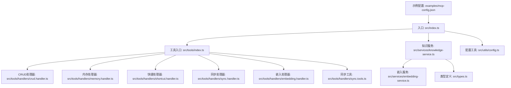
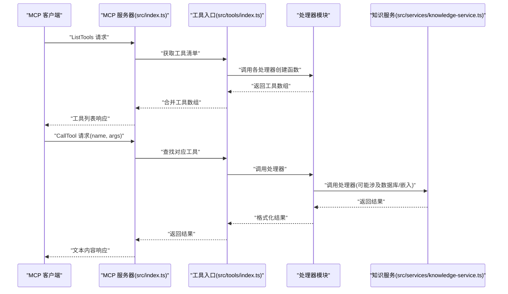
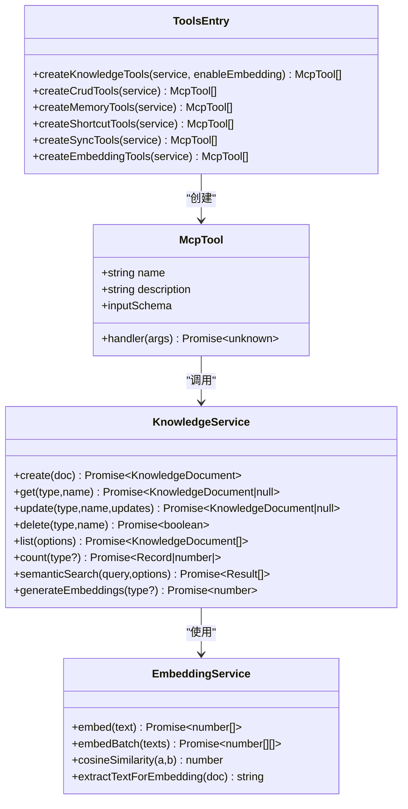
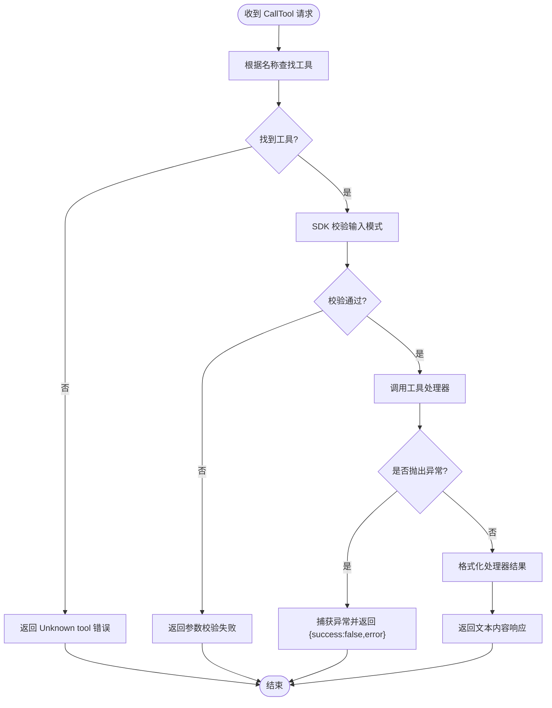
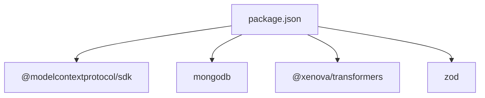

# 工具系统实现

<cite>
**本文引用的文件**
- [src/index.ts](file://src/index.ts)
- [src/tools/index.ts](file://src/tools/index.ts)
- [src/tools/types.ts](file://src/tools/types.ts)
- [src/tools/handlers/crud.handler.ts](file://src/tools/handlers/crud.handler.ts)
- [src/tools/handlers/memory.handler.ts](file://src/tools/handlers/memory.handler.ts)
- [src/tools/handlers/shortcut.handler.ts](file://src/tools/handlers/shortcut.handler.ts)
- [src/tools/handlers/sync.handler.ts](file://src/tools/handlers/sync.handler.ts)
- [src/tools/handlers/embedding.handler.ts](file://src/tools/handlers/embedding.handler.ts)
- [src/tools/handlers/sync.tools.ts](file://src/tools/handlers/sync.tools.ts)
- [src/services/knowledge-service.ts](file://src/services/knowledge-service.ts)
- [src/services/embedding-service.ts](file://src/services/embedding-service.ts)
- [src/utils/config.ts](file://src/utils/config.ts)
- [src/types.ts](file://src/types.ts)
- [package.json](file://package.json)
- [examples/mcp-config.json](file://examples/mcp-config.json)
</cite>

## 更新摘要
**变更内容**
- 重构工具系统架构，从单一知识工具文件迁移到模块化处理器架构
- 新增专门的工具入口文件和类型定义
- 按功能模块分离处理器，包括 CRUD、内存、快捷、同步和嵌入工具
- 增强同步工具功能，支持双向同步和冲突解决
- 改进工具注册机制和处理器分离设计

## 目录
1. [简介](#简介)
2. [项目结构](#项目结构)
3. [核心组件](#核心组件)
4. [架构总览](#架构总览)
5. [详细组件分析](#详细组件分析)
6. [依赖关系分析](#依赖关系分析)
7. [性能考虑](#性能考虑)
8. [故障排除指南](#故障排除指南)
9. [结论](#结论)
10. [附录](#附录)

## 简介
本文件面向 MCP 工具系统实现，聚焦于模块化处理器架构的重构，系统性阐述工具接口定义（名称、描述、输入模式与处理器函数）、工具分类体系（CRUD 工具、搜索工具、快捷工具、同步工具）、参数验证与错误处理策略，并提供自定义工具开发指南、性能优化与内存管理建议，以及工具使用的实际调用示例路径。

## 项目结构
该仓库采用模块化分层的组织方式：
- 入口与协议适配：src/index.ts 通过 MCP SDK 创建 stdio 服务器，注册工具并处理请求
- 工具系统重构：src/tools/ 目录包含工具入口、类型定义和按功能模块分离的处理器
- 业务服务：src/services/knowledge-service.ts 封装知识库 CRUD、统计、批量操作与语义搜索
- 嵌入服务：src/services/embedding-service.ts 提供文本向量化与相似度计算
- 配置与类型：src/utils/config.ts、src/types.ts 提供配置解析、校验与数据模型
- 示例配置：examples/mcp-config.json 展示不同 IDE 的 MCP 服务器配置

**图表来源**
- [src/index.ts](file://src/index.ts#L1-L148)
- [src/tools/index.ts](file://src/tools/index.ts#L1-L57)
- [src/tools/handlers/crud.handler.ts](file://src/tools/handlers/crud.handler.ts#L1-L403)
- [src/tools/handlers/memory.handler.ts](file://src/tools/handlers/memory.handler.ts#L1-L115)
- [src/tools/handlers/shortcut.handler.ts](file://src/tools/handlers/shortcut.handler.ts#L1-L288)
- [src/tools/handlers/sync.handler.ts](file://src/tools/handlers/sync.handler.ts#L1-L196)
- [src/tools/handlers/embedding.handler.ts](file://src/tools/handlers/embedding.handler.ts#L1-L99)
- [src/tools/handlers/sync.tools.ts](file://src/tools/handlers/sync.tools.ts#L1-L359)

**章节来源**
- [src/index.ts](file://src/index.ts#L1-L148)
- [package.json](file://package.json#L1-L48)

## 核心组件
- 工具接口与模块化架构
  - 工具接口包含名称、描述、输入模式（JSON Schema）与处理器函数
  - 工具入口文件统一导出工具创建函数和类型定义
  - 按功能模块分离处理器，支持独立使用和组合
- 知识服务
  - 提供 CRUD、统计、批量导入导出、语义搜索与嵌入生成功能
  - 以用户上下文隔离数据，支持跨设备同步
- 嵌入服务
  - 基于 Transformers.js 的文本向量化，支持懒加载与批量处理
- 配置与类型
  - 从环境变量加载与校验配置，提供日志工具
  - 定义 8 种知识文档类型及联合请求/查询模型

**章节来源**
- [src/tools/index.ts](file://src/tools/index.ts#L1-L57)
- [src/tools/types.ts](file://src/tools/types.ts#L1-L35)
- [src/services/knowledge-service.ts](file://src/services/knowledge-service.ts#L1-L437)
- [src/services/embedding-service.ts](file://src/services/embedding-service.ts#L1-L148)
- [src/utils/config.ts](file://src/utils/config.ts#L1-L147)
- [src/types.ts](file://src/types.ts#L1-L271)

## 架构总览
MCP 服务器通过 stdio 与客户端通信，入口负责：
- 加载并校验配置
- 连接数据库并创建知识服务实例
- 动态生成工具集合（按模块化处理器组合）
- 注册 ListTools 与 CallTool 请求处理器
- 处理异常与优雅退出

**图表来源**
- [src/index.ts](file://src/index.ts#L29-L79)
- [src/tools/index.ts](file://src/tools/index.ts#L23-L47)
- [src/tools/handlers/crud.handler.ts](file://src/tools/handlers/crud.handler.ts#L9-L403)

## 详细组件分析

### 模块化处理器架构
- 架构设计
  - 工具入口文件统一管理所有处理器模块
  - 每个处理器专注于特定功能域，提高代码可维护性
  - 支持按需启用嵌入功能，实现条件注入
- 处理器分离
  - CRUD 处理器：管理 8 种知识类型的完整生命周期
  - 内存处理器：快速记忆增删与检索
  - 快捷处理器：经验、命令、上下文、工作流等快捷操作
  - 同步处理器：MCP、规则、技能的同步管理
  - 嵌入处理器：语义搜索和向量生成
  - 同步工具：完整的双向同步、冲突解决和历史记录

**图表来源**
- [src/tools/index.ts](file://src/tools/index.ts#L23-L57)
- [src/tools/types.ts](file://src/tools/types.ts#L6-L15)
- [src/tools/handlers/crud.handler.ts](file://src/tools/handlers/crud.handler.ts#L9-L403)
- [src/tools/handlers/memory.handler.ts](file://src/tools/handlers/memory.handler.ts#L7-L115)
- [src/tools/handlers/shortcut.handler.ts](file://src/tools/handlers/shortcut.handler.ts#L7-L288)
- [src/tools/handlers/sync.handler.ts](file://src/tools/handlers/sync.handler.ts#L7-L196)
- [src/tools/handlers/embedding.handler.ts](file://src/tools/handlers/embedding.handler.ts#L9-L99)

**章节来源**
- [src/tools/index.ts](file://src/tools/index.ts#L1-L57)
- [src/tools/types.ts](file://src/tools/types.ts#L1-L35)

### 工具分类体系
- CRUD 工具（增强版）
  - knowledge_create：创建知识文档（支持 8 种类型）
  - knowledge_read：按类型与名称读取
  - knowledge_update：按类型与名称更新
  - knowledge_delete：按类型与名称删除
  - knowledge_list：按类型/标签/启用状态/关键词等筛选
  - knowledge_stats：统计各类型数量
  - knowledge_upsert：存在则更新，否则创建
  - knowledge_export：批量导出
- 快捷工具（扩展版）
  - memory_add/memory_search：记忆增删与检索
  - experience_add：经验记录
  - command_add：命令模板
  - context_set：上下文设置
  - workflow_create：创建工作流
  - get_user_info：查看当前用户与设备上下文
- 同步工具（全新实现）
  - mcp_sync/rule_sync/skill_sync：同步各类知识到数据库
  - sync_from_ide/sync_to_ide/sync_bidirectional：IDE 间双向同步
  - sync_status/detect_ides：同步状态管理和 IDE 检测
  - list_conflicts/resolve_conflict：冲突检测与解决
  - sync_history：同步历史记录查看
- 搜索工具（条件注入）
  - semantic_search：基于向量相似度的语义搜索
  - generate_embeddings：为文档生成嵌入以支持语义搜索

**章节来源**
- [src/tools/handlers/crud.handler.ts](file://src/tools/handlers/crud.handler.ts#L1-L403)
- [src/tools/handlers/memory.handler.ts](file://src/tools/handlers/memory.handler.ts#L1-L115)
- [src/tools/handlers/shortcut.handler.ts](file://src/tools/handlers/shortcut.handler.ts#L1-L288)
- [src/tools/handlers/sync.handler.ts](file://src/tools/handlers/sync.handler.ts#L1-L196)
- [src/tools/handlers/sync.tools.ts](file://src/tools/handlers/sync.tools.ts#L1-L359)
- [src/tools/handlers/embedding.handler.ts](file://src/tools/handlers/embedding.handler.ts#L1-L99)

### 参数验证与错误处理策略
- 输入模式验证
  - 工具 inputSchema 使用 JSON Schema 定义字段类型、枚举与必填项
  - 调用时由 MCP SDK 进行基础校验
- 业务层错误处理
  - 工具处理器内部捕获异常并返回标准化结果对象（success/error/message/data）
  - 数据库重复键错误（如名称冲突）转换为友好提示
  - 同步工具返回详细的同步状态和错误信息
- 服务器层错误处理
  - Unknown tool 返回标准错误内容
  - 未知异常序列化为文本内容，包含错误消息

**图表来源**
- [src/index.ts](file://src/index.ts#L41-L79)
- [src/tools/handlers/crud.handler.ts](file://src/tools/handlers/crud.handler.ts#L47-L81)

**章节来源**
- [src/index.ts](file://src/index.ts#L41-L79)
- [src/tools/handlers/crud.handler.ts](file://src/tools/handlers/crud.handler.ts#L47-L81)

### 自定义工具开发指南
- 实现模板
  - 定义工具对象：包含 name、description、inputSchema、handler
  - 在对应的处理器文件中实现 createXxxTools 函数
  - 注册到工具入口文件的 createKnowledgeTools 函数中
  - 如需访问数据库，注入知识服务实例；如需向量能力，使用嵌入服务
- 最佳实践
  - inputSchema 明确字段类型、枚举与必填项
  - 处理器内对异常进行捕获并返回结构化结果
  - 对外部依赖（数据库、模型）进行必要初始化与资源释放
  - 保持处理器幂等与可重试性
  - 遵循模块化设计原则，按功能域分离处理器
- 示例参考
  - CRUD 工具：knowledge_create/knowledge_read 等
  - 快捷工具：memory_add/command_add 等
  - 同步工具：sync_from_ide/sync_to_ide 等
  - 搜索工具：semantic_search/generate_embeddings 等

**章节来源**
- [src/tools/index.ts](file://src/tools/index.ts#L23-L57)
- [src/tools/handlers/crud.handler.ts](file://src/tools/handlers/crud.handler.ts#L9-L403)
- [src/tools/handlers/memory.handler.ts](file://src/tools/handlers/memory.handler.ts#L7-L115)
- [src/tools/handlers/shortcut.handler.ts](file://src/tools/handlers/shortcut.handler.ts#L7-L288)
- [src/tools/handlers/sync.handler.ts](file://src/tools/handlers/sync.handler.ts#L7-L196)
- [src/tools/handlers/embedding.handler.ts](file://src/tools/handlers/embedding.handler.ts#L9-L99)

### 工具使用示例
以下为典型调用流程与示例路径（不直接展示代码内容）：
- 列出工具
  - 请求：ListTools
  - 响应：工具清单（名称、描述、输入模式）
  - 示例路径：[src/index.ts](file://src/index.ts#L29-L38)
- 调用工具
  - 请求：CallTool（name, arguments）
  - 响应：文本内容（JSON 序列化结果）
  - 示例路径：[src/index.ts](file://src/index.ts#L41-L79)
- CRUD 工具示例
  - 创建文档：knowledge_create（type, name, content, description, tags, enabled）
  - 示例路径：[src/tools/handlers/crud.handler.ts](file://src/tools/handlers/crud.handler.ts#L11-L82)
  - 读取文档：knowledge_read（type, name）
  - 示例路径：[src/tools/handlers/crud.handler.ts](file://src/tools/handlers/crud.handler.ts#L84-L129)
- 快捷工具示例
  - 添加记忆：memory_add（name, content, category, importance, tags）
  - 示例路径：[src/tools/handlers/memory.handler.ts](file://src/tools/handlers/memory.handler.ts#L10-L65)
  - 搜索记忆：memory_search（keyword, category, limit）
  - 示例路径：[src/tools/handlers/memory.handler.ts](file://src/tools/handlers/memory.handler.ts#L68-L111)
- 同步工具示例
  - 从 IDE 同步：sync_from_ide（ideSource, configPath）
  - 示例路径：[src/tools/handlers/sync.tools.ts](file://src/tools/handlers/sync.tools.ts#L21-L57)
  - 双向同步：sync_bidirectional（ideSource, configPath）
  - 示例路径：[src/tools/handlers/sync.tools.ts](file://src/tools/handlers/sync.tools.ts#L107-L143)
- 搜索工具示例
  - 语义搜索：semantic_search（query, type, limit, threshold）
  - 示例路径：[src/tools/handlers/embedding.handler.ts](file://src/tools/handlers/embedding.handler.ts#L11-L64)
  - 生成嵌入：generate_embeddings（type）
  - 示例路径：[src/tools/handlers/embedding.handler.ts](file://src/tools/handlers/embedding.handler.ts#L67-L95)

**章节来源**
- [src/index.ts](file://src/index.ts#L29-L79)
- [src/tools/handlers/crud.handler.ts](file://src/tools/handlers/crud.handler.ts#L11-L129)
- [src/tools/handlers/memory.handler.ts](file://src/tools/handlers/memory.handler.ts#L10-L111)
- [src/tools/handlers/sync.tools.ts](file://src/tools/handlers/sync.tools.ts#L21-L143)
- [src/tools/handlers/embedding.handler.ts](file://src/tools/handlers/embedding.handler.ts#L11-L95)

## 依赖关系分析
- 运行时依赖
  - @modelcontextprotocol/sdk：MCP 协议与传输适配
  - mongodb：数据库驱动
  - @xenova/transformers：文本向量化
  - zod：类型校验（在本项目中未直接使用，但可作为扩展）
- 开发依赖
  - TypeScript、ESLint、tsx 等

**图表来源**
- [package.json](file://package.json#L30-L43)

**章节来源**
- [package.json](file://package.json#L1-L48)

## 性能考虑
- 数据库索引
  - 用户级唯一索引（type+name），用户+类型/设备/标签/时间排序索引，提升查询与排序效率
  - 新增复合索引：用户+类型+启用状态+时间、标签+启用状态、同步状态查询
- 查询优化
  - 列表查询支持分页（limit/offset）与多维过滤（type/tags/enabled/search）
  - 语义搜索仅对具备 embedding 的文档进行相似度计算
  - 同步工具支持增量同步和冲突检测
- 向量化性能
  - 模型懒加载，首次初始化耗时集中在第一次调用
  - 批量生成嵌入时逐条更新，适合后台任务
- 内存管理
  - 嵌入服务为单例，避免重复初始化
  - 处理器返回结果序列化为文本，减少大对象传递
  - 服务器优雅退出时断开数据库连接
  - 模块化架构支持按需加载处理器，减少内存占用

**章节来源**
- [src/services/knowledge-service.ts](file://src/services/knowledge-service.ts#L71-L118)
- [src/services/knowledge-service.ts](file://src/services/knowledge-service.ts#L188-L216)
- [src/services/knowledge-service.ts](file://src/services/knowledge-service.ts#L272-L299)
- [src/services/embedding-service.ts](file://src/services/embedding-service.ts#L24-L51)
- [src/index.ts](file://src/index.ts#L133-L140)

## 故障排除指南
- 配置问题
  - 确认 MONGO_URI/MONGO_DATABASE/MONGO_COLLECTION 等环境变量
  - 使用 validateConfig 校验配置有效性
  - 示例配置参考：[examples/mcp-config.json](file://examples/mcp-config.json#L1-L94)
- 数据库连接
  - 确认 MongoDB 可达且集合存在
  - 查看连接与索引创建日志
- 工具调用失败
  - 检查工具名称是否正确
  - 核对输入参数是否满足 inputSchema
  - 查看处理器返回的错误信息（success=false/error）
- 同步问题
  - 检查 IDE 来源配置和可用性
  - 查看同步状态和冲突记录
  - 确认网络连接和权限设置

**章节来源**
- [src/utils/config.ts](file://src/utils/config.ts#L96-L115)
- [src/index.ts](file://src/index.ts#L87-L98)
- [src/index.ts](file://src/index.ts#L41-L79)
- [src/tools/handlers/sync.tools.ts](file://src/tools/handlers/sync.tools.ts#L176-L213)

## 结论
本工具系统通过模块化处理器架构重构，实现了从单一知识工具文件到功能分离的现代化设计。新的架构通过清晰的工具接口与工厂化注册机制，结合知识服务与嵌入服务，实现了从基础 CRUD 到语义搜索、从快捷操作到完整同步的完整能力矩阵。系统具备良好的扩展性与可维护性，支持按需启用嵌入功能和复杂的同步场景，适合在多 IDE 场景下提供一致的知识库管理体验。建议在生产环境中开启嵌入功能并配合后台任务批量生成向量，同时利用模块化架构的优势进行功能扩展和性能优化。

## 附录
- 知识类型与文档模型
  - 8 种知识类型：Memories、Skills、Rules、MCPs、Experiences、Commands、Contexts、Workflows
  - 统一的用户上下文与同步版本字段
- 配置项说明
  - 支持从 MCP 客户端传入的 env 与系统环境变量加载
  - 日志级别控制与 IDE 来源识别
  - 嵌入功能开关控制

**章节来源**
- [src/types.ts](file://src/types.ts#L6-L74)
- [src/utils/config.ts](file://src/utils/config.ts#L76-L91)
- [src/tools/types.ts](file://src/tools/types.ts#L18-L23)