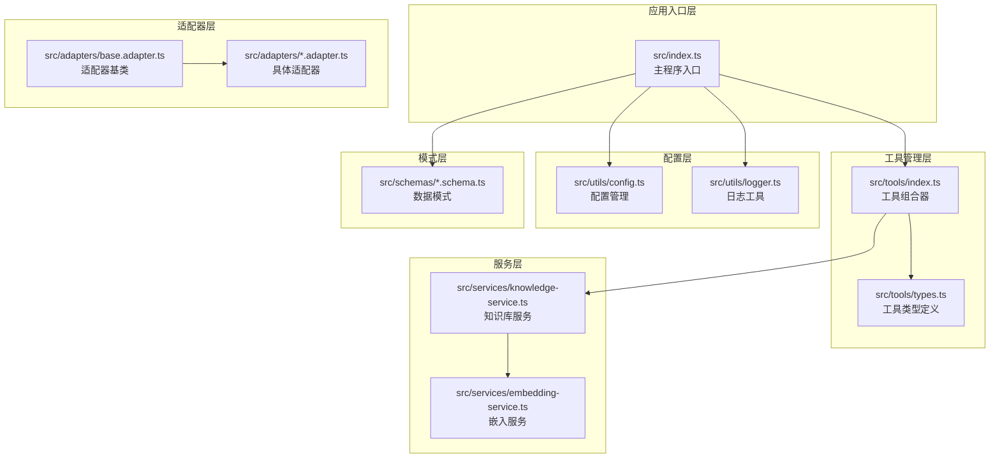
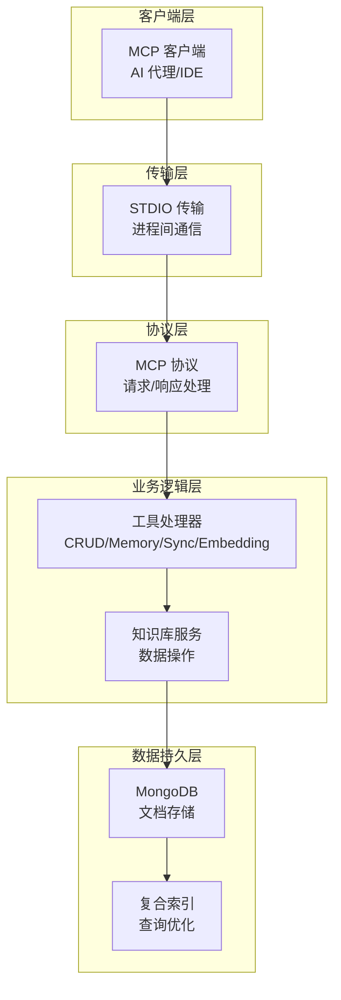
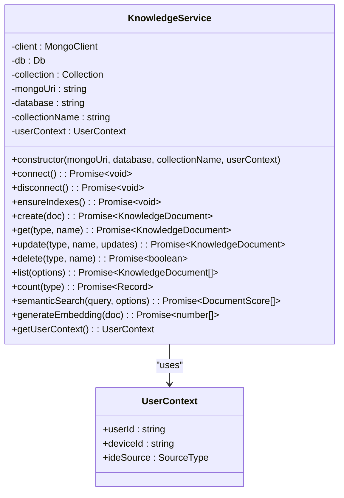
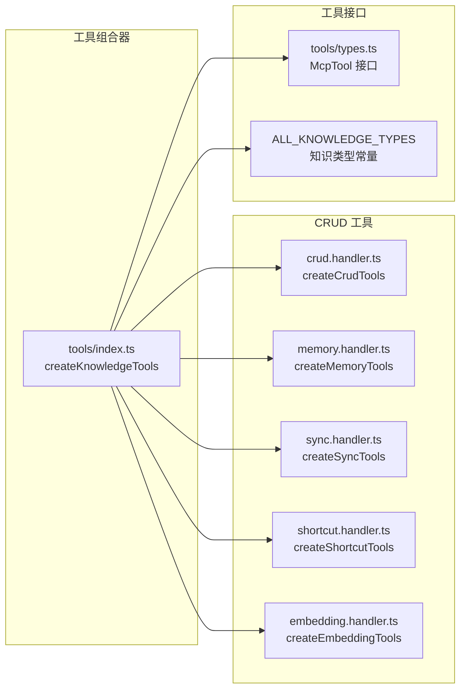
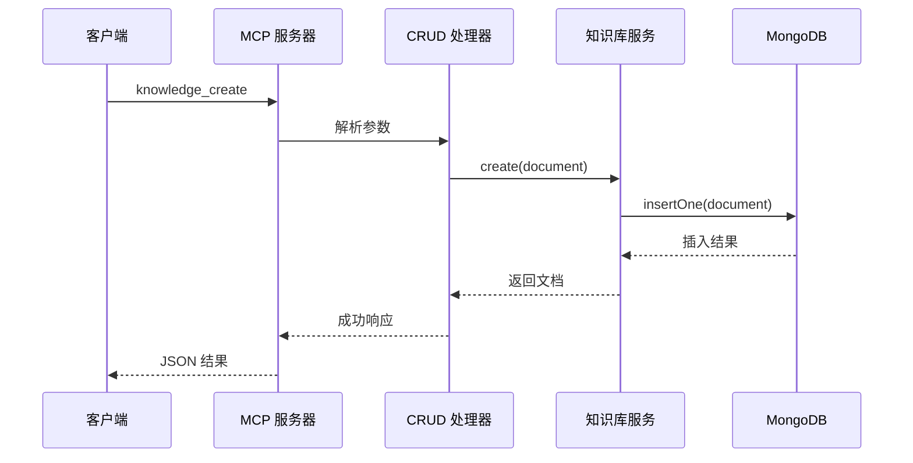
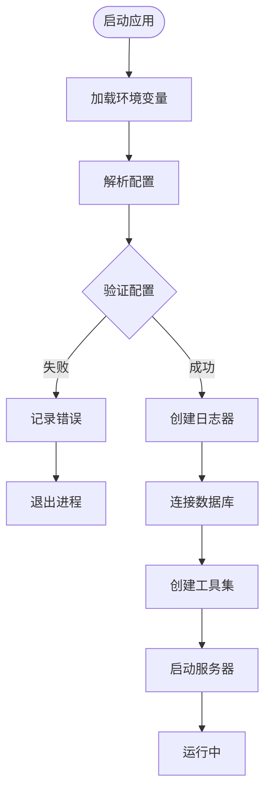
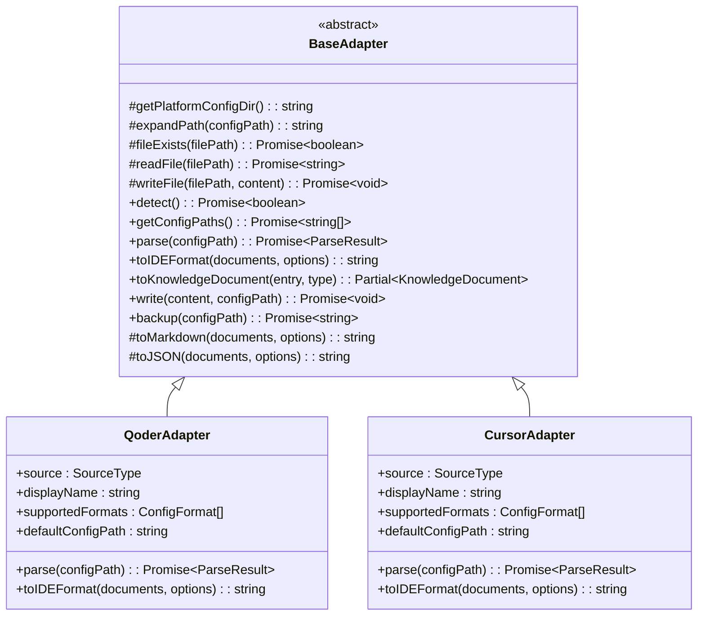

# 模块化工具处理器

<cite>
**本文档引用的文件**
- [src/index.ts](file://src/index.ts)
- [src/tools/index.ts](file://src/tools/index.ts)
- [src/services/knowledge-service.ts](file://src/services/knowledge-service.ts)
- [src/utils/config.ts](file://src/utils/config.ts)
- [src/adapters/base.adapter.ts](file://src/adapters/base.adapter.ts)
- [src/schemas/common.schema.ts](file://src/schemas/common.schema.ts)
- [src/tools/types.ts](file://src/tools/types.ts)
- [src/tools/handlers/crud.handler.ts](file://src/tools/handlers/crud.handler.ts)
- [src/tools/handlers/memory.handler.ts](file://src/tools/handlers/memory.handler.ts)
- [src/tools/handlers/sync.handler.ts](file://src/tools/handlers/sync.handler.ts)
- [examples/mcp-config.json](file://examples/mcp-config.json)
- [package.json](file://package.json)
</cite>

## 目录
1. [简介](#简介)
2. [项目结构](#项目结构)
3. [核心组件](#核心组件)
4. [架构概览](#架构概览)
5. [详细组件分析](#详细组件分析)
6. [依赖关系分析](#依赖关系分析)
7. [性能考虑](#性能考虑)
8. [故障排除指南](#故障排除指南)
9. [结论](#结论)

## 简介

模块化工具处理器（Mongo-MCP）是一个基于 Model Context Protocol (MCP) 的跨 IDE 知识库管理工具系统。该系统允许开发者在不同的集成开发环境（IDE）中统一管理知识库，包括记忆、技能、规则、MCP、经验、命令、上下文和工作流等多种知识类型。

该系统采用模块化设计，支持 MongoDB 数据存储，提供完整的 CRUD 操作、语义搜索、跨设备同步等功能。通过标准化的工具接口，为 AI 代理提供一致的知识访问体验。

## 项目结构

项目采用清晰的模块化组织结构，主要分为以下几个核心层次：



**图表来源**
- [src/index.ts](file://src/index.ts#L1-L148)
- [src/tools/index.ts](file://src/tools/index.ts#L1-L57)
- [src/services/knowledge-service.ts](file://src/services/knowledge-service.ts#L1-L437)

**章节来源**
- [src/index.ts](file://src/index.ts#L1-L148)
- [src/tools/index.ts](file://src/tools/index.ts#L1-L57)
- [src/services/knowledge-service.ts](file://src/services/knowledge-service.ts#L1-L437)

## 核心组件

### 主要技术栈

系统基于以下核心技术构建：

- **Model Context Protocol (MCP)**: 标准化的协议实现
- **MongoDB**: NoSQL 数据库存储
- **TypeScript**: 类型安全的开发语言
- **Zod**: 数据验证和类型检查
- **Node.js**: 运行时环境

### 核心特性

1. **多知识类型支持**: Memories, Skills, Rules, MCPs, Experiences, Commands, Contexts, Workflows
2. **跨 IDE 兼容**: 支持 Qoder, Cursor, VS Code, Trae 等多种 IDE
3. **智能同步**: 基于用户标识和设备标识的跨设备同步
4. **语义搜索**: 基于向量嵌入的智能搜索功能
5. **模块化架构**: 可扩展的工具处理器设计

**章节来源**
- [package.json](file://package.json#L30-L35)
- [src/types/index.ts](file://src/types/index.ts#L1-L7)

## 架构概览

系统采用分层架构设计，确保关注点分离和模块间的低耦合：



**图表来源**
- [src/index.ts](file://src/index.ts#L16-L82)
- [src/services/knowledge-service.ts](file://src/services/knowledge-service.ts#L44-L119)

## 详细组件分析

### 知识库服务 (KnowledgeService)

知识库服务是系统的核心数据访问层，负责管理所有知识类型的 CRUD 操作和高级功能。



**图表来源**
- [src/services/knowledge-service.ts](file://src/services/knowledge-service.ts#L20-L437)

#### 数据模型设计

系统支持八种知识类型，每种类型都有特定的数据结构和用途：

| 知识类型 | 描述 | 主要用途 |
|---------|------|----------|
| Memories | 个人记忆和偏好 | 用户偏好、历史记录、个人知识 |
| Skills | 技能和能力 | 编程技能、工作流程、专业能力 |
| Rules | 业务规则 | 企业规则、约束条件、决策逻辑 |
| MCPs | 模型上下文协议 | 外部工具和服务集成 |
| Experiences | 经验和洞察 | 项目经验、最佳实践、学习总结 |
| Commands | 命令和快捷方式 | 快速执行、自动化任务 |
| Contexts | 上下文信息 | 会话上下文、环境信息 |
| Workflows | 工作流程 | 业务流程、操作步骤 |

**章节来源**
- [src/services/knowledge-service.ts](file://src/services/knowledge-service.ts#L15-L437)

### 工具处理器架构

系统采用模块化的工具处理器设计，每个处理器负责特定的功能领域：



**图表来源**
- [src/tools/index.ts](file://src/tools/index.ts#L23-L47)
- [src/tools/types.ts](file://src/tools/types.ts#L6-L35)

#### CRUD 工具集

CRUD 工具提供了完整的内容生命周期管理：



**图表来源**
- [src/tools/handlers/crud.handler.ts](file://src/tools/handlers/crud.handler.ts#L47-L82)
- [src/services/knowledge-service.ts](file://src/services/knowledge-service.ts#L143-L160)

**章节来源**
- [src/tools/handlers/crud.handler.ts](file://src/tools/handlers/crud.handler.ts#L1-L403)

### 配置管理系统

系统采用灵活的配置管理机制，支持多层级配置优先级：



**图表来源**
- [src/utils/config.ts](file://src/utils/config.ts#L76-L91)
- [src/index.ts](file://src/index.ts#L87-L145)

**章节来源**
- [src/utils/config.ts](file://src/utils/config.ts#L1-L147)

### 适配器系统

适配器系统提供了与不同 IDE 和外部系统的集成能力：



**图表来源**
- [src/adapters/base.adapter.ts](file://src/adapters/base.adapter.ts#L11-L255)

**章节来源**
- [src/adapters/base.adapter.ts](file://src/adapters/base.adapter.ts#L1-L255)

## 依赖关系分析

系统依赖关系清晰，遵循单一职责原则：

```mermaid
graph TB
subgraph "核心依赖"
MCP[@modelcontextprotocol/sdk<br/>MCP 协议实现]
MongoDB[mongodb<br/>MongoDB 驱动]
Zod[zod<br/>数据验证]
end
subgraph "开发依赖"
TypeScript[typescript<br/>类型定义]
ESLint[eslint<br/>代码检查]
TSX[tsx<br/>开发工具]
end
subgraph "运行时依赖"
Transformers[@xenova/transformers<br/>AI 模型]
end
src_index_ts[src/index.ts] --> MCP
src_index_ts --> MongoDB
src_tools_index_ts[src/tools/index.ts] --> src_services_knowledge_service_ts
src_services_knowledge_service_ts --> MongoDB
src_utils_config_ts --> Zod
src_adapters_base_adapter_ts --> src_types_index_ts
src_schemas_common_schema_ts --> Zod
```

**图表来源**
- [package.json](file://package.json#L30-L43)
- [src/index.ts](file://src/index.ts#L3-L11)

**章节来源**
- [package.json](file://package.json#L1-L48)

## 性能考虑

### 数据库优化策略

系统实现了多层次的数据库优化策略：

1. **复合索引设计**:
   - 用户级唯一索引: `(userId, type, name)`
   - 查询优化索引: `(userId, type)`, `(userId, deviceId)`
   - 搜索优化索引: `(userId, tags, enabled)`

2. **文本搜索优化**:
   - 文本索引权重分配: `name: 10`, `description: 5`
   - 支持大小写不敏感搜索

3. **内存管理**:
   - 连接池管理
   - 异步操作避免阻塞
   - 及时资源清理

### 并发处理

系统支持高并发场景下的稳定运行：

- **连接复用**: 单例模式管理 MongoDB 连接
- **异步处理**: 所有数据库操作均为异步
- **错误恢复**: 自动重连机制
- **资源监控**: 内存使用监控

## 故障排除指南

### 常见问题诊断

#### 数据库连接问题

**症状**: 启动时出现连接错误

**解决方案**:
1. 检查 `MONGO_URI` 环境变量配置
2. 验证 MongoDB 服务状态
3. 确认网络连接正常
4. 检查防火墙设置

#### 配置验证失败

**症状**: 应用启动立即退出

**解决方案**:
1. 检查必需配置项 (`MONGO_URI`, `MONGO_DATABASE`, `MONGO_COLLECTION`)
2. 验证配置格式正确性
3. 确认环境变量优先级设置

#### 工具调用错误

**症状**: 工具执行失败但无明确错误信息

**解决方案**:
1. 查看详细日志输出
2. 检查工具输入参数格式
3. 验证知识库服务状态
4. 确认 MongoDB 权限设置

**章节来源**
- [src/utils/config.ts](file://src/utils/config.ts#L96-L115)
- [src/index.ts](file://src/index.ts#L141-L144)

### 调试技巧

1. **日志级别调整**: 通过 `LOG_LEVEL` 环境变量控制日志详细程度
2. **配置验证**: 使用 `validateConfig` 函数检查配置有效性
3. **数据库监控**: 监控 MongoDB 连接状态和查询性能
4. **工具测试**: 单独测试各个工具处理器的功能

## 结论

模块化工具处理器是一个设计精良的跨 IDE 知识库管理解决方案。其核心优势包括：

1. **模块化设计**: 清晰的分层架构和职责分离
2. **扩展性强**: 易于添加新的工具处理器和知识类型
3. **兼容性好**: 支持多种 IDE 和外部系统集成
4. **性能优化**: 针对数据库操作的全面优化策略
5. **可靠性高**: 完善的错误处理和恢复机制

该系统为 AI 代理提供了强大的知识管理能力，通过标准化的接口实现了知识的持久化、检索和同步。未来可以进一步增强的功能包括分布式部署、缓存机制、监控告警等。