# 服务器架构设计

<cite>
**本文引用的文件**
- [src/index.ts](file://src/index.ts)
- [src/utils/config.ts](file://src/utils/config.ts)
- [src/types.ts](file://src/types.ts)
- [src/services/knowledge-service.ts](file://src/services/knowledge-service.ts)
- [src/services/embedding-service.ts](file://src/services/embedding-service.ts)
- [src/tools/knowledge-tools.ts](file://src/tools/knowledge-tools.ts)
- [package.json](file://package.json)
- [examples/mcp-config.json](file://examples/mcp-config.json)
</cite>

## 目录
1. [简介](#简介)
2. [项目结构](#项目结构)
3. [核心组件](#核心组件)
4. [架构总览](#架构总览)
5. [详细组件分析](#详细组件分析)
6. [依赖关系分析](#依赖关系分析)
7. [性能考虑](#性能考虑)
8. [故障排查指南](#故障排查指南)
9. [结论](#结论)
10. [附录](#附录)

## 简介
本文件面向 MCP 服务器架构设计，围绕 MongoDB 知识库管理的 Node/TypeScript 实现进行系统化技术文档化。重点覆盖以下主题：
- 服务器初始化流程：配置加载、日志系统、数据库连接
- stdio 传输模式的实现原理与优势
- 服务器生命周期管理：启动、运行、优雅关闭
- 请求处理管道：请求验证、路由分发、响应生成
- 服务器配置选项：性能调优与安全设置
- 错误处理策略与监控机制

该服务器基于 MCP SDK，提供工具注册与调用能力，并通过 MongoDB 存储“记忆、技能、规则、MCP、经验、命令、上下文、工作流”等知识类型，支持可选的向量嵌入与语义检索。

## 项目结构
仓库采用按职责分层的模块化组织：
- 入口与生命周期控制：src/index.ts
- 配置与日志：src/utils/config.ts
- 类型定义：src/types.ts
- 知识库服务：src/services/knowledge-service.ts
- 嵌入服务：src/services/embedding-service.ts
- 工具集合：src/tools/knowledge-tools.ts
- 示例配置：examples/mcp-config.json
- 包与引擎配置：package.json

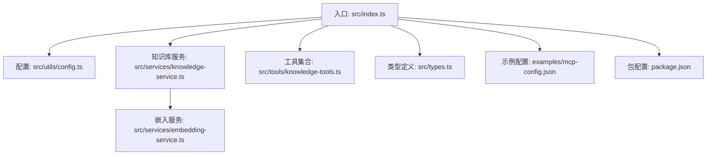

图表来源
- [src/index.ts](file://src/index.ts#L1-L148)
- [src/utils/config.ts](file://src/utils/config.ts#L1-L147)
- [src/services/knowledge-service.ts](file://src/services/knowledge-service.ts#L1-L404)
- [src/services/embedding-service.ts](file://src/services/embedding-service.ts#L1-L148)
- [src/tools/knowledge-tools.ts](file://src/tools/knowledge-tools.ts#L1-L1093)
- [src/types.ts](file://src/types.ts#L1-L269)
- [examples/mcp-config.json](file://examples/mcp-config.json#L1-L94)
- [package.json](file://package.json#L1-L48)

章节来源
- [src/index.ts](file://src/index.ts#L1-L148)
- [package.json](file://package.json#L1-L48)

## 核心组件
- 服务器初始化与生命周期：负责加载配置、创建日志、连接数据库、注册工具、启动 stdio 传输、处理信号进行优雅关闭
- 配置与日志：解析环境变量、校验配置、按级别输出日志
- 知识库服务：封装 MongoDB 连接、索引、CRUD、批量操作、统计、语义检索与嵌入生成
- 嵌入服务：基于 Transformers.js 的文本向量化与相似度计算
- 工具集合：提供知识库管理工具（CRUD、统计、快捷工具等），统一输入校验与响应格式
- 类型系统：定义知识文档类型、字段与查询选项

章节来源
- [src/index.ts](file://src/index.ts#L87-L145)
- [src/utils/config.ts](file://src/utils/config.ts#L76-L146)
- [src/services/knowledge-service.ts](file://src/services/knowledge-service.ts#L20-L403)
- [src/services/embedding-service.ts](file://src/services/embedding-service.ts#L11-L147)
- [src/tools/knowledge-tools.ts](file://src/tools/knowledge-tools.ts#L29-L1093)
- [src/types.ts](file://src/types.ts#L1-L269)

## 架构总览
整体架构以“入口控制器”为中心，向上依赖配置与日志，向下连接数据库与嵌入服务，向外通过 MCP SDK 的 stdio 传输暴露工具接口。

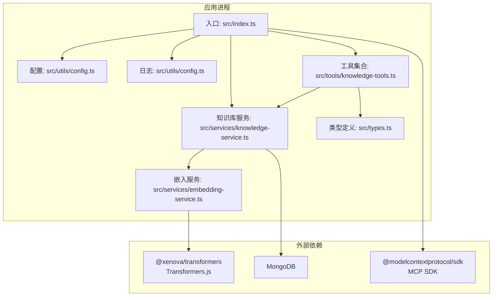

图表来源
- [src/index.ts](file://src/index.ts#L1-L148)
- [src/utils/config.ts](file://src/utils/config.ts#L1-L147)
- [src/services/knowledge-service.ts](file://src/services/knowledge-service.ts#L1-L404)
- [src/services/embedding-service.ts](file://src/services/embedding-service.ts#L1-L148)
- [src/tools/knowledge-tools.ts](file://src/tools/knowledge-tools.ts#L1-L1093)
- [src/types.ts](file://src/types.ts#L1-L269)

## 详细组件分析

### 服务器初始化与生命周期
- 初始化流程
  - 加载配置：从环境变量解析并生成默认值
  - 创建日志：根据配置的日志级别输出
  - 校验配置：确保数据库连接等关键字段有效
  - 连接数据库：建立 MongoDB 连接并创建必要索引
  - 注册工具：创建工具集合并注册到 MCP 服务器
  - 启动传输：创建 stdio 传输并连接服务器
  - 信号监听：捕获 SIGINT/SIGTERM，优雅断开数据库连接并退出
- 生命周期要点
  - 异常兜底：任何阶段失败均记录错误并退出
  - 优雅关闭：断开数据库连接，确保资源释放

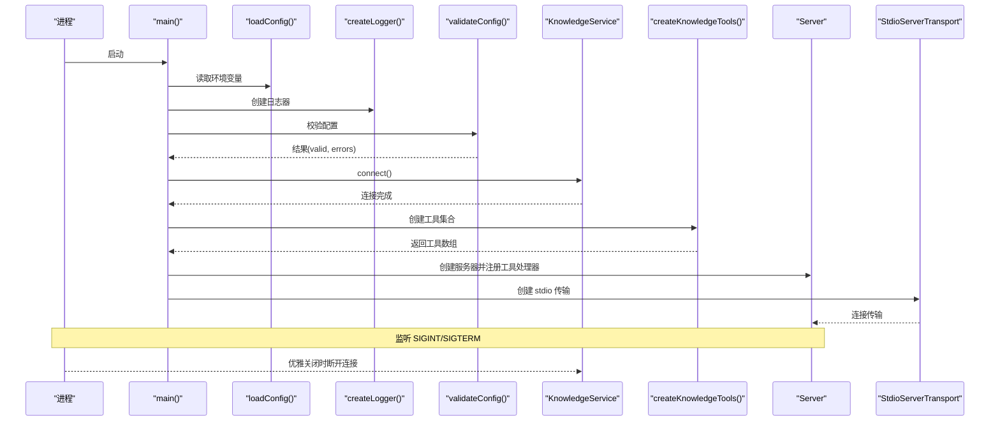

图表来源
- [src/index.ts](file://src/index.ts#L87-L145)
- [src/utils/config.ts](file://src/utils/config.ts#L76-L146)
- [src/services/knowledge-service.ts](file://src/services/knowledge-service.ts#L44-L66)

章节来源
- [src/index.ts](file://src/index.ts#L87-L145)

### 配置加载与日志系统
- 配置加载
  - 优先级：MCP 客户端传入 env > 系统环境变量 > 默认值
  - 关键字段：MongoDB 连接串、数据库名、集合名、用户/设备/IDE 来源、是否启用嵌入、日志级别
  - 默认设备 ID：由 IDE 来源与主机名组合生成
- 配置校验
  - 必填项：MongoURI、数据库名、集合名
- 日志系统
  - 四级日志：debug/info/warn/error
  - 按配置级别输出，避免冗余

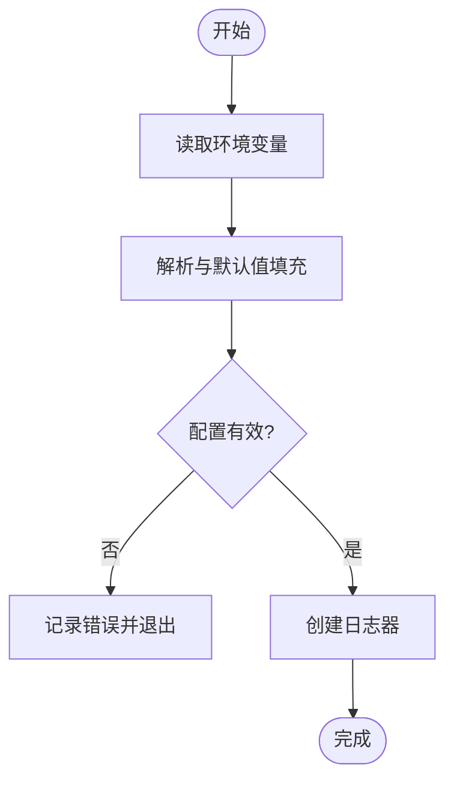

图表来源
- [src/utils/config.ts](file://src/utils/config.ts#L76-L115)
- [src/utils/config.ts](file://src/utils/config.ts#L120-L146)

章节来源
- [src/utils/config.ts](file://src/utils/config.ts#L76-L146)

### 数据库连接与索引
- 连接管理
  - 单例客户端：避免重复连接
  - 成功后绑定数据库与集合
- 索引策略
  - 用户级唯一索引：userId + type + name
  - 查询优化索引：userId + type、userId + deviceId、userId + tags、userId + updatedAt
- 用户上下文注入
  - 自动为写入文档注入 userId/deviceId/ideSource/syncVersion 等字段

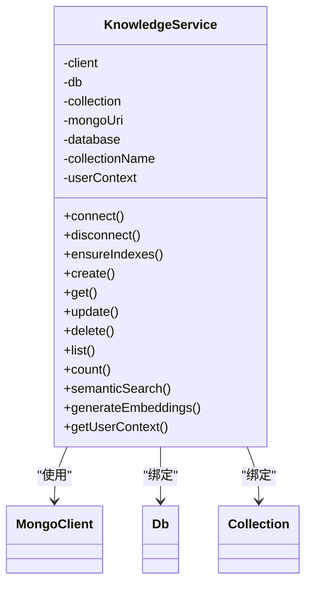

图表来源
- [src/services/knowledge-service.ts](file://src/services/knowledge-service.ts#L20-L87)

章节来源
- [src/services/knowledge-service.ts](file://src/services/knowledge-service.ts#L44-L87)

### stdio 传输模式
- 实现原理
  - 使用 MCP SDK 的 StdioServerTransport，通过标准输入/输出与 MCP 客户端通信
  - 服务器在启动时创建传输并连接，随后进入事件循环等待请求
- 优势
  - 跨平台兼容：无需额外网络栈
  - 易于调试：直接在终端查看日志与交互
  - 低耦合：与 IDE 或 MCP 客户端解耦，便于集成
- 与 HTTP 传输对比
  - HTTP 传输适合远程部署与多会话管理；stdio 更适合本地开发与轻量集成

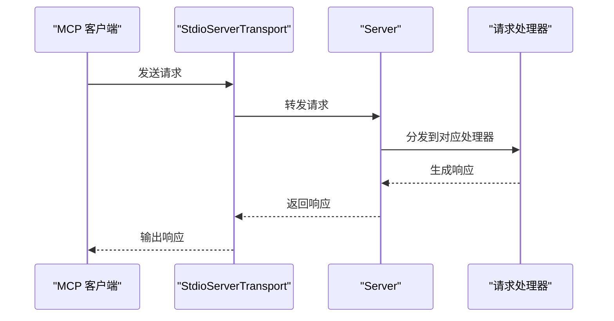

图表来源
- [src/index.ts](file://src/index.ts#L126-L128)

章节来源
- [src/index.ts](file://src/index.ts#L126-L128)

### 请求处理管道
- 请求验证
  - 工具注册时定义输入 Schema（此处为工具集合的输入结构）
  - 工具处理器内部对参数进行业务校验与异常捕获
- 路由分发
  - 服务器注册两类请求处理器：列出工具、调用工具
  - 调用工具时根据名称匹配工具并执行
- 响应生成
  - 成功：将结果序列化为文本内容返回
  - 失败：返回包含错误信息的文本内容

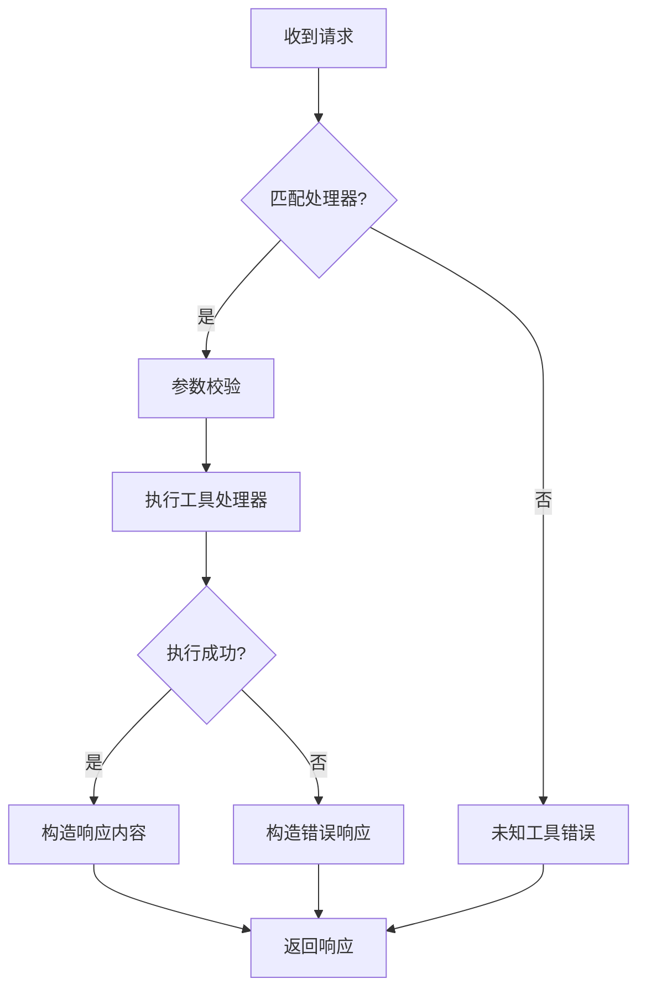

图表来源
- [src/index.ts](file://src/index.ts#L29-L79)

章节来源
- [src/index.ts](file://src/index.ts#L29-L79)

### 工具集合与知识库管理
- 工具类型
  - 通用 CRUD：创建、读取、更新、删除、列出、统计、upsert
  - 快捷工具：记忆、经验、命令、上下文、MCP 同步、规则同步等
- 输入校验
  - 使用工具定义的 inputSchema，保证参数合法性
- 响应格式
  - 统一返回 success/data/message/error 字段，便于客户端消费

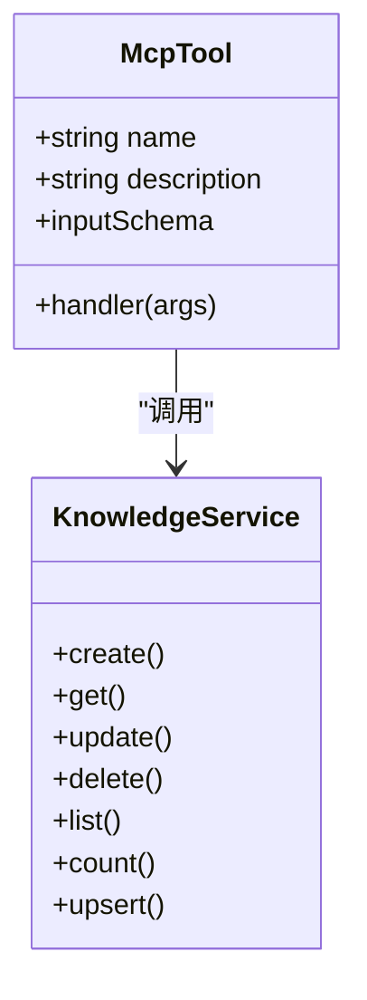

图表来源
- [src/tools/knowledge-tools.ts](file://src/tools/knowledge-tools.ts#L7-L16)
- [src/tools/knowledge-tools.ts](file://src/tools/knowledge-tools.ts#L29-L1093)
- [src/services/knowledge-service.ts](file://src/services/knowledge-service.ts#L111-L190)

章节来源
- [src/tools/knowledge-tools.ts](file://src/tools/knowledge-tools.ts#L29-L1093)
- [src/services/knowledge-service.ts](file://src/services/knowledge-service.ts#L111-L190)

### 嵌入服务与语义检索
- 模型加载
  - 懒加载：首次使用时初始化 Transformers.js 特征提取器
  - 线程与缓存：禁用本地模型与浏览器缓存，限制 WASM 线程数
- 向量生成
  - 支持单条与批量嵌入
  - 余弦相似度计算
- 文本提取
  - 从文档中抽取 name/description/content/tags 等字段拼接文本
- 语义检索
  - 生成查询向量，过滤已嵌入文档，计算相似度并排序

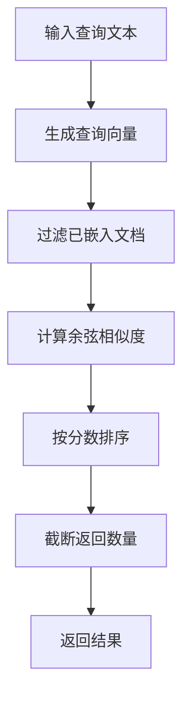

图表来源
- [src/services/embedding-service.ts](file://src/services/embedding-service.ts#L56-L104)
- [src/services/knowledge-service.ts](file://src/services/knowledge-service.ts#L272-L299)

章节来源
- [src/services/embedding-service.ts](file://src/services/embedding-service.ts#L11-L147)
- [src/services/knowledge-service.ts](file://src/services/knowledge-service.ts#L272-L299)

### 类型系统与数据模型
- 知识类型
  - Memories、Skills、Rules、MCPs、Experiences、Commands、Contexts、Workflows
- 文档字段
  - 基础字段：类型、名称、内容、描述、标签、启用状态
  - 用户与设备标识：userId、deviceId、ideSource
  - 同步相关：syncVersion、lastSyncAt、sourceId/sourcePath/sourceProject
  - 时间戳：createdAt/updatedAt/createdBy/updatedBy
  - 向量嵌入：embedding/embeddingModel/embeddedAt
- 查询与操作
  - Create/Read/Update/Delete/Upsert
  - List/Count/BulkImport/BulkExport
  - SemanticSearch/GenerateEmbeddings

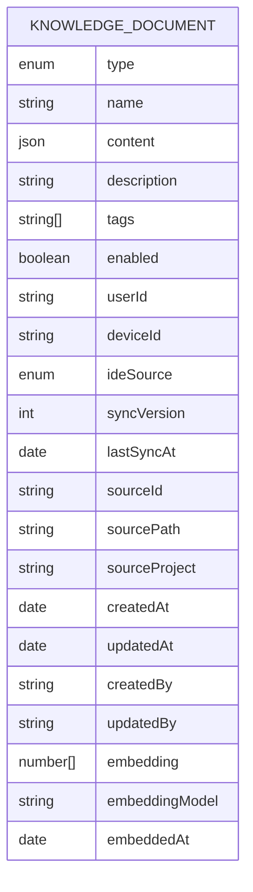

图表来源
- [src/types.ts](file://src/types.ts#L24-L74)

章节来源
- [src/types.ts](file://src/types.ts#L1-L269)

## 依赖关系分析
- 运行时依赖
  - @modelcontextprotocol/sdk：MCP 服务器与传输
  - mongodb：MongoDB 客户端
  - @xenova/transformers：文本向量化
  - zod：输入校验（工具集合中使用）
- 开发依赖
  - typescript、eslint、tsx 等
- 包脚本
  - build、start、dev、lint、typecheck

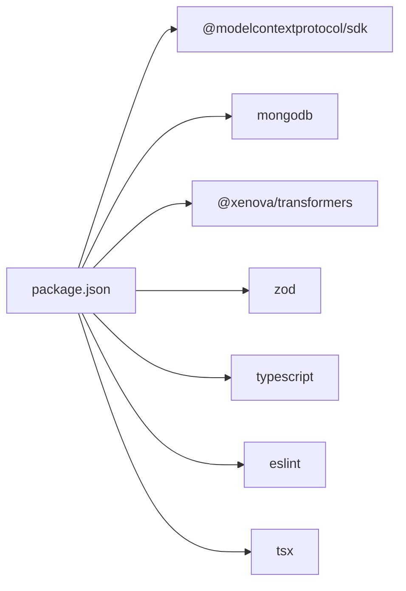

图表来源
- [package.json](file://package.json#L30-L46)

章节来源
- [package.json](file://package.json#L1-L48)

## 性能考虑
- 数据库层面
  - 索引策略：针对用户维度与常用查询字段建立复合索引，减少扫描成本
  - 批量操作：提供批量导入/导出与批量嵌入生成，降低往返次数
  - 嵌入生成：按需生成，避免对全量文档重复计算
- 嵌入服务
  - 懒加载模型，首次使用时初始化，避免启动时阻塞
  - 批量嵌入时逐条处理，便于观察进度与错误定位
- 工具调用
  - 输入参数严格校验，减少无效调用
  - 响应内容尽量精简，避免超长输出
- 日志级别
  - 生产环境建议使用 info/warn/error，避免 debug 造成 IO 压力

[本节为通用性能建议，不直接分析具体文件]

## 故障排查指南
- 配置问题
  - 现象：启动即退出
  - 排查：检查 MONGO_URI/MONGO_DATABASE/MONGO_COLLECTION 是否正确
  - 参考：配置校验逻辑与日志输出
- 数据库连接失败
  - 现象：连接阶段报错
  - 排查：确认 MongoDB 地址可达、认证信息正确、网络策略允许
- 工具调用异常
  - 现象：调用工具返回错误
  - 排查：检查工具输入参数、工具是否存在、知识库服务状态
- 嵌入服务初始化慢
  - 现象：首次语义检索耗时较长
  - 排查：模型下载与初始化时间较长，可在预热阶段提前触发
- 优雅关闭未生效
  - 现象：进程未断开数据库连接
  - 排查：确认 SIGINT/SIGTERM 信号是否被正确捕获与处理

章节来源
- [src/utils/config.ts](file://src/utils/config.ts#L96-L115)
- [src/index.ts](file://src/index.ts#L133-L140)
- [src/services/knowledge-service.ts](file://src/services/knowledge-service.ts#L59-L66)

## 结论
本架构以清晰的分层设计实现了 MCP 服务器的核心能力：稳定的配置与日志、可靠的数据库连接与索引、可扩展的工具集合、以及可选的向量嵌入与语义检索。stdio 传输模式简化了部署与调试，适合本地开发与轻量集成场景。通过严格的输入校验与错误处理，系统具备良好的健壮性与可观测性。

[本节为总结性内容，不直接分析具体文件]

## 附录

### 服务器配置选项
- 环境变量
  - MONGO_URI：MongoDB 连接串（必填）
  - MONGO_DATABASE：数据库名（必填）
  - MONGO_COLLECTION：集合名（必填）
  - USER_ID：用户标识
  - DEVICE_ID：设备标识
  - IDE_SOURCE：IDE 来源（qoder/trae/cursor/windsurf/vscode/manual/other）
  - ENABLE_EMBEDDING：是否启用向量嵌入
  - LOG_LEVEL：日志级别（debug/info/warn/error）
- 配置优先级
  - MCP 客户端传入 env > 系统环境变量 > 内置默认值
- 示例配置
  - examples/mcp-config.json 展示了不同 IDE 的配置方式与示例

章节来源
- [src/utils/config.ts](file://src/utils/config.ts#L76-L91)
- [examples/mcp-config.json](file://examples/mcp-config.json#L1-L94)