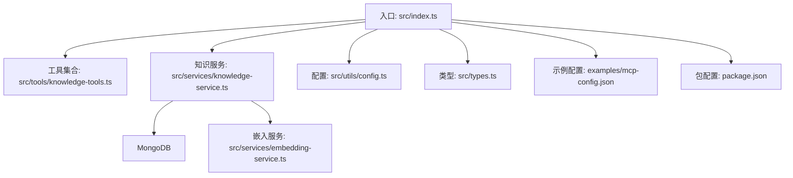
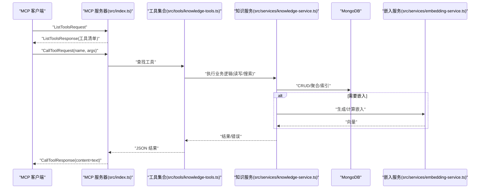
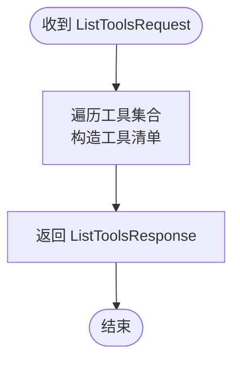
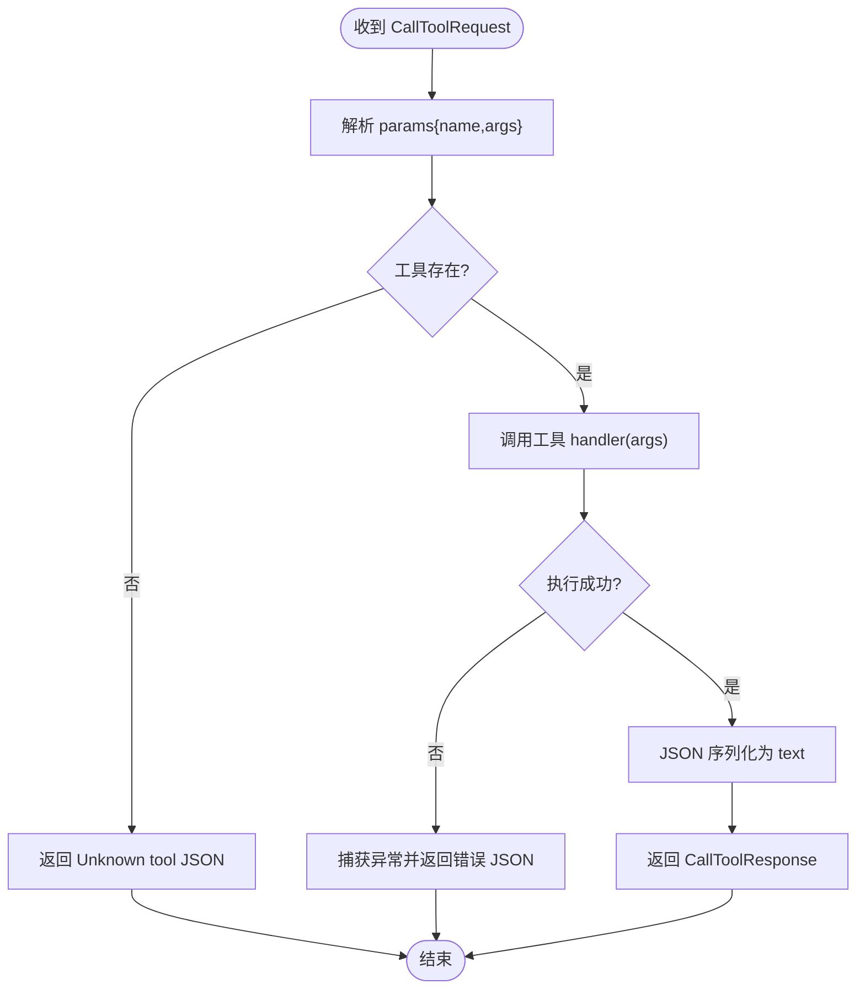
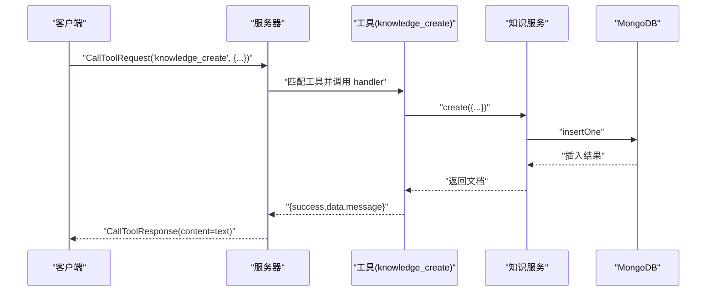
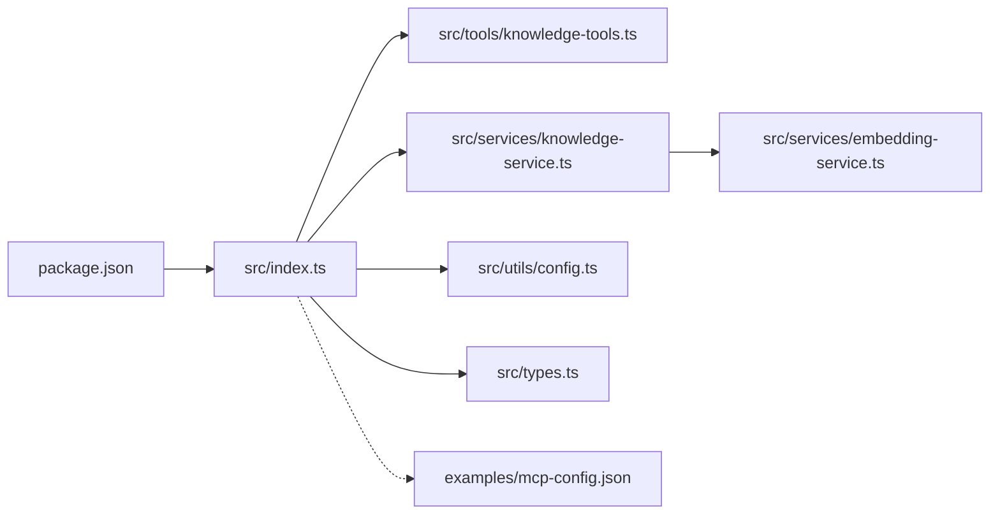

# 请求响应处理

<cite>
**本文引用的文件**
- [src/index.ts](file://src/index.ts)
- [src/types.ts](file://src/types.ts)
- [src/tools/knowledge-tools.ts](file://src/tools/knowledge-tools.ts)
- [src/services/knowledge-service.ts](file://src/services/knowledge-service.ts)
- [src/services/embedding-service.ts](file://src/services/embedding-service.ts)
- [src/utils/config.ts](file://src/utils/config.ts)
- [examples/mcp-config.json](file://examples/mcp-config.json)
- [package.json](file://package.json)
</cite>

## 目录
1. [简介](#简介)
2. [项目结构](#项目结构)
3. [核心组件](#核心组件)
4. [架构总览](#架构总览)
5. [详细组件分析](#详细组件分析)
6. [依赖关系分析](#依赖关系分析)
7. [性能考量](#性能考量)
8. [故障排查指南](#故障排查指南)
9. [结论](#结论)
10. [附录](#附录)

## 简介
本文件面向 MCP（Model Context Protocol）协议的请求响应处理机制，聚焦于 ListToolsRequest 与 CallToolRequest 的处理流程，涵盖参数校验、错误处理、工具调用生命周期、异步与并发控制策略，并提供请求/响应示例与性能优化建议。系统以 MongoDB 作为持久化后端，支持多种知识类型（记忆、技能、规则、MCP、经验、命令、上下文、工作流），并可选启用向量嵌入以支持语义搜索。

## 项目结构
- 入口与服务端：src/index.ts 创建 MCP stdio 服务器，注册 ListTools 与 CallTool 处理器。
- 工具定义与实现：src/tools/knowledge-tools.ts 定义工具清单与各工具 handler。
- 知识服务：src/services/knowledge-service.ts 封装 MongoDB 访问、索引、CRUD、批量操作与嵌入生成。
- 嵌入服务：src/services/embedding-service.ts 使用 @xenova/transformers 提供文本向量嵌入能力。
- 类型定义：src/types.ts 定义知识文档类型、查询与嵌入选项等。
- 配置与日志：src/utils/config.ts 负责环境变量解析、配置校验与日志输出。
- 示例配置：examples/mcp-config.json 展示不同 IDE 的 MCP 服务器配置方式。
- 构建与运行：package.json 定义构建、开发与依赖。

图表来源
- [src/index.ts](file://src/index.ts#L1-L148)
- [src/tools/knowledge-tools.ts](file://src/tools/knowledge-tools.ts#L1-L1093)
- [src/services/knowledge-service.ts](file://src/services/knowledge-service.ts#L1-L404)
- [src/services/embedding-service.ts](file://src/services/embedding-service.ts#L1-L148)
- [src/utils/config.ts](file://src/utils/config.ts#L1-L147)
- [src/types.ts](file://src/types.ts#L1-L269)
- [examples/mcp-config.json](file://examples/mcp-config.json#L1-L94)
- [package.json](file://package.json#L1-L48)

章节来源
- [src/index.ts](file://src/index.ts#L1-L148)
- [package.json](file://package.json#L1-L48)

## 核心组件
- MCP 服务器与处理器
  - 通过 SDK 创建 stdio 服务器，注册 ListToolsRequest 与 CallToolRequest 处理器。
  - ListTools 返回工具清单；CallTool 根据工具名路由到对应 handler 并返回 JSON 文本内容。
- 工具系统
  - 工具接口包含名称、描述、输入模式与 handler。
  - 工具覆盖通用 CRUD、快捷工具、同步工具、导出工具以及可选的语义搜索与嵌入生成工具。
- 知识服务
  - 提供连接、断开、索引、CRUD、批量导入/导出、统计、语义搜索与嵌入生成。
  - 通过用户上下文隔离与跨设备同步字段实现用户级数据隔离与同步。
- 嵌入服务
  - 懒加载模型，提供单次与批量嵌入、余弦相似度计算与文本抽取。
- 配置与日志
  - 从环境变量加载配置，进行基础校验，按日志级别输出。

章节来源
- [src/index.ts](file://src/index.ts#L16-L82)
- [src/tools/knowledge-tools.ts](file://src/tools/knowledge-tools.ts#L7-L16)
- [src/services/knowledge-service.ts](file://src/services/knowledge-service.ts#L20-L403)
- [src/services/embedding-service.ts](file://src/services/embedding-service.ts#L11-L147)
- [src/utils/config.ts](file://src/utils/config.ts#L76-L146)

## 架构总览
MCP 请求在服务器端被解析为 ListTools 或 CallTool，随后根据工具名分派到具体 handler。工具 handler 通过知识服务访问 MongoDB，必要时调用嵌入服务生成向量。最终以 JSON 文本形式返回给 MCP 客户端。

图表来源
- [src/index.ts](file://src/index.ts#L29-L79)
- [src/tools/knowledge-tools.ts](file://src/tools/knowledge-tools.ts#L29-L1092)
- [src/services/knowledge-service.ts](file://src/services/knowledge-service.ts#L111-L402)
- [src/services/embedding-service.ts](file://src/services/embedding-service.ts#L56-L136)

## 详细组件分析

### ListToolsRequest 处理流程
- 请求类型：ListToolsRequestSchema
- 处理逻辑
  - 服务器注册处理器，直接返回工具数组，每个工具包含 name、description、inputSchema。
  - inputSchema 由工具定义，用于客户端参数校验与提示。
- 错误处理
  - 该处理器无外部依赖，异常风险低；若工具集合为空，仍返回空数组。
- 性能特性
  - O(n) 返回工具清单，n 为工具数量；无数据库/网络 IO。

图表来源
- [src/index.ts](file://src/index.ts#L29-L38)
- [src/tools/knowledge-tools.ts](file://src/tools/knowledge-tools.ts#L29-L1092)

章节来源
- [src/index.ts](file://src/index.ts#L29-L38)

### CallToolRequest 处理流程
- 请求类型：CallToolRequestSchema
- 处理逻辑
  - 从请求 params 中提取 name 与 args。
  - 在工具集合中查找匹配工具；未找到时返回错误 JSON。
  - 调用工具 handler(args)，await 获取结果；捕获异常并返回错误 JSON。
  - 将结果序列化为 JSON 字符串，封装为 content[type=text]。
- 参数验证
  - 工具 handler 内部对输入进行结构化校验（必填字段、枚举值、类型等）。
  - inputSchema 由工具定义，客户端可据此进行参数校验。
- 错误处理
  - 未知工具：返回包含错误信息的 JSON。
  - 工具内部异常：捕获错误并返回包含错误消息的 JSON。
- 并发与异步
  - 每个请求独立 await 工具 handler；工具内部可能并发访问数据库或嵌入服务（例如批量生成嵌入）。
  - 建议：避免在 handler 内部进行阻塞 IO；必要时使用连接池与索引优化。

图表来源
- [src/index.ts](file://src/index.ts#L41-L79)
- [src/tools/knowledge-tools.ts](file://src/tools/knowledge-tools.ts#L72-L106)

章节来源
- [src/index.ts](file://src/index.ts#L41-L79)

### 工具调用生命周期（以知识 CRUD 为例）
- 生命周期阶段
  - 接收：CallToolRequest(name, args)
  - 解析：工具名匹配与参数校验
  - 执行：调用知识服务对应方法（create/list/update/delete/upsert）
  - 结果：返回统一结构 success/data/message/error
  - 序列化：JSON 文本封装为 content
- 输入模式（示例：knowledge_create）
  - 必填：type、name、content
  - 可选：description、tags、enabled
  - handler 内部进行重复性检查（如唯一索引冲突）并返回结构化结果
- 输出格式
  - 成功：success=true，data 包含 id/type/name/message
  - 失败：success=false，error 包含错误信息

图表来源
- [src/index.ts](file://src/index.ts#L41-L79)
- [src/tools/knowledge-tools.ts](file://src/tools/knowledge-tools.ts#L36-L106)
- [src/services/knowledge-service.ts](file://src/services/knowledge-service.ts#L111-L127)

章节来源
- [src/tools/knowledge-tools.ts](file://src/tools/knowledge-tools.ts#L36-L106)
- [src/services/knowledge-service.ts](file://src/services/knowledge-service.ts#L111-L127)

### 异步处理与并发控制策略
- 异步模型
  - 服务器处理器与工具 handler 均为异步，await 工具返回值。
  - 知识服务内部使用 MongoDB 的异步 API（find、findOne、insertOne、updateOne、deleteOne）。
- 并发控制
  - 单请求内：await 工具 handler，避免竞态。
  - 工具内部：批量生成嵌入时逐条处理，避免高并发导致内存峰值。
  - 建议：为高并发场景增加连接池配置与限流策略（可在上层 MCP 客户端或代理层实现）。
- 资源管理
  - 嵌入服务懒加载模型，首次使用时初始化；避免重复初始化。
  - 知识服务在 connect 时创建必要索引，减少后续查询成本。

章节来源
- [src/index.ts](file://src/index.ts#L116-L144)
- [src/services/knowledge-service.ts](file://src/services/knowledge-service.ts#L44-L87)
- [src/services/embedding-service.ts](file://src/services/embedding-service.ts#L24-L51)

### 请求/响应示例（概念性说明）
- 正常流程
  - 客户端发送 CallToolRequest("knowledge_create", { type:"Skills", name:"test", content:"..." })
  - 服务器返回 CallToolResponse(content=[{ type:"text", text:"{success:true,...}" }])
- 异常情况
  - 未知工具：content=[{ type:"text", text:"{success:false,error:'Unknown tool: ...'}" }]
  - 参数缺失：工具 handler 返回 {success:false,error:'...'}
  - 数据库冲突：返回 {success:false,error:'duplicate key'}

章节来源
- [src/index.ts](file://src/index.ts#L45-L77)
- [src/tools/knowledge-tools.ts](file://src/tools/knowledge-tools.ts#L99-L105)

## 依赖关系分析
- 外部依赖
  - @modelcontextprotocol/sdk：MCP 协议 SDK，提供 Server、RequestSchema、stdio 传输。
  - mongodb：MongoDB 官方驱动，提供连接、集合、索引与查询。
  - @xenova/transformers：文本嵌入模型加载与特征提取。
  - zod：类型校验（在本项目中未直接使用，但可配合 schema 校验）。
- 内部模块耦合
  - index.ts 依赖工具集合与知识服务；工具依赖知识服务；知识服务依赖嵌入服务。
  - 配置模块为全局注入，贯穿启动与日志。

图表来源
- [src/index.ts](file://src/index.ts#L1-L12)
- [src/tools/knowledge-tools.ts](file://src/tools/knowledge-tools.ts#L1-L3)
- [src/services/knowledge-service.ts](file://src/services/knowledge-service.ts#L1-L4)
- [src/services/embedding-service.ts](file://src/services/embedding-service.ts#L1-L1)
- [src/utils/config.ts](file://src/utils/config.ts#L1-L1)
- [src/types.ts](file://src/types.ts#L1-L1)
- [examples/mcp-config.json](file://examples/mcp-config.json#L1-L1)
- [package.json](file://package.json#L30-L34)

章节来源
- [package.json](file://package.json#L30-L34)

## 性能考量
- 查询与索引
  - 知识服务在 connect 时创建多处复合索引，覆盖用户隔离、类型过滤、标签、时间排序等常用查询。
  - 建议：根据实际查询模式调整索引，避免冗余索引影响写入性能。
- 嵌入生成
  - 批量生成嵌入采用逐条处理，避免一次性加载大量向量导致内存压力。
  - 建议：在高负载场景下分批生成、异步后台任务或队列化处理。
- 模型懒加载
  - 嵌入服务首次使用时加载模型，避免启动时占用资源。
  - 建议：在预热阶段提前触发模型加载，降低首次请求延迟。
- 并发与连接
  - 建议：为高并发场景配置连接池大小与超时参数；在工具 handler 中避免长耗时阻塞操作。
- 日志级别
  - 通过配置控制日志级别，生产环境建议使用 info/warn，避免过多 debug 输出影响性能。

章节来源
- [src/services/knowledge-service.ts](file://src/services/knowledge-service.ts#L71-L87)
- [src/services/embedding-service.ts](file://src/services/embedding-service.ts#L24-L51)
- [src/utils/config.ts](file://src/utils/config.ts#L120-L146)

## 故障排查指南
- 启动失败
  - 检查配置：MONGO_URI、MONGO_DATABASE、MONGO_COLLECTION 是否有效。
  - 查看日志：启动时会打印数据库与用户/设备信息；若连接失败，查看错误日志。
- 工具调用异常
  - 未知工具：确认工具名拼写与工具集合是否正确加载。
  - 参数错误：检查 inputSchema 与客户端传参；工具 handler 内部会返回结构化错误。
  - 数据库错误：唯一键冲突（重复 name/type）会返回相应错误；检查索引与数据一致性。
- 嵌入相关问题
  - 模型加载失败：确保网络可达与模型可用；首次加载可能较慢。
  - 语义搜索无结果：确认文档已生成嵌入且阈值合理。
- 优雅退出
  - 支持 SIGINT/SIGTERM，进程退出前断开数据库连接。

章节来源
- [src/utils/config.ts](file://src/utils/config.ts#L96-L115)
- [src/index.ts](file://src/index.ts#L93-L98)
- [src/index.ts](file://src/index.ts#L133-L140)
- [src/tools/knowledge-tools.ts](file://src/tools/knowledge-tools.ts#L101-L105)

## 结论
本系统以 MCP 协议为核心，通过清晰的工具定义与知识服务抽象，实现了从请求解析、参数校验、工具分派到数据库访问与嵌入计算的完整链路。通过合理的索引设计、懒加载与批量处理策略，兼顾了性能与可维护性。建议在生产环境中结合连接池、限流与监控，进一步提升稳定性与吞吐量。

## 附录
- IDE 配置参考
  - examples/mcp-config.json 展示了 Qoder、Cursor、VS Code、本地开发与云数据库共享等配置示例。
- 类型与数据结构
  - src/types.ts 定义了 8 种知识类型及其字段，以及查询与嵌入选项。
- 工具清单
  - 通用 CRUD、快捷工具、同步工具、导出工具与可选的语义搜索与嵌入生成工具。

章节来源
- [examples/mcp-config.json](file://examples/mcp-config.json#L1-L94)
- [src/types.ts](file://src/types.ts#L6-L269)
- [src/tools/knowledge-tools.ts](file://src/tools/knowledge-tools.ts#L29-L1092)