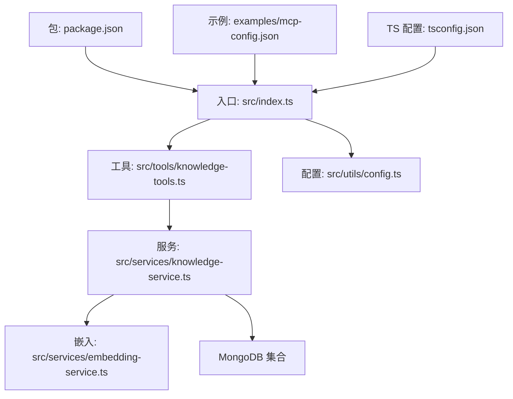
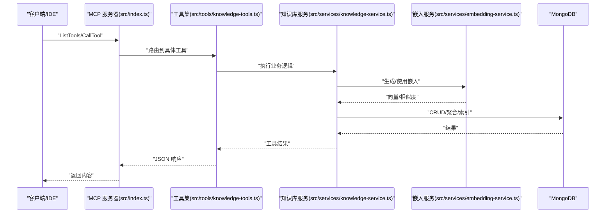
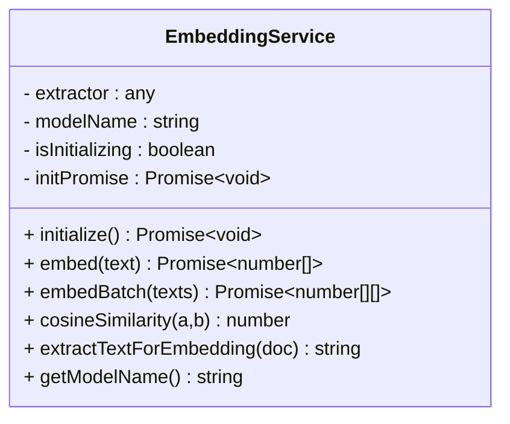
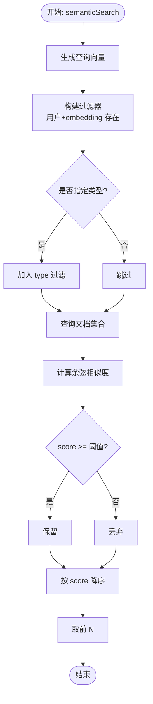
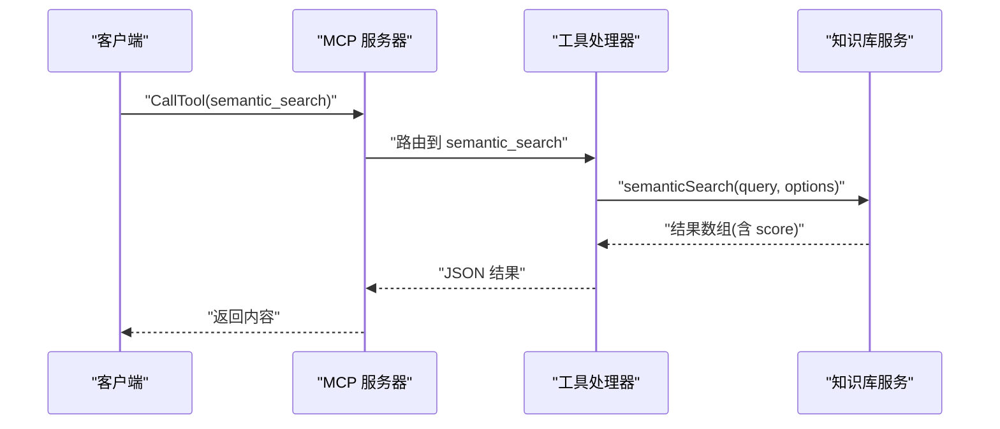
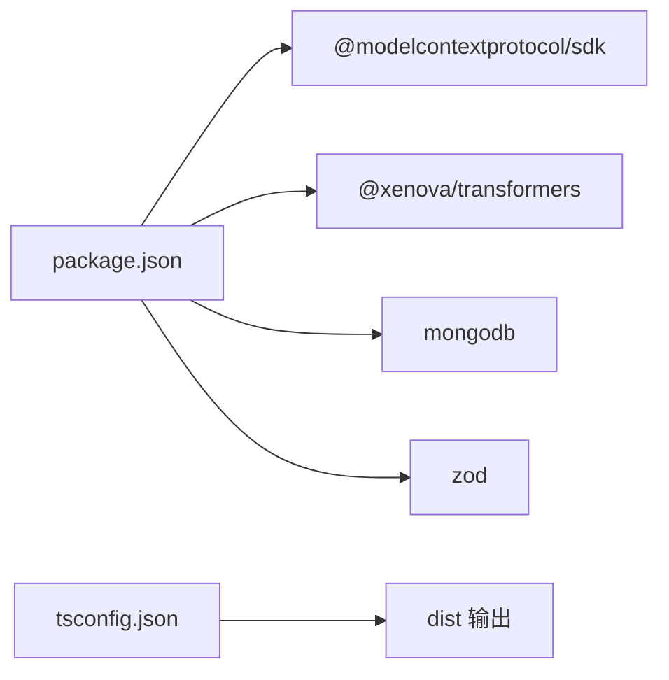

# 向量嵌入系统

<cite>
**本文引用的文件**
- [src/index.ts](file://src/index.ts)
- [src/types.ts](file://src/types.ts)
- [src/services/embedding-service.ts](file://src/services/embedding-service.ts)
- [src/services/knowledge-service.ts](file://src/services/knowledge-service.ts)
- [src/utils/config.ts](file://src/utils/config.ts)
- [src/tools/knowledge-tools.ts](file://src/tools/knowledge-tools.ts)
- [package.json](file://package.json)
- [examples/mcp-config.json](file://examples/mcp-config.json)
- [tsconfig.json](file://tsconfig.json)
</cite>

## 目录
1. [简介](#简介)
2. [项目结构](#项目结构)
3. [核心组件](#核心组件)
4. [架构总览](#架构总览)
5. [详细组件分析](#详细组件分析)
6. [依赖关系分析](#依赖关系分析)
7. [性能考量](#性能考量)
8. [故障排除指南](#故障排除指南)
9. [结论](#结论)
10. [附录](#附录)

## 简介
本项目是一个基于 MongoDB 的知识库管理与语义搜索 MCP 服务器，支持多种知识类型（记忆、技能、规则、MCP 配置、经验、命令、上下文、工作流），并通过 Transformers.js 在浏览器/Node 环境中生成文本向量嵌入，实现基于余弦相似度的语义检索。系统采用 Model Context Protocol（MCP）标准，通过 stdio 与 IDE/客户端交互，并提供完整的 CRUD、批量导入导出、嵌入生成与语义搜索工具。

## 项目结构
- 入口与协议层：MCP 服务器初始化、请求处理与工具注册
- 服务层：知识库服务（MongoDB）、嵌入服务（Transformers.js）
- 工具层：知识 CRUD、快捷工具、语义搜索与嵌入生成工具
- 配置与类型：环境变量解析、日志、类型定义与索引策略
- 示例与构建：IDE 配置示例、TypeScript 编译配置

图表来源
- [src/index.ts](file://src/index.ts#L1-L148)
- [src/tools/knowledge-tools.ts](file://src/tools/knowledge-tools.ts#L1-L1093)
- [src/services/knowledge-service.ts](file://src/services/knowledge-service.ts#L1-L404)
- [src/services/embedding-service.ts](file://src/services/embedding-service.ts#L1-L148)
- [src/utils/config.ts](file://src/utils/config.ts#L1-L147)
- [package.json](file://package.json#L1-L48)
- [examples/mcp-config.json](file://examples/mcp-config.json#L1-L94)
- [tsconfig.json](file://tsconfig.json#L1-L21)

章节来源
- [src/index.ts](file://src/index.ts#L1-L148)
- [package.json](file://package.json#L1-L48)
- [examples/mcp-config.json](file://examples/mcp-config.json#L1-L94)
- [tsconfig.json](file://tsconfig.json#L1-L21)

## 核心组件
- MCP 服务器与工具注册：负责启动 stdio 服务器、注册工具、处理请求与响应
- 知识库服务：封装 MongoDB 操作、索引、用户上下文注入、语义搜索与嵌入生成
- 嵌入服务：基于 Transformers.js 的特征提取、余弦相似度计算、文本拼接策略
- 配置与日志：环境变量解析、验证、日志级别控制
- 工具集：通用 CRUD、快捷工具、语义搜索与嵌入生成工具（按配置动态启用）

章节来源
- [src/index.ts](file://src/index.ts#L1-L148)
- [src/services/knowledge-service.ts](file://src/services/knowledge-service.ts#L1-L404)
- [src/services/embedding-service.ts](file://src/services/embedding-service.ts#L1-L148)
- [src/utils/config.ts](file://src/utils/config.ts#L1-L147)
- [src/tools/knowledge-tools.ts](file://src/tools/knowledge-tools.ts#L1-L1093)

## 架构总览
系统以 MCP 服务器为中心，通过 stdio 与客户端通信；工具层将业务操作抽象为可调用的工具；知识库服务负责数据持久化与检索；嵌入服务提供向量化能力；配置模块统一管理运行时参数。

图表来源
- [src/index.ts](file://src/index.ts#L16-L82)
- [src/tools/knowledge-tools.ts](file://src/tools/knowledge-tools.ts#L1-L1093)
- [src/services/knowledge-service.ts](file://src/services/knowledge-service.ts#L270-L399)
- [src/services/embedding-service.ts](file://src/services/embedding-service.ts#L56-L104)

## 详细组件分析

### 嵌入服务（Transformers.js 集成）
- 模型选择与配置
  - 默认模型：Xenova/all-MiniLM-L6-v2（可在构造函数中自定义）
  - 环境变量禁用本地模型与浏览器缓存，WASM 线程数设为 1
- 初始化策略
  - 懒加载：首次 embed 调用时加载模型
  - 并发保护：避免重复初始化
- 文本预处理
  - 从文档中抽取 name/description/content/tags，截断长度，拼接为单一文本
- 向量生成
  - feature-extraction，池化方式 mean，归一化 normalize
- 批量处理
  - 顺序遍历生成，便于控制内存与日志输出
- 相似度计算
  - 余弦相似度，输入向量长度必须一致
- 单例模式
  - 全局唯一实例，减少重复加载

图表来源
- [src/services/embedding-service.ts](file://src/services/embedding-service.ts#L11-L147)

章节来源
- [src/services/embedding-service.ts](file://src/services/embedding-service.ts#L1-L148)

### 知识库服务（MongoDB 集成与语义搜索）
- 连接与索引
  - 连接 MongoDB，确保用户级唯一索引、类型/标签/时间排序索引
- 用户上下文
  - 注入 userId/deviceId/ideSource，实现跨设备/跨 IDE 同步
- 文档模型
  - 统一的 KnowledgeDocument 接口，扩展各类型文档
  - 新增 embedding/embeddingModel/embeddedAt 字段
- 查询与过滤
  - 支持 type/tags/enabled/search 关键词正则匹配
  - 分页 offset/limit
- 语义搜索
  - 生成查询向量，筛选已有 embedding 的文档
  - 计算余弦相似度，阈值过滤，排序取前 N
- 嵌入生成
  - 逐条生成并写回 embedding、模型名与时间戳
  - 支持批量生成（按用户上下文过滤）
- 工具集成
  - 通过知识工具调用，实现语义搜索与嵌入生成

图表来源
- [src/services/knowledge-service.ts](file://src/services/knowledge-service.ts#L270-L299)

章节来源
- [src/services/knowledge-service.ts](file://src/services/knowledge-service.ts#L1-L404)
- [src/types.ts](file://src/types.ts#L212-L269)

### MCP 服务器与工具集
- 服务器
  - 创建 MCP 服务器，注册 ListTools/CallTool 处理器
  - 通过 stdio 传输启动
- 工具集
  - 通用 CRUD：create/read/update/delete/list/stats/upsert
  - 快捷工具：memory_add/memory_search、experience_add、command_add、context_set、mcp_sync、rule_sync、skill_sync、workflow_create
  - 语义搜索与嵌入生成工具：仅在启用嵌入时注册
  - 用户信息查询与批量导出

图表来源
- [src/index.ts](file://src/index.ts#L40-L79)
- [src/tools/knowledge-tools.ts](file://src/tools/knowledge-tools.ts#L1002-L1056)
- [src/services/knowledge-service.ts](file://src/services/knowledge-service.ts#L270-L299)

章节来源
- [src/index.ts](file://src/index.ts#L1-L148)
- [src/tools/knowledge-tools.ts](file://src/tools/knowledge-tools.ts#L1-L1093)

### 配置与日志
- 配置项
  - MONGO_URI、MONGO_DATABASE、MONGO_COLLECTION、USER_ID、DEVICE_ID、IDE_SOURCE、ENABLE_EMBEDDING、LOG_LEVEL
  - IDE 来源枚举：qoder、trae、cursor、windsurf、vscode、manual、other
  - 日志级别：debug/info/warn/error
- 验证
  - 校验 MONGO_URI/数据库/集合必填
- 日志
  - 按配置级别输出，统一格式

章节来源
- [src/utils/config.ts](file://src/utils/config.ts#L1-L147)
- [examples/mcp-config.json](file://examples/mcp-config.json#L1-L94)

## 依赖关系分析
- 运行时依赖
  - @modelcontextprotocol/sdk：MCP 协议与传输
  - @xenova/transformers：Transformers.js，特征提取与模型加载
  - mongodb：MongoDB 官方驱动
  - zod：类型校验（未在代码中直接使用，但作为依赖存在）
- 开发依赖
  - TypeScript、ESLint、tsx、类型声明等
- 构建与运行
  - TypeScript 编译至 dist，Node >= 18

图表来源
- [package.json](file://package.json#L30-L47)
- [tsconfig.json](file://tsconfig.json#L1-L21)

章节来源
- [package.json](file://package.json#L1-L48)
- [tsconfig.json](file://tsconfig.json#L1-L21)

## 性能考量
- 模型加载与内存
  - 懒加载避免冷启动时的额外等待；WASM 线程数限制为 1，降低并发占用
  - 建议在进程启动阶段预热模型，或在高并发场景下考虑多实例部署
- 向量生成
  - 批量生成采用顺序遍历，便于日志与错误定位；若需更高吞吐，可引入队列与并发控制
- 语义搜索
  - 当前实现对每个文档计算相似度，复杂度 O(N)；建议在大规模数据上建立 ANN 索引（如向量数据库）以提升性能
- 索引策略
  - 已有用户级唯一索引、类型/标签/时间排序索引；可考虑为 embedding 字段建立向量索引（取决于 MongoDB 版本与插件）
- I/O 与网络
  - MongoDB 连接复用；注意网络延迟与副本集配置
- 日志与可观测性
  - 建议增加埋点：模型加载耗时、向量生成耗时、相似度计算耗时、查询耗时、错误率

[本节为通用性能建议，无需特定文件来源]

## 故障排除指南
- 启动失败
  - 检查配置验证：MONGO_URI/MONGO_DATABASE/MONGO_COLLECTION 是否填写
  - 查看日志级别与输出，确认连接字符串与权限
- 工具调用错误
  - 确认工具名称正确，参数类型与必填字段符合 inputSchema
  - 若返回 Unknown tool，检查工具是否启用（ENABLE_EMBEDDING）
- 语义搜索无结果
  - 确认已生成嵌入（embedding 字段存在），阈值设置是否过高
  - 检查文档类型过滤与标签过滤
- 嵌入生成异常
  - 检查模型加载日志，确认网络可达与缓存策略
  - 注意文本截断与编码问题
- MongoDB 错误
  - 索引冲突（唯一索引）：修改 type+name 组合或删除重复记录
  - 权限不足：检查连接字符串与数据库权限

章节来源
- [src/utils/config.ts](file://src/utils/config.ts#L96-L115)
- [src/tools/knowledge-tools.ts](file://src/tools/knowledge-tools.ts#L1002-L1087)
- [src/services/knowledge-service.ts](file://src/services/knowledge-service.ts#L270-L399)

## 结论
该系统以 MCP 为入口，结合 MongoDB 与 Transformers.js 实现了完整的知识库管理与语义搜索能力。通过用户上下文注入与索引策略，实现了跨设备/跨 IDE 的知识同步；通过余弦相似度与阈值过滤，提供了可控的语义检索体验。建议在生产环境中引入向量索引、并发队列与监控埋点，进一步提升性能与稳定性。

[本节为总结性内容，无需特定文件来源]

## 附录

### 模型选择与配置选项
- 模型选择
  - 默认模型：Xenova/all-MiniLM-L6-v2（可在构造函数中自定义）
  - 环境变量：禁用本地模型、禁用浏览器缓存、WASM 线程数
- 配置项
  - MONGO_URI、MONGO_DATABASE、MONGO_COLLECTION、USER_ID、DEVICE_ID、IDE_SOURCE、ENABLE_EMBEDDING、LOG_LEVEL

章节来源
- [src/services/embedding-service.ts](file://src/services/embedding-service.ts#L17-L51)
- [src/utils/config.ts](file://src/utils/config.ts#L76-L91)

### 嵌入生成与相似度计算
- 文本提取策略：name/description/content/tags 拼接，截断长度
- 向量生成：feature-extraction，mean 池化，normalize
- 相似度：余弦相似度，阈值过滤，降序排序，限制返回数量

章节来源
- [src/services/embedding-service.ts](file://src/services/embedding-service.ts#L109-L136)
- [src/services/embedding-service.ts](file://src/services/embedding-service.ts#L85-L104)
- [src/services/knowledge-service.ts](file://src/services/knowledge-service.ts#L270-L299)

### 语义搜索实现原理
- 查询向量生成
- 过滤：用户上下文 + embedding 存在 + 类型过滤
- 计算与过滤：余弦相似度 >= 阈值
- 排序与截断：按分数降序，取前 N

章节来源
- [src/services/knowledge-service.ts](file://src/services/knowledge-service.ts#L270-L299)

### 性能优化策略
- 预热模型、并发队列、向量索引（ANN）
- 索引优化：embedding 字段向量索引（视 MongoDB 版本）
- I/O 优化：连接池、批量写入、分页查询
- 监控：埋点模型加载、向量生成、相似度计算、查询耗时

[本节为通用优化建议，无需特定文件来源]

### 相似度阈值设置与排序
- 阈值：SemanticSearchOptions.threshold，默认 0.3
- 排序：按 score 降序
- 截断：limit，默认 10

章节来源
- [src/types.ts](file://src/types.ts#L264-L269)
- [src/tools/knowledge-tools.ts](file://src/tools/knowledge-tools.ts#L1022-L1025)
- [src/services/knowledge-service.ts](file://src/services/knowledge-service.ts#L294-L296)

### 嵌入模型训练、微调与部署
- 训练/微调
  - 本项目使用 Transformers.js 的预训练模型；若需自定义模型，可在构造函数中替换模型名
- 部署
  - 通过 npm 包与 Node 运行时部署；IDE 侧通过 MCP 配置文件启动

章节来源
- [src/services/embedding-service.ts](file://src/services/embedding-service.ts#L17-L19)
- [examples/mcp-config.json](file://examples/mcp-config.json#L1-L94)

### 监控指标与调试方法
- 指标建议
  - 模型加载耗时、向量生成耗时、相似度计算耗时、查询耗时、错误率、嵌入生成进度
- 调试
  - 启用 debug 日志级别，检查工具调用参数与返回
  - 确认 MongoDB 索引与数据一致性

章节来源
- [src/utils/config.ts](file://src/utils/config.ts#L120-L146)
- [src/services/knowledge-service.ts](file://src/services/knowledge-service.ts#L71-L87)

### 性能基准测试与优化建议
- 基准测试
  - 测试不同阈值与 limit 对召回与延迟的影响
  - 测试批量嵌入生成的吞吐与内存占用
- 优化建议
  - 引入 ANN 索引、连接池、并发队列与缓存
  - 对长文本进行分段嵌入与聚合

[本节为通用测试与优化建议，无需特定文件来源]