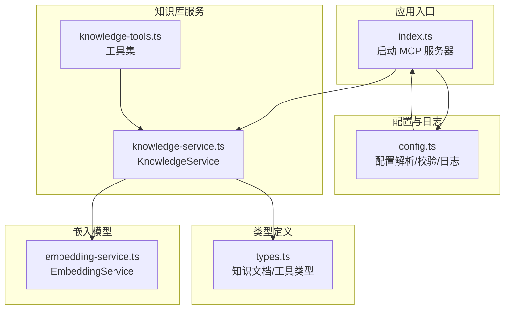
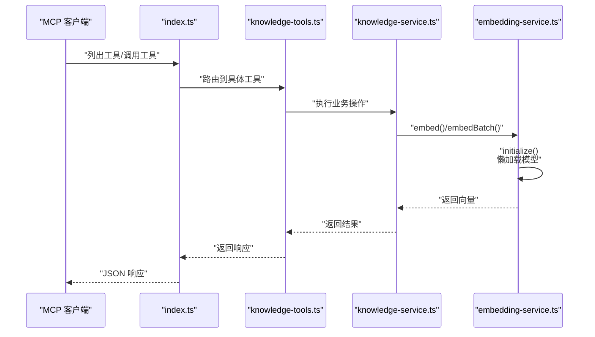
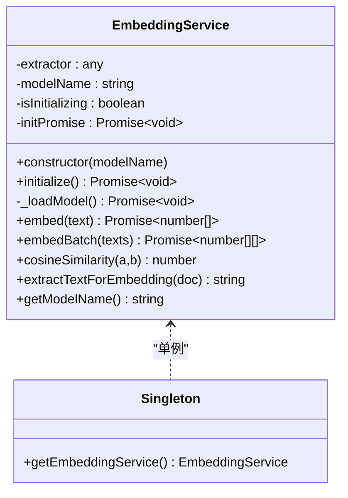
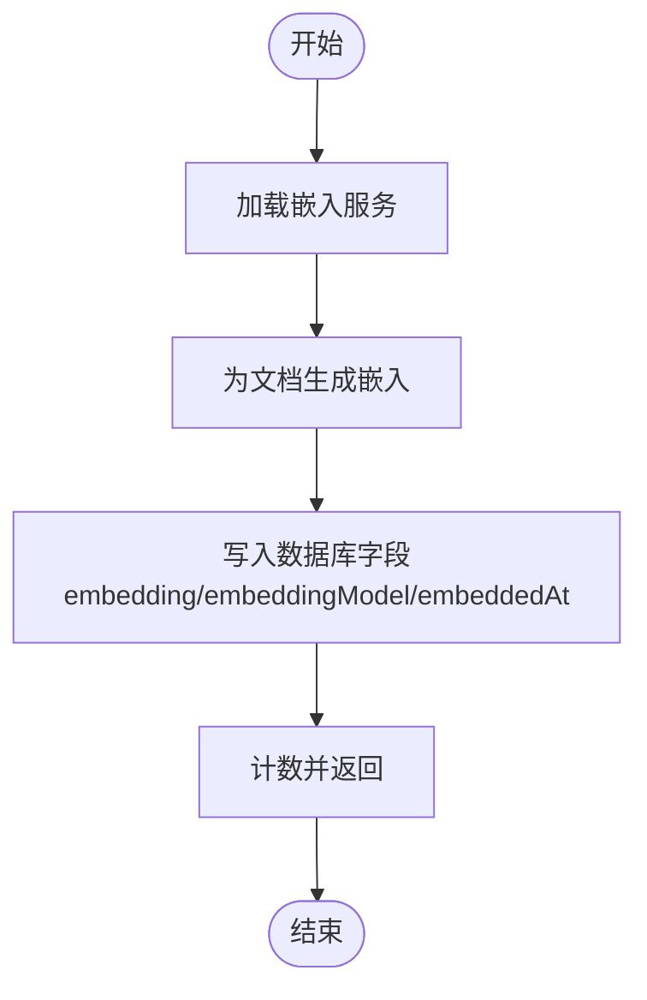
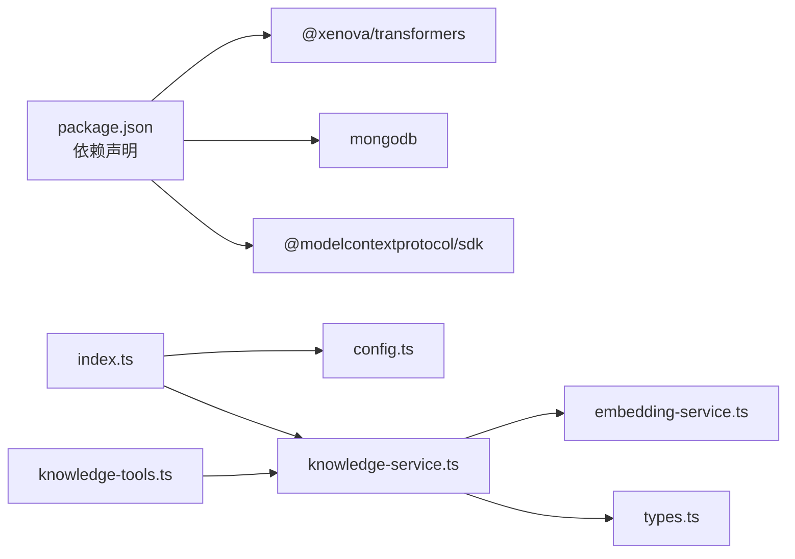

# 嵌入模型集成

<cite>
**本文引用的文件**
- [embedding-service.ts](file://src/services/embedding-service.ts)
- [knowledge-service.ts](file://src/services/knowledge-service.ts)
- [knowledge-tools.ts](file://src/tools/knowledge-tools.ts)
- [config.ts](file://src/utils/config.ts)
- [index.ts](file://src/index.ts)
- [types.ts](file://src/types.ts)
- [mcp-config.json](file://examples/mcp-config.json)
- [package.json](file://package.json)
- [tsconfig.json](file://tsconfig.json)
</cite>

## 目录
1. [简介](#简介)
2. [项目结构](#项目结构)
3. [核心组件](#核心组件)
4. [架构总览](#架构总览)
5. [组件详解](#组件详解)
6. [依赖关系分析](#依赖关系分析)
7. [性能考量](#性能考量)
8. [故障排查指南](#故障排查指南)
9. [结论](#结论)
10. [附录](#附录)

## 简介
本技术文档聚焦于嵌入模型在 mongo-mcp 中的集成与运行，围绕 Transformers.js 的配置与初始化、模型加载策略、懒加载与并发控制、ONNX 运行时与 WASM 线程管理、内存优化、模型选择与性能特征、模型切换与版本管理、缓存与预热、资源清理、兼容性检查与错误处理及降级策略进行系统化说明。文档同时给出面向使用者的配置建议与最佳实践，帮助在不同 IDE 与部署环境下稳定启用嵌入能力。

## 项目结构
项目采用分层与功能模块化组织，嵌入模型能力主要由嵌入服务模块提供，并被知识服务与工具集所复用；配置与日志工具贯穿应用生命周期；入口文件负责启动 MCP 服务器并装配工具。

图表来源
- [index.ts](file://src/index.ts#L87-L145)
- [config.ts](file://src/utils/config.ts#L76-L91)
- [embedding-service.ts](file://src/services/embedding-service.ts#L11-L19)
- [knowledge-service.ts](file://src/services/knowledge-service.ts#L20-L40)
- [knowledge-tools.ts](file://src/tools/knowledge-tools.ts#L29-L32)
- [types.ts](file://src/types.ts#L24-L74)

章节来源
- [index.ts](file://src/index.ts#L87-L145)
- [config.ts](file://src/utils/config.ts#L76-L91)
- [embedding-service.ts](file://src/services/embedding-service.ts#L11-L19)
- [knowledge-service.ts](file://src/services/knowledge-service.ts#L20-L40)
- [knowledge-tools.ts](file://src/tools/knowledge-tools.ts#L29-L32)
- [types.ts](file://src/types.ts#L24-L74)

## 核心组件
- 嵌入服务（EmbeddingService）：封装 Transformers.js 的初始化、模型加载、文本向量化、余弦相似度计算、文本抽取与单例访问。
- 知识服务（KnowledgeService）：提供知识库的 CRUD、批量导入导出、语义搜索、嵌入生成与更新、用户上下文隔离与索引管理。
- 工具集（knowledge-tools.ts）：将知识服务能力包装为 MCP 工具，按需启用嵌入相关工具。
- 配置与日志（config.ts）：从环境变量加载配置、校验有效性、创建日志器。
- 入口（index.ts）：创建 MCP 服务器、装载工具、连接数据库、优雅退出。

章节来源
- [embedding-service.ts](file://src/services/embedding-service.ts#L11-L137)
- [knowledge-service.ts](file://src/services/knowledge-service.ts#L20-L403)
- [knowledge-tools.ts](file://src/tools/knowledge-tools.ts#L29-L800)
- [config.ts](file://src/utils/config.ts#L76-L146)
- [index.ts](file://src/index.ts#L87-L145)

## 架构总览
嵌入模型集成以“懒加载 + 单例 + 并发保护”的模式运行，避免重复初始化与资源浪费；知识服务在需要时调用嵌入服务生成向量，支持批量嵌入与语义检索；配置模块统一管理环境变量与日志级别，确保在不同 IDE 与部署场景下的可移植性。

图表来源
- [index.ts](file://src/index.ts#L30-L79)
- [knowledge-tools.ts](file://src/tools/knowledge-tools.ts#L36-L106)
- [knowledge-service.ts](file://src/services/knowledge-service.ts#L272-L299)
- [embedding-service.ts](file://src/services/embedding-service.ts#L24-L51)

## 组件详解

### 嵌入服务（EmbeddingService）
- 初始化与懒加载
  - 在构造时记录模型名，默认使用指定模型名。
  - initialize() 通过 isInitializing 与 initPromise 实现并发保护，避免重复初始化。
  - _loadModel() 调用 Transformers.js 的 feature-extraction 管道，开启量化以降低内存占用。
- 文本向量化
  - embed() 接受单条文本，返回归一化后的向量数组。
  - embedBatch() 顺序批处理，当前未做并发优化。
- 相似度与文本抽取
  - cosineSimilarity() 计算余弦相似度，长度不一致时抛错。
  - extractTextForEmbedding() 将文档的 name/description/content/tags 组合为输入文本，限制长度防止过长。
- 单例访问
  - getEmbeddingService() 返回全局单例，确保共享同一模型实例。

图表来源
- [embedding-service.ts](file://src/services/embedding-service.ts#L11-L147)

章节来源
- [embedding-service.ts](file://src/services/embedding-service.ts#L11-L147)

### 知识服务（KnowledgeService）
- 数据库连接与索引
  - connect() 建立连接并确保必要的复合索引，提升查询与聚合效率。
- 嵌入相关能力
  - semanticSearch() 基于查询文本生成向量，遍历已有嵌入文档计算相似度，按阈值与上限过滤排序。
  - generateEmbedding() 为单个文档生成嵌入并写入数据库字段。
  - generateEmbeddings() 批量扫描并生成嵌入，更新 embedding、embeddingModel、embeddedAt。
  - createWithEmbedding() 创建文档时同步生成嵌入。
- 用户上下文与一致性
  - 通过 userContext（userId/deviceId/ideSource）隔离数据，支持跨设备同步。
  - upsert() 提供幂等创建/更新，配合 syncVersion 实现版本递增。

图表来源
- [knowledge-service.ts](file://src/services/knowledge-service.ts#L304-L341)

章节来源
- [knowledge-service.ts](file://src/services/knowledge-service.ts#L272-L341)

### 工具集（knowledge-tools.ts）
- 工具注册
  - createKnowledgeTools() 返回一组 MCP 工具，根据 enableEmbedding 参数决定是否启用嵌入相关工具。
- 嵌入相关工具
  - knowledge_create/knowledge_update/knowledge_upsert：在创建/更新时可结合嵌入生成（取决于服务侧逻辑）。
  - 语义搜索与嵌入生成工具可通过扩展在此注册。

章节来源
- [knowledge-tools.ts](file://src/tools/knowledge-tools.ts#L29-L32)
- [knowledge-tools.ts](file://src/tools/knowledge-tools.ts#L346-L359)

### 配置与日志（config.ts）
- 配置项
  - mongoUri、database、collection、userId、deviceId、ideSource、enableEmbedding、logLevel。
- 环境变量解析
  - parseBoolean/parseIdeSource/parseLogLevel 提供容错解析。
- 配置校验
  - validateConfig() 校验必要字段，失败时输出错误并终止进程。
- 日志器
  - createLogger() 基于 logLevel 控制输出级别。

章节来源
- [config.ts](file://src/utils/config.ts#L76-L146)

### 入口（index.ts）
- 启动流程
  - 加载配置与日志 -> 校验配置 -> 连接数据库 -> 创建工具 -> 启动 MCP 服务器 -> 优雅退出。
- 与嵌入服务的衔接
  - 通过 getEmbeddingService() 在知识服务中按需初始化模型，避免在服务器启动阶段强制加载。

章节来源
- [index.ts](file://src/index.ts#L87-L145)

## 依赖关系分析
- 外部依赖
  - @xenova/transformers：提供 Transformers.js 的 feature-extraction 管道与 ONNX/WASM 运行时。
  - mongodb：数据库连接与操作。
  - @modelcontextprotocol/sdk：MCP 协议与服务器框架。
- 内部依赖
  - knowledge-service 依赖 embedding-service 与 types。
  - knowledge-tools 依赖 knowledge-service 与 types。
  - index.ts 依赖 config、knowledge-service、knowledge-tools。

图表来源
- [package.json](file://package.json#L30-L34)
- [index.ts](file://src/index.ts#L9-L11)
- [knowledge-service.ts](file://src/services/knowledge-service.ts#L1-L5)
- [embedding-service.ts](file://src/services/embedding-service.ts#L1-L1)
- [knowledge-tools.ts](file://src/tools/knowledge-tools.ts#L1-L2)

章节来源
- [package.json](file://package.json#L30-L34)
- [index.ts](file://src/index.ts#L9-L11)
- [knowledge-service.ts](file://src/services/knowledge-service.ts#L1-L5)
- [embedding-service.ts](file://src/services/embedding-service.ts#L1-L1)
- [knowledge-tools.ts](file://src/tools/knowledge-tools.ts#L1-L2)

## 性能考量
- 模型加载策略
  - 懒加载：首次使用时才初始化模型，减少冷启动开销与内存占用。
  - 单例：全局共享同一模型实例，避免重复加载。
- 并发控制
  - initialize() 通过 isInitializing 与 initPromise 防止并发重复初始化。
  - embedBatch() 当前为顺序批处理，未做并发优化；可考虑引入队列或并发池以提升吞吐。
- ONNX 运行时与 WASM 线程
  - 默认线程数为 1，适合浏览器端资源受限场景；若在高性能服务端可适当提高线程数以换取速度。
- 内存优化
  - 启用量化（quantized: true），显著降低模型体积与推理延迟。
  - 对输入文本进行截断（extractTextForEmbedding），避免超长文本导致内存峰值过高。
- 索引与查询
  - 知识服务在用户维度建立复合索引，加速查询与排序；语义搜索仅对具备 embedding 字段的文档生效，避免无效计算。

章节来源
- [embedding-service.ts](file://src/services/embedding-service.ts#L24-L51)
- [embedding-service.ts](file://src/services/embedding-service.ts#L67-L80)
- [embedding-service.ts](file://src/services/embedding-service.ts#L109-L129)
- [knowledge-service.ts](file://src/services/knowledge-service.ts#L71-L87)
- [knowledge-service.ts](file://src/services/knowledge-service.ts#L272-L299)

## 故障排查指南
- 配置校验失败
  - 现象：启动即退出并打印错误。
  - 处理：检查 MONGO_URI/MONGO_DATABASE/MONGO_COLLECTION 等必填项。
- 数据库连接异常
  - 现象：连接失败或超时。
  - 处理：确认连接串、网络可达性、认证信息；检查集合权限。
- 嵌入初始化卡顿
  - 现象：首次 embed() 耗时较长。
  - 处理：确认模型已缓存；在服务启动阶段预热（见“预热启动”）；调整线程数与量化策略。
- 语义搜索结果为空
  - 现象：semanticSearch() 返回空或分数过低。
  - 处理：确认文档已生成嵌入；检查阈值与 limit；验证输入文本长度与内容。
- 并发初始化冲突
  - 现象：多线程同时调用 initialize() 导致重复初始化。
  - 处理：确认使用单例；避免直接调用内部 _loadModel()。
- 错误降级
  - 建议：当嵌入服务不可用时，禁用相关工具或回退到传统关键词匹配；通过 ENABLE_EMBEDDING 控制开关。

章节来源
- [config.ts](file://src/utils/config.ts#L96-L115)
- [index.ts](file://src/index.ts#L141-L144)
- [embedding-service.ts](file://src/services/embedding-service.ts#L24-L39)
- [knowledge-service.ts](file://src/services/knowledge-service.ts#L272-L299)

## 结论
本项目通过“懒加载 + 单例 + 并发保护”的嵌入模型初始化策略，结合量化与文本截断等内存优化手段，在浏览器端与服务端均能稳定运行。知识服务与工具集围绕嵌入能力提供了语义搜索与批量嵌入等核心功能，配合配置模块实现了跨 IDE 的可移植部署。建议在生产环境中进一步完善批处理并发、预热启动与资源清理策略，并通过环境变量灵活控制嵌入开关与日志级别。

## 附录

### 模型选择与性能特征
- 模型选择
  - 默认模型：Xenova/all-MiniLM-L6-v2，适合通用文本嵌入，体积较小，推理较快。
  - 可替换模型：通过构造函数传入自定义模型名，满足不同精度与性能需求。
- 性能特征
  - 量化启用：显著降低内存占用与推理时间。
  - 文本截断：限制输入长度，平衡精度与性能。
  - 线程数：默认 1，可在服务端适度提升以改善吞吐。

章节来源
- [embedding-service.ts](file://src/services/embedding-service.ts#L17-L19)
- [embedding-service.ts](file://src/services/embedding-service.ts#L45-L47)
- [embedding-service.ts](file://src/services/embedding-service.ts#L109-L129)

### ONNX 运行时与 WASM 线程管理
- 运行时配置
  - 禁用本地模型与浏览器缓存，避免安全与缓存问题。
  - 设置 WASM 线程数为 1，适配浏览器端资源限制。
- 线程优化
  - 服务端可按 CPU 核心数提升线程数，以获得更高吞吐。
  - 注意线程数增加会带来内存与上下文切换成本。

章节来源
- [embedding-service.ts](file://src/services/embedding-service.ts#L4-L6)

### 模型切换、版本管理与回退机制
- 模型切换
  - 通过构造函数参数更换模型名，实现无缝切换。
- 版本管理
  - embeddingModel 字段记录所用模型名；embeddedAt 记录生成时间，便于审计与迁移。
- 回退机制
  - 当新模型加载失败时，保留旧模型实例；通过环境变量开关快速回退。

章节来源
- [embedding-service.ts](file://src/services/embedding-service.ts#L17-L19)
- [knowledge-service.ts](file://src/services/knowledge-service.ts#L327-L336)

### 缓存策略、预热启动与资源清理
- 缓存策略
  - 禁用浏览器缓存与本地模型，避免版本不一致；依赖 Transformers.js 的模型缓存机制。
- 预热启动
  - 在服务器启动阶段调用一次 embed() 或在空闲时生成少量样本向量，降低首次请求延迟。
- 资源清理
  - 优雅退出时断开数据库连接；嵌入服务未暴露显式销毁方法，建议在进程退出时释放内存。

章节来源
- [embedding-service.ts](file://src/services/embedding-service.ts#L4-L6)
- [index.ts](file://src/index.ts#L133-L137)
- [knowledge-service.ts](file://src/services/knowledge-service.ts#L59-L66)

### 模型兼容性检查与错误处理
- 兼容性检查
  - 模型必须支持 feature-extraction 任务；输入文本长度需符合模型最大序列长度。
- 错误处理
  - 向量维度不一致：cosineSimilarity() 显式抛错。
  - 数据库异常：工具返回结构化错误；配置校验失败直接退出。
  - 嵌入不可用：通过 ENABLE_EMBEDDING 关闭相关工具，保持系统可用。

章节来源
- [embedding-service.ts](file://src/services/embedding-service.ts#L85-L104)
- [knowledge-tools.ts](file://src/tools/knowledge-tools.ts#L99-L105)
- [config.ts](file://src/utils/config.ts#L96-L115)

### 部署与 IDE 配置参考
- 示例配置
  - qoder/cursor/vscode/local_development/shared_cloud 等示例展示了不同 IDE 与部署场景下的环境变量设置。
- 关键参数
  - MONGO_URI、MONGO_DATABASE、USER_ID、DEVICE_ID、IDE_SOURCE、ENABLE_EMBEDDING、LOG_LEVEL。

章节来源
- [mcp-config.json](file://examples/mcp-config.json#L5-L92)
- [config.ts](file://src/utils/config.ts#L76-L91)