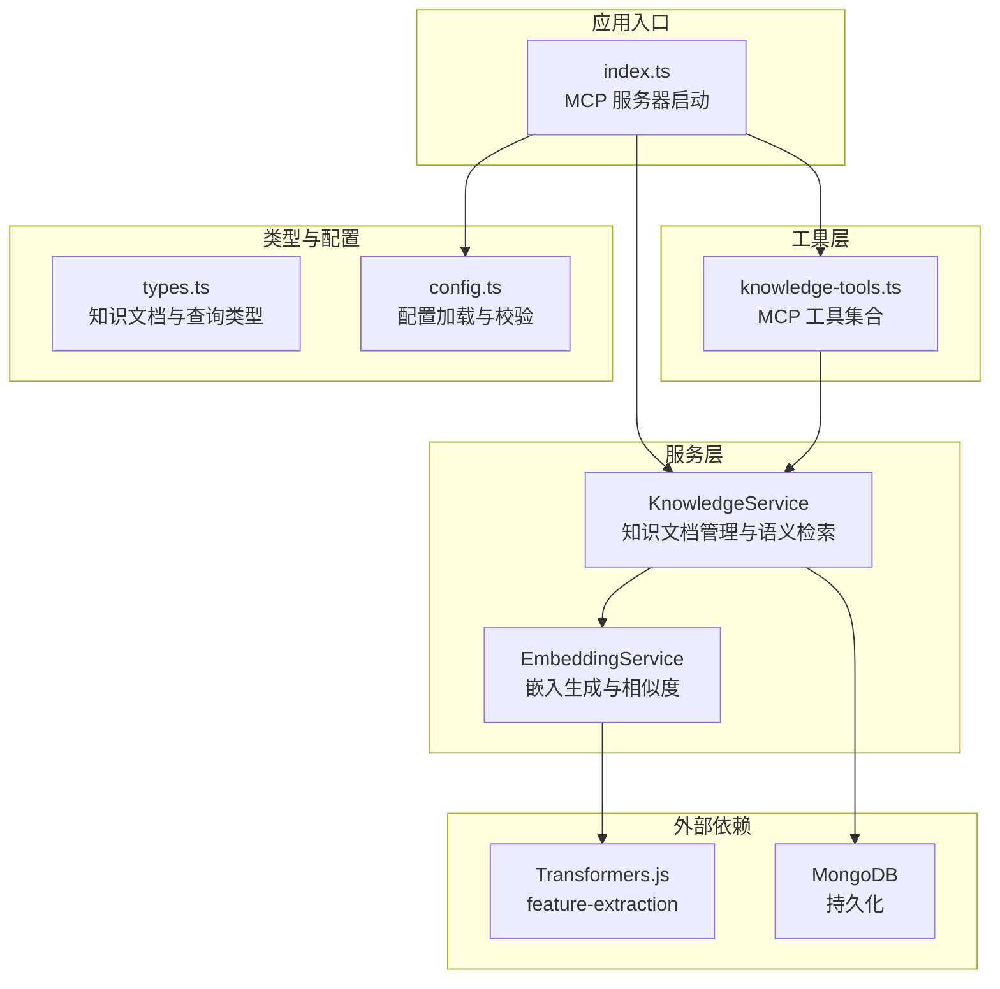
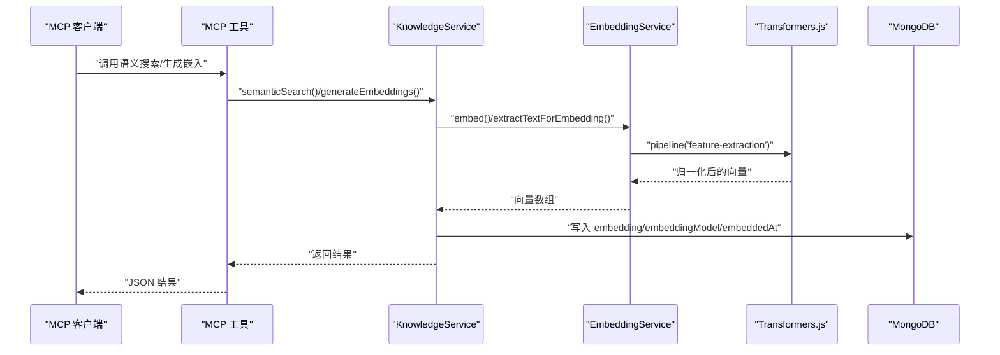
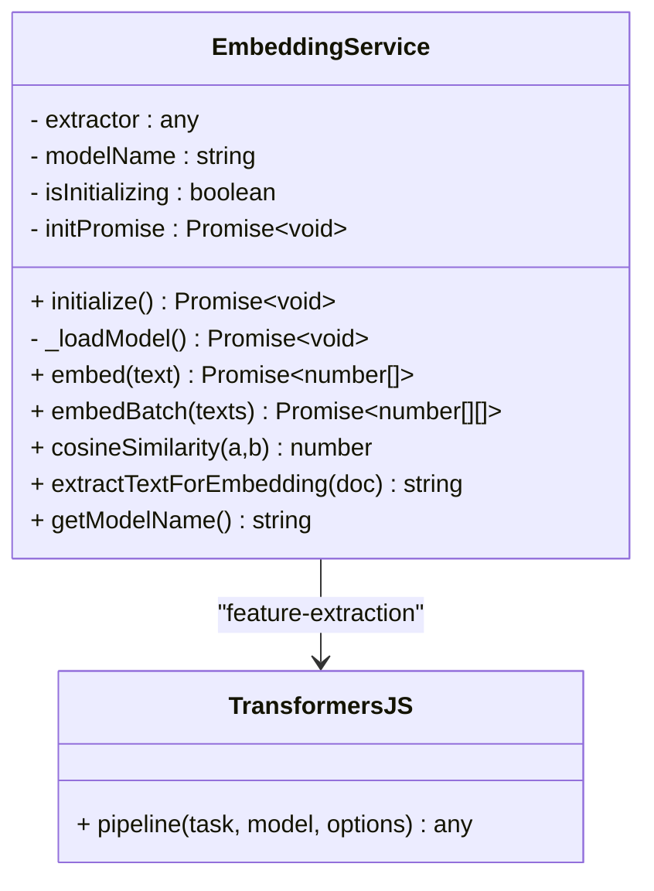
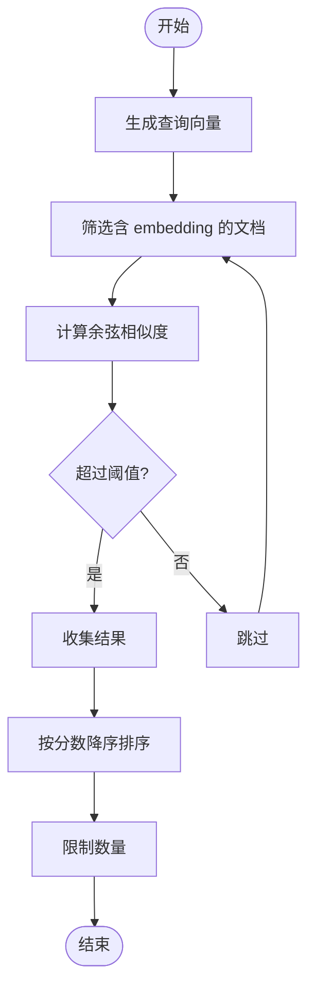
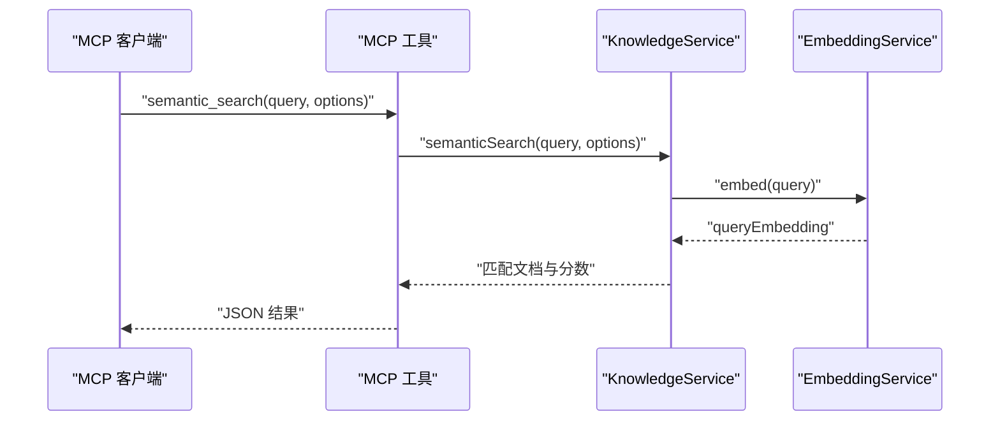
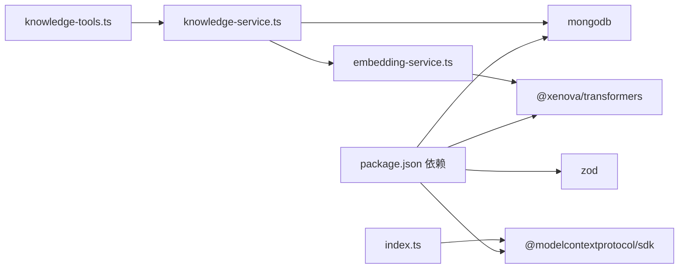

# 嵌入生成算法

<cite>
**本文引用的文件**
- [embedding-service.ts](file://src/services/embedding-service.ts)
- [knowledge-service.ts](file://src/services/knowledge-service.ts)
- [knowledge-tools.ts](file://src/tools/knowledge-tools.ts)
- [types.ts](file://src/types.ts)
- [config.ts](file://src/utils/config.ts)
- [index.ts](file://src/index.ts)
- [package.json](file://package.json)
- [mcp-config.json](file://examples/mcp-config.json)
</cite>

## 目录
1. [简介](#简介)
2. [项目结构](#项目结构)
3. [核心组件](#核心组件)
4. [架构总览](#架构总览)
5. [详细组件分析](#详细组件分析)
6. [依赖关系分析](#依赖关系分析)
7. [性能考量](#性能考量)
8. [故障排查指南](#故障排查指南)
9. [结论](#结论)
10. [附录](#附录)

## 简介
本文件面向嵌入生成算法的技术文档，围绕文本向量化、特征提取、向量归一化策略展开；同时覆盖批处理嵌入生成、异步处理与并发控制、输入文本预处理与截断策略、特殊字符处理、嵌入维度与精度控制、内存优化、批量性能调优、错误重试与超时处理、嵌入质量评估与相似度阈值设置、以及结果验证方法。文档以仓库中的实际实现为依据，结合架构图与流程图帮助读者全面理解系统设计与运行机制。

## 项目结构
该项目采用分层模块化组织，核心围绕“嵌入服务”“知识服务”“MCP 工具”“类型定义”“配置工具”展开，并通过 MCP SDK 以 stdio 模式对外提供工具能力。嵌入生成算法位于嵌入服务模块，知识服务负责文档生命周期与语义检索，MCP 工具封装了嵌入相关的工具接口。

图表来源
- [index.ts](file://src/index.ts#L1-L148)
- [knowledge-tools.ts](file://src/tools/knowledge-tools.ts#L1-L1093)
- [knowledge-service.ts](file://src/services/knowledge-service.ts#L1-L404)
- [embedding-service.ts](file://src/services/embedding-service.ts#L1-L148)
- [types.ts](file://src/types.ts#L1-L269)
- [config.ts](file://src/utils/config.ts#L1-L147)

章节来源
- [index.ts](file://src/index.ts#L1-L148)
- [embedding-service.ts](file://src/services/embedding-service.ts#L1-L148)
- [knowledge-service.ts](file://src/services/knowledge-service.ts#L1-L404)
- [knowledge-tools.ts](file://src/tools/knowledge-tools.ts#L1-L1093)
- [types.ts](file://src/types.ts#L1-L269)
- [config.ts](file://src/utils/config.ts#L1-L147)

## 核心组件
- 嵌入服务（EmbeddingService）：负责模型初始化、文本向量化、批量嵌入、余弦相似度计算、文档文本抽取与截断策略。
- 知识服务（KnowledgeService）：负责知识文档的增删改查、批量导入导出、语义搜索、嵌入生成与更新。
- MCP 工具（knowledge-tools.ts）：封装 CRUD、统计、快捷工具以及嵌入相关工具（语义搜索、批量生成嵌入）。
- 类型定义（types.ts）：统一知识文档结构、字段与查询选项，包括嵌入字段与阈值选项。
- 配置工具（config.ts）：从环境变量加载配置、校验与日志工具。

章节来源
- [embedding-service.ts](file://src/services/embedding-service.ts#L11-L148)
- [knowledge-service.ts](file://src/services/knowledge-service.ts#L20-L404)
- [knowledge-tools.ts](file://src/tools/knowledge-tools.ts#L29-L1093)
- [types.ts](file://src/types.ts#L24-L269)
- [config.ts](file://src/utils/config.ts#L76-L147)

## 架构总览
嵌入生成算法在系统中的位置如下：MCP 工具通过知识服务调用嵌入服务，嵌入服务使用 Transformers.js 的 feature-extraction 管道进行向量化，输出向量经归一化后写回知识库，用于后续语义检索。

图表来源
- [knowledge-tools.ts](file://src/tools/knowledge-tools.ts#L1002-L1088)
- [knowledge-service.ts](file://src/services/knowledge-service.ts#L272-L341)
- [embedding-service.ts](file://src/services/embedding-service.ts#L56-L65)

## 详细组件分析

### 嵌入服务（EmbeddingService）
- 模型初始化与懒加载：首次调用时加载 feature-extraction 模型，避免重复初始化；内部维护初始化状态与 Promise，防止并发重复加载。
- 文本向量化：调用 feature-extraction 管道，使用 mean 池化与归一化，输出向量数组。
- 批量嵌入：逐条调用单条嵌入，顺序执行（未并行）。
- 余弦相似度：手动实现点积与范数计算，确保向量长度一致。
- 文档文本抽取与截断：从文档的 name/description/content/tags 拼接文本，content 字符串与对象分别处理并限制长度。
- 模型名称与单例：提供 getModelName 与单例工厂，便于统一管理。

图表来源
- [embedding-service.ts](file://src/services/embedding-service.ts#L11-L148)

章节来源
- [embedding-service.ts](file://src/services/embedding-service.ts#L11-L148)

### 知识服务（KnowledgeService）
- 连接与索引：连接 MongoDB，创建用户级唯一索引、类型索引、标签索引、时间索引等。
- 语义搜索：生成查询向量，筛选已有 embedding 的文档，计算余弦相似度，按阈值与数量返回结果。
- 批量生成嵌入：遍历文档，抽取文本并生成嵌入，更新数据库字段。
- 创建带嵌入：创建文档时直接生成嵌入并写回。
- 其他 CRUD：提供创建、读取、更新、删除、列表、统计、导入导出、upsert 等完整能力。

图表来源
- [knowledge-service.ts](file://src/services/knowledge-service.ts#L272-L299)

章节来源
- [knowledge-service.ts](file://src/services/knowledge-service.ts#L20-L404)

### MCP 工具（knowledge-tools.ts）
- 通用 CRUD 工具：create/read/update/delete/list/stats/upsert。
- 快捷工具：memory_add/memory_search/experience_add/command_add/context_set/mcp_sync/rule_sync/skill_sync/workflow_create。
- 嵌入相关工具：semantic_search/generate_embeddings（仅在启用嵌入时加载）。
- 输入参数校验：使用 Zod Schema（在工具定义中声明），运行时由 MCP SDK 校验。

图表来源
- [knowledge-tools.ts](file://src/tools/knowledge-tools.ts#L1002-L1056)
- [knowledge-service.ts](file://src/services/knowledge-service.ts#L272-L299)

章节来源
- [knowledge-tools.ts](file://src/tools/knowledge-tools.ts#L29-L1093)

### 类型定义（types.ts）
- 知识文档结构：包含基础元数据、内容、标签、启用状态、用户与设备标识、同步版本、时间戳、嵌入字段与模型信息。
- 查询选项：ListOptions、SemanticSearchOptions，支持类型过滤、标签过滤、启用状态过滤、搜索关键词、分页与阈值。
- 联合类型：AnyKnowledgeDocument 覆盖八种知识类型。

章节来源
- [types.ts](file://src/types.ts#L24-L269)

### 配置工具（config.ts）
- 配置项：MongoDB 连接、数据库与集合、用户与设备标识、IDE 来源、嵌入开关、日志级别。
- 环境变量解析：IDE 来源、布尔值、日志级别校验与默认值。
- 配置校验：检查必填项。
- 日志工具：按级别输出。

章节来源
- [config.ts](file://src/utils/config.ts#L76-L147)

## 依赖关系分析
- 外部依赖：@xenova/transformers（feature-extraction）、mongodb（数据库）、@modelcontextprotocol/sdk（MCP 服务器）、zod（类型校验）。
- 内部依赖：嵌入服务被知识服务调用；知识服务被 MCP 工具调用；配置工具被入口程序加载。

图表来源
- [package.json](file://package.json#L30-L43)
- [embedding-service.ts](file://src/services/embedding-service.ts#L1-L1)
- [knowledge-service.ts](file://src/services/knowledge-service.ts#L1-L4)
- [index.ts](file://src/index.ts#L3-L11)
- [knowledge-tools.ts](file://src/tools/knowledge-tools.ts#L1-L2)

章节来源
- [package.json](file://package.json#L30-L43)

## 性能考量
- 模型初始化成本：首次调用时加载模型，建议在服务启动阶段预热或延迟到首次请求时触发，避免阻塞启动。
- 批处理策略：当前嵌入服务的 embedBatch 为顺序循环，未使用并发；对于大量文本，建议引入并发池（如固定并发数）与队列限流，避免瞬时高负载。
- 向量归一化：Transformers.js 在池化与归一化之间完成归一化，减少额外计算；若自定义实现，注意数值稳定性与零向量处理。
- 内存占用：向量数组为浮点数数组，单条向量大小取决于模型维度；建议在生成嵌入后及时写回数据库，避免长期驻留内存。
- 索引与查询：知识服务已创建多类索引，语义搜索前应确保 embedding 字段存在；可考虑为 embedding 建立向量索引（具体取决于 MongoDB 版本与扩展）。
- 并发控制：当前嵌入服务未显式并发控制；建议在知识服务批量生成嵌入时增加节流与错误重试，避免数据库压力过大。
- 超时与重试：可在工具层包装调用，设置超时与指数退避重试，提升稳定性。

[本节为通用性能建议，不直接分析具体文件]

## 故障排查指南
- 配置校验失败：检查 MONGO_URI、MONGO_DATABASE、MONGO_COLLECTION 是否正确设置；参考配置加载逻辑与校验函数。
- 语义搜索无结果：确认文档已生成嵌入且 embedding 字段存在；检查阈值设置是否过高。
- 嵌入生成异常：检查模型加载日志与网络访问；确认 feature-extraction 管道可用。
- 工具调用错误：查看 MCP 工具返回的错误消息；确认输入参数符合 Schema。

章节来源
- [config.ts](file://src/utils/config.ts#L96-L115)
- [knowledge-service.ts](file://src/services/knowledge-service.ts#L272-L299)
- [embedding-service.ts](file://src/services/embedding-service.ts#L41-L51)
- [knowledge-tools.ts](file://src/tools/knowledge-tools.ts#L103-L106)

## 结论
本系统以 Transformers.js 为核心实现文本向量化，结合 MongoDB 实现知识文档的全生命周期管理与语义检索。嵌入服务提供了模型懒加载、文本抽取与截断、向量归一化、余弦相似度计算与批量嵌入能力；知识服务负责嵌入生成与语义搜索；MCP 工具将这些能力暴露为可调用工具。通过合理的索引、阈值与批处理策略，可在保证检索质量的同时提升性能与稳定性。

[本节为总结性内容，不直接分析具体文件]

## 附录

### 文本预处理与截断策略
- 文本拼接：从 name/description/content/tags 拼接，content 支持字符串与对象（转为 JSON 后截断）。
- 截断长度：content 截断至约 1000 字符，避免过长文本影响嵌入质量与性能。
- 特殊字符处理：未见专门的特殊字符清洗逻辑，建议在上游或抽取阶段进行标准化处理（如去除多余空白、统一换行等）。

章节来源
- [embedding-service.ts](file://src/services/embedding-service.ts#L109-L129)

### 向量归一化与相似度
- 归一化：feature-extraction 管道启用 normalize，输出向量模长为 1。
- 相似度：余弦相似度通过点积与范数计算，注意零向量情况下的边界处理。

章节来源
- [embedding-service.ts](file://src/services/embedding-service.ts#L59-L64)
- [embedding-service.ts](file://src/services/embedding-service.ts#L85-L104)

### 批处理嵌入生成与并发控制
- 当前实现：顺序循环生成嵌入，适合小规模批量。
- 建议改进：引入并发池（如固定并发数）、队列限流、错误重试与超时控制，提升吞吐量与稳定性。

章节来源
- [embedding-service.ts](file://src/services/embedding-service.ts#L70-L80)
- [knowledge-service.ts](file://src/services/knowledge-service.ts#L313-L341)

### 嵌入维度、精度与内存优化
- 维度：模型维度取决于所选模型（默认模型为常见小型模型），可通过配置切换。
- 精度：归一化与 mean 池化已在管道内完成，减少额外计算。
- 内存：生成后立即写回数据库，避免长期驻留；建议在批量生成时分批处理并释放中间结果。

章节来源
- [embedding-service.ts](file://src/services/embedding-service.ts#L17-L19)
- [embedding-service.ts](file://src/services/embedding-service.ts#L45-L47)
- [knowledge-service.ts](file://src/services/knowledge-service.ts#L327-L336)

### 语义搜索阈值与结果验证
- 阈值：SemanticSearchOptions 支持 threshold，语义搜索会过滤低于阈值的结果。
- 结果验证：返回文档包含分数与基本信息，可用于人工抽样验证；建议建立指标（如召回率、准确率）评估效果。

章节来源
- [types.ts](file://src/types.ts#L264-L269)
- [knowledge-service.ts](file://src/services/knowledge-service.ts#L294-L296)

### 配置与部署参考
- 示例配置：提供多 IDE 的配置示例，包括本地开发与云数据库共享场景。
- 环境变量：MONGO_URI、MONGO_DATABASE、MONGO_COLLECTION、USER_ID、DEVICE_ID、IDE_SOURCE、ENABLE_EMBEDDING、LOG_LEVEL。

章节来源
- [mcp-config.json](file://examples/mcp-config.json#L1-L94)
- [config.ts](file://src/utils/config.ts#L76-L91)