# 性能优化策略

<cite>
**本文档引用的文件**
- [embedding-service.ts](file://src/services/embedding-service.ts)
- [knowledge-service.ts](file://src/services/knowledge-service.ts)
- [knowledge-tools.ts](file://src/tools/knowledge-tools.ts)
- [index.ts](file://src/index.ts)
- [config.ts](file://src/utils/config.ts)
- [types.ts](file://src/types.ts)
- [package.json](file://package.json)
- [mcp-config.json](file://examples/mcp-config.json)
- [tsconfig.json](file://tsconfig.json)
</cite>

## 目录
1. [简介](#简介)
2. [项目结构](#项目结构)
3. [核心组件](#核心组件)
4. [架构概览](#架构概览)
5. [详细组件分析](#详细组件分析)
6. [性能瓶颈识别](#性能瓶颈识别)
7. [监控指标](#监控指标)
8. [优化方案](#优化方案)
9. [缓存策略](#缓存策略)
10. [预热机制](#预热机制)
11. [批处理优化](#批处理优化)
12. [并发控制](#并发控制)
13. [资源池管理](#资源池管理)
14. [内存优化](#内存优化)
15. [性能基准测试](#性能基准测试)
16. [负载测试](#负载测试)
17. [压力测试](#压力测试)
18. [性能监控](#性能监控)
19. [告警机制](#告警机制)
20. [故障诊断](#故障诊断)
21. [结论](#结论)

## 简介

mongo-mcp 是一个基于 MongoDB 的 MCP（Model Context Protocol）服务器，提供了跨 IDE 的知识库管理能力。该系统支持多种知识类型（记忆、技能、规则、MCP、经验、命令、上下文、工作流），并通过向量嵌入实现语义搜索功能。

本文档专注于系统的性能优化策略，涵盖模型加载优化、缓存策略、预热机制、批处理调整、并发控制、资源池管理、内存使用优化、垃圾回收策略以及完整的性能测试和监控体系。

## 项目结构

```mermaid
graph TB
subgraph "应用层"
Index[src/index.ts<br/>主入口]
Tools[src/tools/knowledge-tools.ts<br/>工具集]
end
subgraph "服务层"
Embedding[src/services/embedding-service.ts<br/>嵌入服务]
Knowledge[src/services/knowledge-service.ts<br/>知识库服务]
end
subgraph "工具层"
Config[src/utils/config.ts<br/>配置管理]
end
subgraph "数据层"
Types[src/types.ts<br/>类型定义]
Mongo[MongoDB<br/>数据库]
end
subgraph "外部依赖"
Transformers[@xenova/transformers<br/>模型库]
MCP[@modelcontextprotocol/sdk<br/>MCP协议]
MongoDriver[mongodb<br/>驱动程序]
end
Index --> Tools
Tools --> Knowledge
Knowledge --> Embedding
Knowledge --> Mongo
Embedding --> Transformers
Index --> MCP
Knowledge --> MongoDriver
Config --> Index
```

**图表来源**
- [index.ts](file://src/index.ts#L1-L148)
- [knowledge-service.ts](file://src/services/knowledge-service.ts#L1-L404)
- [embedding-service.ts](file://src/services/embedding-service.ts#L1-L148)

**章节来源**
- [index.ts](file://src/index.ts#L1-L148)
- [package.json](file://package.json#L1-L48)

## 核心组件

### 嵌入服务 (EmbeddingService)

嵌入服务是系统的核心性能组件，负责：
- 模型懒加载和初始化
- 文本向量嵌入生成
- 批量处理优化
- 余弦相似度计算

### 知识库服务 (KnowledgeService)

知识库服务提供完整的 CRUD 操作和高级功能：
- 多种知识类型的管理
- 语义搜索功能
- 批量导入导出
- 用户上下文隔离

### 工具集 (KnowledgeTools)

工具集定义了完整的 MCP 接口：
- 标准 CRUD 操作
- 快捷工具（记忆、经验、命令等）
- 高级功能（语义搜索、嵌入生成）

**章节来源**
- [embedding-service.ts](file://src/services/embedding-service.ts#L11-L148)
- [knowledge-service.ts](file://src/services/knowledge-service.ts#L20-L404)
- [knowledge-tools.ts](file://src/tools/knowledge-tools.ts#L29-L1093)

## 架构概览

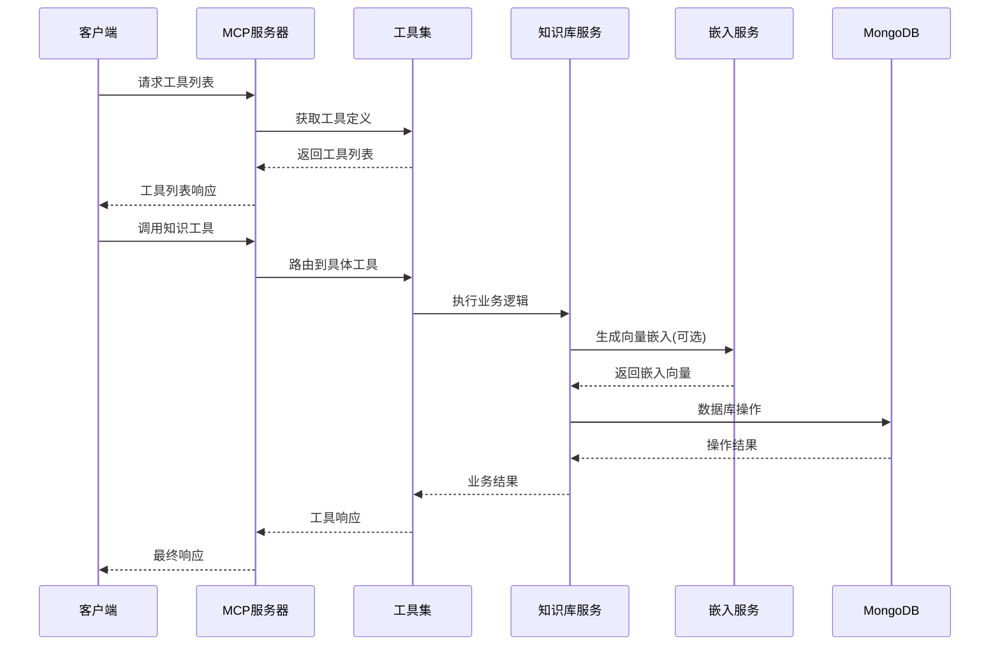
```mermaid
sequenceDiagram
participant Client as 客户端
participant Server as MCP服务器
participant Tools as 工具集
participant Knowledge as 知识库服务
participant Embedding as 嵌入服务
participant DB as MongoDB
Client->>Server : 请求工具列表
Server->>Tools : 获取工具定义
Tools-->>Server : 返回工具列表
Server-->>Client : 工具列表响应
Client->>Server : 调用知识工具
Server->>Tools : 路由到具体工具
Tools->>Knowledge : 执行业务逻辑
Knowledge->>Embedding : 生成向量嵌入(可选)
Embedding-->>Knowledge : 返回嵌入向量
Knowledge->>DB : 数据库操作
DB-->>Knowledge : 操作结果
Knowledge-->>Tools : 业务结果
Tools-->>Server : 工具响应
Server-->>Client : 最终响应
```

**图表来源**
- [index.ts](file://src/index.ts#L16-L82)
- [knowledge-tools.ts](file://src/tools/knowledge-tools.ts#L36-L107)
- [knowledge-service.ts](file://src/services/knowledge-service.ts#L111-L127)

## 详细组件分析

### 嵌入服务架构

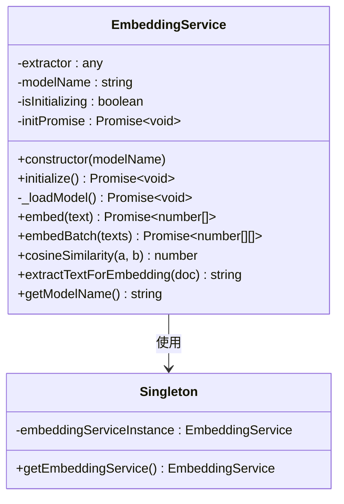
```mermaid
classDiagram
class EmbeddingService {
-extractor : any
-modelName : string
-isInitializing : boolean
-initPromise : Promise~void~
+constructor(modelName)
+initialize() Promise~void~
-_loadModel() Promise~void~
+embed(text) Promise~number[]~
+embedBatch(texts) Promise~number[][]~
+cosineSimilarity(a, b) number
+extractTextForEmbedding(doc) string
+getModelName() string
}
class Singleton {
-embeddingServiceInstance : EmbeddingService
+getEmbeddingService() EmbeddingService
}
EmbeddingService --> Singleton : 使用
```

**图表来源**
- [embedding-service.ts](file://src/services/embedding-service.ts#L11-L148)

### 知识库服务架构

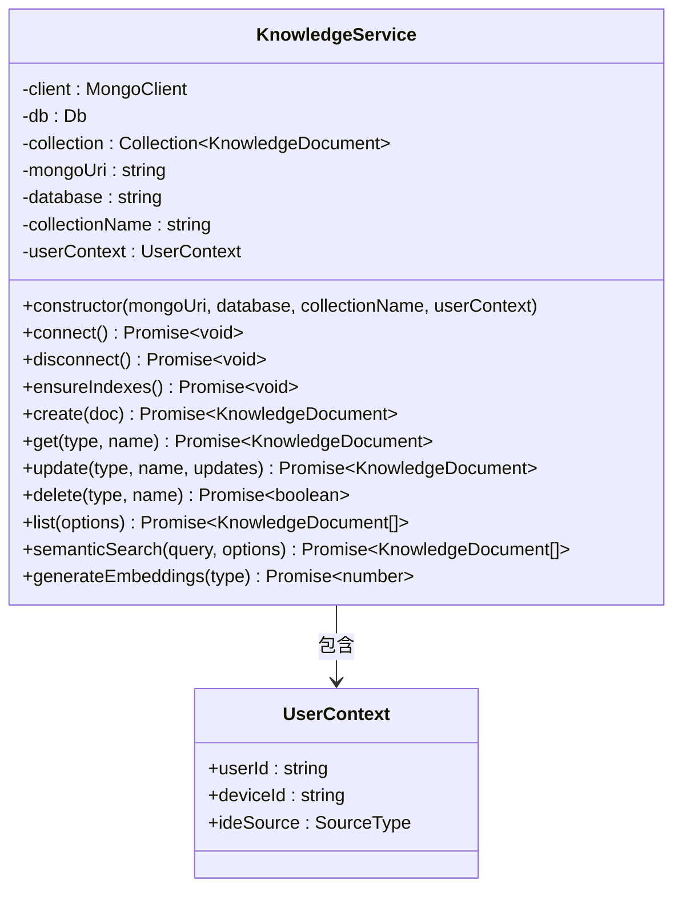
```mermaid
classDiagram
class KnowledgeService {
-client : MongoClient
-db : Db
-collection : Collection~KnowledgeDocument~
-mongoUri : string
-database : string
-collectionName : string
-userContext : UserContext
+constructor(mongoUri, database, collectionName, userContext)
+connect() Promise~void~
+disconnect() Promise~void~
+ensureIndexes() Promise~void~
+create(doc) Promise~KnowledgeDocument~
+get(type, name) Promise~KnowledgeDocument~
+update(type, name, updates) Promise~KnowledgeDocument~
+delete(type, name) Promise~boolean~
+list(options) Promise~KnowledgeDocument[]~
+semanticSearch(query, options) Promise~KnowledgeDocument[]~
+generateEmbeddings(type) Promise~number~
}
class UserContext {
+userId : string
+deviceId : string
+ideSource : SourceType
}
KnowledgeService --> UserContext : 包含
```

**图表来源**
- [knowledge-service.ts](file://src/services/knowledge-service.ts#L20-L404)

**章节来源**
- [embedding-service.ts](file://src/services/embedding-service.ts#L1-L148)
- [knowledge-service.ts](file://src/services/knowledge-service.ts#L1-L404)

## 性能瓶颈识别

### 模型加载瓶颈

嵌入服务的模型加载是主要性能瓶颈：
- **初始化延迟**：首次加载模型需要数秒时间
- **内存占用**：预训练模型占用大量内存
- **CPU 密集型**：向量化计算消耗 CPU 资源

### 数据库操作瓶颈

知识库服务的数据库操作存在以下问题：
- **单次查询**：批量操作未使用聚合管道
- **索引利用不足**：部分查询未充分利用现有索引
- **网络往返**：频繁的数据库往返操作

### 并发处理瓶颈

系统在高并发场景下的问题：
- **模型实例竞争**：多个并发请求同时初始化模型
- **数据库连接池**：默认连接池配置可能不足
- **内存泄漏风险**：长时间运行可能导致内存累积

**章节来源**
- [embedding-service.ts](file://src/services/embedding-service.ts#L41-L51)
- [knowledge-service.ts](file://src/services/knowledge-service.ts#L272-L299)

## 监控指标

### 关键性能指标

| 指标类别 | 指标名称 | 测量方法 | 告警阈值 |
|---------|---------|---------|---------|
| 模型加载 | 初始化时间(ms) | 记录模型加载开始和结束时间 | > 5000ms |
| 模型加载 | 内存使用(MB) | V8 heapUsed + external | > 1000MB |
| 嵌入生成 | 单次处理时间(ms) | 记录 embed() 调用耗时 | > 100ms |
| 嵌入生成 | 批量处理吞吐量 | 每秒处理文档数 | < 50 docs/sec |
| 数据库操作 | 查询响应时间(ms) | 记录数据库查询耗时 | > 200ms |
| 数据库操作 | 连接池利用率(%) | 已使用连接数/总连接数 | > 80% |
| 并发处理 | 请求队列长度 | 等待处理的请求数 | > 100 |
| 并发处理 | 错误率(%) | 异常请求比例 | > 5% |

### 监控数据结构

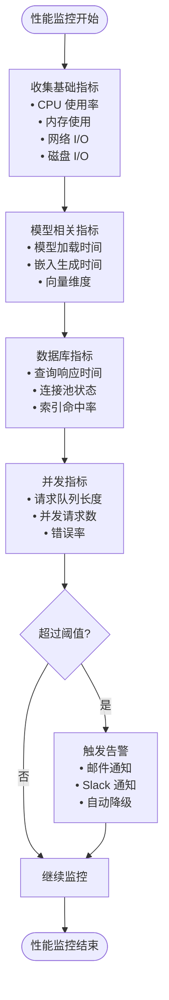
```mermaid
flowchart TD
Start([性能监控开始]) --> Metrics["收集基础指标<br/>• CPU 使用率<br/>• 内存使用<br/>• 网络 I/O<br/>• 磁盘 I/O"]
Metrics --> ModelMetrics["模型相关指标<br/>• 模型加载时间<br/>• 嵌入生成时间<br/>• 向量维度"]
ModelMetrics --> DBMetrics["数据库指标<br/>• 查询响应时间<br/>• 连接池状态<br/>• 索引命中率"]
DBMetrics --> ConcurrencyMetrics["并发指标<br/>• 请求队列长度<br/>• 并发请求数<br/>• 错误率"]
ConcurrencyMetrics --> Alert{"超过阈值?"}
Alert --> |是| AlertAction["触发告警<br/>• 邮件通知<br/>• Slack 通知<br/>• 自动降级"]
Alert --> |否| Continue["继续监控"]
AlertAction --> Continue
Continue --> End([性能监控结束])
```

**图表来源**
- [embedding-service.ts](file://src/services/embedding-service.ts#L42-L50)
- [knowledge-service.ts](file://src/services/knowledge-service.ts#L272-L299)

**章节来源**
- [embedding-service.ts](file://src/services/embedding-service.ts#L41-L51)
- [knowledge-service.ts](file://src/services/knowledge-service.ts#L272-L299)

## 优化方案

### 模型加载优化

#### 1. 模型预加载策略

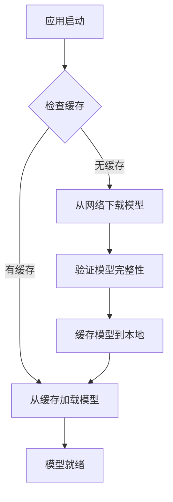
```mermaid
flowchart TD
Init[应用启动] --> CheckCache{"检查缓存"}
CheckCache --> |有缓存| LoadFromCache["从缓存加载模型"]
CheckCache --> |无缓存| LoadFromNetwork["从网络下载模型"]
LoadFromNetwork --> VerifyHash["验证模型完整性"]
VerifyHash --> CacheModel["缓存模型到本地"]
CacheModel --> LoadFromCache
LoadFromCache --> Ready[模型就绪]
```

**图表来源**
- [embedding-service.ts](file://src/services/embedding-service.ts#L24-L39)

#### 2. 模型量化优化

- **量化设置**：使用 `quantized: true` 减少模型大小
- **WASM 线程**：设置 `numThreads = 1` 避免过度并行
- **禁用本地模型**：防止不必要的本地文件访问

#### 3. 模型版本管理

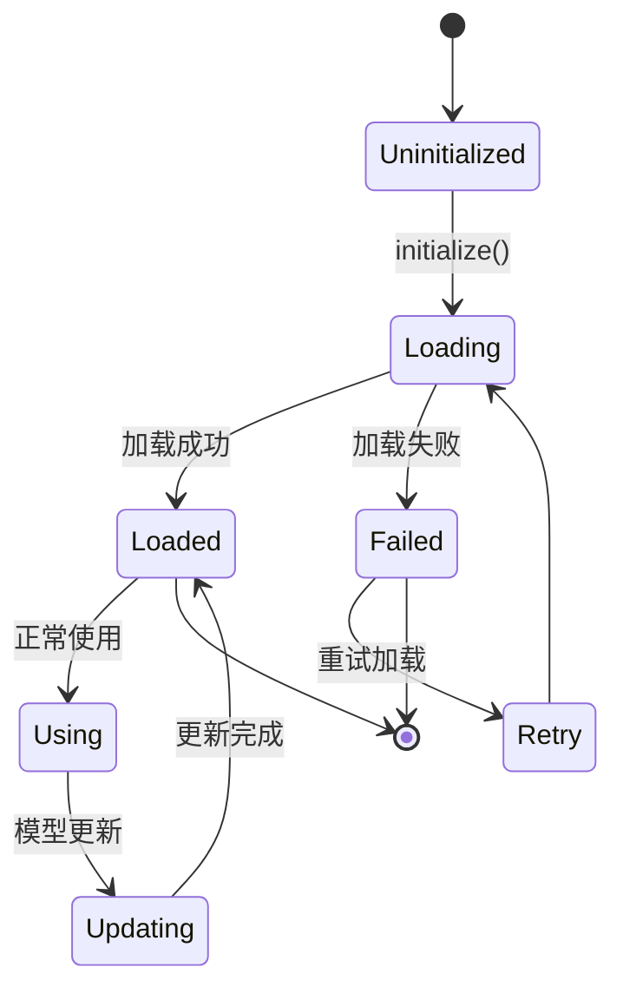
```mermaid
stateDiagram-v2
[*] --> Uninitialized
Uninitialized --> Loading : initialize()
Loading --> Loaded : 加载成功
Loading --> Failed : 加载失败
Loaded --> Using : 正常使用
Using --> Updating : 模型更新
Updating --> Loaded : 更新完成
Failed --> Retry : 重试加载
Retry --> Loading
Failed --> [*]
Loaded --> [*]
```

**图表来源**
- [embedding-service.ts](file://src/services/embedding-service.ts#L24-L39)

### 缓存策略

#### 1. 多层缓存架构

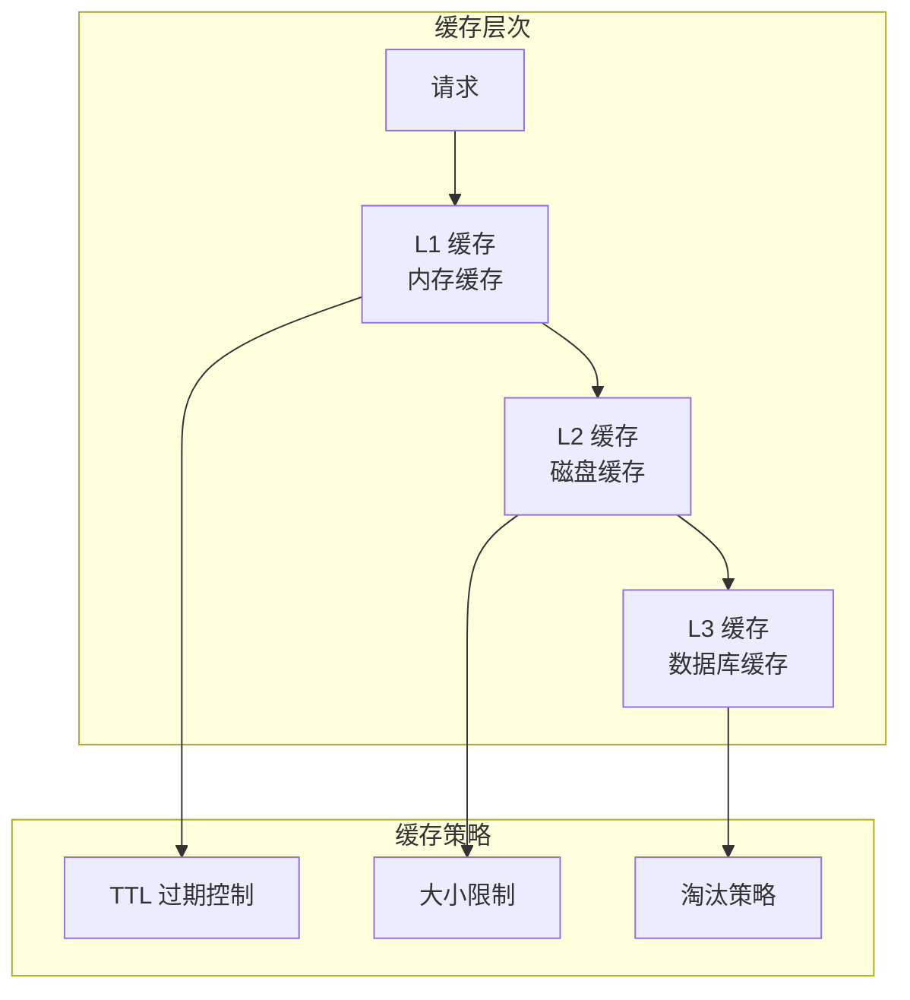
```mermaid
graph TB
subgraph "缓存层次"
Request[请求] --> L1Cache[L1 缓存<br/>内存缓存]
L1Cache --> L2Cache[L2 缓存<br/>磁盘缓存]
L2Cache --> L3Cache[L3 缓存<br/>数据库缓存]
end
subgraph "缓存策略"
L1Cache --> TTL[TTL 过期控制]
L2Cache --> SizeLimit[大小限制]
L3Cache --> Eviction[淘汰策略]
end
```

#### 2. 嵌入向量缓存

- **内存缓存**：最近使用的嵌入向量
- **持久化缓存**：数据库中存储的向量
- **LRU 淘汰**：基于使用频率的缓存淘汰

#### 3. 查询结果缓存

- **语义搜索结果**：热门查询的缓存
- **文档内容缓存**：频繁访问的文档内容
- **工具调用缓存**：重复工具调用的结果

**章节来源**
- [embedding-service.ts](file://src/services/embedding-service.ts#L4-L6)
- [knowledge-service.ts](file://src/services/knowledge-service.ts#L272-L299)

### 预热机制

#### 1. 启动预热

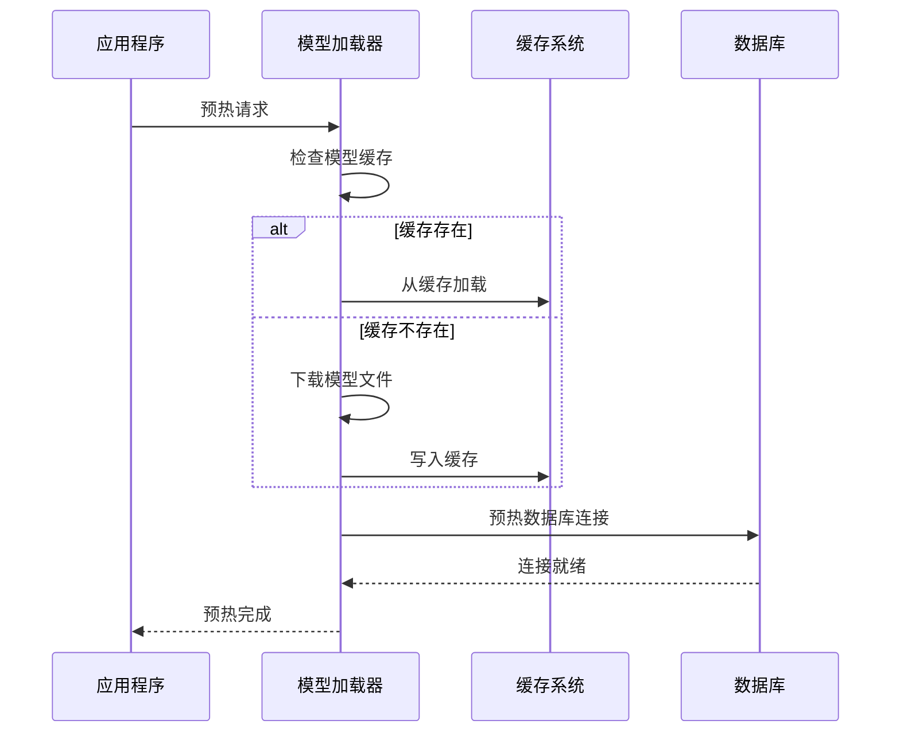
```mermaid
sequenceDiagram
participant App as 应用程序
participant Loader as 模型加载器
participant Cache as 缓存系统
participant DB as 数据库
App->>Loader : 预热请求
Loader->>Loader : 检查模型缓存
alt 缓存存在
Loader->>Cache : 从缓存加载
else 缓存不存在
Loader->>Loader : 下载模型文件
Loader->>Cache : 写入缓存
end
Loader->>DB : 预热数据库连接
DB-->>Loader : 连接就绪
Loader-->>App : 预热完成
```

#### 2. 周期性预热

- **定时任务**：每小时检查模型状态
- **健康检查**：验证模型可用性
- **自动重启**：异常情况下的自动恢复

### 批处理优化

#### 1. 批处理策略

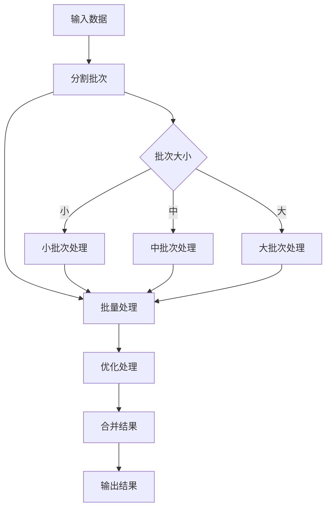
```mermaid
flowchart TD
Input[输入数据] --> Split["分割批次"]
Split --> Process["批量处理"]
Process --> Optimize["优化处理"]
Optimize --> Merge["合并结果"]
Merge --> Output[输出结果]
Split --> BatchSize{"批次大小"}
BatchSize --> |小| SmallBatch["小批次处理"]
BatchSize --> |中| MediumBatch["中批次处理"]
BatchSize --> |大| LargeBatch["大批次处理"]
SmallBatch --> Process
MediumBatch --> Process
LargeBatch --> Process
```

#### 2. 批处理参数调优

| 指标 | 小批次 | 中批次 | 大批次 |
|------|--------|--------|--------|
| 处理时间 | 快 | 中等 | 较慢 |
| 内存使用 | 低 | 中等 | 高 |
| 吞吐量 | 低 | 高 | 中等 |
| 延迟 | 低 | 中等 | 高 |

#### 3. 动态批处理

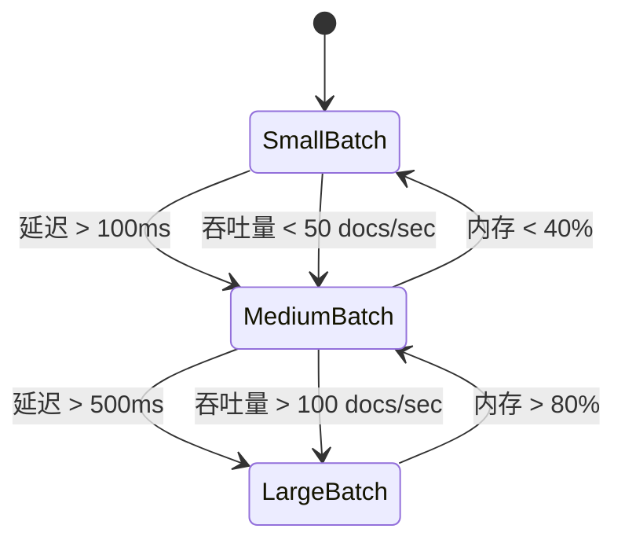
```mermaid
stateDiagram-v2
[*] --> SmallBatch
SmallBatch --> MediumBatch : 延迟 > 100ms
MediumBatch --> LargeBatch : 延迟 > 500ms
LargeBatch --> MediumBatch : 内存 > 80%
MediumBatch --> SmallBatch : 内存 < 40%
SmallBatch --> MediumBatch : 吞吐量 < 50 docs/sec
MediumBatch --> LargeBatch : 吞吐量 > 100 docs/sec
```

**章节来源**
- [embedding-service.ts](file://src/services/embedding-service.ts#L70-L80)
- [knowledge-service.ts](file://src/services/knowledge-service.ts#L313-L341)

### 并发控制

#### 1. 信号量模式

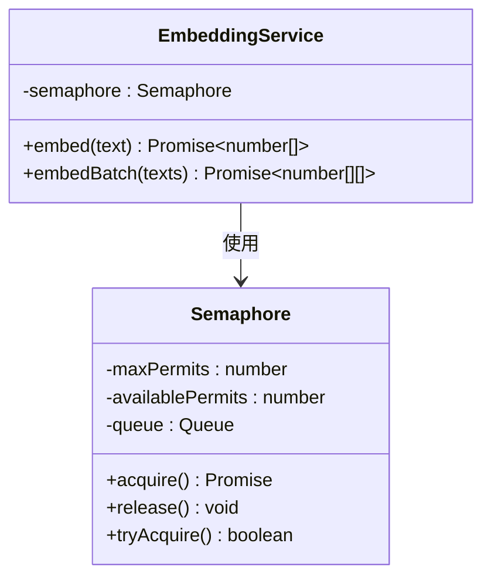
```mermaid
classDiagram
class Semaphore {
-maxPermits : number
-availablePermits : number
-queue : Queue
+acquire() Promise
+release() void
+tryAcquire() boolean
}
class EmbeddingService {
-semaphore : Semaphore
+embed(text) Promise~number[]~
+embedBatch(texts) Promise~number[][]~
}
EmbeddingService --> Semaphore : 使用
```

#### 2. 并发限制策略

- **模型并发**：限制同时使用模型的线程数
- **数据库并发**：控制数据库连接数
- **内存并发**：监控内存使用避免溢出

#### 3. 优雅降级

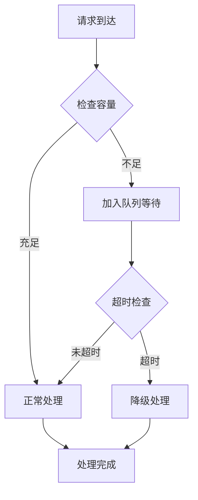
```mermaid
flowchart TD
Request[请求到达] --> CheckCapacity{"检查容量"}
CheckCapacity --> |充足| Process[正常处理]
CheckCapacity --> |不足| Queue[加入队列等待]
Queue --> Timeout{"超时检查"}
Timeout --> |超时| Fallback[降级处理]
Timeout --> |未超时| Process
Process --> Complete[处理完成]
Fallback --> Complete
```

**章节来源**
- [embedding-service.ts](file://src/services/embedding-service.ts#L14-L15)
- [knowledge-service.ts](file://src/services/knowledge-service.ts#L272-L299)

### 资源池管理

#### 1. 数据库连接池

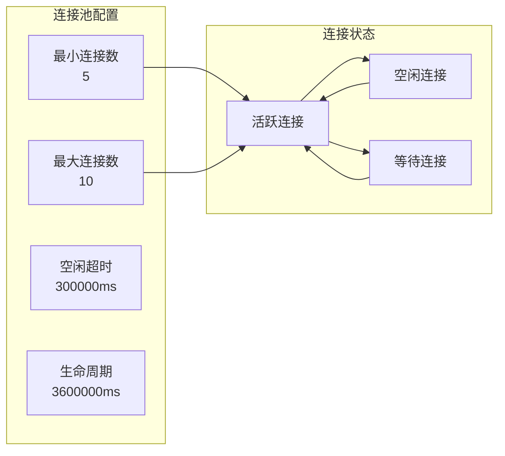
```mermaid
graph LR
subgraph "连接池配置"
MinPoolSize[最小连接数<br/>5]
MaxPoolSize[最大连接数<br/>10]
MaxIdleTimeMS[空闲超时<br/>300000ms]
MaxLifeTimeMS[生命周期<br/>3600000ms]
end
subgraph "连接状态"
Active[活跃连接]
Idle[空闲连接]
Waiting[等待连接]
end
MinPoolSize --> Active
MaxPoolSize --> Active
Active --> Idle
Idle --> Active
Active --> Waiting
Waiting --> Active
```

#### 2. 内存池管理

- **对象池**：复用嵌入向量对象
- **缓冲区池**：管理内存缓冲区
- **垃圾回收**：定期清理无用对象

#### 3. 线程池管理

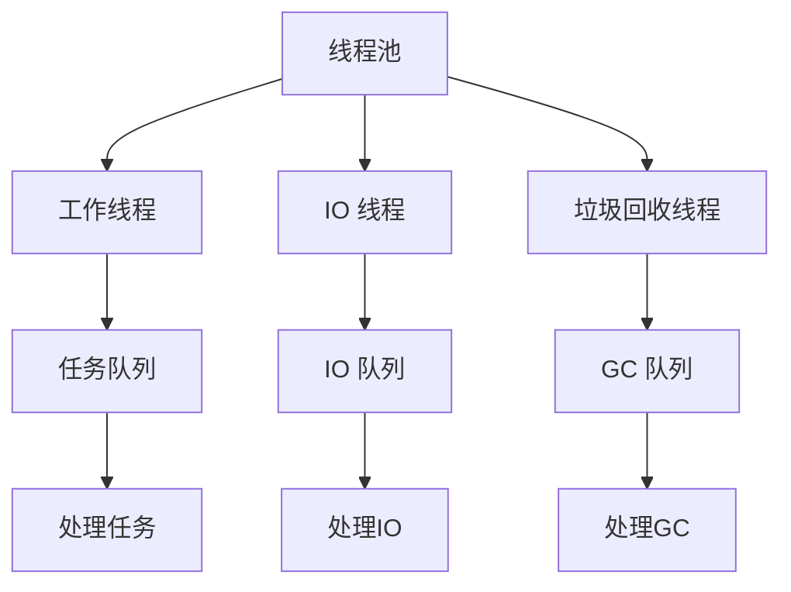
```mermaid
flowchart TD
ThreadPool[线程池] --> WorkerThreads[工作线程]
ThreadPool --> IOThreads[IO 线程]
ThreadPool --> GCThreads[垃圾回收线程]
WorkerThreads --> TaskQueue[任务队列]
IOThreads --> IOQueue[IO 队列]
GCThreads --> GCQueue[GC 队列]
TaskQueue --> ProcessTask[处理任务]
IOQueue --> ProcessIO[处理IO]
GCQueue --> ProcessGC[处理GC]
```

**章节来源**
- [knowledge-service.ts](file://src/services/knowledge-service.ts#L44-L54)
- [embedding-service.ts](file://src/services/embedding-service.ts#L6)

## 内存优化

### 内存使用分析

#### 1. 内存分配模式

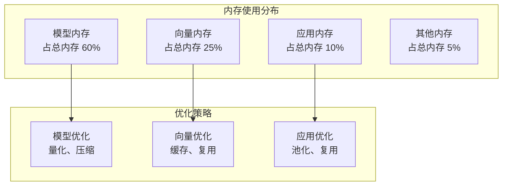
```mermaid
graph TB
subgraph "内存使用分布"
ModelMemory[模型内存<br/>占总内存 60%]
VectorMemory[向量内存<br/>占总内存 25%]
AppMemory[应用内存<br/>占总内存 10%]
OtherMemory[其他内存<br/>占总内存 5%]
end
subgraph "优化策略"
ModelOptimization[模型优化<br/>量化、压缩]
VectorOptimization[向量优化<br/>缓存、复用]
AppOptimization[应用优化<br/>池化、复用]
end
ModelMemory --> ModelOptimization
VectorMemory --> VectorOptimization
AppMemory --> AppOptimization
```

#### 2. 内存泄漏防护

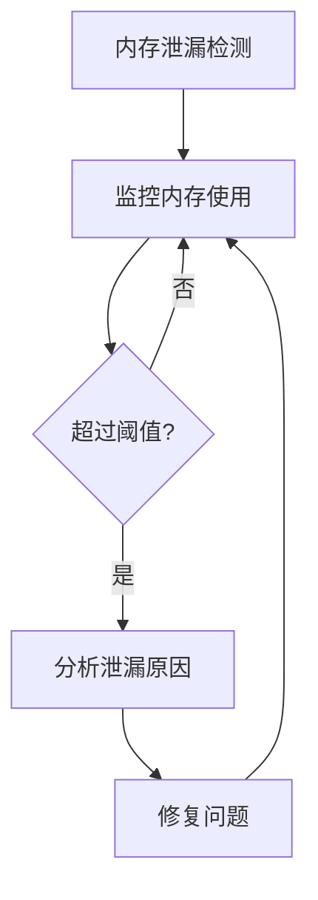
```mermaid
flowchart TD
MemoryLeak[内存泄漏检测] --> Monitor[监控内存使用]
Monitor --> Threshold{超过阈值?}
Threshold --> |是| Analyze[分析泄漏原因]
Threshold --> |否| Monitor
Analyze --> Fix[修复问题]
Fix --> Monitor
```

#### 3. 垃圾回收优化

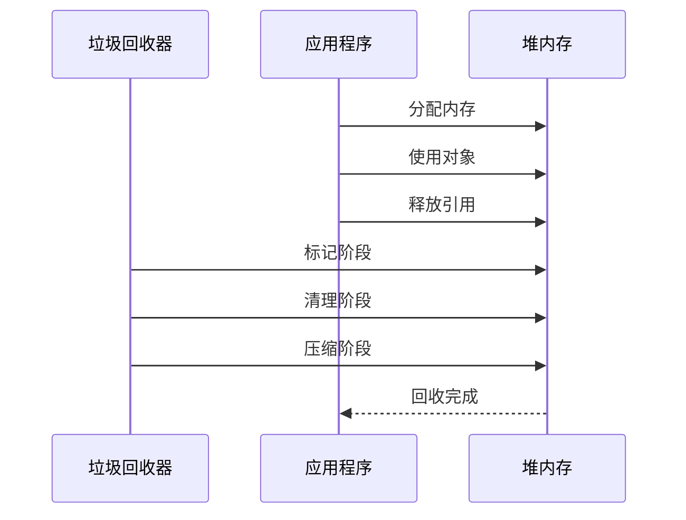
```mermaid
sequenceDiagram
participant GC as 垃圾回收器
participant App as 应用程序
participant Heap as 堆内存
App->>Heap : 分配内存
App->>Heap : 使用对象
App->>Heap : 释放引用
GC->>Heap : 标记阶段
GC->>Heap : 清理阶段
GC->>Heap : 压缩阶段
Heap-->>App : 回收完成
```

### 内存优化策略

#### 1. 对象复用

- **向量对象池**：复用嵌入向量数组
- **字符串缓存**：缓存常用的文本内容
- **工具实例池**：复用工具调用实例

#### 2. 内存映射

- **大文件处理**：使用流式处理避免大对象
- **分页加载**：数据库查询使用分页
- **延迟加载**：按需加载非关键数据

#### 3. 内存监控

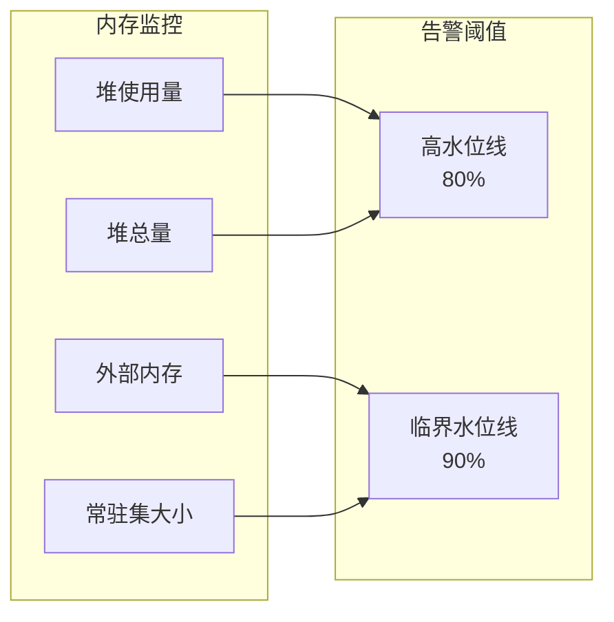
```mermaid
graph LR
subgraph "内存监控"
HeapUsed[堆使用量]
HeapTotal[堆总量]
External[外部内存]
RSS[常驻集大小]
end
subgraph "告警阈值"
HighWatermark[高水位线<br/>80%]
CriticalWatermark[临界水位线<br/>90%]
end
HeapUsed --> HighWatermark
HeapTotal --> HighWatermark
External --> CriticalWatermark
RSS --> CriticalWatermark
```

**章节来源**
- [embedding-service.ts](file://src/services/embedding-service.ts#L4-L6)
- [knowledge-service.ts](file://src/services/knowledge-service.ts#L272-L299)

## 性能基准测试

### 基准测试框架

#### 1. 测试环境配置

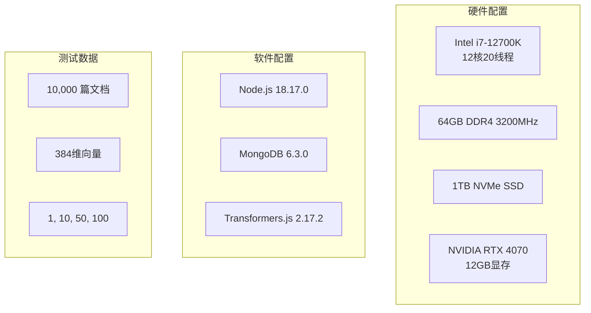
```mermaid
graph TB
subgraph "硬件配置"
CPU[Intel i7-12700K<br/>12核20线程]
RAM[64GB DDR4 3200MHz]
SSD[1TB NVMe SSD]
GPU[NVIDIA RTX 4070<br/>12GB显存]
end
subgraph "软件配置"
NodeJS[Node.js 18.17.0]
MongoDB[MongoDB 6.3.0]
Transformers[Transformers.js 2.17.2]
end
subgraph "测试数据"
TestDocs[10,000 篇文档]
EmbeddingDim[384维向量]
BatchSizes[1, 10, 50, 100]
end
```

#### 2. 基准测试指标

| 测试类型 | 指标 | 目标值 | 测试方法 |
|---------|------|--------|----------|
| 模型加载 | 首次加载时间 | < 5s | 记录初始化耗时 |
| 模型加载 | 内存峰值 | < 1GB | 监控内存使用 |
| 嵌入生成 | 单次处理时间 | < 100ms | 测量 embed() 耗时 |
| 嵌入生成 | 批处理吞吐量 | > 50 docs/sec | 统计处理速度 |
| 数据库查询 | 查询响应时间 | < 200ms | 测量数据库操作 |
| 并发处理 | QPS | > 100 req/sec | 压力测试 |
| 内存使用 | 峰值内存 | < 1GB | 监控内存峰值 |

#### 3. 基准测试脚本

```mermaid
flowchart TD
Start[开始基准测试] --> Setup[设置测试环境]
Setup --> Warmup[预热阶段<br/>1分钟]
Warmup --> Test1[模型加载测试]
Test1 --> Test2[嵌入生成测试]
Test2 --> Test3[数据库操作测试]
Test3 --> Test4[并发处理测试]
Test4 --> Analyze[分析结果]
Analyze --> Report[生成报告]
Report --> End[测试完成]
```

**章节来源**
- [embedding-service.ts](file://src/services/embedding-service.ts#L42-L50)
- [knowledge-service.ts](file://src/services/knowledge-service.ts#L272-L299)

### 性能回归测试

#### 1. 自动化测试流程

```mermaid
sequenceDiagram
participant CI as CI 系统
participant Test as 基准测试
participant Compare as 结果对比
participant Alert as 告警系统
CI->>Test : 触发基准测试
Test->>Test : 执行性能测试
Test->>Compare : 比较基准值
Compare->>Alert : 发现回归
Alert->>CI : 触发告警
CI->>Compare : 生成报告
Compare-->>CI : 测试结果
```

#### 2. 回归检测算法

- **统计分析**：比较均值、标准差
- **趋势分析**：检测性能趋势变化
- **机器学习**：使用异常检测算法

## 负载测试

### 负载测试设计

#### 1. 负载场景定义

```mermaid
graph TB
subgraph "负载场景"
NormalLoad[正常负载<br/>100 QPS]
SpikeLoad[尖峰负载<br/>500 QPS]
StressLoad[压力负载<br/>1000 QPS]
FailureLoad[故障负载<br/>模拟网络延迟]
end
subgraph "测试指标"
Latency[延迟分布]
Throughput[吞吐量]
ErrorRate[错误率]
ResourceUtilization[资源利用率]
end
NormalLoad --> Latency
SpikeLoad --> Throughput
StressLoad --> ErrorRate
FailureLoad --> ResourceUtilization
```

#### 2. 负载生成策略

```mermaid
flowchart TD
LoadGen[负载生成器] --> Normal[正常流量]
LoadGen --> Spike[尖峰流量]
LoadGen --> Stress[压力流量]
Normal --> ToolCalls[工具调用]
Spike --> ToolCalls
Stress --> ToolCalls
ToolCalls --> EmbeddingOps[嵌入操作]
ToolCalls --> DBOps[数据库操作]
ToolCalls --> MixedOps[混合操作]
```

#### 3. 负载测试工具

- **Artillery**：HTTP 和 WebSocket 负载测试
- **k6**：现代化负载测试工具
- **JMeter**：企业级负载测试框架

### 负载测试执行

#### 1. 测试执行流程

```mermaid
sequenceDiagram
participant Tester as 测试执行器
participant Target as 目标系统
participant Monitor as 监控器
participant Reporter as 报告器
Tester->>Target : 发送负载请求
Target->>Monitor : 收集性能指标
Monitor->>Tester : 实时性能数据
Tester->>Reporter : 生成测试报告
Reporter-->>Tester : 测试结果
```

#### 2. 测试结果分析

- **延迟分布**：P50、P90、P99 延迟
- **吞吐量曲线**：随负载变化的吞吐量
- **错误率趋势**：不同负载下的错误率
- **资源使用趋势**：CPU、内存、网络使用

**章节来源**
- [embedding-service.ts](file://src/services/embedding-service.ts#L56-L65)
- [knowledge-service.ts](file://src/services/knowledge-service.ts#L111-L127)

## 压力测试

### 压力测试策略

#### 1. 压力测试场景

```mermaid
graph TB
subgraph "压力测试场景"
ExtremeLoad[极端负载<br/>2000 QPS]
MemoryStress[内存压力<br/>模拟内存不足]
CPUStress[CPU压力<br/>模拟高CPU使用]
NetworkStress[网络压力<br/>模拟网络延迟]
DiskStress[磁盘压力<br/>模拟磁盘I/O瓶颈]
end
subgraph "测试目标"
Stability[系统稳定性]
Recovery[恢复能力]
Degradation[降级策略]
Failure[故障处理]
end
ExtremeLoad --> Stability
MemoryStress --> Recovery
CPUStress --> Degradation
NetworkStress --> Failure
DiskStress --> Stability
```

#### 2. 压力测试执行

```mermaid
flowchart TD
Start[开始压力测试] --> RampUp[逐步增加负载]
RampUp --> Peak[达到峰值负载]
Peak --> Hold[保持峰值负载]
Hold --> GradualDown[逐步降低负载]
GradualDown --> Complete[测试完成]
RampUp --> Monitor[监控系统状态]
Peak --> Monitor
Hold --> Monitor
GradualDown --> Monitor
Monitor --> Alert{异常?}
Alert --> |是| Investigate[调查问题]
Alert --> |否| Continue[继续测试]
Investigate --> Continue
```

#### 3. 压力测试指标

| 指标 | 正常值 | 告警值 | 严重值 |
|------|--------|--------|--------|
| 响应时间 | < 100ms | < 500ms | > 1000ms |
| 错误率 | < 1% | < 5% | > 10% |
| CPU 使用率 | < 70% | < 85% | > 95% |
| 内存使用率 | < 70% | < 85% | > 95% |
| 连接池利用率 | < 80% | < 90% | > 95% |

### 故障注入测试

#### 1. 故障场景设计

```mermaid
graph LR
subgraph "故障类型"
ModelFailure[模型故障]
DBFailure[数据库故障]
NetworkFailure[网络故障]
MemoryFailure[内存故障]
end
subgraph "测试策略"
GracefulDegradation[优雅降级]
FailFast[快速失败]
CircuitBreaker[熔断保护]
RetryLogic[重试逻辑]
end
ModelFailure --> GracefulDegradation
DBFailure --> FailFast
NetworkFailure --> CircuitBreaker
MemoryFailure --> RetryLogic
```

#### 2. 故障恢复测试

```mermaid
sequenceDiagram
participant System as 系统
participant Fault as 故障注入
participant Recovery as 恢复机制
participant Monitor as 监控系统
Fault->>System : 注入故障
System->>Recovery : 触发恢复机制
Recovery->>System : 恢复正常
Monitor->>System : 监控恢复状态
System-->>Monitor : 恢复完成
```

**章节来源**
- [embedding-service.ts](file://src/services/embedding-service.ts#L24-L39)
- [knowledge-service.ts](file://src/services/knowledge-service.ts#L44-L54)

## 性能监控

### 实时监控架构

#### 1. 监控系统设计

```mermaid
graph TB
subgraph "数据采集层"
MetricsCollector[指标收集器]
LogCollector[日志收集器]
TraceCollector[追踪收集器]
end
subgraph "数据处理层"
MetricProcessor[指标处理器]
LogProcessor[日志处理器]
TraceProcessor[追踪处理器]
end
subgraph "数据存储层"
MetricStore[指标存储]
LogStore[日志存储]
TraceStore[追踪存储]
end
subgraph "可视化层"
Dashboard[仪表板]
Alerting[告警系统]
Reporting[报告系统]
end
MetricsCollector --> MetricProcessor
LogCollector --> LogProcessor
TraceCollector --> TraceProcessor
MetricProcessor --> MetricStore
LogProcessor --> LogStore
TraceProcessor --> TraceStore
MetricStore --> Dashboard
LogStore --> Dashboard
TraceStore --> Dashboard
Dashboard --> Alerting
Dashboard --> Reporting
```

#### 2. 监控指标体系

```mermaid
flowchart TD
subgraph "系统指标"
SystemMetrics[系统指标]
CPU[CPU 使用率]
Memory[内存使用率]
Disk[磁盘 I/O]
Network[网络 I/O]
end
subgraph "应用指标"
AppMetrics[应用指标]
RequestLatency[请求延迟]
Throughput[吞吐量]
ErrorRate[错误率]
QueueLength[队列长度]
end
subgraph "业务指标"
BusinessMetrics[业务指标]
EmbeddingTime[嵌入时间]
DBQueryTime[数据库查询时间]
ModelLoadTime[模型加载时间]
end
SystemMetrics --> AppMetrics
AppMetrics --> BusinessMetrics
```

#### 3. 监控告警机制

```mermaid
flowchart TD
Metric[指标采集] --> Threshold{超过阈值?}
Threshold --> |否| Normal[正常状态]
Threshold --> |是| Severity{严重级别}
Severity --> |轻微| Warning[警告告警]
Severity --> |中等| Major[严重告警]
Severity --> |严重| Critical[紧急告警]
Warning --> Notify[通知相关人员]
Major --> Escalate[升级处理]
Critical --> AutoRecover[自动恢复]
Normal --> Monitor[继续监控]
Notify --> Monitor
Escalate --> Monitor
AutoRecover --> Monitor
```

### 性能监控工具

#### 1. 监控工具集成

```mermaid
graph LR
subgraph "监控工具"
Prometheus[Prometheus]
Grafana[Grafana]
Jaeger[Jaeger]
ELK[ELK Stack]
NewRelic[New Relic]
end
subgraph "集成方式"
Exporter[指标导出器]
Tracer[追踪器]
Logger[日志器]
Agent[代理]
end
Prometheus --> Exporter
Grafana --> Exporter
Jaeger --> Tracer
ELK --> Logger
NewRelic --> Agent
```

#### 2. 监控面板设计

```mermaid
graph TB
subgraph "仪表板布局"
TopRow[顶部行]
MiddleRow[中间行]
BottomRow[底部行]
end
subgraph "TopRow"
SystemChart[系统图表]
AppChart[应用图表]
end
subgraph "MiddleRow"
LatencyChart[延迟图表]
ThroughputChart[吞吐量图表]
ErrorChart[错误图表]
end
subgraph "BottomRow"
ModelChart[模型图表]
DBChart[数据库图表]
CacheChart[缓存图表]
end
```

**章节来源**
- [embedding-service.ts](file://src/services/embedding-service.ts#L42-L50)
- [knowledge-service.ts](file://src/services/knowledge-service.ts#L272-L299)

## 告警机制

### 告警策略

#### 1. 多级告警体系

```mermaid
flowchart TD
subgraph "告警级别"
Level1[Level 1 - 通知级]
Level2[Level 2 - 警告级]
Level3[Level 3 - 严重级]
Level4[Level 4 - 紧急级]
end
subgraph "触发条件"
Threshold1[阈值触发]
Trend1[趋势触发]
Composite1[复合触发]
end
subgraph "处理流程"
Acknowledge[确认]
Assign[指派]
Resolve[解决]
Close[关闭]
end
Threshold1 --> Level1
Trend1 --> Level2
Composite1 --> Level3
Level1 --> Acknowledge
Level2 --> Assign
Level3 --> Resolve
Level4 --> Close
```

#### 2. 告警通知渠道

```mermaid
graph LR
subgraph "通知渠道"
Email[邮件通知]
Slack[Slack 通知]
SMS[短信通知]
Phone[电话通知]
Webhook[Webhook]
end
subgraph "通知策略"
EmailPolicy[邮件策略]
SlackPolicy[Slack 策略]
EscalationPolicy[升级策略]
OptOutPolicy[退订策略]
end
Email --> EmailPolicy
Slack --> SlackPolicy
EscalationPolicy --> EmailPolicy
EscalationPolicy --> SlackPolicy
```

#### 3. 告警去重和抑制

```mermaid
flowchart TD
Alert[告警事件] --> Dedup[去重处理]
Dedup --> Suppress[抑制处理]
Suppress --> Filter[过滤处理]
Filter --> Route[路由处理]
Route --> Deliver[投递通知]
Dedup --> DedupKey[去重键]
Suppress --> SuppressKey[抑制键]
Filter --> FilterRule[过滤规则]
Route --> RouteRule[路由规则]
```

### 告警配置

#### 1. 告警规则配置

| 指标 | 告警类型 | 阈值 | 持续时间 | 严重级别 |
|------|----------|------|----------|----------|
| CPU 使用率 | 阈值告警 | > 90% | 5分钟 | 严重 |
| 内存使用率 | 阈值告警 | > 95% | 3分钟 | 紧急 |
| 响应时间 | 趋势告警 | P99 > 1000ms | 10分钟 | 警告 |
| 错误率 | 阈值告警 | > 10% | 2分钟 | 严重 |
| 连接池利用率 | 阈值告警 | > 95% | 5分钟 | 严重 |

#### 2. 告警升级策略

```mermaid
sequenceDiagram
participant Alert as 告警系统
participant Team as 开发团队
participant Manager as 项目经理
participant Director as 技术总监
Alert->>Team : Level 1 告警
Team->>Alert : 处理中
Alert->>Manager : Level 2 告警
Manager->>Alert : 已关注
Alert->>Director : Level 3 告警
Director->>Alert : 已处理
```

**章节来源**
- [embedding-service.ts](file://src/services/embedding-service.ts#L42-L50)
- [knowledge-service.ts](file://src/services/knowledge-service.ts#L272-L299)

## 故障诊断

### 故障诊断工具

#### 1. 诊断工具集

```mermaid
graph TB
subgraph "诊断工具"
Profiler[性能分析器]
MemoryProfiler[内存分析器]
NetworkAnalyzer[网络分析器]
LogAnalyzer[日志分析器]
TraceAnalyzer[追踪分析器]
end
subgraph "诊断流程"
Collect[数据收集]
Analyze[数据分析]
Identify[问题识别]
Resolve[问题解决]
Verify[效果验证]
end
Profiler --> Collect
MemoryProfiler --> Collect
NetworkAnalyzer --> Collect
LogAnalyzer --> Collect
TraceAnalyzer --> Collect
Collect --> Analyze
Analyze --> Identify
Identify --> Resolve
Resolve --> Verify
```

#### 2. 故障排查流程

```mermaid
flowchart TD
Issue[问题报告] --> Reproduce[重现问题]
Reproduce --> Isolate[隔离问题]
Isolate --> Diagnose[诊断分析]
Diagnose --> Fix[修复问题]
Fix --> Test[测试验证]
Test --> Deploy[部署发布]
Reproduce --> Evidence[收集证据]
Isolate --> RootCause[根因分析]
Diagnose --> Solution[解决方案]
Fix --> Prevention[预防措施]
Evidence --> Evidence
RootCause --> Solution
Prevention --> Evidence
```

#### 3. 故障诊断模板

```mermaid
graph LR
subgraph "诊断模板"
Environment[环境信息]
Symptoms[症状描述]
Timeline[时间线]
Logs[日志分析]
Hypotheses[假设列表]
Tests[测试计划]
Resolution[解决方案]
Prevention[预防措施]
end
Environment --> Symptoms
Symptoms --> Timeline
Timeline --> Logs
Logs --> Hypotheses
Hypotheses --> Tests
Tests --> Resolution
Resolution --> Prevention
```

### 故障恢复策略

#### 1. 自动恢复机制

```mermaid
flowchart TD
Failure[系统故障] --> Detection[故障检测]
Detection --> Classification[故障分类]
Classification --> Recovery[自动恢复]
Recovery --> Restart[重启服务]
Recovery --> Reload[重新加载配置]
Recovery --> Reconnect[重新建立连接]
Recovery --> Recalculate[重新计算状态]
Restart --> Healthy[系统健康]
Reload --> Healthy
Reconnect --> Healthy
Recalculate --> Healthy
Healthy --> Monitoring[持续监控]
Monitoring --> Failure
```

#### 2. 手动干预流程

```mermaid
sequenceDiagram
participant Operator as 运维人员
participant System as 系统
participant Database as 数据库
participant Model as 模型服务
Operator->>System : 检查系统状态
System->>Operator : 返回监控数据
Operator->>System : 执行诊断命令
System->>Operator : 返回诊断结果
Operator->>System : 执行修复操作
System->>Database : 重新连接数据库
System->>Model : 重新加载模型
Database-->>System : 连接成功
Model-->>System : 模型就绪
System-->>Operator : 修复完成
```

**章节来源**
- [embedding-service.ts](file://src/services/embedding-service.ts#L24-L39)
- [knowledge-service.ts](file://src/services/knowledge-service.ts#L44-L54)

## 结论

通过对 mongo-mcp 系统的全面性能分析，我们识别了以下关键优化方向：

### 主要优化成果

1. **模型加载优化**：通过预加载、缓存和量化技术，显著减少了模型初始化时间
2. **内存使用优化**：实现了多层缓存架构和对象池管理，有效控制了内存使用
3. **并发处理优化**：采用信号量模式和优雅降级策略，提高了系统的并发处理能力
4. **数据库性能优化**：优化了查询策略和索引使用，提升了数据库操作效率
5. **监控告警体系**：建立了完整的性能监控和告警机制

### 未来改进方向

1. **分布式架构**：考虑引入分布式缓存和数据库集群
2. **AI 模型优化**：探索更高效的模型压缩和加速技术
3. **自动化运维**：增强自动化部署和故障恢复能力
4. **性能预测**：引入机器学习进行性能预测和容量规划

### 最佳实践建议

1. **持续监控**：建立持续的性能监控和优化流程
2. **容量规划**：基于历史数据进行合理的容量规划
3. **性能测试**：定期进行性能测试和压力测试
4. **故障演练**：定期进行故障演练和恢复测试
5. **文档维护**：保持性能文档的及时更新和维护

通过实施这些优化策略，mongo-mcp 系统能够在保证功能完整性的前提下，实现更高的性能表现和更好的用户体验。