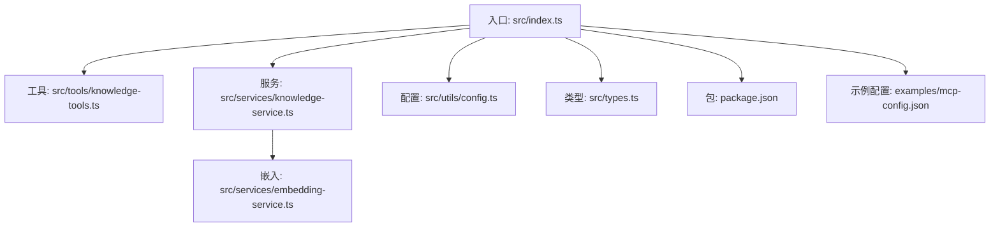
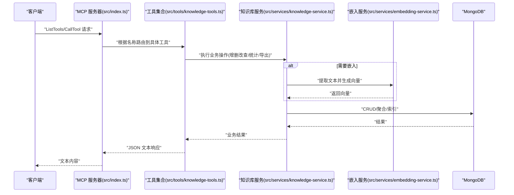
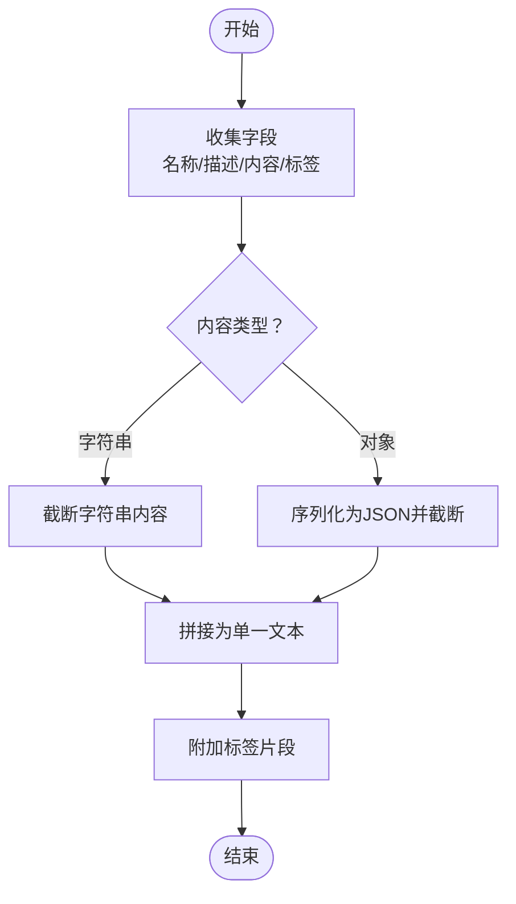
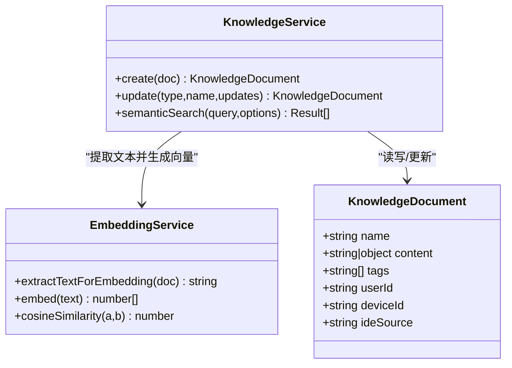
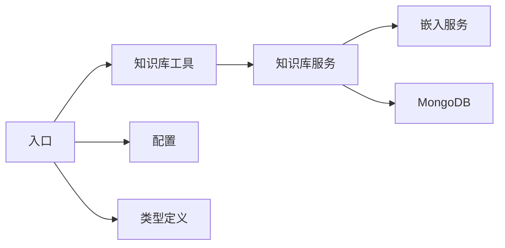

# 文本提取与处理

<cite>
**本文引用的文件**   
- [src/index.ts](file://src/index.ts)
- [src/types.ts](file://src/types.ts)
- [src/services/knowledge-service.ts](file://src/services/knowledge-service.ts)
- [src/tools/knowledge-tools.ts](file://src/tools/knowledge-tools.ts)
- [src/utils/config.ts](file://src/utils/config.ts)
- [src/services/embedding-service.ts](file://src/services/embedding-service.ts)
- [package.json](file://package.json)
- [examples/mcp-config.json](file://examples/mcp-config.json)
</cite>

## 目录
1. [简介](#简介)
2. [项目结构](#项目结构)
3. [核心组件](#核心组件)
4. [架构总览](#架构总览)
5. [详细组件分析](#详细组件分析)
6. [依赖关系分析](#依赖关系分析)
7. [性能考虑](#性能考虑)
8. [故障排查指南](#故障排查指南)
9. [结论](#结论)
10. [附录](#附录)

## 简介
本文件面向“文本提取与处理”的技术文档目标，围绕知识库文档的文本内容提取策略、字段选择与优先级排序、多类型内容处理（字符串、对象、数组）、数据转换机制、文本截断与编码处理、特殊字符清理、标签提取与元数据整合、内容标准化、长度限制、性能优化与内存控制、内容质量检查与异常处理进行系统化说明。文档以仓库现有实现为基础，结合工具链与嵌入服务，给出可操作的流程图、时序图与类图，帮助开发者与使用者高效理解与扩展。

## 项目结构
本项目采用分层架构：入口与协议适配层、工具层、服务层、嵌入服务层、配置与类型定义层。核心能力包括：
- MCP 协议适配与工具注册
- 知识库文档的增删改查、批量导出与统计
- 基于嵌入的语义检索与向量生成
- 用户上下文注入与跨设备同步
- 配置加载与校验、日志输出

图表来源
- [src/index.ts](file://src/index.ts#L1-L148)
- [src/tools/knowledge-tools.ts](file://src/tools/knowledge-tools.ts#L1-L1093)
- [src/services/knowledge-service.ts](file://src/services/knowledge-service.ts#L1-L404)
- [src/services/embedding-service.ts](file://src/services/embedding-service.ts#L1-L148)
- [src/utils/config.ts](file://src/utils/config.ts#L1-L147)
- [src/types.ts](file://src/types.ts#L1-L269)
- [package.json](file://package.json#L1-L48)
- [examples/mcp-config.json](file://examples/mcp-config.json#L1-L94)

章节来源
- [src/index.ts](file://src/index.ts#L1-L148)
- [src/types.ts](file://src/types.ts#L1-L269)

## 核心组件
- 入口与协议适配：负责启动 MCP 服务器、注册工具、处理请求与响应。
- 工具集合：提供通用 CRUD、快捷工具（记忆、经验、命令、上下文、MCP、规则、技能、工作流）、语义搜索与嵌入生成功能。
- 知识库服务：封装 MongoDB 访问、索引管理、用户上下文注入、文档创建/更新/删除/查询、批量导入导出、统计与嵌入生成。
- 嵌入服务：基于 Transformers.js 的特征抽取与余弦相似度计算，提供文本截断与拼接策略。
- 配置与类型：统一配置加载与校验、日志级别控制；定义知识库文档类型与字段规范。

章节来源
- [src/index.ts](file://src/index.ts#L1-L148)
- [src/tools/knowledge-tools.ts](file://src/tools/knowledge-tools.ts#L1-L1093)
- [src/services/knowledge-service.ts](file://src/services/knowledge-service.ts#L1-L404)
- [src/services/embedding-service.ts](file://src/services/embedding-service.ts#L1-L148)
- [src/utils/config.ts](file://src/utils/config.ts#L1-L147)
- [src/types.ts](file://src/types.ts#L1-L269)

## 架构总览
下图展示了 MCP 请求到工具执行、再到知识库与嵌入服务的整体调用链路。

图表来源
- [src/index.ts](file://src/index.ts#L16-L82)
- [src/tools/knowledge-tools.ts](file://src/tools/knowledge-tools.ts#L36-L106)
- [src/services/knowledge-service.ts](file://src/services/knowledge-service.ts#L111-L127)
- [src/services/embedding-service.ts](file://src/services/embedding-service.ts#L56-L65)

## 详细组件分析

### 文本提取策略与字段选择
- 字段选择与优先级
  - 标题优先：始终包含文档名称作为主键字段之一。
  - 描述次之：当存在描述时纳入拼接。
  - 内容再次：按类型分别处理
    - 字符串内容：截断至固定长度上限，避免超长文本影响嵌入与检索。
    - 对象内容：序列化为 JSON 并截断至固定长度上限，确保结构化信息可被向量化。
  - 标签补充：将标签以空格连接成片段，提升检索召回。
- 截断与编码
  - 截断策略：对字符串与序列化后的对象内容分别进行截断，避免超出嵌入输入上限。
  - 编码处理：嵌入服务内部使用特征抽取管道，自动进行归一化与池化，无需额外编码。
- 特殊字符清理
  - 当前实现未显式进行特殊字符清洗；建议在上游入库前增加清洗步骤（例如去除不可见字符、规范化换行），以减少噪声与异常。

图表来源
- [src/services/embedding-service.ts](file://src/services/embedding-service.ts#L109-L129)

章节来源
- [src/services/embedding-service.ts](file://src/services/embedding-service.ts#L109-L129)

### 多类型内容处理与数据转换
- 字符串内容
  - 直接截断并拼接到提取文本中，保证检索覆盖常用关键词。
- 对象内容
  - 序列化为 JSON 后截断，保留结构化信息；注意大对象可能导致截断过早，需评估字段权重。
- 数组内容
  - 在知识库文档类型中未直接出现数组字段；若上游存在数组字段，建议在提取阶段将其扁平化或转为字符串/JSON 字符串后再进入嵌入流程。
- 数据转换机制
  - 工具层将用户输入映射为知识库请求，服务层注入用户上下文与时间戳，嵌入服务层负责文本提取与向量化。

图表来源
- [src/types.ts](file://src/types.ts#L24-L74)
- [src/services/embedding-service.ts](file://src/services/embedding-service.ts#L109-L136)
- [src/services/knowledge-service.ts](file://src/services/knowledge-service.ts#L111-L127)

章节来源
- [src/types.ts](file://src/types.ts#L24-L74)
- [src/services/knowledge-service.ts](file://src/services/knowledge-service.ts#L111-L127)
- [src/services/embedding-service.ts](file://src/services/embedding-service.ts#L109-L136)

### 标签提取、元数据整合与内容标准化
- 标签提取
  - 从文档 tags 字段直接读取并拼接到提取文本末尾，提升检索相关性。
- 元数据整合
  - 用户上下文（userId/deviceId/ideSource）在创建/更新时自动注入，确保跨设备同步与用户隔离。
  - 时间戳（createdAt/updatedAt）由服务层维护，便于排序与审计。
- 内容标准化
  - 工具层对输入进行 Schema 校验与必填字段约束，服务层对重复名称（type+name）进行唯一性约束（索引保障）。
  - 建议在入库前增加内容清洗与长度限制，确保一致性与性能。

章节来源
- [src/tools/knowledge-tools.ts](file://src/tools/knowledge-tools.ts#L36-L106)
- [src/services/knowledge-service.ts](file://src/services/knowledge-service.ts#L74-L87)
- [src/services/knowledge-service.ts](file://src/services/knowledge-service.ts#L99-L106)

### 文本长度限制与性能优化
- 长度限制
  - 嵌入服务对字符串与对象序列化的文本进行截断，避免超长输入导致内存与计算压力。
- 性能优化
  - 懒加载嵌入模型，首次使用时初始化，后续复用。
  - 余弦相似度计算为纯数值运算，复杂度线性于向量维度。
  - 语义搜索先过滤已有嵌入的文档，再计算相似度，减少计算量。
- 内存控制
  - 批量生成嵌入时逐条更新，避免一次性加载大量向量。
  - 嵌入服务提供批处理接口，便于外部按批次调用。

章节来源
- [src/services/embedding-service.ts](file://src/services/embedding-service.ts#L24-L51)
- [src/services/embedding-service.ts](file://src/services/embedding-service.ts#L70-L80)
- [src/services/knowledge-service.ts](file://src/services/knowledge-service.ts#L313-L341)

### 内容质量检查与异常处理
- 输入校验
  - 工具层通过 JSON Schema 约束必填字段与枚举值，降低无效输入风险。
- 唯一性约束
  - MongoDB 索引确保同一用户下 type+name 唯一，避免重复创建。
- 异常处理
  - 工具层捕获错误并返回结构化错误信息；服务器层统一将结果序列化为文本响应。
  - 嵌入服务在向量维度不一致时抛出明确错误，便于定位问题。

章节来源
- [src/tools/knowledge-tools.ts](file://src/tools/knowledge-tools.ts#L36-L106)
- [src/services/knowledge-service.ts](file://src/services/knowledge-service.ts#L74-L87)
- [src/index.ts](file://src/index.ts#L56-L78)
- [src/services/embedding-service.ts](file://src/services/embedding-service.ts#L85-L104)

## 依赖关系分析
- 外部依赖
  - @modelcontextprotocol/sdk：MCP 协议适配与传输。
  - @xenova/transformers：特征抽取与向量生成。
  - mongodb：知识库持久化。
- 内部模块耦合
  - 工具层依赖服务层；服务层依赖嵌入服务与 MongoDB；入口依赖工具与配置。

图表来源
- [src/tools/knowledge-tools.ts](file://src/tools/knowledge-tools.ts#L1-L1093)
- [src/services/knowledge-service.ts](file://src/services/knowledge-service.ts#L1-L404)
- [src/services/embedding-service.ts](file://src/services/embedding-service.ts#L1-L148)
- [src/index.ts](file://src/index.ts#L1-L148)
- [src/utils/config.ts](file://src/utils/config.ts#L1-L147)
- [src/types.ts](file://src/types.ts#L1-L269)

章节来源
- [package.json](file://package.json#L30-L34)
- [src/index.ts](file://src/index.ts#L1-L148)

## 性能考虑
- 嵌入生成
  - 建议按类型或分批生成嵌入，避免一次性处理过多文档。
  - 对超长内容提前截断，减少嵌入计算时间。
- 查询与排序
  - 使用索引（用户+类型、用户+标签、用户+更新时间）提升查询效率。
  - 列表查询支持 limit/offset，避免全量返回。
- 语义搜索
  - 先过滤含嵌入的文档，再计算相似度，最后按阈值与数量切片。
- 内存占用
  - 批量生成嵌入时逐条更新，避免累积中间结果。
  - 嵌入服务提供批处理接口，便于外部控制并发与内存峰值。

章节来源
- [src/services/knowledge-service.ts](file://src/services/knowledge-service.ts#L74-L87)
- [src/services/knowledge-service.ts](file://src/services/knowledge-service.ts#L195-L216)
- [src/services/knowledge-service.ts](file://src/services/knowledge-service.ts#L272-L299)
- [src/services/knowledge-service.ts](file://src/services/knowledge-service.ts#L313-L341)
- [src/services/embedding-service.ts](file://src/services/embedding-service.ts#L70-L80)

## 故障排查指南
- 配置问题
  - 检查 MONGO_URI/MONGO_DATABASE/MONGO_COLLECTION 是否正确；可通过示例配置参考不同 IDE 的环境变量设置。
- 工具调用失败
  - 查看工具层返回的错误信息；常见为重复名称（type+name 唯一）或必填字段缺失。
- 嵌入相关错误
  - 模型未初始化：等待懒加载完成或手动触发初始化。
  - 向量维度不一致：确认输入向量维度一致后再计算相似度。
- 数据一致性
  - 若发现重复记录，检查唯一索引是否生效；必要时重建索引。

章节来源
- [src/utils/config.ts](file://src/utils/config.ts#L96-L115)
- [examples/mcp-config.json](file://examples/mcp-config.json#L1-L94)
- [src/tools/knowledge-tools.ts](file://src/tools/knowledge-tools.ts#L99-L105)
- [src/services/embedding-service.ts](file://src/services/embedding-service.ts#L85-L104)

## 结论
本项目通过清晰的分层设计与工具化能力，实现了对多类型知识库文档的统一管理，并提供了基于嵌入的语义检索与向量生成能力。文本提取策略以“名称优先、描述次之、内容再次、标签补充”为核心，结合截断与拼接，兼顾检索效果与性能。建议在上游增加内容清洗与长度限制，以进一步提升质量与稳定性；同时通过分批嵌入与索引优化持续改进性能表现。

## 附录
- 示例配置参考：不同 IDE 的 MCP 配置示例，涵盖本地开发与云端共享场景。
- 工具清单：通用 CRUD、快捷工具、语义搜索与嵌入生成工具，按需启用。

章节来源
- [examples/mcp-config.json](file://examples/mcp-config.json#L1-L94)
- [src/tools/knowledge-tools.ts](file://src/tools/knowledge-tools.ts#L1000-L1092)