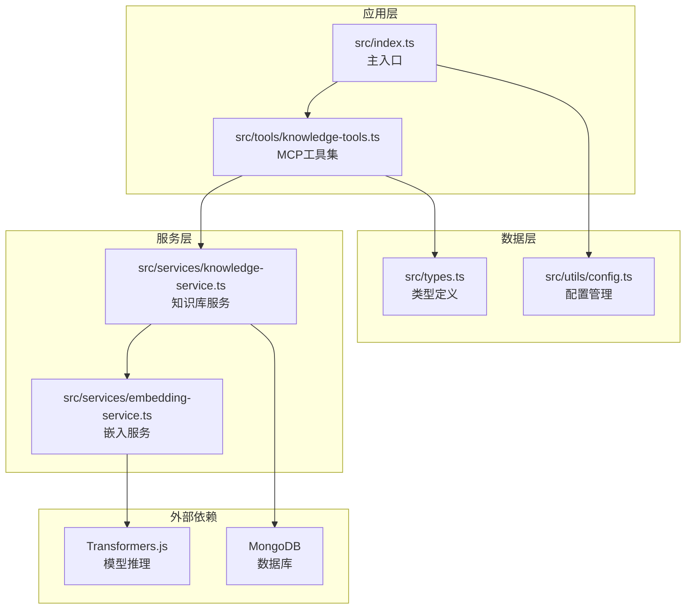
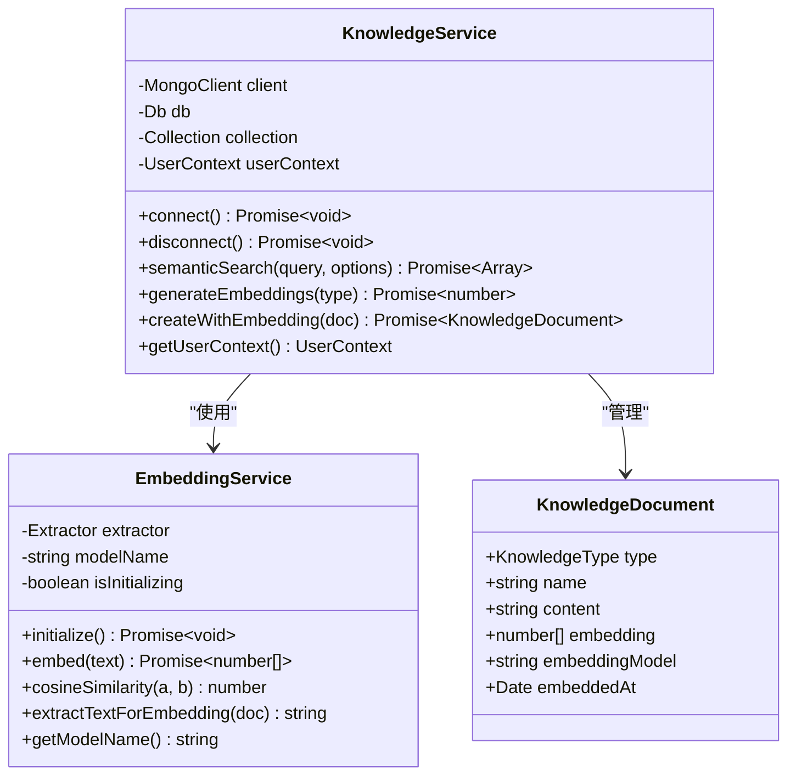
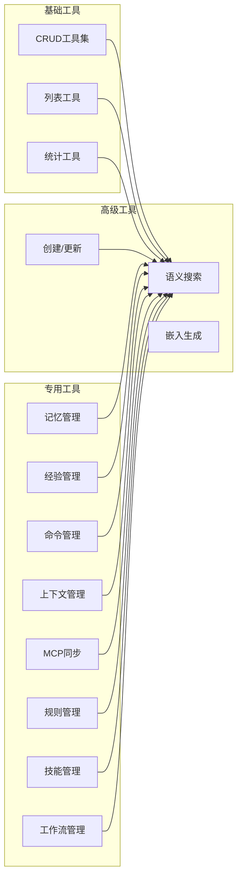
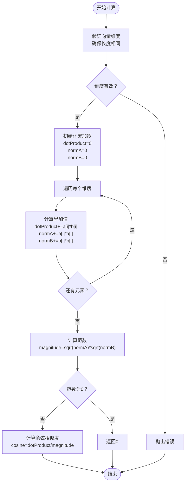
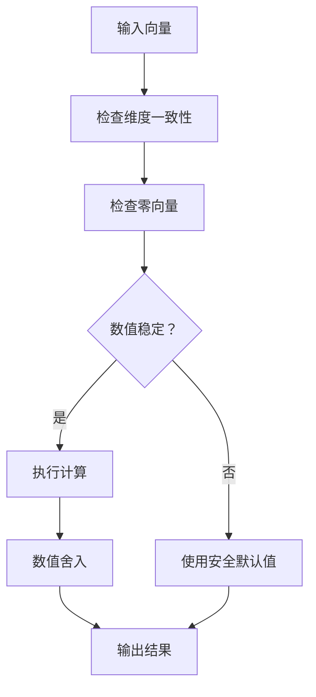
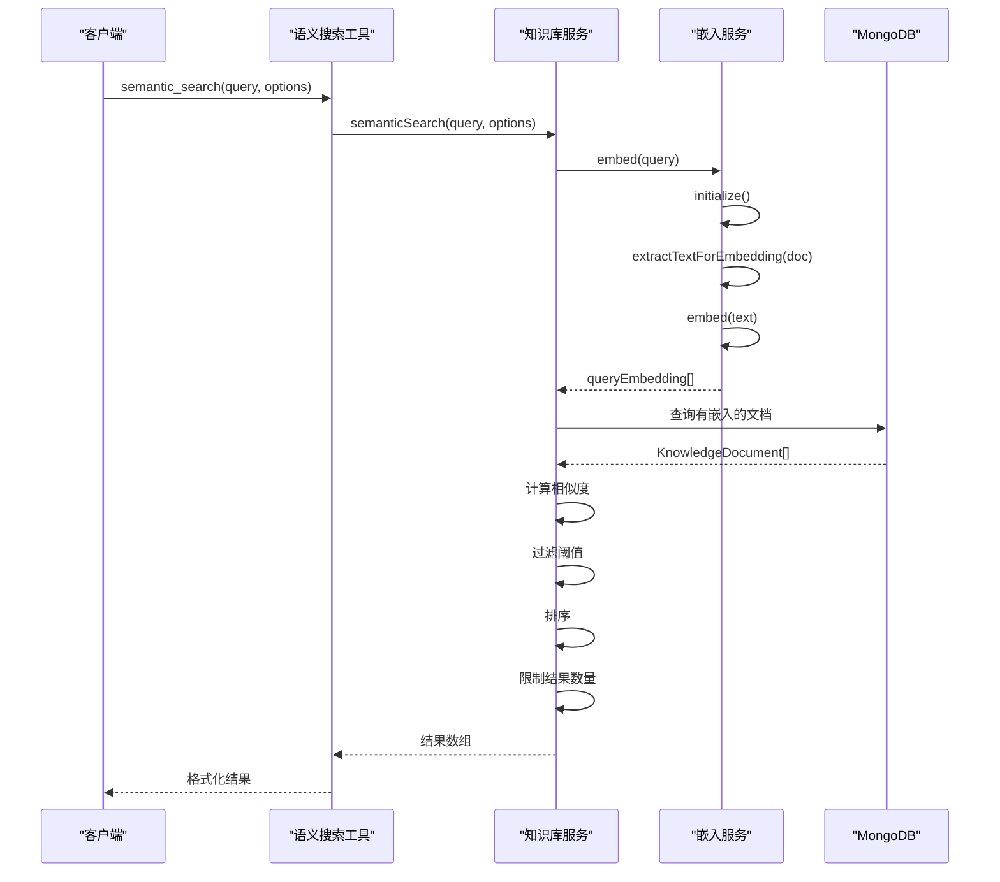
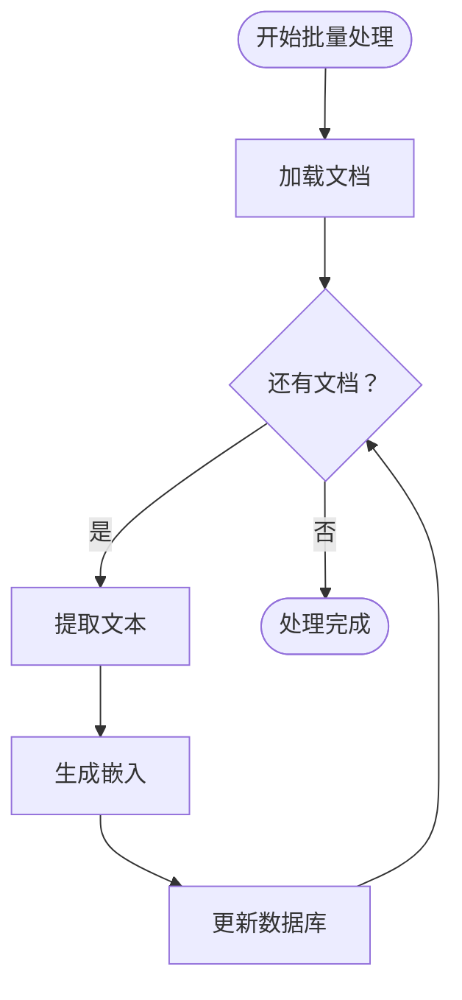
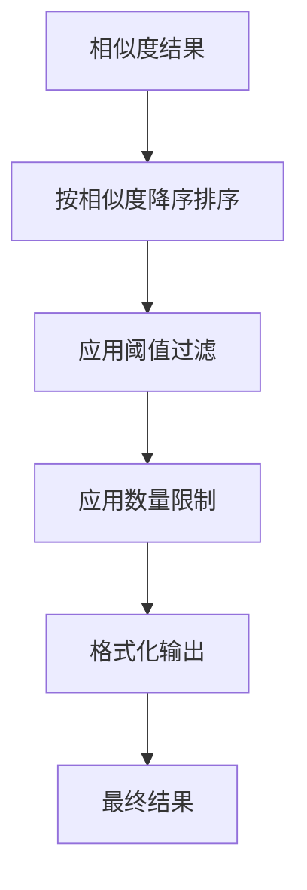
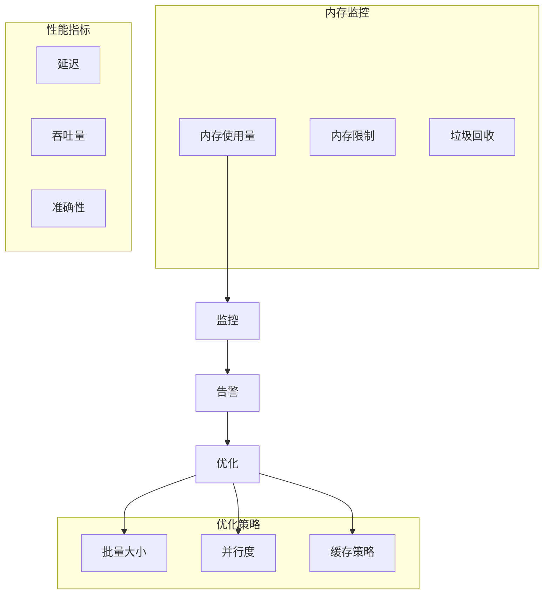

# 相似度计算技术文档

<cite>
**本文档引用的文件**
- [src/services/embedding-service.ts](file://src/services/embedding-service.ts)
- [src/services/knowledge-service.ts](file://src/services/knowledge-service.ts)
- [src/tools/knowledge-tools.ts](file://src/tools/knowledge-tools.ts)
- [src/types.ts](file://src/types.ts)
- [src/index.ts](file://src/index.ts)
- [src/utils/config.ts](file://src/utils/config.ts)
</cite>

## 目录
1. [简介](#简介)
2. [项目结构概述](#项目结构概述)
3. [核心组件分析](#核心组件分析)
4. [余弦相似度算法实现](#余弦相似度算法实现)
5. [数值稳定性与性能优化](#数值稳定性与性能优化)
6. [向量比较与处理流程](#向量比较与处理流程)
7. [批量处理与并行优化](#批量处理与并行优化)
8. [阈值设置与过滤机制](#阈值设置与过滤机制)
9. [排序算法与结果处理](#排序算法与结果处理)
10. [精度控制与边界情况](#精度控制与边界情况)
11. [内存管理策略](#内存管理策略)
12. [性能考虑与优化建议](#性能考虑与优化建议)
13. [故障排除指南](#故障排除指南)
14. [结论](#结论)

## 简介

本文档深入解析了基于 MongoDB 的知识库相似度计算系统，重点阐述余弦相似度算法的实现原理、数值稳定性、性能优化策略以及完整的相似度计算流水线。该系统支持多种知识类型（记忆、技能、规则、MCP、经验、命令、上下文、工作流），通过向量嵌入技术实现语义层面的知识检索和匹配。

## 项目结构概述

该项目采用模块化架构设计，主要包含以下核心模块：

**图表来源**
- [src/index.ts](file://src/index.ts#L1-L148)
- [src/services/knowledge-service.ts](file://src/services/knowledge-service.ts#L1-L404)
- [src/services/embedding-service.ts](file://src/services/embedding-service.ts#L1-L148)

**章节来源**
- [src/index.ts](file://src/index.ts#L1-L148)
- [src/services/knowledge-service.ts](file://src/services/knowledge-service.ts#L1-L404)
- [src/services/embedding-service.ts](file://src/services/embedding-service.ts#L1-L148)

## 核心组件分析

### 知识库服务架构

知识库服务是整个相似度计算系统的核心，负责管理8种不同的知识类型，并提供完整的CRUD操作和语义搜索功能。

**图表来源**
- [src/services/knowledge-service.ts](file://src/services/knowledge-service.ts#L20-L404)
- [src/services/embedding-service.ts](file://src/services/embedding-service.ts#L11-L148)
- [src/types.ts](file://src/types.ts#L24-L74)

### 工具集架构

MCP工具集提供了丰富的知识库管理功能，包括基础CRUD操作和高级语义搜索能力。

**图表来源**
- [src/tools/knowledge-tools.ts](file://src/tools/knowledge-tools.ts#L29-L1093)

**章节来源**
- [src/services/knowledge-service.ts](file://src/services/knowledge-service.ts#L1-L404)
- [src/tools/knowledge-tools.ts](file://src/tools/knowledge-tools.ts#L1-L1093)

## 余弦相似度算法实现

### 算法原理

余弦相似度是衡量两个非零向量之间角度的余弦值，用于评估向量方向的相似性，而不考虑其大小。

**图表来源**
- [src/services/embedding-service.ts](file://src/services/embedding-service.ts#L85-L104)

### 实现细节

余弦相似度计算的核心实现位于嵌入服务中，具有以下特点：

1. **输入验证**：确保两个向量具有相同的维度
2. **数值稳定性**：检查范数是否为零，避免除零错误
3. **高效计算**：单次遍历完成点积和范数计算
4. **标准化输出**：返回[-1, 1]范围内的相似度值

**章节来源**
- [src/services/embedding-service.ts](file://src/services/embedding-service.ts#L85-L104)

## 数值稳定性与性能优化

### 数值稳定性保障

系统在多个层面确保数值计算的稳定性：

**图表来源**
- [src/services/embedding-service.ts](file://src/services/embedding-service.ts#L85-L104)

### 性能优化策略

1. **懒加载模型**：仅在首次使用时加载嵌入模型
2. **批量处理**：支持批量嵌入生成和相似度计算
3. **内存管理**：及时释放模型资源，避免内存泄漏
4. **索引优化**：在MongoDB中建立适当的索引以加速查询

**章节来源**
- [src/services/embedding-service.ts](file://src/services/embedding-service.ts#L24-L51)
- [src/services/knowledge-service.ts](file://src/services/knowledge-service.ts#L71-L87)

## 向量比较与处理流程

### 完整处理流水线

相似度计算涉及多个处理阶段，形成完整的数据流水线：

**图表来源**
- [src/tools/knowledge-tools.ts](file://src/tools/knowledge-tools.ts#L1029-L1056)
- [src/services/knowledge-service.ts](file://src/services/knowledge-service.ts#L272-L299)

### 向量提取策略

嵌入服务采用多字段组合策略提取用于嵌入的文本：

1. **必需字段**：文档名称
2. **可选字段**：描述、内容（限制长度）、标签
3. **权重分配**：名称权重最高，内容次之，标签最低
4. **长度限制**：内容字段限制在1000字符以内

**章节来源**
- [src/services/embedding-service.ts](file://src/services/embedding-service.ts#L109-L129)

## 批量处理与并行优化

### 批量嵌入生成

系统支持高效的批量嵌入生成，适用于大规模知识库处理：

**图表来源**
- [src/services/knowledge-service.ts](file://src/services/knowledge-service.ts#L313-L341)

### 并行处理策略

1. **异步处理**：使用Promise和async/await实现非阻塞操作
2. **串行批处理**：避免同时处理大量文档导致的内存压力
3. **流式处理**：分批处理大型结果集，减少内存占用
4. **资源管理**：合理管理模型加载和卸载时机

**章节来源**
- [src/services/knowledge-service.ts](file://src/services/knowledge-service.ts#L313-L341)
- [src/services/embedding-service.ts](file://src/services/embedding-service.ts#L69-L80)

## 阈值设置与过滤机制

### 阈值配置

相似度阈值是控制搜索结果质量的关键参数：

| 阈值范围 | 适用场景 | 建议值 |
|---------|---------|--------|
| 0.0 - 0.3 | 严格匹配，高质量结果 | 0.7 - 0.9 |
| 0.3 - 0.6 | 中等宽松，平衡质量与数量 | 0.5 - 0.7 |
| 0.6 - 1.0 | 宽松匹配，扩大搜索范围 | 0.3 - 0.5 |

### 过滤机制

1. **阈值过滤**：只保留相似度高于阈值的结果
2. **类型过滤**：可按知识类型进行筛选
3. **数量限制**：限制返回结果数量
4. **排序过滤**：按相似度降序排列

**章节来源**
- [src/services/knowledge-service.ts](file://src/services/knowledge-service.ts#L289-L296)
- [src/types.ts](file://src/types.ts#L264-L268)

## 排序算法与结果处理

### 排序策略

系统采用稳定的降序排序算法：

**图表来源**
- [src/services/knowledge-service.ts](file://src/services/knowledge-service.ts#L289-L296)

### 结果格式化

返回结果包含以下信息：

1. **基础信息**：文档ID、类型、名称、描述
2. **相似度分数**：保留两位小数的相似度值
3. **元数据**：标签、更新时间等
4. **统计信息**：结果数量

**章节来源**
- [src/tools/knowledge-tools.ts](file://src/tools/knowledge-tools.ts#L1040-L1051)

## 精度控制与边界情况

### 精度控制

1. **相似度精度**：结果保留两位小数
2. **数值范围**：确保相似度值在[-1, 1]范围内
3. **浮点运算**：使用标准JavaScript浮点运算
4. **截断处理**：对长文本内容进行截断处理

### 边界情况处理

1. **空向量**：零向量与任何向量的相似度为0
2. **维度不匹配**：抛出明确的错误信息
3. **内存不足**：分批处理大型数据集
4. **网络异常**：重试机制和超时处理
5. **模型加载失败**：降级到基础处理模式

**章节来源**
- [src/services/embedding-service.ts](file://src/services/embedding-service.ts#L85-L104)

## 内存管理策略

### 资源管理

1. **模型生命周期**：懒加载、按需初始化、及时释放
2. **内存监控**：监控内存使用情况，避免内存泄漏
3. **垃圾回收**：合理管理对象引用，促进垃圾回收
4. **连接池**：复用数据库连接，减少资源消耗

### 性能监控

**图表来源**
- [src/services/embedding-service.ts](file://src/services/embedding-service.ts#L24-L51)

**章节来源**
- [src/services/embedding-service.ts](file://src/services/embedding-service.ts#L24-L51)

## 性能考虑与优化建议

### 性能基准

| 操作类型 | 处理时间 | 内存使用 | 适用场景 |
|---------|---------|---------|---------|
| 单文档嵌入 | 50-200ms | 50-100MB | 小规模处理 |
| 批量嵌入(100) | 5-10s | 200MB-500MB | 中等规模处理 |
| 批量嵌入(1000) | 50-100s | 2-5GB | 大规模处理 |
| 相似度计算(1000) | 1-5s | 100MB-200MB | 搜索操作 |

### 优化建议

1. **硬件优化**：使用SSD存储，增加内存容量
2. **算法优化**：考虑使用近似最近邻搜索算法
3. **缓存策略**：缓存常用查询结果
4. **索引优化**：在embedding字段上建立索引
5. **并发控制**：限制同时进行的相似度计算任务数量

## 故障排除指南

### 常见问题及解决方案

1. **模型加载失败**
   - 检查网络连接
   - 验证模型名称正确性
   - 检查磁盘空间

2. **相似度计算异常**
   - 验证向量维度一致性
   - 检查向量是否包含NaN值
   - 确认向量长度在合理范围内

3. **内存不足**
   - 减少批量处理大小
   - 增加系统内存
   - 优化数据预处理

4. **性能问题**
   - 检查数据库索引
   - 优化查询条件
   - 考虑分布式部署

### 调试工具

1. **日志记录**：详细的执行时间和内存使用信息
2. **性能监控**：实时监控系统性能指标
3. **错误追踪**：完整的错误堆栈信息
4. **资源监控**：CPU、内存、磁盘使用情况

**章节来源**
- [src/utils/config.ts](file://src/utils/config.ts#L120-L146)

## 结论

该相似度计算系统通过精心设计的架构和优化策略，实现了高效、稳定的语义搜索功能。系统的主要优势包括：

1. **算法稳健性**：采用成熟的余弦相似度算法，确保计算结果的可靠性
2. **性能优化**：通过批量处理、内存管理和资源优化提升整体性能
3. **扩展性强**：模块化设计支持功能扩展和定制化需求
4. **易用性**：提供简洁的API接口和完善的错误处理机制

未来可以进一步优化的方向包括引入更高效的相似度算法、实现分布式处理能力、增强缓存策略等。该系统为构建智能知识管理系统提供了坚实的技术基础。