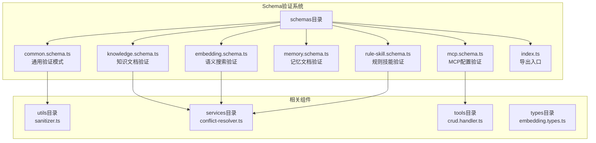
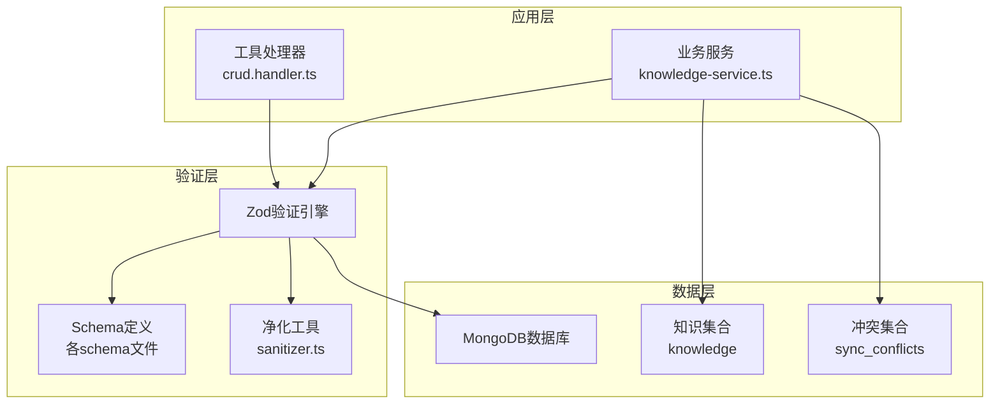
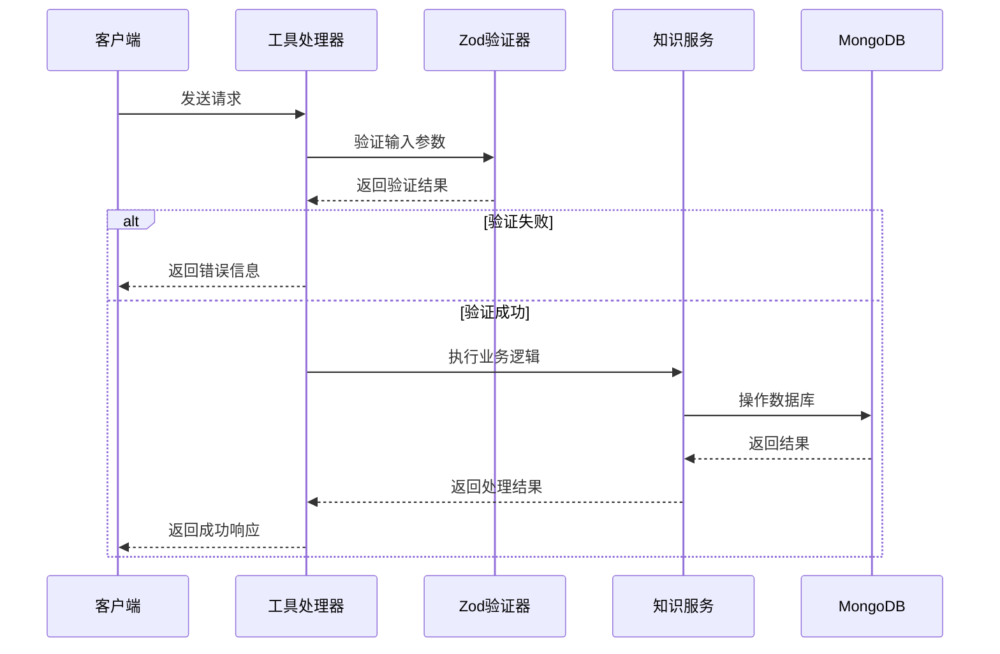
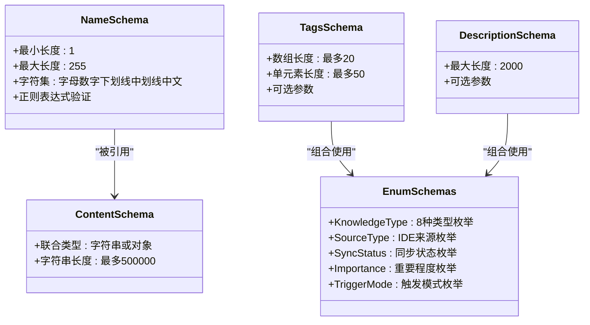
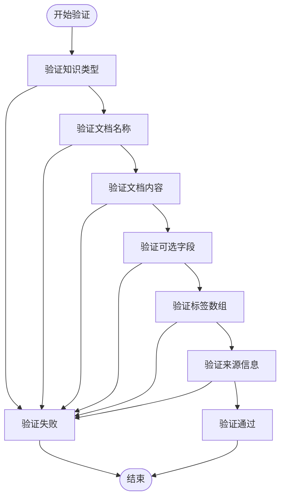
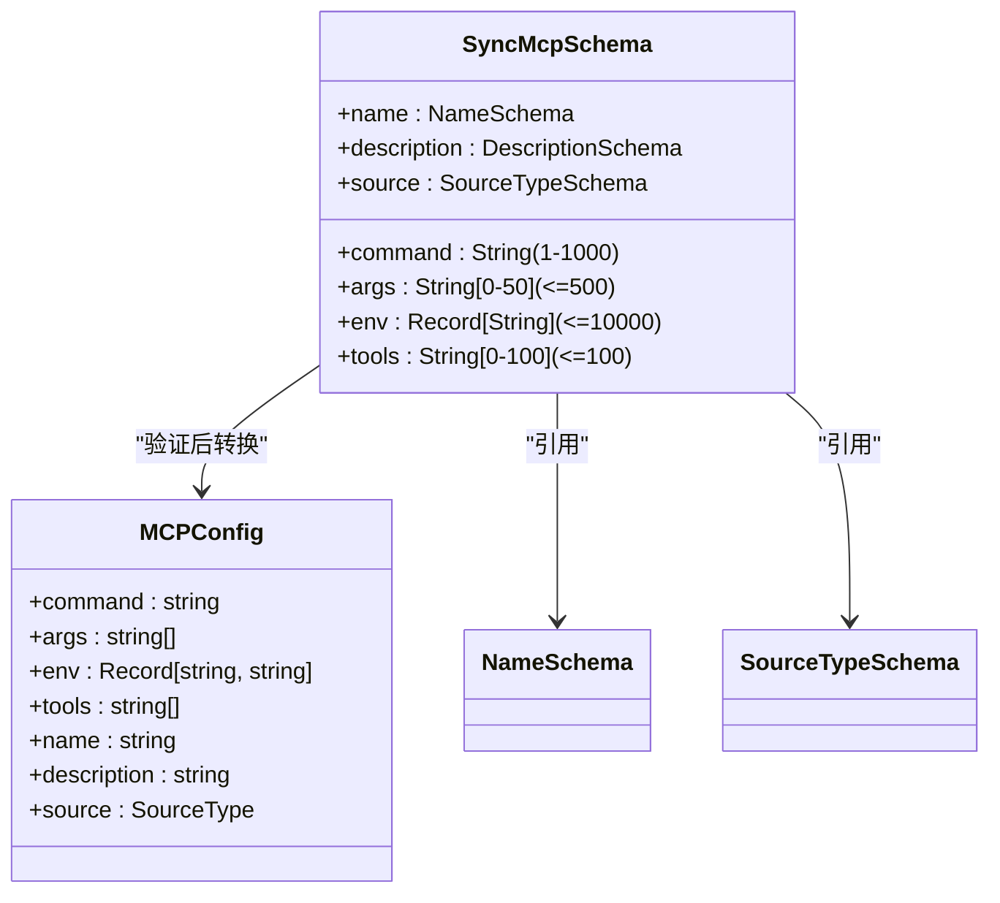
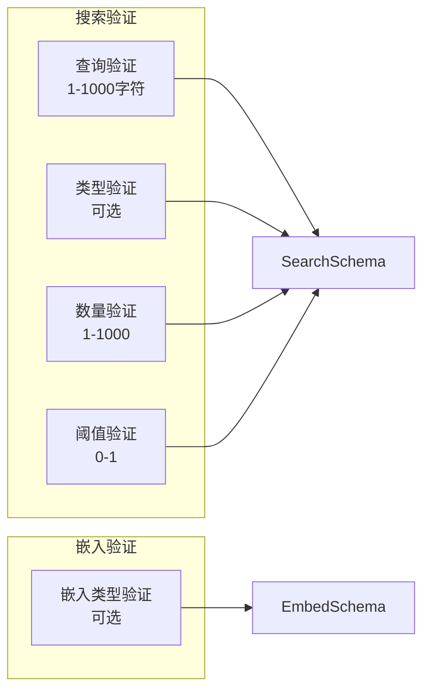
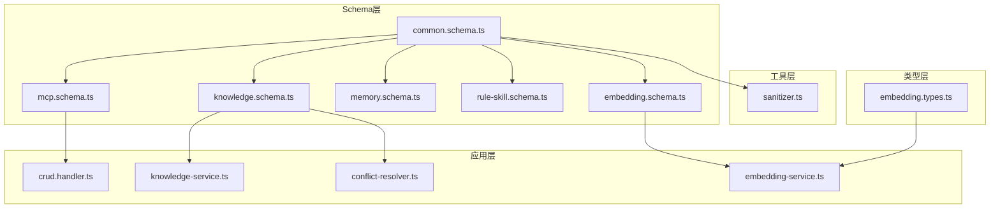
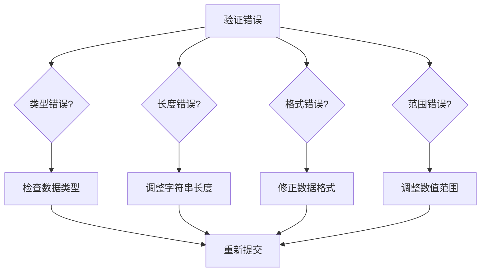
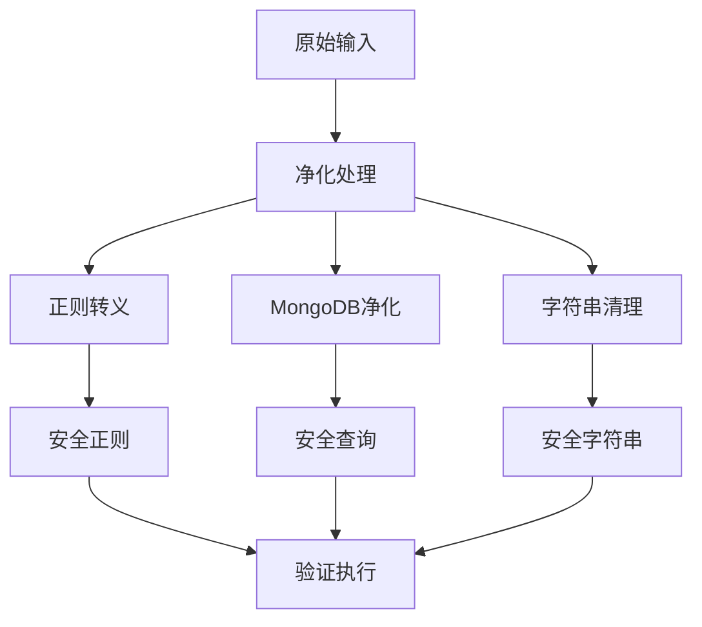

# Schema验证系统

<cite>
**本文档引用的文件**
- [src/schemas/index.ts](file://src/schemas/index.ts)
- [src/schemas/common.schema.ts](file://src/schemas/common.schema.ts)
- [src/schemas/mcp.schema.ts](file://src/schemas/mcp.schema.ts)
- [src/schemas/knowledge.schema.ts](file://src/schemas/knowledge.schema.ts)
- [src/schemas/memory.schema.ts](file://src/schemas/memory.schema.ts)
- [src/schemas/rule-skill.schema.ts](file://src/schemas/rule-skill.schema.ts)
- [src/schemas/embedding.schema.ts](file://src/schemas/embedding.schema.ts)
- [src/utils/sanitizer.ts](file://src/utils/sanitizer.ts)
- [src/services/conflict-resolver.ts](file://src/services/conflict-resolver.ts)
- [src/services/knowledge-service.ts](file://src/services/knowledge-service.ts)
- [src/services/embedding-service.ts](file://src/services/embedding-service.ts)
- [src/tools/handlers/crud.handler.ts](file://src/tools/handlers/crud.handler.ts)
- [examples/mcp-config.json](file://examples/mcp-config.json)
- [src/types/embedding.types.ts](file://src/types/embedding.types.ts)
</cite>

## 目录
1. [简介](#简介)
2. [项目结构](#项目结构)
3. [核心组件](#核心组件)
4. [架构概览](#架构概览)
5. [详细组件分析](#详细组件分析)
6. [依赖关系分析](#依赖关系分析)
7. [性能考虑](#性能考虑)
8. [故障排除指南](#故障排除指南)
9. [结论](#结论)

## 简介

Schema验证系统是mongo-mcp项目中的核心数据验证框架，基于Zod库构建，为整个知识管理系统提供类型安全的数据验证和转换机制。该系统支持8种知识类型（Memories、Skills、Rules、MCPs、Experiences、Commands、Contexts、Workflows），提供完整的CRUD操作、语义搜索、冲突解决等高级功能。

系统采用模块化设计，每个schema文件专注于特定领域的数据验证规则，通过统一的验证模式确保数据的一致性和完整性。配合安全净化工具和嵌入式验证，为开发者提供了强大而灵活的数据管理解决方案。

## 项目结构

Schema验证系统位于项目的`src/schemas`目录下，采用按功能域分组的组织方式：



**图表来源**
- [src/schemas/index.ts](file://src/schemas/index.ts#L1-L22)
- [src/schemas/common.schema.ts](file://src/schemas/common.schema.ts#L1-L86)

**章节来源**
- [src/schemas/index.ts](file://src/schemas/index.ts#L1-L22)
- [src/schemas/common.schema.ts](file://src/schemas/common.schema.ts#L1-L86)

## 核心组件

### 通用验证模式

系统的基础验证模式定义了所有schema共享的通用规则：

- **名称验证**：支持字母、数字、下划线、中划线、中文字符，长度限制255字符
- **标签验证**：最多20个标签，单个标签最大50字符
- **描述验证**：最大2000字符的可选描述
- **内容验证**：支持字符串或JSON对象的联合类型
- **枚举类型**：包括知识类型、数据来源、同步状态、重要程度、触发模式等

### 知识文档验证

针对8种知识类型的专门验证规则：

- **创建验证**：包含类型、名称、内容、描述、标签等必需字段
- **更新验证**：支持部分字段更新，保持数据一致性
- **查询验证**：支持类型过滤、标签筛选、启用状态、搜索功能
- **分页验证**：统一的分页参数处理

### MCP配置验证

专门为MCP（Model Context Protocol）服务器配置设计的验证规则：

- **命令验证**：命令字符串长度限制，防止恶意输入
- **参数验证**：最多50个参数，单个参数最大500字符
- **环境变量验证**：键值对形式，防止注入攻击
- **工具列表验证**：最多100个工具，单个工具名最大100字符

**章节来源**
- [src/schemas/common.schema.ts](file://src/schemas/common.schema.ts#L7-L86)
- [src/schemas/knowledge.schema.ts](file://src/schemas/knowledge.schema.ts#L17-L83)
- [src/schemas/mcp.schema.ts](file://src/schemas/mcp.schema.ts#L14-L26)

## 架构概览

Schema验证系统采用分层架构设计，确保数据验证的层次性和可维护性：



**图表来源**
- [src/tools/handlers/crud.handler.ts](file://src/tools/handlers/crud.handler.ts#L1-L403)
- [src/services/knowledge-service.ts](file://src/services/knowledge-service.ts#L1-L437)
- [src/utils/sanitizer.ts](file://src/utils/sanitizer.ts#L1-L63)

### 数据流验证流程



**图表来源**
- [src/tools/handlers/crud.handler.ts](file://src/tools/handlers/crud.handler.ts#L47-L81)
- [src/services/knowledge-service.ts](file://src/services/knowledge-service.ts#L143-L160)

## 详细组件分析

### 通用验证模式分析

通用验证模式是整个Schema系统的基础，定义了所有数据验证的共同规则：



**图表来源**
- [src/schemas/common.schema.ts](file://src/schemas/common.schema.ts#L7-L86)

#### 验证规则复杂度分析

| 验证类型 | 复杂度 | 实现特点 |
|---------|--------|----------|
| 字符串验证 | O(n) | 正则表达式匹配，n为字符串长度 |
| 数组验证 | O(n) | 遍历数组元素，n为元素数量 |
| 枚举验证 | O(1) | 哈希表查找 |
| 联合类型验证 | O(n+m) | 两种类型分别验证，n和m为各自长度 |

**章节来源**
- [src/schemas/common.schema.ts](file://src/schemas/common.schema.ts#L7-L86)

### 知识文档验证系统

知识文档验证系统支持8种不同的知识类型，每种类型都有其特定的验证规则：

```mermaid
erDiagram
KNOWLEDGE_DOCUMENT {
string _id PK
string userId FK
string type
string name
string description
array tags
boolean enabled
string source
string sourceId
string sourcePath
string sourceProject
number syncVersion
string syncStatus
date createdAt
date updatedAt
}
KNOWLEDGE_TYPE {
enum type
string description
}
SOURCE_TYPE {
enum source
string description
}
SYNC_STATUS {
enum syncStatus
string description
}
KNOWLEDGE_DOCUMENT }o|--|| KNOWLEDGE_TYPE : "包含"
KNOWLEDGE_DOCUMENT }o|--|| SOURCE_TYPE : "来源"
KNOWLEDGE_DOCUMENT }o|--|| SYNC_STATUS : "状态"
```

**图表来源**
- [src/schemas/knowledge.schema.ts](file://src/schemas/knowledge.schema.ts#L17-L83)

#### CRUD操作验证流程



**图表来源**
- [src/schemas/knowledge.schema.ts](file://src/schemas/knowledge.schema.ts#L17-L65)

**章节来源**
- [src/schemas/knowledge.schema.ts](file://src/schemas/knowledge.schema.ts#L17-L83)

### MCP配置验证系统

MCP配置验证系统专门处理外部IDE集成的配置验证：



**图表来源**
- [src/schemas/mcp.schema.ts](file://src/schemas/mcp.schema.ts#L14-L22)

#### 配置验证复杂度

MCP配置验证的复杂度主要体现在：
- 参数数量验证：O(n)，n为参数数量
- 字符长度验证：O(m)，m为字符串长度
- 环境变量验证：O(k)，k为键值对数量

**章节来源**
- [src/schemas/mcp.schema.ts](file://src/schemas/mcp.schema.ts#L14-L26)

### 语义搜索验证系统

语义搜索验证系统结合传统文本搜索和现代嵌入技术：



**图表来源**
- [src/schemas/embedding.schema.ts](file://src/schemas/embedding.schema.ts#L8-L24)

**章节来源**
- [src/schemas/embedding.schema.ts](file://src/schemas/embedding.schema.ts#L8-L24)

## 依赖关系分析

Schema验证系统与其他组件的依赖关系呈现清晰的分层结构：



**图表来源**
- [src/schemas/index.ts](file://src/schemas/index.ts#L1-L22)
- [src/tools/handlers/crud.handler.ts](file://src/tools/handlers/crud.handler.ts#L1-L403)

### 循环依赖检测

经过分析，系统中不存在循环依赖：
- Schema文件之间仅存在单向引用关系
- 应用层组件遵循单一职责原则
- 工具层组件保持无状态特性

**章节来源**
- [src/schemas/index.ts](file://src/schemas/index.ts#L1-L22)
- [src/utils/sanitizer.ts](file://src/utils/sanitizer.ts#L1-L63)

## 性能考虑

### 验证性能优化

Schema验证系统在设计时充分考虑了性能因素：

1. **延迟初始化**：嵌入模型采用懒加载机制，首次使用时才加载
2. **批量处理**：支持批量验证和批量操作
3. **索引优化**：数据库查询使用适当的索引策略
4. **内存管理**：合理控制验证过程中的内存使用

### 内存使用分析

| 验证场景 | 内存使用 | 优化策略 |
|---------|----------|----------|
| 单个文档验证 | O(1) | 直接验证，无额外分配 |
| 批量文档验证 | O(n) | 分批处理，避免大对象 |
| 嵌入生成 | O(d) | d为向量维度，使用Float32Array |
| 正则表达式 | O(n) | 编译后复用，避免重复编译 |

### 并发处理能力

系统支持高并发验证场景：
- Zod验证器支持异步验证
- 嵌入服务支持并发请求
- 数据库操作使用连接池
- 缓存机制减少重复计算

## 故障排除指南

### 常见验证错误



#### 错误诊断流程

1. **检查输入数据类型**：确保传递给验证器的数据类型正确
2. **验证字符串长度**：检查是否超出最大长度限制
3. **确认格式规范**：确保日期、邮箱等格式符合要求
4. **验证数值范围**：检查整数、浮点数的取值范围

### 安全防护措施

系统实现了多层次的安全防护：



**图表来源**
- [src/utils/sanitizer.ts](file://src/utils/sanitizer.ts#L10-L62)

**章节来源**
- [src/utils/sanitizer.ts](file://src/utils/sanitizer.ts#L1-L63)

### 调试技巧

1. **启用详细日志**：设置`LOG_LEVEL=debug`获取详细的验证过程信息
2. **使用类型断言**：在开发环境中使用TypeScript类型检查
3. **单元测试**：为每个schema编写对应的验证测试用例
4. **性能监控**：监控验证过程的执行时间和内存使用

## 结论

Schema验证系统为mongo-mcp项目提供了坚实的数据基础，通过模块化的架构设计和严格的数据验证规则，确保了系统的可靠性、安全性和可维护性。

### 主要优势

1. **类型安全**：基于Zod的强类型验证，提供编译时和运行时双重保护
2. **模块化设计**：按功能域分离的schema文件，便于维护和扩展
3. **安全性**：内置多种安全防护机制，有效防止注入攻击
4. **性能优化**：合理的性能设计和优化策略，支持高并发场景
5. **灵活性**：支持多种知识类型和复杂的业务场景

### 未来发展方向

1. **验证规则扩展**：根据业务需求添加更多验证规则
2. **性能优化**：进一步优化验证性能和内存使用
3. **监控增强**：增加更详细的性能监控和错误追踪
4. **文档完善**：补充更多的使用示例和最佳实践

该系统为整个mongo-mcp项目奠定了坚实的技术基础，为后续的功能扩展和性能优化提供了良好的支撑。