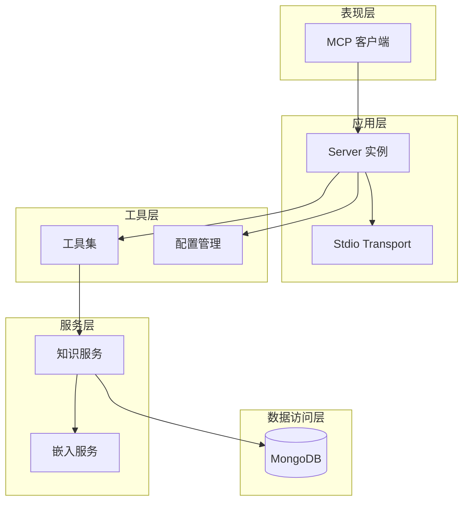
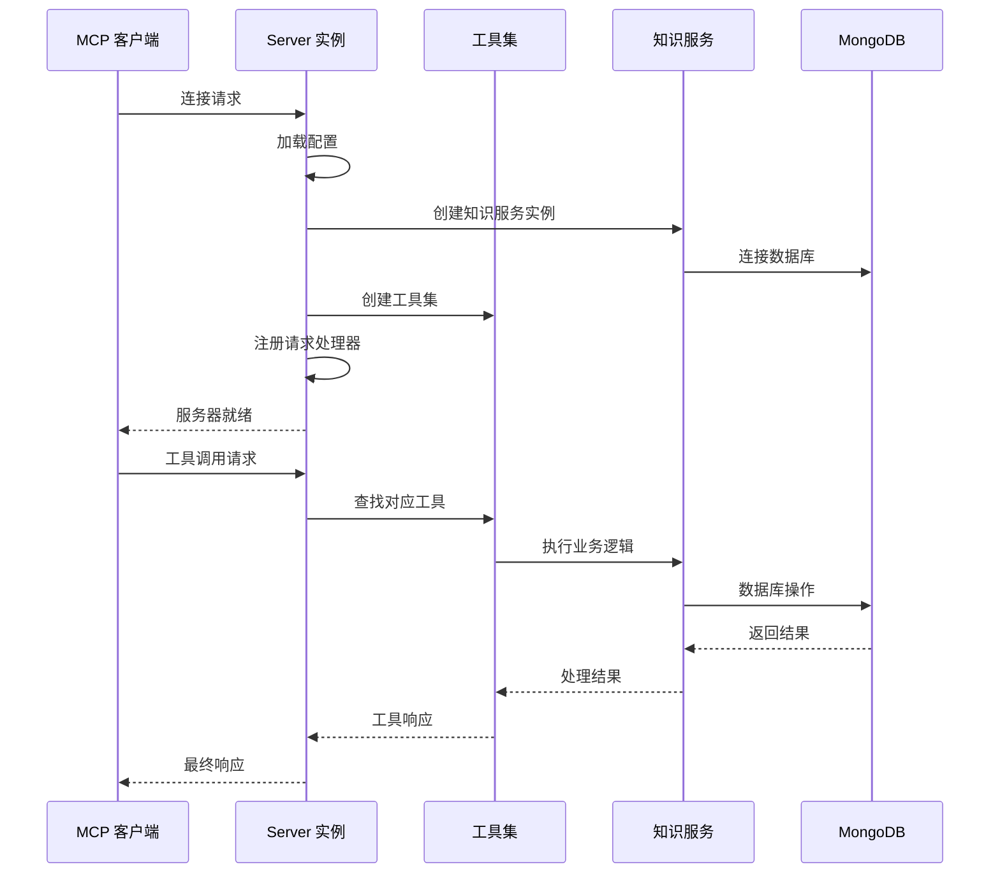
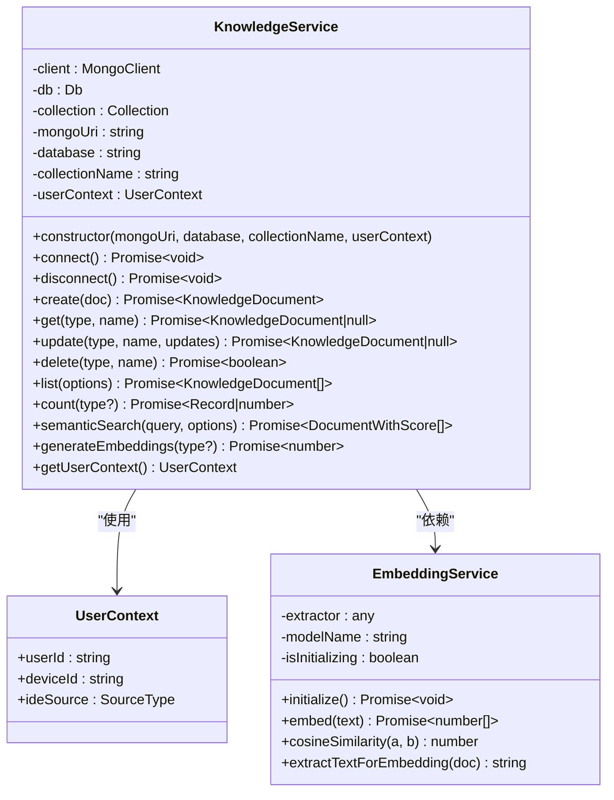
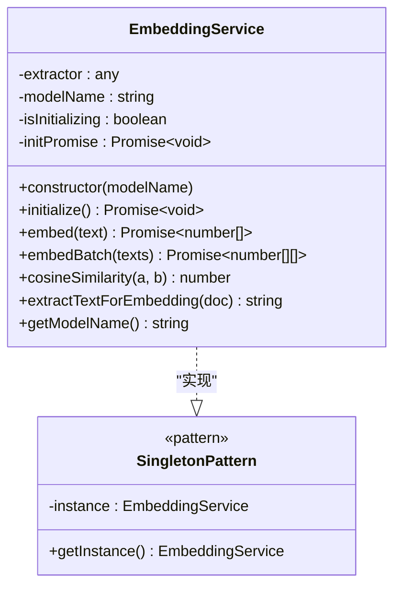
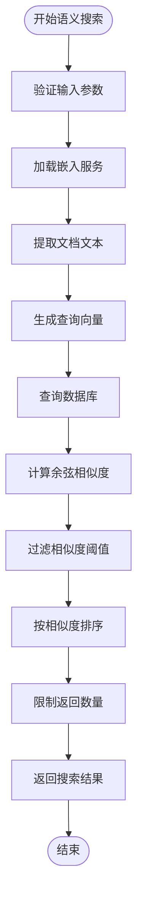
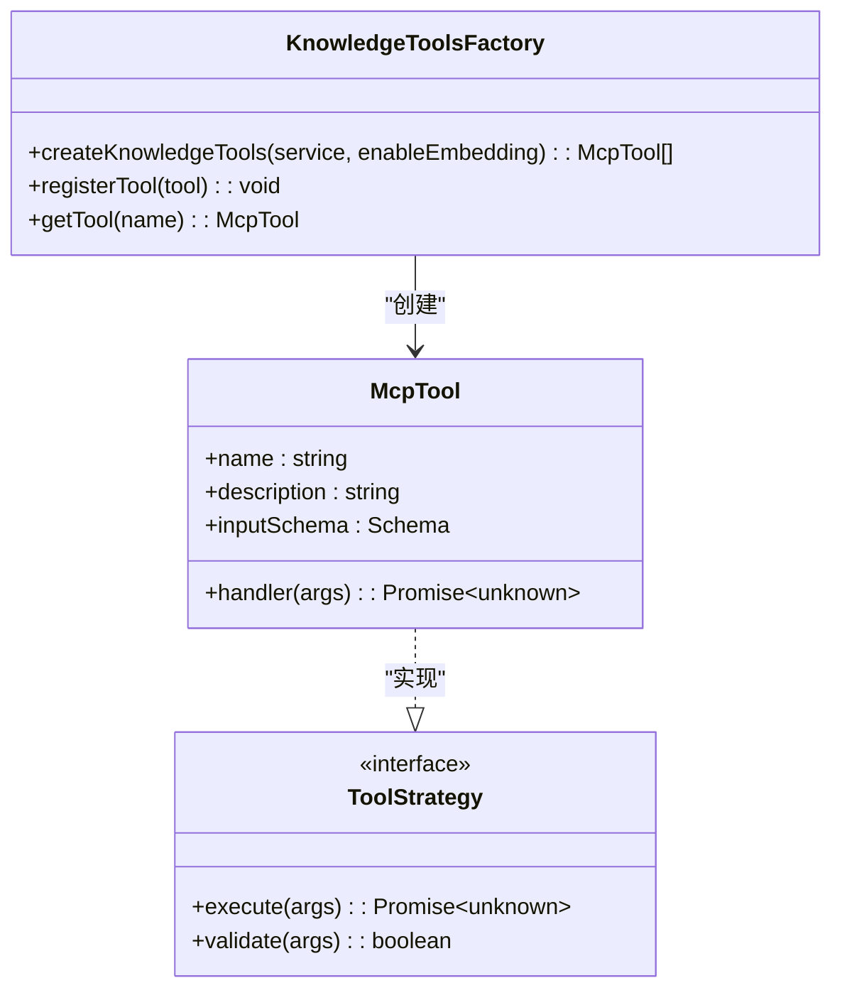
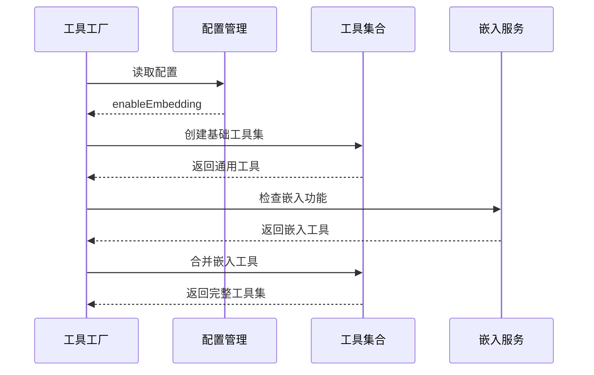
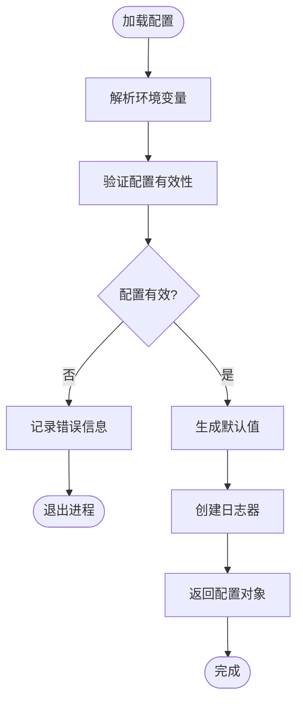

# 代码架构设计

<cite>
**本文引用的文件**
- [src/index.ts](file://src/index.ts)
- [src/types.ts](file://src/types.ts)
- [src/services/knowledge-service.ts](file://src/services/knowledge-service.ts)
- [src/services/embedding-service.ts](file://src/services/embedding-service.ts)
- [src/tools/knowledge-tools.ts](file://src/tools/knowledge-tools.ts)
- [src/utils/config.ts](file://src/utils/config.ts)
- [package.json](file://package.json)
- [examples/mcp-config.json](file://examples/mcp-config.json)
</cite>

## 目录
1. [简介](#简介)
2. [项目结构](#项目结构)
3. [核心组件](#核心组件)
4. [架构总览](#架构总览)
5. [详细组件分析](#详细组件分析)
6. [依赖关系分析](#依赖关系分析)
7. [性能考虑](#性能考虑)
8. [故障排除指南](#故障排除指南)
9. [结论](#结论)

## 简介
本项目是一个基于 MongoDB 的 MCP（Model Context Protocol）服务器实现，提供跨 IDE 的知识库管理能力。系统支持八种知识类型（记忆、技能、规则、MCP 配置、经验、命令、上下文、工作流），并通过嵌入服务实现语义搜索。项目采用分层架构设计，包含服务层、工具层、工具层，强调模块化、可扩展性和跨平台兼容性。

## 项目结构
项目采用按功能模块划分的目录结构，主要包含以下核心模块：
- `src/services/`：服务层，负责业务逻辑和数据访问
- `src/tools/`：工具层，提供 MCP 工具集
- `src/utils/`：工具层，提供配置管理和日志工具
- `src/types.ts`：类型定义，统一的数据模型和接口
- `examples/`：示例配置文件，展示不同 IDE 的集成方式

```mermaid
graph TB
subgraph "应用入口"
Index[src/index.ts]
end
subgraph "服务层"
KnowledgeService[src/services/knowledge-service.ts]
EmbeddingService[src/services/embedding-service.ts]
end
subgraph "工具层"
KnowledgeTools[src/tools/knowledge-tools.ts]
end
subgraph "工具层"
ConfigUtils[src/utils/config.ts]
end
subgraph "类型定义"
Types[src/types.ts]
end
subgraph "外部依赖"
Mongo[mongodb]
Transformers[@xenova/transformers]
MCPSDK[@modelcontextprotocol/sdk]
end
Index --> KnowledgeService
Index --> KnowledgeTools
Index --> ConfigUtils
KnowledgeService --> Mongo
KnowledgeService --> EmbeddingService
KnowledgeTools --> KnowledgeService
EmbeddingService --> Transformers
Index --> MCPSDK
KnowledgeService --> Types
KnowledgeTools --> Types
ConfigUtils --> Types
```

**图表来源**
- [src/index.ts](file://src/index.ts#L1-L148)
- [src/services/knowledge-service.ts](file://src/services/knowledge-service.ts#L1-L404)
- [src/services/embedding-service.ts](file://src/services/embedding-service.ts#L1-L148)
- [src/tools/knowledge-tools.ts](file://src/tools/knowledge-tools.ts#L1-L1093)
- [src/utils/config.ts](file://src/utils/config.ts#L1-L147)

**章节来源**
- [src/index.ts](file://src/index.ts#L1-L148)
- [package.json](file://package.json#L1-L48)

## 核心组件
系统的核心组件包括知识服务、嵌入服务、工具集和配置管理，它们协同工作提供完整的知识库管理能力。

### 知识服务（KnowledgeService）
知识服务是系统的核心业务逻辑层，负责：
- 知识文档的 CRUD 操作
- 用户上下文管理和跨设备同步
- 语义搜索和嵌入生成功能
- 批量导入导出操作

### 嵌入服务（EmbeddingService）
嵌入服务提供向量嵌入生成功能，支持：
- 基于 Transformers.js 的文本向量化
- 余弦相似度计算
- 懒加载模型初始化
- 单例模式确保资源复用

### 工具集（KnowledgeTools）
工具集提供 MCP 兼容的工具接口，包含：
- 通用 CRUD 工具（knowledge_create, knowledge_read, knowledge_update, knowledge_delete, knowledge_list, knowledge_stats, knowledge_upsert）
- 快捷工具（memory_add, memory_search, experience_add, command_add, context_set, mcp_sync, rule_sync, skill_sync, workflow_create）
- 嵌入工具（semantic_search, generate_embeddings）
- 导出工具（knowledge_export）

### 配置管理（ConfigUtils）
配置管理提供：
- 环境变量解析和验证
- 默认值生成机制
- 日志级别控制
- IDE 来源识别

**章节来源**
- [src/services/knowledge-service.ts](file://src/services/knowledge-service.ts#L20-L404)
- [src/services/embedding-service.ts](file://src/services/embedding-service.ts#L11-L148)
- [src/tools/knowledge-tools.ts](file://src/tools/knowledge-tools.ts#L29-L1093)
- [src/utils/config.ts](file://src/utils/config.ts#L76-L147)

## 架构总览
系统采用分层架构设计，各层职责明确，耦合度低，便于维护和扩展。



**图表来源**
- [src/index.ts](file://src/index.ts#L16-L82)
- [src/services/knowledge-service.ts](file://src/services/knowledge-service.ts#L44-L66)
- [src/services/embedding-service.ts](file://src/services/embedding-service.ts#L142-L147)

### 控制流分析
系统启动时的典型流程如下：



**图表来源**
- [src/index.ts](file://src/index.ts#L87-L145)
- [src/tools/knowledge-tools.ts](file://src/tools/knowledge-tools.ts#L36-L107)

**章节来源**
- [src/index.ts](file://src/index.ts#L87-L145)

## 详细组件分析

### 知识服务类分析
知识服务采用面向对象设计，提供完整的 CRUD 操作和高级功能。



**图表来源**
- [src/services/knowledge-service.ts](file://src/services/knowledge-service.ts#L20-L404)
- [src/services/embedding-service.ts](file://src/services/embedding-service.ts#L11-L148)

#### 数据模型设计
系统定义了统一的知识文档类型系统，支持八种不同的知识类型：


**图表来源**
- [src/types.ts](file://src/types.ts#L24-L269)

**章节来源**
- [src/services/knowledge-service.ts](file://src/services/knowledge-service.ts#L20-L404)
- [src/types.ts](file://src/types.ts#L1-L269)

### 嵌入服务类分析
嵌入服务实现了单例模式和懒加载机制，确保资源的有效利用。



**图表来源**
- [src/services/embedding-service.ts](file://src/services/embedding-service.ts#L11-L148)

#### 语义搜索算法流程
嵌入服务的语义搜索功能实现了完整的向量相似度计算流程：



**图表来源**
- [src/services/knowledge-service.ts](file://src/services/knowledge-service.ts#L272-L299)
- [src/services/embedding-service.ts](file://src/services/embedding-service.ts#L85-L104)

**章节来源**
- [src/services/embedding-service.ts](file://src/services/embedding-service.ts#L11-L148)

### 工具集设计分析
工具集采用了工厂模式和策略模式的组合设计，提供了灵活的工具注册机制。



**图表来源**
- [src/tools/knowledge-tools.ts](file://src/tools/knowledge-tools.ts#L7-L16)
- [src/tools/knowledge-tools.ts](file://src/tools/knowledge-tools.ts#L29-L32)

#### 工具注册流程
工具集的动态注册机制支持根据配置条件启用不同的工具集：



**图表来源**
- [src/tools/knowledge-tools.ts](file://src/tools/knowledge-tools.ts#L999-L1092)

**章节来源**
- [src/tools/knowledge-tools.ts](file://src/tools/knowledge-tools.ts#L29-L1093)

### 配置管理分析
配置管理系统实现了环境变量解析、验证和默认值生成的完整流程。



**图表来源**
- [src/utils/config.ts](file://src/utils/config.ts#L76-L115)

**章节来源**
- [src/utils/config.ts](file://src/utils/config.ts#L76-L147)

## 依赖关系分析
系统的依赖关系清晰明确，遵循单一职责原则和依赖倒置原则。

```mermaid
graph TB
subgraph "核心依赖"
MongoDB[mongodb ^6.3.0]
Transformers[@xenova/transformers ^2.17.2]
MCP_SDK[@modelcontextprotocol/sdk ^1.0.0]
end
subgraph "开发依赖"
TypeScript[typescript ^5.3.0]
ESLint[eslint ^8.55.0]
TSX[tsx ^4.6.0]
end
subgraph "运行时依赖"
Zod[zod ^3.22.4]
end
subgraph "应用层"
Index[src/index.ts]
Types[src/types.ts]
end
subgraph "服务层"
KnowledgeService[src/services/knowledge-service.ts]
EmbeddingService[src/services/embedding-service.ts]
end
subgraph "工具层"
KnowledgeTools[src/tools/knowledge-tools.ts]
ConfigUtils[src/utils/config.ts]
end
Index --> KnowledgeService
Index --> KnowledgeTools
Index --> ConfigUtils
KnowledgeService --> MongoDB
KnowledgeService --> EmbeddingService
KnowledgeTools --> KnowledgeService
EmbeddingService --> Transformers
Index --> MCP_SDK
KnowledgeService --> Types
KnowledgeTools --> Types
ConfigUtils --> Types
```

**图表来源**
- [package.json](file://package.json#L30-L43)
- [src/index.ts](file://src/index.ts#L3-L11)

### 设计模式应用
系统中应用了多种设计模式来提高代码质量和可维护性：

#### 单例模式
嵌入服务使用单例模式确保模型实例的唯一性和资源复用：
- 懒加载机制避免不必要的初始化
- 并发初始化保护防止重复创建
- 全局实例管理简化使用

#### 工厂模式
工具集使用工厂模式动态创建工具实例：
- 配置驱动的工具创建
- 条件性工具启用
- 统一的工具注册接口

#### 策略模式
工具的执行策略通过接口抽象：
- 统一的工具接口定义
- 灵活的工具实现替换
- 输入参数的标准化处理

**章节来源**
- [src/services/embedding-service.ts](file://src/services/embedding-service.ts#L142-L147)
- [src/tools/knowledge-tools.ts](file://src/tools/knowledge-tools.ts#L29-L32)
- [src/tools/knowledge-tools.ts](file://src/tools/knowledge-tools.ts#L7-L16)

## 性能考虑
系统在设计时充分考虑了性能优化和资源管理：

### 数据库性能优化
- 多字段复合索引支持高效查询
- 用户级数据隔离确保查询性能
- 批量操作减少网络往返
- 懒加载避免不必要的数据库连接

### 内存管理
- 单例模式避免重复内存分配
- 模型懒加载减少初始内存占用
- 流式处理支持大数据集操作
- 及时释放数据库连接

### 网络通信优化
- MCP 协议的高效消息传递
- 异步操作避免阻塞
- 错误处理减少重试开销
- 资源清理确保长期稳定运行

## 故障排除指南
系统提供了完善的错误处理和诊断机制：

### 常见问题及解决方案
1. **数据库连接失败**
   - 检查 MONGO_URI 配置
   - 验证网络连通性
   - 确认数据库凭据

2. **嵌入模型加载失败**
   - 检查网络连接
   - 验证模型名称
   - 查看模型缓存状态

3. **工具调用异常**
   - 检查工具参数格式
   - 验证工具权限
   - 查看日志输出

### 调试建议
- 启用详细日志级别进行问题定位
- 使用最小化配置重现问题
- 检查系统资源使用情况
- 验证依赖版本兼容性

**章节来源**
- [src/utils/config.ts](file://src/utils/config.ts#L120-L146)
- [src/index.ts](file://src/index.ts#L94-L98)

## 结论
本项目展现了良好的软件架构设计，通过分层架构、模块化设计和设计模式的应用，实现了高内聚、低耦合的系统结构。系统支持跨 IDE 的知识库管理，具备良好的扩展性和维护性。建议在未来版本中进一步完善单元测试覆盖、监控指标收集和自动化部署流程，以提升系统的生产可用性。