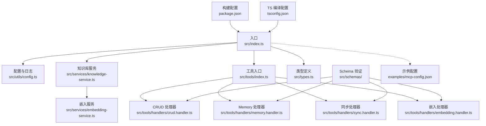
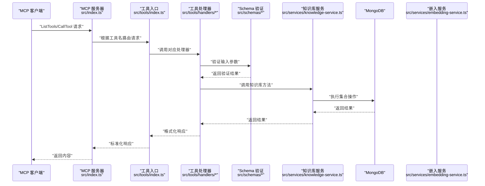
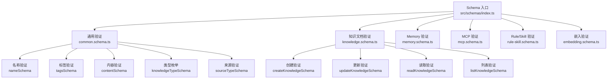
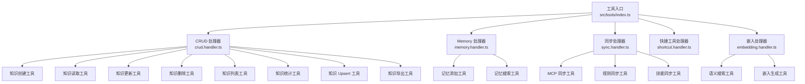
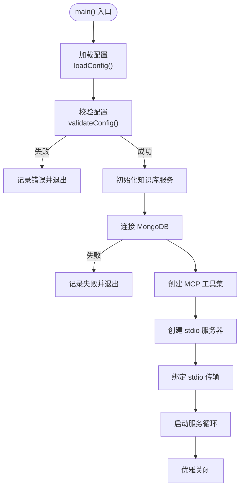
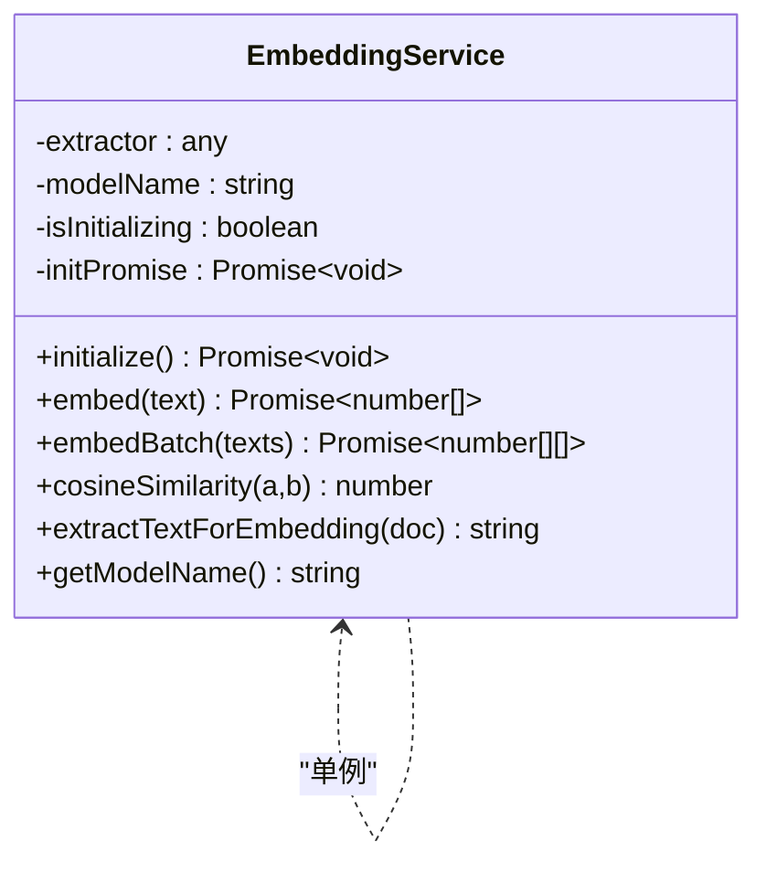
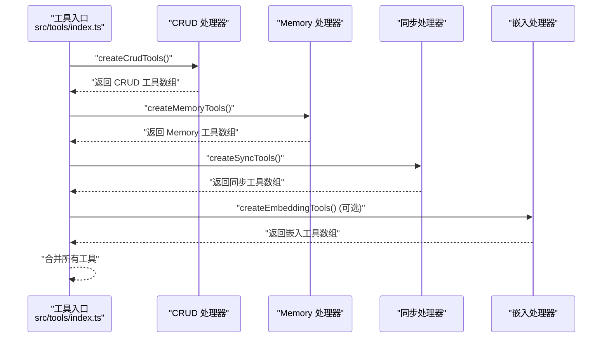
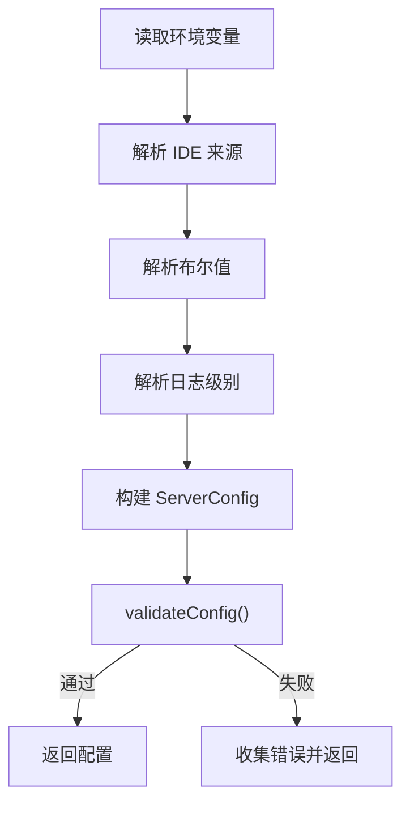
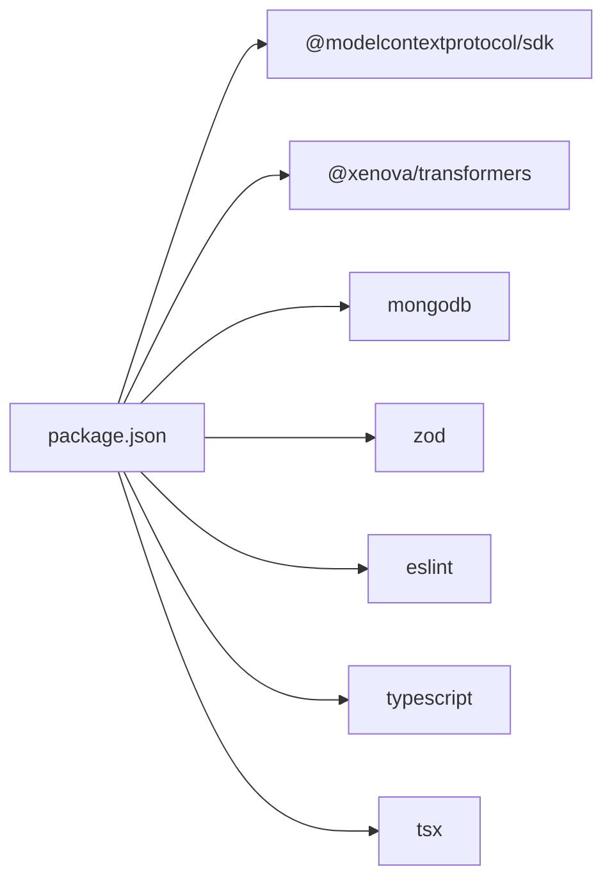

# 代码规范与最佳实践

<cite>
**本文引用的文件**
- [package.json](file://package.json)
- [tsconfig.json](file://tsconfig.json)
- [src/index.ts](file://src/index.ts)
- [src/types.ts](file://src/types.ts)
- [src/utils/config.ts](file://src/utils/config.ts)
- [src/services/knowledge-service.ts](file://src/services/knowledge-service.ts)
- [src/tools/index.ts](file://src/tools/index.ts)
- [src/tools/handlers/crud.handler.ts](file://src/tools/handlers/crud.handler.ts)
- [src/tools/handlers/memory.handler.ts](file://src/tools/handlers/memory.handler.ts)
- [src/tools/handlers/sync.handler.ts](file://src/tools/handlers/sync.handler.ts)
- [src/tools/handlers/embedding.handler.ts](file://src/tools/handlers/embedding.handler.ts)
- [src/schemas/index.ts](file://src/schemas/index.ts)
- [src/schemas/common.schema.ts](file://src/schemas/common.schema.ts)
- [src/schemas/knowledge.schema.ts](file://src/schemas/knowledge.schema.ts)
- [src/schemas/memory.schema.ts](file://src/schemas/memory.schema.ts)
- [src/schemas/rule-skill.schema.ts](file://src/schemas/rule-skill.schema.ts)
- [src/schemas/mcp.schema.ts](file://src/schemas/mcp.schema.ts)
- [src/schemas/embedding.schema.ts](file://src/schemas/embedding.schema.ts)
- [src/services/embedding-service.ts](file://src/services/embedding-service.ts)
- [examples/mcp-config.json](file://examples/mcp-config.json)
</cite>

## 更新摘要
**所做更改**
- 新增 Schema 验证系统章节，详细介绍 Zod 模式的使用
- 更新模块化架构章节，说明新的工具处理器组织方式
- 增加 Schema 集成的最佳实践指导
- 更新工具处理器与 Schema 验证的集成示例

## 目录
1. [简介](#简介)
2. [项目结构](#项目结构)
3. [核心组件](#核心组件)
4. [架构总览](#架构总览)
5. [Schema 验证系统](#schema-验证系统)
6. [模块化架构](#模块化架构)
7. [详细组件分析](#详细组件分析)
8. [依赖关系分析](#依赖关系分析)
9. [性能考虑](#性能考虑)
10. [故障排查指南](#故障排查指南)
11. [结论](#结论)
12. [附录](#附录)

## 简介
本指南面向本项目的 TypeScript 开发团队，旨在建立统一的代码规范、最佳实践与质量保障流程。内容覆盖：
- TypeScript 编码规范、命名约定与代码风格
- ESLint 配置与代码质量检查流程
- 函数设计原则、错误处理模式与日志记录规范
- 数据验证与类型安全（Zod 使用现状与改进建议）
- 代码注释规范、文档编写要求与测试覆盖率标准
- 常见编码模式与反模式对比
- 性能优化建议与内存管理最佳实践
- **新增** Schema 验证系统的使用与最佳实践

## 项目结构
该项目采用模块化分层组织，现已引入 Schema 验证系统和新的模块化架构：
- 入口与服务编排：src/index.ts
- 类型定义：src/types.ts
- 工具与配置：src/utils/config.ts
- 业务服务：src/services/knowledge-service.ts、src/services/embedding-service.ts
- **新增** Schema 验证：src/schemas/
- **新增** 工具处理器：src/tools/handlers/
- MCP 工具集：src/tools/index.ts
- 示例配置：examples/mcp-config.json
- 构建与类型配置：package.json、tsconfig.json



**图表来源**
- [src/index.ts](file://src/index.ts#L1-L148)
- [src/utils/config.ts](file://src/utils/config.ts#L1-L147)
- [src/services/knowledge-service.ts](file://src/services/knowledge-service.ts#L1-L437)
- [src/tools/index.ts](file://src/tools/index.ts#L1-L57)
- [src/tools/handlers/crud.handler.ts](file://src/tools/handlers/crud.handler.ts#L1-L403)
- [src/tools/handlers/memory.handler.ts](file://src/tools/handlers/memory.handler.ts#L1-L115)
- [src/tools/handlers/sync.handler.ts](file://src/tools/handlers/sync.handler.ts#L1-L196)
- [src/tools/handlers/embedding.handler.ts](file://src/tools/handlers/embedding.handler.ts#L1-L99)
- [src/schemas/index.ts](file://src/schemas/index.ts#L1-L22)

**章节来源**
- [src/index.ts](file://src/index.ts#L1-L148)
- [package.json](file://package.json#L1-L48)
- [tsconfig.json](file://tsconfig.json#L1-L21)

## 核心组件
- 入口与服务器：负责初始化配置、连接数据库、注册 MCP 工具、启动 stdio 传输与优雅退出。
- 知识库服务：封装 MongoDB 操作、索引管理、CRUD、批量操作、语义搜索与嵌入生成。
- 嵌入服务：基于 @xenova/transformers 的特征提取与余弦相似度计算。
- **新增** Schema 验证系统：提供统一的数据验证模式，支持通用字段、知识文档、Memory、MCP、Rule/Skill 和嵌入验证。
- **新增** 模块化工具处理器：将不同类型的工具功能分离到独立的处理器文件中，提高代码可维护性。
- MCP 工具集：提供通用 CRUD、快捷工具（记忆、经验、命令、上下文、MCP、规则、技能、工作流）、导出与可选的语义搜索/嵌入生成功能。
- 配置与日志：解析环境变量、校验配置、按级别输出日志。

**章节来源**
- [src/index.ts](file://src/index.ts#L1-L148)
- [src/services/knowledge-service.ts](file://src/services/knowledge-service.ts#L1-L437)
- [src/services/embedding-service.ts](file://src/services/embedding-service.ts#L1-L169)
- [src/schemas/index.ts](file://src/schemas/index.ts#L1-L22)
- [src/tools/index.ts](file://src/tools/index.ts#L1-L57)
- [src/tools/handlers/crud.handler.ts](file://src/tools/handlers/crud.handler.ts#L1-L403)
- [src/tools/handlers/memory.handler.ts](file://src/tools/handlers/memory.handler.ts#L1-L115)
- [src/tools/handlers/sync.handler.ts](file://src/tools/handlers/sync.handler.ts#L1-L196)
- [src/tools/handlers/embedding.handler.ts](file://src/tools/handlers/embedding.handler.ts#L1-L99)
- [src/utils/config.ts](file://src/utils/config.ts#L1-L147)

## 架构总览
系统以 MCP 服务器为核心，通过 stdio 与客户端通信；服务层负责数据持久化与检索，工具层提供统一的 API 接口，嵌入服务提供语义能力。新增的 Schema 验证系统在整个数据流中提供类型安全保证。



**图表来源**
- [src/index.ts](file://src/index.ts#L16-L82)
- [src/tools/index.ts](file://src/tools/index.ts#L23-L47)
- [src/tools/handlers/crud.handler.ts](file://src/tools/handlers/crud.handler.ts#L47-L81)
- [src/schemas/knowledge.schema.ts](file://src/schemas/knowledge.schema.ts#L17-L30)
- [src/services/knowledge-service.ts](file://src/services/knowledge-service.ts#L143-L160)

## Schema 验证系统

### 概述
项目现已引入完整的 Zod Schema 验证系统，提供统一的数据验证和类型推断机制。Schema 系统采用模块化设计，支持通用字段验证和特定业务场景的验证模式。

### 核心架构


**图表来源**
- [src/schemas/index.ts](file://src/schemas/index.ts#L1-L22)
- [src/schemas/common.schema.ts](file://src/schemas/common.schema.ts#L1-L86)
- [src/schemas/knowledge.schema.ts](file://src/schemas/knowledge.schema.ts#L1-L83)
- [src/schemas/memory.schema.ts](file://src/schemas/memory.schema.ts#L1-L44)
- [src/schemas/mcp.schema.ts](file://src/schemas/mcp.schema.ts#L1-L26)
- [src/schemas/rule-skill.schema.ts](file://src/schemas/rule-skill.schema.ts#L1-L43)
- [src/schemas/embedding.schema.ts](file://src/schemas/embedding.schema.ts#L1-L24)

### 通用验证模式
通用验证模式提供基础的数据验证能力，包括：
- **名称验证**：支持中文、英文、数字、下划线、中划线的混合命名
- **标签验证**：限制标签数量和长度，支持可选标签数组
- **内容验证**：支持字符串和对象两种内容格式
- **类型枚举**：定义所有支持的知识文档类型
- **来源验证**：支持多种 IDE 和来源类型
- **分页参数**：统一的分页验证逻辑

### 业务验证模式
针对不同业务场景的专用验证模式：
- **知识文档验证**：涵盖 CRUD 操作的完整验证逻辑
- **Memory 验证**：支持分类、重要程度等 Memory 特有字段
- **MCP 验证**：验证 MCP 配置的命令、参数、环境变量等
- **Rule/Skill 验证**：支持触发模式、优先级等业务属性
- **嵌入验证**：语义搜索和嵌入生成的参数验证

### 类型推断与使用
Schema 系统提供完整的 TypeScript 类型推断：
- 每个 Schema 对应一个对应的 TypeScript 类型
- 支持 `z.infer<typeof schema>` 形式的类型推断
- 自动生成强类型的输入输出类型定义

**章节来源**
- [src/schemas/index.ts](file://src/schemas/index.ts#L1-L22)
- [src/schemas/common.schema.ts](file://src/schemas/common.schema.ts#L1-L86)
- [src/schemas/knowledge.schema.ts](file://src/schemas/knowledge.schema.ts#L1-L83)
- [src/schemas/memory.schema.ts](file://src/schemas/memory.schema.ts#L1-L44)
- [src/schemas/mcp.schema.ts](file://src/schemas/mcp.schema.ts#L1-L26)
- [src/schemas/rule-skill.schema.ts](file://src/schemas/rule-skill.schema.ts#L1-L43)
- [src/schemas/embedding.schema.ts](file://src/schemas/embedding.schema.ts#L1-L24)

## 模块化架构

### 架构概述
项目采用模块化的工具处理器架构，将不同功能的工具分离到独立的处理器文件中，提高代码的可维护性和可测试性。

### 处理器组织结构


**图表来源**
- [src/tools/index.ts](file://src/tools/index.ts#L23-L47)
- [src/tools/handlers/crud.handler.ts](file://src/tools/handlers/crud.handler.ts#L9-L403)
- [src/tools/handlers/memory.handler.ts](file://src/tools/handlers/memory.handler.ts#L7-L115)
- [src/tools/handlers/sync.handler.ts](file://src/tools/handlers/sync.handler.ts#L7-L196)
- [src/tools/handlers/embedding.handler.ts](file://src/tools/handlers/embedding.handler.ts#L9-L99)

### 处理器设计原则
- **单一职责**：每个处理器专注于一类工具功能
- **可组合性**：处理器通过工具入口统一导出和组合
- **可扩展性**：新增工具只需创建新的处理器文件
- **类型安全**：与 Schema 验证系统深度集成

### 工具创建模式
所有处理器遵循统一的创建模式：
1. 导入必要的依赖和服务
2. 定义工具的输入 Schema
3. 实现工具处理器逻辑
4. 返回标准化的工具定义

**章节来源**
- [src/tools/index.ts](file://src/tools/index.ts#L1-L57)
- [src/tools/handlers/crud.handler.ts](file://src/tools/handlers/crud.handler.ts#L1-L403)
- [src/tools/handlers/memory.handler.ts](file://src/tools/handlers/memory.handler.ts#L1-L115)
- [src/tools/handlers/sync.handler.ts](file://src/tools/handlers/sync.handler.ts#L1-L196)
- [src/tools/handlers/embedding.handler.ts](file://src/tools/handlers/embedding.handler.ts#L1-L99)

## 详细组件分析

### 入口与服务器（src/index.ts）
- 责任边界清晰：仅负责生命周期管理、配置加载与校验、服务初始化与优雅退出。
- 错误处理：对未知工具与异常进行统一包装，返回结构化错误。
- 日志记录：启动阶段输出关键信息，异常时输出错误日志。
- 信号处理：监听 SIGINT/SIGTERM，确保资源释放。



**图表来源**
- [src/index.ts](file://src/index.ts#L87-L145)

**章节来源**
- [src/index.ts](file://src/index.ts#L1-L148)

### 知识库服务（src/services/knowledge-service.ts）
- 设计要点
  - 用户上下文注入：所有写入操作自动携带 userId/deviceId/ideSource/syncVersion。
  - 索引策略：为用户级唯一性、类型过滤、标签查询、时间排序建立复合索引。
  - 查询与聚合：支持模糊搜索、标签过滤、分页与计数。
  - 语义搜索：结合嵌入服务进行余弦相似度排序与阈值过滤。
  - 批量操作：批量导入/导出，提升运维效率。
- 错误处理：未连接抛错；重复键错误转换为友好提示；更新/删除返回布尔值表示存在性。
- 并发与一致性：使用 MongoDB 原子更新与自增版本号实现冲突检测。

```mermaid
classDiagram
class KnowledgeService {
-client : MongoClient
-db : Db
-collection : Collection
-mongoUri : string
-database : string
-collectionName : string
-userContext : UserContext
+connect() Promise~void~
+disconnect() Promise~void~
+ensureIndexes() Promise~void~
+create(doc) Promise~KnowledgeDocument~
+get(type,name) Promise~KnowledgeDocument|null~
+getById(id) Promise~KnowledgeDocument|null~
+update(type,name,updates) Promise~KnowledgeDocument|null~
+delete(type,name) Promise~boolean~
+list(options) Promise~KnowledgeDocument[]~
+count(type?) Promise~Record|number|number~
+bulkImport(docs) Promise~number~
+bulkExport(type?) Promise~KnowledgeDocument[]~
+semanticSearch(query,options?) Promise~(KnowledgeDocument&{score : number})[]~
+generateEmbedding(doc) Promise~number[]~
+generateEmbeddings(type?) Promise~number~
+createWithEmbedding(doc) Promise~KnowledgeDocument~
+getUserContext() UserContext
+exists(type,name) Promise~boolean~
+upsert(type,name,doc) Promise~KnowledgeDocument~
}
class UserContext {
+userId : string
+deviceId : string
+ideSource : SourceType
}
KnowledgeService --> UserContext : "注入用户上下文"
```

**图表来源**
- [src/services/knowledge-service.ts](file://src/services/knowledge-service.ts#L20-L437)

**章节来源**
- [src/services/knowledge-service.ts](file://src/services/knowledge-service.ts#L1-L437)

### 嵌入服务（src/services/embedding-service.ts）
- 特征提取：基于 Transformers.js 的 feature-extraction，支持 mean pooling 与归一化。
- 懒加载与并发控制：单例模式 + 初始化互斥，避免重复加载。
- 批量处理：逐条生成向量，便于后续扩展批处理。
- 相似度计算：余弦相似度，输入向量长度校验。



**图表来源**
- [src/services/embedding-service.ts](file://src/services/embedding-service.ts#L12-L169)

**章节来源**
- [src/services/embedding-service.ts](file://src/services/embedding-service.ts#L1-L169)

### 工具入口与处理器（src/tools/index.ts）
- **新增** 工具入口：统一管理所有工具处理器，提供灵活的工具组合能力。
- **新增** 模块化处理器：将不同功能的工具分离到独立的处理器文件中。
- **新增** 可选嵌入工具：根据配置动态启用语义搜索功能。
- **新增** 类型导出：提供完整的 TypeScript 类型定义。



**图表来源**
- [src/tools/index.ts](file://src/tools/index.ts#L23-L47)
- [src/tools/handlers/crud.handler.ts](file://src/tools/handlers/crud.handler.ts#L9-L403)
- [src/tools/handlers/memory.handler.ts](file://src/tools/handlers/memory.handler.ts#L7-L115)
- [src/tools/handlers/sync.handler.ts](file://src/tools/handlers/sync.handler.ts#L7-L196)
- [src/tools/handlers/embedding.handler.ts](file://src/tools/handlers/embedding.handler.ts#L9-L99)

**章节来源**
- [src/tools/index.ts](file://src/tools/index.ts#L1-L57)

### 配置与日志（src/utils/config.ts）
- 配置来源优先级：MCP 客户端 env > 系统环境变量 > 默认值
- 类型安全：使用联合类型与枚举限定取值范围
- 日志级别：debug/info/warn/error，按级别输出
- 设备标识：基于主机名与 IDE 来源生成



**图表来源**
- [src/utils/config.ts](file://src/utils/config.ts#L76-L115)

**章节来源**
- [src/utils/config.ts](file://src/utils/config.ts#L1-L147)

### 类型定义（src/types.ts）
- 知识类型：8 种文档类型（Memories、Skills、Rules、MCPs、Experiences、Commands、Contexts、Workflows）
- 文档结构：统一字段（类型、名称、内容、标签、启用状态、用户与设备标识、同步版本、时间戳、嵌入等）
- 联合类型：AnyKnowledgeDocument 聚合所有类型，便于统一处理
- 查询选项：ListOptions、SemanticSearchOptions

**章节来源**
- [src/types.ts](file://src/types.ts#L1-L269)

## 依赖关系分析
- 运行时依赖：@modelcontextprotocol/sdk、@xenova/transformers、mongodb、zod
- 开发依赖：@typescript-eslint/eslint-plugin、@typescript-eslint/parser、eslint、tsx、typescript
- 构建与脚本：build、start、dev、lint、typecheck



**图表来源**
- [package.json](file://package.json#L30-L46)

**章节来源**
- [package.json](file://package.json#L1-L48)

## 性能考虑
- 数据库层面
  - 复合索引：用户级唯一索引、类型过滤、标签查询、时间排序，减少全表扫描
  - 分页与限制：list 接口支持 limit/offset，避免一次性返回大量数据
  - 批量导入/导出：提升运维效率，降低单次请求压力
- 嵌入与语义搜索
  - 懒加载模型：首次使用时加载，避免冷启动开销
  - 余弦相似度：O(n) 计算，建议配合阈值与 limit 控制结果规模
- 内存管理
  - 流式游标：使用 find().sort().skip().limit() 返回数组，注意大数据量时的内存占用
  - 单例嵌入服务：避免重复实例化导致的内存浪费
- 并发与锁
  - 初始化互斥：防止重复初始化
  - MongoDB 原子更新：使用 findOneAndUpdate 与自增版本号，避免竞态

**章节来源**
- [src/services/knowledge-service.ts](file://src/services/knowledge-service.ts#L71-L119)
- [src/services/embedding-service.ts](file://src/services/embedding-service.ts#L25-L52)

## 故障排查指南
- 启动失败
  - 检查 MONGO_URI、DATABASE、COLLECTION 是否正确
  - 查看日志输出，确认连接与索引创建是否成功
- 工具调用失败
  - 确认工具名称是否存在
  - 检查输入参数是否满足 required 字段
  - 关注返回的 error 字段，定位具体问题
- 语义搜索无结果
  - 确认 ENABLE_EMBEDDING 已开启
  - 检查文档是否已生成 embedding
  - 调整阈值与 limit 参数
- 嵌入服务加载缓慢
  - 首次加载会下载模型，建议预热或离线准备
  - 检查网络与磁盘 I/O
- **新增** Schema 验证失败
  - 检查输入参数是否符合 Schema 定义
  - 关注具体的验证错误信息
  - 确认数据类型和长度限制

**章节来源**
- [src/index.ts](file://src/index.ts#L94-L98)
- [src/tools/handlers/crud.handler.ts](file://src/tools/handlers/crud.handler.ts#L74-L80)
- [src/utils/config.ts](file://src/utils/config.ts#L96-L115)

## 结论
本项目在架构上实现了清晰的分层与职责分离，现已引入完整的 Schema 验证系统和模块化架构，具备良好的可扩展性与可维护性。建议在现有基础上进一步完善：
- ESLint 配置与规则检查流程
- Zod 类型验证与运行时校验的深度集成
- 单元测试与集成测试覆盖率标准
- 更完善的注释与文档规范
- **新增** Schema 验证系统的最佳实践指导
- **新增** 模块化架构的维护和扩展指南

## 附录

### TypeScript 编码规范与命名约定
- 文件与目录
  - 文件名使用小驼峰，目录名使用小驼峰或复数名词
  - 工具与服务分别置于 utils 与 services 目录
  - **新增** Schema 文件使用 .schema.ts 后缀，处理器文件使用 .handler.ts 后缀
- 类与接口
  - 类名使用大驼峰，接口名以 I 前缀或以 er/able 后缀
  - 方法名使用动词短语，私有方法以下划线前缀
- 常量与变量
  - 常量使用全大写下划线分隔
  - 变量使用小驼峰，布尔变量以 is_/has_/can_ 前缀
- 类型与泛型
  - 类型别名使用大驼峰，联合类型使用 | 分隔
  - 泛型参数使用单字母或简短语义名
- 命名空间与模块
  - 模块名与目录一致，导出统一使用命名导出

### 代码风格要求
- 缩进与换行
  - 使用 2 空格缩进，行尾不保留空白
  - 函数声明与调用参数分行时，参数与左括号在同一行
- 注释
  - 公共 API 使用 JSDoc 注释，包含 @param/@returns/@throws
  - 复杂逻辑添加行内注释，解释"为什么"而非"是什么"
- 异常处理
  - 明确区分业务异常与系统异常
  - 返回结构化错误对象，包含 success/data/error 字段
- 日志
  - 使用统一的日志工厂，按级别输出
  - 包含上下文信息（用户、设备、时间）

### ESLint 配置与代码质量检查流程
- 当前状态
  - 已安装 eslint、@typescript-eslint/eslint-plugin、@typescript-eslint/parser
  - 脚本中提供 lint 命令
- 建议
  - 新增 .eslintrc 或 eslint.config.* 配置文件
  - 规则建议：禁用隐式 any、强制类型断言、禁止未使用的变量与导入
  - 在 CI 中集成 lint 与 typecheck 步骤

**章节来源**
- [package.json](file://package.json#L36-L42)
- [package.json](file://package.json#L10-L15)

### 函数设计原则
- 单一职责：每个函数只做一件事
- 不可变性：尽量返回新对象，避免修改入参
- 易测试：函数尽量纯函数化，必要时注入依赖
- 可组合：小函数组合成复杂流程

### 错误处理模式
- 结构化返回：统一 { success, data?, error? } 模式
- 业务异常：捕获并转换为可读错误消息
- 系统异常：记录堆栈并返回通用错误

### 日志记录规范
- 级别：debug < info < warn < error
- 内容：包含时间、级别、模块、消息与上下文
- 输出：统一通过 createLogger 工厂输出

**章节来源**
- [src/utils/config.ts](file://src/utils/config.ts#L120-L146)

### 数据验证与类型安全（Zod 使用建议）
- **更新** 现状：项目已全面采用 Zod Schema 验证系统
- **新增** 使用建议
  - 在配置加载处使用 Zod Schema 校验环境变量
  - 在工具处理器中对输入参数进行 Zod 校验
  - 在数据库写入前对文档结构进行 Zod 校验
  - 将 Zod Schema 作为契约文档，提升协作效率
  - 利用类型推断获得完整的 TypeScript 类型安全
- **新增** 集成模式
  - 通用验证模式：在多个 Schema 中复用基础验证规则
  - 业务验证模式：针对特定场景定义详细的验证规则
  - 类型推断：使用 `z.infer<typeof schema>` 获得强类型定义

### 代码注释规范与文档编写要求
- JSDoc：公共 API 必须包含 @param/@returns/@throws/@example
- 行内注释：解释复杂算法与边界条件
- README：包含安装、配置、使用示例与贡献指南
- **新增** Schema 文档：为每个 Schema 提供详细的使用说明和示例

### 测试覆盖率标准
- 建议目标：核心模块（服务层、工具集）覆盖率 ≥ 80%
- 覆盖维度：语句、分支、函数、行
- CI 集成：在 PR 中显示覆盖率变化
- **新增** Schema 测试：为每个 Schema 验证逻辑编写单元测试

### 常见编码模式与反模式
- 模式
  - 单例与懒加载：嵌入服务的单例初始化
  - 命令与查询分离：工具处理器只处理请求，业务逻辑在服务层
  - 结构化错误：统一返回结构，便于前端消费
  - **新增** Schema 验证：在数据进入系统前进行严格的类型检查
  - **新增** 模块化架构：功能分离，职责明确
- 反模式
  - 在入口中混入业务逻辑
  - 忽略数据库索引，导致查询性能差
  - 直接抛出原始异常，未转换为可读错误
  - **新增** 忽视 Schema 验证，导致运行时类型错误**
  - **新增** 处理器功能过于复杂，违反单一职责原则

### 性能优化建议与内存管理最佳实践
- 数据库
  - 合理使用索引，避免全表扫描
  - 分页与限制返回数量
  - 批量操作替代多次单次操作
- 嵌入与模型
  - 预热模型，避免首请求延迟
  - 控制相似度阈值与返回数量
- 内存
  - 避免在循环中累积大对象
  - 使用流式处理大数据集
  - 及时释放连接与单例实例
- **新增** Schema 性能优化
  - 复用通用验证模式，减少重复验证逻辑
  - 使用类型推断避免运行时类型检查
  - 合理使用 Schema 缓存机制

### Schema 验证系统最佳实践
- **新增** 验证层次
  - 输入验证：在工具处理器中使用 Schema 验证客户端输入
  - 业务验证：在服务层进行业务规则验证
  - 数据库验证：在写入数据库前进行最终验证
- **新增** 错误处理
  - 统一的验证错误格式
  - 详细的错误信息，包含具体失败的字段
  - 适当的错误级别和日志记录
- **新增** 类型安全
  - 充分利用 TypeScript 类型推断
  - 在编译时发现类型错误
  - 提供完整的开发体验

### 模块化架构最佳实践
- **新增** 处理器设计
  - 每个处理器专注于单一功能领域
  - 统一的处理器接口和返回格式
  - 清晰的依赖关系和导入顺序
- **新增** 工具组合
  - 通过工具入口统一管理工具集合
  - 支持动态启用/禁用工具
  - 提供灵活的工具扩展机制
- **新增** 类型安全
  - 为每个处理器提供完整的 TypeScript 定义
  - 统一的工具接口类型
  - 编译时的类型检查和错误提示