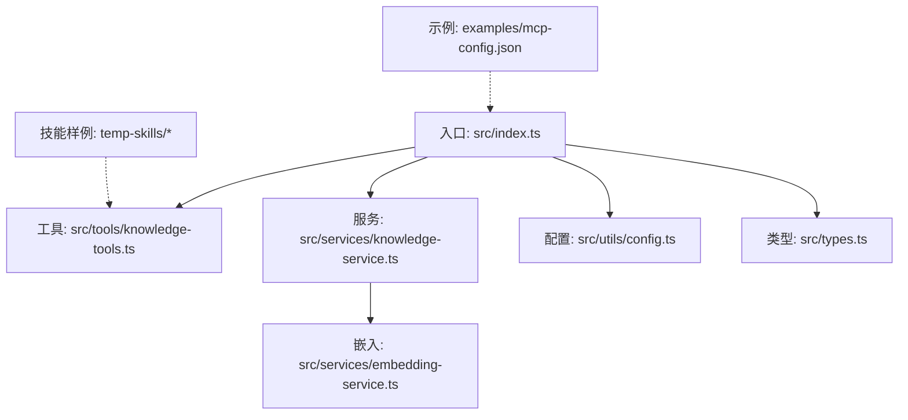
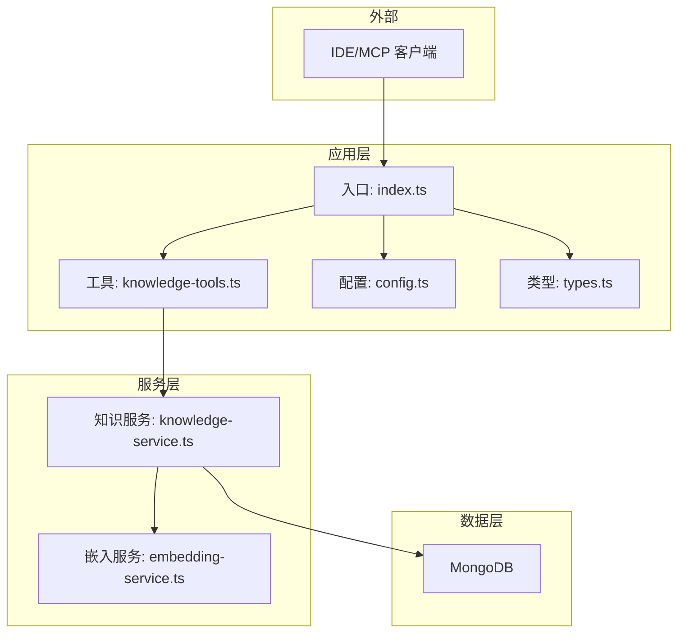
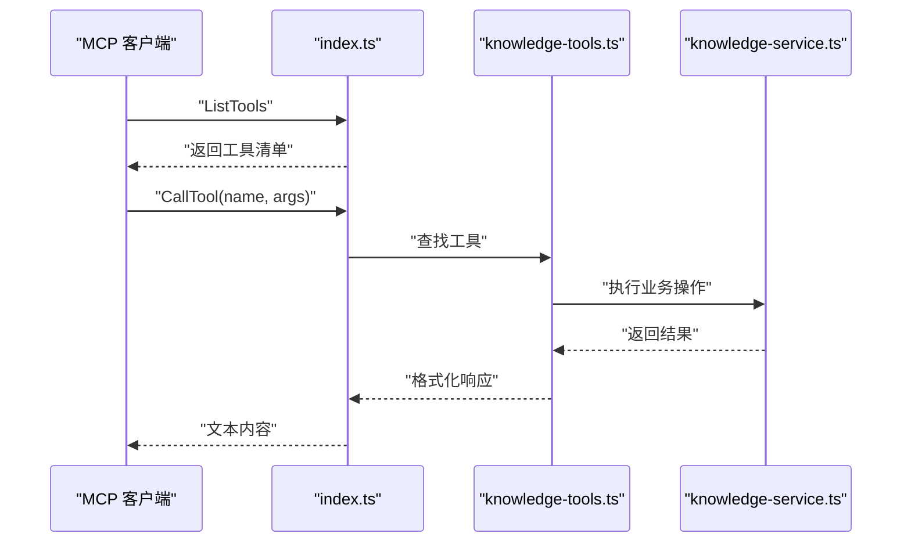
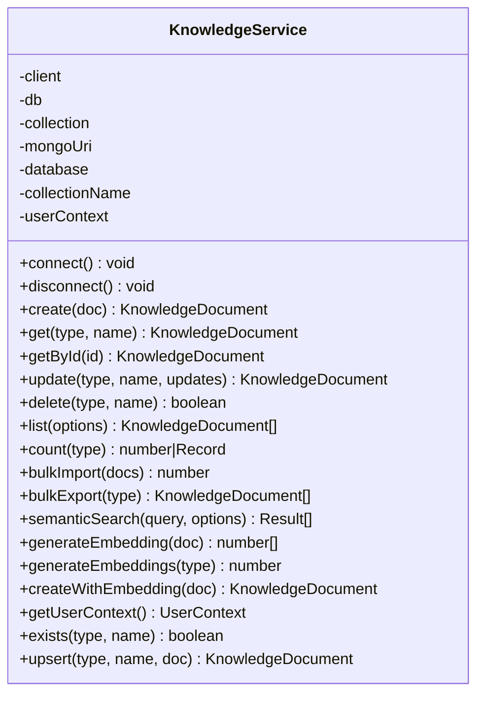
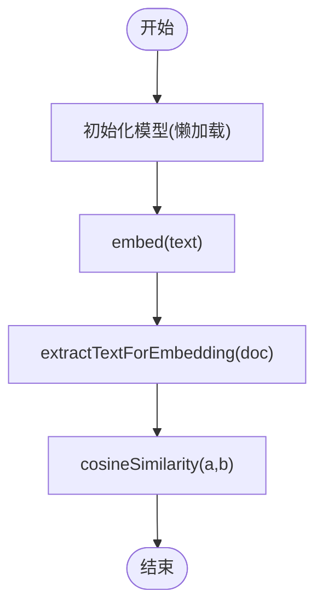
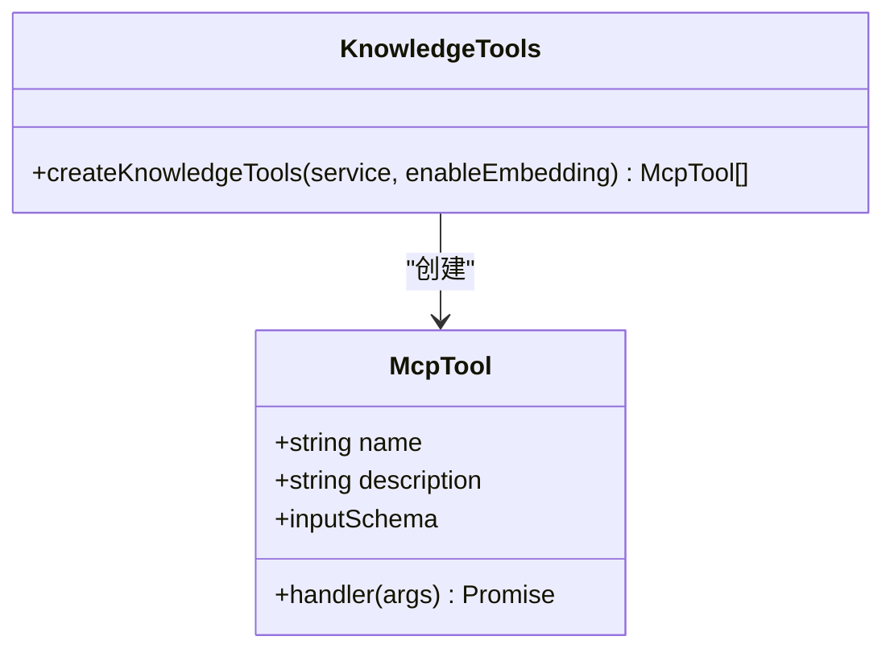
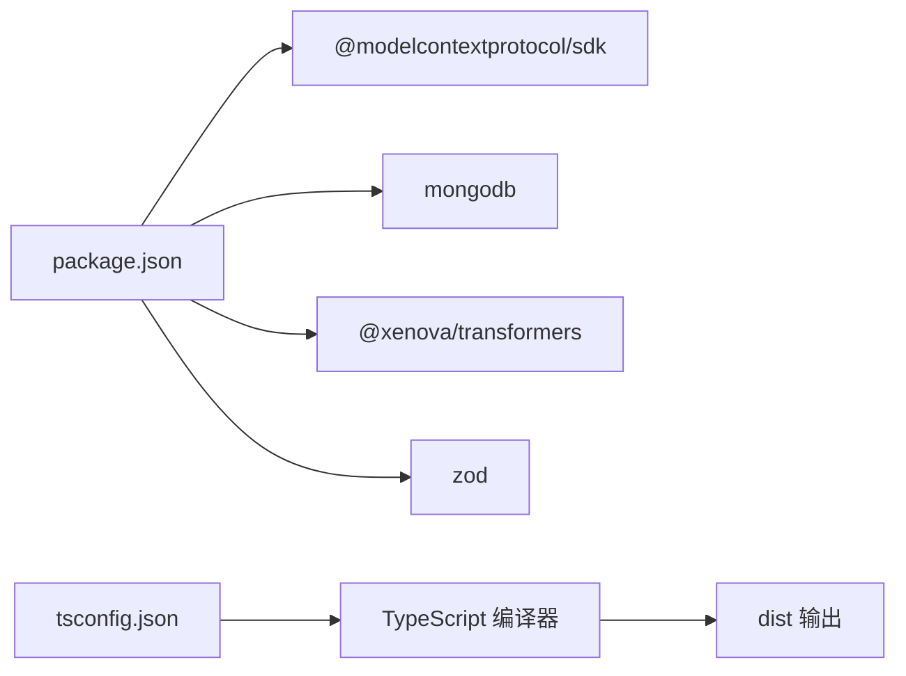

# 开发指南

<cite>
**本文引用的文件**
- [package.json](file://package.json)
- [tsconfig.json](file://tsconfig.json)
- [src/index.ts](file://src/index.ts)
- [src/types.ts](file://src/types.ts)
- [src/utils/config.ts](file://src/utils/config.ts)
- [src/services/knowledge-service.ts](file://src/services/knowledge-service.ts)
- [src/services/embedding-service.ts](file://src/services/embedding-service.ts)
- [src/tools/knowledge-tools.ts](file://src/tools/knowledge-tools.ts)
- [examples/mcp-config.json](file://examples/mcp-config.json)
- [sync-data.mjs](file://sync-data.mjs)
- [temp-skills/README.md](file://temp-skills/README.md)
- [temp-skills/skills/algorithmic-art/README.md](file://temp-skills/skills/algorithmic-art/README.md)
- [temp-skills/skills/algorithmic-art/templates/generator_template.js](file://temp-skills/skills/algorithmic-art/templates/generator_template.js)
- [temp-skills/spec/agent-skills-spec.md](file://temp-skills/spec/agent-skills-spec.md)
</cite>

## 目录
1. [简介](#简介)
2. [项目结构](#项目结构)
3. [核心组件](#核心组件)
4. [架构总览](#架构总览)
5. [详细组件分析](#详细组件分析)
6. [依赖关系分析](#依赖关系分析)
7. [性能考虑](#性能考虑)
8. [故障排查指南](#故障排查指南)
9. [结论](#结论)
10. [附录](#附录)

## 简介
本指南面向开发者，系统阐述 mongo-mcp 的代码结构、设计模式与架构原则，覆盖新功能开发流程、代码规范与测试要求，以及如何扩展知识类型、添加自定义工具与集成新功能。同时提供开发环境搭建、调试技巧、性能分析方法、贡献流程、代码评审标准、发布流程、依赖管理、版本控制与持续集成配置，并给出常见问题的解决方案与最佳实践。

## 项目结构
项目采用分层与职责分离的组织方式：
- 入口与协议层：src/index.ts 作为 MCP 服务器入口，基于 @modelcontextprotocol/sdk 实现 stdio 传输与工具注册。
- 服务层：src/services 下的知识服务与嵌入服务，负责 MongoDB 连接、索引、CRUD、批量导入导出、语义搜索与嵌入生成。
- 工具层：src/tools 定义 MCP 工具集合，封装知识库的 CRUD、统计、快捷工具与同步工具。
- 类型与配置：src/types.ts 定义知识文档类型体系；src/utils/config.ts 负责配置加载、校验与日志。
- 示例与技能：examples/mcp-config.json 展示 IDE 配置；temp-skills 提供技能样例与规范参考。

**图表来源**
- [src/index.ts](file://src/index.ts#L1-L148)
- [src/tools/knowledge-tools.ts](file://src/tools/knowledge-tools.ts#L1-L800)
- [src/services/knowledge-service.ts](file://src/services/knowledge-service.ts#L1-L404)
- [src/services/embedding-service.ts](file://src/services/embedding-service.ts#L1-L148)
- [src/utils/config.ts](file://src/utils/config.ts#L1-L147)
- [src/types.ts](file://src/types.ts#L1-L269)
- [examples/mcp-config.json](file://examples/mcp-config.json#L1-L94)
- [temp-skills/README.md](file://temp-skills/README.md#L1-L95)

**章节来源**
- [src/index.ts](file://src/index.ts#L1-L148)
- [src/types.ts](file://src/types.ts#L1-L269)
- [src/utils/config.ts](file://src/utils/config.ts#L1-L147)
- [src/services/knowledge-service.ts](file://src/services/knowledge-service.ts#L1-L404)
- [src/services/embedding-service.ts](file://src/services/embedding-service.ts#L1-L148)
- [src/tools/knowledge-tools.ts](file://src/tools/knowledge-tools.ts#L1-L800)
- [examples/mcp-config.json](file://examples/mcp-config.json#L1-L94)
- [temp-skills/README.md](file://temp-skills/README.md#L1-L95)

## 核心组件
- MCP 服务器与传输：基于 @modelcontextprotocol/sdk 的 stdio 传输，注册工具清单与调用处理器。
- 知识服务：统一的 MongoDB 访问层，提供 CRUD、批量导入导出、统计、语义搜索、嵌入生成与 upsert。
- 嵌入服务：基于 @xenova/transformers 的特征抽取与余弦相似度计算，支持懒加载与批处理。
- 工具集合：通用 CRUD、统计、快捷工具（记忆、经验、命令、上下文、MCP 同步）与规则同步。
- 配置与日志：环境变量解析、默认值生成、配置校验与分级日志输出。
- 类型系统：8 种知识类型与联合请求/选项类型，确保强类型约束。

**章节来源**
- [src/index.ts](file://src/index.ts#L1-L148)
- [src/services/knowledge-service.ts](file://src/services/knowledge-service.ts#L1-L404)
- [src/services/embedding-service.ts](file://src/services/embedding-service.ts#L1-L148)
- [src/tools/knowledge-tools.ts](file://src/tools/knowledge-tools.ts#L1-L800)
- [src/utils/config.ts](file://src/utils/config.ts#L1-L147)
- [src/types.ts](file://src/types.ts#L1-L269)

## 架构总览
系统遵循“入口-工具-服务-数据”的分层架构，MCP 协议作为对外接口，内部通过知识服务抽象数据库操作，嵌入服务提供语义检索能力，工具层封装具体业务操作。

**图表来源**
- [src/index.ts](file://src/index.ts#L1-L148)
- [src/tools/knowledge-tools.ts](file://src/tools/knowledge-tools.ts#L1-L800)
- [src/services/knowledge-service.ts](file://src/services/knowledge-service.ts#L1-L404)
- [src/services/embedding-service.ts](file://src/services/embedding-service.ts#L1-L148)
- [src/utils/config.ts](file://src/utils/config.ts#L1-L147)
- [src/types.ts](file://src/types.ts#L1-L269)

## 详细组件分析

### 入口与服务器（index.ts）
- 创建 MCP Server 并声明工具能力。
- 注册 ListTools 与 CallTool 请求处理器。
- 通过配置加载与校验、日志初始化、知识服务连接与工具创建，最终建立 stdio 传输并启动。
- 提供优雅关闭钩子以释放资源。

**图表来源**
- [src/index.ts](file://src/index.ts#L1-L148)
- [src/tools/knowledge-tools.ts](file://src/tools/knowledge-tools.ts#L1-L800)
- [src/services/knowledge-service.ts](file://src/services/knowledge-service.ts#L1-L404)

**章节来源**
- [src/index.ts](file://src/index.ts#L1-L148)

### 知识服务（knowledge-service.ts）
- 负责 MongoDB 连接、索引创建与断开。
- 提供 create/get/update/delete/list/count/bulkImport/bulkExport/upsert/exist 等方法。
- 支持语义搜索与嵌入生成，包括批量生成与按需生成。
- 用户上下文注入与跨设备同步版本号递增。

**图表来源**
- [src/services/knowledge-service.ts](file://src/services/knowledge-service.ts#L1-L404)

**章节来源**
- [src/services/knowledge-service.ts](file://src/services/knowledge-service.ts#L1-L404)

### 嵌入服务（embedding-service.ts）
- 基于 @xenova/transformers 的特征抽取，支持模型懒加载、批处理与余弦相似度计算。
- 提供 extractTextForEmbedding 从文档中抽取文本片段，控制长度避免超限。

**图表来源**
- [src/services/embedding-service.ts](file://src/services/embedding-service.ts#L1-L148)

**章节来源**
- [src/services/embedding-service.ts](file://src/services/embedding-service.ts#L1-L148)

### 工具集合（knowledge-tools.ts）
- 定义 McpTool 接口与工具输入 Schema。
- 提供通用 CRUD、统计、快捷工具与同步工具，统一返回 success/error 结构。
- 工具名称与描述、Schema 与 handler 解耦，便于扩展。

**图表来源**
- [src/tools/knowledge-tools.ts](file://src/tools/knowledge-tools.ts#L1-L800)

**章节来源**
- [src/tools/knowledge-tools.ts](file://src/tools/knowledge-tools.ts#L1-L800)

### 类型系统（types.ts）
- 定义 8 种知识类型与派生文档接口（MemoryDocument、SkillDocument、RuleDocument、McpDocument、ExperienceDocument、CommandDocument、ContextDocument、WorkflowDocument）。
- 定义 CreateKnowledgeRequest、UpdateKnowledgeRequest、ListOptions、SemanticSearchOptions 等请求与查询选项。
- 统一字段约束与可选字段，保证跨工具的一致性。

**章节来源**
- [src/types.ts](file://src/types.ts#L1-L269)

### 配置与日志（utils/config.ts）
- 解析 IDE 来源、布尔值、日志级别等环境变量，生成默认值。
- 校验关键配置项（URI、数据库、集合），失败时记录错误并退出。
- 提供分级日志输出，支持 debug/info/warn/error。

**章节来源**
- [src/utils/config.ts](file://src/utils/config.ts#L1-L147)

### 示例配置（examples/mcp-config.json）
- 展示在 Qoder、Cursor、VS Code 等 IDE 中的 MCP 服务器配置方式。
- 包含本地开发与云数据库共享两种典型场景的环境变量示例。

**章节来源**
- [examples/mcp-config.json](file://examples/mcp-config.json#L1-L94)

### 技能样例与规范（temp-skills）
- temp-skills 提供技能样例与规范参考，便于理解 Agent Skills 的结构与实现方式。
- algorithmic-art 技能展示了算法哲学、参数化与交互式产物的生成流程。
- generator_template.js 提供 p5.js 最佳实践模板，强调参数化、可重现性与性能优化。

**章节来源**
- [temp-skills/README.md](file://temp-skills/README.md#L1-L95)
- [temp-skills/skills/algorithmic-art/README.md](file://temp-skills/skills/algorithmic-art/README.md#L1-L405)
- [temp-skills/skills/algorithmic-art/templates/generator_template.js](file://temp-skills/skills/algorithmic-art/templates/generator_template.js#L1-L223)
- [temp-skills/spec/agent-skills-spec.md](file://temp-skills/spec/agent-skills-spec.md#L1-L4)

## 依赖关系分析
- 运行时依赖：@modelcontextprotocol/sdk（MCP 协议）、mongodb（数据库驱动）、@xenova/transformers（嵌入）、zod（数据校验）。
- 开发依赖：TypeScript、ESLint、tsx（开发热重载）、@types/node。
- TypeScript 编译配置：ESNext 模块、ES2022 目标、严格模式、声明文件与 SourceMap 输出。

**图表来源**
- [package.json](file://package.json#L1-L48)
- [tsconfig.json](file://tsconfig.json#L1-L21)

**章节来源**
- [package.json](file://package.json#L1-L48)
- [tsconfig.json](file://tsconfig.json#L1-L21)

## 性能考虑
- 嵌入模型懒加载与缓存：首次使用时加载，避免启动时阻塞。
- 语义搜索阈值与限制：通过阈值与 limit 控制返回规模，降低前端渲染压力。
- 批量导入/导出：使用 insertMany 与 find 流水线减少网络往返。
- 索引策略：为用户维度与常用查询字段建立复合索引，提升查询效率。
- 日志级别控制：生产环境建议 info 或更高，避免 debug 造成 I/O 压力。

[本节为通用指导，无需特定文件分析]

## 故障排查指南
- 配置校验失败：检查 MONGO_URI、MONGO_DATABASE、MONGO_COLLECTION 是否正确设置，查看日志输出的具体错误项。
- MongoDB 连接异常：确认 URI 可达、认证信息正确、网络策略放通。
- 工具调用返回 Unknown tool：确认工具名称拼写一致，或检查工具注册流程。
- 嵌入服务加载缓慢：首次加载需要下载模型，可在启动前预热或调整模型大小。
- 语义搜索无结果：检查文档是否具备 embedding 字段，适当降低阈值或增加 limit。

**章节来源**
- [src/utils/config.ts](file://src/utils/config.ts#L96-L115)
- [src/index.ts](file://src/index.ts#L94-L98)
- [src/services/embedding-service.ts](file://src/services/embedding-service.ts#L42-L51)

## 结论
本项目以 MCP 协议为核心，结合 MongoDB 与嵌入检索，提供了可扩展的知识库管理能力。通过清晰的分层设计与强类型约束，开发者可以安全地扩展知识类型、添加自定义工具与集成新功能。建议在开发中遵循本文的流程与规范，配合示例配置与技能样例，快速落地高质量的功能迭代。

[本节为总结，无需特定文件分析]

## 附录

### 新功能开发流程
- 明确需求与知识类型：在 types.ts 中补充或复用现有类型。
- 设计工具接口：在 tools 层定义 McpTool 的 name/description/inputSchema/handler。
- 实现业务逻辑：在 knowledge-service.ts 中扩展对应方法或复用现有方法。
- 集成与测试：在 index.ts 中注册工具，编写单元/集成测试，验证 CRUD、语义搜索与嵌入流程。
- 文档与示例：更新 examples/mcp-config.json 与 temp-skills 中的示例，便于用户使用。

**章节来源**
- [src/types.ts](file://src/types.ts#L1-L269)
- [src/tools/knowledge-tools.ts](file://src/tools/knowledge-tools.ts#L1-L800)
- [src/services/knowledge-service.ts](file://src/services/knowledge-service.ts#L1-L404)
- [examples/mcp-config.json](file://examples/mcp-config.json#L1-L94)

### 代码规范与测试要求
- 语言与编译：TypeScript ESNext 模块、ES2022 目标、严格模式。
- Lint：ESLint + TypeScript ESLint 插件，保持代码风格一致。
- 类型安全：优先使用联合类型与接口，避免 any。
- 测试：为工具 handler 与服务方法编写单元测试，覆盖正常与异常分支。

**章节来源**
- [tsconfig.json](file://tsconfig.json#L1-L21)
- [package.json](file://package.json#L10-L16)

### 开发环境搭建
- Node.js 版本：满足 engines.node >= 18.0.0。
- 安装依赖：npm ci 或 npm install。
- 启动方式：
  - 开发：npm run dev（tsx watch）。
  - 构建：npm run build（tsc）。
  - 运行：npm run start（node dist/index.js）。
- IDE 配置：参考 examples/mcp-config.json 在目标 IDE 中配置 MCP 服务器。

**章节来源**
- [package.json](file://package.json#L44-L46)
- [package.json](file://package.json#L10-L16)
- [examples/mcp-config.json](file://examples/mcp-config.json#L1-L94)

### 调试技巧
- 日志级别：通过 LOG_LEVEL 调整输出详细程度。
- 工具返回结构：统一返回 { success, data?, error? }，便于前端与工具侧调试。
- 嵌入预热：在开发阶段提前触发一次 embed，避免首次调用卡顿。
- 数据同步脚本：使用 sync-data.mjs 快速填充测试数据，验证 CRUD 与语义搜索。

**章节来源**
- [src/utils/config.ts](file://src/utils/config.ts#L120-L146)
- [src/tools/knowledge-tools.ts](file://src/tools/knowledge-tools.ts#L1-L800)
- [src/services/embedding-service.ts](file://src/services/embedding-service.ts#L42-L51)
- [sync-data.mjs](file://sync-data.mjs#L1-L306)

### 性能分析方法
- 嵌入耗时：记录模型加载与 embed 调用耗时，评估批处理与缓存策略。
- 查询性能：对高频查询建立复合索引，监控慢查询日志。
- 语义搜索：调整阈值与 limit，结合样本数据评估召回与速度平衡。

**章节来源**
- [src/services/embedding-service.ts](file://src/services/embedding-service.ts#L42-L51)
- [src/services/knowledge-service.ts](file://src/services/knowledge-service.ts#L71-L87)

### 贡献流程、代码评审与发布
- 分支策略：feature/* 分支提交 PR，主分支保护。
- 提交流程：提交前运行 lint 与 typecheck，确保通过 CI。
- 代码评审：至少一名维护者批准，关注类型安全、错误处理与性能。
- 发布：更新版本号与 CHANGELOG，打 Tag 并发布 npm 包。

**章节来源**
- [package.json](file://package.json#L1-L48)

### 依赖管理、版本控制与持续集成
- 依赖升级：定期更新 @modelcontextprotocol/sdk、mongodb、@xenova/transformers 与开发工具链。
- 版本控制：遵循语义化版本，变更记录在 CHANGELOG 中。
- CI：在 PR 中执行 lint、typecheck、构建与基础测试，确保质量门禁。

**章节来源**
- [package.json](file://package.json#L30-L43)

### 常见问题与最佳实践
- 重复创建：利用 upsert 或唯一索引避免重复；工具层已处理重复键错误。
- 跨设备同步：通过 deviceId 与 syncVersion 实现增量更新与冲突解决。
- 嵌入质量：合理选择模型与阈值，对长文本进行截断与摘要抽取。
- 技能扩展：参考 temp-skills 的 SKILL.md 与模板，保持参数化与可重现性。

**章节来源**
- [src/services/knowledge-service.ts](file://src/services/knowledge-service.ts#L74-L87)
- [src/tools/knowledge-tools.ts](file://src/tools/knowledge-tools.ts#L99-L106)
- [temp-skills/skills/algorithmic-art/README.md](file://temp-skills/skills/algorithmic-art/README.md#L1-L405)
- [temp-skills/skills/algorithmic-art/templates/generator_template.js](file://temp-skills/skills/algorithmic-art/templates/generator_template.js#L1-L223)