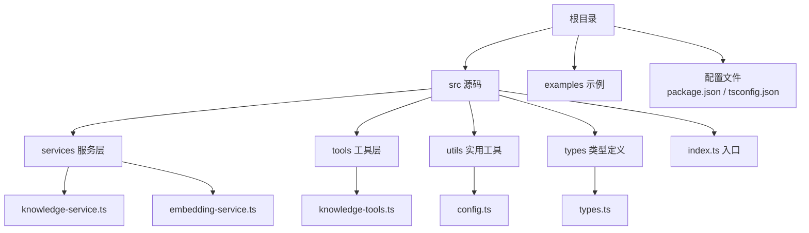
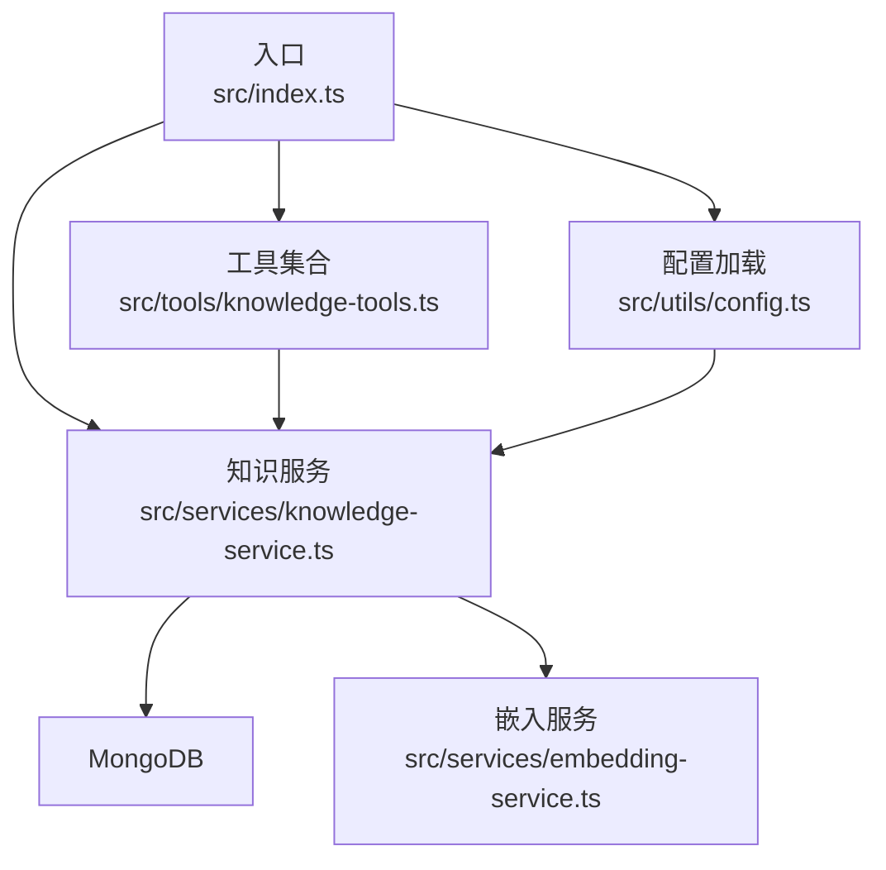
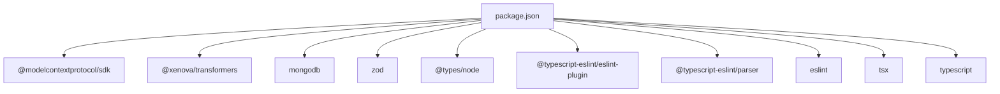

# 开发环境搭建

<cite>
**本文引用的文件**
- [package.json](file://package.json)
- [tsconfig.json](file://tsconfig.json)
- [src/index.ts](file://src/index.ts)
- [src/utils/config.ts](file://src/utils/config.ts)
- [src/services/knowledge-service.ts](file://src/services/knowledge-service.ts)
- [src/tools/knowledge-tools.ts](file://src/tools/knowledge-tools.ts)
- [src/services/embedding-service.ts](file://src/services/embedding-service.ts)
- [src/types.ts](file://src/types.ts)
- [examples/mcp-config.json](file://examples/mcp-config.json)
- [.gitignore](file://.gitignore)
</cite>

## 目录
1. [简介](#简介)
2. [项目结构](#项目结构)
3. [核心组件](#核心组件)
4. [架构总览](#架构总览)
5. [详细组件分析](#详细组件分析)
6. [依赖关系分析](#依赖关系分析)
7. [性能考虑](#性能考虑)
8. [故障排除指南](#故障排除指南)
9. [结论](#结论)
10. [附录](#附录)

## 简介
本指南面向希望在本地搭建并开发 mongo-mcp 的开发者，覆盖以下要点：
- Node.js 版本要求（>=18.0.0）
- npm/yarn 安装步骤与项目克隆流程
- TypeScript 配置与编译设置
- ESLint 代码规范与开发工具链
- 开发服务器启动（npm run dev）、构建流程（npm run build）
- 调试配置与常见问题排查
- IDE（VS Code）开发环境配置建议

## 项目结构
该项目采用基于功能模块的组织方式，核心源码位于 src 目录，包含服务层、工具层、类型定义与配置加载逻辑；examples 提供 IDE（如 Qoder、Cursor、VS Code）的 MCP 配置示例；根目录包含包管理与 TypeScript 编译配置。

图表来源
- [src/index.ts](file://src/index.ts#L1-L148)
- [src/services/knowledge-service.ts](file://src/services/knowledge-service.ts#L1-L404)
- [src/services/embedding-service.ts](file://src/services/embedding-service.ts#L1-L148)
- [src/tools/knowledge-tools.ts](file://src/tools/knowledge-tools.ts#L1-L800)
- [src/utils/config.ts](file://src/utils/config.ts#L1-L147)
- [src/types.ts](file://src/types.ts#L1-L269)

章节来源
- [package.json](file://package.json#L1-L48)
- [tsconfig.json](file://tsconfig.json#L1-L21)

## 核心组件
- 入口与运行时：入口文件负责创建 MCP 服务器、加载配置、连接数据库、注册工具并启动服务。
- 配置加载：从环境变量解析数据库连接、用户/设备/IDE 来源、嵌入开关与日志级别，并进行校验与日志工具初始化。
- 知识服务：封装 MongoDB 连接、索引、CRUD、批量导入导出、语义搜索与嵌入生成。
- 工具集合：提供通用 CRUD、统计、快捷工具（记忆、经验、命令、上下文、MCP 同步等）。
- 嵌入服务：基于 @xenova/transformers 的文本向量化与相似度计算。

章节来源
- [src/index.ts](file://src/index.ts#L87-L147)
- [src/utils/config.ts](file://src/utils/config.ts#L76-L115)
- [src/services/knowledge-service.ts](file://src/services/knowledge-service.ts#L20-L403)
- [src/tools/knowledge-tools.ts](file://src/tools/knowledge-tools.ts#L29-L800)
- [src/services/embedding-service.ts](file://src/services/embedding-service.ts#L11-L147)

## 架构总览
下图展示了从入口到服务层、工具层与嵌入服务的整体交互关系。

图表来源
- [src/index.ts](file://src/index.ts#L87-L147)
- [src/utils/config.ts](file://src/utils/config.ts#L76-L91)
- [src/services/knowledge-service.ts](file://src/services/knowledge-service.ts#L44-L54)
- [src/tools/knowledge-tools.ts](file://src/tools/knowledge-tools.ts#L29-L32)
- [src/services/embedding-service.ts](file://src/services/embedding-service.ts#L11-L19)

## 详细组件分析

### TypeScript 配置与编译
- 目标与模块：ES2022 目标、ESNext 模块、Node 解析策略，严格模式开启。
- 输出与源目录：输出至 dist，源码根目录为 src。
- 其他：启用 esModuleInterop、跳过库检查、生成声明与 source map。
- 包含/排除：仅包含 src 下文件，排除 node_modules 与 dist。

章节来源
- [tsconfig.json](file://tsconfig.json#L2-L19)

### 开发工具链与脚本
- Node.js 版本：引擎要求 >=18.0.0。
- 构建脚本：tsc 编译 TypeScript。
- 启动脚本：运行 dist/index.js。
- 开发脚本：使用 tsx watch 监听 src/index.ts 并热重载。
- 代码检查：eslint 检查 src 目录下的 .ts 文件。
- 类型检查：tsc --noEmit 进行类型检查但不输出 JS。

章节来源
- [package.json](file://package.json#L44-L16)

### 配置加载与验证
- 环境变量优先级：MCP 客户端传入 env > 系统环境变量 > 默认值。
- 关键配置项：MONGO_URI、MONGO_DATABASE、MONGO_COLLECTION、USER_ID、DEVICE_ID、IDE_SOURCE、ENABLE_EMBEDDING、LOG_LEVEL。
- 校验规则：URI、数据库名、集合名必填。
- 日志级别：debug/info/warn/error，默认 info。

章节来源
- [src/utils/config.ts](file://src/utils/config.ts#L76-L115)
- [src/utils/config.ts](file://src/utils/config.ts#L120-L146)

### 知识服务与数据库交互
- 连接与断开：通过 MongoClient 连接指定 URI、数据库与集合，启动时创建必要索引。
- 用户上下文：注入 userId/deviceId/ideSource，确保数据隔离与跨设备同步。
- 查询与分页：支持按类型、标签、启用状态、关键词搜索，支持 limit/offset。
- 语义搜索：可选启用嵌入，基于余弦相似度检索，支持阈值与上限。
- 批量操作：批量导入/导出、批量生成嵌入。

章节来源
- [src/services/knowledge-service.ts](file://src/services/knowledge-service.ts#L44-L87)
- [src/services/knowledge-service.ts](file://src/services/knowledge-service.ts#L195-L216)
- [src/services/knowledge-service.ts](file://src/services/knowledge-service.ts#L272-L299)
- [src/services/knowledge-service.ts](file://src/services/knowledge-service.ts#L313-L341)

### 嵌入服务与向量检索
- 模型加载：首次使用时懒加载特征抽取模型，控制线程数与量化。
- 文本嵌入：对输入文本进行 mean pooling 与归一化，输出数值向量。
- 相似度计算：余弦相似度，支持阈值过滤与排序截断。
- 文本提取：从文档的 name/description/content/tags 提取片段拼接。

章节来源
- [src/services/embedding-service.ts](file://src/services/embedding-service.ts#L24-L51)
- [src/services/embedding-service.ts](file://src/services/embedding-service.ts#L56-L80)
- [src/services/embedding-service.ts](file://src/services/embedding-service.ts#L85-L104)
- [src/services/embedding-service.ts](file://src/services/embedding-service.ts#L109-L129)

### 工具集合与 MCP 协议
- 工具注册：在服务器启动时注册工具清单与调用处理器。
- 工具类型：通用 CRUD、统计、快捷工具（记忆、经验、命令、上下文、MCP 同步等）。
- 输入参数：统一使用 JSON Schema 校验，错误时返回结构化错误信息。
- 错误处理：捕获工具执行异常并以标准格式返回。

章节来源
- [src/index.ts](file://src/index.ts#L29-L82)
- [src/tools/knowledge-tools.ts](file://src/tools/knowledge-tools.ts#L36-L107)
- [src/tools/knowledge-tools.ts](file://src/tools/knowledge-tools.ts#L158-L215)

## 依赖关系分析
- 运行时依赖：@modelcontextprotocol/sdk（MCP 协议）、@xenova/transformers（嵌入）、mongodb（驱动）、zod（校验）。
- 开发依赖：@types/node、@typescript-eslint/eslint-plugin、@typescript-eslint/parser、eslint、tsx、typescript。
- 引擎要求：Node.js >=18.0.0。

图表来源
- [package.json](file://package.json#L30-L46)

章节来源
- [package.json](file://package.json#L30-L46)

## 性能考虑
- 嵌入模型加载：首次初始化较慢，建议在开发阶段预热或在生产环境提前启动以避免冷启动延迟。
- 语义搜索：对大量文档进行相似度计算时，建议设置合理阈值与 limit，避免高复杂度查询。
- 索引策略：确保按 userId/type/name/deviceId/tags 等常用查询字段建立索引，提升查询效率。
- 批量操作：导入/导出与批量生成嵌入应分批处理，避免单次操作过大导致内存压力。

## 故障排除指南
- Node.js 版本过低
  - 现象：安装或运行时报引擎版本不兼容。
  - 处理：升级 Node.js 至 >=18.0.0。
  - 参考：引擎配置。
- MongoDB 连接失败
  - 现象：启动时报连接错误或超时。
  - 处理：检查 MONGO_URI、网络连通性与认证配置；确认数据库与集合存在。
  - 参考：配置加载与知识服务连接逻辑。
- 嵌入模型加载缓慢
  - 现象：首次语义搜索耗时较长。
  - 处理：允许首次加载完成；生产环境可预热；调整线程数与量化设置。
  - 参考：嵌入服务初始化与模型加载。
- 工具调用报错
  - 现象：MCP 调用返回错误信息。
  - 处理：检查工具输入参数是否符合 JSON Schema；查看日志级别与错误堆栈。
  - 参考：工具处理器与错误返回格式。
- IDE 集成配置
  - 现象：IDE 无法识别或启动 mongo-mcp。
  - 处理：参考 examples 中各 IDE 的配置示例，确保命令与参数正确，环境变量完整。
  - 参考：IDE 配置示例。

章节来源
- [package.json](file://package.json#L44-L46)
- [src/utils/config.ts](file://src/utils/config.ts#L76-L91)
- [src/services/knowledge-service.ts](file://src/services/knowledge-service.ts#L44-L54)
- [src/services/embedding-service.ts](file://src/services/embedding-service.ts#L42-L51)
- [src/tools/knowledge-tools.ts](file://src/tools/knowledge-tools.ts#L72-L106)
- [examples/mcp-config.json](file://examples/mcp-config.json#L1-L94)

## 结论
本指南提供了从环境准备到开发调试的完整路径，涵盖 Node.js 版本、包管理、TypeScript/ESLint 配置、开发与构建脚本、服务启动与调试、以及常见问题排查。按照本指南操作，可在本地顺利搭建并高效开发 mongo-mcp。

## 附录

### 开发环境搭建步骤
- 环境要求
  - Node.js：>=18.0.0
  - 包管理器：npm 或 yarn
- 克隆与安装
  - 克隆仓库后，在项目根目录执行安装命令（如 npm install 或 yarn）。
- 启动开发服务器
  - 使用开发脚本启动（如 npm run dev），该脚本会监听入口文件变化并热重载。
- 构建项目
  - 使用构建脚本（如 npm run build），TypeScript 将编译至 dist 目录。
- 运行已构建产物
  - 使用启动脚本（如 npm start）运行 dist/index.js。

章节来源
- [package.json](file://package.json#L10-L16)

### TypeScript 与 ESLint 配置要点
- TypeScript
  - 目标 ES2022，模块 ESNext，严格模式，生成声明与 source map。
- ESLint
  - 使用 @typescript-eslint/parser 与 @typescript-eslint/eslint-plugin，检查 .ts 文件。
  - 建议在编辑器中启用 ESLint 插件以实时提示。

章节来源
- [tsconfig.json](file://tsconfig.json#L2-L19)
- [package.json](file://package.json#L36-L43)

### IDE（VS Code）推荐配置
- 推荐扩展
  - ESLint（Microsoft）
  - TypeScript Importer（Nikita Vaynberg）
  - EditorConfig（EditorConfig）
- VS Code 设置建议
  - 在项目根目录创建 .vscode/settings.json，参考 examples/mcp-config.json 中的 VS Code 配置片段，设置 MCP 服务器命令、参数与环境变量。
  - 启用 ESLint 与 TypeScript 相关检查，保持与项目配置一致。

章节来源
- [examples/mcp-config.json](file://examples/mcp-config.json#L41-L55)

### 开发服务器启动与调试
- 开发启动
  - 使用开发脚本（如 npm run dev）启动入口文件，支持热重载。
- 调试建议
  - 在 VS Code 中设置断点于入口与工具处理器，结合日志级别（info/debug）定位问题。
  - 如需本地调试，可参考 examples 中“local_development”配置，直接使用 node 启动 dist/index.js。

章节来源
- [package.json](file://package.json#L13-L16)
- [examples/mcp-config.json](file://examples/mcp-config.json#L57-L74)

### 常见环境问题与解决方案
- Node 版本不满足要求
  - 升级 Node.js 至 >=18.0.0。
- MongoDB 无法连接
  - 检查 MONGO_URI、网络与认证；确认数据库/集合存在。
- 嵌入模型加载慢
  - 首次加载为正常现象；生产环境可预热。
- 工具调用失败
  - 校验输入参数是否符合 JSON Schema；查看错误返回与日志。

章节来源
- [package.json](file://package.json#L44-L46)
- [src/utils/config.ts](file://src/utils/config.ts#L76-L91)
- [src/services/embedding-service.ts](file://src/services/embedding-service.ts#L42-L51)
- [src/tools/knowledge-tools.ts](file://src/tools/knowledge-tools.ts#L72-L106)