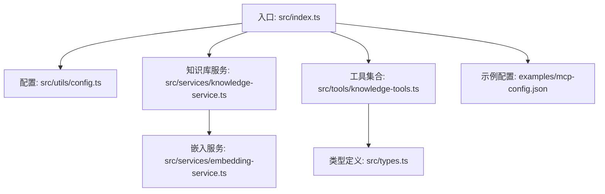
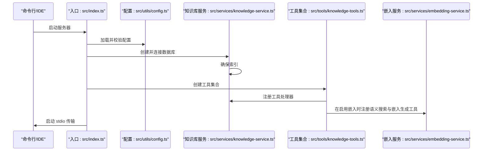
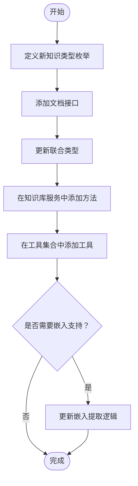
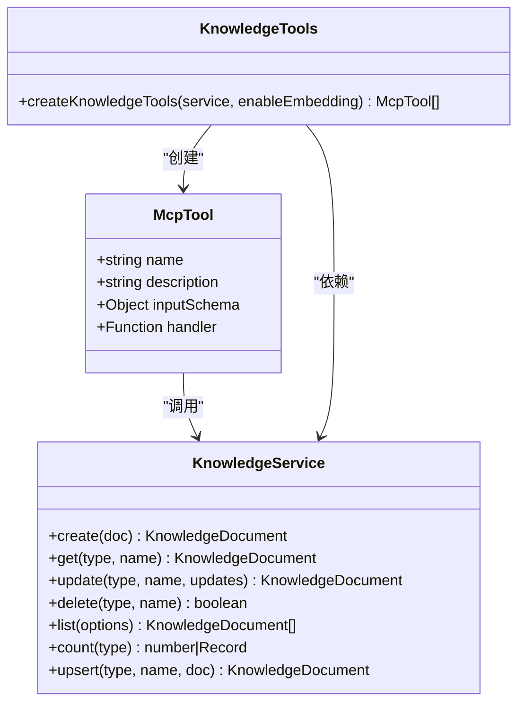
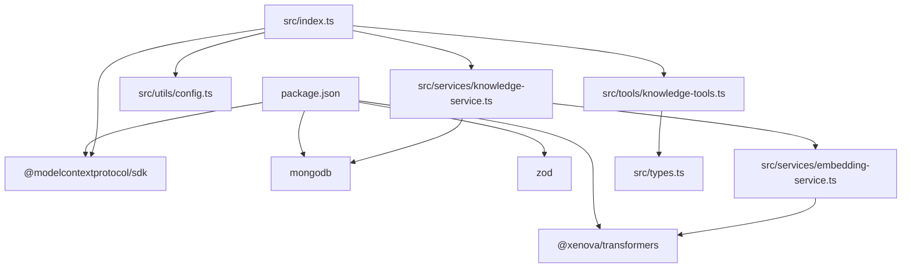

# 扩展开发指南

<cite>
**本文档引用的文件**
- [src/index.ts](file://src/index.ts)
- [src/types.ts](file://src/types.ts)
- [src/services/knowledge-service.ts](file://src/services/knowledge-service.ts)
- [src/tools/knowledge-tools.ts](file://src/tools/knowledge-tools.ts)
- [src/services/embedding-service.ts](file://src/services/embedding-service.ts)
- [src/utils/config.ts](file://src/utils/config.ts)
- [package.json](file://package.json)
- [examples/mcp-config.json](file://examples/mcp-config.json)
</cite>

## 目录
1. [简介](#简介)
2. [项目结构](#项目结构)
3. [核心组件](#核心组件)
4. [架构概览](#架构概览)
5. [详细组件分析](#详细组件分析)
6. [依赖关系分析](#依赖关系分析)
7. [性能考虑](#性能考虑)
8. [故障排除指南](#故障排除指南)
9. [结论](#结论)
10. [附录](#附录)

## 简介
本指南面向希望扩展 Mongo-MCP 功能的开发者，涵盖以下主题：
- 如何添加新的知识类型（接口定义、数据模型设计、数据库操作实现）
- MCP 工具的完整开发流程（从接口定义到工具注册）
- 自定义工具开发的最佳实践（参数验证、错误处理、性能优化）
- 扩展现有功能（新增搜索算法、工具类型）
- 向量嵌入模型的扩展与自定义嵌入服务开发
- 扩展测试方法与调试技巧

## 项目结构
该项目采用模块化组织，核心目录与职责如下：
- src/index.ts：MCP 服务器入口，负责初始化配置、连接数据库、创建工具并启动服务器
- src/types.ts：定义知识类型枚举、文档接口及查询选项
- src/services/knowledge-service.ts：知识库服务，封装 CRUD、查询、统计、嵌入生成等数据库操作
- src/tools/knowledge-tools.ts：MCP 工具集合，提供知识库管理与快捷工具
- src/services/embedding-service.ts：嵌入服务，基于 Transformers.js 实现文本向量化
- src/utils/config.ts：配置加载、校验与日志工具
- examples/mcp-config.json：IDE 配置示例，展示如何在不同 IDE 中集成 MCP 服务器

**图表来源**
- [src/index.ts](file://src/index.ts#L1-L148)
- [src/utils/config.ts](file://src/utils/config.ts#L1-L147)
- [src/services/knowledge-service.ts](file://src/services/knowledge-service.ts#L1-L404)
- [src/tools/knowledge-tools.ts](file://src/tools/knowledge-tools.ts#L1-L1093)
- [src/services/embedding-service.ts](file://src/services/embedding-service.ts#L1-L148)
- [src/types.ts](file://src/types.ts#L1-L269)
- [examples/mcp-config.json](file://examples/mcp-config.json#L1-L94)

**章节来源**
- [src/index.ts](file://src/index.ts#L1-L148)
- [src/utils/config.ts](file://src/utils/config.ts#L1-L147)
- [src/services/knowledge-service.ts](file://src/services/knowledge-service.ts#L1-L404)
- [src/tools/knowledge-tools.ts](file://src/tools/knowledge-tools.ts#L1-L1093)
- [src/services/embedding-service.ts](file://src/services/embedding-service.ts#L1-L148)
- [src/types.ts](file://src/types.ts#L1-L269)
- [examples/mcp-config.json](file://examples/mcp-config.json#L1-L94)

## 核心组件
- 知识类型枚举与文档接口：定义了 8 种内置知识类型及其字段规范，支持统一的 CRUD 与查询能力
- 知识库服务：提供连接管理、索引确保、文档增删改查、批量导入导出、统计、语义搜索与嵌入生成
- MCP 工具集合：提供通用 CRUD 工具、快捷工具（记忆、经验、命令、上下文、MCP、规则、技能、工作流）、用户信息查询、批量导出，以及在启用嵌入时的语义搜索与嵌入生成功能
- 嵌入服务：基于 Transformers.js 的特征提取，支持懒加载、余弦相似度计算与文本提取
- 配置与日志：从环境变量加载配置，进行有效性校验，并按级别输出日志

**章节来源**
- [src/types.ts](file://src/types.ts#L1-L269)
- [src/services/knowledge-service.ts](file://src/services/knowledge-service.ts#L1-L404)
- [src/tools/knowledge-tools.ts](file://src/tools/knowledge-tools.ts#L1-L1093)
- [src/services/embedding-service.ts](file://src/services/embedding-service.ts#L1-L148)
- [src/utils/config.ts](file://src/utils/config.ts#L1-L147)

## 架构概览
MCP 服务器启动流程与组件交互如下：

**图表来源**
- [src/index.ts](file://src/index.ts#L87-L145)
- [src/utils/config.ts](file://src/utils/config.ts#L76-L91)
- [src/services/knowledge-service.ts](file://src/services/knowledge-service.ts#L44-L87)
- [src/tools/knowledge-tools.ts](file://src/tools/knowledge-tools.ts#L29-L32)
- [src/services/embedding-service.ts](file://src/services/embedding-service.ts#L24-L51)

## 详细组件分析

### 新增知识类型的完整流程
要添加新的知识类型，需按以下步骤修改相关文件：

1) 定义类型枚举与接口
- 在类型定义中添加新的知识类型枚举值
- 定义对应的文档接口，继承基础知识文档接口并添加特定字段
- 将新类型加入联合类型 AnyKnowledgeDocument

2) 数据库操作扩展
- 在知识库服务中添加针对新类型的专用方法（如 createXxx、getXxx、updateXxx 等）
- 在 list 方法中支持新类型过滤
- 在 count 方法中统计新类型数量
- 在 upsert 方法中处理新类型的数据映射

3) MCP 工具注册
- 在工具集合中添加对应的新类型工具（CRUD、快捷工具等）
- 为工具定义输入模式（inputSchema），包含必需字段与可选字段
- 实现工具处理器，调用知识库服务完成业务逻辑

4) 嵌入支持（可选）
- 在嵌入生成逻辑中确保新类型文档能被正确提取文本
- 在语义搜索中支持新类型过滤

**图表来源**
- [src/types.ts](file://src/types.ts#L6-L14)
- [src/types.ts](file://src/types.ts#L215-L223)
- [src/services/knowledge-service.ts](file://src/services/knowledge-service.ts#L111-L127)
- [src/tools/knowledge-tools.ts](file://src/tools/knowledge-tools.ts#L37-L106)

**章节来源**
- [src/types.ts](file://src/types.ts#L6-L14)
- [src/types.ts](file://src/types.ts#L215-L223)
- [src/services/knowledge-service.ts](file://src/services/knowledge-service.ts#L111-L127)
- [src/tools/knowledge-tools.ts](file://src/tools/knowledge-tools.ts#L37-L106)

### MCP 工具开发流程详解
MCP 工具的开发遵循以下标准流程：

1) 接口定义
- 定义工具接口，包含名称、描述、输入模式与处理器函数
- 输入模式使用 JSON Schema 定义属性、类型与必需字段

2) 工具注册
- 在工具集合函数中创建工具对象
- 将工具添加到返回数组中

3) 处理器实现
- 解析输入参数，进行参数验证
- 调用知识库服务执行业务逻辑
- 返回标准化的结果对象（包含 success、data 或 error 字段）

4) 错误处理
- 捕获异常并返回结构化的错误信息
- 区分业务错误与系统错误

**图表来源**
- [src/tools/knowledge-tools.ts](file://src/tools/knowledge-tools.ts#L7-L16)
- [src/services/knowledge-service.ts](file://src/services/knowledge-service.ts#L111-L127)
- [src/tools/knowledge-tools.ts](file://src/tools/knowledge-tools.ts#L29-L32)

**章节来源**
- [src/tools/knowledge-tools.ts](file://src/tools/knowledge-tools.ts#L7-L16)
- [src/tools/knowledge-tools.ts](file://src/tools/knowledge-tools.ts#L29-L32)

### 数据模型设计最佳实践
- 统一性：所有知识类型都继承基础文档接口，确保字段一致性
- 可扩展性：使用联合类型 AnyKnowledgeDocument 支持动态类型检查
- 兼容性：新增字段应保持向后兼容，避免破坏现有功能
- 性能：为常用查询字段建立索引，优化查询性能

**章节来源**
- [src/types.ts](file://src/types.ts#L24-L74)
- [src/types.ts](file://src/types.ts#L215-L223)

### 数据库操作实现要点
- 连接管理：确保连接状态检查与资源释放
- 索引策略：根据查询模式创建复合索引
- 原子操作：使用事务或原子更新保证数据一致性
- 批量操作：提供批量导入导出以提升性能

**章节来源**
- [src/services/knowledge-service.ts](file://src/services/knowledge-service.ts#L44-L87)
- [src/services/knowledge-service.ts](file://src/services/knowledge-service.ts#L111-L127)
- [src/services/knowledge-service.ts](file://src/services/knowledge-service.ts#L244-L260)

### 向量嵌入模型扩展
- 模型选择：通过构造函数参数切换嵌入模型
- 懒加载：首次使用时初始化模型，避免启动延迟
- 文本提取：为每种知识类型定制文本提取逻辑
- 相似度计算：实现余弦相似度计算用于语义搜索

**章节来源**
- [src/services/embedding-service.ts](file://src/services/embedding-service.ts#L17-L19)
- [src/services/embedding-service.ts](file://src/services/embedding-service.ts#L24-L51)
- [src/services/embedding-service.ts](file://src/services/embedding-service.ts#L109-L129)
- [src/services/knowledge-service.ts](file://src/services/knowledge-service.ts#L272-L299)

## 依赖关系分析
项目依赖关系如下：

**图表来源**
- [package.json](file://package.json#L30-L35)
- [src/index.ts](file://src/index.ts#L3-L11)
- [src/services/knowledge-service.ts](file://src/services/knowledge-service.ts#L1-L4)
- [src/tools/knowledge-tools.ts](file://src/tools/knowledge-tools.ts#L1-L2)
- [src/services/embedding-service.ts](file://src/services/embedding-service.ts#L1-L1)

**章节来源**
- [package.json](file://package.json#L30-L35)
- [src/index.ts](file://src/index.ts#L3-L11)

## 性能考虑
- 嵌入生成：批量处理以减少网络往返，合理设置并发度
- 查询优化：为高频查询字段建立复合索引，避免全表扫描
- 缓存策略：对热点数据进行缓存，减少数据库访问
- 异步处理：使用异步操作避免阻塞主线程
- 内存管理：及时释放不再使用的资源，监控内存使用情况

## 故障排除指南
- 配置问题：检查环境变量是否正确设置，验证配置有效性
- 数据库连接：确认 MongoDB 连接字符串与权限设置
- 嵌入模型：确保模型下载与初始化成功，检查网络连接
- 工具调用：验证工具名称与输入参数格式，查看返回的错误信息

**章节来源**
- [src/utils/config.ts](file://src/utils/config.ts#L96-L115)
- [src/services/knowledge-service.ts](file://src/services/knowledge-service.ts#L44-L54)
- [src/services/embedding-service.ts](file://src/services/embedding-service.ts#L42-L51)

## 结论
本指南提供了扩展 Mongo-MCP 的完整方法论，包括新增知识类型、开发 MCP 工具、优化性能与调试技巧。通过遵循这些最佳实践，开发者可以安全地扩展现有功能并保持系统的稳定性与可维护性。

## 附录

### 扩展测试方法
- 单元测试：为每个工具处理器编写测试用例，覆盖正常与异常场景
- 集成测试：模拟完整的 MCP 请求流程，验证工具链路
- 性能测试：测量嵌入生成与语义搜索的响应时间
- 回归测试：在每次变更后运行完整的测试套件

### 调试技巧
- 启用详细日志：设置日志级别为 debug 以获取更多上下文信息
- 使用 IDE 调试器：在开发模式下设置断点进行逐步调试
- 模拟环境：使用本地构建版本进行快速迭代
- 错误追踪：记录详细的错误堆栈与上下文信息

**章节来源**
- [src/utils/config.ts](file://src/utils/config.ts#L120-L146)
- [examples/mcp-config.json](file://examples/mcp-config.json#L57-L74)