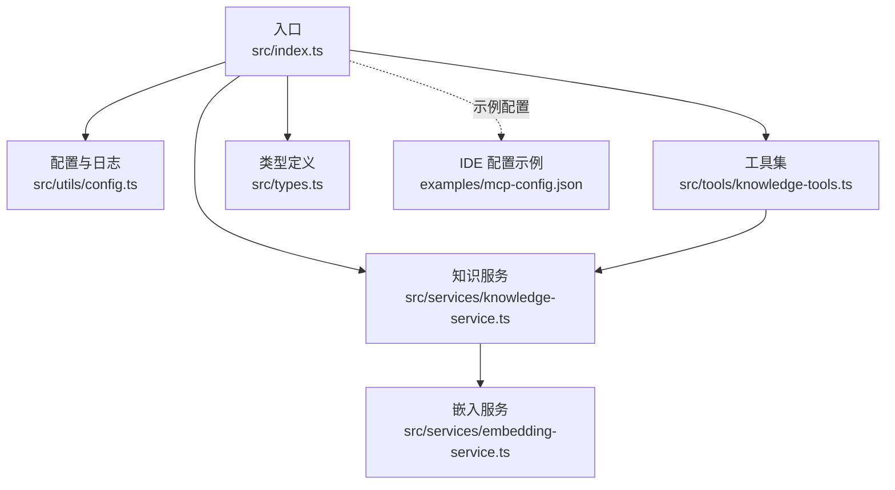
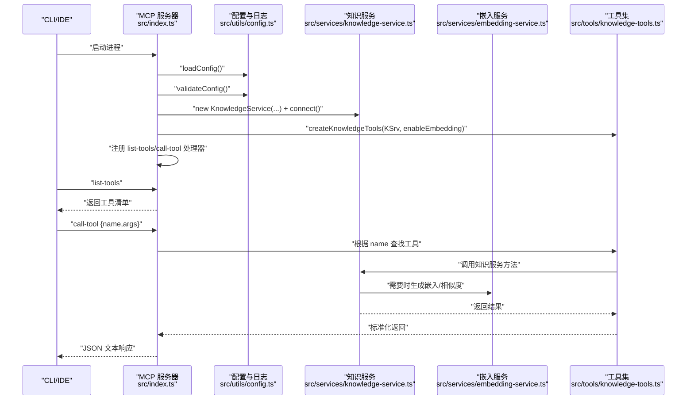
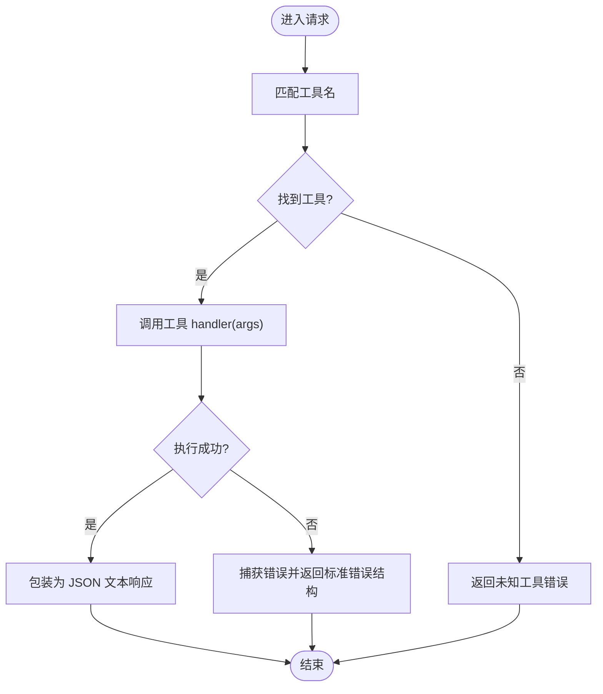
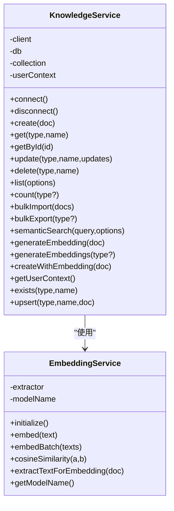
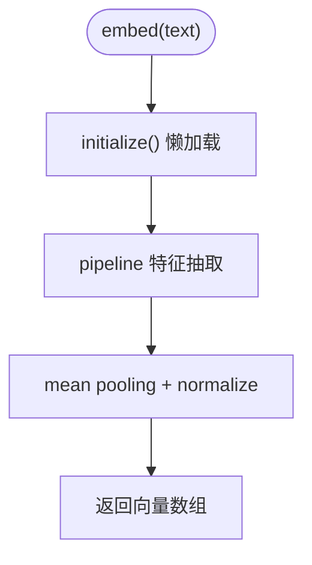
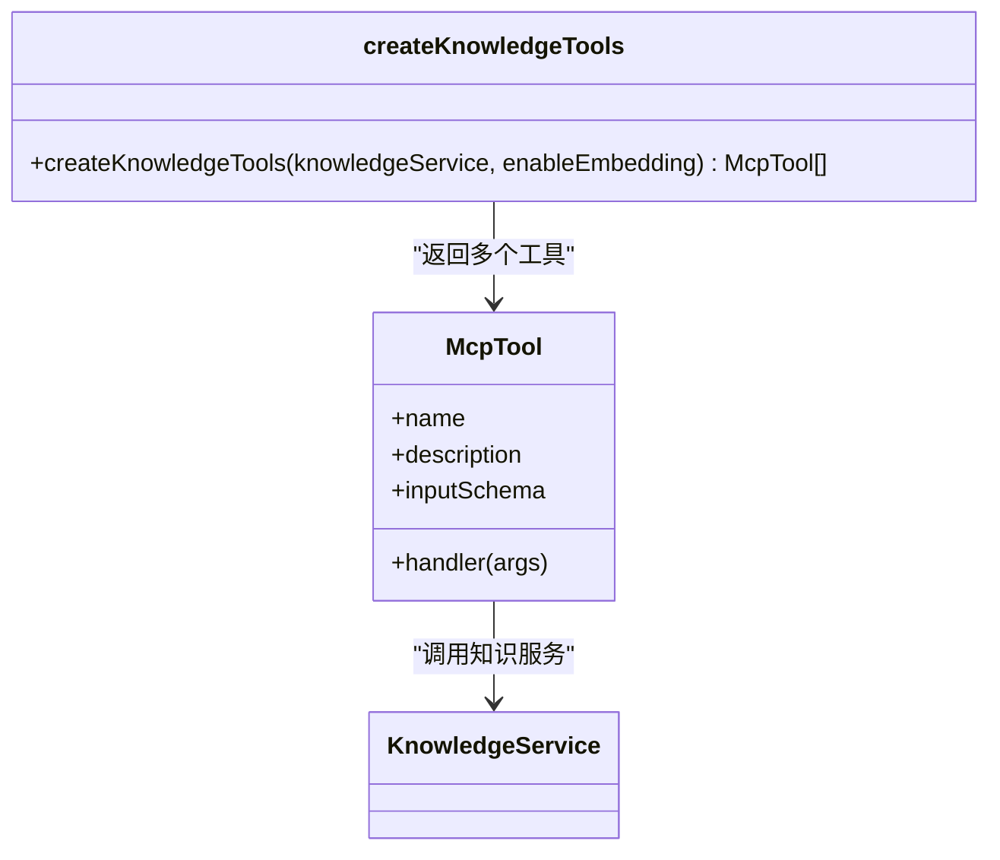
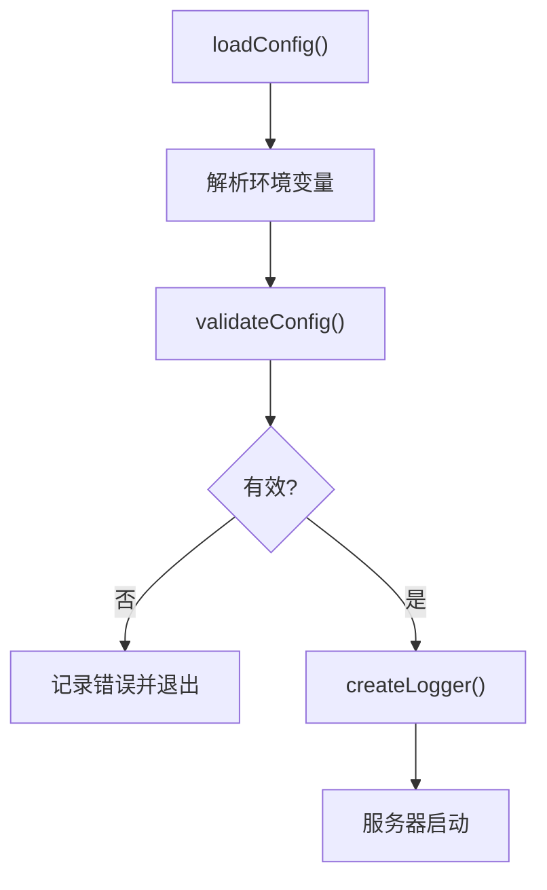
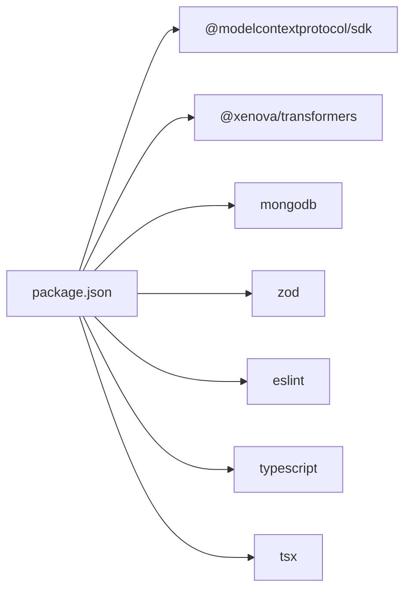

# 测试与调试

<cite>
**本文引用的文件**
- [package.json](file://package.json)
- [src/index.ts](file://src/index.ts)
- [src/types.ts](file://src/types.ts)
- [src/utils/config.ts](file://src/utils/config.ts)
- [src/services/knowledge-service.ts](file://src/services/knowledge-service.ts)
- [src/services/embedding-service.ts](file://src/services/embedding-service.ts)
- [src/tools/knowledge-tools.ts](file://src/tools/knowledge-tools.ts)
- [examples/mcp-config.json](file://examples/mcp-config.json)
</cite>

## 目录
1. [简介](#简介)
2. [项目结构](#项目结构)
3. [核心组件](#核心组件)
4. [架构总览](#架构总览)
5. [详细组件分析](#详细组件分析)
6. [依赖关系分析](#依赖关系分析)
7. [性能考量](#性能考量)
8. [故障排除指南](#故障排除指南)
9. [结论](#结论)
10. [附录](#附录)

## 简介
本指南面向开发者与运维人员，围绕 mongo-mcp 的测试与调试展开，覆盖单元测试与集成测试的设计方法、MCP 工具测试最佳实践、开发服务器调试与日志分析、性能与压力测试策略（含向量嵌入与数据库查询优化）、常见问题排查流程、测试数据准备与测试环境配置，以及在持续集成中实现测试自动化的建议。

## 项目结构
该项目采用分层与功能模块化组织：
- 入口与运行时：src/index.ts 作为 MCP 服务器入口，负责加载配置、校验、连接数据库、注册工具并启动 stdio 传输。
- 类型定义：src/types.ts 定义知识库文档类型、查询与嵌入相关接口。
- 工具层：src/tools/knowledge-tools.ts 将知识库能力封装为 MCP 工具，统一输入输出与错误处理。
- 服务层：src/services/knowledge-service.ts 提供 CRUD、统计、批量导入导出、语义检索与嵌入生成等核心能力；src/services/embedding-service.ts 封装 Transformers.js 的嵌入生成与相似度计算。
- 配置与日志：src/utils/config.ts 负责从环境变量解析配置、校验与创建日志器。
- 示例配置：examples/mcp-config.json 展示不同 IDE 的 MCP 服务器配置方式与环境变量注入。

**图表来源**
- [src/index.ts](file://src/index.ts#L1-L148)
- [src/utils/config.ts](file://src/utils/config.ts#L1-L147)
- [src/services/knowledge-service.ts](file://src/services/knowledge-service.ts#L1-L404)
- [src/services/embedding-service.ts](file://src/services/embedding-service.ts#L1-L148)
- [src/tools/knowledge-tools.ts](file://src/tools/knowledge-tools.ts#L1-L800)
- [src/types.ts](file://src/types.ts#L1-L269)
- [examples/mcp-config.json](file://examples/mcp-config.json#L1-L94)

**章节来源**
- [src/index.ts](file://src/index.ts#L1-L148)
- [src/utils/config.ts](file://src/utils/config.ts#L1-L147)
- [src/services/knowledge-service.ts](file://src/services/knowledge-service.ts#L1-L404)
- [src/services/embedding-service.ts](file://src/services/embedding-service.ts#L1-L148)
- [src/tools/knowledge-tools.ts](file://src/tools/knowledge-tools.ts#L1-L800)
- [src/types.ts](file://src/types.ts#L1-L269)
- [examples/mcp-config.json](file://examples/mcp-config.json#L1-L94)

## 核心组件
- MCP 服务器与传输：基于 @modelcontextprotocol/sdk 的 stdio 传输，注册 list-tools 与 call-tool 请求处理器。
- 知识服务：提供用户上下文隔离、文档 CRUD、批量操作、统计、语义检索与嵌入生成。
- 嵌入服务：基于 @xenova/transformers 的特征抽取，支持懒加载、余弦相似度计算与文本提取。
- 工具集：将知识服务能力映射为 MCP 工具，统一输入模式、错误处理与返回结构。
- 配置与日志：从环境变量加载配置，支持 IDE 来源、用户/设备标识、嵌入开关与日志级别。

**章节来源**
- [src/index.ts](file://src/index.ts#L16-L82)
- [src/services/knowledge-service.ts](file://src/services/knowledge-service.ts#L20-L403)
- [src/services/embedding-service.ts](file://src/services/embedding-service.ts#L11-L147)
- [src/tools/knowledge-tools.ts](file://src/tools/knowledge-tools.ts#L7-L400)
- [src/utils/config.ts](file://src/utils/config.ts#L11-L146)

## 架构总览
MCP 服务器启动流程与请求处理序列如下：

**图表来源**
- [src/index.ts](file://src/index.ts#L87-L147)
- [src/utils/config.ts](file://src/utils/config.ts#L76-L115)
- [src/services/knowledge-service.ts](file://src/services/knowledge-service.ts#L44-L341)
- [src/services/embedding-service.ts](file://src/services/embedding-service.ts#L24-L104)
- [src/tools/knowledge-tools.ts](file://src/tools/knowledge-tools.ts#L36-L106)

## 详细组件分析

### 组件 A：MCP 服务器与请求处理
- 职责：初始化服务器、注册请求处理器、连接数据库、创建工具集、处理 SIGINT/SIGTERM。
- 关键点：
  - list-tools 返回工具清单（名称、描述、输入模式）。
  - call-tool 根据工具名路由至对应 handler，并捕获异常返回标准错误结构。
- 测试要点：
  - 单元：对处理器注册与路由进行断言。
  - 集成：启动服务器，发送 list-tools/call-tool 请求，验证响应结构与内容。

**图表来源**
- [src/index.ts](file://src/index.ts#L30-L79)

**章节来源**
- [src/index.ts](file://src/index.ts#L16-L82)

### 组件 B：知识服务（CRUD/检索/嵌入）
- 职责：用户上下文注入、索引保证、CRUD、批量导入导出、统计、语义检索、嵌入生成。
- 关键点：
  - 用户级唯一索引与多字段索引，确保查询与去重。
  - 语义检索通过嵌入相似度阈值与上限控制结果规模。
  - 嵌入生成支持按文档与批量两种模式。
- 测试要点：
  - 单元：构造最小化文档，验证 create/update/delete/list/count/upsert/exists。
  - 集成：连接真实数据库，执行批量导入/导出与语义检索，验证性能与准确性。

**图表来源**
- [src/services/knowledge-service.ts](file://src/services/knowledge-service.ts#L20-L403)
- [src/services/embedding-service.ts](file://src/services/embedding-service.ts#L11-L147)

**章节来源**
- [src/services/knowledge-service.ts](file://src/services/knowledge-service.ts#L44-L341)

### 组件 C：嵌入服务（Transformers.js）
- 职责：模型懒加载、文本向量生成、批量嵌入、余弦相似度计算、文本提取。
- 性能特性：首次访问时加载模型，后续复用；支持 mean pooling 与归一化。
- 测试要点：
  - 单元：验证模型初始化、向量维度一致性、相似度边界（0~1）。
  - 集成：与知识服务组合进行语义检索，评估召回与耗时。

**图表来源**
- [src/services/embedding-service.ts](file://src/services/embedding-service.ts#L24-L65)

**章节来源**
- [src/services/embedding-service.ts](file://src/services/embedding-service.ts#L11-L147)

### 组件 D：工具集（MCP 工具）
- 职责：将知识服务封装为 MCP 工具，统一输入模式与返回结构，内置错误处理。
- 工具类别：通用 CRUD、统计、快捷工具（记忆/经验/命令/上下文/MCP 同步）。
- 测试要点：
  - 单元：针对每个工具的输入模式与 handler 行为进行断言。
  - 集成：通过服务器发起 call-tool 请求，验证响应结构与业务逻辑。

**图表来源**
- [src/tools/knowledge-tools.ts](file://src/tools/knowledge-tools.ts#L7-L400)
- [src/services/knowledge-service.ts](file://src/services/knowledge-service.ts#L20-L403)

**章节来源**
- [src/tools/knowledge-tools.ts](file://src/tools/knowledge-tools.ts#L29-L800)

### 组件 E：配置与日志
- 职责：解析环境变量、校验配置、创建日志器（支持 debug/info/warn/error）。
- 测试要点：
  - 单元：覆盖空值、非法值、默认回退与日志级别过滤。
  - 集成：在服务器启动前验证配置校验失败时的退出行为。

**图表来源**
- [src/utils/config.ts](file://src/utils/config.ts#L76-L115)
- [src/utils/config.ts](file://src/utils/config.ts#L120-L146)

**章节来源**
- [src/utils/config.ts](file://src/utils/config.ts#L76-L146)

## 依赖关系分析
- 运行时依赖：@modelcontextprotocol/sdk（MCP 协议与传输）、@xenova/transformers（嵌入）、mongodb（数据库驱动）、zod（类型校验）。
- 开发依赖：eslint、typescript、tsx（开发热重载）。
- 入口脚本：build/start/dev/lint/typecheck。

**图表来源**
- [package.json](file://package.json#L30-L46)

**章节来源**
- [package.json](file://package.json#L1-L48)

## 性能考量
- 向量嵌入性能
  - 模型懒加载：首次使用时加载，避免冷启动开销；可通过预热接口或提前触发初始化降低首请求延迟。
  - 批量嵌入：在批量生成嵌入时尽量合并请求，减少网络与模型初始化次数。
  - 文本截断与拼接：嵌入文本提取时对长内容进行截断，避免超长文本影响性能与内存占用。
- 数据库查询优化
  - 索引策略：已建立用户级唯一索引与多字段索引，建议在高频查询字段上保持索引覆盖。
  - 查询限制：语义检索设置阈值与上限，避免返回过多结果导致内存与网络压力。
  - 批量操作：使用批量导入/导出减少往返次数。
- 日志与可观测性
  - 使用 debug 级别进行性能热点定位，但注意生产环境避免过度日志。
  - 在关键路径（连接、嵌入、查询、写入）打点，记录耗时与吞吐。

[本节为通用性能指导，无需特定文件引用]

## 故障排除指南
- 启动失败（配置无效）
  - 现象：启动即退出，日志记录配置错误。
  - 排查：检查 MONGO_URI/MONGO_DATABASE/MONGO_COLLECTION 是否设置正确；确认 validateConfig 输出的错误列表。
- 数据库连接失败
  - 现象：connect() 抛错或超时。
  - 排查：确认 MongoDB 地址可达、认证信息正确、网络策略放行；查看日志中的连接阶段错误。
- 工具调用异常
  - 现象：call-tool 返回错误结构。
  - 排查：检查工具名是否正确；查看知识服务内部异常；核对输入模式与必填字段。
- 嵌入服务加载失败
  - 现象：首次 embed 抛错或长时间无响应。
  - 排查：确认网络可访问模型仓库、磁盘空间充足；查看模型加载日志；考虑更换更小模型或离线缓存。
- 语义检索无结果
  - 现象：semanticSearch 返回空或分数过低。
  - 排查：确认文档已生成 embedding；调整阈值与 limit；检查文本提取是否包含关键信息。

**章节来源**
- [src/utils/config.ts](file://src/utils/config.ts#L96-L115)
- [src/services/knowledge-service.ts](file://src/services/knowledge-service.ts#L44-L54)
- [src/services/embedding-service.ts](file://src/services/embedding-service.ts#L42-L51)
- [src/index.ts](file://src/index.ts#L141-L144)

## 结论
本指南提供了 mongo-mcp 的测试与调试方法论与实操建议。通过明确的单元与集成测试策略、MCP 工具测试最佳实践、开发服务器调试与日志分析、性能与压力测试方向、常见问题排查流程以及测试环境配置与 CI 自动化思路，可显著提升系统的稳定性与可维护性。

[本节为总结性内容，无需特定文件引用]

## 附录

### A. 测试框架与用例设计
- 测试框架选择
  - 单元测试：推荐使用原生异步测试与 mock（如对嵌入服务进行 mock）。
  - 集成测试：使用临时数据库实例，覆盖完整请求链路。
- 用例设计原则
  - 输入：覆盖必填字段、边界值、非法值、缺失字段。
  - 行为：正常路径、异常路径、并发场景、资源清理。
  - 输出：结构化响应、错误码、日志级别与内容。

[本节为通用方法论，无需特定文件引用]

### B. MCP 工具测试最佳实践
- 模拟请求处理
  - 使用服务器实例或工具 handler 的直接调用，构造最小化输入参数。
  - 对外部依赖（如嵌入服务）进行 mock，确保测试稳定与可重复。
- 响应验证
  - 校验 success 字段与 data/error 字段的存在性与结构。
  - 对于 CRUD 工具，验证 id、type、name、syncVersion 等字段。
- 并发与边界
  - 并发创建同名文档验证唯一约束；批量导入/导出验证完整性。

**章节来源**
- [src/tools/knowledge-tools.ts](file://src/tools/knowledge-tools.ts#L36-L106)
- [src/services/knowledge-service.ts](file://src/services/knowledge-service.ts#L111-L127)

### C. 调试技巧与日志分析
- 开发服务器调试
  - 使用 dev 脚本以监听模式运行，便于热更新与断点调试。
  - 在工具 handler 中增加中间态日志，定位输入与上下文。
- 断点设置
  - 在服务器请求处理器、工具 handler、知识服务方法的关键节点设置断点。
- 日志分析
  - 使用 LOG_LEVEL 控制日志级别；结合用户/设备/IDE 来源字段定位问题域。

**章节来源**
- [package.json](file://package.json#L10-L16)
- [src/utils/config.ts](file://src/utils/config.ts#L120-L146)
- [src/index.ts](file://src/index.ts#L87-L147)

### D. 性能测试与压力测试
- 向量嵌入性能
  - 基准：记录 embed 与 embedBatch 的平均耗时与内存占用。
  - 优化：模型懒加载预热、批量化、文本截断策略。
- 数据库查询性能
  - 基准：统计 CRUD、list、semanticSearch 的 QPS 与 P95/P99 延迟。
  - 优化：索引覆盖、查询限制、连接池与超时配置。
- 压力测试建议
  - 使用并发客户端模拟多工具调用；监控 CPU/内存/网络与数据库连接数。

**章节来源**
- [src/services/embedding-service.ts](file://src/services/embedding-service.ts#L24-L80)
- [src/services/knowledge-service.ts](file://src/services/knowledge-service.ts#L272-L299)

### E. 测试数据准备与测试环境配置
- 测试数据
  - 准备多种类型的知识文档（Memories/Skills/Rules/MCPs/Experiences/Commands/Contexts/Workflows），包含不同标签、启用状态与嵌入。
- 测试环境
  - 使用独立数据库与集合，避免与生产数据冲突。
  - 通过环境变量注入（参考 IDE 配置示例）模拟不同 IDE 与用户上下文。

**章节来源**
- [examples/mcp-config.json](file://examples/mcp-config.json#L1-L94)
- [src/utils/config.ts](file://src/utils/config.ts#L76-L91)

### F. 持续集成中的测试自动化
- 自动化步骤建议
  - 安装依赖与类型检查。
  - 启动本地 MongoDB 实例或容器。
  - 运行单元测试与集成测试。
  - 生成覆盖率报告与静态检查报告。
- 环境变量与密钥
  - 在 CI 中安全地注入 MONGO_URI 等敏感配置，避免硬编码。

**章节来源**
- [package.json](file://package.json#L10-L16)
- [examples/mcp-config.json](file://examples/mcp-config.json#L57-L74)