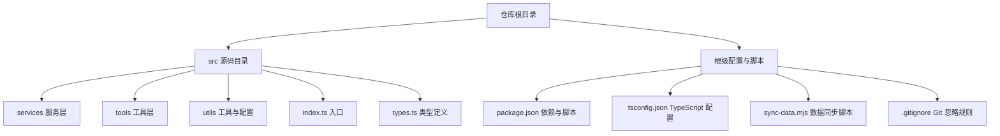
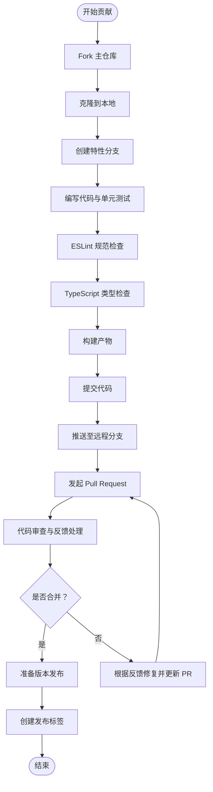
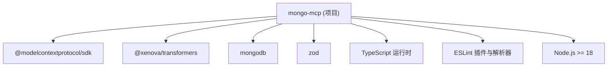

# 贡献流程

<cite>
**本文引用的文件**
- [package.json](file://package.json)
- [src/README.md](file://src/README.md)
- [src/THIRD_PARTY_NOTICES.md](file://src/THIRD_PARTY_NOTICES.md)
- [src/.gitignore](file://src/.gitignore)
- [tsconfig.json](file://tsconfig.json)
- [sync-data.mjs](file://sync-data.mjs)
</cite>

## 目录
1. [简介](#简介)
2. [项目结构](#项目结构)
3. [核心组件](#核心组件)
4. [架构总览](#架构总览)
5. [详细组件分析](#详细组件分析)
6. [依赖分析](#依赖分析)
7. [性能考虑](#性能考虑)
8. [故障排除指南](#故障排除指南)
9. [结论](#结论)
10. [附录](#附录)

## 简介
本文件旨在为本仓库提供一套完整的贡献流程与规范说明，覆盖从 Fork 项目到提交 PR 的全流程、代码审查标准与流程、版本发布流程（版本号管理、变更日志更新、发布标签）、Issue 提交规范与 Bug 报告模板、社区参与指南、许可证与贡献者协议要求，以及安全漏洞报告与敏感问题处理流程。由于当前仓库未包含标准的 GitHub 工作流目录（如 .github），本文在缺乏明确官方模板的情况下，基于仓库现有配置与文件，给出可操作的实践建议与流程图示。

## 项目结构
该仓库采用 TypeScript 源码组织方式，核心源码位于 src 目录，包含服务层（embedding-service、knowledge-service）、工具层（knowledge-tools）与通用类型定义与配置。根目录包含构建与开发脚本、类型检查配置、第三方声明与同步脚本等。

图表来源
- [package.json](file://package.json#L1-L48)
- [tsconfig.json](file://tsconfig.json)
- [src/.gitignore](file://src/.gitignore)

章节来源
- [package.json](file://package.json#L1-L48)
- [tsconfig.json](file://tsconfig.json)
- [src/.gitignore](file://src/.gitignore)

## 核心组件
- 构建与开发脚本：通过 package.json 中的 scripts 字段定义了构建、启动、开发监听、类型检查与 ESLint 规范检查等命令，便于本地开发与质量控制。
- TypeScript 配置：tsconfig.json 提供编译选项与路径映射，确保跨平台一致性与模块解析行为可控。
- 第三方声明：THIRD_PARTY_NOTICES.md 用于记录第三方组件许可信息，符合开源合规要求。
- 同步脚本：sync-data.mjs 可能用于数据或资源的同步任务，建议在贡献前确认其用途与执行方式。

章节来源
- [package.json](file://package.json#L10-L16)
- [tsconfig.json](file://tsconfig.json)
- [src/THIRD_PARTY_NOTICES.md](file://src/THIRD_PARTY_NOTICES.md)
- [sync-data.mjs](file://sync-data.mjs)

## 架构总览
下图展示了从本地开发到提交 PR 的典型贡献流程，涵盖分支策略、代码审查、测试与发布准备等环节。

## 详细组件分析

### 贡献流程（Fork → 分支 → 提交 → PR）
- Fork 项目：在托管平台上 Fork 主仓库，获得个人副本以便自由提交。
- 创建分支：基于主分支创建特性分支，命名建议清晰表达变更目的（如 feat/add-new-tool、fix/bug-in-knowledge-service）。
- 提交代码：
  - 使用 ESLint 与 TypeScript 类型检查确保质量。
  - 提交信息遵循约定式提交风格（如 feat、fix、docs、test、refactor 前缀），并在 PR 描述中引用相关 Issue。
- 发起 PR：在托管平台创建 PR，填写模板中的必要信息（变更摘要、影响范围、测试验证等）。

章节来源
- [package.json](file://package.json#L10-L16)

### 代码审查标准与流程
- 审查清单（建议）：
  - 功能正确性：是否满足需求描述，边界条件与异常处理是否完备。
  - 代码质量：命名规范、注释清晰度、复杂度与可读性。
  - 性能与安全性：是否存在潜在性能瓶颈或安全风险。
  - 兼容性：对既有接口与行为的影响评估。
  - 测试覆盖：新增/修改逻辑是否有相应测试用例。
- 审查流程：
  - 自动化检查：ESLint、类型检查、构建通过后方可进入人工审查。
  - 人工审查：至少一名维护者审阅，关注设计一致性与实现细节。
  - 反馈处理：根据审查意见进行修改，并在本地重新验证后更新 PR。

章节来源
- [package.json](file://package.json#L10-L16)

### 版本发布流程（版本号、变更日志、标签）
- 版本号管理：遵循语义化版本（SemVer）。主版本号用于破坏性变更，次版本号用于向后兼容的功能新增，修订号用于向后兼容的问题修正。
- 变更日志更新：每次发布前更新 CHANGELOG 或类似文档，记录本次版本包含的功能、修复与已知问题。
- 发布标签创建：在合并后的提交上打上对应版本标签（如 v2.0.0），并生成发布说明。

章节来源
- [package.json](file://package.json#L2-L4)

### Issue 提交规范与 Bug 报告模板
- Issue 分类：功能请求、Bug 报告、文档改进、性能问题等。
- Bug 报告模板（建议）：
  - 复现步骤：清晰列出复现环境与操作序列。
  - 预期结果与实际结果：对比说明。
  - 日志与截图：提供关键错误日志与截图。
  - 环境信息：操作系统、Node.js 版本、依赖版本等。
- 功能建议：描述场景、期望行为与替代方案，必要时附带草图或原型链接。

章节来源
- [package.json](file://package.json#L44-L46)

### 社区参与指南（讨论与建议）
- 讨论参与：优先在 Issue 中讨论设计思路与技术方案，避免私下沟通导致信息不对称。
- 功能建议：提交 Feature Request 并附带使用场景、收益与实现建议，等待社区与维护者反馈。
- 行为准则：保持尊重与包容，遵守开源社区礼仪。

章节来源
- [package.json](file://package.json#L17-L27)

### 许可证要求与贡献者协议
- 许可证：项目采用 MIT 许可证，允许自由使用、复制、修改与再分发，需保留版权与许可声明。
- 贡献者协议：建议在首次提交前签署或确认 Contributor License Agreement（CLA），以明确贡献的授权与知识产权归属。
- 第三方组件：THIRD_PARTY_NOTICES.md 记录第三方组件许可信息，贡献时应确保新增依赖符合项目许可策略。

章节来源
- [package.json](file://package.json#L29)
- [src/THIRD_PARTY_NOTICES.md](file://src/THIRD_PARTY_NOTICES.md)

### 安全漏洞报告与敏感问题处理
- 安全漏洞报告：不要在公开 Issue 中披露漏洞细节，应通过私有渠道（如安全通告列表或私信）联系维护团队。
- 敏感问题处理：涉及用户数据、密钥或内部信息时，避免在 PR 或 Issue 中直接展示，必要时使用占位符并私下沟通。
- 应急响应：维护团队收到报告后应在合理时间内评估并发布修复版本，同时对外发布安全公告。

章节来源
- [package.json](file://package.json#L29)

## 依赖分析
下图展示了项目主要运行时与开发时依赖的关系，有助于理解贡献时需要关注的兼容性与升级风险。

图表来源
- [package.json](file://package.json#L30-L46)

章节来源
- [package.json](file://package.json#L30-L46)

## 性能考虑
- 构建与类型检查：在本地开发阶段启用增量构建与缓存，减少重复检查时间。
- 依赖升级：定期评估依赖更新，优先选择稳定版本，避免引入不必要的性能开销。
- 测试覆盖：补充关键路径的单元测试与集成测试，降低回归风险。

章节来源
- [package.json](file://package.json#L10-L16)

## 故障排除指南
- 本地构建失败：检查 Node.js 版本与依赖安装状态，确保 TypeScript 编译与 ESLint 正常通过。
- 类型检查报错：根据提示修复类型不匹配问题，必要时更新相关依赖版本。
- 依赖冲突：使用锁定文件与统一的包管理器版本，避免不同环境下的差异。

章节来源
- [package.json](file://package.json#L44-L46)
- [tsconfig.json](file://tsconfig.json)

## 结论
本贡献流程文档基于仓库现有配置与文件制定，旨在帮助贡献者高效、规范地参与项目。建议在后续迭代中补充 .github 目录下的标准工作流文件（如 CONTRIBUTING.md、PULL_REQUEST_TEMPLATE.md、ISSUE_TEMPLATE 等），以进一步提升协作效率与一致性。

## 附录
- 开发命令速查：
  - 构建：使用构建脚本生成发布产物。
  - 启动：运行已构建的入口文件。
  - 开发监听：热重载模式进行快速迭代。
  - 规范检查：运行 ESLint 与类型检查。
- 贡献前检查清单：
  - 本地构建与类型检查通过。
  - 新增/修改逻辑具备测试覆盖。
  - 提交信息清晰、遵循约定式提交。
  - PR 描述包含变更摘要与影响评估。

章节来源
- [package.json](file://package.json#L10-L16)