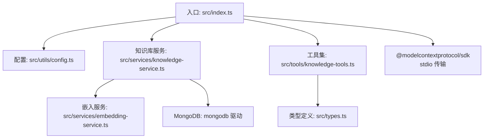
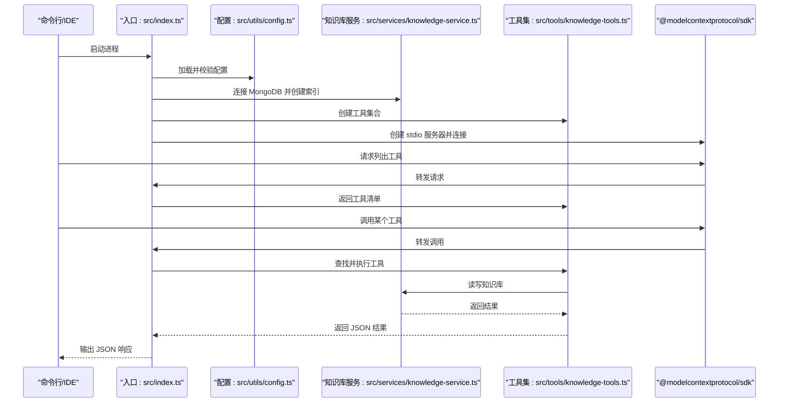
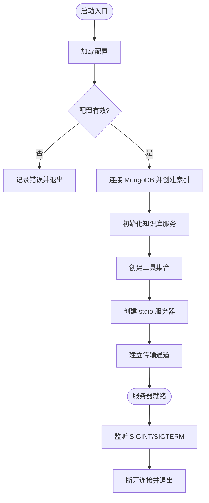
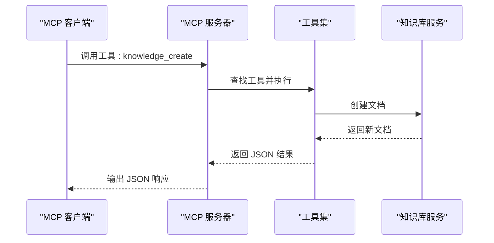
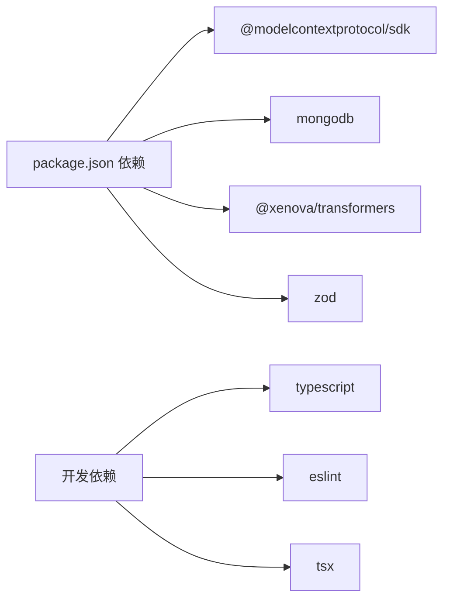

# 快速开始

<cite>
**本文引用的文件**
- [package.json](file://package.json)
- [tsconfig.json](file://tsconfig.json)
- [src/index.ts](file://src/index.ts)
- [src/utils/config.ts](file://src/utils/config.ts)
- [src/services/knowledge-service.ts](file://src/services/knowledge-service.ts)
- [src/services/embedding-service.ts](file://src/services/embedding-service.ts)
- [src/tools/knowledge-tools.ts](file://src/tools/knowledge-tools.ts)
- [src/types.ts](file://src/types.ts)
- [examples/mcp-config.json](file://examples/mcp-config.json)
</cite>

## 目录
1. [简介](#简介)
2. [项目结构](#项目结构)
3. [核心组件](#核心组件)
4. [架构总览](#架构总览)
5. [详细组件分析](#详细组件分析)
6. [依赖关系分析](#依赖关系分析)
7. [性能注意事项](#性能注意事项)
8. [故障排除指南](#故障排除指南)
9. [结论](#结论)
10. [附录](#附录)

## 简介
本指南面向首次接触 MongoDB MCP Server 的开发者，帮助你在最短时间内完成环境准备、安装部署与基础配置，并通过第一个 MCP 工具调用验证安装成功。你将学到：
- 环境要求与安装步骤
- MongoDB 连接配置与常用环境变量
- MCP 服务器启动流程与控制台输出
- 第一个 MCP 工具调用示例与验证方法
- 常见初始配置问题与解决方案
- IDE 集成的基本配置示例（Qoder/Cursor/VS Code）

## 项目结构
该仓库采用 TypeScript 源码组织，核心入口位于 src/index.ts，主要模块包括：
- 服务器与传输层：基于 @modelcontextprotocol/sdk 的 stdio 服务器
- 配置加载与校验：从环境变量加载配置并进行校验
- 知识库服务：封装 MongoDB 连接、索引、CRUD、统计、语义搜索与嵌入
- 工具集：提供知识库管理相关的 MCP 工具（CRUD、统计、快捷工具等）
- 类型定义：统一的知识库文档类型与查询选项
- 示例配置：多 IDE 的 MCP 服务器配置样例

图表来源
- [src/index.ts](file://src/index.ts#L1-L148)
- [src/utils/config.ts](file://src/utils/config.ts#L1-L147)
- [src/services/knowledge-service.ts](file://src/services/knowledge-service.ts#L1-L404)
- [src/tools/knowledge-tools.ts](file://src/tools/knowledge-tools.ts#L1-L800)
- [src/services/embedding-service.ts](file://src/services/embedding-service.ts#L1-L148)
- [src/types.ts](file://src/types.ts#L1-L269)

章节来源
- [src/index.ts](file://src/index.ts#L1-L148)
- [package.json](file://package.json#L1-L48)

## 核心组件
- 入口与服务器：创建 stdio 模式的 MCP 服务器，注册工具列表与工具调用处理器
- 配置系统：从环境变量加载配置，支持 IDE 来源、日志级别、嵌入开关等
- 知识库服务：封装 MongoDB 连接、索引、CRUD、统计、批量导入导出、语义搜索与嵌入生成
- 工具集：提供通用 CRUD 工具与快捷工具（记忆、经验、命令、上下文、MCP 同步等）
- 嵌入服务：基于 @xenova/transformers 的文本向量嵌入与余弦相似度计算
- 类型系统：统一的知识库文档类型与查询选项

章节来源
- [src/index.ts](file://src/index.ts#L1-L148)
- [src/utils/config.ts](file://src/utils/config.ts#L1-L147)
- [src/services/knowledge-service.ts](file://src/services/knowledge-service.ts#L1-L404)
- [src/tools/knowledge-tools.ts](file://src/tools/knowledge-tools.ts#L1-L800)
- [src/services/embedding-service.ts](file://src/services/embedding-service.ts#L1-L148)
- [src/types.ts](file://src/types.ts#L1-L269)

## 架构总览
MCP 服务器启动流程如下：
1. 从环境变量加载配置并校验
2. 连接 MongoDB 并创建必要索引
3. 初始化知识库服务
4. 注册 MCP 工具（CRUD、统计、快捷工具）
5. 创建 stdio 服务器并建立传输通道
6. 接收客户端请求（列出工具、调用工具），返回 JSON 结果

图表来源
- [src/index.ts](file://src/index.ts#L87-L145)
- [src/utils/config.ts](file://src/utils/config.ts#L76-L91)
- [src/services/knowledge-service.ts](file://src/services/knowledge-service.ts#L44-L87)
- [src/tools/knowledge-tools.ts](file://src/tools/knowledge-tools.ts#L29-L32)

## 详细组件分析

### 环境要求与安装步骤
- Node.js 版本要求：引擎字段要求 Node.js >= 18.0.0
- 安装依赖：使用包管理器安装项目依赖
- 构建产物：TypeScript 编译输出至 dist 目录
- 启动方式：可通过 npm scripts 或直接运行 dist/index.js

章节来源
- [package.json](file://package.json#L44-L46)
- [package.json](file://package.json#L10-L16)
- [tsconfig.json](file://tsconfig.json#L1-L21)

### MongoDB 连接配置
- 必填项：MONGO_URI、MONGO_DATABASE、MONGO_COLLECTION
- 可选项：USER_ID、DEVICE_ID、IDE_SOURCE、ENABLE_EMBEDDING、LOG_LEVEL
- 默认值：本地 MongoDB 地址、默认数据库与集合、默认用户标识、自动生成设备 ID、禁用嵌入、info 级别日志
- 验证逻辑：检查必填项是否为空，失败时记录错误并退出

章节来源
- [src/utils/config.ts](file://src/utils/config.ts#L76-L91)
- [src/utils/config.ts](file://src/utils/config.ts#L96-L115)

### MCP 服务器启动流程
- 加载配置并校验
- 连接 MongoDB，创建索引
- 初始化知识库服务
- 创建工具集合
- 创建 stdio 服务器并建立传输
- 注册工具列表与工具调用处理器
- 处理 SIGINT/SIGTERM 优雅退出

图表来源
- [src/index.ts](file://src/index.ts#L87-L145)
- [src/utils/config.ts](file://src/utils/config.ts#L96-L115)
- [src/services/knowledge-service.ts](file://src/services/knowledge-service.ts#L44-L87)

章节来源
- [src/index.ts](file://src/index.ts#L87-L145)

### 第一个 MCP 工具调用示例
以下示例展示如何通过 MCP 客户端调用“创建知识文档”工具，验证安装成功：
- 工具名称：knowledge_create
- 输入参数（示例）：type、name、content、description、tags、enabled
- 预期响应：success 字段为 true，返回 id、type、name 等信息

图表来源
- [src/tools/knowledge-tools.ts](file://src/tools/knowledge-tools.ts#L36-L107)
- [src/services/knowledge-service.ts](file://src/services/knowledge-service.ts#L111-L127)

章节来源
- [src/tools/knowledge-tools.ts](file://src/tools/knowledge-tools.ts#L36-L107)

### 常见初始配置问题与解决方案
- MONGO_URI 未设置：导致配置校验失败。请设置 MONGO_URI 指向有效的 MongoDB 实例。
- 数据库或集合不可访问：确认 MongoDB 服务运行正常，网络可达，认证配置正确。
- DEVICE_ID 自动生成不符合预期：可通过 DEVICE_ID 环境变量显式设置。
- ENABLE_EMBEDDING 导致启动缓慢：首次加载嵌入模型需要下载与初始化，建议在开发阶段按需开启。
- LOG_LEVEL 过于冗长：调整 LOG_LEVEL 为 warn 或 error 以减少输出。
- IDE_SOURCE 不匹配：确保 IDE_SOURCE 与实际使用的 IDE 匹配，便于跨设备识别。

章节来源
- [src/utils/config.ts](file://src/utils/config.ts#L76-L91)
- [src/utils/config.ts](file://src/utils/config.ts#L96-L115)
- [src/services/embedding-service.ts](file://src/services/embedding-service.ts#L41-L51)

### IDE 集成的基本配置示例
以下示例展示了如何在不同 IDE 中配置 mongo-mcp 作为 MCP 服务器：
- Qoder/Cursor/VS Code：通过 mcpServers/mcp.servers 指定 npx 启动命令与环境变量
- 本地开发：使用 node 直接运行 dist/index.js
- 云数据库共享：使用 mongodb+srv 连接字符串与团队共享数据库

章节来源
- [examples/mcp-config.json](file://examples/mcp-config.json#L1-L94)

## 依赖关系分析
- 运行时依赖
  - @modelcontextprotocol/sdk：实现 MCP 协议与 stdio 传输
  - mongodb：MongoDB 官方驱动
  - @xenova/transformers：文本向量嵌入
  - zod：配置校验（在配置模块中使用）
- 开发依赖
  - typescript、@types/node、tsx、eslint 等

图表来源
- [package.json](file://package.json#L30-L43)

章节来源
- [package.json](file://package.json#L30-L43)

## 性能注意事项
- 嵌入模型初始化：首次使用会加载模型，耗时较长；后续复用已初始化实例
- 语义搜索：对大量文档进行相似度计算，建议合理设置阈值与返回数量
- 批量操作：批量导入/导出时注意内存占用与网络带宽
- 索引策略：服务启动时自动创建索引，确保查询性能

章节来源
- [src/services/embedding-service.ts](file://src/services/embedding-service.ts#L41-L51)
- [src/services/knowledge-service.ts](file://src/services/knowledge-service.ts#L71-L87)

## 故障排除指南
- 启动失败（配置校验错误）：检查必填环境变量是否设置正确
- 连接 MongoDB 失败：确认 MONGO_URI 正确、网络可达、认证信息正确
- 工具调用报错：查看工具返回的 error 字段，定位具体异常
- 嵌入功能异常：确认 ENABLE_EMBEDDING 与网络环境允许模型下载
- 优雅退出：服务器监听 SIGINT/SIGTERM，确保进程平滑结束

章节来源
- [src/index.ts](file://src/index.ts#L94-L98)
- [src/index.ts](file://src/index.ts#L141-L144)
- [src/utils/config.ts](file://src/utils/config.ts#L96-L115)

## 结论
通过本指南，你已经完成了 MongoDB MCP Server 的环境准备、安装部署与基础配置，并成功执行了第一个 MCP 工具调用。建议继续探索知识库服务的 CRUD、统计与语义搜索能力，并根据实际需求调整嵌入与日志配置，逐步完善你的 MCP 工作流。

## 附录
- 环境变量参考
  - MONGO_URI：MongoDB 连接字符串
  - MONGO_DATABASE：数据库名称
  - MONGO_COLLECTION：集合名称
  - USER_ID：用户标识
  - DEVICE_ID：设备标识
  - IDE_SOURCE：IDE 来源（qoder/trae/cursor/windsurf/vscode/manual/other）
  - ENABLE_EMBEDDING：是否启用向量嵌入
  - LOG_LEVEL：日志级别（debug/info/warn/error）
- TypeScript 编译配置：目标 ES2022，模块 ESNext，输出目录 dist

章节来源
- [src/utils/config.ts](file://src/utils/config.ts#L76-L91)
- [tsconfig.json](file://tsconfig.json#L1-L21)