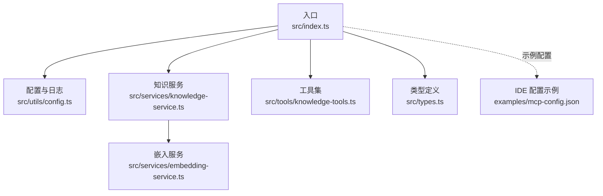
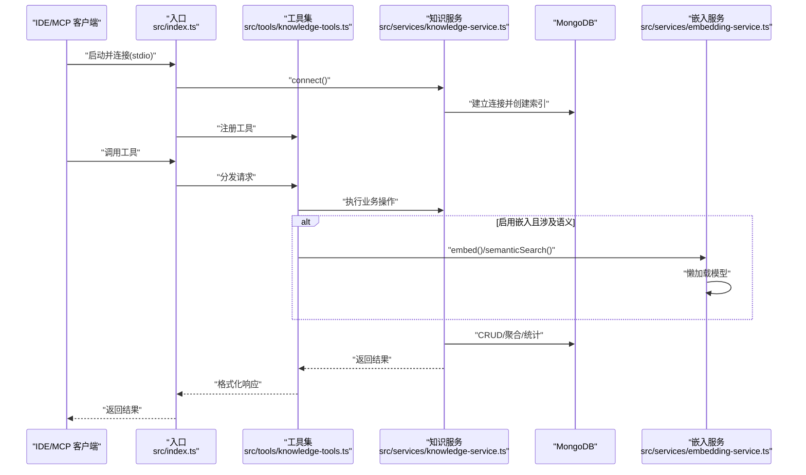
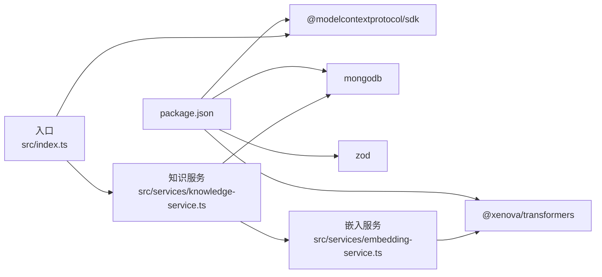
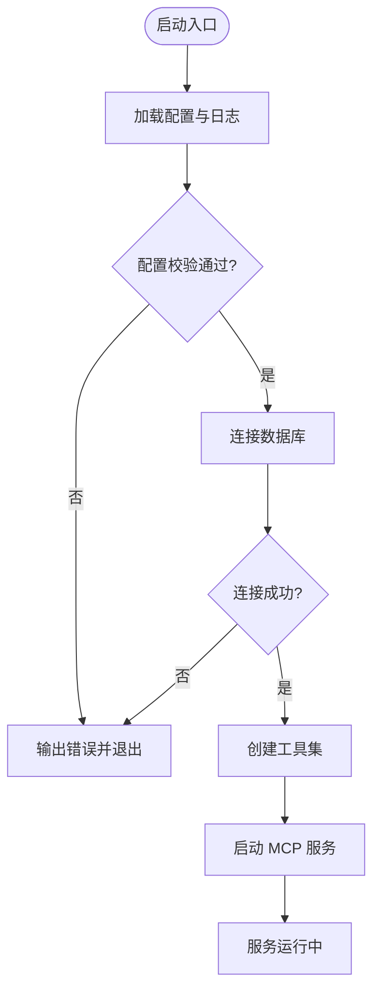
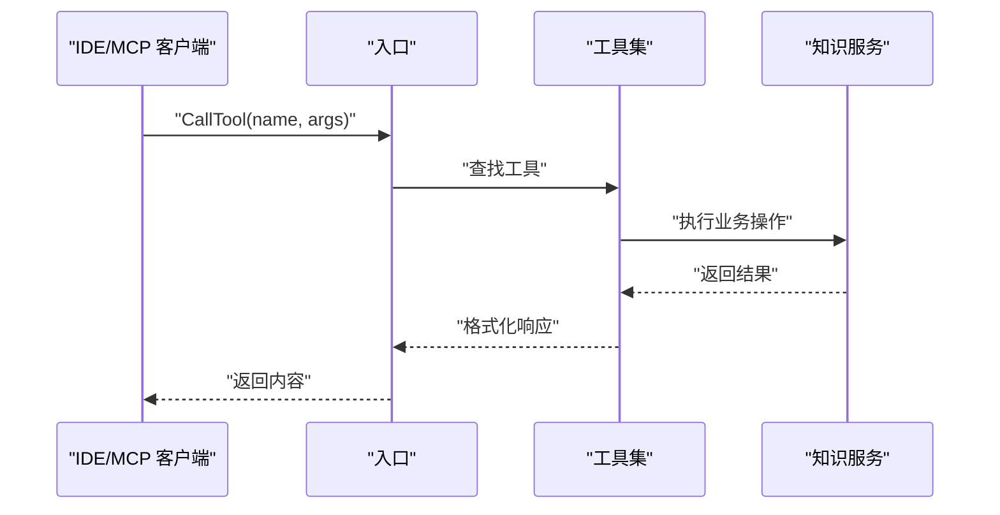
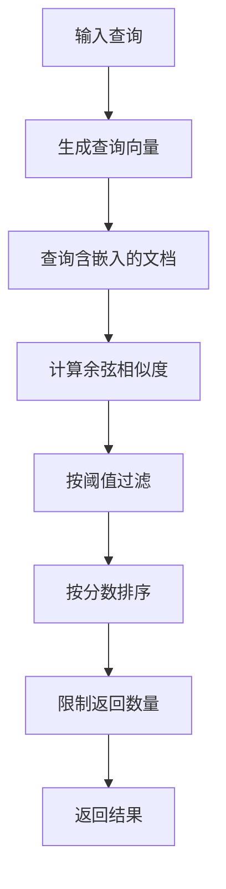

# 故障排除

<cite>
**本文引用的文件**
- [package.json](file://package.json)
- [src/index.ts](file://src/index.ts)
- [src/utils/config.ts](file://src/utils/config.ts)
- [src/services/knowledge-service.ts](file://src/services/knowledge-service.ts)
- [src/services/embedding-service.ts](file://src/services/embedding-service.ts)
- [src/tools/knowledge-tools.ts](file://src/tools/knowledge-tools.ts)
- [src/types.ts](file://src/types.ts)
- [examples/mcp-config.json](file://examples/mcp-config.json)
</cite>

## 目录
1. [简介](#简介)
2. [项目结构](#项目结构)
3. [核心组件](#核心组件)
4. [架构总览](#架构总览)
5. [详细组件分析](#详细组件分析)
6. [依赖关系分析](#依赖关系分析)
7. [性能考虑](#性能考虑)
8. [故障排除指南](#故障排除指南)
9. [结论](#结论)
10. [附录](#附录)

## 简介
本指南面向使用 mongo-mcp 的开发者与运维人员，聚焦于系统性地定位与解决运行时问题。内容覆盖网络连接、数据库连接、配置错误、IDE 集成、工具调用失败、搜索异常、性能瓶颈、内存与资源分析，以及社区支持与问题上报流程。文档以代码为依据，结合实际文件与调用链路，提供可操作的诊断步骤与修复建议。

## 项目结构
- 入口与服务编排：入口负责加载配置、校验、连接数据库、注册工具并启动 MCP 服务。
- 配置与日志：集中解析环境变量、校验必填项、输出分级日志。
- 知识服务：封装 MongoDB 连接、索引、CRUD、批量导入导出、语义搜索与嵌入生成。
- 嵌入服务：基于 Transformers.js 的文本向量提取与相似度计算。
- 工具集：提供知识库 CRUD、快捷工具、MCP/规则/技能/工作流同步、导出、语义搜索与嵌入生成等。

图表来源
- [src/index.ts](file://src/index.ts#L87-L147)
- [src/utils/config.ts](file://src/utils/config.ts#L76-L91)
- [src/services/knowledge-service.ts](file://src/services/knowledge-service.ts#L20-L54)
- [src/services/embedding-service.ts](file://src/services/embedding-service.ts#L11-L51)
- [src/tools/knowledge-tools.ts](file://src/tools/knowledge-tools.ts#L29-L32)
- [src/types.ts](file://src/types.ts#L1-L269)
- [examples/mcp-config.json](file://examples/mcp-config.json#L1-L94)

章节来源
- [package.json](file://package.json#L1-L48)
- [src/index.ts](file://src/index.ts#L1-L148)
- [src/utils/config.ts](file://src/utils/config.ts#L1-L147)
- [src/services/knowledge-service.ts](file://src/services/knowledge-service.ts#L1-L404)
- [src/services/embedding-service.ts](file://src/services/embedding-service.ts#L1-L148)
- [src/tools/knowledge-tools.ts](file://src/tools/knowledge-tools.ts#L1-L1093)
- [src/types.ts](file://src/types.ts#L1-L269)
- [examples/mcp-config.json](file://examples/mcp-config.json#L1-L94)

## 核心组件
- 入口与生命周期
  - 加载配置、校验配置、连接数据库、注册工具、启动 MCP 服务、监听退出信号优雅关闭。
- 配置与日志
  - 从环境变量解析数据库连接串、库名、集合名、用户/设备/IDE 来源、嵌入开关、日志级别；提供分级日志输出。
- 知识服务
  - 封装 MongoDB 连接、索引、CRUD、批量导入导出、统计、语义搜索、嵌入生成与批量生成。
- 嵌入服务
  - 懒加载模型、文本向量化、余弦相似度、文本抽取策略、单例实例。
- 工具集
  - 提供通用 CRUD、快捷工具、MCP/规则/技能/工作流同步、导出、语义搜索与嵌入生成（按配置开关）。

章节来源
- [src/index.ts](file://src/index.ts#L87-L147)
- [src/utils/config.ts](file://src/utils/config.ts#L76-L146)
- [src/services/knowledge-service.ts](file://src/services/knowledge-service.ts#L20-L403)
- [src/services/embedding-service.ts](file://src/services/embedding-service.ts#L11-L147)
- [src/tools/knowledge-tools.ts](file://src/tools/knowledge-tools.ts#L29-L1092)

## 架构总览
MCP 服务采用 stdio 传输模式，入口创建 Server 并注册工具；工具调用由知识服务执行具体业务逻辑；当启用嵌入时，语义搜索与嵌入生成通过嵌入服务完成。

图表来源
- [src/index.ts](file://src/index.ts#L16-L82)
- [src/tools/knowledge-tools.ts](file://src/tools/knowledge-tools.ts#L36-L108)
- [src/services/knowledge-service.ts](file://src/services/knowledge-service.ts#L44-L54)
- [src/services/embedding-service.ts](file://src/services/embedding-service.ts#L24-L51)

## 详细组件分析

### 组件：入口与生命周期
- 关键职责
  - 加载配置与日志、校验配置、连接数据库、注册工具、启动 MCP 服务、处理 SIGINT/SIGTERM。
- 常见问题
  - 配置校验失败导致进程退出。
  - 数据库连接失败导致启动失败。
  - 工具调用异常返回错误消息。
- 诊断要点
  - 检查日志输出与退出码。
  - 确认环境变量与示例配置一致。
  - 验证数据库可达性与凭据。

章节来源
- [src/index.ts](file://src/index.ts#L87-L147)
- [src/utils/config.ts](file://src/utils/config.ts#L96-L115)

### 组件：配置与日志
- 关键职责
  - 解析环境变量、校验必填项、生成默认设备 ID、创建分级日志器。
- 常见问题
  - 缺少 MONGO_URI/MONGO_DATABASE/MONGO_COLLECTION 导致校验失败。
  - LOG_LEVEL 设置不当导致日志过少或过多。
- 诊断要点
  - 使用示例配置文件比对环境变量。
  - 在本地开发时开启 debug 级别以获取更细粒度日志。

章节来源
- [src/utils/config.ts](file://src/utils/config.ts#L76-L146)
- [examples/mcp-config.json](file://examples/mcp-config.json#L1-L94)

### 组件：知识服务（数据库层）
- 关键职责
  - 连接/断开 MongoDB、确保索引、CRUD、批量导入导出、统计、语义搜索、嵌入生成。
- 常见问题
  - 未连接直接操作抛出“Not connected”。
  - 查询/更新/删除因用户过滤器或唯一索引冲突失败。
  - 语义搜索缺少嵌入字段或阈值设置不当。
- 诊断要点
  - 确认 connect() 成功后再进行操作。
  - 检查索引是否创建成功。
  - 生成嵌入后再进行语义搜索。

章节来源
- [src/services/knowledge-service.ts](file://src/services/knowledge-service.ts#L44-L87)
- [src/services/knowledge-service.ts](file://src/services/knowledge-service.ts#L111-L190)
- [src/services/knowledge-service.ts](file://src/services/knowledge-service.ts#L272-L299)
- [src/services/knowledge-service.ts](file://src/services/knowledge-service.ts#L304-L341)

### 组件：嵌入服务（向量层）
- 关键职责
  - 懒加载模型、文本向量化、余弦相似度、文本抽取、单例实例。
- 常见问题
  - 首次加载模型耗时长，影响首次语义搜索。
  - 向量维度不匹配导致相似度计算异常。
- 诊断要点
  - 观察控制台输出的模型加载耗时。
  - 确保输入文本长度与抽取策略一致。

章节来源
- [src/services/embedding-service.ts](file://src/services/embedding-service.ts#L24-L51)
- [src/services/embedding-service.ts](file://src/services/embedding-service.ts#L85-L104)
- [src/services/embedding-service.ts](file://src/services/embedding-service.ts#L109-L129)

### 组件：工具集（MCP 接口层）
- 关键职责
  - 提供知识库 CRUD、快捷工具、MCP/规则/技能/工作流同步、导出、语义搜索与嵌入生成（按配置开关）。
- 常见问题
  - 工具名未知导致返回 Unknown tool。
  - 工具内部异常被包装为错误消息返回。
  - 语义搜索工具仅在启用嵌入时出现。
- 诊断要点
  - 使用 ListTools 请求确认可用工具列表。
  - 检查工具输入 Schema 与参数一致性。

章节来源
- [src/tools/knowledge-tools.ts](file://src/tools/knowledge-tools.ts#L36-L107)
- [src/tools/knowledge-tools.ts](file://src/tools/knowledge-tools.ts#L1000-L1089)

## 依赖关系分析
- 运行时依赖
  - @modelcontextprotocol/sdk：MCP 协议与传输。
  - mongodb：数据库驱动。
  - @xenova/transformers：嵌入模型加载与特征提取。
  - zod：配置校验（代码中未直接使用，但可作为扩展）。
- 开发与构建
  - TypeScript、ESLint、tsx、Node 脚本。

图表来源
- [package.json](file://package.json#L30-L43)
- [src/index.ts](file://src/index.ts#L3-L11)
- [src/services/knowledge-service.ts](file://src/services/knowledge-service.ts#L1-L4)
- [src/services/embedding-service.ts](file://src/services/embedding-service.ts#L1)

章节来源
- [package.json](file://package.json#L1-L48)
- [src/index.ts](file://src/index.ts#L1-L12)

## 性能考虑
- 数据库性能
  - 索引：确保用户级唯一索引与常用查询索引存在，避免全表扫描。
  - 批量操作：使用批量导入导出减少往返次数。
  - 查询优化：合理使用 limit/offset 与正则搜索范围。
- 嵌入性能
  - 懒加载模型：首次加载耗时较长，建议在启动阶段预热或提前生成嵌入。
  - 相似度计算：注意向量维度与归一化，避免无效比较。
- 日志与可观测性
  - 适度的日志级别，避免在生产环境使用 debug。
  - 结合工具调用结果与数据库操作耗时进行端到端性能分析。

章节来源
- [src/services/knowledge-service.ts](file://src/services/knowledge-service.ts#L71-L87)
- [src/services/embedding-service.ts](file://src/services/embedding-service.ts#L42-L51)

## 故障排除指南

### 一、系统性诊断方法
- 步骤 1：确认配置与环境
  - 对照示例配置检查环境变量是否齐全与正确。
  - 使用配置校验函数输出错误清单。
- 步骤 2：验证数据库连通性
  - 确认连接串、认证信息、网络可达性。
  - 检查集合是否存在与权限是否足够。
- 步骤 3：检查 MCP 服务状态
  - 确认服务已启动、工具已注册、客户端可发现工具。
- 步骤 4：定位工具调用问题
  - 使用 ListTools 确认工具列表。
  - 捕捉工具返回的错误消息，逐项排查输入参数与业务逻辑。
- 步骤 5：分析日志与错误
  - 查看启动日志、工具调用日志、数据库操作日志。
  - 结合错误码与堆栈信息定位根因。

章节来源
- [src/utils/config.ts](file://src/utils/config.ts#L96-L115)
- [examples/mcp-config.json](file://examples/mcp-config.json#L1-L94)
- [src/index.ts](file://src/index.ts#L116-L144)

### 二、网络连接问题
- 症状
  - 启动时报连接超时或拒绝。
  - 工具调用无响应或超时。
- 原因
  - 网络策略阻止访问数据库端口。
  - DNS 解析失败或代理配置错误。
  - 防火墙阻断本地/远程连接。
- 解决方案
  - 使用 telnet 或 nc 测试端口连通性。
  - 在客户端侧配置正确的代理与证书。
  - 如使用云数据库，检查安全组/白名单与 SASL 认证。
- 调试工具
  - 网络连通性测试、抓包分析、DNS 解析验证。

章节来源
- [src/services/knowledge-service.ts](file://src/services/knowledge-service.ts#L44-L54)

### 三、数据库连接失败
- 症状
  - 启动阶段 connect() 失败，进程退出。
  - 工具调用报“Not connected”。
- 原因
  - 连接串格式错误或缺少认证信息。
  - 数据库未启动或副本集状态异常。
  - 用户权限不足或集合不存在。
- 解决方案
  - 使用官方驱动工具验证连接串。
  - 检查数据库实例状态与副本集健康。
  - 授权对应数据库与集合的读写权限。
- 调试工具
  - MongoDB Shell 连接测试、驱动日志、数据库审计日志。

章节来源
- [src/services/knowledge-service.ts](file://src/services/knowledge-service.ts#L44-L54)
- [src/services/knowledge-service.ts](file://src/services/knowledge-service.ts#L114)

### 四、配置错误
- 症状
  - 配置校验失败，打印多项错误。
  - 日志级别设置不当导致难以定位问题。
- 原因
  - 缺少必填项（MONGO_URI/MONGO_DATABASE/MONGO_COLLECTION）。
  - IDE 来源或日志级别解析失败回退为默认值。
- 解决方案
  - 对照示例配置补齐缺失项。
  - 明确各环境变量含义，必要时在 IDE 配置中显式设置。
- 调试工具
  - 输出当前配置快照，核对环境变量来源优先级。

章节来源
- [src/utils/config.ts](file://src/utils/config.ts#L96-L115)
- [src/utils/config.ts](file://src/utils/config.ts#L76-L91)
- [examples/mcp-config.json](file://examples/mcp-config.json#L1-L94)

### 五、IDE 集成问题
- 症状
  - IDE 无法发现或加载 MCP 服务器。
  - 工具列表为空或工具不可用。
- 原因
  - MCP 配置命令/参数错误或环境变量未传递。
  - IDE 版本或插件不兼容。
- 解决方案
  - 使用示例配置文件逐项比对命令、参数与环境变量。
  - 确认 IDE 的 MCP 设置位置与格式。
- 调试工具
  - IDE 控制台日志、MCP 客户端日志、工具列表请求响应。

章节来源
- [examples/mcp-config.json](file://examples/mcp-config.json#L1-L94)
- [src/index.ts](file://src/index.ts#L16-L82)

### 六、工具调用失败
- 症状
  - 返回 Unknown tool。
  - 工具内部抛错，返回错误消息。
- 原因
  - 工具名拼写错误或未注册。
  - 输入参数缺失或类型不符。
  - 业务逻辑异常（如重复命名、权限不足）。
- 解决方案
  - 先调用 ListTools 获取可用工具清单。
  - 严格遵循工具输入 Schema，补齐必填项。
  - 捕获并记录工具返回的错误消息，定位具体失败点。
- 调试工具
  - 工具调用序列图、日志级别提升、参数校验增强。

章节来源
- [src/index.ts](file://src/index.ts#L41-L79)
- [src/tools/knowledge-tools.ts](file://src/tools/knowledge-tools.ts#L36-L107)

### 七、搜索异常
- 症状
  - 语义搜索无结果或结果质量差。
  - 报告“嵌入字段不存在”或相似度异常。
- 原因
  - 未启用嵌入或未生成嵌入。
  - 阈值设置过高或过低。
  - 文本抽取策略导致关键信息缺失。
- 解决方案
  - 确认 ENABLE_EMBEDDING 为 true，并先生成嵌入。
  - 调整阈值与 limit，观察相似度分布。
  - 检查文档内容与标签是否充分。
- 调试工具
  - 语义搜索流程图、嵌入生成进度、相似度直方图。

章节来源
- [src/tools/knowledge-tools.ts](file://src/tools/knowledge-tools.ts#L1000-L1089)
- [src/services/knowledge-service.ts](file://src/services/knowledge-service.ts#L272-L299)
- [src/services/knowledge-service.ts](file://src/services/knowledge-service.ts#L304-L341)
- [src/services/embedding-service.ts](file://src/services/embedding-service.ts#L85-L104)

### 八、性能问题诊断
- 症状
  - 工具响应慢、CPU 占用高、内存增长。
- 原因
  - 数据库查询未命中索引、批量操作过大。
  - 嵌入模型首次加载耗时长。
  - 日志级别过高导致 I/O 压力。
- 解决方案
  - 为高频查询字段创建索引，使用 limit/offset。
  - 分批生成嵌入，避免一次性处理大量文档。
  - 调整日志级别，生产环境避免 debug。
- 调试工具
  - 数据库慢查询日志、嵌入生成耗时统计、进程监控。

章节来源
- [src/services/knowledge-service.ts](file://src/services/knowledge-service.ts#L71-L87)
- [src/services/embedding-service.ts](file://src/services/embedding-service.ts#L42-L51)
- [src/utils/config.ts](file://src/utils/config.ts#L120-L146)

### 九、内存泄漏与资源瓶颈
- 症状
  - 进程内存持续增长、GC 不回收或句柄泄露。
- 原因
  - 数据库连接未正确关闭或复用不当。
  - 嵌入模型实例未释放或缓存过大。
- 解决方案
  - 确保优雅关闭时调用 disconnect()。
  - 控制嵌入批次大小与缓存策略。
- 调试工具
  - Node.js 堆快照、内存分析器、连接池监控。

章节来源
- [src/index.ts](file://src/index.ts#L133-L140)
- [src/services/knowledge-service.ts](file://src/services/knowledge-service.ts#L59-L66)
- [src/services/embedding-service.ts](file://src/services/embedding-service.ts#L142-L147)

### 十、日志分析与错误追踪
- 日志来源
  - 入口启动日志、工具调用日志、数据库操作日志、嵌入服务模型加载日志。
- 错误追踪
  - 工具调用异常会被包装为统一错误消息返回。
  - 配置校验失败会输出具体缺失项。
- 建议
  - 生产环境使用 info/warn/error 级别，必要时临时切换 debug。
  - 结合工具返回的错误消息与数据库日志定位根因。

章节来源
- [src/index.ts](file://src/index.ts#L100-L103)
- [src/index.ts](file://src/index.ts#L141-L144)
- [src/utils/config.ts](file://src/utils/config.ts#L120-L146)
- [src/tools/knowledge-tools.ts](file://src/tools/knowledge-tools.ts#L99-L106)

### 十一、社区支持与问题报告
- 社区渠道
  - GitHub Issues：提交问题前请附带环境信息、配置片段、日志与最小复现步骤。
- 问题报告模板建议
  - 环境：Node 版本、操作系统、IDE 与版本、数据库版本。
  - 配置：关键环境变量与 IDE 配置节选。
  - 行为：期望与实际差异、错误消息与日志片段。
  - 复现：最小可复现步骤与数据样例。
- 升级修复建议
  - 先升级依赖至最新稳定版，再尝试修复。
  - 若问题与嵌入模型相关，尝试更换模型或禁用嵌入功能对比定位。

章节来源
- [package.json](file://package.json#L30-L43)

## 结论
本指南基于代码实现梳理了 mongo-mcp 的关键组件与调用链路，提供了从配置、网络、数据库到工具调用、搜索与性能的系统性故障排除方法。建议在生产环境中遵循最小日志级别、完善的索引策略与优雅关闭流程，并通过示例配置与工具调用序列图快速定位问题根因。

## 附录

### A. 关键流程图与时序图

#### 启动与连接流程

图表来源
- [src/index.ts](file://src/index.ts#L87-L147)
- [src/utils/config.ts](file://src/utils/config.ts#L96-L115)
- [src/services/knowledge-service.ts](file://src/services/knowledge-service.ts#L44-L54)

#### 工具调用时序

图表来源
- [src/index.ts](file://src/index.ts#L41-L79)
- [src/tools/knowledge-tools.ts](file://src/tools/knowledge-tools.ts#L36-L107)

#### 语义搜索流程

图表来源
- [src/services/knowledge-service.ts](file://src/services/knowledge-service.ts#L272-L299)
- [src/services/embedding-service.ts](file://src/services/embedding-service.ts#L85-L104)