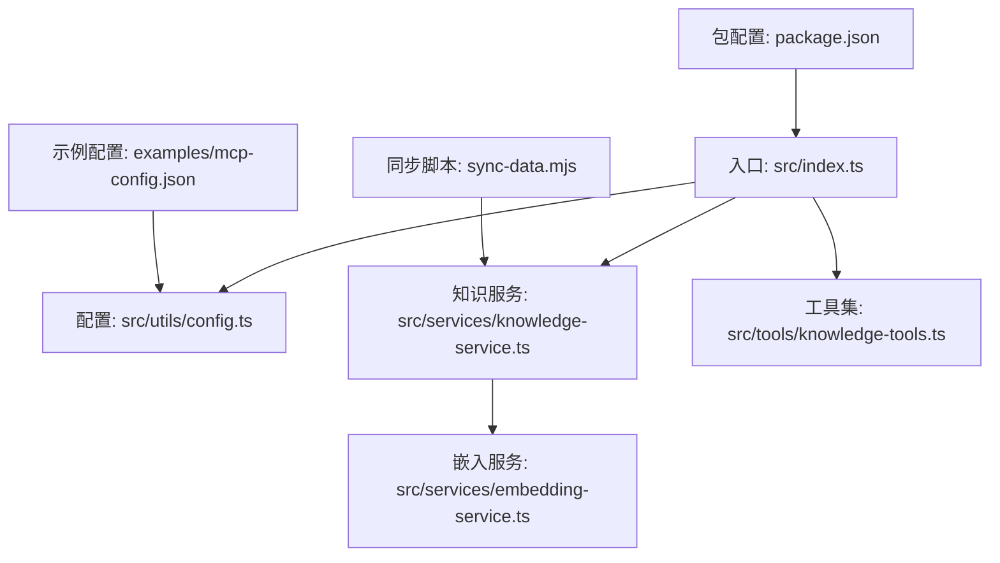
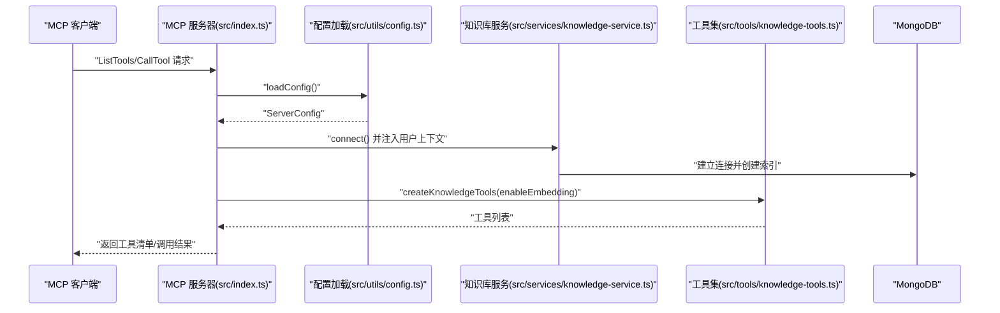
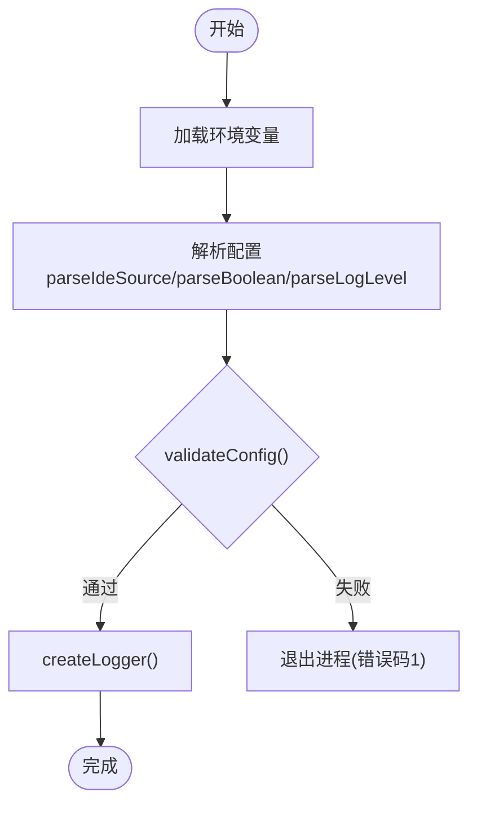
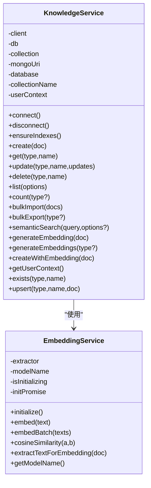
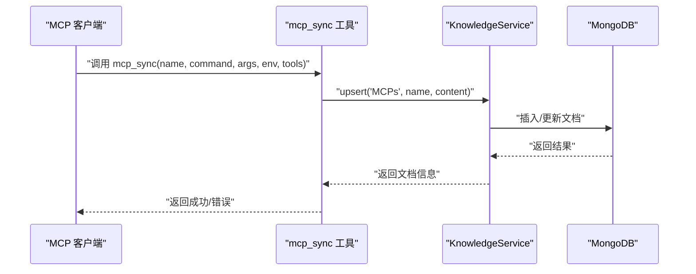
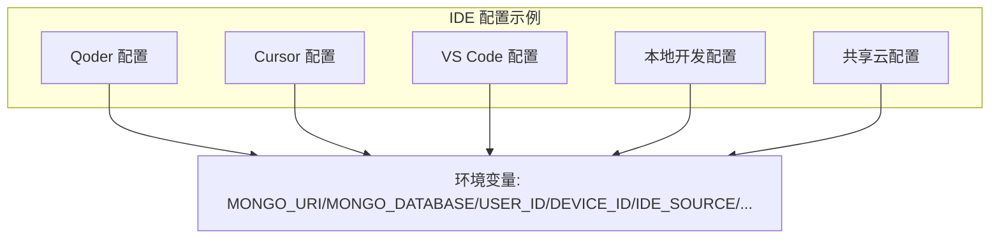
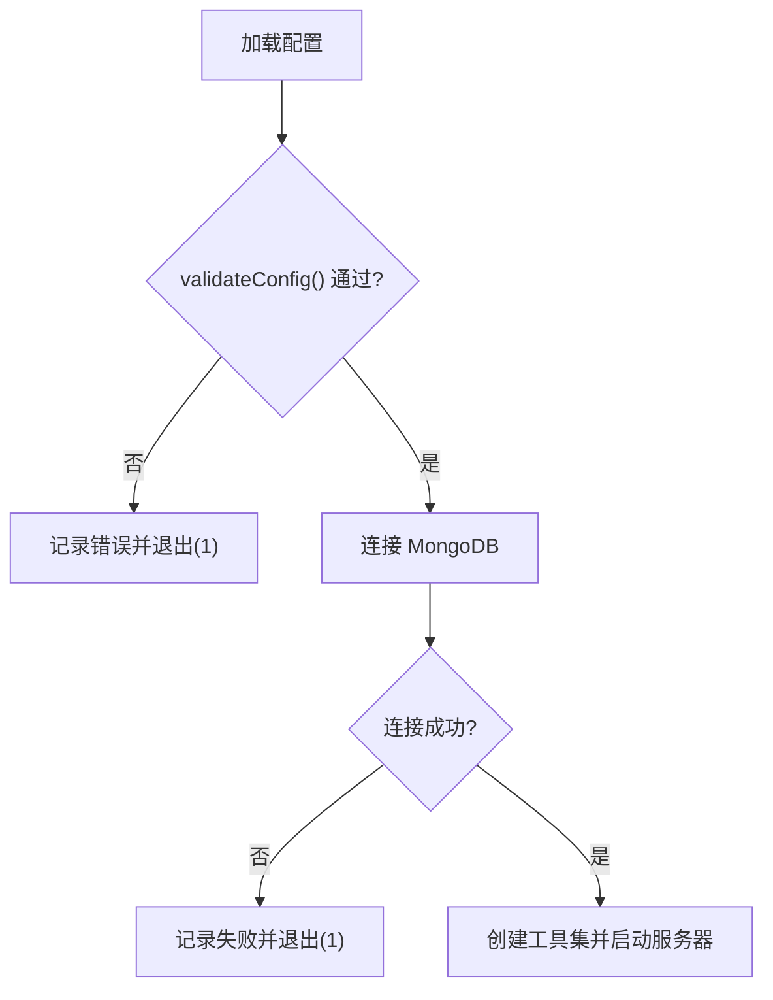
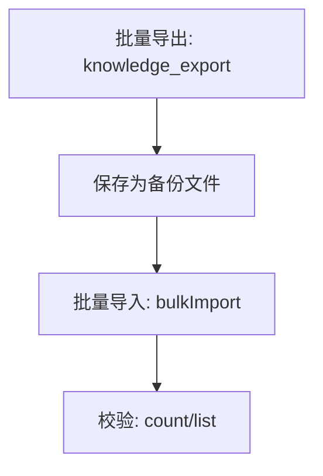
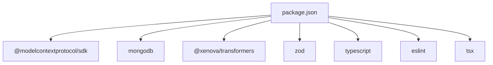

# MCP 配置管理 (MCPs)

<cite>
**本文引用的文件**
- [examples/mcp-config.json](file://examples/mcp-config.json)
- [src/utils/config.ts](file://src/utils/config.ts)
- [src/types.ts](file://src/types.ts)
- [src/index.ts](file://src/index.ts)
- [src/services/knowledge-service.ts](file://src/services/knowledge-service.ts)
- [src/tools/knowledge-tools.ts](file://src/tools/knowledge-tools.ts)
- [src/services/embedding-service.ts](file://src/services/embedding-service.ts)
- [sync-data.mjs](file://sync-data.mjs)
- [package.json](file://package.json)
</cite>

## 目录
1. [简介](#简介)
2. [项目结构](#项目结构)
3. [核心组件](#核心组件)
4. [架构总览](#架构总览)
5. [详细组件分析](#详细组件分析)
6. [依赖关系分析](#依赖关系分析)
7. [性能考虑](#性能考虑)
8. [故障排除指南](#故障排除指南)
9. [结论](#结论)
10. [附录](#附录)

## 简介
本文件系统化阐述 MCP 配置管理系统的设计与实现，重点围绕“MCPs”知识类型的配置管理能力，涵盖 MCP 服务器连接、工具注册、权限控制、配置验证、连接测试、故障排除、多服务器配置与负载均衡、配置备份与迁移以及与 IDE 的集成同步机制。文档以代码为依据，结合可视化图示帮助读者快速理解并正确使用该系统。

## 项目结构
该项目采用分层与按功能域划分的组织方式：
- 核心入口与协议适配：src/index.ts
- 配置解析与日志：src/utils/config.ts
- 类型定义与知识库文档模型：src/types.ts
- 知识库服务与数据库交互：src/services/knowledge-service.ts
- 向量嵌入服务：src/services/embedding-service.ts
- MCP 工具集：src/tools/knowledge-tools.ts
- 示例配置：examples/mcp-config.json
- 同步脚本：sync-data.mjs
- 包与依赖：package.json

**图表来源**
- [src/index.ts](file://src/index.ts#L1-L148)
- [src/utils/config.ts](file://src/utils/config.ts#L1-L147)
- [src/services/knowledge-service.ts](file://src/services/knowledge-service.ts#L1-L404)
- [src/tools/knowledge-tools.ts](file://src/tools/knowledge-tools.ts#L1-L1093)
- [src/services/embedding-service.ts](file://src/services/embedding-service.ts#L1-L148)
- [examples/mcp-config.json](file://examples/mcp-config.json#L1-L94)
- [sync-data.mjs](file://sync-data.mjs#L1-L306)
- [package.json](file://package.json#L1-L48)

**章节来源**
- [src/index.ts](file://src/index.ts#L1-L148)
- [package.json](file://package.json#L1-L48)

## 核心组件
- 配置加载与校验：从环境变量加载 MCP 服务器配置，进行有效性校验与日志级别控制。
- 知识库服务：封装 MongoDB 连接、索引、CRUD、批量导入导出、语义搜索与嵌入生成。
- MCP 工具集：提供知识库 CRUD、快捷工具（记忆、经验、命令、上下文）、MCP/规则/技能/工作流同步、用户信息查询、导出、语义搜索与嵌入生成等工具。
- 嵌入服务：基于 Transformers.js 的文本向量化与相似度计算，支持懒加载与批量处理。
- 示例配置：覆盖多种 IDE 的 MCP 服务器配置示例，便于快速集成。

**章节来源**
- [src/utils/config.ts](file://src/utils/config.ts#L76-L146)
- [src/services/knowledge-service.ts](file://src/services/knowledge-service.ts#L20-L403)
- [src/tools/knowledge-tools.ts](file://src/tools/knowledge-tools.ts#L29-L1092)
- [src/services/embedding-service.ts](file://src/services/embedding-service.ts#L11-L147)
- [examples/mcp-config.json](file://examples/mcp-config.json#L1-L94)

## 架构总览
系统以 MCP 协议为基础，通过 STDIO 传输与 MCP 客户端通信；内部通过知识库服务与 MongoDB 交互，支持多类型知识文档统一管理，其中 MCPs 类型承载 MCP 服务器的命令、参数与环境变量等配置信息。

**图表来源**
- [src/index.ts](file://src/index.ts#L87-L145)
- [src/utils/config.ts](file://src/utils/config.ts#L76-L91)
- [src/services/knowledge-service.ts](file://src/services/knowledge-service.ts#L44-L54)
- [src/tools/knowledge-tools.ts](file://src/tools/knowledge-tools.ts#L29-L32)

## 详细组件分析

### 配置管理与加载
- 配置来源与优先级：客户端传入 env > 系统环境变量 > 默认值。
- 关键字段：
  - 连接参数：MONGO_URI、MONGO_DATABASE、MONGO_COLLECTION
  - 用户与设备：USER_ID、DEVICE_ID、IDE_SOURCE
  - 行为开关：ENABLE_EMBEDDING、LOG_LEVEL
- 校验规则：MONGO_URI、MONGO_DATABASE、MONGO_COLLECTION 必填。
- 日志级别：debug/info/warn/error，按级别输出。

**图表来源**
- [src/utils/config.ts](file://src/utils/config.ts#L76-L115)
- [src/utils/config.ts](file://src/utils/config.ts#L120-L146)

**章节来源**
- [src/utils/config.ts](file://src/utils/config.ts#L76-L146)

### 知识库服务与 MCPs 文档模型
- 用户上下文：userId/deviceId/ideSource，用于跨终端同步与隔离。
- 索引设计：唯一索引（userId,type,name）、复合查询索引、标签与时间排序索引。
- MCPs 文档结构：type='MCPs'，包含 command、args、env、tools 等字段，便于 MCP 服务器注册与调用。
- 工具注册：根据 enableEmbedding 动态注入语义搜索与嵌入生成工具。

**图表来源**
- [src/services/knowledge-service.ts](file://src/services/knowledge-service.ts#L20-L403)
- [src/services/embedding-service.ts](file://src/services/embedding-service.ts#L11-L147)

**章节来源**
- [src/services/knowledge-service.ts](file://src/services/knowledge-service.ts#L20-L403)
- [src/types.ts](file://src/types.ts#L94-L104)

### MCP 工具集与 MCPs 同步
- 工具清单：通用 CRUD、快捷工具、MCP/规则/技能/工作流同步、用户信息查询、导出、语义搜索与嵌入生成。
- MCPs 同步工具：将 MCP 服务器的 command、args、env、tools 等信息写入知识库，作为 MCP 配置的持久化载体。
- 权限控制：通过用户上下文（userId/deviceId/ideSource）实现用户隔离与跨设备同步。

**图表来源**
- [src/tools/knowledge-tools.ts](file://src/tools/knowledge-tools.ts#L696-L758)
- [src/services/knowledge-service.ts](file://src/services/knowledge-service.ts#L384-L402)

**章节来源**
- [src/tools/knowledge-tools.ts](file://src/tools/knowledge-tools.ts#L696-L758)
- [src/services/knowledge-service.ts](file://src/services/knowledge-service.ts#L384-L402)

### IDE 集成与配置示例
- 多 IDE 支持：Qoder、Cursor、VS Code、手动本地开发、共享云数据库等。
- 配置要点：command、args、env（含 MONGO_URI、MONGO_DATABASE、USER_ID、DEVICE_ID、IDE_SOURCE、ENABLE_EMBEDDING、LOG_LEVEL 等）。
- 本地开发与云数据库示例展示了不同部署形态下的配置差异。

**图表来源**
- [examples/mcp-config.json](file://examples/mcp-config.json#L5-L92)

**章节来源**
- [examples/mcp-config.json](file://examples/mcp-config.json#L1-L94)

### 配置验证、连接测试与故障排除
- 配置验证：检查必填字段（MONGO_URI/MONGO_DATABASE/MONGO_COLLECTION），返回错误列表。
- 连接测试：启动时尝试连接 MongoDB，成功后打印数据库与用户信息。
- 故障排除：
  - 配置无效：查看日志中的错误明细并修正必填字段。
  - 连接失败：确认 MONGO_URI 可达、凭据正确、网络策略允许。
  - 工具调用异常：检查工具输入模式与参数，关注返回的错误信息。

**图表来源**
- [src/index.ts](file://src/index.ts#L87-L145)
- [src/utils/config.ts](file://src/utils/config.ts#L96-L115)

**章节来源**
- [src/index.ts](file://src/index.ts#L87-L145)
- [src/utils/config.ts](file://src/utils/config.ts#L96-L115)

### 多服务器配置与负载均衡
- 多服务器：通过不同 IDE 配置文件中的 mcpServers 字段定义多个 MCP 服务器实例。
- 负载均衡：建议在客户端侧对多个 MCP 服务器进行轮询或基于健康检查的路由；本仓库未内置负载均衡逻辑，推荐由上层 MCP 客户端实现。
- 跨设备同步：通过统一的 USER_ID/DEVICE_ID/IDE_SOURCE 实现跨设备一致的知识库视图。

**章节来源**
- [examples/mcp-config.json](file://examples/mcp-config.json#L5-L92)
- [src/services/knowledge-service.ts](file://src/services/knowledge-service.ts#L92-L106)

### 配置备份与迁移最佳实践
- 备份：使用批量导出工具导出知识库数据，包含 MCPs 在内的所有类型。
- 迁移：通过批量导入工具将备份数据恢复到目标数据库；注意用户上下文与索引的一致性。
- 同步脚本：提供了一个完整的数据同步示例，展示如何将记忆、规则、MCP 配置写入数据库并维护唯一索引与同步版本。

**图表来源**
- [src/tools/knowledge-tools.ts](file://src/tools/knowledge-tools.ts#L972-L996)
- [src/services/knowledge-service.ts](file://src/services/knowledge-service.ts#L244-L267)
- [sync-data.mjs](file://sync-data.mjs#L158-L303)

**章节来源**
- [src/tools/knowledge-tools.ts](file://src/tools/knowledge-tools.ts#L972-L996)
- [src/services/knowledge-service.ts](file://src/services/knowledge-service.ts#L244-L267)
- [sync-data.mjs](file://sync-data.mjs#L158-L303)

### 与 IDE 集成的同步机制
- 用户上下文：每个文档携带 userId/deviceId/ideSource，确保跨 IDE 与跨设备一致的视图。
- 同步版本：每次更新会递增 syncVersion，便于追踪变更。
- 自动同步：可通过规则或外部脚本触发 MCP/记忆/规则的同步，保持知识库实时性。

**章节来源**
- [src/types.ts](file://src/types.ts#L48-L51)
- [src/services/knowledge-service.ts](file://src/services/knowledge-service.ts#L162-L176)

## 依赖关系分析
- 运行时依赖：@modelcontextprotocol/sdk（MCP 协议）、mongodb（数据库驱动）、@xenova/transformers（嵌入）、zod（数据验证）。
- 开发依赖：TypeScript、ESLint、tsx（热重载）。
- 入口与打包：bin 指向 dist/index.js，支持 build/start/dev/lint/typecheck。

**图表来源**
- [package.json](file://package.json#L30-L46)

**章节来源**
- [package.json](file://package.json#L1-L48)

## 性能考虑
- 嵌入生成：使用 Transformers.js 懒加载模型，避免冷启动开销；支持批量嵌入生成。
- 查询优化：为用户维度建立复合索引，提升查询与排序性能。
- 语义搜索：基于余弦相似度，支持阈值与数量限制，避免全表扫描。
- 日志级别：通过 LOG_LEVEL 控制输出，生产环境建议使用 info/warn/error。

[本节为通用指导，无需特定文件引用]

## 故障排除指南
- 配置错误：检查 MONGO_URI/MONGO_DATABASE/MONGO_COLLECTION 是否正确，查看日志中的错误列表。
- 连接失败：确认 MongoDB 地址可达、认证信息正确、防火墙策略允许。
- 工具调用失败：核对工具输入模式与参数，关注返回的错误信息；必要时开启 debug 日志。
- 嵌入服务初始化慢：首次加载模型需要时间，可在应用启动阶段预热。

**章节来源**
- [src/utils/config.ts](file://src/utils/config.ts#L96-L115)
- [src/index.ts](file://src/index.ts#L141-L144)
- [src/services/embedding-service.ts](file://src/services/embedding-service.ts#L24-L51)

## 结论
本系统以 MCP 协议为核心，结合 MongoDB 实现了跨 IDE、跨设备的 MCP 配置与知识库统一管理。通过严格的配置校验、完善的工具集与嵌入能力，满足了 MCP 配置的创建、更新、验证与同步需求。配合示例配置与同步脚本，可快速落地到多种 IDE 环境，并支持备份迁移与扩展。

[本节为总结，无需特定文件引用]

## 附录

### MCP 配置文档结构说明
- 服务器地址与认证：MONGO_URI、MONGO_DATABASE、MONGO_COLLECTION
- 用户与设备：USER_ID、DEVICE_ID、IDE_SOURCE
- 行为开关：ENABLE_EMBEDDING、LOG_LEVEL
- MCP 服务器元信息：command、args、env（包含 MCP 服务器运行所需的环境变量）

**章节来源**
- [examples/mcp-config.json](file://examples/mcp-config.json#L5-L92)
- [src/utils/config.ts](file://src/utils/config.ts#L76-L91)

### MCP 配置创建与更新流程
- 创建：使用 knowledge_create 工具，指定 type='MCPs' 与必要字段。
- 更新：使用 knowledge_update 或 knowledge_upsert，支持增量更新与存在即更新。
- 验证：通过 validateConfig() 与连接测试确保配置有效。
- 同步：通过 mcp_sync 工具将 MCP 服务器配置写入知识库。

**章节来源**
- [src/tools/knowledge-tools.ts](file://src/tools/knowledge-tools.ts#L36-L107)
- [src/tools/knowledge-tools.ts](file://src/tools/knowledge-tools.ts#L157-L215)
- [src/tools/knowledge-tools.ts](file://src/tools/knowledge-tools.ts#L336-L399)
- [src/tools/knowledge-tools.ts](file://src/tools/knowledge-tools.ts#L696-L758)
- [src/utils/config.ts](file://src/utils/config.ts#L96-L115)
- [src/index.ts](file://src/index.ts#L116-L128)