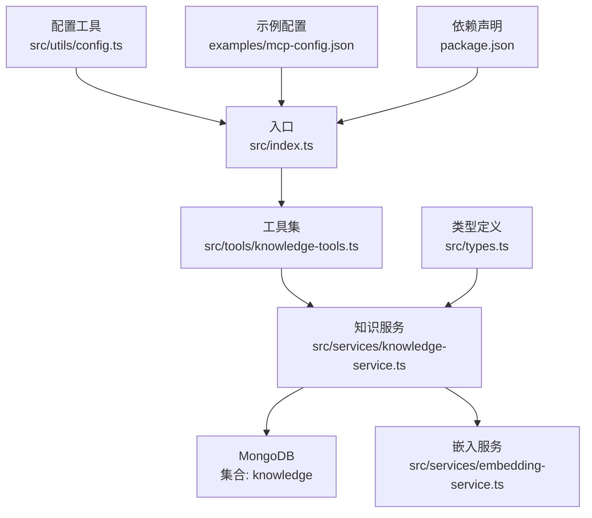
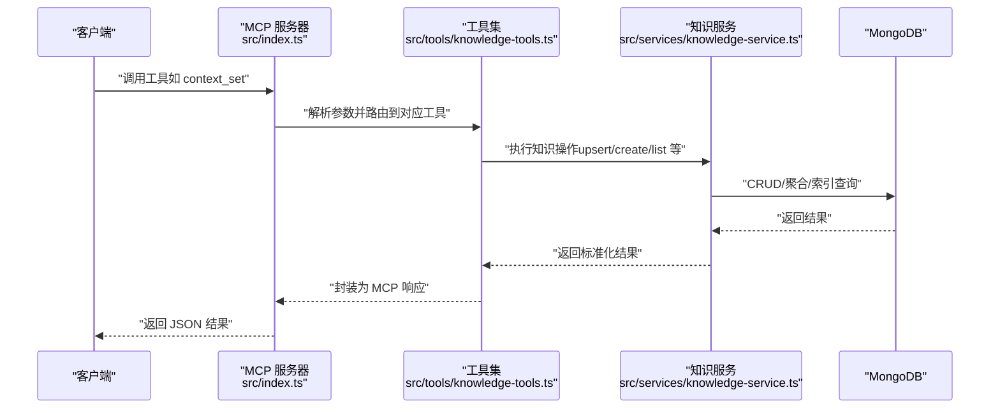
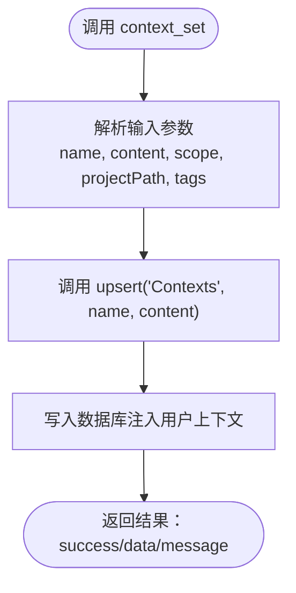
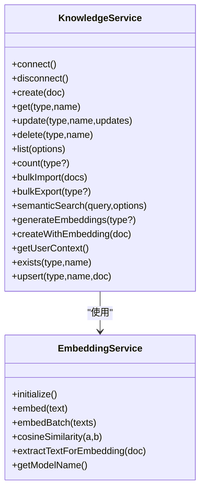
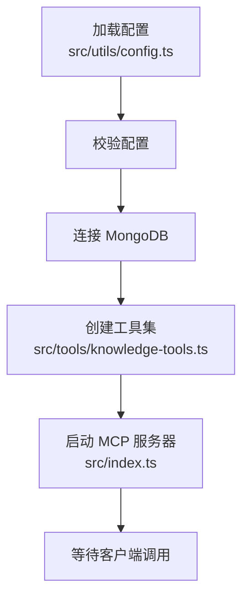
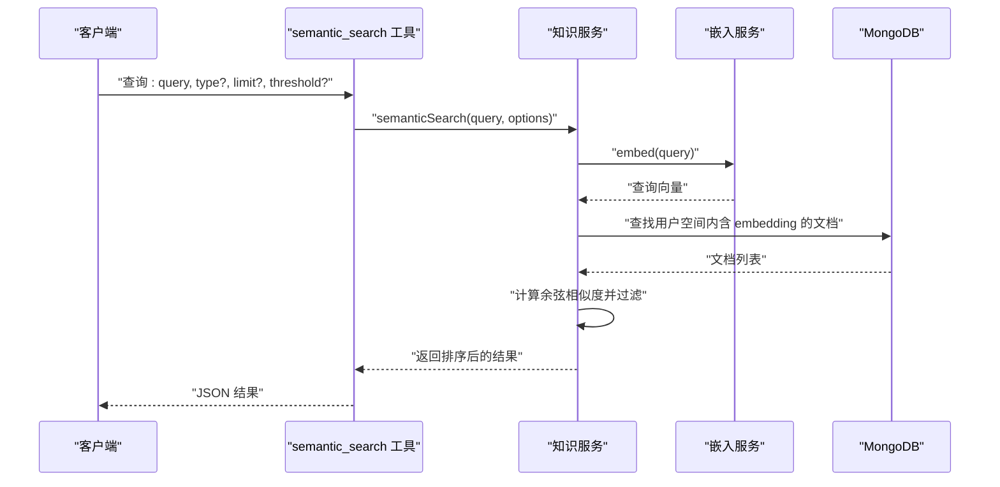
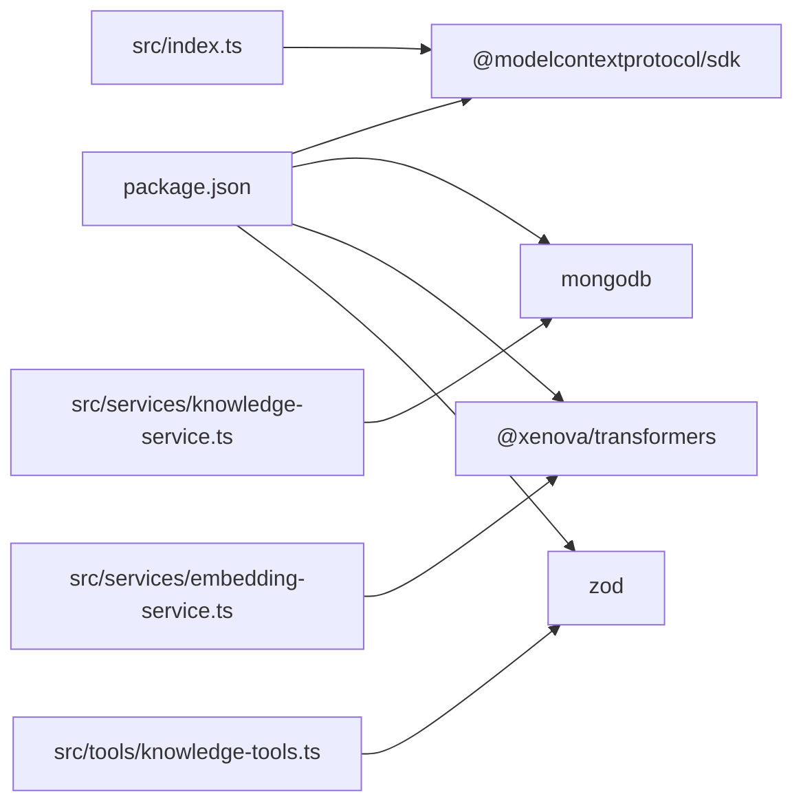

# 上下文管理（Contexts）

<cite>
**本文引用的文件**
- [src/index.ts](file://src/index.ts)
- [src/types.ts](file://src/types.ts)
- [src/services/knowledge-service.ts](file://src/services/knowledge-service.ts)
- [src/tools/knowledge-tools.ts](file://src/tools/knowledge-tools.ts)
- [src/utils/config.ts](file://src/utils/config.ts)
- [src/services/embedding-service.ts](file://src/services/embedding-service.ts)
- [package.json](file://package.json)
- [examples/mcp-config.json](file://examples/mcp-config.json)
</cite>

## 目录
1. [简介](#简介)
2. [项目结构](#项目结构)
3. [核心组件](#核心组件)
4. [架构总览](#架构总览)
5. [详细组件分析](#详细组件分析)
6. [依赖关系分析](#依赖关系分析)
7. [性能考量](#性能考量)
8. [故障排查指南](#故障排查指南)
9. [结论](#结论)
10. [附录](#附录)

## 简介
本文件系统化阐述“上下文管理（Contexts）”在知识库系统中的设计与实现，重点说明 Contexts 知识类型的重要性、应用场景、文档结构、创建与维护流程、与知识检索的关系，以及在 AI 辅助开发中的应用与最佳实践。该系统以 MongoDB 作为持久化存储，通过 MCP（Model Context Protocol）工具接口对外提供统一的知识管理能力，并支持跨 IDE、跨设备的用户隔离与同步。

## 项目结构
项目采用分层与按功能模块划分的组织方式：
- 入口与协议适配：src/index.ts 负责启动 MCP 服务器、注册工具、建立 stdio 传输通道
- 类型定义：src/types.ts 定义了 8 种知识类型及通用字段，其中 Contexts 为上下文类型
- 服务层：src/services/knowledge-service.ts 实现知识库 CRUD、统计、批量导入导出、语义搜索与嵌入生成
- 工具层：src/tools/knowledge-tools.ts 将服务封装为 MCP 工具，提供统一调用入口
- 配置与日志：src/utils/config.ts 负责从环境变量加载配置、校验与日志输出
- 嵌入服务：src/services/embedding-service.ts 使用 Transformers.js 生成文本向量，支持余弦相似度计算
- 示例配置：examples/mcp-config.json 展示多 IDE 的集成方式
- 构建与依赖：package.json 定义运行时依赖与脚本

图表来源
- [src/index.ts](file://src/index.ts#L1-L148)
- [src/tools/knowledge-tools.ts](file://src/tools/knowledge-tools.ts#L1-L1093)
- [src/services/knowledge-service.ts](file://src/services/knowledge-service.ts#L1-L404)
- [src/services/embedding-service.ts](file://src/services/embedding-service.ts#L1-L148)
- [src/utils/config.ts](file://src/utils/config.ts#L1-L147)
- [src/types.ts](file://src/types.ts#L1-L269)
- [examples/mcp-config.json](file://examples/mcp-config.json#L1-L94)
- [package.json](file://package.json#L1-L48)

章节来源
- [src/index.ts](file://src/index.ts#L1-L148)
- [src/types.ts](file://src/types.ts#L1-L269)
- [src/services/knowledge-service.ts](file://src/services/knowledge-service.ts#L1-L404)
- [src/tools/knowledge-tools.ts](file://src/tools/knowledge-tools.ts#L1-L1093)
- [src/utils/config.ts](file://src/utils/config.ts#L1-L147)
- [src/services/embedding-service.ts](file://src/services/embedding-service.ts#L1-L148)
- [examples/mcp-config.json](file://examples/mcp-config.json#L1-L94)
- [package.json](file://package.json#L1-L48)

## 核心组件
- 知识类型与上下文文档
  - Contexts 类型用于存储项目背景、领域知识、团队信息、业务领域等上下文信息
  - Context 文档结构包含：上下文名称、领域描述、相关技术、团队成员、项目状态、范围（项目/领域/全局）、有效期、参考资料链接等
- 知识服务（KnowledgeService）
  - 提供创建、读取、更新、删除、列表、统计、批量导入导出、语义搜索、嵌入生成等能力
  - 支持用户隔离与跨设备同步（通过 userId/deviceId/ideSource）
- 工具集（MCP Tools）
  - 将知识服务封装为 MCP 工具，包括通用 CRUD、统计、upsert、快捷工具（记忆、经验、命令、上下文设置、MCP/规则/技能/工作流同步）、导出、语义搜索与嵌入生成等
- 嵌入服务（EmbeddingService）
  - 使用 Transformers.js 模型生成文本向量，支持余弦相似度计算，用于语义搜索
- 配置工具（Config）
  - 从环境变量加载配置，支持 IDE 来源、日志级别、是否启用嵌入等

章节来源
- [src/types.ts](file://src/types.ts#L176-L190)
- [src/services/knowledge-service.ts](file://src/services/knowledge-service.ts#L20-L404)
- [src/tools/knowledge-tools.ts](file://src/tools/knowledge-tools.ts#L637-L694)
- [src/services/embedding-service.ts](file://src/services/embedding-service.ts#L1-L148)
- [src/utils/config.ts](file://src/utils/config.ts#L1-L147)

## 架构总览
系统通过 MCP 协议暴露一组工具，客户端（IDE 或其他 MCP 客户端）可调用这些工具进行知识管理。核心流程如下：
- 启动 MCP 服务器，加载配置，连接 MongoDB
- 注册工具集（含通用 CRUD、快捷工具、导出、语义搜索与嵌入生成）
- 处理客户端请求，调用知识服务执行相应操作
- 若启用嵌入，使用嵌入服务生成向量并参与语义搜索

图表来源
- [src/index.ts](file://src/index.ts#L16-L82)
- [src/tools/knowledge-tools.ts](file://src/tools/knowledge-tools.ts#L637-L694)
- [src/services/knowledge-service.ts](file://src/services/knowledge-service.ts#L111-L190)

章节来源
- [src/index.ts](file://src/index.ts#L1-L148)
- [src/tools/knowledge-tools.ts](file://src/tools/knowledge-tools.ts#L1-L1093)
- [src/services/knowledge-service.ts](file://src/services/knowledge-service.ts#L1-L404)

## 详细组件分析

### 上下文文档结构与用途
- 文档类型：Contexts
- 关键字段
  - 基础字段：名称、描述、内容、标签、启用状态、时间戳、来源信息、向量嵌入等
  - 上下文特有：范围（项目/领域/全局）、关联项目路径、有效期、参考资料链接
- 应用场景
  - 项目背景：记录项目目标、技术栈、关键决策、里程碑等
  - 领域知识：沉淀业务术语、流程规范、最佳实践
  - 团队信息：团队成员角色、联系方式、职责分工
  - 业务领域：行业背景、竞品分析、合规要求、风险控制
- 价值
  - 降低沟通成本，提升协作效率
  - 支持 AI 辅助开发，提供高质量提示词与上下文
  - 便于跨设备/跨 IDE 同步与复用

章节来源
- [src/types.ts](file://src/types.ts#L176-L190)

### 上下文工具：context_set
- 工具名称：context_set
- 输入参数：名称、内容、范围（project/domain/global）、项目路径（可选）、标签（可选）
- 行为：通过 upsert 将上下文写入数据库，内容以 JSON 结构存储（text、scope、projectPath），描述为范围说明，标签默认使用范围值
- 输出：成功/失败消息与文档标识

图表来源
- [src/tools/knowledge-tools.ts](file://src/tools/knowledge-tools.ts#L637-L694)
- [src/services/knowledge-service.ts](file://src/services/knowledge-service.ts#L384-L402)

章节来源
- [src/tools/knowledge-tools.ts](file://src/tools/knowledge-tools.ts#L637-L694)
- [src/services/knowledge-service.ts](file://src/services/knowledge-service.ts#L384-L402)

### 知识服务：CRUD 与查询
- 创建/更新/删除/读取：基于用户过滤器（userId）与类型+名称唯一约束
- 列表与搜索：支持按类型、标签、启用状态、关键词搜索；支持分页与排序
- 统计：按类型统计文档数量
- 批量：批量导入/导出
- 嵌入：为文档生成向量嵌入，支持批量生成与语义搜索

图表来源
- [src/services/knowledge-service.ts](file://src/services/knowledge-service.ts#L20-L404)
- [src/services/embedding-service.ts](file://src/services/embedding-service.ts#L1-L148)

章节来源
- [src/services/knowledge-service.ts](file://src/services/knowledge-service.ts#L1-L404)
- [src/services/embedding-service.ts](file://src/services/embedding-service.ts#L1-L148)

### 配置与启动流程
- 配置加载：从环境变量解析 MONGO_URI、数据库、集合、用户ID、设备ID、IDE 来源、是否启用嵌入、日志级别
- 校验：确保必要配置有效
- 启动：连接 MongoDB，创建工具集（含语义搜索与嵌入生成工具），建立 stdio 传输并监听信号优雅退出
- IDE 集成：examples/mcp-config.json 展示了多 IDE 的配置方式，支持本地开发与云端共享

图表来源
- [src/utils/config.ts](file://src/utils/config.ts#L76-L115)
- [src/index.ts](file://src/index.ts#L87-L145)
- [examples/mcp-config.json](file://examples/mcp-config.json#L1-L94)

章节来源
- [src/utils/config.ts](file://src/utils/config.ts#L1-L147)
- [src/index.ts](file://src/index.ts#L1-L148)
- [examples/mcp-config.json](file://examples/mcp-config.json#L1-L94)

### 语义搜索与上下文相关性
- 语义搜索流程：对查询文本生成向量，遍历用户空间内具备 embedding 字段的文档，计算余弦相似度，按阈值与数量筛选
- 上下文与检索：上下文文档通常包含领域描述、技术栈、团队信息等高价值文本，适合生成嵌入参与语义搜索，提升检索质量
- 性能建议：仅对必要类型生成嵌入；合理设置阈值与返回数量

图表来源
- [src/tools/knowledge-tools.ts](file://src/tools/knowledge-tools.ts#L1002-L1056)
- [src/services/knowledge-service.ts](file://src/services/knowledge-service.ts#L272-L299)
- [src/services/embedding-service.ts](file://src/services/embedding-service.ts#L56-L104)

章节来源
- [src/tools/knowledge-tools.ts](file://src/tools/knowledge-tools.ts#L1002-L1056)
- [src/services/knowledge-service.ts](file://src/services/knowledge-service.ts#L272-L299)
- [src/services/embedding-service.ts](file://src/services/embedding-service.ts#L1-L148)

### 上下文创建与维护流程
- 创建
  - 使用 context_set 工具设置上下文名称、内容、范围、项目路径与标签
  - 服务层通过 upsert 自动判断创建或更新
- 维护
  - 定期更新有效期与参考资料链接
  - 通过标签与描述优化检索效果
  - 在团队内部共享与同步（基于用户/设备维度）
- 分类与标签体系
  - 范围：project（项目）、domain（领域）、global（全局）
  - 标签：按技术栈、业务线、阶段等维度打标
- 更新频率
  - 重大变更即时更新
  - 季度/月度回顾与优化

章节来源
- [src/tools/knowledge-tools.ts](file://src/tools/knowledge-tools.ts#L637-L694)
- [src/services/knowledge-service.ts](file://src/services/knowledge-service.ts#L384-L402)

### 上下文组织与导航策略
- 组织
  - 按范围分层：global -> domain -> project，便于优先级与可见性控制
  - 按标签聚合：技术栈、业务线、阶段等标签辅助检索
- 导航
  - 通过 list/search 按类型与关键词筛选
  - 使用 semantic_search 结合领域描述与技术要点
  - 通过 references 快速跳转到外部资料

章节来源
- [src/services/knowledge-service.ts](file://src/services/knowledge-service.ts#L195-L216)
- [src/tools/knowledge-tools.ts](file://src/tools/knowledge-tools.ts#L1002-L1056)

### AI 辅助开发中的应用与最佳实践
- 应用方式
  - 在编写代码、生成文档、制定方案时，结合上下文提供背景信息与约束
  - 使用 semantic_search 从上下文中召回相关知识，减少重复劳动
- 最佳实践
  - 明确上下文范围，避免信息过宽导致噪声
  - 保持内容简洁、结构化，便于嵌入与检索
  - 定期清理过期上下文，更新参考资料链接
  - 在团队内约定标签规范与命名约定

章节来源
- [src/services/knowledge-service.ts](file://src/services/knowledge-service.ts#L272-L299)
- [src/tools/knowledge-tools.ts](file://src/tools/knowledge-tools.ts#L637-L694)

## 依赖关系分析
- 运行时依赖
  - @modelcontextprotocol/sdk：MCP 协议 SDK
  - mongodb：MongoDB 官方驱动
  - @xenova/transformers：文本嵌入模型与特征提取
  - zod：类型验证（在工具层用于输入校验）
- 开发依赖
  - TypeScript、ESLint、TSX 等

图表来源
- [package.json](file://package.json#L30-L43)
- [src/index.ts](file://src/index.ts#L3-L11)
- [src/tools/knowledge-tools.ts](file://src/tools/knowledge-tools.ts#L1-L16)
- [src/services/knowledge-service.ts](file://src/services/knowledge-service.ts#L1-L4)
- [src/services/embedding-service.ts](file://src/services/embedding-service.ts#L1-L6)

章节来源
- [package.json](file://package.json#L1-L48)
- [src/index.ts](file://src/index.ts#L1-L148)
- [src/tools/knowledge-tools.ts](file://src/tools/knowledge-tools.ts#L1-L1093)
- [src/services/knowledge-service.ts](file://src/services/knowledge-service.ts#L1-L404)
- [src/services/embedding-service.ts](file://src/services/embedding-service.ts#L1-L148)

## 性能考量
- 嵌入生成
  - 批量生成时注意并发与内存占用，建议按类型分批处理
  - 控制嵌入文本长度，避免超长内容影响性能
- 查询与索引
  - 利用用户过滤与复合索引（用户+类型、用户+标签、用户+时间）提升查询效率
  - 语义搜索仅对含 embedding 的文档生效，建议按需生成
- 日志与资源
  - 合理设置日志级别，避免高频 IO 影响性能
  - 嵌入模型初始化为懒加载，首次使用会有冷启动开销

章节来源
- [src/services/knowledge-service.ts](file://src/services/knowledge-service.ts#L71-L87)
- [src/services/embedding-service.ts](file://src/services/embedding-service.ts#L24-L51)

## 故障排查指南
- 启动失败
  - 检查 MONGO_URI、数据库与集合配置是否正确
  - 查看日志级别与错误输出，确认连接异常
- 工具调用失败
  - 确认工具名称与参数格式是否符合 inputSchema
  - 检查权限与网络连通性（若使用远程数据库）
- 嵌入相关问题
  - 确认 ENABLE_EMBEDDING 已启用
  - 检查文档是否已生成 embedding，或尝试重新生成
- 同步与跨设备
  - 确认 userId/deviceId/ideSource 一致或按预期隔离
  - 检查 syncVersion 是否递增

章节来源
- [src/utils/config.ts](file://src/utils/config.ts#L96-L115)
- [src/tools/knowledge-tools.ts](file://src/tools/knowledge-tools.ts#L72-L106)
- [src/services/knowledge-service.ts](file://src/services/knowledge-service.ts#L304-L341)
- [src/index.ts](file://src/index.ts#L87-L145)

## 结论
上下文管理（Contexts）是知识库系统中支撑 AI 辅助开发的关键能力。通过明确的文档结构、完善的工具链与嵌入检索能力，系统能够高效地组织、共享与复用项目背景、领域知识与团队信息。建议在团队内建立统一的上下文分类与标签规范，定期维护与更新，以最大化其在开发过程中的价值。

## 附录
- IDE 集成参考：examples/mcp-config.json 展示了多 IDE 的配置方式，便于快速接入
- 版本与依赖：package.json 提供了完整的依赖与脚本信息，便于构建与运行

章节来源
- [examples/mcp-config.json](file://examples/mcp-config.json#L1-L94)
- [package.json](file://package.json#L1-L48)