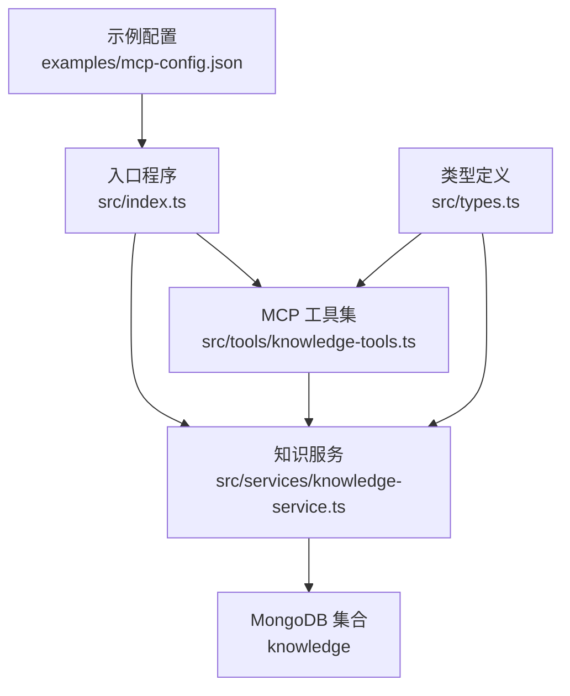
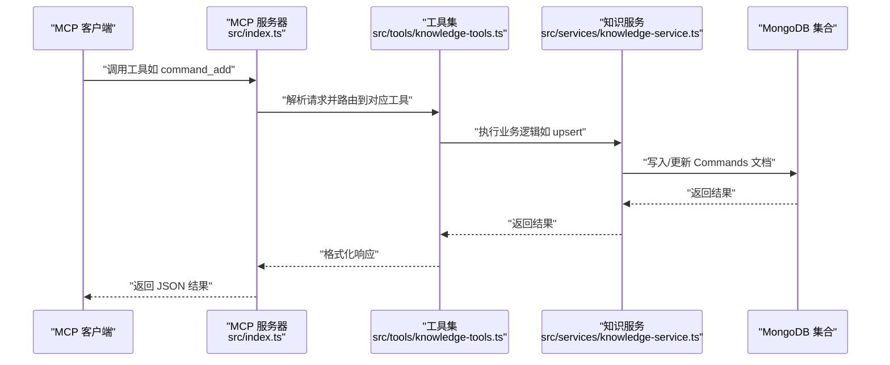
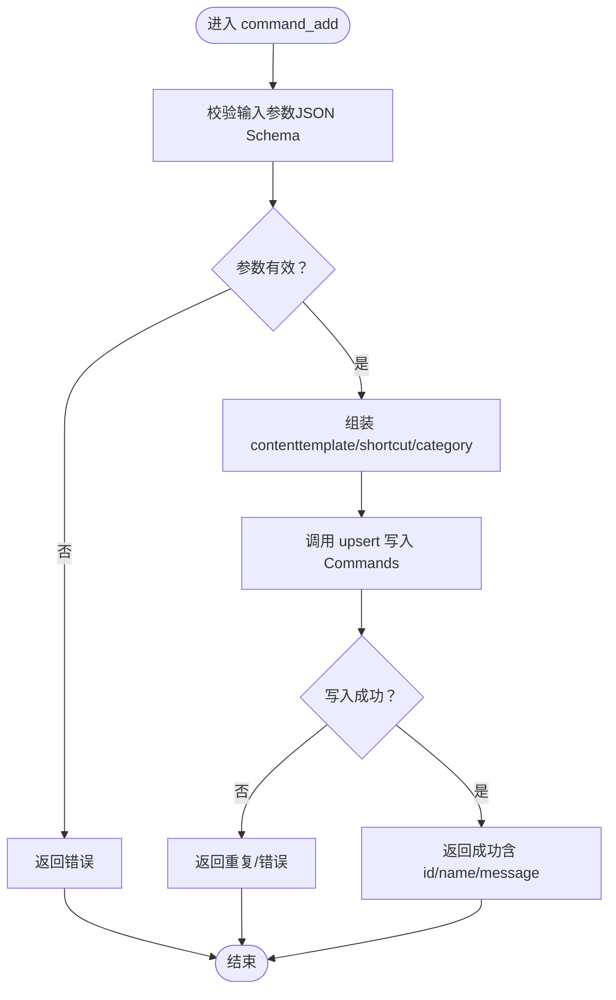
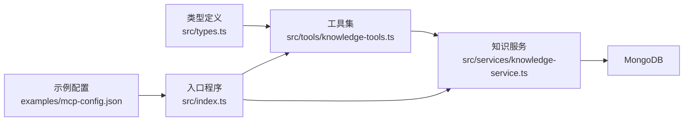

# 命令管理（Commands）

<cite>
**本文引用的文件**
- [src/types.ts](file://src/types.ts)
- [src/index.ts](file://src/index.ts)
- [src/services/knowledge-service.ts](file://src/services/knowledge-service.ts)
- [src/tools/knowledge-tools.ts](file://src/tools/knowledge-tools.ts)
- [examples/mcp-config.json](file://examples/mcp-config.json)
- [package.json](file://package.json)
</cite>

## 目录
1. [简介](#简介)
2. [项目结构](#项目结构)
3. [核心组件](#核心组件)
4. [架构总览](#架构总览)
5. [详细组件分析](#详细组件分析)
6. [依赖关系分析](#依赖关系分析)
7. [性能考虑](#性能考虑)
8. [故障排查指南](#故障排查指南)
9. [结论](#结论)
10. [附录](#附录)

## 简介
本文件系统性地文档化“命令管理（Commands）”知识类型的定义、结构、创建与执行流程，以及与工作流（Workflows）的集成方式。命令管理旨在提供统一的“快捷命令/模板”能力，支持：
- 快捷命令：以模板形式定义可复用的命令片段，便于在不同 IDE 或 MCP 客户端中一键调用
- 自动化脚本：通过模板参数化，结合上下文与工作流实现批量操作
- 批量操作：通过命令模板与参数化，配合工作流步骤实现多步骤自动化

命令文档的核心字段包括：命令名称、模板、参数定义、分类、快捷别名等；同时支持与上下文、工作流、MCP 配置协同，形成从“知识沉淀—模板化—执行—反馈”的闭环。

## 项目结构
该仓库采用分层与按类型组织的结构：
- 入口与协议适配：入口程序负责启动 MCP 服务器并通过 STDIO 与客户端通信
- 知识服务：封装 MongoDB 的 CRUD、查询、统计、嵌入生成与语义检索等能力
- 工具集：将知识服务暴露为 MCP 工具，覆盖 Commands、Skills、Rules、MCPs、Contexts、Workflows 等知识类型
- 类型定义：集中定义知识文档类型、字段与请求/响应结构
- 示例配置：展示如何在不同 IDE 中配置 mongo-mcp

图表来源
- [src/index.ts](file://src/index.ts#L1-L148)
- [src/services/knowledge-service.ts](file://src/services/knowledge-service.ts#L1-L404)
- [src/tools/knowledge-tools.ts](file://src/tools/knowledge-tools.ts#L1-L1093)
- [src/types.ts](file://src/types.ts#L1-L269)
- [examples/mcp-config.json](file://examples/mcp-config.json#L1-L94)

章节来源
- [src/index.ts](file://src/index.ts#L1-L148)
- [src/services/knowledge-service.ts](file://src/services/knowledge-service.ts#L1-L404)
- [src/tools/knowledge-tools.ts](file://src/tools/knowledge-tools.ts#L1-L1093)
- [src/types.ts](file://src/types.ts#L1-L269)
- [examples/mcp-config.json](file://examples/mcp-config.json#L1-L94)

## 核心组件
- 命令文档类型（CommandDocument）
  - 类型标识：type = 'Commands'
  - 关键字段：template（命令模板）、parameters（参数定义数组）、category（分类）、shortcut（快捷别名）
  - 其他通用字段：name、content、description、tags、enabled、userId/deviceId/ideSource、时间戳、嵌入等
- 命令工具（command_add）
  - 输入参数：name、template、description、shortcut、category、tags
  - 行为：将 template、shortcut、category 封装到 content，并通过 upsert 写入 Commands 类型文档
- 命令与工作流的关系
  - 命令可作为工作流中的一个步骤（toolCall），通过参数化模板实现批量与自动化
  - 工作流可定义步骤顺序、条件与错误处理策略，命令模板作为可复用的原子动作

章节来源
- [src/types.ts](file://src/types.ts#L154-L174)
- [src/tools/knowledge-tools.ts](file://src/tools/knowledge-tools.ts#L573-L635)
- [src/tools/knowledge-tools.ts](file://src/tools/knowledge-tools.ts#L882-L953)

## 架构总览
MCP 服务器通过 STDIO 与客户端交互，工具集将知识服务抽象为一组 MCP 工具。命令管理作为 Commands 类型的“写入/读取/更新/删除/列举/统计”能力，与工作流、上下文、MCP 配置等其他知识类型协同，形成统一的知识库管理平台。

图表来源
- [src/index.ts](file://src/index.ts#L40-L79)
- [src/tools/knowledge-tools.ts](file://src/tools/knowledge-tools.ts#L573-L635)
- [src/services/knowledge-service.ts](file://src/services/knowledge-service.ts#L384-L402)

## 详细组件分析

### 命令文档结构与字段
- 字段说明
  - type：固定为 'Commands'
  - name：命令名称（同类型下唯一）
  - content.template：命令模板（字符串），支持参数占位符
  - content.parameters：参数定义数组，每项包含 name、type、required、default、description
  - content.category：命令分类（如：构建、测试、部署）
  - content.shortcut：快捷别名（便于快速调用）
  - description/tags/enabled：通用元数据
  - userId/deviceId/ideSource/syncVersion/时间戳/嵌入：跨设备同步与检索所需字段
- 参数定义的复杂度与验证
  - parameters 数组支持多参数，每个参数具备类型、必填、默认值与描述
  - 在工具层通过输入模式校验（JSON Schema）进行参数合法性检查
- 执行结果
  - 成功时返回 { success: true, data: { id, name }, message }
  - 失败时返回 { success: false, error: string }

章节来源
- [src/types.ts](file://src/types.ts#L154-L174)
- [src/tools/knowledge-tools.ts](file://src/tools/knowledge-tools.ts#L573-L635)

### 命令工具：command_add
- 工具名称：command_add
- 输入模式（inputSchema）
  - 必填：name、template
  - 可选：description、shortcut、category、tags
- 处理流程
  - 将 template、shortcut、category 组装为 content
  - 调用 upsert 写入 Commands 类型文档
  - 返回统一的成功/失败结构
- 错误处理
  - 唯一性冲突（同用户下 type+name 唯一）：返回重复错误
  - 其他异常：捕获并返回错误消息

图表来源
- [src/tools/knowledge-tools.ts](file://src/tools/knowledge-tools.ts#L573-L635)
- [src/services/knowledge-service.ts](file://src/services/knowledge-service.ts#L384-L402)

章节来源
- [src/tools/knowledge-tools.ts](file://src/tools/knowledge-tools.ts#L573-L635)
- [src/services/knowledge-service.ts](file://src/services/knowledge-service.ts#L384-L402)

### 命令与工作流的集成
- 工作流步骤中可引用命令模板
  - 步骤属性：order、action、toolCall（指向命令名称）、condition
  - 通过参数化模板实现批量与自动化
- 工作流的触发与执行
  - 支持手动触发与自动执行（autoRun）
  - 支持错误处理策略（stop/continue/retry）
- 建议的标准化流程
  - 定义命令模板与参数规范
  - 将命令注册为 Commands 文档
  - 在 Workflows 中以 toolCall 引用命令
  - 通过上下文注入动态参数
  - 记录执行结果与经验（Experience）以便复用

章节来源
- [src/tools/knowledge-tools.ts](file://src/tools/knowledge-tools.ts#L882-L953)
- [src/types.ts](file://src/types.ts#L192-L210)

### 命令执行环境与安全机制
- 执行环境
  - 命令模板本身为纯文本，实际执行由外部工具链或客户端负责
  - 可与 MCP 配置（MCPs）结合，将命令映射为可执行工具
- 安全机制
  - 用户隔离：通过 userId/deviceId/ideSource 实现跨设备同步与隔离
  - 唯一性约束：type+name 在同一用户下唯一，避免冲突
  - 输入校验：工具层使用 JSON Schema 校验参数合法性
  - 错误处理：统一返回结构，便于客户端处理

章节来源
- [src/services/knowledge-service.ts](file://src/services/knowledge-service.ts#L74-L87)
- [src/tools/knowledge-tools.ts](file://src/tools/knowledge-tools.ts#L573-L635)

### 命令创建与管理指南
- 创建命令
  - 使用 command_add 工具，提供 name、template、description、shortcut、category、tags
  - 建议为常用命令设置 shortcut 以便快速调用
- 参数化模板
  - 在 template 中使用占位符表示参数
  - 在 parameters 中定义参数类型、是否必填、默认值与描述
- 查询与更新
  - 使用 knowledge_read/knowledge_update/knowledge_list/knowledge_stats 等工具进行管理
- 导入导出
  - 使用 knowledge_export 进行批量导出
  - 使用 knowledge_create/bulkImport 进行批量导入

章节来源
- [src/tools/knowledge-tools.ts](file://src/tools/knowledge-tools.ts#L36-L107)
- [src/tools/knowledge-tools.ts](file://src/tools/knowledge-tools.ts#L109-L215)
- [src/tools/knowledge-tools.ts](file://src/tools/knowledge-tools.ts#L247-L309)
- [src/tools/knowledge-tools.ts](file://src/tools/knowledge-tools.ts#L311-L334)
- [src/tools/knowledge-tools.ts](file://src/tools/knowledge-tools.ts#L972-L996)

### 命令与上下文、MCP 配置的协同
- 上下文（Contexts）
  - 通过 context_set 设置全局/项目/域级上下文，为命令模板注入动态参数
- MCP 配置（MCPs）
  - 通过 mcp_sync 将外部工具配置同步到数据库，命令可作为工具调用的一部分
- 经验（Experiences）
  - 通过 experience_add 记录成功案例与最佳实践，指导命令模板设计与参数选择

章节来源
- [src/tools/knowledge-tools.ts](file://src/tools/knowledge-tools.ts#L637-L694)
- [src/tools/knowledge-tools.ts](file://src/tools/knowledge-tools.ts#L696-L758)
- [src/tools/knowledge-tools.ts](file://src/tools/knowledge-tools.ts#L508-L571)

## 依赖关系分析
- 组件耦合
  - 入口程序依赖工具集与知识服务
  - 工具集依赖知识服务实现 CRUD、统计、嵌入等功能
  - 类型定义被工具集与服务共同使用
- 外部依赖
  - MongoDB：持久化存储
  - MCP SDK：协议适配与工具暴露
  - 嵌入模型（可选）：用于语义搜索

图表来源
- [src/types.ts](file://src/types.ts#L1-L269)
- [src/tools/knowledge-tools.ts](file://src/tools/knowledge-tools.ts#L1-L1093)
- [src/services/knowledge-service.ts](file://src/services/knowledge-service.ts#L1-L404)
- [src/index.ts](file://src/index.ts#L1-L148)
- [examples/mcp-config.json](file://examples/mcp-config.json#L1-L94)

章节来源
- [src/index.ts](file://src/index.ts#L1-L148)
- [src/tools/knowledge-tools.ts](file://src/tools/knowledge-tools.ts#L1-L1093)
- [src/services/knowledge-service.ts](file://src/services/knowledge-service.ts#L1-L404)
- [src/types.ts](file://src/types.ts#L1-L269)
- [examples/mcp-config.json](file://examples/mcp-config.json#L1-L94)

## 性能考虑
- 索引优化
  - 用户级唯一索引与复合索引有助于高效查询与去重
- 批量操作
  - bulkImport/bulkExport 支持大规模数据迁移与备份
- 嵌入生成
  - 生成嵌入后可显著提升语义搜索性能，但需注意计算成本
- 并发与一致性
  - upsert 与自增 syncVersion 保证跨设备同步的一致性

章节来源
- [src/services/knowledge-service.ts](file://src/services/knowledge-service.ts#L71-L87)
- [src/services/knowledge-service.ts](file://src/services/knowledge-service.ts#L244-L267)
- [src/services/knowledge-service.ts](file://src/services/knowledge-service.ts#L313-L341)

## 故障排查指南
- 常见错误与定位
  - 命令名称冲突：type+name 在同一用户下必须唯一
  - 参数缺失：JSON Schema 校验失败会返回错误
  - 数据库连接失败：检查 MONGO_URI、数据库与集合配置
- 日志与诊断
  - 启动日志包含数据库、用户、设备、IDE 等信息
  - 工具返回统一结构，便于前端/客户端处理
- 配置建议
  - 使用示例配置文件在不同 IDE 中正确设置环境变量
  - 开发阶段可开启嵌入与调试日志级别

章节来源
- [src/index.ts](file://src/index.ts#L87-L144)
- [src/tools/knowledge-tools.ts](file://src/tools/knowledge-tools.ts#L573-L635)
- [examples/mcp-config.json](file://examples/mcp-config.json#L1-L94)

## 结论
命令管理（Commands）通过模板化与参数化，将“快捷命令/自动化脚本/批量操作”抽象为可复用的知识单元。结合上下文、工作流与 MCP 配置，形成从“知识沉淀—模板化—执行—反馈”的完整闭环。借助统一的工具集与类型定义，开发者可以快速创建、管理与执行命令，并与工作流深度集成，提升自动化效率与一致性。

## 附录
- 命令模板与标准化流程建议
  - 模板命名：清晰表达意图，避免歧义
  - 参数命名：语义明确，必要时提供默认值
  - 分类与标签：便于检索与组合
  - 快捷别名：高频命令建议设置 shortcut
  - 与工作流结合：将命令作为步骤，定义条件与错误处理
- IDE 集成参考
  - 参考示例配置文件，按需调整命令、参数与环境变量

章节来源
- [examples/mcp-config.json](file://examples/mcp-config.json#L1-L94)
- [package.json](file://package.json#L1-L48)