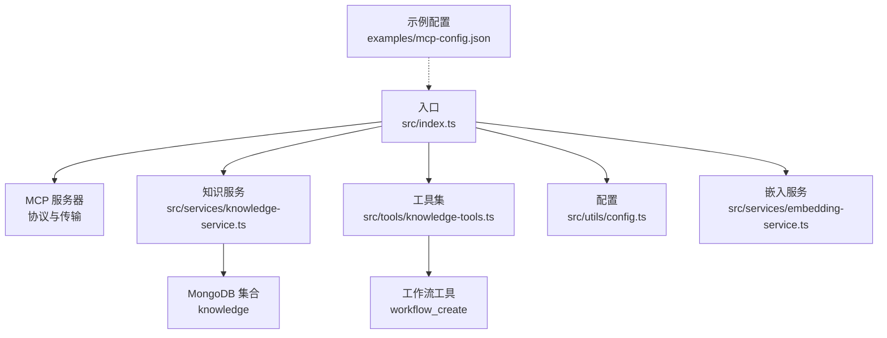
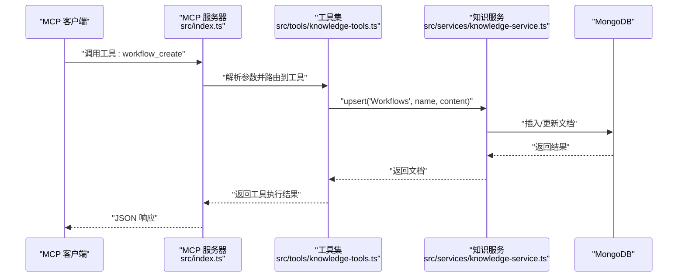
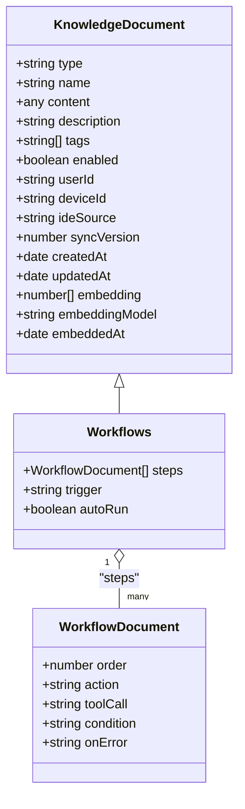
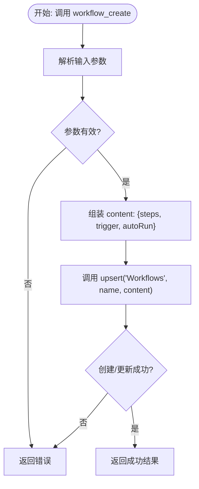
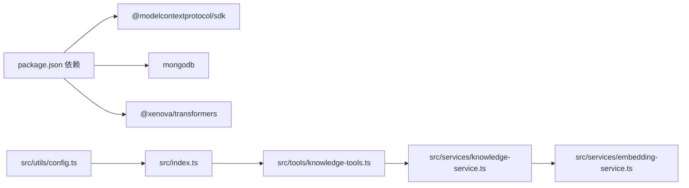

# 工作流管理 (Workflows)

<cite>
**本文引用的文件**
- [src/index.ts](file://src/index.ts)
- [src/types.ts](file://src/types.ts)
- [src/services/knowledge-service.ts](file://src/services/knowledge-service.ts)
- [src/tools/knowledge-tools.ts](file://src/tools/knowledge-tools.ts)
- [src/utils/config.ts](file://src/utils/config.ts)
- [src/services/embedding-service.ts](file://src/services/embedding-service.ts)
- [examples/mcp-config.json](file://examples/mcp-config.json)
- [package.json](file://package.json)
</cite>

## 目录
1. [简介](#简介)
2. [项目结构](#项目结构)
3. [核心组件](#核心组件)
4. [架构总览](#架构总览)
5. [详细组件分析](#详细组件分析)
6. [依赖关系分析](#依赖关系分析)
7. [性能考量](#性能考量)
8. [故障排查指南](#故障排查指南)
9. [结论](#结论)
10. [附录](#附录)

## 简介
本文件面向“工作流管理（Workflows）”主题，系统化阐述该知识类型的定义、数据结构、工具接口、执行与状态管理、监控与优化方法，以及与任务管理系统的集成实践。工作流作为“多步骤流程”的抽象，被建模为一系列有序步骤，每个步骤可包含动作、工具调用、条件判断与错误处理策略，并可通过触发条件或自动执行模式运行。

## 项目结构
该项目采用分层与按职责划分的组织方式：
- 入口与协议适配：MCP 协议服务器、stdio 传输、请求处理器
- 知识类型与数据模型：统一的知识文档类型与各类型专属字段
- 服务层：知识库服务封装 CRUD、统计、批量操作、语义搜索与嵌入生成
- 工具层：将服务能力暴露为 MCP 工具，含工作流创建工具
- 配置与嵌入：环境变量解析、日志、嵌入模型初始化与相似度计算

图表来源
- [src/index.ts](file://src/index.ts#L1-L148)
- [src/services/knowledge-service.ts](file://src/services/knowledge-service.ts#L1-L404)
- [src/tools/knowledge-tools.ts](file://src/tools/knowledge-tools.ts#L882-L953)
- [src/utils/config.ts](file://src/utils/config.ts#L1-L147)
- [src/services/embedding-service.ts](file://src/services/embedding-service.ts#L1-L148)
- [examples/mcp-config.json](file://examples/mcp-config.json#L1-L94)

章节来源
- [src/index.ts](file://src/index.ts#L1-L148)
- [src/utils/config.ts](file://src/utils/config.ts#L76-L91)
- [examples/mcp-config.json](file://examples/mcp-config.json#L1-L94)

## 核心组件
- 知识类型枚举与文档结构：定义了 Workflows 的专属字段，包括步骤数组、触发条件与自动执行标志
- 知识服务：提供 CRUD、列表、统计、批量导入导出、语义搜索与嵌入生成
- MCP 工具：将知识服务能力以工具形式暴露，其中包含工作流创建工具
- 嵌入服务：提供文本向量化、余弦相似度与批量处理能力
- 配置与日志：从环境变量加载配置，校验并输出日志

章节来源
- [src/types.ts](file://src/types.ts#L192-L210)
- [src/services/knowledge-service.ts](file://src/services/knowledge-service.ts#L111-L127)
- [src/tools/knowledge-tools.ts](file://src/tools/knowledge-tools.ts#L882-L953)
- [src/services/embedding-service.ts](file://src/services/embedding-service.ts#L11-L148)
- [src/utils/config.ts](file://src/utils/config.ts#L96-L115)

## 架构总览
下图展示了从 MCP 请求到知识库持久化的整体流程，以及工作流工具的调用链：

图表来源
- [src/index.ts](file://src/index.ts#L41-L79)
- [src/tools/knowledge-tools.ts](file://src/tools/knowledge-tools.ts#L882-L953)
- [src/services/knowledge-service.ts](file://src/services/knowledge-service.ts#L384-L402)

## 详细组件分析

### 工作流文档结构与字段
- 类型标识：type = 'Workflows'
- 步骤数组（steps）：每一步包含序号、动作、可选工具调用、可选条件表达式、可选错误处理策略
- 触发条件（trigger）：可选，用于外部触发或自动执行
- 自动执行（autoRun）：布尔值，控制是否自动运行
- 其他通用字段：名称、描述、标签、启用状态、用户与设备上下文、同步版本、时间戳、向量嵌入等

图表来源
- [src/types.ts](file://src/types.ts#L192-L210)

章节来源
- [src/types.ts](file://src/types.ts#L192-L210)

### 工作流工具：创建与参数
- 工具名称：workflow_create
- 输入参数要点：name、description、steps（必填）、trigger、autoRun、tags
- 处理流程：将 steps、trigger、autoRun 组装为 content，调用 upsert 创建或更新 Workflows 文档
- 输出：返回成功状态、文档 ID 与名称

图表来源
- [src/tools/knowledge-tools.ts](file://src/tools/knowledge-tools.ts#L882-L953)
- [src/services/knowledge-service.ts](file://src/services/knowledge-service.ts#L384-L402)

章节来源
- [src/tools/knowledge-tools.ts](file://src/tools/knowledge-tools.ts#L882-L953)
- [src/services/knowledge-service.ts](file://src/services/knowledge-service.ts#L384-L402)

### 执行引擎与状态管理（概念性说明）
- 执行引擎：当前仓库未内置工作流执行引擎。建议在工具层或上层应用中扩展执行引擎，负责：
  - 按步骤顺序执行（order）
  - 条件判断（condition）与分支逻辑
  - 错误处理策略（onError: stop/continue/retry）
  - 工具调用（toolCall）与参数传递
  - 状态持久化（当前步骤、完成状态、失败原因）
- 状态管理：可在 MongoDB 中为每个工作流实例维护状态文档，记录执行上下文与历史

[本节为概念性说明，不直接分析具体文件，故无章节来源]

### 工作流监控与优化（概念性说明）
- 监控指标：执行时延、成功率、失败率、重试次数、步骤耗时分布
- 日志与审计：记录每次执行的输入、输出、中间状态与异常
- 优化策略：缓存常用工具调用结果、批量处理、异步执行、超时与重试退避

[本节为概念性说明，不直接分析具体文件，故无章节来源]

### 与任务管理系统的集成与最佳实践
- 任务映射：将工作流的每个步骤映射为任务；步骤的 toolCall 对应任务的执行单元
- 触发与调度：通过 trigger 或 autoRun 控制任务的触发时机；结合外部调度器实现定时/事件驱动
- 参数传递：在步骤中定义参数占位符，由上游任务或上下文注入
- 错误恢复：利用 onError 策略进行局部重试或跳过，必要时回滚已执行步骤
- 版本与同步：利用 syncVersion 与跨设备同步能力，确保团队协作一致性

[本节为概念性说明，不直接分析具体文件，故无章节来源]

## 依赖关系分析
- 入口依赖 MCP SDK、MongoDB 驱动与嵌入模型库
- 工具集依赖知识服务；当启用嵌入时，工具集会动态注入语义搜索与嵌入生成工具
- 知识服务依赖 MongoDB 连接与嵌入服务单例

图表来源
- [package.json](file://package.json#L30-L35)
- [src/index.ts](file://src/index.ts#L3-L11)
- [src/tools/knowledge-tools.ts](file://src/tools/knowledge-tools.ts#L1-L32)
- [src/services/knowledge-service.ts](file://src/services/knowledge-service.ts#L1-L5)
- [src/services/embedding-service.ts](file://src/services/embedding-service.ts#L1-L7)

章节来源
- [package.json](file://package.json#L30-L35)
- [src/index.ts](file://src/index.ts#L3-L11)

## 性能考量
- 嵌入生成：批量生成嵌入时注意内存与 I/O 峰值，建议分批处理与并发控制
- 查询与索引：确保用户维度索引（如 userId + type + name）满足高并发读写
- 序列化与日志：避免在高频路径中进行大对象序列化；根据日志级别动态输出
- 模型加载：嵌入模型懒加载，首次初始化会有延迟，建议在启动阶段预热

[本节提供一般性指导，不直接分析具体文件，故无章节来源]

## 故障排查指南
- 配置校验失败：检查 MONGO_URI、MONGO_DATABASE、MONGO_COLLECTION 是否正确设置
- 连接问题：确认 MongoDB 可达性与认证配置
- 工具调用错误：查看工具返回的错误消息，定位参数缺失或格式问题
- 嵌入功能异常：确认 ENABLE_EMBEDDING 开关与网络可达性；首次加载模型可能较慢

章节来源
- [src/utils/config.ts](file://src/utils/config.ts#L96-L115)
- [src/index.ts](file://src/index.ts#L116-L144)
- [src/tools/knowledge-tools.ts](file://src/tools/knowledge-tools.ts#L926-L952)

## 结论
本仓库提供了工作流作为知识类型的数据结构与工具接口基础，能够将多步骤流程以结构化方式存储与检索。结合外部执行引擎与任务系统，可实现从设计到执行、监控与优化的闭环。建议在现有基础上扩展执行引擎与状态管理模块，并完善监控与告警机制，以支撑复杂业务场景下的稳定运行。

[本节为总结性内容，不直接分析具体文件，故无章节来源]

## 附录

### 工作流创建与编辑指南（步骤说明）
- 在客户端中调用工具：workflow_create
- 准备步骤数组：为每个步骤设置 order、action，并按需配置 toolCall 与 condition
- 可选配置：trigger（触发条件）、autoRun（自动执行）、tags（标签）
- 提交并验证：观察返回的成功消息与文档 ID，随后可在知识库中查看与编辑

章节来源
- [src/tools/knowledge-tools.ts](file://src/tools/knowledge-tools.ts#L882-L953)
- [src/services/knowledge-service.ts](file://src/services/knowledge-service.ts#L384-L402)

### 示例配置参考
- 不同 IDE 的 MCP 服务器配置示例，包含数据库、用户、设备与嵌入开关等环境变量

章节来源
- [examples/mcp-config.json](file://examples/mcp-config.json#L1-L94)