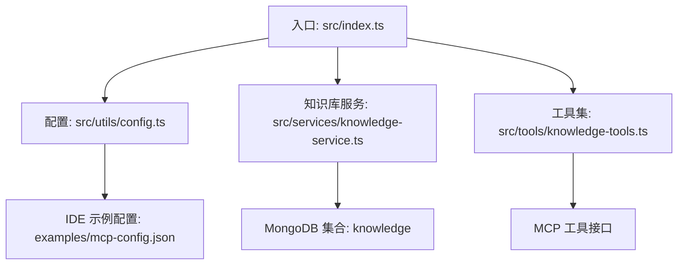
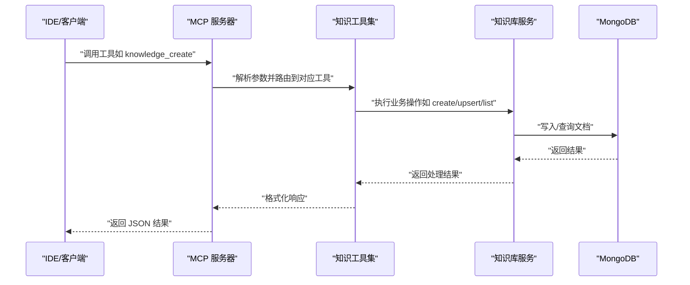
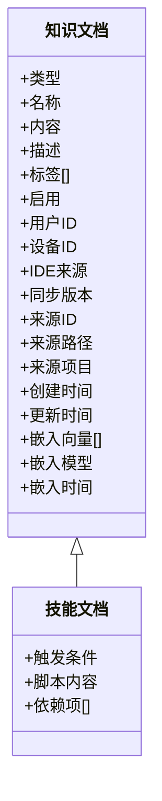
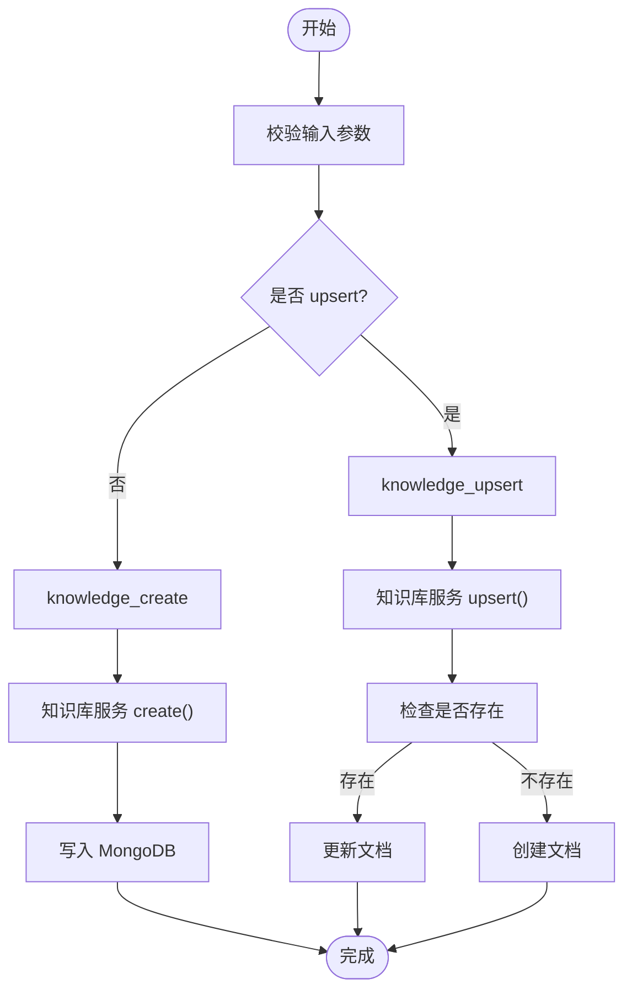
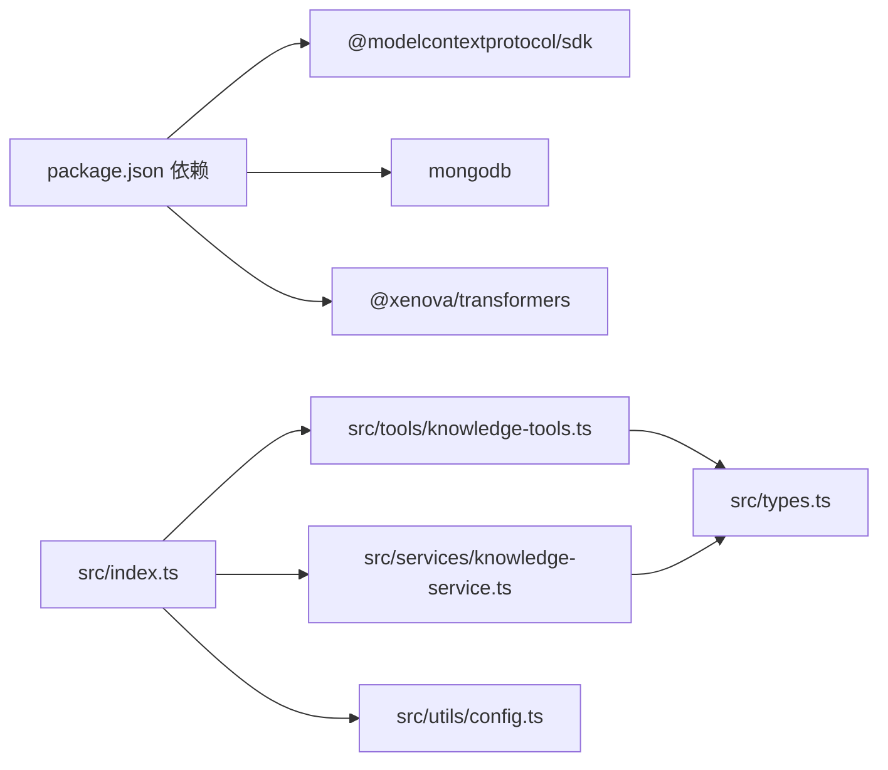

# 技能管理 (Skills)

<cite>
**本文引用的文件**
- [src/index.ts](file://src/index.ts)
- [src/types.ts](file://src/types.ts)
- [src/services/knowledge-service.ts](file://src/services/knowledge-service.ts)
- [src/tools/knowledge-tools.ts](file://src/tools/knowledge-tools.ts)
- [src/utils/config.ts](file://src/utils/config.ts)
- [examples/mcp-config.json](file://examples/mcp-config.json)
- [package.json](file://package.json)
- [temp-skills/template/README.md](file://temp-skills/template/README.md)
- [temp-skills/skills/algorithmic-art/README.md](file://temp-skills/skills/algorithmic-art/README.md)
- [temp-skills/skills/brand-guidelines/README.md](file://temp-skills/skills/brand-guidelines/README.md)
- [temp-skills/spec/agent-skills-spec.md](file://temp-skills/spec/agent-skills-spec.md)
</cite>

## 目录
1. [简介](#简介)
2. [项目结构](#项目结构)
3. [核心组件](#核心组件)
4. [架构总览](#架构总览)
5. [详细组件分析](#详细组件分析)
6. [依赖关系分析](#依赖关系分析)
7. [性能考虑](#性能考虑)
8. [故障排查指南](#故障排查指南)
9. [结论](#结论)
10. [附录](#附录)

## 简介
本文件面向“技能管理（Skills）”主题，基于仓库中的知识库系统实现，系统性阐述技能作为“可执行脚本/工作流”的知识类型定义、数据结构、创建与管理流程、与项目经验的关联方式、评估与进度跟踪方法，以及技能模板与标准化流程的最佳实践。该系统以 MongoDB 为持久化存储，通过 MCP（Model Context Protocol）工具接口提供统一的知识管理能力，支持跨 IDE、跨设备的用户隔离与同步。

## 项目结构
- 入口与运行时
  - 入口文件负责启动 MCP 服务器、加载配置、连接数据库、注册工具集并处理请求。
- 类型与数据模型
  - 定义了八种知识类型（含 Skills），并为每种类型提供专用文档结构。
- 服务层
  - 知识库服务封装 CRUD、统计、批量导入导出、语义搜索与嵌入生成功能。
- 工具层
  - 将知识库服务暴露为 MCP 工具，提供通用 CRUD、快捷工具（记忆、经验、命令、上下文、MCP 同步等）。
- 配置与示例
  - 提供 IDE 配置示例与环境变量解析逻辑，便于在不同 IDE 中集成。

图表来源
- [src/index.ts](file://src/index.ts#L87-L145)
- [src/utils/config.ts](file://src/utils/config.ts#L76-L91)
- [src/services/knowledge-service.ts](file://src/services/knowledge-service.ts#L20-L87)
- [src/tools/knowledge-tools.ts](file://src/tools/knowledge-tools.ts#L29-L32)
- [examples/mcp-config.json](file://examples/mcp-config.json#L1-L94)

章节来源
- [src/index.ts](file://src/index.ts#L1-L148)
- [src/utils/config.ts](file://src/utils/config.ts#L1-L147)
- [src/services/knowledge-service.ts](file://src/services/knowledge-service.ts#L1-L404)
- [src/tools/knowledge-tools.ts](file://src/tools/knowledge-tools.ts#L1-L800)
- [examples/mcp-config.json](file://examples/mcp-config.json#L1-L94)

## 核心组件
- 知识类型与技能文档结构
  - 知识类型枚举包含 Memories、Skills、Rules、MCPs、Experiences、Commands、Contexts、Workflows。
  - 技能文档（SkillDocument）扩展基础知识文档，增加触发条件、脚本内容与依赖项等字段。
- 知识库服务
  - 提供创建、读取、更新、删除、列表、统计、存在性检查、Upsert、批量导入导出、语义搜索与嵌入生成等能力。
  - 通过用户上下文（userId/deviceId/ideSource）实现用户隔离与跨设备同步。
- MCP 工具集
  - 暴露通用 CRUD 与快捷工具，统一以 MCP 工具形式被 IDE 或代理调用。
- 配置与运行
  - 从环境变量加载配置，校验必要参数，创建日志器；支持嵌入开关与日志级别控制。

章节来源
- [src/types.ts](file://src/types.ts#L6-L74)
- [src/types.ts](file://src/types.ts#L106-L118)
- [src/services/knowledge-service.ts](file://src/services/knowledge-service.ts#L20-L404)
- [src/tools/knowledge-tools.ts](file://src/tools/knowledge-tools.ts#L29-L399)
- [src/utils/config.ts](file://src/utils/config.ts#L76-L147)

## 架构总览
系统采用“入口 -> 服务 -> 存储”的分层架构，MCP 工具作为对外接口，内部通过知识库服务访问 MongoDB。嵌入功能按需启用，支持语义检索与相似度匹配。

图表来源
- [src/index.ts](file://src/index.ts#L41-L79)
- [src/tools/knowledge-tools.ts](file://src/tools/knowledge-tools.ts#L72-L106)
- [src/services/knowledge-service.ts](file://src/services/knowledge-service.ts#L111-L127)

章节来源
- [src/index.ts](file://src/index.ts#L1-L148)
- [src/tools/knowledge-tools.ts](file://src/tools/knowledge-tools.ts#L1-L800)
- [src/services/knowledge-service.ts](file://src/services/knowledge-service.ts#L1-L404)

## 详细组件分析

### 技能文档结构与字段定义
- 基础字段
  - 类型、名称、内容、描述、标签、启用状态、用户与设备标识、同步版本、来源信息、时间戳、向量嵌入。
- 技能特有字段
  - 触发条件、脚本内容、依赖项。
- 字段用途
  - 触发条件用于决定何时激活技能；
  - 脚本内容承载可执行逻辑；
  - 依赖项用于声明前置条件或外部资源。

图表来源
- [src/types.ts](file://src/types.ts#L24-L74)
- [src/types.ts](file://src/types.ts#L110-L118)

章节来源
- [src/types.ts](file://src/types.ts#L6-L74)
- [src/types.ts](file://src/types.ts#L106-L118)

### 技能创建与管理流程
- 创建流程
  - 通过 MCP 工具 knowledge_create 接收 type、name、content、description、tags、enabled 等参数，调用知识库服务创建文档。
- 更新与删除
  - knowledge_update 支持增量更新；knowledge_delete 支持按类型与名称删除。
- 列表与统计
  - knowledge_list 支持按类型、标签、启用状态、关键词搜索、分页；knowledge_stats 支持按类型统计数量。
- Upsert
  - knowledge_upsert 若存在则更新，否则创建，避免重复命名冲突。

图表来源
- [src/tools/knowledge-tools.ts](file://src/tools/knowledge-tools.ts#L72-L106)
- [src/tools/knowledge-tools.ts](file://src/tools/knowledge-tools.ts#L382-L398)
- [src/services/knowledge-service.ts](file://src/services/knowledge-service.ts#L111-L127)
- [src/services/knowledge-service.ts](file://src/services/knowledge-service.ts#L384-L402)

章节来源
- [src/tools/knowledge-tools.ts](file://src/tools/knowledge-tools.ts#L36-L399)
- [src/services/knowledge-service.ts](file://src/services/knowledge-service.ts#L111-L402)

### 技能分类、标签体系与优先级
- 分类与标签
  - 通过 type 与 tags 字段实现粗粒度分类与细粒度筛选；支持按标签集合进行查询。
- 优先级
  - 优先级字段存在于规则文档（Rules）中，技能文档未内置优先级字段；若需对技能排序，可在应用层通过 tags 或自定义字段实现。

章节来源
- [src/types.ts](file://src/types.ts#L34-L35)
- [src/types.ts](file://src/types.ts#L126-L133)

### 技能与项目经验的关联方式
- 经验文档（Experiences）包含 relatedSkills 字段，可用于记录某条经验所关联的技能名称列表。
- 在技能管理中，可通过经验文档的关联字段建立“技能-经验”映射，便于复用与评估。

章节来源
- [src/types.ts](file://src/types.ts#L150-L151)

### 技能评估与进度跟踪
- 评估维度
  - 可参考经验文档的有效性评分（1-5）作为评估指标；技能层面可引入自定义字段（如 effectiveness、难度等级、完成度）以支撑评估。
- 进度跟踪
  - 通过标签体系（如“进行中/已完成/待验证”）与时间戳（createdAt/updatedAt）实现进度可视化与审计。
- 建议实践
  - 为技能设定里程碑标签与截止日期，结合经验文档记录每次迭代的产出与效果。

章节来源
- [src/types.ts](file://src/types.ts#L148-L149)
- [src/types.ts](file://src/types.ts#L31-L31)

### 技能模板与标准化流程
- 模板文件
  - 仓库提供技能模板与示例，包含技能说明、技术要求、交互规范与资源清单。
- 示例技能
  - 算法艺术与品牌指南等示例展示了如何组织技能文档、参数与输出格式。
- 标准化流程
  - 建议遵循“需求分析 -> 算法哲学/设计原则 -> 实现 -> 参数化 -> 交互控件 -> 输出产物 -> 文档与模板”的闭环流程。

章节来源
- [temp-skills/template/README.md](file://temp-skills/template/README.md)
- [temp-skills/skills/algorithmic-art/README.md](file://temp-skills/skills/algorithmic-art/README.md)
- [temp-skills/skills/brand-guidelines/README.md](file://temp-skills/skills/brand-guidelines/README.md)
- [temp-skills/spec/agent-skills-spec.md](file://temp-skills/spec/agent-skills-spec.md#L1-L4)

## 依赖关系分析
- 外部依赖
  - @modelcontextprotocol/sdk：MCP 协议与传输层；
  - mongodb：MongoDB 官方驱动；
  - @xenova/transformers：文本嵌入模型（可选）。
- 内部依赖
  - 知识库服务依赖类型定义与配置模块；
  - 工具集依赖知识库服务与类型定义；
  - 入口文件依赖工具集与配置模块。

图表来源
- [package.json](file://package.json#L30-L43)
- [src/index.ts](file://src/index.ts#L3-L11)
- [src/tools/knowledge-tools.ts](file://src/tools/knowledge-tools.ts#L1-L16)
- [src/services/knowledge-service.ts](file://src/services/knowledge-service.ts#L1-L4)
- [src/types.ts](file://src/types.ts#L1-L1)

章节来源
- [package.json](file://package.json#L1-L48)
- [src/index.ts](file://src/index.ts#L1-L148)
- [src/tools/knowledge-tools.ts](file://src/tools/knowledge-tools.ts#L1-L800)
- [src/services/knowledge-service.ts](file://src/services/knowledge-service.ts#L1-L404)
- [src/types.ts](file://src/types.ts#L1-L269)

## 性能考虑
- 索引策略
  - 用户级唯一索引、用户+类型、用户+设备、标签、更新时间排序索引，提升查询与排序性能。
- 嵌入与语义搜索
  - 仅在启用嵌入时生成与使用向量；语义搜索按阈值与上限裁剪结果，避免全表扫描。
- 批量操作
  - 批量导入/导出与批量嵌入生成，减少网络往返与事务开销。
- 建议
  - 对高频查询字段（如 tags、enabled、type）保持合理索引数量，避免过度索引导致写入性能下降。

章节来源
- [src/services/knowledge-service.ts](file://src/services/knowledge-service.ts#L71-L87)
- [src/services/knowledge-service.ts](file://src/services/knowledge-service.ts#L272-L299)
- [src/services/knowledge-service.ts](file://src/services/knowledge-service.ts#L313-L341)

## 故障排查指南
- 启动失败
  - 检查配置校验错误（如 MONGO_URI、MONGO_DATABASE、MONGO_COLLECTION 缺失）；查看日志级别输出。
- 工具调用异常
  - 确认工具名称正确、必填参数齐全；关注重复命名（type+name 唯一）导致的插入冲突。
- 数据库连接问题
  - 确认 MongoDB 地址可达、认证配置正确；检查网络与防火墙策略。
- 嵌入功能异常
  - 确认 ENABLE_EMBEDDING 开关与嵌入模型可用；检查文本提取与相似度计算逻辑。

章节来源
- [src/utils/config.ts](file://src/utils/config.ts#L96-L115)
- [src/index.ts](file://src/index.ts#L93-L98)
- [src/tools/knowledge-tools.ts](file://src/tools/knowledge-tools.ts#L99-L105)
- [src/services/knowledge-service.ts](file://src/services/knowledge-service.ts#L44-L54)

## 结论
该技能管理系统以“Skills”为核心知识类型，围绕技能的创建、管理、关联与评估提供了完整的数据模型与工具链。通过 MCP 工具接口与 MongoDB 的组合，实现了跨 IDE、跨设备的技能知识管理与复用。建议在实际落地中结合经验文档与标签体系，完善技能评估与进度跟踪机制，并沿用模板化与标准化流程，持续沉淀高质量技能资产。

## 附录
- IDE 集成示例
  - 提供 Qoder、Cursor、VS Code 等 IDE 的 MCP 配置示例，便于快速接入。
- 版本与引擎
  - 项目基于 Node.js 18+，使用 TypeScript 构建与开发。

章节来源
- [examples/mcp-config.json](file://examples/mcp-config.json#L1-L94)
- [package.json](file://package.json#L44-L46)