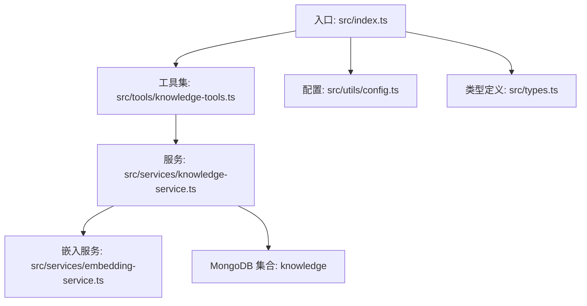
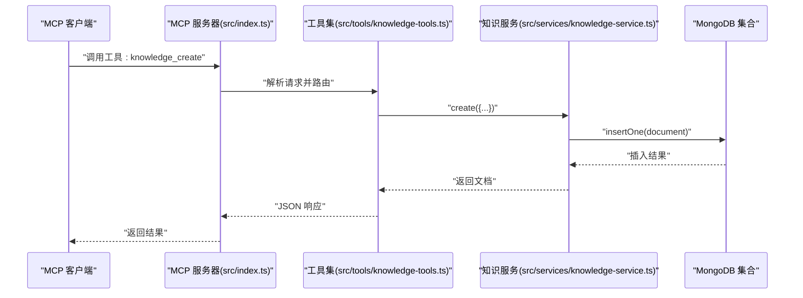
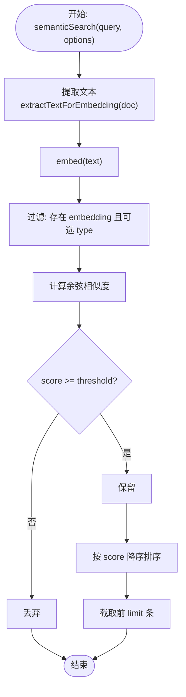
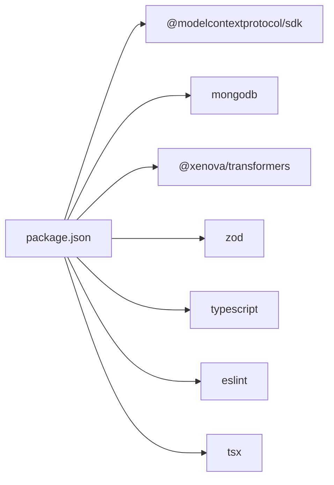

# 知识库管理

<cite>
**本文引用的文件**
- [src/index.ts](file://src/index.ts)
- [src/types.ts](file://src/types.ts)
- [src/services/knowledge-service.ts](file://src/services/knowledge-service.ts)
- [src/services/embedding-service.ts](file://src/services/embedding-service.ts)
- [src/tools/knowledge-tools.ts](file://src/tools/knowledge-tools.ts)
- [src/utils/config.ts](file://src/utils/config.ts)
- [package.json](file://package.json)
- [examples/mcp-config.json](file://examples/mcp-config.json)
- [temp-skills/skills/algorithmic-art/SKILL.md](file://temp-skills/skills/algorithmic-art/SKILL.md)
- [temp-skills/skills/algorithmic-art/templates/generator_template.js](file://temp-skills/skills/algorithmic-art/templates/generator_template.js)
- [temp-skills/skills/algorithmic-art/templates/viewer.html](file://temp-skills/skills/algorithmic-art/templates/viewer.html)
</cite>

## 目录
1. [简介](#简介)
2. [项目结构](#项目结构)
3. [核心组件](#核心组件)
4. [架构总览](#架构总览)
5. [详细组件分析](#详细组件分析)
6. [依赖关系分析](#依赖关系分析)
7. [性能考量](#性能考量)
8. [故障排查指南](#故障排查指南)
9. [结论](#结论)
10. [附录](#附录)

## 简介
本项目是一个基于 MongoDB 的 MCP（Model Context Protocol）服务器，提供统一的知识库管理能力，支持 8 种知识类型：Memories（记忆）、Skills（技能）、Rules（规则）、MCPs（MCP 配置）、Experiences（经验）、Commands（命令）、Contexts（上下文）、Workflows（工作流）。系统具备：
- 结构化的知识文档模型与类型安全的数据定义
- 用户隔离与跨设备/跨 IDE 同步
- 语义搜索与向量嵌入集成
- 全面的 CRUD、批量导入导出、统计与 upsert 操作
- 通过 MCP 工具暴露统一的调用接口

## 项目结构
- 入口与运行时：src/index.ts 启动 MCP 服务器，加载配置并通过工具集提供知识库操作
- 类型定义：src/types.ts 定义 8 种知识类型及通用字段、查询与嵌入相关字段
- 服务层：src/services/knowledge-service.ts 实现知识库 CRUD、索引、统计、语义搜索与嵌入生成
- 嵌入服务：src/services/embedding-service.ts 使用 Transformers.js 生成文本向量并计算余弦相似度
- 工具集：src/tools/knowledge-tools.ts 将服务封装为 MCP 工具，提供通用 CRUD、快捷工具与语义搜索
- 配置与日志：src/utils/config.ts 解析环境变量、校验配置并提供日志工具
- 示例与技能模板：examples/mcp-config.json 展示不同 IDE 的配置；temp-skills 提供技能样例与模板

图表来源
- [src/index.ts](file://src/index.ts#L1-L148)
- [src/tools/knowledge-tools.ts](file://src/tools/knowledge-tools.ts#L1-L1093)
- [src/services/knowledge-service.ts](file://src/services/knowledge-service.ts#L1-L404)
- [src/services/embedding-service.ts](file://src/services/embedding-service.ts#L1-L148)
- [src/utils/config.ts](file://src/utils/config.ts#L1-L147)
- [src/types.ts](file://src/types.ts#L1-L269)

章节来源
- [src/index.ts](file://src/index.ts#L1-L148)
- [src/utils/config.ts](file://src/utils/config.ts#L1-L147)
- [src/types.ts](file://src/types.ts#L1-L269)

## 核心组件
- 知识类型与文档模型：8 种知识类型均有专用接口，统一继承基础字段（类型、名称、内容、标签、启用状态、用户/设备/IDE 标识、同步版本、来源信息、时间戳、向量嵌入等）
- 知识服务：提供连接、索引、CRUD、upsert、批量导入导出、统计、语义搜索、嵌入生成与批量生成
- 嵌入服务：基于 Transformers.js 的特征提取，支持懒加载、批量嵌入与余弦相似度计算
- MCP 工具集：将知识服务封装为 MCP 工具，覆盖通用 CRUD、快捷工具（记忆、经验、命令、上下文、MCP 同步、规则同步、技能同步、工作流创建）、统计、导出、语义搜索与嵌入生成
- 配置与日志：解析环境变量、校验配置、输出日志

章节来源
- [src/types.ts](file://src/types.ts#L1-L269)
- [src/services/knowledge-service.ts](file://src/services/knowledge-service.ts#L1-L404)
- [src/services/embedding-service.ts](file://src/services/embedding-service.ts#L1-L148)
- [src/tools/knowledge-tools.ts](file://src/tools/knowledge-tools.ts#L1-L1093)
- [src/utils/config.ts](file://src/utils/config.ts#L1-L147)

## 架构总览
系统采用“MCP 工具 + 知识服务 + MongoDB”的分层架构。MCP 工具作为对外接口，内部委托知识服务完成数据库操作；知识服务负责索引、查询、嵌入生成与语义搜索；嵌入服务负责文本向量化与相似度计算。

图表来源
- [src/index.ts](file://src/index.ts#L16-L82)
- [src/tools/knowledge-tools.ts](file://src/tools/knowledge-tools.ts#L36-L107)
- [src/services/knowledge-service.ts](file://src/services/knowledge-service.ts#L111-L127)

## 详细组件分析

### 知识类型与数据模型
- 基础字段：type、name、content、description、tags、enabled、userId、deviceId、ideSource、syncVersion、lastSyncAt、sourceId/sourcePath/sourceProject、createdAt/updatedAt/createdBy/updatedBy、embedding/embeddingModel/embeddedAt
- 8 种知识类型专属字段：
  - Memories：category、importance、expiresAt
  - Skills：trigger、script、dependencies
  - Rules：priority、conditions、actions、triggerMode
  - MCPs：command、args、env、tools
  - Experiences：scenario、solution、outcome、effectiveness、relatedSkills
  - Commands：template、parameters、category、shortcut
  - Contexts：scope、projectPath、validUntil、references
  - Workflows：steps（order/action/toolCall/condition/onError）、trigger、autoRun

章节来源
- [src/types.ts](file://src/types.ts#L24-L223)

### 索引策略与查询优化
- 用户级唯一索引：(userId, type, name) 唯一，保证同用户下同类型文档名称唯一
- 多维查询索引：(userId, type)、(userId, deviceId)、(userId, tags)、(userId, updatedAt)
- 查询优化要点：
  - 列表查询支持 type、enabled、tags、search（正则模糊匹配 name/description）、limit/offset
  - 语义搜索仅对存在 embedding 字段的文档进行，按相似度阈值与 limit 返回
  - upsert 通过 get + update/create 实现幂等写入

章节来源
- [src/services/knowledge-service.ts](file://src/services/knowledge-service.ts#L71-L87)
- [src/services/knowledge-service.ts](file://src/services/knowledge-service.ts#L195-L216)
- [src/services/knowledge-service.ts](file://src/services/knowledge-service.ts#L272-L299)

### CRUD 与事务/并发控制
- 连接与断开：MongoClient 生命周期由服务管理，确保单例连接
- 并发控制：
  - 唯一性约束：通过唯一索引与 MongoDB 写入错误码（如 11000）实现冲突检测
  - upsert：先 get 再 update 或 create，保证幂等
  - 同步版本：每次更新 inc syncVersion，便于跨设备合并与去重
- 事务：未使用 MongoDB 事务，采用单文档更新与 upsert 保证一致性

章节来源
- [src/services/knowledge-service.ts](file://src/services/knowledge-service.ts#L29-L66)
- [src/services/knowledge-service.ts](file://src/services/knowledge-service.ts#L111-L127)
- [src/services/knowledge-service.ts](file://src/services/knowledge-service.ts#L155-L177)
- [src/services/knowledge-service.ts](file://src/services/knowledge-service.ts#L384-L402)

### 语义搜索与向量嵌入
- 嵌入生成：
  - 从文档提取文本（name/description/content/tags），截断长度避免过长
  - 使用 Transformers.js 特征提取，mean 池化与 L2 归一化
  - 支持单条与批量生成，记录 embeddingModel 与 embeddedAt
- 语义搜索：
  - 输入查询文本生成向量
  - 仅对存在 embedding 的文档检索，计算余弦相似度
  - 支持 type 过滤、阈值与 limit 控制

图表来源
- [src/services/knowledge-service.ts](file://src/services/knowledge-service.ts#L272-L299)
- [src/services/embedding-service.ts](file://src/services/embedding-service.ts#L109-L129)
- [src/services/embedding-service.ts](file://src/services/embedding-service.ts#L56-L65)
- [src/services/embedding-service.ts](file://src/services/embedding-service.ts#L85-L104)

章节来源
- [src/services/embedding-service.ts](file://src/services/embedding-service.ts#L1-L148)
- [src/services/knowledge-service.ts](file://src/services/knowledge-service.ts#L272-L360)

### MCP 工具与扩展方法
- 通用工具：knowledge_create、knowledge_read、knowledge_update、knowledge_delete、knowledge_list、knowledge_stats、knowledge_upsert、knowledge_export
- 快捷工具：memory_add/memory_search、experience_add、command_add、context_set、mcp_sync、rule_sync、skill_sync、workflow_create
- 语义工具：semantic_search、generate_embeddings（按配置动态注入）
- 扩展最佳实践：
  - 新增类型：在 types.ts 增加接口与联合类型，在 tools 中新增对应工具与输入 schema
  - 新增字段：在对应接口中扩展字段并在服务层处理序列化/反序列化
  - 新增查询：在服务层增加 filter 与投影逻辑，必要时新增索引
  - 新增工具：在 tools 中定义输入 schema 与 handler，必要时在服务层新增方法

章节来源
- [src/tools/knowledge-tools.ts](file://src/tools/knowledge-tools.ts#L29-L1093)
- [src/types.ts](file://src/types.ts#L215-L269)

### 用户隔离与同步机制
- 用户隔离：所有查询与写入均以 userId 为前缀过滤，确保跨设备/跨 IDE 的数据隔离
- 设备标识：deviceId 与 ideSource 记录来源，便于跨设备同步与审计
- 同步版本：syncVersion 自增，配合 lastSyncAt 与 sourceId/sourcePath/sourceProject 支持外部系统同步
- 跨 IDE 配置：examples/mcp-config.json 展示了不同 IDE 的环境变量配置，包括 MONGO_URI、USER_ID、DEVICE_ID、IDE_SOURCE、ENABLE_EMBEDDING 等

章节来源
- [src/services/knowledge-service.ts](file://src/services/knowledge-service.ts#L92-L106)
- [src/services/knowledge-service.ts](file://src/services/knowledge-service.ts#L162-L171)
- [src/utils/config.ts](file://src/utils/config.ts#L76-L91)
- [examples/mcp-config.json](file://examples/mcp-config.json#L1-L94)

### 技能系统与工作流
- 技能（Skills）：支持脚本内容与触发条件，可用于自动化执行
- 工作流（Workflows）：多步骤流程，支持条件与错误处理策略（stop/continue/retry）
- 示例技能：temp-skills/skills/algorithmic-art 提供算法艺术生成的哲学与模板，展示如何将知识转化为可执行的交互式产物

章节来源
- [src/types.ts](file://src/types.ts#L109-L210)
- [src/tools/knowledge-tools.ts](file://src/tools/knowledge-tools.ts#L824-L952)
- [temp-skills/skills/algorithmic-art/SKILL.md](file://temp-skills/skills/algorithmic-art/SKILL.md#L1-L405)
- [temp-skills/skills/algorithmic-art/templates/generator_template.js](file://temp-skills/skills/algorithmic-art/templates/generator_template.js#L1-L223)
- [temp-skills/skills/algorithmic-art/templates/viewer.html](file://temp-skills/skills/algorithmic-art/templates/viewer.html#L1-L599)

## 依赖关系分析
- 运行时依赖：@modelcontextprotocol/sdk（MCP 协议）、mongodb（数据库）、@xenova/transformers（嵌入模型）、zod（类型校验）
- 开发依赖：ESLint、TypeScript、tsx（热重载）

图表来源
- [package.json](file://package.json#L30-L47)

章节来源
- [package.json](file://package.json#L1-L48)

## 性能考量
- 嵌入生成：
  - 模型懒加载，首次初始化耗时较长，建议在空闲时段批量生成
  - 批量生成时逐条更新，注意网络与磁盘 IO；可考虑分批或异步队列
- 查询性能：
  - 唯一索引与多维索引减少重复扫描
  - 语义搜索仅对存在 embedding 的文档过滤，建议定期清理无效嵌入
- 并发与锁：
  - 无显式分布式锁，建议在上层应用中对热点文档加互斥策略
- 日志与可观测性：
  - 通过日志级别控制输出，生产环境建议 info/warn/error

## 故障排查指南
- 连接失败：检查 MONGO_URI、数据库/集合权限
- 唯一冲突：当 name 在同类型下重复时会返回唯一键冲突错误，需修改名称或使用 upsert
- 嵌入未生成：确认 ENABLE_EMBEDDING 为 true，且文档包含可提取文本
- 工具调用异常：查看 MCP 客户端日志，确认工具名称与输入 schema 匹配

章节来源
- [src/services/knowledge-service.ts](file://src/services/knowledge-service.ts#L111-L127)
- [src/utils/config.ts](file://src/utils/config.ts#L96-L115)
- [src/tools/knowledge-tools.ts](file://src/tools/knowledge-tools.ts#L72-L106)

## 结论
该知识库管理系统以类型安全的文档模型为核心，结合 MCP 工具与 MongoDB，提供了完整的知识管理能力。通过用户隔离、跨设备同步与语义搜索，满足多 IDE 场景下的知识沉淀与复用需求。建议在生产环境中完善并发控制、监控与备份策略，并根据业务扩展新的知识类型与工具。

## 附录
- 配置项参考：MONGO_URI、MONGO_DATABASE、MONGO_COLLECTION、USER_ID、DEVICE_ID、IDE_SOURCE、ENABLE_EMBEDDING、LOG_LEVEL
- 工具清单：见 MCP 工具集定义与输入 schema

章节来源
- [src/utils/config.ts](file://src/utils/config.ts#L76-L91)
- [src/tools/knowledge-tools.ts](file://src/tools/knowledge-tools.ts#L29-L1093)