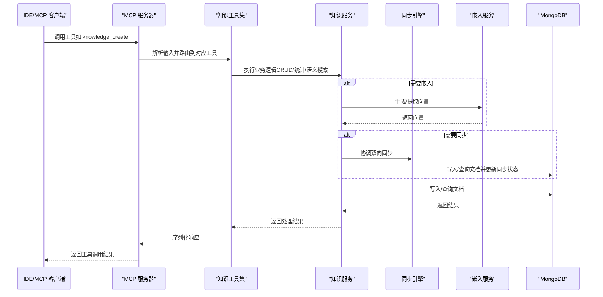
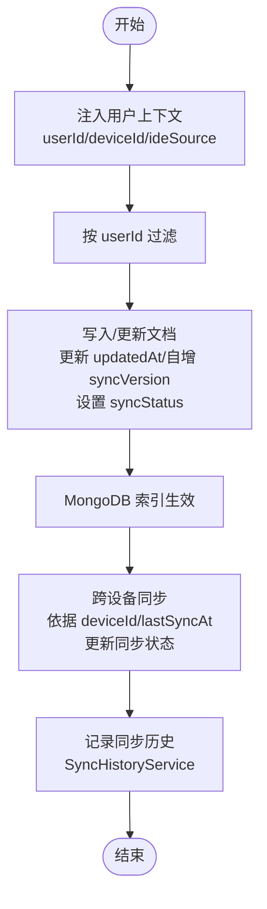
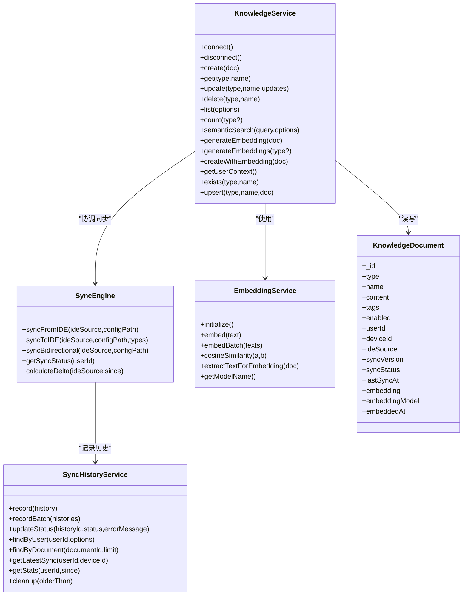
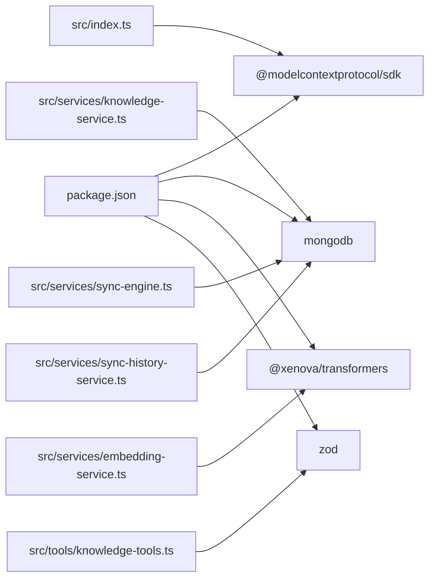

# 知识类型概览

<cite>
**本文引用的文件**
- [src/types.ts](file://src/types.ts)
- [src/services/knowledge-service.ts](file://src/services/knowledge-service.ts)
- [src/services/embedding-service.ts](file://src/services/embedding-service.ts)
- [src/tools/knowledge-tools.ts](file://src/tools/knowledge-tools.ts)
- [src/index.ts](file://src/index.ts)
- [examples/mcp-config.json](file://examples/mcp-config.json)
- [package.json](file://package.json)
- [src/services/sync-engine.ts](file://src/services/sync-engine.ts)
- [src/services/sync-history-service.ts](file://src/services/sync-history-service.ts)
- [src/types/sync.types.ts](file://src/types/sync.types.ts)
- [src/schemas/common.schema.ts](file://src/schemas/common.schema.ts)
- [temp-skills/skills/brand-guidelines/SKILL.md](file://temp-skills/skills/brand-guidelines/SKILL.md)
- [temp-skills/skills/docx/SKILL.md](file://temp-skills/skills/docx/SKILL.md)
- [temp-skills/skills/canvas-design/SKILL.md](file://temp-skills/skills/canvas-design/SKILL.md)
</cite>

## 目录
1. [简介](#简介)
2. [项目结构](#项目结构)
3. [核心组件](#核心组件)
4. [架构总览](#架构总览)
5. [详细组件分析](#详细组件分析)
6. [依赖关系分析](#依赖关系分析)
7. [性能考量](#性能考量)
8. [故障排查指南](#故障排查指南)
9. [结论](#结论)
10. [附录](#附录)

## 简介
本文件面向"知识类型系统"的使用者与维护者，提供统一的数据结构、通用特性、8种知识类型的用途与适用范围、用户上下文隔离与跨设备同步的工作原理、以及扩展接口规范与实现要求。系统以 MongoDB 为持久化存储，通过 MCP（Model Context Protocol）工具接口提供统一的知识管理能力，并支持向量嵌入与语义检索。

## 项目结构
- 核心类型与接口定义位于 types.ts，涵盖 8 种知识类型及其统一字段。
- 知识服务 KnowledgeService 封装 CRUD、查询、统计、批量导入导出、嵌入生成与语义检索。
- 嵌入服务 EmbeddingService 使用 Transformers.js 生成文本向量，支持余弦相似度计算。
- 工具层 knowledge-tools.ts 定义 MCP 工具集合，覆盖通用 CRUD、快捷工具与上下文设置。
- 同步引擎 SyncEngine 和同步历史服务 SyncHistoryService 提供跨IDE同步能力。
- 入口程序 index.ts 构建 MCP 服务器，加载配置并注入用户上下文。
- 示例配置 examples/mcp-config.json 展示多 IDE 的集成方式与跨设备同步策略。
- package.json 描述依赖与脚本，支撑构建与运行。

```mermaid
graph TB
subgraph "应用入口"
IDX["src/index.ts"]
end
subgraph "服务层"
KS["src/services/knowledge-service.ts"]
ES["src/services/embedding-service.ts"]
SE["src/services/sync-engine.ts"]
SHS["src/services/sync-history-service.ts"]
end
subgraph "工具层"
KT["src/tools/knowledge-tools.ts"]
end
subgraph "类型定义"
TYPES["src/types.ts"]
SYNTYPES["src/types/sync.types.ts"]
END
subgraph "外部依赖"
MONGO["MongoDB"]
MCP["@modelcontextprotocol/sdk"]
TRANS["@xenova/transformers"]
END
IDX --> KS
IDX --> KT
KS --> ES
KS --> SE
KS --> SHS
KS --> MONGO
KT --> KS
ES --> TRANS
IDX --> MCP
KS --> TYPES
SE --> SYNTYPES
SHS --> SYNTYPES
```

**图表来源**
- [src/index.ts](file://src/index.ts#L1-L148)
- [src/services/knowledge-service.ts](file://src/services/knowledge-service.ts#L1-L437)
- [src/services/sync-engine.ts](file://src/services/sync-engine.ts#L1-L451)
- [src/services/sync-history-service.ts](file://src/services/sync-history-service.ts#L1-L253)
- [src/types.ts](file://src/types.ts#L1-L271)
- [src/types/sync.types.ts](file://src/types/sync.types.ts#L1-L218)

**章节来源**
- [src/index.ts](file://src/index.ts#L1-L148)
- [package.json](file://package.json#L1-L48)

## 核心组件
- 知识类型枚举：Memories、Skills、Rules、MCPs、Experiences、Commands、Contexts、Workflows。
- 统一接口 KnowledgeDocument：type、name、content、tags、enabled 等通用字段；用户与设备标识（userId、deviceId、ideSource）；同步版本与时间戳；向量嵌入字段。
- 同步状态管理：syncStatus 字段用于跟踪文档的同步状态（synced、pending、conflict、local_only）。
- 专用文档接口：MemoryDocument、SkillDocument、RuleDocument、McpDocument、ExperienceDocument、CommandDocument、ContextDocument、WorkflowDocument。
- 知识服务 KnowledgeService：连接 MongoDB、索引管理、用户上下文注入、CRUD、列表/统计、批量导入导出、语义搜索、嵌入生成。
- 嵌入服务 EmbeddingService：模型懒加载、文本向量化、余弦相似度、文档文本抽取。
- 同步引擎 SyncEngine：协调知识库与 IDE 配置之间的双向同步，处理冲突解决。
- 同步历史服务 SyncHistoryService：记录每次同步操作的详细信息，支持查询和统计。
- MCP 工具集：通用 CRUD、快捷工具（记忆、经验、命令、上下文、MCP 同步）、规则同步等。
- 入口与配置：MCP 服务器、用户上下文注入、日志与优雅关闭。

**章节来源**
- [src/types.ts](file://src/types.ts#L6-L76)
- [src/services/knowledge-service.ts](file://src/services/knowledge-service.ts#L20-L437)
- [src/services/sync-engine.ts](file://src/services/sync-engine.ts#L47-L451)
- [src/services/sync-history-service.ts](file://src/services/sync-history-service.ts#L1-L253)
- [src/tools/knowledge-tools.ts](file://src/tools/knowledge-tools.ts#L29-L1093)
- [src/index.ts](file://src/index.ts#L87-L148)

## 架构总览
系统采用"MCP 工具 + 知识服务 + 嵌入服务 + 同步引擎 + MongoDB"的分层架构：
- MCP 服务器暴露工具接口，客户端（IDE）通过 MCP 调用工具。
- 工具调用最终落到 KnowledgeService，后者负责数据持久化与检索。
- SyncEngine 协调知识库与 IDE 之间的双向同步，处理冲突解决。
- KnowledgeService 在需要时调用 EmbeddingService 生成/匹配向量。
- 用户上下文（userId、deviceId、ideSource）贯穿所有操作，确保隔离与跨设备同步。



**图表来源**
- [src/index.ts](file://src/index.ts#L16-L82)
- [src/tools/knowledge-tools.ts](file://src/tools/knowledge-tools.ts#L36-L107)
- [src/services/knowledge-service.ts](file://src/services/knowledge-service.ts#L111-L127)
- [src/services/sync-engine.ts](file://src/services/sync-engine.ts#L65-L172)
- [src/services/embedding-service.ts](file://src/services/embedding-service.ts#L56-L65)

## 详细组件分析

### 统一数据结构与通用特性
- 统一字段族
  - 标识与元数据：_id、type、name、description、tags、enabled、createdAt、updatedAt、createdBy、updatedBy。
  - 用户与设备：userId、deviceId、ideSource。
  - 同步相关：syncVersion、syncStatus、lastSyncAt。
  - 来源信息：sourceId、sourcePath、sourceProject。
  - 向量嵌入：embedding、embeddingModel、embeddedAt。
- 通用特性
  - 用户隔离：所有查询/写入均按 userId 过滤。
  - 跨设备同步：deviceId 与 syncVersion 用于冲突检测与增量同步。
  - 同步状态管理：syncStatus 字段跟踪文档的同步状态，支持四种状态：synced（已同步）、pending（待同步）、conflict（冲突）、local_only（仅本地）。
  - 搜索与过滤：支持按 type、tags、enabled、search 关键词过滤。
  - 时间排序：默认按 updatedAt 倒序。
  - 唯一性约束：同一用户下 type+name 唯一。

**章节来源**
- [src/types.ts](file://src/types.ts#L24-L76)
- [src/services/knowledge-service.ts](file://src/services/knowledge-service.ts#L74-L119)
- [src/services/knowledge-service.ts](file://src/services/knowledge-service.ts#L143-L160)

### 8 种知识类型与用途场景
- Memories（记忆）
  - 用途：存储对话历史、用户偏好、事实等上下文记忆。
  - 适用：个性化交互、偏好学习、上下文增强。
  - 关键字段：category（偏好/历史/事实）、importance（低/中/高）、expiresAt（过期时间）。
- Skills（技能）
  - 用途：可执行脚本/工作流，封装自动化任务。
  - 适用：代码生成、文档处理、文件操作。
  - 关键字段：trigger（触发条件）、script（脚本内容）、dependencies（依赖项）。
- Rules（规则）
  - 用途：行为约束与触发条件，控制 Agent 行为。
  - 适用：合规检查、权限控制、自动附加。
  - 关键字段：priority（优先级）、conditions（条件列表）、actions（动作列表）、triggerMode（触发方式）。
- MCPs（MCP 配置）
  - 用途：外部 MCP 工具的配置与同步。
  - 适用：跨工具链集成、外部命令桥接。
  - 关键字段：command（执行命令）、args（参数）、env（环境变量）、tools（提供的工具列表）。
- Experiences（经验）
  - 用途：成功案例与最佳实践，指导后续决策。
  - 适用：问题解决、方案推荐、效果评估。
  - 关键字段：scenario（应用场景）、solution（解决方案）、outcome（执行结果）、effectiveness（有效性评分）、relatedSkills（关联技能）。
- Commands（命令）
  - 用途：快捷命令与模板，提升操作效率。
  - 适用：重复性任务、模板化输出。
  - 关键字段：template（命令模板）、parameters（参数定义）、category（命令分类）、shortcut（快捷别名）。
- Contexts（上下文）
  - 用途：项目背景、领域知识，提供全局/项目/域级上下文。
  - 适用：领域专家问答、项目背景注入。
  - 关键字段：scope（作用域：project/domain/global）、projectPath（关联项目路径）、validUntil（有效期）、references（参考资料链接）。
- Workflows（工作流）
  - 用途：多步骤流程定义，支持条件与错误处理。
  - 适用：复杂编排、批处理、CI/CD 流程。
  - 关键字段：steps（步骤数组，含 order、action、toolCall、condition、onError）、trigger（触发条件）、autoRun（是否自动执行）。

**章节来源**
- [src/types.ts](file://src/types.ts#L77-L212)

### 用户上下文隔离与跨设备同步
- 用户隔离
  - 所有查询/写入均基于 userId 进行过滤，确保不同用户数据相互隔离。
  - 索引设计：用户级唯一索引（type+name 唯一）、用户+类型、用户+设备、用户+标签、用户+时间排序。
- 跨设备同步
  - 设备标识：deviceId 与 ideSource 记录来源 IDE 与设备，便于审计与冲突定位。
  - 版本控制：syncVersion 自增，配合 lastSyncAt 实现增量同步与冲突检测。
  - 同步状态管理：syncStatus 字段跟踪文档的同步状态，支持四种状态：
    - synced：文档已在所有设备上同步完成
    - pending：文档需要同步到其他设备
    - conflict：文档在多个设备上被修改，需要人工解决
    - local_only：文档仅存在于本地设备
  - 同步历史：SyncHistoryService 记录每次同步操作的详细信息，包括方向、操作类型、版本变更等。
  - 示例配置：examples/mcp-config.json 展示多 IDE 与共享数据库的跨设备部署模式。



**图表来源**
- [src/services/knowledge-service.ts](file://src/services/knowledge-service.ts#L92-L106)
- [src/services/knowledge-service.ts](file://src/services/knowledge-service.ts#L74-L87)
- [src/services/sync-engine.ts](file://src/services/sync-engine.ts#L230-L238)
- [src/services/sync-history-service.ts](file://src/services/sync-history-service.ts#L79-L95)
- [examples/mcp-config.json](file://examples/mcp-config.json#L1-L94)

**章节来源**
- [src/services/knowledge-service.ts](file://src/services/knowledge-service.ts#L92-L106)
- [src/services/knowledge-service.ts](file://src/services/knowledge-service.ts#L74-L87)
- [src/services/sync-engine.ts](file://src/services/sync-engine.ts#L275-L319)
- [src/services/sync-history-service.ts](file://src/services/sync-history-service.ts#L79-L122)
- [examples/mcp-config.json](file://examples/mcp-config.json#L1-L94)

### 知识类型选择指南与最佳实践
- 选择指南
  - 需要个性化记忆：使用 Memories，标注 importance 与分类。
  - 需要自动化脚本：使用 Skills，明确 trigger 与 dependencies。
  - 需要行为约束：使用 Rules，设定 priority 与 triggerMode。
  - 需要外部工具集成：使用 MCPs，记录 command/args/env/tools。
  - 需要经验沉淀：使用 Experiences，填写 scenario/solution/effectiveness。
  - 需要快捷命令：使用 Commands，定义 template/parameters/category。
  - 需要上下文注入：使用 Contexts，设定 scope/projectPath。
  - 需要复杂编排：使用 Workflows，定义 steps/trigger/autoRun。
- 最佳实践
  - 统一命名：type+name 在同一用户下唯一，避免重复。
  - 标签体系：合理使用 tags 提升检索与分类效率。
  - 启用控制：通过 enabled 字段进行灰度与开关管理。
  - 向量嵌入：开启嵌入可显著提升语义检索质量，但需考虑性能与存储成本。
  - 跨设备一致性：保持 deviceId/ideSource 一致，避免误判同步版本。
  - 同步状态监控：定期检查 syncStatus，及时处理冲突状态的文档。

**章节来源**
- [src/types.ts](file://src/types.ts#L24-L76)
- [src/services/knowledge-service.ts](file://src/services/knowledge-service.ts#L111-L127)

### 知识类型扩展的接口规范与实现要求
- 扩展接口规范
  - 新增类型：在 KnowledgeType 与 AnyKnowledgeDocument 联合类型中注册新类型。
  - 统一字段：遵循 KnowledgeDocument 的通用字段族，必要时新增专用字段。
  - 工具支持：在 createKnowledgeTools 中为新类型补充输入校验与处理器。
  - 索引与查询：根据新类型使用频率与查询模式，评估是否需要新增索引。
  - 同步兼容：确保新类型能够正确处理 syncStatus 字段和同步逻辑。
- 实现要求
  - 类型安全：通过 TypeScript 接口约束，保证字段完整性。
  - 用户上下文：所有写入必须注入 userId/deviceId/ideSource。
  - 唯一性：type+name 在同一用户下唯一，避免重复。
  - 嵌入策略：若涉及语义检索，确保 content 可被 extractTextForEmbedding 正确抽取。
  - 错误处理：工具层对重复键、不存在文档等情况返回明确错误信息。
  - 同步状态：新类型应正确处理 syncStatus 字段的生命周期。

**章节来源**
- [src/types.ts](file://src/types.ts#L6-L225)
- [src/tools/knowledge-tools.ts](file://src/tools/knowledge-tools.ts#L29-L1093)
- [src/services/knowledge-service.ts](file://src/services/knowledge-service.ts#L74-L87)

### 知识服务与工具层详解
- 知识服务（KnowledgeService）
  - 连接与断开：MongoDB 连接池管理，确保资源回收。
  - 索引管理：用户级唯一索引、用户+类型、用户+设备、用户+标签、用户+时间排序。
  - 用户上下文：注入 userId/deviceId/ideSource，提供 getUserFilter 与 injectUserContext。
  - CRUD：create/update/delete/get/getById/upsert/bulkImport/bulkExport。
  - 查询与统计：list/count，支持 type/tags/enabled/search/limit/offset。
  - 语义搜索：semanticSearch 结合嵌入服务，cosineSimilarity 过滤阈值与排序。
  - 嵌入：generateEmbedding/generateEmbeddings/createWithEmbedding。
  - 同步状态：create 方法设置 syncStatus 为 'local_only'，update 方法自增 syncVersion 并更新同步状态。
- 同步引擎（SyncEngine）
  - 双向同步：支持从 IDE 同步到知识库（Pull）和从知识库同步到 IDE（Push）。
  - 冲突解决：支持多种冲突解决策略（last_write_wins、keep_local、keep_remote、manual）。
  - 同步历史：记录每次同步操作的详细信息，包括方向、操作类型、版本变更等。
  - 状态汇总：提供同步状态摘要，包括待同步、冲突、已同步、仅本地文档的数量统计。
- 同步历史服务（SyncHistoryService）
  - 历史记录：记录每次同步操作的详细信息，包括用户、设备、IDE来源、方向、操作类型等。
  - 统计分析：提供同步统计信息，包括成功率、失败率、平均耗时等。
  - 查询接口：支持按用户、设备、状态、操作类型等条件查询同步历史。
- 工具层（knowledge-tools.ts）
  - 通用工具：knowledge_create/read/update/delete/list/stats/upsert。
  - 快捷工具：memory_add/memory_search、experience_add、command_add、context_set、mcp_sync、rule_sync。
  - 输入校验：基于 JSON Schema 的 inputSchema，严格约束参数类型与必填项。
  - 错误处理：捕获异常并返回统一格式的成功/失败消息。



**图表来源**
- [src/services/knowledge-service.ts](file://src/services/knowledge-service.ts#L20-L437)
- [src/services/sync-engine.ts](file://src/services/sync-engine.ts#L47-L451)
- [src/services/sync-history-service.ts](file://src/services/sync-history-service.ts#L1-L253)
- [src/services/embedding-service.ts](file://src/services/embedding-service.ts#L11-L148)
- [src/types.ts](file://src/types.ts#L24-L76)

**章节来源**
- [src/services/knowledge-service.ts](file://src/services/knowledge-service.ts#L20-L437)
- [src/services/sync-engine.ts](file://src/services/sync-engine.ts#L47-L451)
- [src/services/sync-history-service.ts](file://src/services/sync-history-service.ts#L1-L253)
- [src/tools/knowledge-tools.ts](file://src/tools/knowledge-tools.ts#L36-L1093)

### 知识类型使用场景示例（来自仓库示例）
- 品牌指南（brand-guidelines）：展示视觉风格与品牌色彩应用，适合 Contexts 或 Skills 的内容组织。
- DOCX 处理（docx）：提供文档创建、编辑、跟踪修订、注释与格式保留的完整工作流，适合 Skills 或 Workflows 的编排。
- 画布设计（canvas-design）：强调视觉哲学与极简文本，适合 Contexts 的领域知识注入与 Commands 的模板化输出。

**章节来源**
- [temp-skills/skills/brand-guidelines/SKILL.md](file://temp-skills/skills/brand-guidelines/SKILL.md#L1-L74)
- [temp-skills/skills/docx/SKILL.md](file://temp-skills/skills/docx/SKILL.md#L1-L197)
- [temp-skills/skills/canvas-design/SKILL.md](file://temp-skills/skills/canvas-design/SKILL.md#L1-L130)

## 依赖关系分析
- 运行时依赖
  - @modelcontextprotocol/sdk：MCP 协议与服务器框架。
  - mongodb：MongoDB 官方驱动，提供连接、集合与索引管理。
  - @xenova/transformers：Transformers.js，用于本地向量嵌入。
  - zod：类型验证（在工具层输入校验中使用）。
- 开发依赖
  - typescript、eslint、tsx 等，支撑类型检查与开发体验。



**图表来源**
- [package.json](file://package.json#L30-L43)
- [src/index.ts](file://src/index.ts#L3-L11)
- [src/services/knowledge-service.ts](file://src/services/knowledge-service.ts#L1-L4)
- [src/services/sync-engine.ts](file://src/services/sync-engine.ts#L1-L6)
- [src/services/sync-history-service.ts](file://src/services/sync-history-service.ts#L1-L6)
- [src/services/embedding-service.ts](file://src/services/embedding-service.ts#L1-L1)

**章节来源**
- [package.json](file://package.json#L30-L43)

## 性能考量
- 索引优化
  - 用户级唯一索引（type+name）：避免重复与并发写入冲突。
  - 用户+类型/设备/标签：加速过滤与聚合。
  - 时间排序索引：支持高效分页与最新优先展示。
  - 同步状态索引：新增复合索引（userId, syncVersion, updatedAt）优化同步查询性能。
- 嵌入性能
  - 模型懒加载：首次使用时初始化，减少冷启动开销。
  - 批量嵌入：支持批量生成，降低网络与 I/O 开销。
  - 文本截断：extractTextForEmbedding 对长内容进行截断，平衡精度与性能。
- 查询优化
  - 语义搜索仅对存在 embedding 的文档进行，避免全表扫描。
  - 通过 limit/threshold 控制返回规模，提升响应速度。
  - 同步状态查询优化，支持按 syncStatus 进行快速过滤。
- 存储与同步
  - 合理设置 syncVersion 与 lastSyncAt，避免频繁冲突。
  - 建议在高频写入场景下开启嵌入，以提升检索质量。
  - 同步历史记录支持 TTL 索引，自动清理90天前的历史记录。

**章节来源**
- [src/services/knowledge-service.ts](file://src/services/knowledge-service.ts#L74-L119)
- [src/services/embedding-service.ts](file://src/services/embedding-service.ts#L41-L51)
- [src/services/embedding-service.ts](file://src/services/embedding-service.ts#L109-L129)
- [src/services/sync-history-service.ts](file://src/services/sync-history-service.ts#L69-L73)

## 故障排查指南
- 连接失败
  - 检查 MONGO_URI、数据库与集合名称配置。
  - 确认 MongoDB 可达性与认证配置。
- 工具调用错误
  - 查看工具返回的 success/error 字段，定位具体错误原因。
  - 对于重复键（type+name），工具会返回已存在提示。
- 嵌入异常
  - 确认 ENABLE_EMBEDDING 配置与网络可达性。
  - 检查 extractTextForEmbedding 的文本抽取是否为空或过短。
- 同步冲突
  - 检查 deviceId/ideSource 是否一致。
  - 关注 syncStatus 字段，冲突状态需要人工干预。
  - 查看 SyncHistoryService 中的详细同步历史记录。
- 性能问题
  - 检查新增的同步状态索引是否生效。
  - 监控 syncVersion 的增长情况，避免过度频繁的更新。
  - 检查同步历史记录的清理策略是否正常工作。

**章节来源**
- [src/index.ts](file://src/index.ts#L117-L119)
- [src/tools/knowledge-tools.ts](file://src/tools/knowledge-tools.ts#L99-L105)
- [src/services/embedding-service.ts](file://src/services/embedding-service.ts#L41-L51)
- [src/services/sync-engine.ts](file://src/services/sync-engine.ts#L413-L449)
- [src/services/sync-history-service.ts](file://src/services/sync-history-service.ts#L245-L252)

## 结论
该知识类型系统以统一的数据结构与通用特性为基础，结合用户上下文隔离与跨设备同步机制，提供了完整的知识管理能力。通过 MCP 工具接口，用户可在多种 IDE 中无缝使用；借助嵌入服务，系统实现了高质量的语义检索与智能推荐。新增的同步状态管理和同步历史记录功能，进一步增强了系统的可观测性和可靠性。遵循本文的扩展规范与最佳实践，可安全地引入新的知识类型并持续优化性能与稳定性。

## 附录
- 示例配置参考：examples/mcp-config.json 展示了多 IDE 的集成方式与跨设备同步策略。
- 工具清单：通用 CRUD、快捷工具（记忆/经验/命令/上下文/MCP 同步、规则同步）等。
- 同步状态说明：syncStatus 字段支持四种状态，用于精确跟踪文档的同步状态和冲突情况。

**章节来源**
- [examples/mcp-config.json](file://examples/mcp-config.json#L1-L94)
- [src/tools/knowledge-tools.ts](file://src/tools/knowledge-tools.ts#L36-L1093)
- [src/types/sync.types.ts](file://src/types/sync.types.ts#L7-L7)