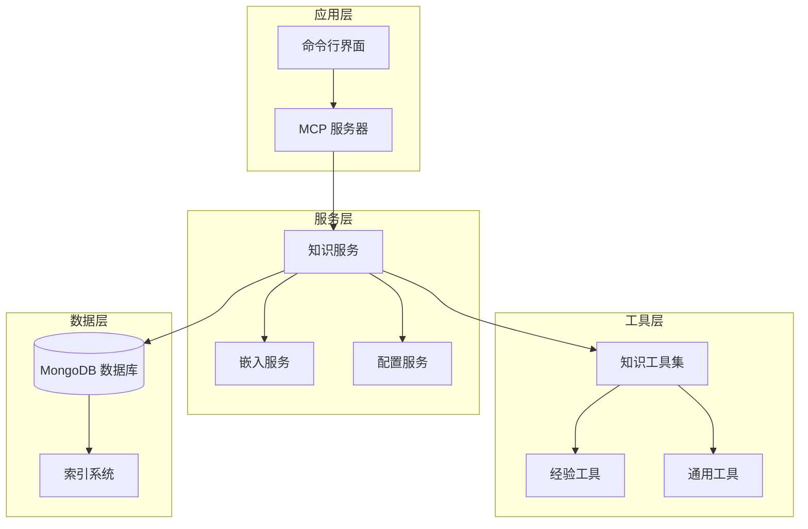
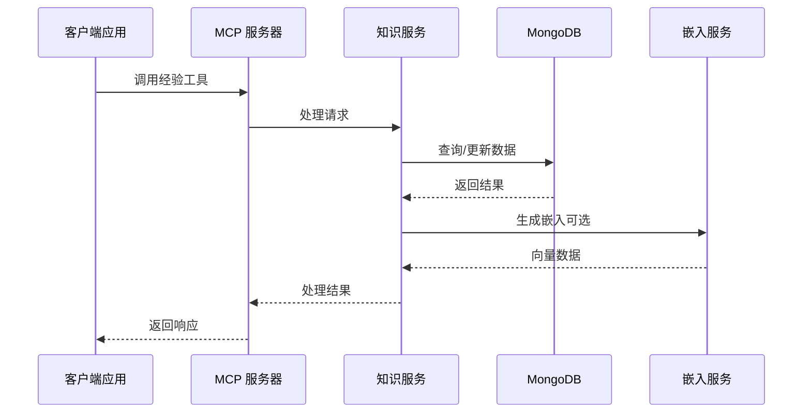
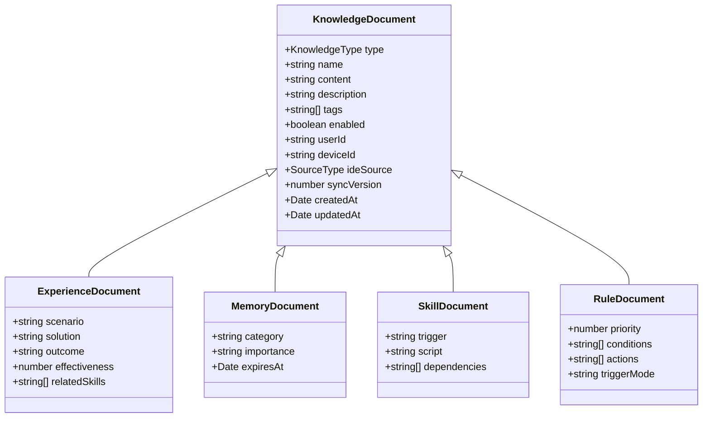
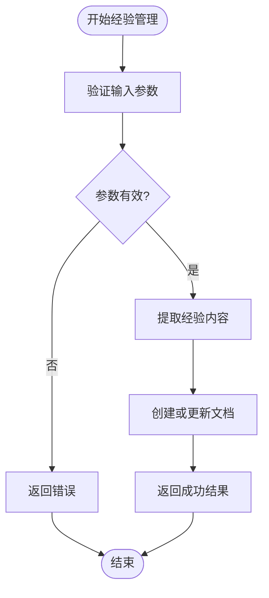
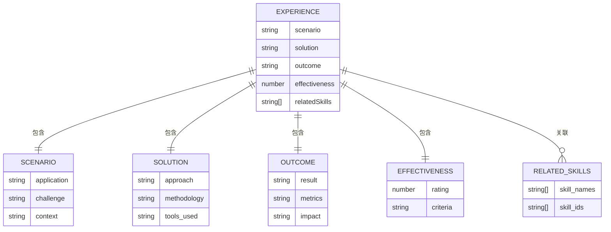
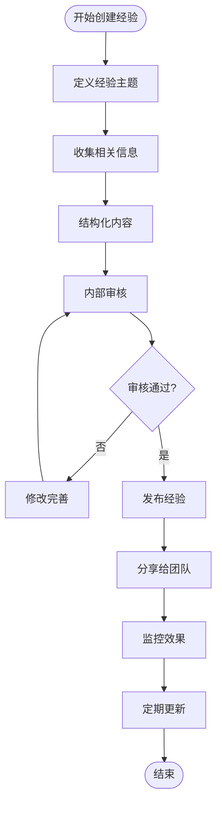
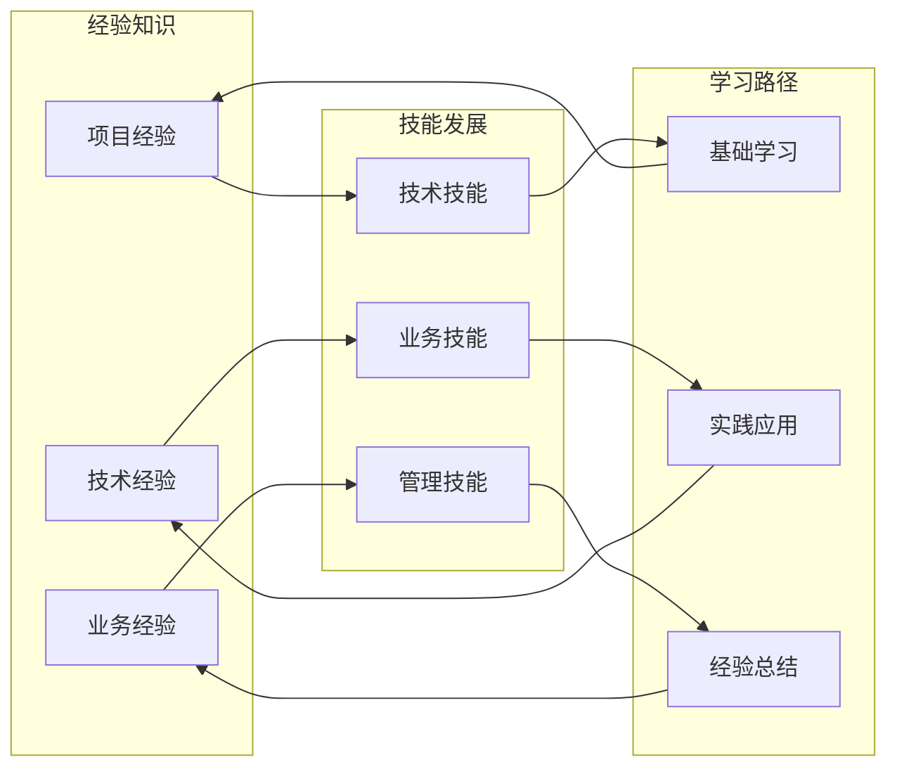
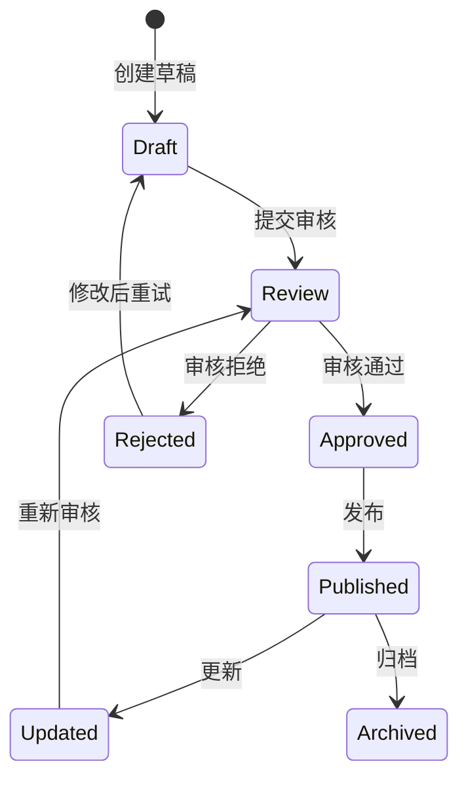

# 经验管理 (Experiences)

<cite>
**本文档引用的文件**
- [src/index.ts](file://src/index.ts)
- [src/types.ts](file://src/types.ts)
- [src/services/knowledge-service.ts](file://src/services/knowledge-service.ts)
- [src/tools/knowledge-tools.ts](file://src/tools/knowledge-tools.ts)
- [src/services/embedding-service.ts](file://src/services/embedding-service.ts)
- [src/utils/config.ts](file://src/utils/config.ts)
- [package.json](file://package.json)
- [examples/mcp-config.json](file://examples/mcp-config.json)
</cite>

## 目录
1. [简介](#简介)
2. [项目结构](#项目结构)
3. [核心组件](#核心组件)
4. [架构概览](#架构概览)
5. [详细组件分析](#详细组件分析)
6. [经验知识类型详解](#经验知识类型详解)
7. [经验文档结构规范](#经验文档结构规范)
8. [经验创建与分享流程](#经验创建与分享流程)
9. [经验与技能发展关联](#经验与技能发展关联)
10. [经验复用与传承](#经验复用与传承)
11. [知识库维护与更新策略](#知识库维护与更新策略)
12. [性能考虑](#性能考虑)
13. [故障排除指南](#故障排除指南)
14. [结论](#结论)

## 简介

经验管理系统（Experiences）是基于 MongoDB 的知识库管理工具，专门用于收集、整理和管理各类经验知识。该系统支持多种知识类型，其中经验（Experiences）作为核心知识类型，涵盖了项目经验、成功案例、失败教训、最佳实践等多种经验知识的收集和整理。

系统采用 Model Context Protocol (MCP) 架构，通过标准化的工具接口提供统一的知识管理能力，支持跨 IDE 和跨平台的无缝体验。每个知识类型都具有独特的结构和用途，但都遵循统一的数据模型和管理流程。

## 项目结构

经验管理系统采用模块化的架构设计，主要包含以下核心模块：

**图表来源**
- [src/index.ts](file://src/index.ts#L1-L148)
- [src/services/knowledge-service.ts](file://src/services/knowledge-service.ts#L1-L404)
- [src/tools/knowledge-tools.ts](file://src/tools/knowledge-tools.ts#L1-L1093)

**章节来源**
- [src/index.ts](file://src/index.ts#L1-L148)
- [package.json](file://package.json#L1-L48)

## 核心组件

系统的核心组件包括知识服务、嵌入服务、配置管理和工具集，这些组件协同工作以提供完整的经验管理能力。

### 知识服务 (KnowledgeService)

知识服务是系统的核心，负责管理所有类型的文档，包括经验知识。它提供了完整的 CRUD 操作、查询过滤、统计分析和嵌入生成功能。

### 嵌入服务 (EmbeddingService)

嵌入服务使用 Transformers.js 库生成文本向量，支持语义搜索和智能推荐功能。该服务采用懒加载模式，优化启动时间和内存使用。

### 配置服务 (ConfigService)

配置服务负责从环境变量加载和验证系统配置，支持多种 IDE 集成和部署场景。

### 工具集 (Knowledge Tools)

工具集提供了丰富的 MCP 工具，包括通用 CRUD 操作、经验管理专用工具、语义搜索工具等。

**章节来源**
- [src/services/knowledge-service.ts](file://src/services/knowledge-service.ts#L1-L404)
- [src/services/embedding-service.ts](file://src/services/embedding-service.ts#L1-L148)
- [src/utils/config.ts](file://src/utils/config.ts#L1-L147)

## 架构概览

系统采用分层架构设计，确保各层职责清晰、耦合度低：

**图表来源**
- [src/index.ts](file://src/index.ts#L16-L82)
- [src/services/knowledge-service.ts](file://src/services/knowledge-service.ts#L270-L299)

## 详细组件分析

### 知识类型定义

系统支持八种不同的知识类型，每种都有特定的用途和数据结构：

**图表来源**
- [src/types.ts](file://src/types.ts#L24-L74)
- [src/types.ts](file://src/types.ts#L136-L152)

**章节来源**
- [src/types.ts](file://src/types.ts#L1-L269)

### 经验工具实现

经验管理工具提供了专门的接口来创建、更新和查询经验知识：

**图表来源**
- [src/tools/knowledge-tools.ts](file://src/tools/knowledge-tools.ts#L508-L571)

**章节来源**
- [src/tools/knowledge-tools.ts](file://src/tools/knowledge-tools.ts#L508-L571)

## 经验知识类型详解

### 经验知识的价值

经验知识是组织和个人智慧的重要载体，具有以下价值：

- **避免重复犯错**：记录失败教训，帮助团队避免类似问题
- **传承最佳实践**：固化成功的经验和方法论
- **加速决策过程**：提供历史数据支撑新的决策
- **提升团队能力**：通过案例学习提升整体水平

### 经验类型分类

系统支持多种经验类型的分类：

1. **项目经验**：具体项目的实施经验和教训
2. **技术经验**：技术方案的选择和实施经验
3. **业务经验**：业务流程优化和改进经验
4. **团队协作经验**：团队管理和协作的最佳实践
5. **产品经验**：产品设计和用户体验的经验总结

**章节来源**
- [src/types.ts](file://src/types.ts#L136-L152)

## 经验文档结构规范

### 核心字段定义

经验文档遵循统一的结构规范，确保信息的完整性和一致性：

| 字段 | 类型 | 必填 | 描述 |
|------|------|------|------|
| type | 'Experiences' | 是 | 文档类型标识 |
| name | string | 是 | 经验名称（唯一标识） |
| content | object | 是 | 经验内容对象 |
| description | string | 否 | 经验描述 |
| tags | string[] | 否 | 标签列表 |
| enabled | boolean | 否 | 是否启用 |

### 内容对象结构

经验内容对象包含以下核心要素：

**图表来源**
- [src/types.ts](file://src/types.ts#L140-L152)

**章节来源**
- [src/types.ts](file://src/types.ts#L136-L152)

## 经验创建与分享流程

### 创建流程

经验创建遵循标准化的流程，确保质量控制和一致性：

### 分享机制

系统支持多种分享方式：

1. **标签分享**：通过标签进行分类分享
2. **权限控制**：基于用户和设备的访问控制
3. **版本管理**：支持经验的版本演进和历史追踪
4. **跨平台同步**：支持多设备和多 IDE 的同步

**章节来源**
- [src/tools/knowledge-tools.ts](file://src/tools/knowledge-tools.ts#L508-L571)

## 经验与技能发展关联

### 技能映射关系

经验知识与技能发展存在密切的关联关系：

### 学习循环

经验驱动的学习是一个持续的循环过程：

1. **经验积累**：通过实践获得经验
2. **知识整理**：将经验转化为结构化知识
3. **技能应用**：在新的情境中应用所学技能
4. **反馈改进**：根据应用效果调整和改进

**章节来源**
- [src/types.ts](file://src/types.ts#L140-L152)

## 经验复用与传承

### 复用机制

系统提供了多种经验复用机制：

1. **模板化**：将经验总结为可复用的模板
2. **标签化**：通过标签实现经验的快速检索
3. **关联化**：建立经验之间的关联关系
4. **自动化**：通过工具自动推荐相关经验

### 传承策略

经验传承需要系统性的策略：

1. **制度保障**：建立经验收集和分享的制度
2. **文化培养**：营造分享和学习的企业文化
3. **技术支持**：提供便捷的工具和平台
4. **激励机制**：建立经验贡献的激励机制

**章节来源**
- [src/services/knowledge-service.ts](file://src/services/knowledge-service.ts#L270-L299)

## 知识库维护与更新策略

### 数据维护

知识库的维护需要遵循以下策略：

1. **定期清理**：定期清理过时和无效的经验
2. **质量控制**：建立经验质量评估标准
3. **版本管理**：对重要的经验进行版本控制
4. **备份策略**：建立完善的数据备份机制

### 更新流程

经验的更新遵循严格的流程：

### 性能优化

系统提供了多种性能优化策略：

1. **索引优化**：针对常用查询建立合适的索引
2. **缓存机制**：对热点数据进行缓存
3. **批量操作**：支持批量导入和导出
4. **异步处理**：对耗时操作进行异步处理

**章节来源**
- [src/services/knowledge-service.ts](file://src/services/knowledge-service.ts#L71-L87)

## 性能考虑

### 嵌入性能

嵌入服务采用懒加载模式，优化启动时间和内存使用：

- **模型预加载**：首次使用时加载模型，后续使用直接调用
- **批量处理**：支持批量生成嵌入，提高处理效率
- **缓存机制**：对生成的嵌入进行缓存

### 查询优化

系统针对经验查询进行了专门的优化：

- **复合索引**：为常用查询组合建立复合索引
- **分页查询**：支持大数据量的分页查询
- **条件过滤**：支持多维度的条件过滤

### 内存管理

系统采用高效的内存管理策略：

- **流式处理**：对大文档进行流式处理
- **垃圾回收**：及时释放不再使用的资源
- **连接池**：复用数据库连接，减少开销

## 故障排除指南

### 常见问题

1. **连接失败**：检查 MongoDB 连接字符串和网络配置
2. **权限问题**：验证用户权限和认证配置
3. **性能问题**：检查索引配置和查询优化
4. **嵌入失败**：确认模型加载和 GPU/CPU 资源

### 调试方法

系统提供了完善的调试和诊断功能：

- **日志记录**：详细的日志输出便于问题定位
- **状态监控**：实时监控系统运行状态
- **性能分析**：提供性能分析工具和指标
- **错误报告**：友好的错误信息和解决方案

**章节来源**
- [src/utils/config.ts](file://src/utils/config.ts#L120-L146)

## 结论

经验管理系统为组织和个人提供了完整的经验知识管理解决方案。通过标准化的文档结构、丰富的工具集和智能化的功能，系统能够有效地收集、整理、存储和利用各类经验知识。

系统的核心优势包括：

1. **标准化**：统一的文档结构和管理流程
2. **智能化**：支持语义搜索和智能推荐
3. **可扩展性**：模块化的架构设计，易于扩展
4. **跨平台**：支持多种 IDE 和部署环境
5. **易用性**：简洁的 API 接口和丰富的工具

通过持续的优化和改进，经验管理系统将成为组织知识管理的重要基础设施，为提升团队能力和组织竞争力提供有力支撑。