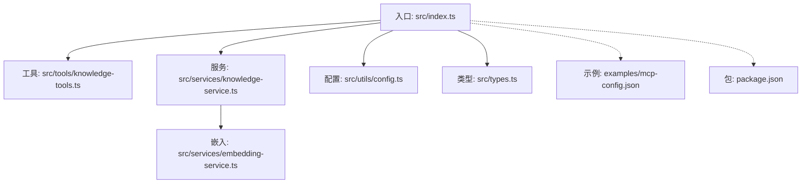
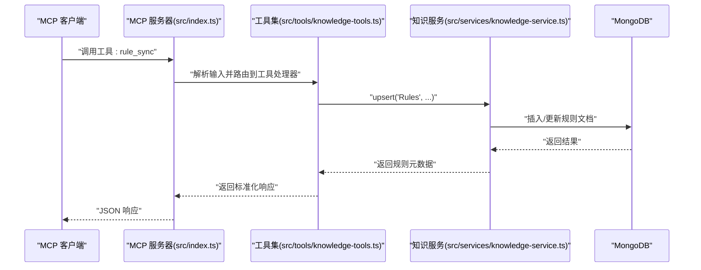
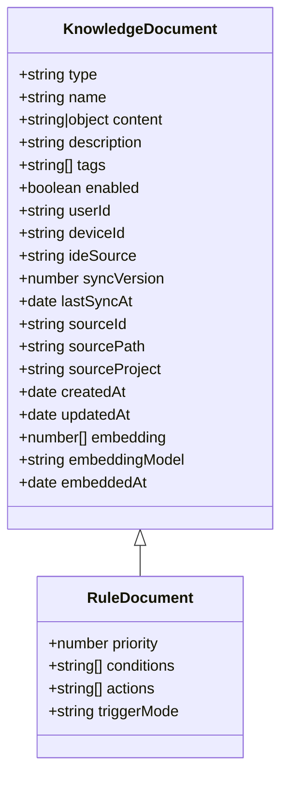
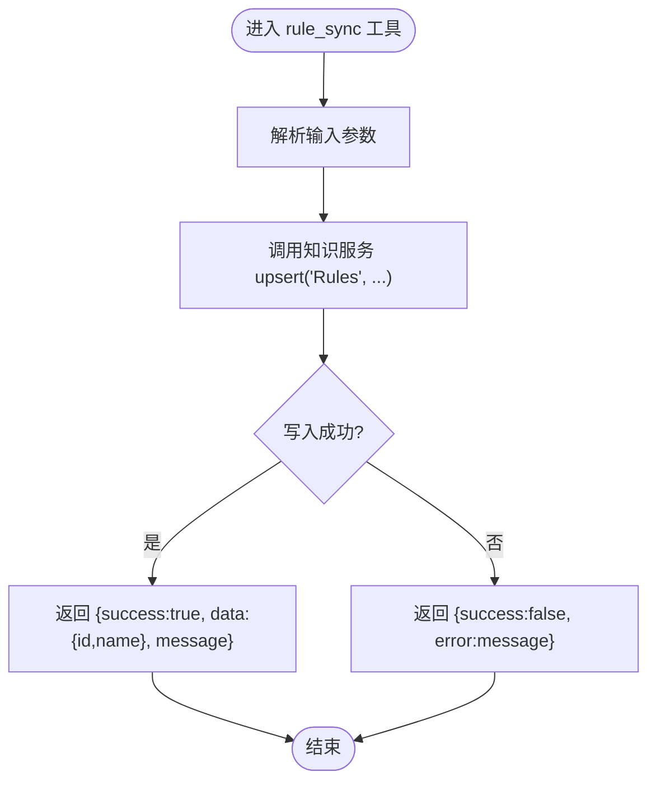
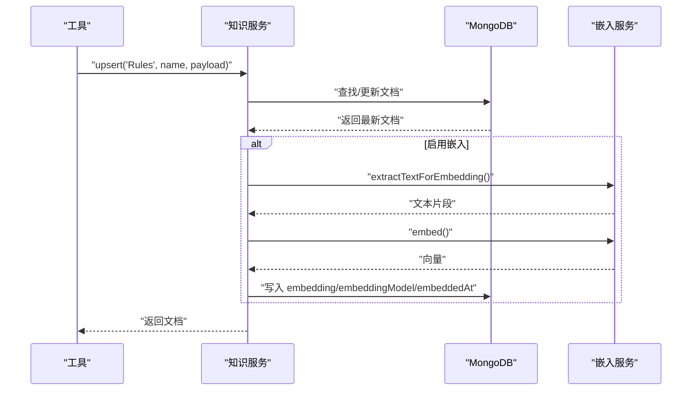
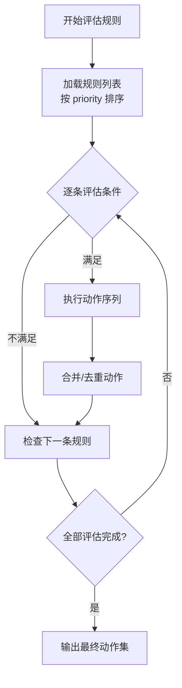
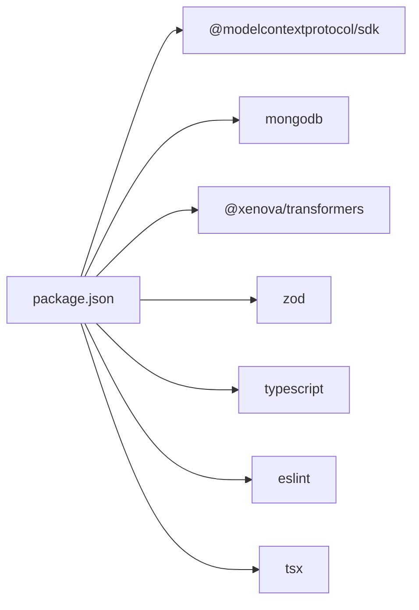

# 规则管理 (Rules)

<cite>
**本文引用的文件**
- [src/index.ts](file://src/index.ts)
- [src/types.ts](file://src/types.ts)
- [src/services/knowledge-service.ts](file://src/services/knowledge-service.ts)
- [src/tools/knowledge-tools.ts](file://src/tools/knowledge-tools.ts)
- [src/utils/config.ts](file://src/utils/config.ts)
- [src/services/embedding-service.ts](file://src/services/embedding-service.ts)
- [examples/mcp-config.json](file://examples/mcp-config.json)
- [package.json](file://package.json)
</cite>

## 目录
1. [简介](#简介)
2. [项目结构](#项目结构)
3. [核心组件](#核心组件)
4. [架构总览](#架构总览)
5. [详细组件分析](#详细组件分析)
6. [依赖关系分析](#依赖关系分析)
7. [性能考量](#性能考量)
8. [故障排查指南](#故障排查指南)
9. [结论](#结论)
10. [附录](#附录)

## 简介
本文件面向“规则管理（Rules）”主题，系统化阐述该知识类型的建模理念、数据结构、工具链能力与执行机制，并给出规则创建、维护、测试与版本管理的实操指南。规则作为行为约束与触发条件的载体，贯穿于业务规则、技术规范与工作流程规则的制定与执行。本文将结合代码实现，解释规则文档的结构（规则表达式、触发条件、执行动作、优先级等），以及规则引擎在本项目中的工作机制与执行顺序；同时覆盖冲突检测与解决策略、与自动化工具的集成方式与最佳实践。

## 项目结构
本项目采用分层模块化设计：
- 入口与协议适配：通过 MCP 协议以 stdio 模式提供工具能力
- 知识服务：统一管理八种知识类型（含 Rules），提供 CRUD、统计、语义检索、嵌入生成等能力
- 工具集：封装为 MCP 工具，暴露知识库操作与规则同步等能力
- 配置与日志：从环境变量加载配置，支持日志级别控制
- 示例：IDE 集成配置样例，展示多 IDE 的接入方式

图表来源
- [src/index.ts](file://src/index.ts#L1-L148)
- [src/tools/knowledge-tools.ts](file://src/tools/knowledge-tools.ts#L1-L1093)
- [src/services/knowledge-service.ts](file://src/services/knowledge-service.ts#L1-L404)
- [src/services/embedding-service.ts](file://src/services/embedding-service.ts#L1-L148)
- [src/utils/config.ts](file://src/utils/config.ts#L1-L147)
- [src/types.ts](file://src/types.ts#L1-L269)
- [examples/mcp-config.json](file://examples/mcp-config.json#L1-L94)
- [package.json](file://package.json#L1-L48)

章节来源
- [src/index.ts](file://src/index.ts#L1-L148)
- [src/tools/knowledge-tools.ts](file://src/tools/knowledge-tools.ts#L1-L1093)
- [src/services/knowledge-service.ts](file://src/services/knowledge-service.ts#L1-L404)
- [src/utils/config.ts](file://src/utils/config.ts#L1-L147)
- [examples/mcp-config.json](file://examples/mcp-config.json#L1-L94)
- [package.json](file://package.json#L1-L48)

## 核心组件
- 规则文档模型（RuleDocument）
  - 类型字段：type = 'Rules'
  - 关键字段：priority（优先级）、conditions（条件列表）、actions（动作列表）、triggerMode（触发方式）
- 知识服务（KnowledgeService）
  - 提供 create/update/delete/list/count/upsert/bulkImport/bulkExport/semanticSearch/generateEmbeddings 等能力
  - 支持用户隔离与跨设备同步（基于 userId/deviceId/ideSource）
- 规则同步工具（rule_sync）
  - 将规则内容同步至数据库，支持优先级与触发模式设置
- 嵌入服务（EmbeddingService）
  - 基于 Transformers.js 的特征提取，支持批量嵌入与余弦相似度计算，用于语义搜索

章节来源
- [src/types.ts](file://src/types.ts#L120-L134)
- [src/services/knowledge-service.ts](file://src/services/knowledge-service.ts#L1-L404)
- [src/tools/knowledge-tools.ts](file://src/tools/knowledge-tools.ts#L760-L822)
- [src/services/embedding-service.ts](file://src/services/embedding-service.ts#L1-L148)

## 架构总览
规则管理在本系统中的运行时架构如下：
- MCP 客户端通过 stdio 与服务器交互
- 服务器注册工具集，其中包含规则同步工具
- 规则同步工具调用知识服务，将规则写入数据库
- 知识服务负责用户上下文注入、索引管理、语义检索与嵌入生成

图表来源
- [src/index.ts](file://src/index.ts#L16-L82)
- [src/tools/knowledge-tools.ts](file://src/tools/knowledge-tools.ts#L760-L822)
- [src/services/knowledge-service.ts](file://src/services/knowledge-service.ts#L384-L402)

章节来源
- [src/index.ts](file://src/index.ts#L1-L148)
- [src/tools/knowledge-tools.ts](file://src/tools/knowledge-tools.ts#L760-L822)
- [src/services/knowledge-service.ts](file://src/services/knowledge-service.ts#L1-L404)

## 详细组件分析

### 规则文档模型与结构
- 类型字段：type = 'Rules'
- 关键字段
  - priority：数值越小优先级越高
  - conditions：规则表达式或条件片段集合
  - actions：规则触发后的动作集合
  - triggerMode：触发方式，支持 always_on、auto_attached、agent_requested、manual
- 元数据与同步
  - enabled：是否启用
  - tags：标签
  - syncVersion：同步版本号，每次更新递增
  - embedding/embeddingModel/embeddedAt：嵌入相关字段，用于语义检索

图表来源
- [src/types.ts](file://src/types.ts#L24-L74)
- [src/types.ts](file://src/types.ts#L124-L134)

章节来源
- [src/types.ts](file://src/types.ts#L120-L134)

### 规则同步工具（rule_sync）
- 输入参数
  - name、content（规则文本）、description、priority、triggerMode、tags
- 处理逻辑
  - 将 content 包装为 { text, priority, triggerMode } 并调用 upsert('Rules', ...)
  - 返回标准化响应（success/data/message/error）

图表来源
- [src/tools/knowledge-tools.ts](file://src/tools/knowledge-tools.ts#L760-L822)
- [src/services/knowledge-service.ts](file://src/services/knowledge-service.ts#L384-L402)

章节来源
- [src/tools/knowledge-tools.ts](file://src/tools/knowledge-tools.ts#L760-L822)
- [src/services/knowledge-service.ts](file://src/services/knowledge-service.ts#L384-L402)

### 知识服务（规则相关能力）
- 用户上下文注入：在创建/更新时自动填充 userId/deviceId/ideSource
- upsert：若存在则更新，否则创建
- 列表与过滤：支持按 type/tags/enabled/search 等条件查询
- 语义检索：基于嵌入相似度的检索与排序
- 嵌入生成：为文档生成向量表示，便于语义搜索

图表来源
- [src/services/knowledge-service.ts](file://src/services/knowledge-service.ts#L384-L402)
- [src/services/knowledge-service.ts](file://src/services/knowledge-service.ts#L272-L299)
- [src/services/knowledge-service.ts](file://src/services/knowledge-service.ts#L304-L341)
- [src/services/embedding-service.ts](file://src/services/embedding-service.ts#L109-L129)
- [src/services/embedding-service.ts](file://src/services/embedding-service.ts#L56-L65)

章节来源
- [src/services/knowledge-service.ts](file://src/services/knowledge-service.ts#L1-L404)
- [src/services/embedding-service.ts](file://src/services/embedding-service.ts#L1-L148)

### 规则引擎工作机制与执行顺序
- 触发方式（triggerMode）
  - always_on：始终生效
  - auto_attached：自动附加
  - agent_requested：由代理请求触发
  - manual：手动触发
- 优先级（priority）
  - 数值越小优先级越高
- 执行顺序建议
  - 按 priority 升序排序
  - 在同一优先级内，按规则启用状态与最后更新时间进行二次排序
  - 条件求值采用短路策略（从左到右）
  - 动作执行遵循声明顺序，注意副作用与幂等性
- 冲突检测与解决
  - 规则间冲突通常表现为对同一资源的互斥修改
  - 解决策略
    - 优先级裁决：高优先级覆盖低优先级
    - 互斥标记：为互斥规则设定互斥组，同一组内仅保留最高优先级
    - 动作去重：对重复动作进行合并或跳过
    - 回滚清单：记录动作影响，支持失败回滚

图表来源
- [src/types.ts](file://src/types.ts#L124-L134)

章节来源
- [src/types.ts](file://src/types.ts#L120-L134)

### 规则创建与维护指南
- 规则语法
  - conditions/actions 建议采用简洁表达式，支持布尔组合与函数调用占位
  - content.text 作为规则正文，可包含自然语言描述与结构化片段
- 测试方法
  - 单元测试：针对条件求值与动作执行的边界场景
  - 集成测试：通过工具链模拟 MCP 请求，验证 upsert 与读取流程
  - 场景回归：构造冲突场景，验证优先级与互斥策略
- 版本管理
  - 使用 syncVersion 追踪变更
  - 通过 enabled 字段实现灰度与回滚
  - tags 用于规则分组与检索

章节来源
- [src/tools/knowledge-tools.ts](file://src/tools/knowledge-tools.ts#L760-L822)
- [src/services/knowledge-service.ts](file://src/services/knowledge-service.ts#L384-L402)

### 规则与自动化工具的集成与最佳实践
- 工具命名与设计
  - 使用 snake_case，带服务前缀，动词开头，具体资源
  - 描述准确且不含歧义，必要时提供注解提示
- 响应格式
  - 支持 JSON 与 Markdown，便于程序处理与人类阅读
- 传输与安全
  - 本地集成推荐 stdio，远程部署推荐可流式的 HTTP
  - 严格输入校验与错误处理，避免泄露内部细节
- 配置与日志
  - 通过环境变量注入配置，支持日志级别控制
  - 多 IDE 集成参考示例配置文件

章节来源
- [src/tools/knowledge-tools.ts](file://src/tools/knowledge-tools.ts#L1-L1093)
- [examples/mcp-config.json](file://examples/mcp-config.json#L1-L94)
- [src/utils/config.ts](file://src/utils/config.ts#L1-L147)

## 依赖关系分析
- 运行时依赖
  - @modelcontextprotocol/sdk：MCP 协议实现
  - mongodb：数据库访问
  - @xenova/transformers：嵌入模型加载与特征提取
  - zod：输入校验（在工具层使用）
- 开发依赖
  - TypeScript、ESLint、TSX 等

图表来源
- [package.json](file://package.json#L30-L47)

章节来源
- [package.json](file://package.json#L1-L48)

## 性能考量
- 嵌入生成
  - 批量生成嵌入时注意内存占用与并发度，建议分批处理
  - 余弦相似度计算复杂度与向量维度相关，合理选择模型与维度
- 查询与排序
  - 语义检索需过滤 embedding 存在的文档，建议在高基数场景下限制返回数量
  - 列表查询支持 limit/offset，避免一次性加载全部结果
- 索引与存储
  - 用户级唯一索引与复合索引有助于提升查询性能
  - 合理使用 enabled/tags 等字段进行过滤

章节来源
- [src/services/knowledge-service.ts](file://src/services/knowledge-service.ts#L71-L87)
- [src/services/knowledge-service.ts](file://src/services/knowledge-service.ts#L272-L299)
- [src/services/embedding-service.ts](file://src/services/embedding-service.ts#L56-L104)

## 故障排查指南
- 配置问题
  - 检查 MONGO_URI/MONGO_DATABASE/MONGO_COLLECTION 是否正确
  - 日志级别可通过 LOG_LEVEL 控制
- 工具调用异常
  - rule_sync 返回 error 时，检查必填字段与内容格式
  - knowledge_* 工具返回不存在或唯一键冲突时，核对 type/name 组合
- 嵌入相关
  - 若语义搜索无结果，确认已生成嵌入且阈值设置合理
  - 模型加载耗时较长属正常现象，建议预热

章节来源
- [src/utils/config.ts](file://src/utils/config.ts#L96-L115)
- [src/tools/knowledge-tools.ts](file://src/tools/knowledge-tools.ts#L796-L821)
- [src/services/knowledge-service.ts](file://src/services/knowledge-service.ts#L313-L341)

## 结论
本系统以“规则（Rules）”为核心知识类型之一，通过统一的知识服务与 MCP 工具集，实现了规则的创建、同步、查询与语义检索。规则文档模型清晰地承载了优先级、条件、动作与触发方式等关键要素；配合嵌入服务与索引策略，能够支撑高效的规则匹配与执行。建议在实际落地中，结合业务场景完善规则语法与测试体系，建立冲突检测与解决机制，并通过工具命名与响应格式规范提升自动化集成体验。

## 附录
- IDE 集成示例
  - Qoder/Cursor/VS Code 等 IDE 的 MCP 配置示例
- 最佳实践
  - 工具命名、响应格式、分页、传输与安全等方面的规范

章节来源
- [examples/mcp-config.json](file://examples/mcp-config.json#L1-L94)
- [src/tools/knowledge-tools.ts](file://src/tools/knowledge-tools.ts#L1-L1093)