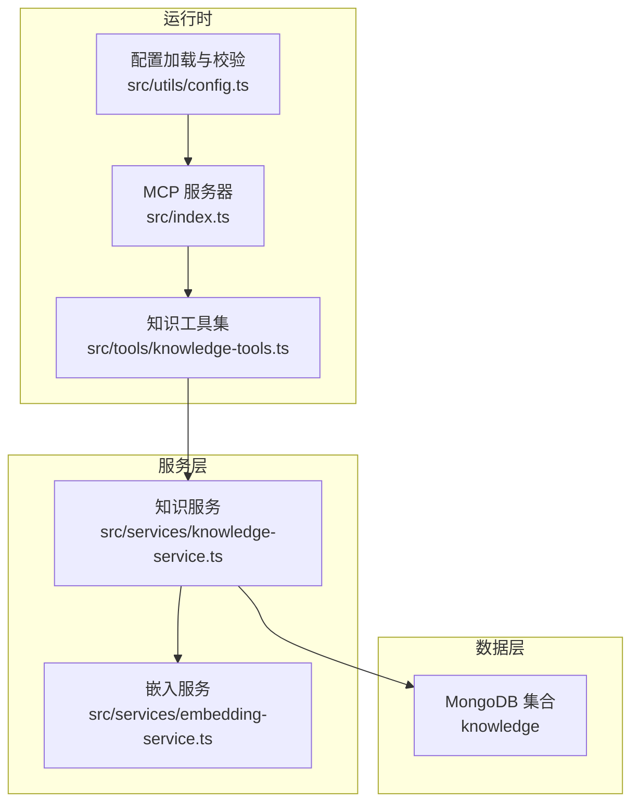
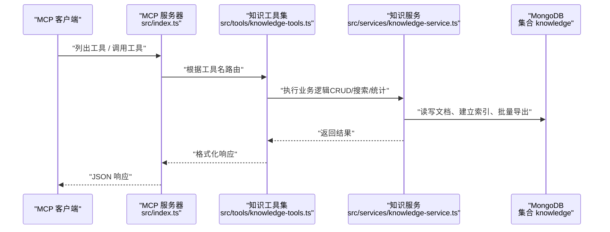
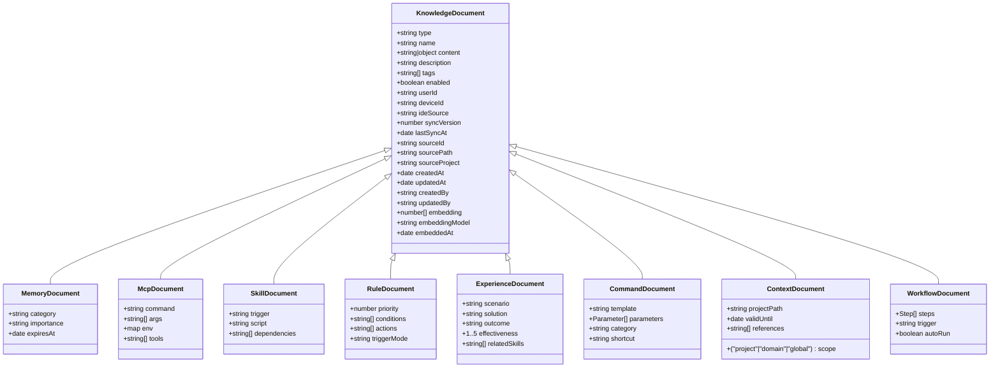
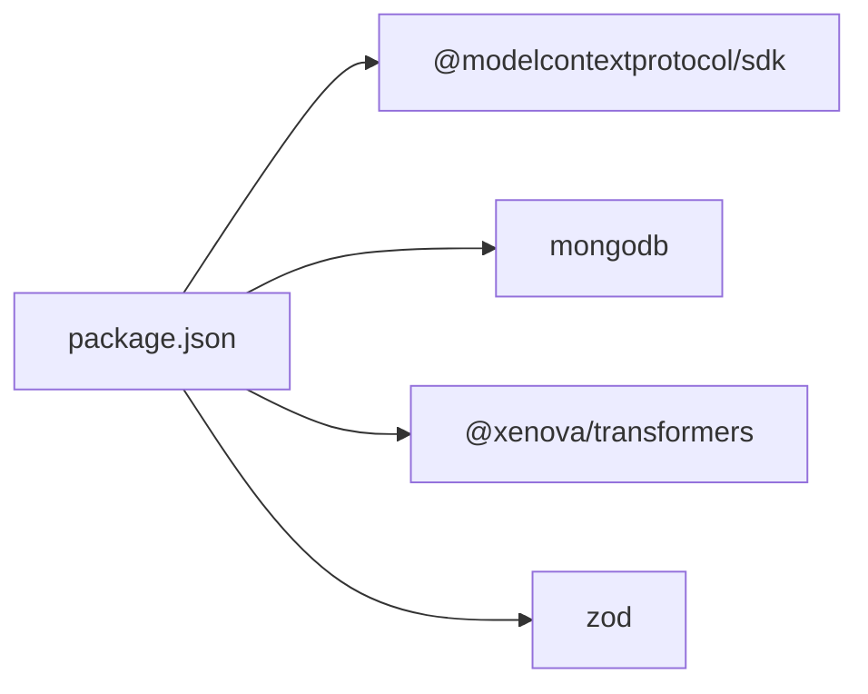

# 记忆管理 (Memories)

<cite>
**本文引用的文件**
- [src/types.ts](file://src/types.ts)
- [src/services/knowledge-service.ts](file://src/services/knowledge-service.ts)
- [src/tools/knowledge-tools.ts](file://src/tools/knowledge-tools.ts)
- [src/services/embedding-service.ts](file://src/services/embedding-service.ts)
- [src/index.ts](file://src/index.ts)
- [src/utils/config.ts](file://src/utils/config.ts)
- [package.json](file://package.json)
- [examples/mcp-config.json](file://examples/mcp-config.json)
</cite>

## 目录
1. [简介](#简介)
2. [项目结构](#项目结构)
3. [核心组件](#核心组件)
4. [架构总览](#架构总览)
5. [详细组件分析](#详细组件分析)
6. [依赖关系分析](#依赖关系分析)
7. [性能考虑](#性能考虑)
8. [故障排查指南](#故障排查指南)
9. [结论](#结论)
10. [附录](#附录)

## 简介
本文件面向“记忆管理 (Memories)”知识类型，系统性阐述其设计目标、数据结构、存储与管理流程、组织与分类策略、搜索能力以及与其他知识类型的关联与引用机制。该系统以 MongoDB 为持久化层，通过 MCP（Model Context Protocol）工具接口对外提供统一的知识管理能力，支持跨 IDE、跨设备的用户隔离与同步。

记忆（Memories）用于记录个人经验、学习笔记、项目回顾、偏好设置等非结构化或半结构化的知识片段，便于后续检索与复用。系统通过统一的知识文档模型抽象，将不同类型的文档（Memories、Skills、Rules、MCPs、Experiences、Commands、Contexts、Workflows）进行统一管理，并提供 CRUD、批量导出、统计、语义搜索等能力。

## 项目结构
- 入口与协议适配：MCP 服务器入口负责解析客户端请求、注册工具并处理调用。
- 知识服务：封装 MongoDB 连接、索引、CRUD、统计、批量导出、语义搜索与嵌入生成。
- 工具集：提供通用 CRUD 工具与针对各知识类型的快捷工具（如 memory_add、memory_search 等），并在启用嵌入时提供语义搜索与嵌入生成工具。
- 嵌入服务：基于 Transformers.js 的特征提取，计算文本向量与余弦相似度。
- 配置与日志：从环境变量加载配置，校验并输出日志。

图表来源
- [src/index.ts](file://src/index.ts#L16-L82)
- [src/tools/knowledge-tools.ts](file://src/tools/knowledge-tools.ts#L29-L32)
- [src/services/knowledge-service.ts](file://src/services/knowledge-service.ts#L20-L40)
- [src/services/embedding-service.ts](file://src/services/embedding-service.ts#L11-L19)
- [src/utils/config.ts](file://src/utils/config.ts#L76-L91)

章节来源
- [src/index.ts](file://src/index.ts#L1-L148)
- [src/utils/config.ts](file://src/utils/config.ts#L1-L147)

## 核心组件
- 知识类型枚举与基础文档接口：定义了 8 种知识类型及通用字段，Memory 文档继承自通用接口并扩展分类、重要性、过期时间等字段。
- 知识服务：提供连接、断开、索引、CRUD、列表、统计、批量导出、存在性检查、Upsert、语义搜索、嵌入生成与批量嵌入等功能。
- 知识工具集：提供通用 CRUD 工具与各知识类型的快捷工具；当启用嵌入时，追加语义搜索与嵌入生成工具。
- 嵌入服务：基于 Transformers.js 的特征提取，支持单次与批量嵌入、余弦相似度计算与文本抽取。
- 配置与日志：从环境变量加载配置，校验必填项，按日志级别输出。

章节来源
- [src/types.ts](file://src/types.ts#L6-L74)
- [src/services/knowledge-service.ts](file://src/services/knowledge-service.ts#L20-L404)
- [src/tools/knowledge-tools.ts](file://src/tools/knowledge-tools.ts#L29-L1093)
- [src/services/embedding-service.ts](file://src/services/embedding-service.ts#L11-L148)
- [src/utils/config.ts](file://src/utils/config.ts#L76-L147)

## 架构总览
系统采用“MCP 服务器 + 知识服务 + 嵌入服务 + MongoDB”的分层架构。MCP 服务器作为统一入口，将客户端请求映射到知识工具集；知识工具集调用知识服务完成数据操作；知识服务负责与 MongoDB 交互，并在需要时调用嵌入服务生成向量；配置模块负责加载与校验运行参数。

图表来源
- [src/index.ts](file://src/index.ts#L40-L79)
- [src/tools/knowledge-tools.ts](file://src/tools/knowledge-tools.ts#L36-L107)
- [src/services/knowledge-service.ts](file://src/services/knowledge-service.ts#L111-L127)

## 详细组件分析

### Memory 文档数据结构与字段说明
Memory 文档继承通用知识文档接口，扩展如下字段：
- 分类（category）：用于区分偏好、历史、事实、上下文等。
- 重要程度（importance）：low/medium/high，辅助筛选与排序。
- 过期时间（expiresAt）：用于生命周期管理，便于清理过期记忆。

通用字段（来自基础接口）包括但不限于：
- 类型（type）、名称（name）、内容（content）、描述（description）、标签（tags）、启用状态（enabled）
- 用户标识（userId）、设备标识（deviceId）、IDE 来源（ideSource）
- 同步版本（syncVersion）、最后同步时间（lastSyncAt）
- 来源系统中的原始 ID（sourceId）、来源文件路径（sourcePath）、来源项目（sourceProject）
- 创建与更新时间戳（createdAt、updatedAt）、创建者与更新者（createdBy、updatedBy）
- 向量嵌入（embedding）、嵌入模型（embeddingModel）、嵌入生成时间（embeddedAt）

这些字段共同构成跨设备、跨 IDE 的用户隔离与同步能力，确保同一用户的记忆在不同终端与 IDE 中保持一致。

章节来源
- [src/types.ts](file://src/types.ts#L77-L88)
- [src/types.ts](file://src/types.ts#L24-L74)

### 记忆的组织与分类策略
- 分类（category）：建议使用语义明确的分类，如 preference、history、fact、context 等，便于检索与筛选。
- 标签（tags）：结合分类与具体主题打标，支持多维过滤与聚合统计。
- 重要程度（importance）：用于优先级排序与筛选，帮助快速定位高价值记忆。
- 过期时间（expiresAt）：对时效性强的记忆设置过期时间，配合定期清理策略。

章节来源
- [src/types.ts](file://src/types.ts#L82-L87)
- [src/tools/knowledge-tools.ts](file://src/tools/knowledge-tools.ts#L403-L460)

### 记忆创建、更新、删除与查询实现示例（路径指引）
- 创建记忆（Upsert）：使用工具 memory_add 或 knowledge_upsert，内部调用知识服务的 upsert 方法。
- 读取记忆：使用工具 knowledge_read，内部调用知识服务的 get 方法。
- 更新记忆：使用工具 knowledge_update，内部调用知识服务的 update 方法。
- 删除记忆：使用工具 knowledge_delete，内部调用知识服务的 delete 方法。
- 列表与搜索：使用工具 knowledge_list，内部调用知识服务的 list 方法；若启用嵌入，可使用 semantic_search 进行语义检索。

章节来源
- [src/tools/knowledge-tools.ts](file://src/tools/knowledge-tools.ts#L403-L460)
- [src/tools/knowledge-tools.ts](file://src/tools/knowledge-tools.ts#L109-L215)
- [src/tools/knowledge-tools.ts](file://src/tools/knowledge-tools.ts#L247-L309)
- [src/services/knowledge-service.ts](file://src/services/knowledge-service.ts#L384-L402)
- [src/services/knowledge-service.ts](file://src/services/knowledge-service.ts#L132-L150)
- [src/services/knowledge-service.ts](file://src/services/knowledge-service.ts#L155-L177)
- [src/services/knowledge-service.ts](file://src/services/knowledge-service.ts#L182-L190)
- [src/services/knowledge-service.ts](file://src/services/knowledge-service.ts#L195-L216)
- [src/services/knowledge-service.ts](file://src/services/knowledge-service.ts#L272-L299)

### 记忆搜索功能使用方法与最佳实践
- 结构化搜索：通过 knowledge_list 搭配 search、tags、enabled、limit、offset 等参数进行过滤与分页。
- 语义搜索：在启用嵌入时，使用 semantic_search 对查询文本生成向量并与已有文档的 embedding 字段计算余弦相似度，按阈值与数量限制返回结果。
- 嵌入生成：使用 generate_embeddings 为现有文档批量生成向量；首次使用语义搜索前需确保文档具备 embedding 字段。
- 最佳实践：
  - 为高频检索的记忆生成嵌入；
  - 合理设置相似度阈值与返回数量；
  - 使用分类与标签双维度过滤，提升召回质量；
  - 对时效性强的记忆设置 expiresAt 并定期清理。

章节来源
- [src/tools/knowledge-tools.ts](file://src/tools/knowledge-tools.ts#L1000-L1089)
- [src/services/knowledge-service.ts](file://src/services/knowledge-service.ts#L272-L299)
- [src/services/knowledge-service.ts](file://src/services/knowledge-service.ts#L313-L341)
- [src/services/embedding-service.ts](file://src/services/embedding-service.ts#L85-L104)

### 记忆与其他知识类型的关联与引用机制
- 关联字段：部分知识类型（如 Experience、Command、Context、Workflow、Rule、Skill、MCPs）支持通过 tags 或 content 中的引用字段与记忆建立弱关联，便于跨类型检索与组合使用。
- 统一命名空间：所有知识类型共享相同的 type + name 唯一约束（在同一用户维度内），避免重名冲突，便于跨类型引用与导航。
- 查询与过滤：通过 knowledge_list 的 type、tags、enabled、search 等参数，可实现跨类型的聚合查询与过滤，从而发现潜在关联。

章节来源
- [src/types.ts](file://src/types.ts#L6-L14)
- [src/types.ts](file://src/types.ts#L140-L152)
- [src/types.ts](file://src/types.ts#L158-L174)
- [src/types.ts](file://src/types.ts#L180-L190)
- [src/types.ts](file://src/types.ts#L196-L210)
- [src/services/knowledge-service.ts](file://src/services/knowledge-service.ts#L195-L216)

### 类图：知识类型与文档模型

图表来源
- [src/types.ts](file://src/types.ts#L24-L74)
- [src/types.ts](file://src/types.ts#L77-L88)
- [src/types.ts](file://src/types.ts#L94-L104)
- [src/types.ts](file://src/types.ts#L110-L118)
- [src/types.ts](file://src/types.ts#L124-L134)
- [src/types.ts](file://src/types.ts#L140-L152)
- [src/types.ts](file://src/types.ts#L158-L174)
- [src/types.ts](file://src/types.ts#L180-L190)
- [src/types.ts](file://src/types.ts#L196-L210)

## 依赖关系分析
- 运行时依赖：@modelcontextprotocol/sdk（MCP 协议）、mongodb（MongoDB 驱动）、@xenova/transformers（嵌入模型）、zod（类型校验）。
- 开发依赖：TypeScript、ESLint、TSX（开发热重载）。
- 项目入口通过 package.json 的 bin 字段暴露命令行入口，支持构建与开发模式。

图表来源
- [package.json](file://package.json#L30-L43)

章节来源
- [package.json](file://package.json#L1-L48)

## 性能考虑
- 索引策略：知识服务在用户维度上建立了多项索引（type+name 唯一、type、deviceId、tags、updatedAt），有助于加速查询与排序。
- 嵌入生成：嵌入生成为 CPU 密集型任务，建议在后台批处理或按需生成；可通过 generate_embeddings 指定类型范围，减少计算量。
- 语义搜索：余弦相似度计算复杂度与向量维度相关，建议控制 embedding 维度与返回数量，合理设置阈值。
- 批量操作：bulkImport/bulkExport 适合大规模迁移与备份，注意内存与网络带宽占用。

章节来源
- [src/services/knowledge-service.ts](file://src/services/knowledge-service.ts#L71-L87)
- [src/services/knowledge-service.ts](file://src/services/knowledge-service.ts#L244-L267)
- [src/services/knowledge-service.ts](file://src/services/knowledge-service.ts#L313-L341)
- [src/services/embedding-service.ts](file://src/services/embedding-service.ts#L85-L104)

## 故障排查指南
- 连接失败：检查 MONGO_URI、MONGO_DATABASE、MONGO_COLLECTION 是否正确；确认 MongoDB 可访问且认证通过。
- 工具调用错误：查看 MCP 客户端返回的错误信息，常见为重复名称（type+name 唯一）或文档不存在。
- 嵌入未生效：确认 ENABLE_EMBEDDING 已开启，并先执行 generate_embeddings 为文档生成 embedding。
- 日志级别：通过 LOG_LEVEL 控制输出详细程度，便于定位问题。

章节来源
- [src/utils/config.ts](file://src/utils/config.ts#L96-L115)
- [src/tools/knowledge-tools.ts](file://src/tools/knowledge-tools.ts#L99-L106)
- [src/tools/knowledge-tools.ts](file://src/tools/knowledge-tools.ts#L205-L214)
- [src/tools/knowledge-tools.ts](file://src/tools/knowledge-tools.ts#L1037-L1055)

## 结论
记忆管理（Memories）作为统一知识库中的重要一环，通过标准化的数据结构与工具集，实现了跨 IDE、跨设备的用户隔离与同步。结合标签、分类、重要性与过期时间等策略，能够有效组织与检索个人经验与学习笔记；在启用嵌入的情况下，语义搜索进一步提升了检索的准确性与效率。建议在实际使用中结合业务场景合理规划分类与标签体系，并定期维护嵌入与清理过期内容，以获得最佳体验。

## 附录
- 配置示例：参考 examples/mcp-config.json，了解在不同 IDE 中的配置方式与环境变量设置。
- 工具清单：通用 CRUD、统计、导出、记忆快捷工具、经验/命令/上下文/MCP/规则/技能/工作流同步工具，以及在启用嵌入时的语义搜索与嵌入生成工具。

章节来源
- [examples/mcp-config.json](file://examples/mcp-config.json#L1-L94)
- [src/tools/knowledge-tools.ts](file://src/tools/knowledge-tools.ts#L29-L1093)