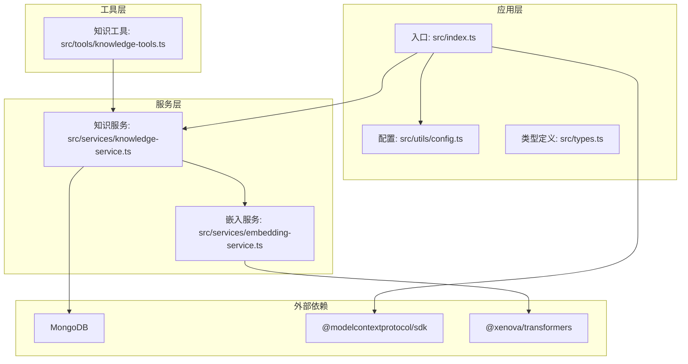
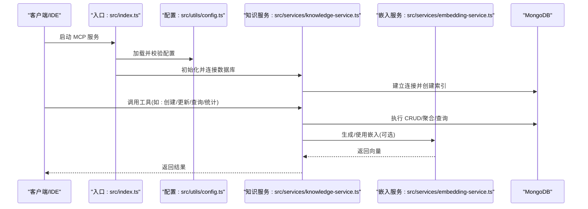
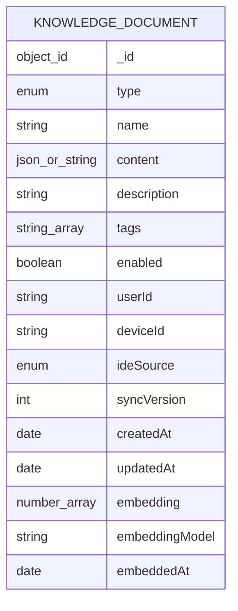
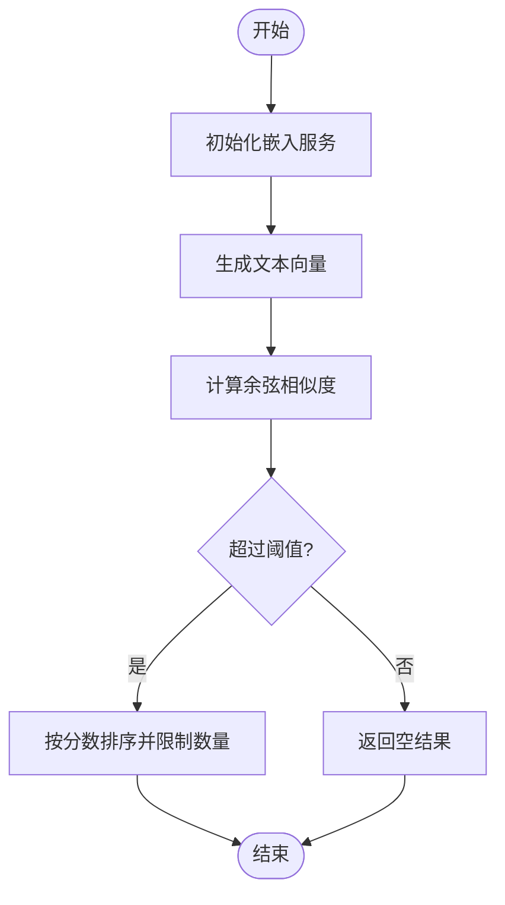
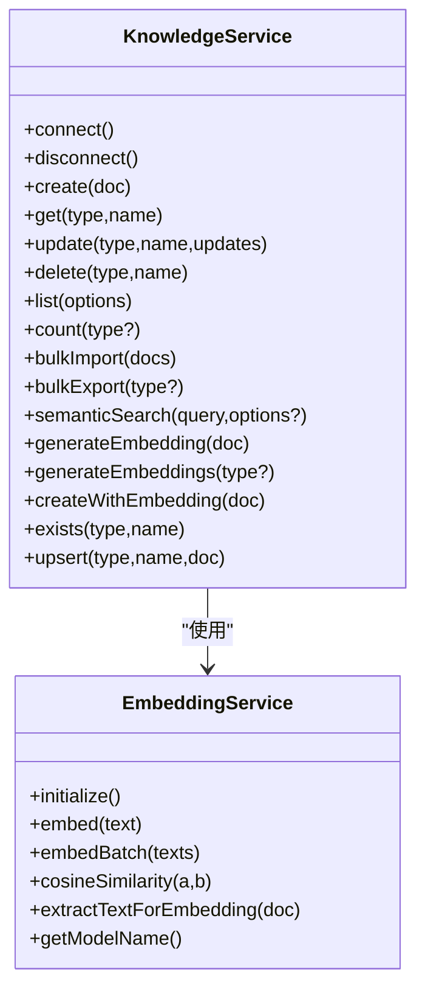
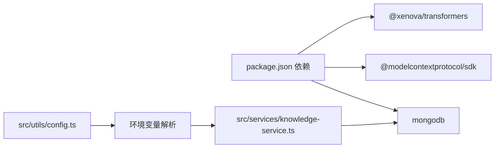

# 备份与恢复

<cite>
**本文引用的文件**
- [package.json](file://package.json)
- [src/index.ts](file://src/index.ts)
- [src/utils/config.ts](file://src/utils/config.ts)
- [src/services/knowledge-service.ts](file://src/services/knowledge-service.ts)
- [src/services/embedding-service.ts](file://src/services/embedding-service.ts)
- [src/tools/knowledge-tools.ts](file://src/tools/knowledge-tools.ts)
- [src/types.ts](file://src/types.ts)
- [examples/mcp-config.json](file://examples/mcp-config.json)
- [sync-data.mjs](file://sync-data.mjs)
</cite>

## 目录
1. [简介](#简介)
2. [项目结构](#项目结构)
3. [核心组件](#核心组件)
4. [架构总览](#架构总览)
5. [详细组件分析](#详细组件分析)
6. [依赖关系分析](#依赖关系分析)
7. [性能考量](#性能考量)
8. [故障排查指南](#故障排查指南)
9. [结论](#结论)
10. [附录](#附录)

## 简介
本策略文档围绕 MongoDB 数据库的备份与灾难恢复，结合本仓库中知识库数据的组织与访问模式，给出一套完整的备份方案、增量与全量策略、导出/导入/迁移方法、验证与恢复测试流程、监控机制、RTO/RPO 指标与业务连续性计划，并补充自动化脚本、存储与归档策略、数据一致性检查、备份加密与安全传输建议。由于本仓库未内置 MongoDB 备份脚本，本文以“知识库数据”为对象，提供可落地的备份与恢复实践，同时给出与 MongoDB 生态一致的备份策略建议。

## 项目结构
本项目是一个基于 MCP 协议的知识库管理服务，核心围绕 MongoDB 存储与工具集，提供知识文档的增删改查、批量导入导出、语义检索与嵌入生成功能。项目结构如下图所示：

**图表来源**
- [src/index.ts](file://src/index.ts#L1-L148)
- [src/utils/config.ts](file://src/utils/config.ts#L1-L147)
- [src/services/knowledge-service.ts](file://src/services/knowledge-service.ts#L1-L404)
- [src/services/embedding-service.ts](file://src/services/embedding-service.ts#L1-L148)
- [src/tools/knowledge-tools.ts](file://src/tools/knowledge-tools.ts#L1-L1093)
- [src/types.ts](file://src/types.ts#L1-L269)

**章节来源**
- [src/index.ts](file://src/index.ts#L1-L148)
- [src/utils/config.ts](file://src/utils/config.ts#L1-L147)
- [src/services/knowledge-service.ts](file://src/services/knowledge-service.ts#L1-L404)
- [src/services/embedding-service.ts](file://src/services/embedding-service.ts#L1-L148)
- [src/tools/knowledge-tools.ts](file://src/tools/knowledge-tools.ts#L1-L1093)
- [src/types.ts](file://src/types.ts#L1-L269)

## 核心组件
- 知识服务：负责连接 MongoDB、维护索引、提供 CRUD、批量导入导出、语义检索与嵌入生成等能力。
- 嵌入服务：基于 Transformers.js 懒加载模型，提供文本向量化与相似度计算。
- 工具集：封装 MCP 工具，统一暴露知识库的增删改查、统计、UPsert、快捷工具等。
- 配置与类型：定义环境变量解析、日志级别、用户上下文、知识文档类型与字段。

这些组件共同支撑知识库数据的持久化、检索与管理，是制定备份与恢复策略的重要依据。

**章节来源**
- [src/services/knowledge-service.ts](file://src/services/knowledge-service.ts#L1-L404)
- [src/services/embedding-service.ts](file://src/services/embedding-service.ts#L1-L148)
- [src/tools/knowledge-tools.ts](file://src/tools/knowledge-tools.ts#L1-L1093)
- [src/utils/config.ts](file://src/utils/config.ts#L1-L147)
- [src/types.ts](file://src/types.ts#L1-L269)

## 架构总览
下图展示了知识库数据在系统中的流转与存储关系，以及与外部 MongoDB 的交互：

**图表来源**
- [src/index.ts](file://src/index.ts#L87-L145)
- [src/utils/config.ts](file://src/utils/config.ts#L76-L91)
- [src/services/knowledge-service.ts](file://src/services/knowledge-service.ts#L44-L87)
- [src/services/embedding-service.ts](file://src/services/embedding-service.ts#L24-L51)

**章节来源**
- [src/index.ts](file://src/index.ts#L87-L145)
- [src/utils/config.ts](file://src/utils/config.ts#L76-L91)
- [src/services/knowledge-service.ts](file://src/services/knowledge-service.ts#L44-L87)
- [src/services/embedding-service.ts](file://src/services/embedding-service.ts#L24-L51)

## 详细组件分析

### 知识服务与数据模型
- 数据模型：统一的文档结构包含类型、名称、内容、描述、标签、启用状态、用户/设备/IDE 来源、同步版本、时间戳、向量嵌入等字段。
- 索引策略：为用户级唯一性、类型过滤、设备过滤、标签过滤、时间排序建立复合索引，保障查询与去重效率。
- 批量能力：支持批量导入与导出，便于备份与迁移。
- 语义检索：通过嵌入服务生成向量，进行相似度匹配与过滤。

**图表来源**
- [src/types.ts](file://src/types.ts#L24-L74)

**章节来源**
- [src/types.ts](file://src/types.ts#L1-L269)
- [src/services/knowledge-service.ts](file://src/services/knowledge-service.ts#L71-L87)
- [src/services/knowledge-service.ts](file://src/services/knowledge-service.ts#L244-L267)

### 嵌入服务与向量检索
- 懒加载模型：首次使用时初始化 Transformers.js 模型，避免启动时资源占用。
- 向量生成：对文档的名称、描述、内容与标签进行拼接，截断长度后生成向量。
- 相似度计算：使用余弦相似度进行匹配，支持阈值与上限控制。

**图表来源**
- [src/services/embedding-service.ts](file://src/services/embedding-service.ts#L24-L51)
- [src/services/embedding-service.ts](file://src/services/embedding-service.ts#L56-L65)
- [src/services/embedding-service.ts](file://src/services/embedding-service.ts#L85-L104)

**章节来源**
- [src/services/embedding-service.ts](file://src/services/embedding-service.ts#L1-L148)
- [src/services/knowledge-service.ts](file://src/services/knowledge-service.ts#L272-L299)

### 工具集与 MCP 接口
- 工具覆盖：通用 CRUD、UPsert、统计、批量导出、快捷工具（记忆、经验、命令、上下文、MCP 同步）。
- 输入校验：基于 Zod Schema 的输入校验，保证调用参数正确性。
- 结果统一：返回标准化结构，包含成功标志、数据与消息。

**图表来源**
- [src/services/knowledge-service.ts](file://src/services/knowledge-service.ts#L20-L403)
- [src/services/embedding-service.ts](file://src/services/embedding-service.ts#L11-L147)

**章节来源**
- [src/tools/knowledge-tools.ts](file://src/tools/knowledge-tools.ts#L1-L1093)
- [src/services/knowledge-service.ts](file://src/services/knowledge-service.ts#L111-L190)
- [src/services/knowledge-service.ts](file://src/services/knowledge-service.ts#L244-L267)

## 依赖关系分析
- 运行时依赖：MongoDB 驱动、MCP SDK、Transformers.js。
- 配置来源：环境变量优先级（MCP 客户端传入 > 系统环境变量 > 默认值）。
- 数据一致性：通过用户级唯一索引与 UPsert 语义，避免重复与冲突；同步版本号用于追踪变更。

**图表来源**
- [package.json](file://package.json#L30-L42)
- [src/utils/config.ts](file://src/utils/config.ts#L76-L91)
- [src/services/knowledge-service.ts](file://src/services/knowledge-service.ts#L44-L54)

**章节来源**
- [package.json](file://package.json#L30-L42)
- [src/utils/config.ts](file://src/utils/config.ts#L76-L91)
- [src/services/knowledge-service.ts](file://src/services/knowledge-service.ts#L44-L54)

## 性能考量
- 查询性能：为用户维度建立复合索引，减少扫描范围；分页与限制结果数避免大结果集。
- 嵌入性能：懒加载模型，批量生成向量时注意内存与并发；合理设置阈值与上限。
- 导入导出：批量导入/导出适合离线作业，避免阻塞在线查询；建议在低峰时段执行。

[本节为通用指导，无需特定文件引用]

## 故障排查指南
- 连接失败：检查 MongoDB URI、网络连通性与认证配置；查看日志级别与错误输出。
- 索引缺失：确认集合索引创建成功；必要时重建索引。
- 工具调用异常：核对输入参数与必填字段；查看工具处理器返回的错误信息。
- 嵌入服务初始化慢：首次加载模型耗时较长属正常；可通过预热或缓存策略优化。

**章节来源**
- [src/utils/config.ts](file://src/utils/config.ts#L120-L146)
- [src/services/knowledge-service.ts](file://src/services/knowledge-service.ts#L44-L54)
- [src/tools/knowledge-tools.ts](file://src/tools/knowledge-tools.ts#L109-L155)

## 结论
本策略以知识库数据为核心，结合项目现有能力，提出可操作的备份与恢复方案。通过批量导出/导入、UPsert 语义与索引设计，既能满足日常增量备份需求，也能支撑灾难恢复场景。建议配合 MongoDB 生态的物理/逻辑备份工具完善 RTO/RPO 指标与业务连续性计划。

[本节为总结，无需特定文件引用]

## 附录

### 备份与恢复策略

- 备份目标
  - 知识库集合：Memories、Skills、Rules、MCPs、Experiences、Commands、Contexts、Workflows。
  - 元数据：索引定义、集合统计、嵌入模型与版本信息。

- 全量备份
  - 使用知识服务批量导出：在低峰时段执行，生成 JSON 文件作为全量备份。
  - 备份内容包含：文档 ID、类型、名称、内容、描述、标签、启用状态、用户/设备/IDE 来源、时间戳、嵌入向量与模型信息。
  - 建议：对导出文件进行压缩与分片，便于传输与存储。

- 增量备份
  - 基于同步版本号与更新时间：定期导出最近变更的文档，减少数据量。
  - 建议：记录上次备份时间戳，仅导出 updatedAt 大于该时间的文档。

- 导出/导入/迁移
  - 导出：使用批量导出接口，按类型筛选或全量导出。
  - 导入：使用批量导入接口，支持幂等写入；若存在同名文档则按 UPsert 语义处理。
  - 迁移：在不同数据库/集合间执行导出-导入；注意用户上下文与设备标识的映射。

- 备份验证
  - 校验数量：比较导出前后的文档数量与类型分布。
  - 校验一致性：随机抽样文档，比对内容与元数据；验证嵌入向量与模型版本。
  - 回放测试：将备份导入到测试环境，执行常用查询与语义检索，验证功能正常。

- 恢复测试
  - 端到端演练：模拟故障场景，从备份恢复到新环境，验证 MCP 服务可用性。
  - 性能回归：对比恢复前后查询延迟与吞吐，确保满足 SLA。

- 监控机制
  - 连接监控：记录连接状态、失败次数与重试策略。
  - 备份监控：记录备份任务的开始/结束时间、大小、成功率与告警。
  - 恢复监控：记录恢复任务的执行日志与验证结果。

- RTO/RPO 指标
  - RPO：以增量备份频率为准，建议每日全量+每小时增量，目标 RPO ≤ 1 小时。
  - RTO：以恢复演练为准，目标 RTO ≤ 2 小时（含导入与验证）。

- 业务连续性计划
  - 多地备份：至少两个地理位置的副本。
  - 自动化：通过定时任务与脚本实现无人值守备份与恢复。
  - 人员培训：定期演练，确保团队熟悉流程与工具。

[本节为通用指导，无需特定文件引用]

### 自动化脚本与存储管理

- 自动化脚本建议
  - 备份脚本：定时执行批量导出，生成带时间戳的文件名，上传到对象存储或本地归档。
  - 恢复脚本：从备份源拉取最新文件，执行批量导入；支持回滚到上一个版本。
  - 验证脚本：执行一致性检查与查询回归测试，输出报告并发送告警。

- 存储管理
  - 生命周期策略：按时间保留备份，过期自动清理；保留最近 N 份全量与 M 份增量。
  - 压缩与加密：对备份文件进行压缩与加密，确保传输与静态安全。
  - 分层存储：热数据在线，温数据归档，冷数据离线。

- 备份加密与安全传输
  - 加密：使用对称加密算法保护备份文件；密钥轮换与权限控制。
  - 传输：通过 HTTPS/SSH/加密通道传输；校验完整性（哈希）。

[本节为通用指导，无需特定文件引用]

### 与 MongoDB 生态的对接建议
- 物理备份：使用 MongoDB 企业版快照或第三方工具进行物理备份，确保 RPO/RTO 指标。
- 逻辑备份：使用 mongodump/mongoexport 生成逻辑备份，便于跨版本迁移。
- 增量备份：结合 oplog 或变更流（Change Stream）实现近实时增量备份。
- 复制集/分片：在高可用架构下实施备份策略，确保主从切换不影响备份作业。

[本节为通用指导，无需特定文件引用]

### 示例配置参考
- MCP 配置示例展示了不同 IDE 的环境变量设置，可用于统一知识库数据库与用户上下文的配置。

**章节来源**
- [examples/mcp-config.json](file://examples/mcp-config.json#L1-L94)

### 同步脚本参考
- 同步脚本演示了如何连接 MongoDB、创建索引、插入/更新知识库文档，并记录同步版本号，可作为批量导入/导出的参考实现。

**章节来源**
- [sync-data.mjs](file://sync-data.mjs#L1-L306)