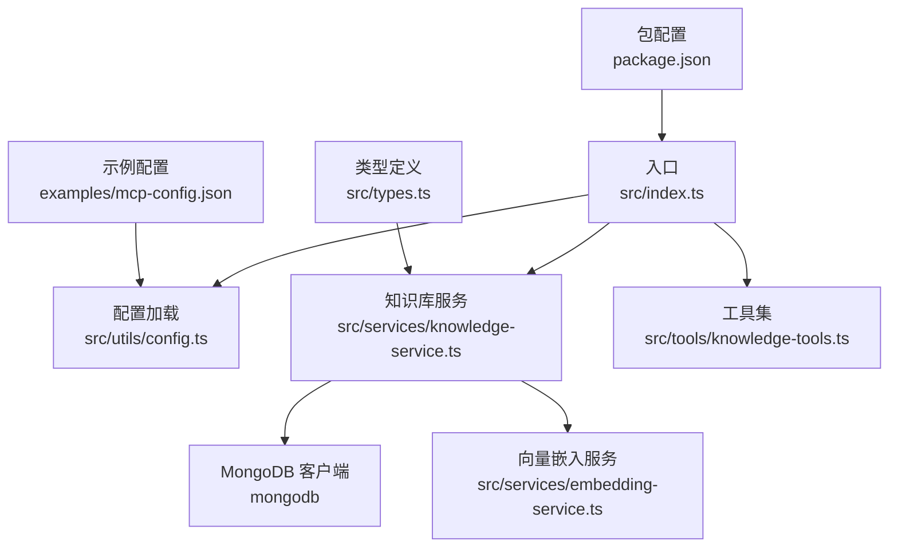
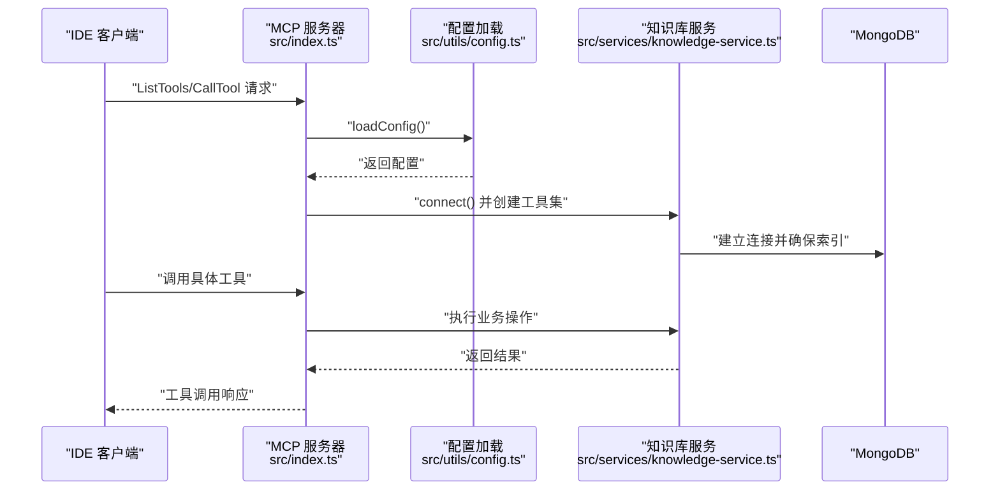
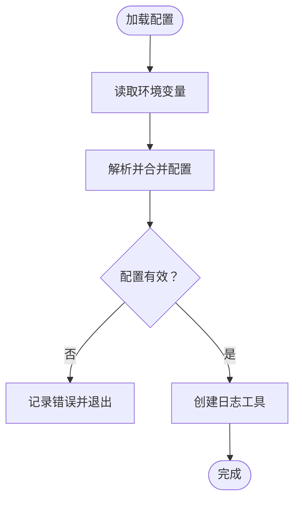
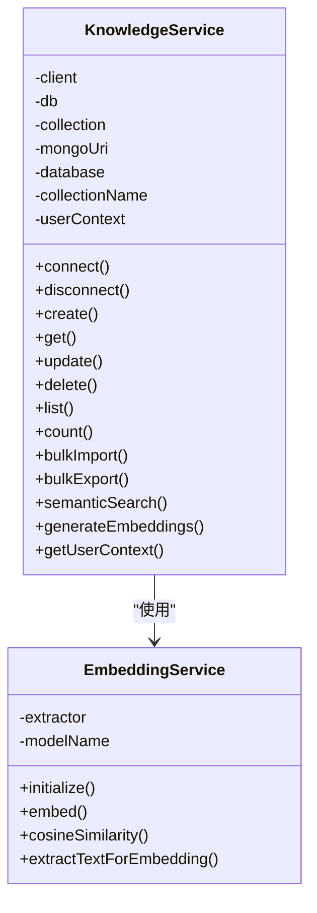
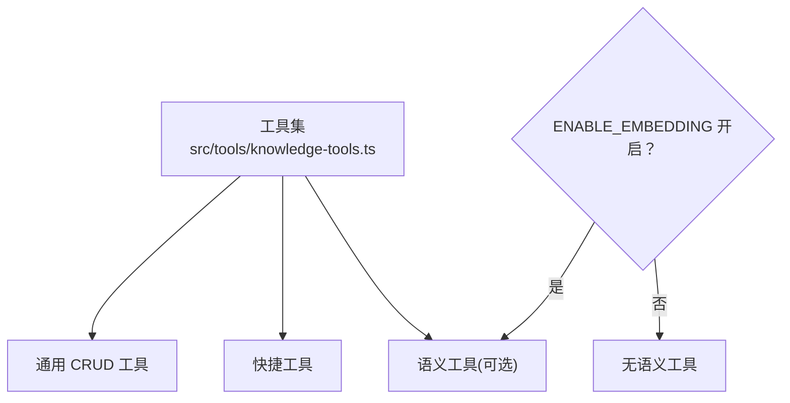
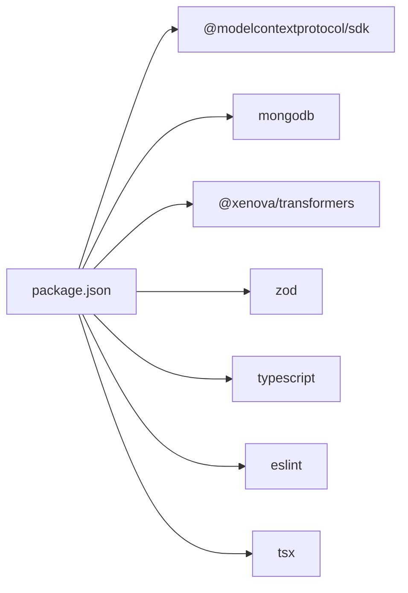

# 安全运维

<cite>
**本文引用的文件**
- [package.json](file://package.json)
- [tsconfig.json](file://tsconfig.json)
- [examples/mcp-config.json](file://examples/mcp-config.json)
- [src/index.ts](file://src/index.ts)
- [src/utils/config.ts](file://src/utils/config.ts)
- [src/types.ts](file://src/types.ts)
- [src/services/knowledge-service.ts](file://src/services/knowledge-service.ts)
- [src/services/embedding-service.ts](file://src/services/embedding-service.ts)
- [src/tools/knowledge-tools.ts](file://src/tools/knowledge-tools.ts)
</cite>

## 目录
1. [简介](#简介)
2. [项目结构](#项目结构)
3. [核心组件](#核心组件)
4. [架构总览](#架构总览)
5. [详细组件分析](#详细组件分析)
6. [依赖关系分析](#依赖关系分析)
7. [性能与安全特性](#性能与安全特性)
8. [安全运维指南](#安全运维指南)
9. [故障排查](#故障排查)
10. [结论](#结论)

## 简介
本指南面向安全运维与防护策略，结合仓库中的配置、工具与服务实现，系统性地给出网络安全、数据库安全、认证授权、访问控制、数据加密与密钥管理、安全审计、漏洞扫描与渗透测试、用户权限与会话管理、安全日志记录以及安全事件响应与应急处置的实操建议。文档以“可落地”为目标，既覆盖高层策略，也提供与代码实现相对应的落地要点。

## 项目结构
该仓库是一个基于 Node.js 的 MCP 服务器，通过标准输入输出与 IDE 通信，使用 MongoDB 存储知识库数据，并提供多种工具用于知识的增删改查、统计、批量导出以及可选的语义搜索能力。关键目录与文件如下：
- 配置与入口
  - 入口文件：src/index.ts
  - 配置解析：src/utils/config.ts
  - 类型定义：src/types.ts
- 服务层
  - 知识库服务：src/services/knowledge-service.ts
  - 向量嵌入服务：src/services/embedding-service.ts
- 工具层
  - 知识工具集：src/tools/knowledge-tools.ts
- 示例与构建
  - 示例配置：examples/mcp-config.json
  - 构建配置：tsconfig.json
  - 包管理：package.json

图表来源
- [src/index.ts](file://src/index.ts#L1-L148)
- [src/utils/config.ts](file://src/utils/config.ts#L1-L147)
- [src/services/knowledge-service.ts](file://src/services/knowledge-service.ts#L1-L404)
- [src/services/embedding-service.ts](file://src/services/embedding-service.ts#L1-L148)
- [src/tools/knowledge-tools.ts](file://src/tools/knowledge-tools.ts#L1-L1093)
- [examples/mcp-config.json](file://examples/mcp-config.json#L1-L94)
- [package.json](file://package.json#L1-L48)

章节来源
- [src/index.ts](file://src/index.ts#L1-L148)
- [src/utils/config.ts](file://src/utils/config.ts#L1-L147)
- [src/services/knowledge-service.ts](file://src/services/knowledge-service.ts#L1-L404)
- [src/services/embedding-service.ts](file://src/services/embedding-service.ts#L1-L148)
- [src/tools/knowledge-tools.ts](file://src/tools/knowledge-tools.ts#L1-L1093)
- [examples/mcp-config.json](file://examples/mcp-config.json#L1-L94)
- [package.json](file://package.json#L1-L48)
- [tsconfig.json](file://tsconfig.json#L1-L21)

## 核心组件
- 配置与日志
  - 从环境变量加载配置，支持 IDE 来源、数据库连接、集合、用户与设备标识、嵌入开关与日志级别；提供配置校验与日志工具。
- 知识库服务
  - 封装 MongoDB 连接、索引、CRUD、批量导入导出、统计、语义搜索与嵌入生成；按用户维度隔离数据。
- 向量嵌入服务
  - 基于 Transformers.js 的特征提取，支持懒加载、余弦相似度计算与文本抽取。
- 工具集
  - 提供通用 CRUD、统计、批量导出、快捷工具（记忆、经验、命令、上下文、MCP/规则/技能/工作流同步）、可选语义搜索与嵌入生成工具。

章节来源
- [src/utils/config.ts](file://src/utils/config.ts#L76-L147)
- [src/services/knowledge-service.ts](file://src/services/knowledge-service.ts#L20-L404)
- [src/services/embedding-service.ts](file://src/services/embedding-service.ts#L11-L148)
- [src/tools/knowledge-tools.ts](file://src/tools/knowledge-tools.ts#L29-L1093)

## 架构总览
下图展示了 MCP 服务器的运行时交互：IDE 通过标准输入输出与服务器通信，服务器根据配置连接 MongoDB 并提供工具集。

图表来源
- [src/index.ts](file://src/index.ts#L87-L145)
- [src/utils/config.ts](file://src/utils/config.ts#L76-L91)
- [src/services/knowledge-service.ts](file://src/services/knowledge-service.ts#L44-L54)

章节来源
- [src/index.ts](file://src/index.ts#L87-L145)
- [src/utils/config.ts](file://src/utils/config.ts#L76-L91)
- [src/services/knowledge-service.ts](file://src/services/knowledge-service.ts#L44-L54)

## 详细组件分析

### 配置与日志组件
- 配置来源与优先级
  - MCP 客户端传入的环境变量优先于系统环境变量，再降级到内置默认值。
- 关键配置项
  - MONGO_URI、MONGO_DATABASE、MONGO_COLLECTION、USER_ID、DEVICE_ID、IDE_SOURCE、ENABLE_EMBEDDING、LOG_LEVEL。
- 校验与日志
  - 校验必填项；日志级别按等级输出，便于生产与调试阶段切换。

图表来源
- [src/utils/config.ts](file://src/utils/config.ts#L76-L115)

章节来源
- [src/utils/config.ts](file://src/utils/config.ts#L76-L147)

### 知识库服务组件
- 数据隔离与同步
  - 通过 userId、deviceId、ideSource 实现用户级隔离与跨设备同步；提供唯一索引与常用查询索引。
- 语义搜索与嵌入
  - 支持生成嵌入与语义相似度检索；可按类型过滤与阈值控制。
- 批量操作
  - 支持批量导入导出与统计。

图表来源
- [src/services/knowledge-service.ts](file://src/services/knowledge-service.ts#L20-L404)
- [src/services/embedding-service.ts](file://src/services/embedding-service.ts#L11-L148)

章节来源
- [src/services/knowledge-service.ts](file://src/services/knowledge-service.ts#L20-L404)
- [src/services/embedding-service.ts](file://src/services/embedding-service.ts#L11-L148)

### 工具集组件
- 通用工具
  - knowledge_create、knowledge_read、knowledge_update、knowledge_delete、knowledge_list、knowledge_stats、knowledge_upsert、knowledge_export。
- 快捷工具
  - memory_add、memory_search、experience_add、command_add、context_set、mcp_sync、rule_sync、skill_sync、workflow_create。
- 语义工具（可选）
  - semantic_search、generate_embeddings（当 ENABLE_EMBEDDING 为真时启用）。

图表来源
- [src/tools/knowledge-tools.ts](file://src/tools/knowledge-tools.ts#L29-L1093)

章节来源
- [src/tools/knowledge-tools.ts](file://src/tools/knowledge-tools.ts#L29-L1093)

## 依赖关系分析
- 运行时依赖
  - @modelcontextprotocol/sdk：MCP 协议与传输
  - mongodb：MongoDB 客户端
  - @xenova/transformers：向量嵌入模型
  - zod：类型校验（在配置解析中未直接使用，但可作为扩展）
- 开发依赖
  - TypeScript、ESLint、tsx 等

图表来源
- [package.json](file://package.json#L30-L46)

章节来源
- [package.json](file://package.json#L30-L46)

## 性能与安全特性
- 性能
  - 索引设计：按用户+类型、用户+设备、标签、时间排序等建立索引，提升查询效率。
  - 嵌入懒加载：首次使用时初始化模型，避免冷启动开销。
  - 语义搜索阈值与限制：可控制相似度阈值与返回条数，平衡准确率与性能。
- 安全
  - 用户隔离：所有操作均以 userId 为过滤条件，避免跨用户数据泄露。
  - 设备与 IDE 标识：便于审计与溯源。
  - 日志级别可控：生产环境建议使用 info 或更高级别，避免敏感信息泄露。

章节来源
- [src/services/knowledge-service.ts](file://src/services/knowledge-service.ts#L71-L87)
- [src/services/embedding-service.ts](file://src/services/embedding-service.ts#L24-L51)
- [src/utils/config.ts](file://src/utils/config.ts#L120-L146)

## 安全运维指南

### 网络安全与防火墙规则
- 端口管理
  - MCP 服务器通过标准输入输出与 IDE 通信，无需开放网络端口；仅在本地运行，避免暴露至公网。
- 网络隔离
  - 在容器或虚拟机中运行，限制对外出站访问；仅允许必要的内网访问（如数据库所在网络）。
- 防火墙策略
  - 默认拒绝所有入站连接，仅放行必需的本地回环通信；如需远程运维，使用跳板机或 VPN。

### 数据库安全配置
- 连接与凭据
  - 使用强密码与最小权限账户；在示例配置中演示了用户名密码与 SRV 连接串，建议在生产中使用 TLS 与认证。
- 索引与查询
  - 已按用户维度建立唯一索引与复合索引，防止重复与提升查询性能；确保查询始终带用户过滤条件。
- 备份与恢复
  - 定期备份 MongoDB；验证备份可恢复性；对备份进行加密存储。

章节来源
- [examples/mcp-config.json](file://examples/mcp-config.json#L83-L88)
- [src/services/knowledge-service.ts](file://src/services/knowledge-service.ts#L74-L86)

### 认证授权与访问控制
- 用户隔离
  - 所有数据库操作均以 userId 过滤，确保跨用户不可见；deviceId 与 ideSource 用于跨设备同步与审计。
- 工具权限
  - 工具集为只读/写入操作集合，建议在 IDE 端限制工具可见性与调用范围，避免误用。
- 最小权限原则
  - 数据库连接账户仅授予必要权限（读写知识库集合），避免管理员权限。

章节来源
- [src/services/knowledge-service.ts](file://src/services/knowledge-service.ts#L92-L106)
- [src/tools/knowledge-tools.ts](file://src/tools/knowledge-tools.ts#L36-L107)

### 数据加密与密钥管理
- 传输加密
  - 使用 TLS 连接 MongoDB；在示例中演示了 SRV 连接串，建议配合证书校验。
- 静态加密
  - 对备份文件进行加密存储；密钥由安全系统管理，定期轮换。
- 密钥轮换
  - 建立密钥轮换流程，确保旧密钥及时停用；对受影响的数据进行重新加密。

### 安全审计与日志
- 日志级别
  - 生产环境使用 info 或更高级别；避免输出敏感字段（如连接串、用户内容）。
- 审计字段
  - 记录 USER_ID、DEVICE_ID、IDE_SOURCE、操作类型、时间戳、结果状态；便于追踪与取证。
- 日志保留与归档
  - 制定日志保留周期；定期归档并脱敏处理。

章节来源
- [src/utils/config.ts](file://src/utils/config.ts#L120-L146)
- [src/services/knowledge-service.ts](file://src/services/knowledge-service.ts#L99-L106)

### 漏洞扫描与渗透测试
- 依赖扫描
  - 使用 npm audit 或 SCA 工具定期扫描依赖漏洞；及时升级高危依赖。
- 配置审计
  - 审核示例配置中的敏感字段（如连接串、用户标识）是否被误提交到版本库。
- 渗透测试
  - 在受控环境中模拟攻击面（如尝试绕过用户过滤、注入等），验证防护有效性。

章节来源
- [package.json](file://package.json#L30-L46)
- [examples/mcp-config.json](file://examples/mcp-config.json#L83-L88)

### 用户权限管理与会话管理
- 权限模型
  - 基于用户维度隔离；设备与 IDE 来源用于跨设备同步与审计。
- 会话管理
  - 服务器为无状态进程，依赖外部会话机制（如 IDE 的登录态）；建议在 IDE 层面实施会话超时与强制登出。

章节来源
- [src/services/knowledge-service.ts](file://src/services/knowledge-service.ts#L92-L106)
- [src/utils/config.ts](file://src/utils/config.ts#L33-L36)

### 安全事件响应与应急处置
- 响应流程
  - 发现异常：立即隔离受影响实例；检查日志与审计记录；评估影响范围。
  - 修复与恢复：修复漏洞或配置问题；验证修复效果；恢复服务。
  - 复盘与改进：总结事件原因；完善监控与告警；更新应急预案。
- 监控与告警
  - 监控数据库连接失败、异常查询、工具调用失败率；设置阈值告警。

[本节为通用指导，无需特定文件来源]

## 故障排查
- 配置校验失败
  - 检查 MONGO_URI、MONGO_DATABASE、MONGO_COLLECTION 是否正确；确认 LOG_LEVEL 合法。
- 数据库连接失败
  - 检查 MongoDB 地址、认证、网络连通性；确认数据库与集合存在。
- 工具调用异常
  - 查看工具返回的错误信息；确认工具输入参数符合 schema；检查 ENABLE_EMBEDDING 与语义工具可用性。
- 嵌入服务初始化慢
  - 首次加载模型耗时较长属正常；可在空闲时段预热或调整模型。

章节来源
- [src/utils/config.ts](file://src/utils/config.ts#L96-L115)
- [src/services/knowledge-service.ts](file://src/services/knowledge-service.ts#L44-L54)
- [src/tools/knowledge-tools.ts](file://src/tools/knowledge-tools.ts#L1029-L1055)
- [src/services/embedding-service.ts](file://src/services/embedding-service.ts#L42-L51)

## 结论
本指南基于仓库现有实现，给出了安全运维与防护策略的系统性建议。通过严格的配置管理、用户隔离、最小权限、日志审计与漏洞扫描，结合完善的事件响应流程，可显著降低安全风险。建议在生产环境中进一步强化传输加密、密钥管理与访问控制，并持续进行安全评估与演练。