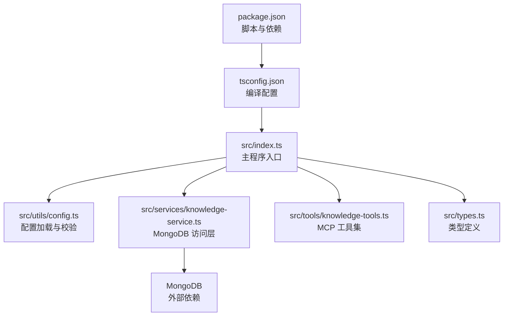
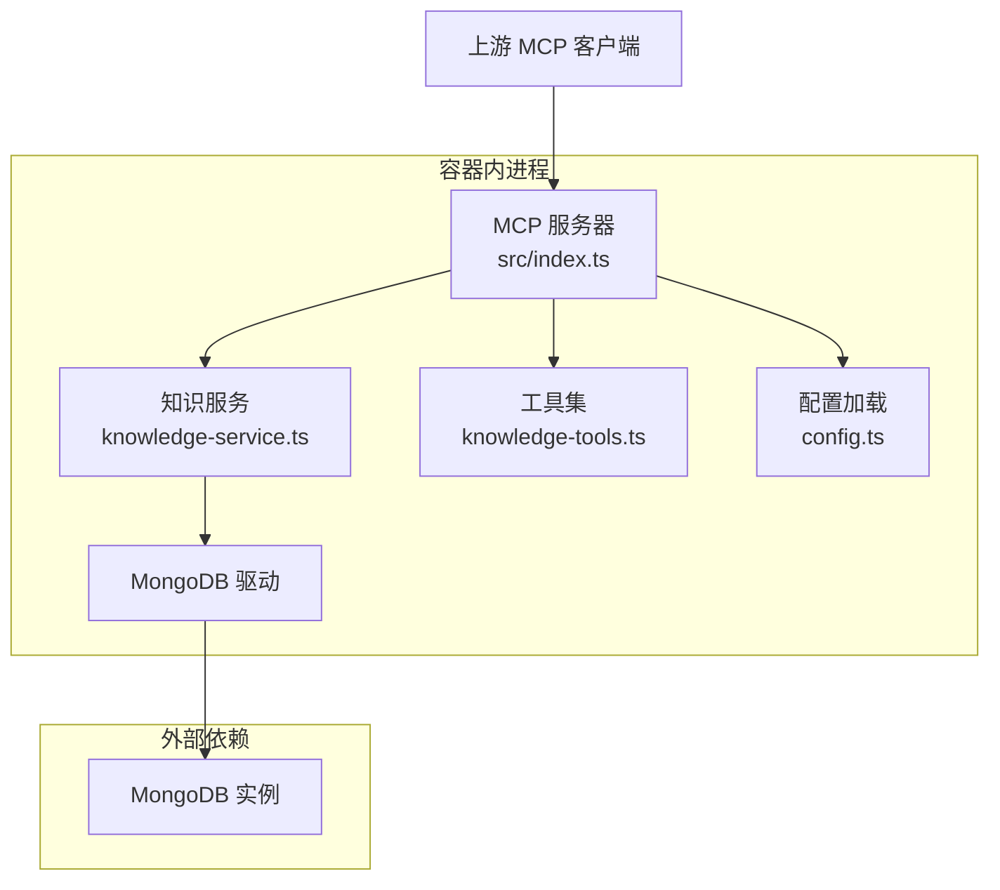
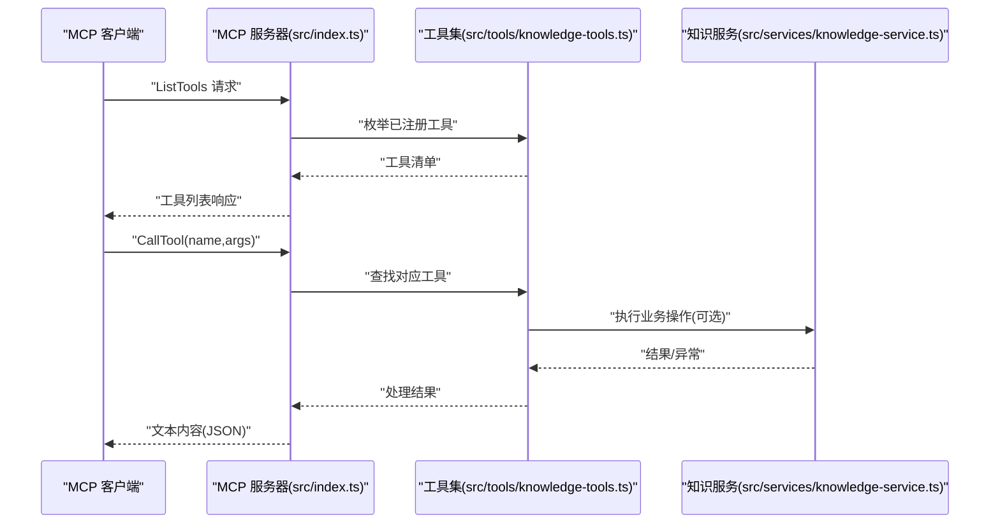
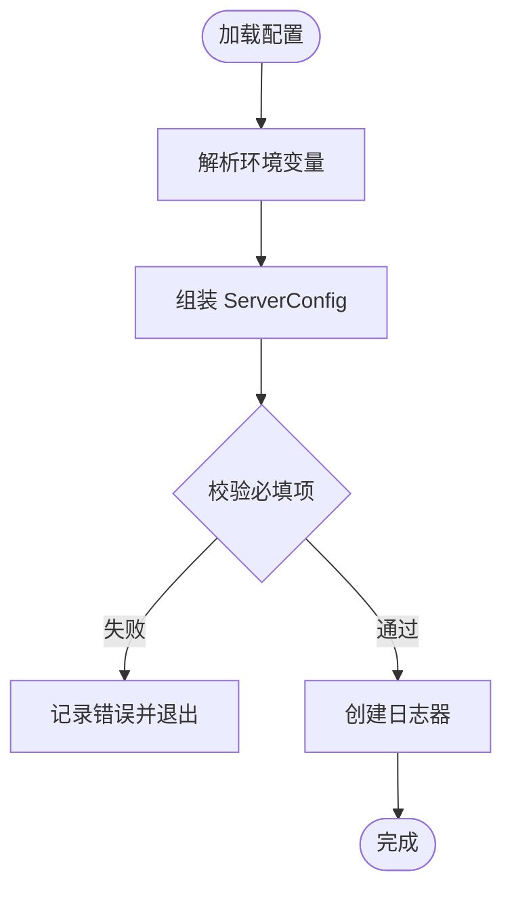
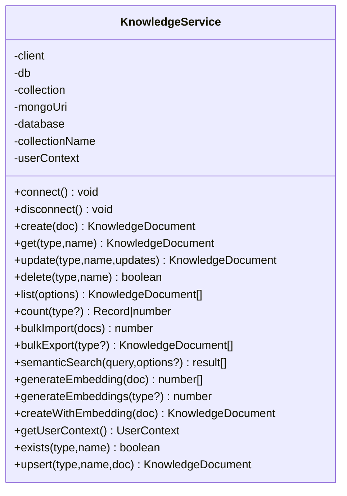
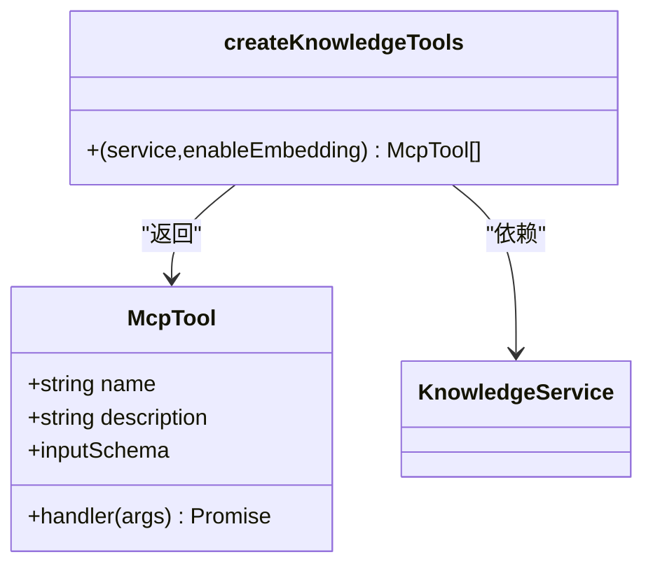
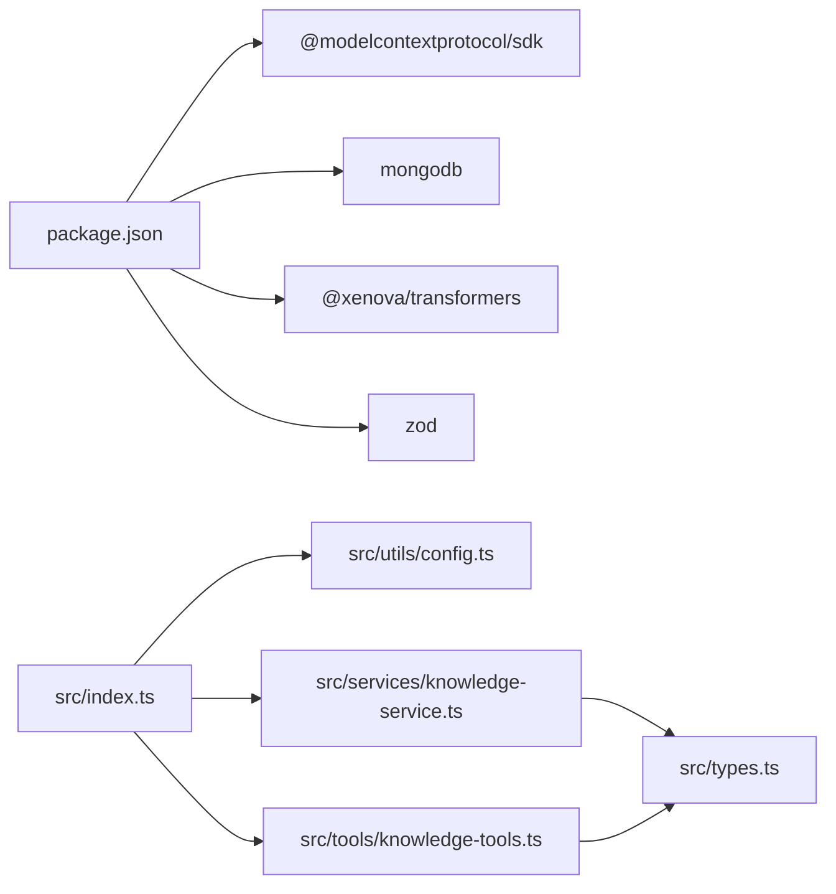

# 容器化部署

<cite>
**本文引用的文件**
- [package.json](file://package.json)
- [tsconfig.json](file://tsconfig.json)
- [src/index.ts](file://src/index.ts)
- [src/utils/config.ts](file://src/utils/config.ts)
- [src/services/knowledge-service.ts](file://src/services/knowledge-service.ts)
- [src/tools/knowledge-tools.ts](file://src/tools/knowledge-tools.ts)
- [src/types.ts](file://src/types.ts)
</cite>

## 目录
1. [简介](#简介)
2. [项目结构](#项目结构)
3. [核心组件](#核心组件)
4. [架构总览](#架构总览)
5. [详细组件分析](#详细组件分析)
6. [依赖关系分析](#依赖关系分析)
7. [性能考虑](#性能考虑)
8. [故障排查指南](#故障排查指南)
9. [结论](#结论)
10. [附录](#附录)

## 简介
本指南面向将该 MongoDB MCP 服务器应用进行容器化部署的工程团队，覆盖以下主题：
- Dockerfile 编写规范与多阶段构建策略
- 镜像构建优化与运行时安全加固
- Docker Compose 服务编排与网络设置
- 容器安全、资源限制与健康检查
- Kubernetes 部署清单（Deployment/Service）与暴露方式
- 监控、日志与调试方法
- 镜像仓库与 CI/CD 自动化集成建议

该应用以 Node.js + TypeScript 实现，使用 MongoDB 作为持久化存储，通过 MCP 协议提供工具能力。部署目标是稳定、可扩展且安全的生产环境。

## 项目结构
该仓库采用基于功能模块的组织方式，核心入口位于 src/index.ts，配置解析在 utils/config.ts，数据访问在 services/knowledge-service.ts，工具集在 tools/knowledge-tools.ts，类型定义在 types.ts。TypeScript 编译输出目录为 dist，Node 引导入口为 dist/index.js。

图表来源
- [package.json](file://package.json#L1-L48)
- [tsconfig.json](file://tsconfig.json#L1-L21)
- [src/index.ts](file://src/index.ts#L1-L148)
- [src/utils/config.ts](file://src/utils/config.ts#L1-L147)
- [src/services/knowledge-service.ts](file://src/services/knowledge-service.ts#L1-L404)
- [src/tools/knowledge-tools.ts](file://src/tools/knowledge-tools.ts#L1-L800)
- [src/types.ts](file://src/types.ts#L1-L269)

章节来源
- [package.json](file://package.json#L1-L48)
- [tsconfig.json](file://tsconfig.json#L1-L21)

## 核心组件
- 入口与生命周期
  - 主程序负责加载配置、校验配置、连接 MongoDB、注册 MCP 工具、启动 stdio 传输并处理优雅退出信号。
- 配置系统
  - 从环境变量加载配置，支持 IDE 来源、日志级别、MongoDB 连接串、数据库与集合名、用户与设备标识、是否启用向量嵌入等。
- 数据访问层
  - 封装 MongoDB 连接、索引保证、CRUD、批量导入导出、语义检索与嵌入生成。
- 工具集
  - 提供通用 CRUD、统计、快捷工具（记忆、经验、命令、上下文、MCP/规则同步）等 MCP 工具，统一输入 Schema 与错误处理。
- 类型系统
  - 定义八种知识文档类型及通用请求/查询选项，确保工具调用与存储一致性。

章节来源
- [src/index.ts](file://src/index.ts#L1-L148)
- [src/utils/config.ts](file://src/utils/config.ts#L1-L147)
- [src/services/knowledge-service.ts](file://src/services/knowledge-service.ts#L1-L404)
- [src/tools/knowledge-tools.ts](file://src/tools/knowledge-tools.ts#L1-L800)
- [src/types.ts](file://src/types.ts#L1-L269)

## 架构总览
应用采用“MCP 服务器 + MongoDB”的双层架构。MCP 服务器通过 stdio 与上游客户端交互，内部通过知识服务访问 MongoDB。配置与日志由工具函数提供，类型系统贯穿工具与存储层。

图表来源
- [src/index.ts](file://src/index.ts#L1-L148)
- [src/utils/config.ts](file://src/utils/config.ts#L1-L147)
- [src/services/knowledge-service.ts](file://src/services/knowledge-service.ts#L1-L404)
- [src/tools/knowledge-tools.ts](file://src/tools/knowledge-tools.ts#L1-L800)

## 详细组件分析

### 组件 A：MCP 服务器与 stdio 传输
- 职责
  - 初始化 MCP Server，注册 ListTools 与 CallTool 请求处理器。
  - 基于工具集动态提供能力，统一错误返回格式。
- 关键点
  - 工具调用异常会被捕获并返回结构化错误。
  - 优雅关闭时断开 MongoDB 连接并退出进程。
- 运行模式
  - 以 stdio 模式运行，适合与 MCP 客户端通过标准输入输出通信。

图表来源
- [src/index.ts](file://src/index.ts#L16-L82)
- [src/tools/knowledge-tools.ts](file://src/tools/knowledge-tools.ts#L1-L800)
- [src/services/knowledge-service.ts](file://src/services/knowledge-service.ts#L1-L404)

章节来源
- [src/index.ts](file://src/index.ts#L1-L148)
- [src/tools/knowledge-tools.ts](file://src/tools/knowledge-tools.ts#L1-L800)

### 组件 B：配置加载与校验
- 职责
  - 从环境变量加载配置，支持 IDE 来源、日志级别、MongoDB 连接串、数据库/集合、用户/设备标识、嵌入开关。
  - 校验必要字段，创建按级别过滤的日志器。
- 关键点
  - 配置优先级：MCP 客户端 env > 系统环境变量 > 默认值。
  - 日志器根据当前级别决定输出。

图表来源
- [src/utils/config.ts](file://src/utils/config.ts#L76-L115)

章节来源
- [src/utils/config.ts](file://src/utils/config.ts#L1-L147)

### 组件 C：知识服务与 MongoDB 访问
- 职责
  - 管理 MongoDB 连接、索引、CRUD、批量导入导出、统计、语义检索与嵌入生成。
- 关键点
  - 用户级隔离：通过 userId/deviceId/ideSource 保障跨设备同步与隔离。
  - 索引设计：唯一索引（type+name）、多字段查询索引、时间排序索引。
  - 嵌入：可选的向量相似度检索与批量生成。

图表来源
- [src/services/knowledge-service.ts](file://src/services/knowledge-service.ts#L20-L404)

章节来源
- [src/services/knowledge-service.ts](file://src/services/knowledge-service.ts#L1-L404)

### 组件 D：工具集与 MCP 协议
- 职责
  - 定义工具接口与输入 Schema，实现通用 CRUD、统计、快捷工具（记忆、经验、命令、上下文、MCP/规则同步）。
- 关键点
  - 统一的输入校验与错误返回格式，便于 MCP 客户端消费。
  - 支持嵌入选项控制是否启用向量嵌入。

图表来源
- [src/tools/knowledge-tools.ts](file://src/tools/knowledge-tools.ts#L1-L800)
- [src/services/knowledge-service.ts](file://src/services/knowledge-service.ts#L1-L404)

章节来源
- [src/tools/knowledge-tools.ts](file://src/tools/knowledge-tools.ts#L1-L800)

## 依赖关系分析
- 内部依赖
  - index.ts 依赖 config.ts、knowledge-service.ts、knowledge-tools.ts。
  - knowledge-service.ts 依赖 types.ts。
  - tools/knowledge-tools.ts 依赖 knowledge-service.ts 与 types.ts。
- 外部依赖
  - @modelcontextprotocol/sdk、mongodb、@xenova/transformers、zod 等。
- 构建与运行
  - TypeScript 编译至 dist，运行时入口为 dist/index.js；开发使用 tsx watch。

图表来源
- [package.json](file://package.json#L30-L46)
- [src/index.ts](file://src/index.ts#L1-L148)
- [src/utils/config.ts](file://src/utils/config.ts#L1-L147)
- [src/services/knowledge-service.ts](file://src/services/knowledge-service.ts#L1-L404)
- [src/tools/knowledge-tools.ts](file://src/tools/knowledge-tools.ts#L1-L800)
- [src/types.ts](file://src/types.ts#L1-L269)

章节来源
- [package.json](file://package.json#L1-L48)
- [src/index.ts](file://src/index.ts#L1-L148)

## 性能考虑
- 构建与镜像
  - 使用多阶段构建减少最终镜像体积，仅在运行阶段保留最小依赖。
  - 在构建阶段安装依赖并清理缓存，避免将开发依赖带入运行时。
- 运行时
  - 合理设置 Node.js 运行参数（如内存上限），结合容器资源限制。
  - 为 MongoDB 连接池设置合理大小，避免过度并发导致连接耗尽。
- 数据库
  - 确保必要的复合索引已创建，避免全表扫描。
  - 对高频查询（按 userId/type/name、按标签、按更新时间）进行索引优化。
- 嵌入与向量
  - 仅在需要时启用向量嵌入，避免不必要的计算与存储开销。
  - 批量生成嵌入时分批处理，降低瞬时负载。

## 故障排查指南
- 启动失败
  - 检查配置加载：确认 MONGO_URI、MONGO_DATABASE、MONGO_COLLECTION 是否正确。
  - 查看日志：根据 LOG_LEVEL 输出定位问题。
- 连接 MongoDB 失败
  - 核对网络连通性与认证信息；确认容器网络与服务发现配置。
- 工具调用异常
  - 查看工具返回的错误结构化消息，定位具体工具与输入参数。
- 健康检查
  - 建议实现轻量级 HTTP 探针或通过容器健康检查探测进程存活与端口监听状态。

章节来源
- [src/utils/config.ts](file://src/utils/config.ts#L96-L115)
- [src/index.ts](file://src/index.ts#L116-L144)

## 结论
通过标准化的容器化流程与合理的架构设计，该应用可在多环境中稳定运行。建议在生产中配合 CI/CD 自动化构建与发布，并持续完善监控与告警体系。

## 附录

### A. Dockerfile 编写规范与多阶段构建
- 基础镜像选择
  - 使用官方 Node.js LTS 镜像作为构建与运行基础，确保二进制兼容性与安全性。
- 多阶段构建策略
  - 第一阶段：安装依赖并编译 TypeScript，产物输出至 dist。
  - 第二阶段：仅复制 dist 与运行所需文件，避免携带源码与开发依赖。
- 安全加固
  - 使用非 root 用户运行；禁用不必要的包管理器缓存；最小权限原则。
- 运行参数
  - 设置 NODE_ENV=production；合理设置 Node.js 垃圾回收参数；挂载只读配置卷与可写日志卷。

### B. 镜像构建优化
- 层缓存利用
  - 将变更频率低的指令（如安装依赖）置于上层，变更频繁的指令（如复制源码）置于下层。
- 清理与压缩
  - 构建后清理包管理器缓存；使用更小的基础镜像；启用镜像压缩。
- 产物最小化
  - 仅复制 dist 与运行时必需的资源；排除测试与示例文件。

### C. Docker Compose 配置与服务编排
- 服务定义
  - 定义应用服务与 MongoDB 服务，分别声明环境变量、端口映射、卷挂载与健康检查。
- 网络设置
  - 使用自定义桥接网络，确保服务间通过服务名互通；对外暴露 MCP 通道或 HTTP 探针端口。
- 依赖与启动顺序
  - 通过 depends_on 与 healthcheck 控制启动顺序与依赖可用性。

### D. 容器安全配置、资源限制与健康检查
- 安全
  - 非 root 用户运行；只读根文件系统；最小权限访问数据库；敏感配置通过密钥管理服务注入。
- 资源限制
  - 设置 CPU/内存限制与请求，防止资源争抢；为数据库连接池设置上限。
- 健康检查
  - HTTP 或 TCP 健康检查；对 MCP 通道与数据库连接进行探活。

### E. Kubernetes 部署清单（Deployment/Service）
- Deployment
  - 定义副本数、滚动更新策略、资源请求与限制、安全上下文、环境变量与挂载。
- Service
  - ClusterIP/NodePort/LoadBalancer 三种暴露方式按需选择；为探针端口配置相应端口与协议。
- ConfigMap/Secret
  - 将非敏感配置放入 ConfigMap，敏感信息放入 Secret；通过环境变量或挂载注入。

### F. 监控、日志与调试
- 监控
  - 指标采集：Node.js 应用指标与数据库指标；容器资源使用率。
  - 告警：阈值告警与异常检测；结合日志与指标联动。
- 日志
  - 标准输出与标准错误分离；结构化日志；集中式日志收集与检索。
- 调试
  - 开启调试日志级别；远程调试端口（如适用）；临时开启交互式 shell。

### G. 镜像仓库与 CI/CD 集成
- 镜像仓库
  - 使用企业私有仓库或公共仓库；按版本打标签；启用漏洞扫描。
- CI/CD
  - 构建阶段：拉取依赖、编译、单元测试；打包镜像并推送；多环境部署。
- 自动化
  - GitOps 流程；自动化回滚；蓝绿/金丝雀发布策略。